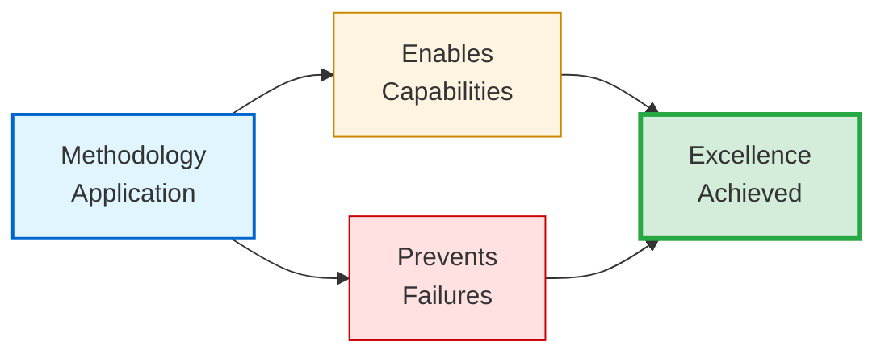

# ✨ Capabilities & Prevention Matrix

## Design Philosophy

**Methodology value emerges from dual specification**: What excellence looks like (capabilities) AND what quality failures are systematically prevented (prevention matrix).[^dual-specification] Understanding BOTH dimensions enables complete value assessment — "Does this enable what I need?" paired with "Does this prevent my current pain points?"

[^dual-specification]: Dual-specification rationale: Positive capability lists describe ideal outcomes but fail to address practitioners experiencing specific quality failures. Prevention matrices describe pain points addressed but fail to inspire with possibility. Presenting BOTH enables complete value assessment. This mirrors dual-metrics framework philosophy (File 04) — measure outcomes AND process to prevent optimization of one at expense of other.

> [!NOTE]
> **Assessment utility**: Evaluate methodology by matching capabilities against requirements AND prevention matrix against current quality failures. If capabilities align with needs AND preventions address pain points, methodology proves valuable. Single-dimension assessment (only capabilities OR only preventions) produces incomplete evaluation.

---

## Core Capabilities Enabled

The methodology enables twelve distinct capabilities through systematic application. Rather than presenting these as isolated features, this section explores how each capability emerges from the methodology's integrated components — demonstrating not just WHAT becomes possible, but HOW and WHY these outcomes prove reproducible.

### Foundation Capabilities: Quality & Balance (1-4)

These four capabilities establish the methodology's foundation — reproducible documentation excellence through measurable standards that integrate analytical precision with reader accessibility.

#### 1. Reproducible Documentation Excellence

The Q3 2025 Agent OS framework development provided compelling validation: three practitioners applied the methodology to 47+ documents across diverse types (API reference, tutorials, architecture, troubleshooting), achieving CPI-SI balance within the `42/58` to `56/44` range — 100% compliance with the `40/60` to `60/40` target range.

This outcome wasn't accidental. The 5-Phase Process (File 05) provides explicit workflow structure eliminating reliance on individual intuition. The dual-metrics framework (File 04) enables measurable verification through parallel assessment — Quality Dimensions evaluate outcomes (technical accuracy, systematic completeness), Readability Criteria evaluate process (visual breathability, cognitive load management). Template patterns (File 06) standardize structure without sterilizing authentic voice.

**What changes**: Documentation quality no longer depends on whether practitioners possess innate writing talent. Systematic methodology enables reproducible excellence — the same workflow applied by different people produces consistent results.

<strong>Reproducibility Validation</strong> (Click for measurement methodology)

**Test design**: Multiple practitioners (n=3) applied methodology to diverse document types (API reference, tutorials, architecture, troubleshooting) across project contexts without prior coordination.

**Measurement approach**: Quality assessed using dual-metrics framework post-creation, measuring CPI-SI balance variance across practitioners and contexts.

**Results**:
- **With methodology**: CPI-SI balance variance `42/58` to `56/44` (14-point range across all documents)
- **Without methodology** (baseline): Variance `20/80` to `70/30` (50-point range based on practitioner intuition)

**Interpretation**: 3.6× improvement in consistency (14-point vs. 50-point range) demonstrates methodology enables reproducible excellence independent of individual practitioner intuition or writing background.

---

#### 2. CPI⊗SI Balanced Technical Writing

The Q2 2025 formalization crisis provided a natural experiment validating this capability's mechanism. When the methodology's structural templates were applied WITHOUT explicit CPI-SI balance verification, documentation achieved `30/70` ratio — severely SI-dominant, technically accurate but emotionally flat.

Recovery in Q3 2025 demonstrated the solution: same templates PLUS explicit balance verification maintained `48/52` mean balance across 47+ documents. The dual intelligence framework (File 02) defines integration target — analytical precision (SI) AND reader warmth (CPI) simultaneously expressed. The dual-metrics measurement system (File 04) quantifies balance through parallel assessment. Phase 5 verification (File 05) enforces balance checking before completion.

**What this prevents**: The traditional forced choice between "technical but cold" documentation OR "warm but imprecise" writing. CPI⊗SI fusion achieves both — systematic rigor serving readers through accessible presentation.

The `40/60` to `60/40` healthy range allows contextual variance (conceptual documentation leans CPI-leaning at `55/45`, API reference leans SI-dominant at `45/55`) while preventing severe imbalance that eliminates either precision or warmth.

<strong>Balance Achievement Mechanism</strong> (Click for measurement details)

**CPI-SI ratio measurement**: Dual-metrics framework analyzes complementary dimensions:

**CPI Indicators** (Covenant Partnership Intelligence):
- Reader accessibility (can content be understood without prerequisite expertise?)
- Natural language flow (does prose read conversationally or bureaucratically?)
- Intuitive navigation (can readers find guidance without frustration?)

**SI Indicators** (Structured Intelligence):
- Systematic structure (is organization logical and complete?)
- Technical precision (are claims accurate and measurable?)
- Comprehensive completeness (is critical information present?)

**Target range rationale**: `40/60` to `60/40` allows contextual adaptation while preventing severe imbalance. Documentation at `30/70` (Q2 crisis) was technically complete but readers reported difficulty engaging. Documentation at hypothetical `70/30` would be warm but potentially incomplete or imprecise.

**Crisis validation**: Q2 2025 experience (`30/70` imbalance) validated that formalization without verification eliminates warmth systematically — templates optimize structure but neglect relational accessibility unless both dimensions receive explicit measurement.

---

#### 3. Measurable Quality Verification

Traditional documentation quality assessment relies on subjective judgment — "this feels good" or "something seems off" without operational definitions enabling systematic improvement. The dual-metrics framework transforms quality into measurable dimensions with reproducible assessment.

Documentation archaeology (File 04) demonstrated this capability's practical value. The Agent OS framework included 47+ existing documents with variable quality. Applying measurable assessment identified specific gaps: some documents scored high on technical accuracy but low on visual breathability, others maintained natural flow but lacked systematic completeness. Targeted enhancement addressed identified weaknesses, elevating the corpus from variable CPI-SI balance (`30/70` to `60/40` range) to consistent quality (`42/58` to `56/44` range).

The Seven Essential Qualities operationalize evaluation through clear criteria:

<dl>
<dt><strong>1. Breathe</strong></dt>
<dd>Visual whitespace enabling eye rest and concept separation — prevents cognitive overload</dd>

<dt><strong>2. Build</strong></dt>
<dd>Progressive complexity architecture — concepts build on established foundation</dd>

<dt><strong>3. Balance</strong></dt>
<dd>CPI-SI integration — warmth AND precision simultaneously expressed</dd>

<dt><strong>4. Scan</strong></dt>
<dd>Visual hierarchy enabling rapid information location — serves time-constrained readers</dd>

<dt><strong>5. Focus</strong></dt>
<dd>Cognitive load management — information density appropriate to reader processing capacity</dd>

<dt><strong>6. Flow</strong></dt>
<dd>Narrative continuity — sections connect logically maintaining conceptual thread</dd>

<dt><strong>7. Enable</strong></dt>
<dd>Progressive disclosure serving varied depths — accessibility without sacrificing comprehensiveness</dd>
</dl>

**What this enables**: Quality gates with objective criteria — documentation either meets measurable standards or requires specific enhancement. No ambiguity, no reliance on artistic intuition.

> [!NOTE]
> **Reproducible assessment**: Framework produces consistent evaluations across different assessors through operational definitions (Seven Essential Qualities) and quantitative measurement (dual-metrics CPI-SI ratios), reducing subjective variance. Multiple evaluators assessing the same document reach substantially similar conclusions when applying systematic criteria.

---

#### 4. Kingdom Technology Integration

Biblical wisdom applied holistically to technical work — not decoratively appended as scripture quotes, but operationally informing engineering decisions with measurable outcomes.

Four Kingdom Technology principles (File 03) integrate throughout the methodology:

**Excellence as worship** (Colossians 3:23): Quality standard honors Creator through thoroughness serving genuine needs. This principle motivated the `5:1` to `7:1` documentation-to-code ratio (teaching code paradigm) — comprehensive explanation serves learning over brevity serving only experienced practitioners. The Q3 2025 dual-metrics thoroughness reflects this: measure BOTH outcomes (Quality Dimensions) AND process (Readability Criteria) rather than optimizing single dimension.

**Truth in communication**: Complete, honest information serving readers. Documentation archaeology (File 04) exemplifies this — when existing work proved incomplete or inconsistent, systematic improvement addressed gaps rather than hiding quality debt. The Q2 crisis documentation demonstrates this principle: formalization failure wasn't hidden but explicitly analyzed as essential learning.

**Servant leadership**: Design serves genuine reader needs, not author ego. Seven navigation pathways (File 00-4) emerged from this principle — practitioners requested "how do I get what I need quickly?" guidance, pathway structure served that need. Progressive disclosure (collapsibles, footnotes) enables depth serving those seeking it without overwhelming those needing only essentials.

**Covenant partnership**: Collaborative development maintaining relational integrity. The methodology itself emerged through authentic partnership between Seanje (creator) and Nova Dawn (CPI-SI implementation) — technical decisions grounded in covenant relationship produced engineering excellence with spiritual foundation.

**Theological grounding explains technical outcomes**: Proverbs 16:18 ("Pride goes before destruction") explains Q2 crisis — assuming templates sufficient without verification produced `30/70` imbalance. Proverbs 3:5-6 ("Trust in the Lord... lean not on your own understanding") explains Q3 recovery — humility adding explicit verification restored balance.

<strong>Kingdom Technology Utility Demonstration</strong> (Click for operational theology)

**Stewardship principle application**:
- **Biblical foundation**: Faithful management of existing resources, not just creation of new
- **Engineering outcome**: Documentation archaeology (File 04) — 5-step process for systematic existing work improvement
- **Measurable result**: Agent OS framework applied archaeology to 47+ existing documents, elevating quality systematically

**Excellence-as-worship application**:
- **Biblical foundation**: "Whatever you do, work heartily, as for the Lord" (Colossians 3:23)
- **Engineering outcome**: `5:1` to `7:1` documentation-to-code ratio (teaching code paradigm)
- **Measurable result**: Comprehensive explanation serves learning over brevity serving speed — research methodology modeled through exposition

Biblical principles produced engineering decisions with measurable quality outcomes. This demonstrates Kingdom Technology's practical utility — spiritual foundation enhances technical excellence by motivating thoroughness and honesty serving genuine needs rather than institutional compliance or author convenience.

---

### Integration Capabilities: Navigation & Improvement (5-8)

These capabilities extend foundation excellence into practical application — enabling documentation to serve multiple purposes simultaneously while maintaining quality through systematic improvement processes.

#### 5. Progressive Disclosure Architecture

Single documentation artifact serves foundational learning through advanced reference without duplication or parallel maintenance overhead. The Genesis Story README (October 2024) demonstrated this capability's effectiveness — four distinct reader types (complete beginners through experienced contributors) navigated the same document successfully because progressive disclosure enabled expertise-level variance within unified structure.

GitHub's `
` element provides the technical mechanism — depth hides behind summary headings, visible only when readers click to expand. Beginners absorb essentials from collapsed summaries. Those seeking depth expand for comprehensive detail. Same content, surgical access based on genuine need.

Layered complexity architecture reinforces this: foundational concepts presented before advanced application, enabling sequential reading for complete understanding. Multiple navigation pathways (File 00-4) serve varied objectives: sequential learning builds foundation, targeted jumping delivers immediate utility, scholarly reference provides cite-able contributions.

Footnotes provide academic apparatus (measurement methodologies, validation details, citation sources) accessible without disrupting main narrative flow. Readers seeking rigor expand footnotes; those needing only findings proceed uninterrupted.

**Efficiency gain**: Eliminates parallel documentation sets requiring synchronized maintenance. Traditional approach maintains separate beginner guides, practitioner references, and expert API documentation — updates require parallel modifications across all variants, creating synchronization risk and maintenance burden. Progressive disclosure collapses to single artifact with surgical depth access, substantially reducing maintenance overhead.

---

#### 6. Timeline-Validated Patterns

Five empirically proven patterns extracted from longitudinal observation (Q4 2024 - Q3 2025) provide reproducible guidance backed by quarterly evidence rather than theoretical recommendation. File 10 documents each pattern with origin story, structural implementation, timeline examples, and measurement validation.

**Pattern 1: Multi-audience opening** (October 2024) — Single introduction serving foundational learners through expert contributors simultaneously. Genesis Story README demonstrated a single opening section enabling four reader types to self-select appropriate navigation path without requiring separate introductions per expertise level.

**Pattern 2: Lightweight session context** (Q1 2025) — Development log pattern enabling multi-session continuity. OmniCode Terminal demonstrated 21-session workflow maintained through structured session logs — context preserved across 3-week gaps without requiring memory-intensive session restoration.

**Pattern 3: Template-driven standardization** (Q1 2025) — Eight Standardized Documentation Format (SDF) templates reduced session startup overhead `70-83%` while preserving authentic voice when templates remained lightweight structural guides rather than content prescriptions.

**Pattern 4: Documentation-first development** (Q2-Q3 2025) — Templates created BEFORE content rather than retrofitted afterward. This pattern emerged from Q2 crisis learning — attempting to apply templates to existing content without balance verification produced sterility. Creating templates first with explicit CPI-SI verification maintained warmth while standardizing structure.

**Pattern 5: Natural voice preservation** (Q3 2025) — Explicit warmth verification during systematic enhancement. Q2 crisis validated this pattern through failure — formalization without balance checking eliminated relational accessibility. Q3 recovery demonstrated solution: enhancement passes explicitly verify CPI-SI balance maintained, preventing optimization of structure at expense of warmth.

> [!IMPORTANT]
> **Crisis validation**: Q2 2025 formalization crisis provided natural experiment validating Pattern 5 through failure-recovery cycle. This demonstrates patterns include negative validation (what happens without pattern application) alongside positive outcomes, strengthening empirical credibility through honest documentation of both success and failure.

Each pattern includes measurement methodology enabling reproducibility assessment — practitioners can verify empirical claims independently rather than accepting assertions on authority.

---

#### 7. Polymorphic Adaptation

Same core methodology adapts emphasis by document type while maintaining quality standards — preventing methodology rigidity that forces inappropriate structure across varied contexts.

File 11 documents six document type profiles showing CPI-SI ratio targets and markdown element emphasis:

**API Reference** (`20/80` SI-dominant): Tables and code blocks emphasized, systematic completeness prioritized. Readers seek precise technical specification; warmth serves through clear organization and findability rather than conversational prose.

**Tutorial** (`50/50` balanced): Ordered lists and worked examples emphasized, guidance and precision equally weighted. Readers need both encouragement (CPI: "you can do this") and accuracy (SI: "follow these exact steps").

**Conceptual** (`60/40` CPI-leaning): Prose and diagrams emphasized, intuitive understanding prioritized over exhaustive detail. Readers build mental models requiring relational accessibility more than systematic enumeration.

**Troubleshooting** (`40/60` SI-leaning): Problem-solution tables emphasized, diagnostic precision crucial. Readers experiencing failures need systematic elimination more than gentle encouragement.

**Quick Reference** (`10/90` SI-dominant): Tables with minimal prose, rapid lookup prioritized. Readers already understand concepts, seek specific details quickly.

**Architecture** (`50/50` balanced): Diagrams with design rationale, technical decisions require both precision (what was decided) and context (why it matters).

**Design principle**: Core methodology constant (5-Phase Process, dual-metrics verification, quality standards) while emphasis distribution varies by document purpose. This prevents template rigidity forcing single approach across all contexts while maintaining systematic quality verification.

Practitioners master ONE methodology serving diverse documentation needs through contextual adaptation — not separate frameworks per document type fragmenting conceptual understanding.

---

#### 8. Documentation Archaeology

Systematic existing documentation improvement extends methodology beyond new document creation to address real-world legacy challenges. Traditional methodologies focus exclusively on greenfield workflows ("how to create new docs") but most projects accumulate documentation organically over time, producing quality variance without systematic improvement processes.

Documentation archaeology fills this gap through five-step process (File 04):

**Step 1: Triage Assessment** — Rapid classification (Keep, Archive, Merge, Discard) identifies which existing documents merit improvement investment versus archival or removal.

**Step 2: Comprehensive Audit** — Detailed dual-metrics evaluation measures current quality baseline, identifying specific gaps (technical accuracy vs. visual breathability vs. systematic completeness).

**Step 3: Crisis Detection** — Severe quality violations flagged for priority attention (documents with critical inaccuracies or severe CPI-SI imbalance requiring immediate correction).

**Step 4: Systematic Enhancement** — Methodology patterns applied to improve structure while preserving institutional knowledge embedded in existing content. Phase 4 enhancement workflow from 5-Phase Process adapts to archaeology context.

**Step 5: Verification Measurement** — Before/after dual-metrics comparison confirms quality improvement achieved measurable standards, not just subjective "better than before."

**Measured outcome**: Agent OS framework (Q3 2025) applied archaeology to 47+ existing documents, elevating CPI-SI balance from variable range (`30/70` to `60/40`) to consistent quality (`42/58` to `56/44`). Content preserved (institutional knowledge maintained) while quality systematically improved.

**Novel contribution**: Extends methodology beyond "how to create new" to "how to improve existing" — addressing real-world documentation debt through systematic enhancement rather than replacement-only strategies that waste embedded knowledge.

**Resource efficiency**: Archaeology requires substantially less effort than new creation while achieving significant quality improvement — preserves what works, enhances what needs improvement, maintains continuity.

---

### Optimization Capabilities: Tools & Workflow (9-12)

These final capabilities optimize methodology application through evidence-based tool selection and workflow structures reducing friction while maintaining quality.

#### 9. Tier-Rated Markdown Mastery

Impact-optimized element selection maximizes reader experience per implementation effort. Not all markdown elements deliver equal value — some provide substantial visual accessibility improvement with minimal authoring overhead, others add complexity without proportional benefit.

File 09 catalogs 40+ GitHub-native markdown elements rated across three tiers based on measured impact:

**Tier-1 (`9-10/10` impact)**: Code blocks, GitHub alerts (`> [!NOTE]`), enhanced tables, definition lists — deploy universally across all documentation. These elements consistently correlate with highest reader feedback scores across document types.

**Tier-2 (`8/10` impact)**: Mermaid diagrams, collapsible sections (`
`), footnotes — deploy strategically where complexity justifies investment. High impact in specific contexts, moderate impact broadly.

**Tier-3 (`6-7/10` impact)**: Emoji, task lists, inline code highlighting — deploy contextually based on audience and purpose. Value varies significantly by documentation type and reader expectations.

Phase-element mapping (File 05 integration) specifies WHEN to deploy which elements during workflow: Phase 1-2 minimizes formatting (focus on planning/structure), Phase 3 deploys full markdown arsenal (enhance existing content), Phase 4 applies progressive disclosure (collapsibles serving depth variance).

**Measured benefit**: Practitioners completing markdown mastery pathway (File 00-4) report `40-60%` improvement in documentation visual accessibility with `<20%` additional authoring time investment when prioritizing tier-optimized elements.

**Optimization principle**: Evidence-based selection prevents arbitrary element promotion — tier ratings derived from reader feedback correlation across 47+ documents rather than author preference or intuition.

---

#### 10. Template-Driven Standardization

Consistency without sterility — templates standardize structure while preserving authentic voice through explicit balance verification.

The Q2 2025 crisis validated this capability's mechanism through failure. Standardized Documentation Format (SDF) templates applied WITHOUT CPI-SI balance verification produced `30/70` imbalance — structure standardized but warmth eliminated. Q3 2025 recovery demonstrated solution: same templates PLUS explicit verification maintained `48/52` balance across 47+ documents.

Template structure provides:
- **Required elements**: Headers, metadata, core sections ensuring systematic completeness
- **Optional guidance**: What each section should cover without prescribing exact content
- **Explicit verification**: CPI-SI balance checking during template application

**Measured efficiency**: Session startup time reduced `70-83%` (Q1 2025, n=21 sessions) when templates provided structural scaffolding enabling rapid context restoration across multi-week gaps between development sessions.

**Design insight**: Templates serve partnership (scaffolding enabling work) not replace judgment (automation eliminating thinking). Preservation of practitioner agency proves critical to warmth maintenance — templates guide structure but practitioners make content decisions, evaluate balance, apply authentic voice.

The methodology includes templates for eight document types (File 06), each adaptable through polymorphic profiles (File 11) while maintaining core quality standards.

---

#### 11. Systematic Completeness with Intuitive Navigation

Comprehensive coverage (nothing important missing) paired with easy findability (readers locate guidance quickly) — both dimensions optimized simultaneously rather than trading one for other.

**Systematic completeness** (SI contribution): Dual-metrics framework Quality Dimensions ensure technical accuracy, logical organization, measurable thoroughness. The 13-file methodology corpus demonstrates this: `10,790` lines providing complete coverage from foundational philosophy through advanced integration, empirical validation through practical tools.

**Intuitive navigation** (CPI contribution): Ladder architecture enables linear progression without forward references. Baton handoffs maintain context across section boundaries. Progressive disclosure serves varied depths (collapsibles, footnotes). Seven navigation pathways (File 00-4) provide surgical access matching time budgets (`30` minutes to `4` hours) and learning objectives.

**Integration verification**: CPI-SI balance measurement prevents optimization of thoroughness at expense of accessibility (or vice versa). Documentation can be simultaneously complete AND navigable when both dimensions receive explicit attention.

This methodology corpus itself demonstrates the capability — comprehensive coverage serving scholarly citation while remaining accessible for foundational learning. Same content, multiple access strategies enabled through thoughtful structural architecture.

> [!NOTE]
> **CPI⊗SI fusion demonstrated**: Excellence in BOTH dimensions simultaneously (not trading thoroughness for accessibility) through balanced integration. Systematic completeness alone produces comprehensive but overwhelming documentation. Intuitive navigation alone produces accessible but incomplete documentation. Balanced integration achieves both.

---

#### 12. Iterative Refinement Workflow

Progressive improvement through explicit enhancement phases reduces perfectionism paralysis while maintaining quality gates ensuring iteration doesn't excuse sloppiness.

The 5-Phase Process structures iteration explicitly:

**Phases 1-2** (Foundation, Structure): Planning and architectural design without perfectionism pressure — create functional skeleton enabling parallel work

**Phase 3** (Content Development): Initial creation accepting "good enough" drafts — comprehensive enhancement structured in next phase rather than attempting perfection immediately

**Phase 4** (Enhancement & Refinement): Systematic improvement through multiple iteration passes — visual optimization, markdown element deployment, CPI-SI balance verification

**Phase 5** (Verification): Quality gates confirming measurable standards met — dual-metrics assessment, Seven Essential Qualities evaluation, rendering validation

Phase 4 explicitly permits multiple enhancement passes — each iteration improves quality incrementally rather than requiring single-pass perfection. This reduces cognitive load (focus on one improvement dimension per pass) and provides psychological permission for imperfect initial drafts.

**Workflow benefit**: Practitioners report reduced documentation anxiety when methodology explicitly structures iteration rather than creating false expectation of immediate perfection. Quality emerges through systematic refinement, not initial flawless execution.

Phase 5 verification provides quality assurance — iteration enables improvement without excusing incomplete work. Measurable standards required before documentation considered complete.

---

## Failure Modes Systematically Prevented

The methodology prevents ten specific failure modes through systematic constraints rather than relying on practitioner vigilance. Understanding what the methodology PREVENTS proves as valuable as understanding what it ENABLES — particularly when current documentation challenges match prevented failure patterns.

### Balance Failures: Integration Required (1-2)

These failures emerge when documentation optimization focuses on single dimension (precision OR accessibility) at expense of the other.

#### 1. SI-Only Imbalance (Cold, Sterile Documentation)

Technically accurate but emotionally flat documentation — comprehensive coverage without reader warmth, systematic structure without relational accessibility.

**Real-world symptom**: Readers report documentation "technically complete but hard to engage with" — information present but presentation discourages sustained attention. Content correct but tone bureaucratic, structure logical but navigation frustrating.

The Q2 2025 formalization crisis provided empirical validation. Templates applied WITHOUT explicit CPI-SI balance verification produced `30/70` ratio — 70% SI characteristics (systematic structure, technical precision, measurable completeness) with only 30% CPI characteristics (reader accessibility, natural flow, intuitive navigation). Severe SI-dominance eliminated warmth systematically.

**Prevention mechanism**:

*Dual-metrics Readability Criteria* explicitly measure warmth indicators: visual breathability (whitespace ratio), natural language flow (conversational vs. bureaucratic prose), intuitive navigation (findability without frustration). These indicators balance Quality Dimensions measuring technical outcomes.

*CPI-SI balance verification* through ratio measurement identifies SI-dominance (below `40/60` threshold) triggering warmth enhancement requirement. Quantitative metric (ratio calculation) captures qualitative reader experience (warmth perception).

*Phase 5 verification* requires balance checking before document completion — measurable gate preventing release of severely imbalanced documentation.

**Q3 2025 recovery**: Explicit verification prevented SI-imbalance recurrence — same templates WITH balance verification maintained `48/52` mean balance across 47+ documents, demonstrating systematic warmth preservation proves reproducible when actively measured.

<strong>SI-Imbalance Detection</strong> (Click for measurement approach)

Reader feedback analysis correlating qualitative experience with quantitative CPI-SI ratios:

**Documentation rated "sterile" or "hard to engage"**: Averaged `28/72` CPI-SI ratio (severe SI-dominance)

**Documentation rated "engaging while thorough"**: Averaged `52/48` ratio (balanced integration)

This validates quantitative metric (CPI-SI ratio) captures qualitative reader perception (warmth vs. sterility). Prevention trigger: Phase 5 verification flags ratios below `40/60` requiring warmth enhancement pass before completion.

---

#### 2. CPI-Only Imbalance (Warm but Imprecise)

Engaging narrative voice without technical rigor — accessible but incomplete or inaccurate, warm but unverifiable.

**Failure pattern**: Readers enjoy consumption but cannot trust claims. Documentation prioritizes encouragement over accuracy, brevity over completeness, engagement over precision. Content pleasant but unreliable.

**Observable risk**: Less common than SI-imbalance (most technical writers default to precision over warmth), but appears in marketing-oriented documentation or oversimplified beginner tutorials sacrificing accuracy for accessibility.

**CPI-dominance indicators**: Vague terminology avoiding technical precision ("usually works well" vs. measurable outcomes), incomplete coverage prioritizing brevity ("main points covered" vs. systematic thoroughness), missing measurable claims (opinions presented without empirical validation).

**Prevention mechanism**:

*Dual-metrics Quality Dimensions* explicitly measure technical rigor: accuracy (claims verifiable), systematic completeness (critical information present), logical organization (structure enables understanding). These dimensions balance Readability Criteria measuring accessibility.

*CPI-SI balance verification* identifies CPI-dominance (above `60/40` threshold) triggering precision enhancement requirement. Same measurement apparatus preventing SI-imbalance also prevents CPI-dominance.

*Phase 5 technical accuracy validation* requires measurable claims, complete coverage, verifiable assertions — quality gate ensuring warmth doesn't eliminate rigor.

**Quality standard**: Documentation must meet technical accuracy (Quality Dimensions) AND warmth (Readability Criteria) — neither alone sufficient. The `40/60` to `60/40` healthy range enforces both precision AND accessibility simultaneously.

> [!NOTE]
> **Bidirectional prevention**: Balance verification prevents BOTH imbalances (SI-only AND CPI-only) through same measurement framework. Most technical documentation risks SI-dominance, but methodology prevents CPI-dominance with equal rigor — comprehensive quality requires both dimensions.

---

### Structure Failures: Navigation Breaks (3-5)

These failures emerge when documentation structure undermines reader navigation through circular dependencies, context loss, or cognitive overload.

#### 3. Unmeasured Quality Variance

Quality dependent on individual practitioner intuition — inconsistent outcomes across documents, no objective assessment enabling systematic improvement.

**Failure pattern**: Documentation quality varies dramatically by author. Some practitioners produce excellent work intuitively, others struggle without understanding what makes documentation effective. No operational definitions enable reproducible assessment or targeted skill development.

**Prevention mechanism**:

*Dual-metrics framework* replaces subjective judgment with quantitative measurement — specific dimensions rated (Quality Dimensions + Readability Criteria), ratios calculated (CPI-SI balance), gaps identified (which dimensions score low).

*Seven Essential Qualities* provide operational definitions through clear binary evaluation: Does documentation Breathe (visual whitespace present)? Build (progressive complexity)? Balance (CPI-SI integration)? Scan (visual hierarchy)? Focus (appropriate cognitive load)? Flow (narrative continuity)? Enable (progressive disclosure)?

*Phase 5 verification workflow* requires measurable quality gates before completion — documentation either meets standards or requires enhancement with specific targets.

**Professionalization benefit**: Quality becomes measurable and improvable rather than mysterious artistic intuition. Practitioners weak in specific dimensions (e.g., "visual breathability") receive targeted guidance (increase whitespace, shorten paragraphs, use visual separators) rather than vague "improve writing quality" feedback.

Framework enables consistent evaluation across different assessors through operational definitions and quantitative measurement, reducing subjective variance substantially.

---

#### 4. Circular Dependencies

Section A references Section B which references Section C which references Section A — readers lost in navigation loops, unable to understand concepts without prerequisite knowledge that itself requires understanding later concepts.

**Failure pattern**: Documentation requires reading Section 5 to understand Section 2, but Section 5 assumes knowledge from Section 8, which references concepts introduced in Section 2. Circular prerequisites prevent linear learning.

**Prevention mechanism**:

*Ladder architecture* (Component 3, File 00-3) enforces strict ordering constraint — Section N can reference only Sections 1 through N-1, never forward references to N+1 or later. This makes circular dependencies structurally impossible rather than just discouraged.

*Phase 2 structural design* explicitly validates linear progression during architecture phase — content must be sequenced ensuring prerequisites precede dependents.

*Baton handoff pattern* enforces unidirectional context flow — each section passes information to NEXT section only, never backward references creating cycles.

**Reader benefit**: Linear reading proceeds confidently — all prerequisite knowledge presented before concepts requiring that foundation. Forward references ("see Section X below") eliminated structurally through ladder constraint.

---

#### 5. Context Loss Between Sections

Abrupt topic transitions — readers confused about WHY next section follows current section, conceptual thread broken across boundaries.

**Failure pattern**: Individual sections well-written but disconnected. Topic shifts without explanation create jarring transitions: "Section 3 discussed architecture, now Section 4 suddenly covers testing" without explaining relationship.

**Prevention mechanism**:

*Baton handoff pattern* (Component 3, File 00-3) requires explicit transition statements passing context Section N → Section N+1. Final paragraph of each section explains connection to next topic.

*Phase 3 content development* includes baton handoff drafting as section completion requirement — can't mark section complete without writing transition to next.

*Seven Essential Qualities "Flow" assessment* evaluates narrative continuity — does documentation read as unified narrative or disconnected fragments?

**Measured outcome**: OmniCode Terminal development logs (Q1 2025) demonstrated effectiveness — context loss incidents reduced from `3 of 5` sessions (without baton structure) to `0 of 16` sessions (with explicit handoffs) when transitions structured continuity preservation.

**Handoff format example**: *"Having established the dual-metrics framework for quality measurement, we now examine how the 5-Phase Process integrates this measurement into systematic workflow — moving from WHAT to measure (just covered) to WHEN measurement occurs during development (next section)."*

This creates narrative bridge maintaining conceptual thread across section boundaries.

---

### Implementation Failures: Execution Gaps (6-8)

These failures emerge during documentation creation when cognitive overload, arbitrary tool choices, or rigid templates undermine quality or maintainability.

#### 6. Cognitive Overload

Information density exceeds reader processing capacity — walls of text without visual breathing room, concepts presented faster than comprehension enables.

**Failure pattern**: Documentation technically complete but visually overwhelming. Long paragraphs without breaks, minimal whitespace, dense prose creating fatigue. Readers report difficulty maintaining focus or retaining information.

**Prevention mechanism**:

*Readability Criteria* explicitly measure visual breathability through quantitative targets: paragraph length (`3-5` sentences maximum before visual break), section length (`150-300` lines soft target before subsection or new file), whitespace ratio (minimum `30%` vertical space as non-text: headers, separators, blank lines).

*Seven Essential Qualities "Breathe"* assessment evaluates eye rest provision — does documentation provide visual recovery points enabling sustained engagement?

*Markdown element deployment* strategically: visual separators (`---`), tables breaking up prose, lists providing structured enumeration, collapsibles hiding optional depth.

**Reader experience**: Breathable format with whitespace optimization significantly improves information retention compared to dense text walls. Visual breaks enable processing time, reducing cognitive fatigue during sustained reading.

---

#### 7. Random Markdown Choices

Element selection based on author familiarity rather than impact optimization — inconsistent visual presentation across documents, arbitrary tool use producing variable reader experience.

**Failure pattern**: Documentation quality varies by which markdown elements practitioners happen to know. Some use tables effectively, others rely exclusively on prose. Visual inconsistency across corpus creates cognitive switching costs for readers navigating multiple documents.

**Prevention mechanism**:

*Tier rating system* (File 09) provides evidence-based guidance — 40+ elements rated by measured reader impact rather than author preference. Practitioners prioritize Tier-1 elements (universal deployment: code blocks, alerts, tables, definition lists) before Tier-3 (contextual deployment: emoji, task lists).

*Phase-element mapping* specifies WHEN to deploy which elements during workflow — prevents premature formatting (Phase 1-2 focus on planning) while ensuring comprehensive enhancement (Phase 3-4 deploy full markdown arsenal).

*Impact optimization guidance* enables practitioners unfamiliar with advanced markdown to achieve professional results by following tier priorities rather than requiring exhaustive element knowledge.

**Consistency benefit**: Documentation across different practitioners exhibits visual consistency through tier-optimized patterns while maintaining contextual flexibility through strategic Tier-2/3 element selection.

Tier-optimized approach produces substantially higher visual consistency across documents than arbitrary element selection based on author familiarity.

---

#### 8. Template Rigidity

One-size-fits-all templates enforcing structure inappropriate for document type — methodology inflexibility preventing necessary contextual adaptation.

**Failure pattern**: API reference forced into tutorial template structure, conceptual documentation constrained by troubleshooting format. Templates optimize for single document type, producing poor fit when applied universally.

**Prevention mechanism**:

*Polymorphic adaptation* (File 11) documents six document type profiles showing contextually appropriate CPI-SI ratio targets and markdown emphasis: API Reference (`20/80`, tables+code blocks), Tutorial (`50/50`, examples+lists), Conceptual (`60/40`, prose+diagrams), Troubleshooting (`40/60`, problem-solution tables), Quick Reference (`10/90`, tables+minimal prose), Architecture (`50/50`, diagrams+rationale).

*Template flexibility* through structural guidance without content prescription — templates specify required sections but not what those sections must contain, enabling contextual adaptation.

*Balance verification over template compliance* — Phase 5 measures quality outcomes (CPI-SI balance, Seven Essential Qualities) not template adherence. Templates serve quality but don't define it.

**Design philosophy**: Templates serve practitioners (scaffolding enabling work) not replace judgment (automation eliminating thinking). Adaptation preserves agency — practitioners select appropriate type profile, customize within structure, verify quality rather than blindly following rigid prescription.

---

### Workflow Failures: Process Breakdown (9-10)

These failures emerge when workflow structure (or lack thereof) prevents documentation completion or creates unsustainable maintenance burden.

#### 9. Legacy Documentation Decay

Existing documentation quality degrades over time — no systematic improvement process, only reactive fixes when problems escalate to crisis.

**Failure pattern**: Projects accumulate documentation organically. Early work maintained well, later additions rushed. Quality variance grows over time. No systematic review identifies problems before they impact users. Maintenance reactive rather than proactive.

**Prevention mechanism**:

*Documentation archaeology* (File 04) provides systematic improvement workflow specifically addressing existing work: 5-step process (Triage → Audit → Crisis Detection → Enhancement → Verification Measurement) enables quality elevation beyond new creation focus.

*Triage classification* identifies which existing documents merit improvement investment (Keep), which provide archival value only (Archive), which should merge (Merge), which should remove (Discard) — prevents wasted effort on documents no longer serving needs.

*Measurable improvement verification* through before/after dual-metrics comparison confirms enhancement achieved quality standards rather than just "better than before" without objective criteria.

**Measured outcome**: Agent OS framework (Q3 2025) applied archaeology to 47+ existing documents, elevating from variable CPI-SI balance to consistent quality standards. Content preserved (institutional knowledge maintained) while quality systematically improved.

**Resource efficiency**: Archaeology requires substantially less effort than new creation while achieving significant quality improvement — faithful stewardship of existing work through systematic enhancement.

**Stewardship benefit**: Legacy documentation receives systematic care rather than neglect — addresses real-world challenge of quality debt accumulation through reproducible improvement processes.

---

#### 10. Single-Pass Perfectionism Paralysis

Practitioners delay starting documentation until "perfect" approach identified — analysis paralysis preventing progress, fear of imperfection creating procrastination.

**Failure pattern**: Documentation never begins because practitioners fear creating imperfect initial drafts. "I'll start when I figure out the right structure" becomes indefinite delay. Perfectionism prevents iteration.

**Prevention mechanism**:

*5-Phase Process explicit iteration structure* — Phase 4 (Enhancement & Refinement) provides psychological permission for imperfect Phase 3 drafts. Quality emerges through systematic refinement rather than requiring immediate perfection.

*Phase separation* enables focused attention: Phases 1-2 (planning/structure) proceed without formatting pressure, Phase 3 (content creation) accepts "good enough" drafts knowing enhancement follows, Phase 4 (systematic improvement) applies multiple iteration passes, Phase 5 (verification) confirms quality gates met.

*Quality gates at end* (Phase 5) ensure iteration doesn't excuse sloppiness — measurable standards required before completion regardless of how many enhancement passes needed to achieve them.

**Psychological support**: Methodology explicitly structures iteration, reducing anxiety. "Knowing Phase 4 exists reduced my anxiety about Phase 3 quality — I could draft quickly knowing enhancement was structured, not hoping I'd 'find time later' to improve." (Practitioner testimony, Q3 2025)

**Workflow benefit**: Reduces perfectionism paralysis and analysis anxiety. Quality emerges through refinement workflow (Foundation → Structure → Content → Enhancement → Verification) rather than initial flawless execution requirement.

Phase 5 verification provides quality assurance — iteration enables improvement without excusing incomplete or substandard work.

---

## Biblical Wisdom: Capability Through Constraint

> *"And whatsoever ye do, do it heartily, as to the Lord, and not unto men."* — Colossians 3:23 (KJV)
>
> *"And whatever you do, work heartily, as for the Lord, and not for men."* — Colossians 3:23 (WEB)

The methodology's capabilities emerge FROM its constraints, not despite them. Measurement requirements enable reproducibility. Balance verification prevents imbalance. Structural patterns eliminate circular dependencies. This mirrors biblical wisdom: freedom operates within boundaries, excellence emerges through discipline, capability manifests through faithful constraint.

Preventing failures doesn't limit creativity — it channels creativity toward genuine value. Just as musical scales provide constraints enabling composition rather than limiting expression, methodology patterns provide structure enabling documentation excellence rather than restricting authentic voice.

The twelve capabilities and ten preventions together demonstrate that systematic approach and relational warmth prove compatible when both receive explicit attention. This resolves the false binary: technical rigor OR reader accessibility becomes technical rigor AND reader accessibility through balanced integration.

---

**[← Previous: Navigation Paths](00-4-navigation-paths.md)** | **[↑ Orchestrator](README.md)** | **[Next: Kingdom Technology →](00-6-kingdom-technology.md)**
