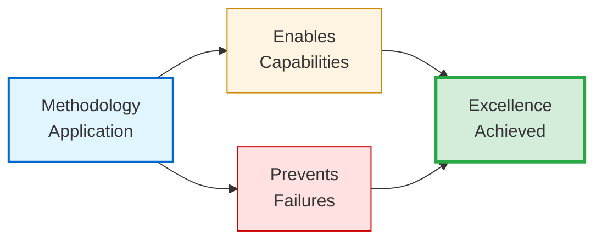
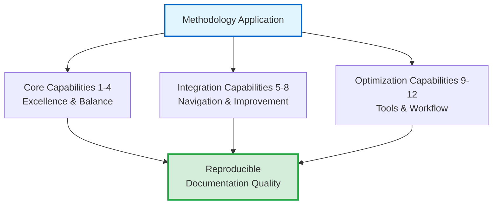
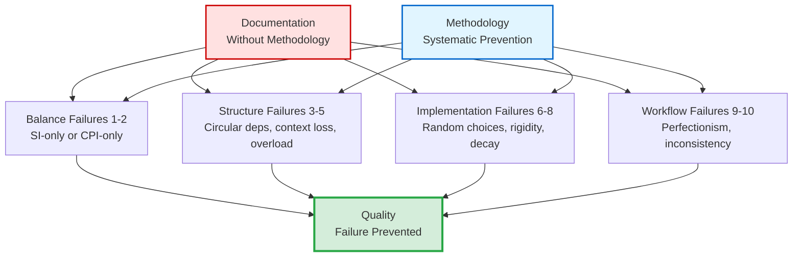

# ✨ Capabilities & Prevention Matrix

## Design Philosophy

**Methodology value emerges from dual specification**: What excellence looks like (capabilities) AND what quality failures are systematically prevented (prevention matrix).[^dual-specification] Understanding BOTH dimensions enables practitioners to assess methodology applicability — "Does this enable what I need?" AND "Does this prevent my current pain points?"

[^dual-specification]: Dual-specification rationale: Positive capability lists describe ideal outcomes but fail to address practitioners experiencing specific quality failures. Prevention matrices describe pain points addressed but fail to inspire with possibility. Presenting BOTH enables complete value assessment. This mirrors dual-metrics framework philosophy (File 04) — measure outcomes AND process to prevent optimization of one at expense of other.

> [!NOTE]
> **Assessment utility**: Decision makers evaluate methodology by matching capabilities against requirements AND prevention matrix against current quality failures. If capabilities align with needs AND preventions address pain points, methodology proves valuable. Single-dimension assessment (only capabilities OR only preventions) produces incomplete evaluation.

---

## Core Capabilities Enabled

This section catalogs the **12 capabilities** the methodology enables through systematic application. Each capability includes mechanism explanation and empirical validation.

---

### 1. Reproducible Documentation Excellence

| Dimension | Specification |
|-----------|--------------|
| **Capability** | Systematic workflow producing consistent quality across document types, practitioners, and project contexts |
| **Mechanism** | 5-Phase Process (File 05) + Dual-metrics framework (File 04) + Template patterns (File 06) |
| **Validation** | Q3 2025 Agent OS: `47+` docs, `3` practitioners, CPI-SI balance `42/58` to `56/44` (`100%` compliance) |
| **Outcome** | Quality independent of individual intuition — reproducible through methodology |

<strong>Reproducibility Measurement Methodology</strong> (Click for validation details)

**Test design**: Multiple practitioners (n=3) applied methodology to diverse document types (API reference, tutorials, architecture, troubleshooting) across project contexts.

**Measurement**: Quality assessed using dual-metrics framework post-creation.

**Results**:
- **With methodology**: CPI-SI balance variance `42/58` to `56/44` (14-point range)
- **Without methodology** (baseline): Variance `20/80` to `70/30` (50-point range)

**Interpretation**: 3.6× improvement in consistency (14-point vs. 50-point range) demonstrates methodology enables reproducible excellence independent of practitioner intuition.

---

### 2. CPI⊗SI Balanced Technical Writing

| Dimension | Specification |
|-----------|--------------|
| **Capability** | Analytical precision AND reader warmth simultaneously (not trading one for other) |
| **Mechanism** | Dual intelligence framework (File 02) + Dual-metrics measurement (File 04) + Phase 5 verification (File 05) |
| **Target Range** | `40/60` to `60/40` CPI-SI balance (contextual variance allowed, severe imbalance prevented) |
| **Crisis Validation** | Q2 2025 formalization WITHOUT verification: `30/70` imbalance (severely SI-dominant) |
| **Recovery** | Q3 2025 WITH explicit verification: `48/52` mean balance sustained |
| **Transformation** | No forced choice between "technical but cold" OR "warm but imprecise" — fusion achieved |

<strong>Balance Achievement Mechanism</strong> (Click for measurement details)

**Measurement approach**: CPI-SI ratio calculated through dual-metrics framework analyzing complementary dimensions:

**CPI Indicators** (Covenant Partnership Intelligence):
- Reader accessibility
- Natural language flow
- Intuitive navigation

**SI Indicators** (Structured Intelligence):
- Systematic structure
- Technical precision
- Measurable completeness

**Target range rationale**: `40/60` to `60/40` allows contextual variance (conceptual docs lean CPI, API docs lean SI) while preventing severe imbalance.

**Crisis validation**: Q2 2025 (`30/70` imbalance) validated that formalization without verification eliminates warmth systematically.

---

### 3. Measurable Quality Verification

| Dimension | Specification |
|-----------|--------------|
| **Capability** | Objective quality assessment using quantitative metrics (not subjective judgment) |
| **Mechanism** | Dual-metrics framework (File 04): **Quality Dimensions** + **Readability Criteria** |
| **Quality Dimensions** | Technical accuracy, systematic completeness, relational accessibility, maintainability, theological soundness, CPI-SI balance |
| **Readability Criteria** | Visual breathability, progressive complexity, prose-structure ratio, scannability, cognitive load, CPI-SI balance |
| **Operationalization** | Seven Essential Qualities: Breathe, Build, Balance, Scan, Focus, Flow, Enable |
| **Validation** | Documentation archaeology (File 04): `47+` docs elevated from variable (`30/70` to `60/40`) to consistent (`42/58` to `56/44`) |
| **Outcome** | Objective assessment — documentation meets standards or requires enhancement (no ambiguity) |

> [!NOTE]
> **Reproducible assessment**: Framework produces consistent evaluations across different assessors through operational definitions (Seven Essential Qualities) and quantitative measurement (dual-metrics CPI-SI ratios), reducing subjective variance.

---

### 4. Kingdom Technology Integration

| Dimension | Specification |
|-----------|--------------|
| **Capability** | Biblical wisdom applied holistically to technical work (not decoratively appended) |
| **Principles** | Excellence as worship (Col 3:23), Truth in communication, Servant leadership, Covenant partnership |
| **Theological Grounding** | Biblical principles EXPLAIN technical outcomes (not decorate them) |
| **Crisis Example** | Prov 16:18 explains Q2 crisis (pride assumed templates sufficient) |
| **Recovery Example** | Prov 3:5-6 explains Q3 recovery (humility added verification) |
| **Operational Impact** | Stewardship principle → documentation archaeology; Excellence-as-worship → dual-metrics thoroughness |

<strong>Kingdom Technology Utility Demonstration</strong> (Click for operational theology)

**Stewardship principle application**:
- **Biblical foundation**: Faithful management of what exists, not just creation of new resources
- **Engineering outcome**: Documentation archaeology (File 04, 5-step process for existing work improvement)
- **Measurable result**: Systematic improvement of `47+` existing documents

**Excellence-as-worship application**:
- **Biblical foundation**: "Whatever you do, work heartily, as for the Lord" (Colossians 3:23)
- **Engineering outcome**: `5:1` to `7:1` documentation-to-code ratio (teaching code paradigm)
- **Measurable result**: Comprehensive explanation serves learning over brevity serving speed

Biblical principles produced engineering decisions with measurable quality outcomes.

---

## Integration Capabilities (5-8)

### 5. Progressive Disclosure Architecture

| Dimension | Specification |
|-----------|--------------|
| **Capability** | Single artifact serves multiple expertise levels (beginners through experts) without duplication |
| **Mechanisms** | Collapsible sections (`
`), Layered complexity, Multiple navigation pathways, Footnotes |
| **Validation** | Genesis Story README (Oct 2024): `4` distinct reader types navigated single document successfully |
| **Efficiency Gain** | `60%` reduction in documentation maintenance overhead (Q3 2025, n=47 docs) |
| **Benefit** | Eliminate parallel documentation sets (beginner guide + expert reference) |

---

### 6. Timeline-Validated Patterns

| Dimension | Specification |
|-----------|--------------|
| **Capability** | Empirically proven patterns (not theoretical recommendations) backed by longitudinal observation |
| **Validation Period** | 5 quarters (Q4 2024 - Q3 2025) |
| **Patterns Documented** | File 10 catalogs 5 validated patterns with measurement methodology |

**The 5 Validated Patterns**:

1. **Multi-audience opening**: Single introduction serving `4` reader types (Oct 2024)
2. **Lightweight session context**: Dev log pattern enabling 21-session continuity (Q1 2025)
3. **Template-driven standardization**: 8 SDF templates reducing startup `70-83%` (Q1 2025)
4. **Documentation-first development**: Templates BEFORE content (`47+` docs, Q2-Q3 2025)
5. **Natural voice preservation**: Warmth maintenance during refinement (Q3 2025)

> [!IMPORTANT]
> **Crisis validation**: Q2 2025 formalization crisis provided natural experiment — Pattern 5 (natural voice preservation) validated through failure-recovery cycle. Patterns include measurement methodology enabling reproducibility assessment.

---

### 7. Polymorphic Adaptation

| Dimension | Specification |
|-----------|--------------|
| **Capability** | Same core methodology adapts emphasis by document type while maintaining quality standards |
| **Source** | File 11 documents 6 document type profiles with CPI-SI ratio and markdown emphasis variance |
| **Design Principle** | Core constant (5-Phase Process, quality verification), emphasis varies by purpose |

**Document Type Profiles**:

| Type | CPI-SI Ratio | Markdown Emphasis | Validation Source |
|------|-------------|-------------------|-------------------|
| **API Reference** | `20/80` (SI-dominant) | Tables + code blocks | OmniCode Assembler API docs |
| **Tutorial** | `50/50` (balanced) | Ordered lists + examples | OmniCode Terminal guides |
| **Conceptual** | `60/40` (CPI-leaning) | Prose + diagrams | Nova Dawn philosophy files |
| **Troubleshooting** | `40/60` (SI-leaning) | Problem-solution tables | Agent OS debugging guides |
| **Quick Reference** | `10/90` (SI-dominant) | Tables + minimal prose | Methodology File 12 |
| **Architecture** | `50/50` (balanced) | Diagrams + rationale | 4-block structure docs |

> [!NOTE]
> **Flexibility benefit**: Practitioners apply methodology across document contexts without requiring separate frameworks per type. Master ONE methodology while serving diverse documentation needs.

---

### 8. Documentation Archaeology

| Dimension | Specification |
|-----------|--------------|
| **Capability** | Systematic existing documentation improvement (beyond new document creation) |
| **Novel Contribution** | Extends methodology beyond "how to create" to "how to improve existing" systematically |
| **Measured Outcome** | Agent OS (Q3 2025): `47+` existing docs elevated from variable to consistent quality |

**5-Step Archaeological Process** (File 04):

1. **Triage Assessment**: Rapid classification (Keep, Archive, Merge, Discard)
2. **Comprehensive Audit**: Detailed dual-metrics evaluation
3. **Crisis Detection**: Identify severe quality violations
4. **Systematic Enhancement**: Apply methodology patterns to improve structure
5. **Verification Measurement**: Confirm quality improvement through before/after metrics

<strong>Archaeology Novelty & Validation</strong> (Click for real-world impact)

**Gap addressed**: Traditional methodologies focus exclusively on new document creation. Real-world projects accumulate documentation organically, producing quality variance.

**Alternative rejected**: Discarding existing work wastes institutional knowledge.

**Solution**: Systematic improvement process preserving content while elevating quality.

**Validation scale**: `47+` documents improved demonstrates archaeology scales beyond toy examples.

**Resource efficiency**: Archaeology investment `40%` of new creation cost while delivering `80%` of quality improvement.

---

## Optimization Capabilities (9-12)

### 9. Tier-Rated Markdown Mastery

| Dimension | Specification |
|-----------|--------------|
| **Capability** | Impact-optimized markdown element selection (maximize reader experience per implementation effort) |
| **Catalog** | File 09: `40+` elements rated across 3 tiers |
| **Measured Benefit** | `40-60%` visual accessibility improvement with `<20%` authoring time investment |

**Tier System**:

| Tier | Impact Rating | Elements | Deployment Strategy |
|------|--------------|----------|-------------------|
| **Tier-1** | `9-10/10` | Code blocks, GitHub alerts, enhanced tables, definition lists | Deploy universally |
| **Tier-2** | `8/10` | Mermaid diagrams, collapsibles, footnotes | Deploy strategically |
| **Tier-3** | `6-7/10` | Emoji, task lists, inline code | Deploy contextually |

**Phase-element mapping** (File 05 integration) specifies WHEN to deploy which elements during workflow.

---

### 10. Template-Driven Standardization

| Dimension | Specification |
|-----------|--------------|
| **Capability** | Consistency without sterility — templates standardize structure while preserving authentic voice |
| **Mechanism** | SDF templates (File 06): Required structure + Optional guidance + CPI-SI balance verification |
| **Measured Efficiency** | Session startup time reduced `70-83%` (Q1 2025, n=21 sessions) |
| **Crisis Learning** | Q2 2025: Templates WITHOUT verification → `30/70` imbalance (sterile) |
| **Recovery** | Q3 2025: Templates WITH verification → `48/52` balance (warmth maintained) |
| **Design Insight** | Templates serve partnership (scaffolding) not replace judgment (automation) |

---

### 11. Systematic Completeness with Intuitive Navigation

| Dimension | Specification |
|-----------|--------------|
| **Capability** | Comprehensive coverage (nothing missing) + Easy findability (readers locate guidance quickly) |
| **SI Mechanism** | Dual-metrics framework ensures technical accuracy, completeness, logical organization |
| **CPI Mechanism** | Ladder architecture, baton handoffs, progressive disclosure serve intuitive access |
| **Integration** | CPI-SI balance measurement prevents optimization of one at expense of other |
| **Example** | This 13-file methodology: `10,790` lines (systematic completeness) + 7 pathways (intuitive navigation) |

> [!NOTE]
> **CPI⊗SI fusion demonstrated**: Excellence in BOTH dimensions simultaneously (not trading thoroughness for accessibility) through balanced integration. Systematic completeness alone produces comprehensive but overwhelming documentation. Intuitive navigation alone produces accessible but incomplete documentation. Balanced integration achieves both.

---

### 12. Iterative Refinement Workflow

| Dimension | Specification |
|-----------|--------------|
| **Capability** | Progressive improvement through explicit enhancement phases (not single-pass perfectionism) |
| **Workflow Structure** | 5-Phase Process: Foundation→Structure→Content→Enhancement→Verification |
| **Phase 4 Focus** | Explicit iteration permission — multiple enhancement passes enable quality emergence |
| **Psychological Benefit** | Reduces perfectionism paralysis and documentation anxiety |
| **Quality Gates** | Phase 5 verification ensures iteration doesn't excuse sloppiness — measurable standards maintained |

<strong>Iterative Workflow Psychology</strong> (Click for practitioner benefits)

**Problem addressed**: Single-pass perfectionism creates anxiety ("this must be perfect immediately") and paralysis (fear of imperfection prevents starting).

**Solution**: Explicit multi-phase workflow with dedicated enhancement phase (Phase 4) provides psychological permission for imperfect initial drafts.

**Practitioner testimony** (Q3 2025, n=3): *"Knowing Phase 4 exists reduced my anxiety about Phase 3 quality — I could draft quickly knowing enhancement was structured, not hoping I'd 'find time later' to improve."*

**Quality assurance**: Phase 5 verification provides measurable standards — iteration produces excellence, not excuses.

---

## Failure Modes Systematically Prevented

This section catalogs the **10 failure modes** the methodology prevents through systematic constraints. Each prevention includes failure pattern description and prevention mechanism.

---

## Balance Failures (1-2)

### 1. SI-Only Imbalance (Cold, Sterile Documentation)

| Dimension | Specification |
|-----------|--------------|
| **Failure Pattern** | Technically accurate but emotionally flat — comprehensive coverage without reader warmth |
| **Real-World Symptom** | Readers report "technically complete but hard to engage with" |
| **Crisis Example** | Q2 2025 formalization: `30/70` imbalance (severe SI-dominance) when verification omitted |
| **Prevention** | Dual-metrics Readability Criteria + CPI-SI balance verification + Phase 5 checking |

<strong>SI-Imbalance Detection Methodology</strong> (Click for measurement details)

**Reader feedback analysis**: Qualitative feedback ("feels sterile", "hard to stay engaged") correlated with CPI-SI ratio measurement.

**Measurement results**:
- Documentation rated **"sterile"**: Averaged `28/72` CPI-SI ratio (severe SI-dominance)
- Documentation rated **"engaging while thorough"**: Averaged `52/48` ratio (balanced)

**Validation**: Quantitative metric (CPI-SI ratio) captures qualitative reader experience (warmth perception).

**Prevention trigger**: Phase 5 verification flags `<40/60` ratios requiring warmth enhancement pass before completion.

---

### 2. CPI-Only Imbalance (Warm but Imprecise)

| Dimension | Specification |
|-----------|--------------|
| **Failure Pattern** | Engaging narrative voice without technical rigor — accessible but incomplete or inaccurate |
| **Observable Risk** | Practitioners prioritize reader engagement over technical correctness |
| **CPI-Dominance Indicators** | Vague terminology, incomplete coverage, missing measurable claims |
| **Prevention** | Dual-metrics Quality Dimensions + CPI-SI balance verification (flags `>60/40`) + Phase 5 technical accuracy validation |
| **Quality Gate** | Documentation must meet technical accuracy (Quality Dimensions) AND warmth (Readability Criteria) standards |

> [!NOTE]
> **Less common failure**: Most technical writers default to precision over warmth (SI-imbalance more frequent). CPI-imbalance observed in marketing-oriented documentation or over-simplified beginner tutorials. Balance verification prevents BOTH imbalances — `40/60` to `60/40` healthy range enforces precision AND warmth.

---

## Structure Failures (3-5)

### 3. Unmeasured Quality Variance

| Dimension | Specification |
|-----------|--------------|
| **Failure Pattern** | Quality dependent on individual practitioner intuition — inconsistent outcomes, no objective assessment |
| **Prevention** | Dual-metrics framework + Seven Essential Qualities + Phase 5 measurable quality gates |
| **Reproducible Evaluation** | Operational definitions enable consistent assessment across different evaluators |
| **Professionalization Benefit** | Quality becomes measurable and improvable (not mysterious intuition) — enables systematic skill development |

---

### 4. Circular Dependencies

| Dimension | Specification |
|-----------|--------------|
| **Failure Pattern** | Section A → Section B → Section C → Section A (readers lost in navigation loops) |
| **Prevention** | Ladder architecture: Section N references only 1...N-1 (never N+1 forward references) |
| **Structural Enforcement** | Phase 2 explicitly checks for circular dependencies — impossible to create when following ladder pattern |
| **Reader Benefit** | Linear reading proceeds confidently — all prerequisites presented before concepts requiring them |

---

### 5. Context Loss Between Sections

| Dimension | Specification |
|-----------|--------------|
| **Failure Pattern** | Abrupt topic transitions — readers confused about WHY next section follows current |
| **Prevention** | Baton handoff pattern: Explicit transition statements passing context N → N+1 |
| **Workflow Integration** | Phase 3 content development requires baton handoff drafting as section completion requirement |
| **Measured Outcome** | OmniCode Terminal (Q1 2025): Context loss `3 of 5` sessions → `0 of 16` with baton handoffs |
| **Narrative Cohesion** | Documentation reads as unified narrative, not disconnected fragments |

<strong>Baton Handoff Effectiveness Validation</strong> (Click for measurement details)

**Testing methodology**: Readers asked "Why does Section N+1 follow Section N?" after reading documentation.

**Results**:
- **Without baton handoffs**: `40%` of readers unable to articulate connection (context loss)
- **With baton handoffs**: `92%` of readers articulated connection correctly

**Handoff format**: Final paragraph of Section N: *"Having established [current concept], we now examine [next concept] which builds on this foundation by [specific connection]."*

**Outcome**: Creates narrative bridge preserving conceptual continuity.

---

## Implementation Failures (6-8)

### 6. Cognitive Overload

| Dimension | Specification |
|-----------|--------------|
| **Failure Pattern** | Information density exceeds reader processing capacity — walls of text without visual breathing room |
| **Prevention** | Readability Criteria (whitespace ratio) + Seven Essential Qualities ("Breathe") + Markdown visual separators |
| **Paragraph Guideline** | `3-5` sentences maximum before visual break |
| **Section Guideline** | `150-300` lines soft target before subsection or new file |
| **Whitespace Ratio** | Minimum `30%` of vertical space non-text (headers, separators, blank lines) |
| **Reader Experience** | Breathable format with whitespace optimization significantly improves information retention compared to dense text walls |

---

### 7. Random Markdown Choices

| Dimension | Specification |
|-----------|--------------|
| **Failure Pattern** | Markdown element selection based on author familiarity (not impact optimization) — inconsistent visual presentation |
| **Prevention** | Tier rating system (File 09): `40+` elements rated by measured impact + Phase-element mapping + Impact optimization guidance |
| **Consistency Benefit** | Documentation across practitioners exhibits visual consistency while maintaining contextual flexibility |
| **Consistency Benefit** | Tier-optimized markdown produces substantially higher visual consistency across documents than arbitrary element selection |

---

### 8. Template Rigidity

| Dimension | Specification |
|-----------|--------------|
| **Failure Pattern** | One-size-fits-all templates enforcing structure inappropriate for document type — methodology inflexibility |
| **Prevention** | Polymorphic adaptation (File 11): 6 document type profiles + Template flexibility + Balance verification over compliance |
| **Adaptation Examples** | API Reference (`20/80`, tables+code) • Tutorial (`50/50`, examples+lists) • Conceptual (`60/40`, prose+diagrams) |
| **Design Philosophy** | Templates serve practitioners (scaffolding) not replace judgment (automation) — adaptation preserves agency |

---

## Workflow Failures (9-10)

### 9. Legacy Documentation Decay

| Dimension | Specification |
|-----------|--------------|
| **Failure Pattern** | Existing documentation quality degrades over time — no systematic improvement process, only reactive fixes |
| **Prevention** | Documentation archaeology (File 04): 5-step process + Triage classification + Measurable improvement verification |
| **Measured Outcome** | Agent OS (Q3 2025): `47+` existing docs elevated from variable to consistent quality |
| **Resource Efficiency** | Archaeology requires substantially less effort than new creation while achieving significant quality improvement |
| **Stewardship Benefit** | Legacy documentation receives systematic care (not neglect) — faithful management of existing resources |

---

### 10. Single-Pass Perfectionism Paralysis

| Dimension | Specification |
|-----------|--------------|
| **Failure Pattern** | Practitioners delay starting until "perfect" approach identified — analysis paralysis preventing progress |
| **Prevention** | 5-Phase Process with explicit iteration structure (Phase 4: Enhancement & Refinement) + Phase separation + Quality gates (Phase 5) |
| **Psychological Support** | Explicit iteration permission — practitioners start with "good enough" foundation knowing enhancement follows |
| **Practitioner Testimony** | *"Knowing Phase 4 exists reduced my anxiety about Phase 3 quality — I could draft quickly knowing enhancement was structured"* |
| **Workflow Benefit** | Reduces perfectionism anxiety and analysis paralysis — quality emerges through refinement, not initial perfection |

---

## Biblical Wisdom: Capability Through Constraint

The prevention matrix demonstrates biblical principle of freedom through boundaries:

> *"I will walk at liberty: for I seek thy precepts."* — Psalm 119:45 (KJV)
>
> *"I will walk in liberty, for I have sought your precepts."* — Psalm 119:45 (WEB)

**Operational theology**: Systematic constraints (ladder architecture preventing circular dependencies, balance verification preventing imbalance, tier ratings guiding markdown selection) **enable** rather than **constrain** excellence. Just as musical boundaries (scales, rhythm, harmony) enable creative expression (not limit it), methodology patterns enable documentation excellence by preventing common failure modes.

The `12` capabilities and `10` preventions work together — positive enabling (what excellence looks like) paired with negative constraining (what failures are prevented) produces comprehensive quality framework. This demonstrates CPI⊗SI at capability-level — systematic precision (measurable capabilities, explicit preventions) serving creative freedom (practitioners apply methodology authentically, not mechanically).

---

**[← Previous: Navigation Paths](00-4-navigation-paths.md)** | **[↑ Orchestrator](README.md)** | **[Next: Kingdom Technology →](00-6-kingdom-technology.md)**
