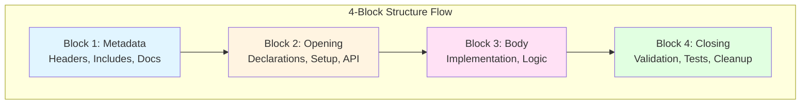

## 🎯 Overview

The **CPI-SI 4-Block Structure** is a foundational architectural pattern that brings predictable order to complex codebases. Think of it as the "musical staff" for code—just as musical notation creates clear boundaries between treble and bass clefs, the 4-block structure creates clear boundaries between metadata, declarations, implementation, and validation.

This pattern eliminates the "change one thing, break five things" problem by establishing **architectural boundaries** that make updates surgical rather than sweeping. When you need to update documentation, you touch Block 1. When you need to modify business logic, you work in Block 3. The boundaries protect you from accidental coupling.

## ⚙️ Core Principle

**Architectural Boundaries Enable Surgical Updates**

When every file in your codebase follows the same 4-block pattern, you gain surgical precision in updates. Here's what becomes possible:

- **📝 Update documentation** → Touch Block 1 only, zero risk to functionality
- **🔌 Modify APIs** → Change Block 2 contracts, implementations stay isolated
- **⚡ Refactor business logic** → Work in Block 3, setup and teardown untouched
- **✅ Improve validation** → Enhance Block 4, core algorithms remain stable

The pattern creates **cognitive ease**: You know where things live, what depends on what, and exactly what you're affecting when you make a change. This isn't just organization—it's **architectural protection** against accidental complexity.

