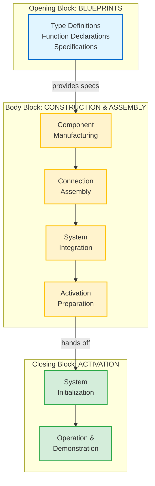

## 🔧 CONSTRUCTION ARCHITECTURE PRINCIPLES

### Primary Purpose: Build & Connect

The body block's job is to construct the working components that the closing block will activate.

<details>
<summary><strong>📦 The Four Construction Responsibilities</strong> (click to expand)</summary>

1. **Component Manufacturing:** Create the actual working pieces from specifications
2. **Connection Assembly:** Establish relationships between components  
3. **Integration Preparation:** Ensure components are ready for coordinated activation
4. **System Readiness:** Prepare everything for the closing block to "flip the switch"

</details>

> [!NOTE]
> **Body Block ≠ Execution Block**  
> A common misconception: "The body block is where the main work happens." In reality, the body block **prepares** work to happen. The closing block **activates and demonstrates** that work. The body block builds the engine; the closing block starts it.

### Mathematical Foundation

```
Body(blueprint) → [construct_components + assemble_connections + prepare_activation] → Ready_System
```

**Construction Flow:**
1. **Receive Blueprint** (from opening block specifications)
2. **Manufacture Components** (build individual pieces with actual logic)
3. **Assemble Connections** (establish relationships and dependencies)
4. **Prepare for Activation** (ensure closing block can successfully initialize)

### Construction Flow Visualization



> [!NOTE]
> **Manufacturing Floor Reality**  
> The body block is the **manufacturing floor** where blueprints become machines. Components are built, connected, integrated, and prepared—but not yet activated. Activation is the closing block's responsibility.

