## 🔄 CONSTRUCTION FLOW PATTERNS

> [!TIP]
> **Choose Your Assembly Strategy**  
> Different construction scenarios call for different assembly approaches. Sequential construction works for linear dependencies, parallel assembly maximizes efficiency, and incremental manufacturing supports iterative development. Match your strategy to your project's needs.

### Construction Pattern Comparison

```mermaid
graph TB
    subgraph "Sequential Construction"
        S1[Receive Blueprint] --> S2[Build Component A]
        S2 --> S3[Build Component B]
        S3 --> S4[Connect A to B]
        S4 --> S5[Verify Connections]
        S5 --> S6[Ready for Activation]
    end
    
    subgraph "Parallel Assembly"
        P1[Build Input System]
        P2[Build Processing System]
        P3[Build Output System]
        P1 --> P4[Assemble Connections]
        P2 --> P4
        P3 --> P4
        P4 --> P5[Integration Test]
        P5 --> P6[Ready for Activation]
    end
    
    subgraph "Incremental Manufacturing"
        I1[Base Component] --> I2[Add Feature 1]
        I2 --> I3[Add Feature 2]
        I3 --> I4[Integrate Features]
        I4 --> I5[Test Assembly]
        I5 --> I6[Activation Ready]
    end
    
    style S6 fill:#d4edda,stroke:#28a745,stroke-width:2px
    style P6 fill:#d4edda,stroke:#28a745,stroke-width:2px
    style I6 fill:#d4edda,stroke:#28a745,stroke-width:2px
```

**Pattern Selection Guide:**
- **Sequential:** Use when components have strict dependencies (A must exist before B can be built)
- **Parallel:** Use when components are independent and can be manufactured simultaneously
- **Incremental:** Use when building complex components in stages with iterative testing

---

