## ⚡ THE ACTIVATION LAYER CONCEPT

### **Closing Block as Execution Engine**

**Core Insight:** The closing block is the **activation layer** that bridges from "constructed" to "operational."

**What This Means:**
- Components are defined in the body
- But they're **activated** in the closing block
- Closing block contains the "usage patterns" 
- It's where you "turn on the machine"

### Activation Flow Architecture

```mermaid
graph LR
    subgraph "Body Block: CONSTRUCTION"
        C1[Define Components]
        C2[Build Structures]
        C3[Implement Logic]
        C4[Prepare Assembly]
        
        C1 --> C2 --> C3 --> C4
    end
    
    subgraph "Closing Block: ACTIVATION"
        A1[Initialize System]
        A2[Activate Components]
        A3[Demonstrate Usage]
        A4[Operational Context]
        
        A1 --> A2 --> A3 --> A4
    end
    
    C4 -->|Ready for Activation| A1
    A4 -.->|System Running| LIVE[Living System]
    
    style C4 fill:#fff3cd,stroke:#ffc107,stroke-width:2px
    style A1 fill:#d4edda,stroke:#28a745,stroke-width:3px
    style A2 fill:#d4edda,stroke:#28a745,stroke-width:2px
    style A3 fill:#d4edda,stroke:#28a745,stroke-width:2px
    style A4 fill:#d4edda,stroke:#28a745,stroke-width:2px
    style LIVE fill:#e1f5ff,stroke:#0066cc,stroke-width:3px
```



> [!TIP]
> **The Power Switch Moment**  
> The body block builds the machine component by component. The closing block is the moment you **flip the power switch** and the machine comes alive. This is not cleanup—this is the beginning of operational life.

### **Real Example from CPI-SI:**

```cpp
// === BODY BLOCK ===
struct IdentityState {
    Coefficient cpi_coefficient;
    Coefficient si_coefficient;
    
    bool is_valid() const { /* capability defined */ }
    Coefficient total_activation() const { /* capability defined */ }
};

// === CLOSING BLOCK ===
// This is where we actually MAKE IT WORK:

/**
 * @brief Initialize identity types for operational use
 * EXECUTION FUNCTION - Not cleanup, but activation!
 */
void initialize_identity_types() {
    // This function makes the system operational
    // It's not cleaning up - it's turning on the machine
    
    // Set up working contexts
    // Establish operational parameters  
    // Enable the system for actual use
}

namespace operational_context {
    // EXECUTION NAMESPACE - Where the real work happens
    // Usage patterns, working examples, operational code
}
```

