## 🌊 THE FLOW PARADIGM

### **Construction → Activation Flow**

**The Complete Development Flow:**
1. **Opening:** Declare what will exist
2. **Body:** Build and construct the components  
3. **Closing:** Activate and make operational

**Mathematical Expression:**
```
System_Lifecycle = Declaration(opening) → Construction(body) → Activation(closing)
```

### Complete 4-Block Lifecycle

```mermaid
graph TB
    M[Metadata Block<br/>Digital Genome]
    
    subgraph "Block 2: Opening - DECLARATION"
        O1[Type Definitions]
        O2[Function Declarations]
        O3[API Surface]
    end
    
    subgraph "Block 3: Body - CONSTRUCTION"
        B1[Component Manufacturing]
        B2[Connection Assembly]
        B3[System Integration]
    end
    
    subgraph "Block 4: Closing - ACTIVATION"
        C1[Initialize Systems]
        C2[Activate Components]
        C3[Demonstrate Usage]
        C4[Living System ✨]
    end
    
    M -->|provides context| O1
    O1 --> O2 --> O3
    O3 -->|blueprints ready| B1
    B1 --> B2 --> B3
    B3 -->|ready for activation| C1
    C1 --> C2 --> C3 --> C4
    
    style M fill:#f8d7da,stroke:#dc3545,stroke-width:2px
    style O3 fill:#e1f5ff,stroke:#0066cc,stroke-width:2px
    style B3 fill:#fff3cd,stroke:#ffc107,stroke-width:2px
    style C4 fill:#d4edda,stroke:#28a745,stroke-width:3px
```



> [!IMPORTANT]
> **Complete Lifecycle Architecture**  
> Each block serves a distinct phase: Metadata provides intelligence, Opening declares capabilities, Body constructs components, and Closing **brings everything to life**. The closing block is the culmination where static definitions become dynamic, operational reality.

### **Energy Flow Metaphor**

**Opening Block:** Potential energy (everything is possible)  
**Body Block:** Kinetic energy (things are being built)  
**Closing Block:** Operational energy (system is working)

