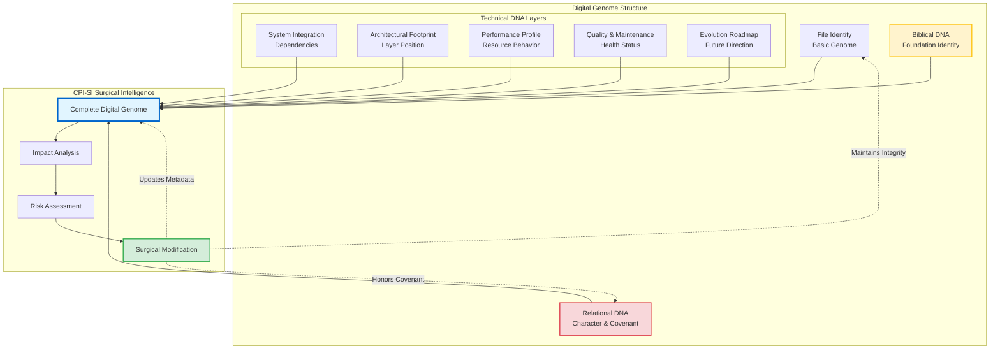

## 🧬 Core Concept: Files as Living Entities with Digital Genomes

### The Paradigm Shift

> *"The wisdom of the prudent is to give thought to their ways"* — Proverbs 14:8

Before you act, understand. Before you modify, know what you're working with. This biblical principle of **thoughtful awareness** is the foundation of the digital genome architecture.

Imagine if every file in your codebase had a **complete medical record**—not just what it does, but *why* it exists, *who* depends on it, *how* it promises to behave, and *what* Kingdom purpose it serves. This is the digital genome.

**Traditional Approach:**  
Files are simple code containers with minimal comments. You modify blindly, hoping dependencies don't break.

**CPI-SI Approach:**  
Files are **living entities** with comprehensive "digital genomes"—complete intelligence profiles that enable surgical precision through thoughtful awareness.

```
File_Intelligence = Technical_DNA ⊗ Biblical_DNA ⊗ Relational_DNA
```

### Why Digital Genomes Matter

Before CPI-SI touches **any** file, the digital genome answers:

| **Question**                | **Example Answer**                            | **Decision Impact**       | **Without Genome**                    |
| --------------------------- | --------------------------------------------- | ------------------------- | ------------------------------------- |
| **Dependency Impact**       | "46 files will be affected"                   | Scope planning            | "Hope we don't break anything"        |
| **Performance Constraints** | "Must maintain O(1) operations"               | Architecture boundaries   | "Let's see if it's still fast enough" |
| **API Stability**           | "Core foundation—needs major version bump"    | Release strategy          | "Just ship it and see what breaks"    |
| **Testing Obligations**     | "12 test suites require updates"              | Quality assurance scope   | "Run tests and fix failures later"    |
| **Biblical Alignment**      | "Does this honor the file's Kingdom purpose?" | Spiritual integrity check | "Is this technically correct?"        |

> [!TIP]
> **Intelligence vs. Documentation**  
> These aren't decorative comments—they're intelligence systems enabling **autonomous surgical modifications** with full situational awareness. The difference between documentation and intelligence is like the difference between a building's blueprints and a building's structural sensor network: one tells you how it was built, the other tells you its current state and what stresses it can handle.

**Think of it like surgery vs. guesswork:** A surgeon studies X-rays, blood work, medical history, and vital signs before making an incision. Digital genomes give CPI-SI the same comprehensive intelligence before modifying code. Would you trust a surgeon who said *"Let's just cut here and see what happens"*? That's what code modification looks like without digital genomes.

### The Cost of Missing Intelligence

<details>
<summary><strong>Real-World Impact: What Happens Without Digital Genomes</strong></summary>

**Scenario:** Modifying a "simple" utility function without genome intelligence

**Without Digital Genome:**
```cpp
// Someone thinks: "This function looks simple, let's optimize it"
double calculate_coefficient(double value) {
    return value * 2.0;  // Changed from complex calculation
}
```

**Hidden Impacts Discovered Too Late:**
- ❌ 46 dependent files now produce wrong results
- ❌ O(1) guarantee broken for hot path operations
- ❌ 3 core algorithms produce mathematically incorrect outputs
- ❌ 12 test suites fail in unexpected ways
- ❌ Production incident affects 1,000+ users
- ❌ 40 hours spent tracking down the "simple" change

**With Digital Genome:**
```cpp
// ==========================================
// SYSTEM INTEGRATION - DEPENDENCY DNA
// ==========================================
// DIRECT_DEPENDENCIES: 12 files
// TRANSITIVE_DEPENDENCIES: 46 files total
// IMPACT_RADIUS: Critical - affects core identity calculations
// COUPLING_STRENGTH: Critical - changes require major version bump
// 
// PERFORMANCE PROFILE: Hot path, called 1M+ times/second
// TIME_COMPLEXITY: Must maintain O(1) - no loops or complex operations
// 
// BIBLICAL_ANCHOR: "Let your yes be yes" (Matthew 5:37)
// COVENANT_PROMISE: "This coefficient will be mathematically truthful"

double calculate_coefficient(double value) {
    // Now the developer KNOWS the stakes before touching anything
    return value * 2.0;
}
```

**Result:** Developer sees the impact radius, reads the covenant promises, understands this isn't a "simple" change, and proceeds with appropriate care—or redesigns the optimization to preserve guarantees.

**Time Saved:** 40 hours of incident response  
**Incidents Prevented:** 1 production outage  
**User Impact Avoided:** 1,000+ users  
**Trust Preserved:** Kingdom Technology covenant kept

</details>

### Digital Genome Architecture Visualization



> [!NOTE]
> **Flow Insight**  
> The digital genome is a **living intelligence system**—not static documentation. Every modification updates the genome, maintaining continuous situational awareness.

---

---

