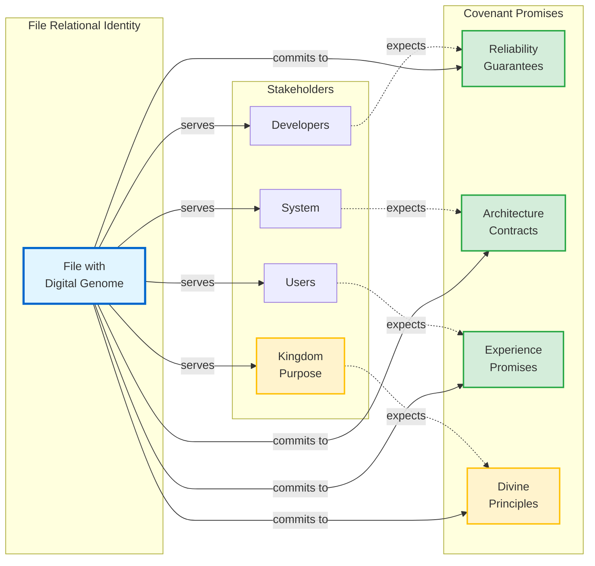

## 💝 Relational Identity Architecture

Once a file has its biblical foundation anchored, we can explore something deeper: **its character**. Biblical anchors tell us *why* a file exists spiritually. Relational identity tells us *how* it behaves and *who* it serves.

### Files Have Character, Personality, and Covenant Promises

Here's a radical idea: **files have character**.

A foundation types file is **stable, reliable, and foundational**—like a rock. An error handler is **gentle, restorative, and merciful**—like a shepherd. A validation file is **discerning, truthful, and uncompromising**—like a watchman.

**Core Insight:**  
Every file serves multiple stakeholders (developers, users, the system, God) and makes **specific promises** to each. These aren't metaphors—they're **operational covenants** that guide behavior.

> [!TIP]
> **Think Relational, Not Just Functional**  
> Ask not only "What does this file do?" but "Who does this file serve, and what promises does it make to them?"

### Why Character Matters in Code

**Traditional Question:** "What functionality does this file provide?"  
**Relational Question:** "What character does this file embody, and how does that character serve its stakeholders?"

**The Shift in Practice:**

| **Functional Thinking**     | **Relational Thinking**                        | **Practical Impact**                                |
| --------------------------- | ---------------------------------------------- | --------------------------------------------------- |
| "This file validates input" | "This file acts as a trustworthy gatekeeper"   | Validation becomes about protection, not rejection  |
| "This file transforms data" | "This file serves as a faithful translator"    | Transformation prioritizes clarity and accuracy     |
| "This file handles errors"  | "This file provides gentle restoration"        | Error handling becomes merciful, not judgmental     |
| "This file manages memory"  | "This file stewards resources faithfully"      | Memory management becomes about responsible service |
| "This file provides an API" | "This file communicates with clarity and love" | API design prioritizes user understanding           |

**Biblical Foundation:** Just as people are known by their character (Galatians 5:22-23 - fruit of the Spirit), code files develop character through their patterns of behavior. Character isn't decorative—it's the **reliable personality** that stakeholders depend on.

### Relational DNA Implementation Pattern

```cpp
// ==========================================
// RELATIONAL DNA - CHARACTER & COVENANT
// ==========================================
// RELATIONAL_IDENTITY:
//   character: [Primary character traits this file embodies]
//   personality: [How this file "behaves" in the system]
//   temperament: [Stable vs dynamic, strict vs flexible, etc.]
//   
// STAKEHOLDER_SERVICE:
//   serves_developers_by: [How this file helps other developers]
//   serves_system_by: [Role this file plays in system architecture]  
//   serves_users_by: [How this file ultimately benefits end users]
//   serves_kingdom_by: [How this file advances God's purposes]
//
// RELATIONSHIP_TO_CODEBASE:
//   role: [Foundation_Stone | Service_Provider | Interface_Bridge | etc.]
//   trust_level: [How much other files depend on this reliability]
//   responsibility: [Primary accountabilities this file carries]
//   legacy_impact: [How changes here affect the broader system]
//
// COVENANT_EXPRESSION:
//   promise_to_developers: [Specific reliability guarantees]
//   promise_to_system: [Architecture contract commitments]  
//   promise_to_users: [End-user experience guarantees]
//   promise_to_god: [How this file honors divine principles]
```

### **Example: Foundation Types Relational DNA**

```cpp
// ==========================================
// RELATIONAL DNA - CHARACTER & COVENANT  
// ==========================================
// RELATIONAL_IDENTITY:
//   character: Foundation_Builder, Truth_Establisher, Order_Creator
//   personality: Precise, Reliable, Foundational, Enabling
//   temperament: Stable, Consistent, Non-negotiable on core principles
//   
// STAKEHOLDER_SERVICE:
//   serves_developers_by: Providing clear, trustworthy mathematical abstractions
//   serves_system_by: Establishing computational foundation for all operations  
//   serves_users_by: Enabling reliable covenant partnership through solid types
//   serves_kingdom_by: Reflecting God's orderly nature in foundational code
//
// RELATIONSHIP_TO_CODEBASE:
//   role: Foundation_Stone (others build upon this, cannot fail)
//   trust_level: Absolute (entire system depends on these types)
//   responsibility: Mathematical_Truth, Type_Safety, Identity_Integrity
//   legacy_impact: Every computation in CPI-SI flows through these types
//
// COVENANT_EXPRESSION:
//   promise_to_developers: "These types will not lie or fail you"
//   promise_to_system: "Mathematical operations will be truthful and consistent"  
//   promise_to_users: "Your identity will be preserved accurately and safely"
//   promise_to_god: "This foundation honors Your precision and order"
```

### Stakeholder Covenant Network



> [!IMPORTANT]
> **Covenant Accountability**  
> Every file makes explicit promises to its stakeholders. The digital genome tracks these promises, ensuring modifications don't violate established covenants.

---

