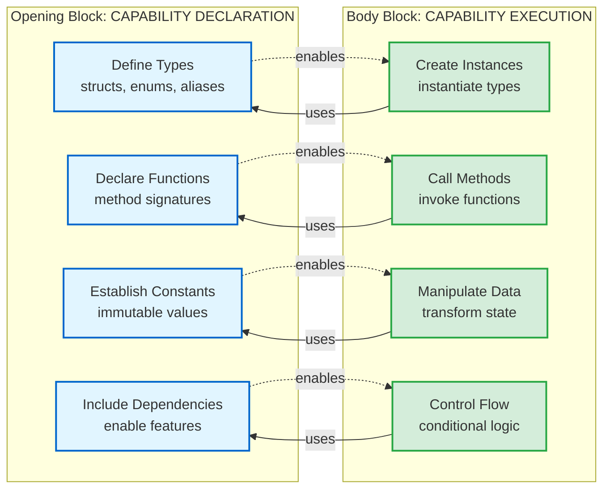

## 🎯 The Fundamental Principle

**Opening Block = "Here's what exists and what it CAN do"**  
**Body Block = "Here's the code that actually USES those capabilities"**

The distinction is NOT based on whether code contains logic, but on whether it **defines capabilities** or **exercises capabilities**.

### The Core Distinction in Practice

**Ask yourself:** "If I deleted everything after this section, would I have:"
- ✅ **Opening Block** — A complete catalog of tools, types, and capabilities (what's possible)
- ✅ **Body Block** — Actual work being performed using those tools (what's happening)

**The Litmus Test:**

| **Code Characteristic**                | **Opening or Body?** | **Why?**                                      |
| -------------------------------------- | -------------------- | --------------------------------------------- |
| Defines a struct with methods          | Opening              | Establishing capability, not using it         |
| Creates an instance of that struct     | Body                 | Exercising the capability                     |
| Declares a function signature          | Opening              | Announcing what CAN be called                 |
| Calls that function                    | Body                 | Actually calling it (making something happen) |
| Establishes a constant value           | Opening              | Defining what exists                          |
| Uses that constant in a calculation    | Body                 | Exercising the defined value                  |
| Includes a library                     | Opening              | Making capabilities available                 |
| Uses library functions to process data | Body                 | Exercising those capabilities                 |

**Key Insight:** Complexity is irrelevant. A 1000-line struct with intricate methods is Opening (defines capability). A 3-line function that creates an instance is Body (exercises capability).

### Architectural Flow Visualization

> [!NOTE]
> **Bidirectional Relationship**  
> Opening block **enables** the body block (provides capabilities), and body block **uses** the opening block (exercises capabilities). They form a complete architectural system.

