## 🎯 Classification Decision Tree

Use this decision tree to quickly classify any code section:

```mermaid
flowchart TD
    START[Code Section to Classify]
    
    Q1{Does it define<br/>types, structures,<br/>enums, constants?}
    Q2{Does it declare<br/>functions or<br/>methods?}
    Q3{Does it create<br/>instances or<br/>call methods?}
    Q4{Does it perform<br/>control flow or<br/>data manipulation?}
    Q5{Does it establish<br/>includes or<br/>namespace setup?}
    
    OPENING[📘 OPENING BLOCK<br/>Capability Declaration]
    BODY[📗 BODY BLOCK<br/>Capability Execution]
    FINAL{Ask: Defining what<br/>CAN happen, or<br/>making something<br/>ACTUALLY happen?}
    
    START --> Q1
    Q1 -->|Yes| OPENING
    Q1 -->|No| Q2
    Q2 -->|Yes| OPENING
    Q2 -->|No| Q3
    Q3 -->|Yes| BODY
    Q3 -->|No| Q4
    Q4 -->|Yes| BODY
    Q4 -->|No| Q5
    Q5 -->|Yes| OPENING
    Q5 -->|No| FINAL
    FINAL -->|CAN happen| OPENING
    FINAL -->|ACTUALLY happens| BODY

    style OPENING fill:#e1f5ff,stroke:#0066cc,stroke-width:3px
    style BODY fill:#d4edda,stroke:#28a745,stroke-width:3px
    style START fill:#fff3cd,stroke:#ffc107,stroke-width:2px
    style FINAL fill:#f8d7da,stroke:#dc3545,stroke-width:2px
```

> [!NOTE]
> **Decision Priority**  
> Start at the top of the tree. The first match determines the classification. If you're still uncertain, ask: "Is this fundamentally declaring what **CAN** happen, or making something **ACTUALLY** happen?"

---

