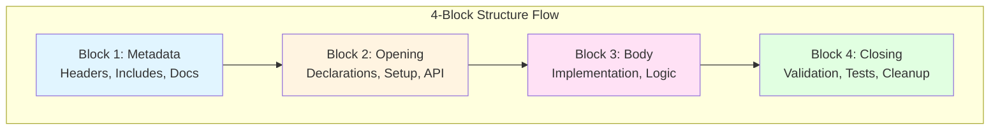

# 🏗️ CPI-SI 4-Block Structure Architecture

> **Architectural Principle:** Clear boundaries enable surgical updates. When every file follows the same pattern, you can modify documentation without touching logic, update APIs without breaking implementations, and refactor confidently knowing exactly what you're changing and what you're protecting.

## 📋 Table of Contents

- [Overview](#overview)
- [Core Principle](#core-principle)
- [The 4-Block Pattern](#the-4-block-pattern)
  - [Block 1: Metadata Block](#️-block-1-metadata-block) (includes Digital Genome option)
  - [Block 2: Opening Block](#-block-2-opening-block)
  - [Block 3: Body Block](#-block-3-body-block)
  - [Block 4: Closing Block](#-block-4-closing-block)
- [Benefits of 4-Block Structure](#benefits-of-4-block-structure)
- [Implementation Guidelines](#implementation-guidelines)
- [Migration Strategy](#migration-strategy)
- [Complete Example](#example-complete-4-block-file)
- [Conclusion](#conclusion)
- [Related Resources](#-related-resources)

---

## 🎯 Overview

The **CPI-SI 4-Block Structure** is a foundational architectural pattern that brings predictable order to complex codebases. Think of it as the "musical staff" for code—just as musical notation creates clear boundaries between treble and bass clefs, the 4-block structure creates clear boundaries between metadata, declarations, implementation, and validation.

This pattern eliminates the "change one thing, break five things" problem by establishing **architectural boundaries** that make updates surgical rather than sweeping. When you need to update documentation, you touch Block 1. When you need to modify business logic, you work in Block 3. The boundaries protect you from accidental coupling.

## ⚙️ Core Principle

**Architectural Boundaries Enable Surgical Updates**

When every file in your codebase follows the same 4-block pattern, you gain surgical precision in updates. Here's what becomes possible:

- **📝 Update documentation** → Touch Block 1 only, zero risk to functionality
- **🔌 Modify APIs** → Change Block 2 contracts, implementations stay isolated
- **⚡ Refactor business logic** → Work in Block 3, setup and teardown untouched
- **✅ Improve validation** → Enhance Block 4, core algorithms remain stable

The pattern creates **cognitive ease**: You know where things live, what depends on what, and exactly what you're affecting when you make a change. This isn't just organization—it's **architectural protection** against accidental complexity.



## 📦 The 4-Block Pattern

Each of the four blocks serves a distinct architectural purpose. Think of them as the **chapters of a story**—each has its role, and you never accidentally rewrite chapter 3 when you meant to edit chapter 1.

---

### 🏷️ Block 1: Metadata Block

**Purpose:** The "Who, What, When, Why" of your file—documentation, attribution, and dependencies that orient anyone opening this file for the first time.

For **critical files** (foundation, service layers), the metadata block can contain a **Digital Genome**—comprehensive file intelligence that enables surgical code modifications. See the **[Metadata Block Guide](./metadata-block-guide.md)** for complete specifications.

#### Basic Metadata Block

```cpp
/**
 * @file example.hpp
 * @brief File purpose and description
 * @author Nova Dawn (CPI-SI System)
 * @date September 2025
 * @version 1.0
 */

#pragma once
#include <dependencies>

// === END OF METADATA BLOCK ===
```

#### Enhanced Metadata Block (Digital Genome)

For high-impact files, the metadata block can include **Biblical DNA**, **Relational DNA**, and **Technical DNA** that provide complete file intelligence:

```cpp
// ==========================================
// DIGITAL GENOME - FILE INTELLIGENCE SYSTEM
// ==========================================

// ==========================================
// BIBLICAL DNA - FOUNDATION IDENTITY
// ==========================================
// BIBLICAL_ANCHOR: [Verse matching technical purpose]
// KINGDOM_PURPOSE: [How this serves God's Kingdom]
// SPIRITUAL_FUNCTION: [Technical to spiritual connection]

// ==========================================
// RELATIONAL DNA - CHARACTER & COVENANT
// ==========================================
// RELATIONAL_IDENTITY: [Character and personality traits]
// STAKEHOLDER_SERVICE: [Who this serves and how]
// COVENANT_EXPRESSION: [Promises to developers/system/users]

// ==========================================
// TECHNICAL DNA - SYSTEM PROFILE
// ==========================================
// [See Metadata Block Guide for complete technical specifications]

// === END OF METADATA BLOCK ===
```

> [!NOTE]
> **Digital Genome Depth**  
> Not all files need full digital genomes. Match metadata depth to file criticality:  
> • **Leaf nodes** → Basic metadata sufficient  
> • **Service layer** → Enhanced metadata recommended  
> • **Foundation files** → Full digital genome required  
>  
> **Learn More:** [Metadata Block Guide](./metadata-block-guide.md) — Complete specifications for file intelligence architecture

**What Lives Here:**

- 📄 **File headers and documentation** → High-level purpose and context
- 📚 **Include statements and dependencies** → External resources needed
- 🏷️ **Version information and attribution** → Tracking and credit
- ⚖️ **Copyright and licensing** → Legal and usage terms
- 🗺️ **High-level architectural notes** → "How this fits in the bigger picture"
- 🧬 **Digital Genome (optional)** → Biblical, Relational, and Technical DNA for surgical precision

**When You Update This Block:**

- Improving documentation clarity
- Adding or removing dependencies
- Updating version numbers
- Clarifying purpose or usage
- Adding architectural context
- Enhancing file intelligence for critical files

> [!TIP]
> **Safety Level: LOW RISK** — Changes here are primarily informational. You're updating the "cover of the book," not the story inside. Most edits won't break functionality.
> 
> **Exception:** If using the **Digital Genome** pattern, updating dependency information or technical DNA requires validation to ensure accuracy—misleading metadata is worse than no metadata.

---

### 🔌 Block 2: Opening Block

**Purpose:** The "capability declaration layer"—this is where you define **what exists** and **what it CAN do**. This block establishes all capabilities, types, and structures **without exercising them**. Think of it as the toolbox that contains all available tools.

For a comprehensive understanding of the **Defining vs. Doing** architectural principle, see the **[Opening Block Guide](./opening-block-guide.md)**.

```cpp
// =============================================================================
// CAPABILITY DECLARATIONS
// =============================================================================

namespace cpi_si {

// Type definitions
using Coefficient = double;
using IdentityID = std::uint64_t;

// Structure definitions (with methods defining capabilities)
struct IdentityState {
    Coefficient cpi_coefficient;
    
    // This METHOD is still Opening Block - it DEFINES a capability
    bool is_valid() const {
        return (cpi_coefficient >= -1.0 && cpi_coefficient <= 1.0);
    }
};

// Enumerations
enum class PartnershipLevel : std::uint8_t {
    SURFACE,
    WORKING,
    COVENANT
};

// Constants and configuration
constexpr double MAX_COEFFICIENT = 1.0;

// === END OF OPENING BLOCK ===
```

> [!NOTE]
> **Key Architectural Insight**  
> Even when structures contain **methods with logic**, they remain in the Opening Block if they're **defining capabilities** rather than **exercising capabilities**. A struct definition is like a toolbox—it contains tools, but doesn't use them. See **[Opening Block Guide](./opening-block-guide.md)** for the complete classification system.

**What Lives Here:**

- 🏗️ **Namespace declarations** → Organizational scope
- 🏷️ **Type definitions and aliases** → Type system vocabulary
- 📦 **Structure definitions (with methods)** → Capability declarations
- 🎯 **Enumerations** → State and option definitions
- 👀 **Forward declarations** → Breaking circular dependencies
- ⚙️ **Constants and configuration** → Compile-time values
- 🔧 **Function declarations** → API surface definitions

**When You Update This Block:**

- Modifying the public API surface
- Adding new capability declarations
- Changing type system definitions
- Adjusting configuration values
- Defining new structures or enums
- Refactoring type names

> [!WARNING]
> **Safety Level: MEDIUM-HIGH RISK** — Changes here affect the **contract** between this file and its callers. You're modifying what others depend on, so:
> - Consider backward compatibility
> - Update all call sites accordingly
> - Validate that capability definitions match actual usage
> - **See [Opening Block Guide](./opening-block-guide.md)** for classification guidance

---

### ⚡ Block 3: Body Block

**Purpose:** The "construction and assembly layer"—this is where **components are built, connected, and prepared for activation**. This block is the manufacturing floor where blueprints (from Block 2) become ready-to-activate systems (for Block 4).

> [!NOTE]
> **Construction vs. Operation**  
> A critical distinction: Block 3 is where you **build the machine**, not where you run it. The body block constructs components and establishes connections; the closing block activates and demonstrates them. Think: *manufacturing floor* (body) vs. *showroom* (closing).  
> See **[Body Block Guide](./body-block-guide.md)** for complete construction paradigm details.

```cpp
// =============================================================================
// BUSINESS LOGIC IMPLEMENTATION
// =============================================================================

/**
 * @brief Core identity state representation
 */
struct IdentityState {
    Coefficient cpi_coefficient;
    Coefficient si_coefficient;
    
    bool is_valid() const {
        return (cpi_coefficient >= -1.0 && cpi_coefficient <= 1.0) &&
               (si_coefficient >= -1.0 && si_coefficient <= 1.0);
    }
    
    Coefficient total_activation() const {
        return (cpi_coefficient + si_coefficient) / 2.0;
    }
};

// === END OF BODY BLOCK ===
```

**What Lives Here:**

- 🏭 **Component construction logic** → Classes, structs, and implementation details
- 🔧 **Assembly functions** → Methods that connect and integrate components
- 🧩 **Integration patterns** → How pieces work together before activation
- 🏗️ **Manufacturing processes** → Factory patterns, builders, assembly lines
- 📦 **System preparation** → Getting everything ready for closing block activation
- ⚙️ **Construction utilities** → Helper functions for building and connecting

**When You Update This Block:**

- Adding new component types or classes
- Refining construction and assembly logic
- Optimizing manufacturing processes
- Implementing new integration patterns
- Improving component quality and connections
- Preparing systems for better activation

**Construction-to-Activation Flow:**  
Block 3 builds → Block 4 activates and demonstrates

> [!CAUTION]
> **Safety Level: HIGH RISK** — Changes here directly modify **behavior**. This is where bugs live and features break. Test thoroughly, but note that well-isolated Block 3 changes won't affect setup (Block 2) or validation (Block 4).

---

### ✅ Block 4: Closing Block

**Purpose:** The "quality assurance layer"—this is where you **verify correctness**, catch errors, and ensure everything works as expected. Think of it as the safety net beneath the trapeze act of Block 3.

```cpp
// =============================================================================
// VALIDATION AND EXECUTION
// =============================================================================

/**
 * @brief Validates CPI-SI mathematical constraints
 */
template<typename T>
bool validate_coefficient_range(const T& value) {
    return value >= -1.0 && value <= 1.0;
}

// Compile-time validations
static_assert(sizeof(Coefficient) == 8, "Coefficient must be 64-bit");

// Optional: Runtime tests and verification
#ifdef CPI_SI_ENABLE_RUNTIME_CHECKS
namespace runtime_validation {
    // Runtime validation functions
}
#endif

// === END OF CLOSING BLOCK ===

} // namespace cpi_si
```

**What Lives Here:**

- ✅ **Validation functions and constraints** → Correctness checks
- 🔒 **Compile-time assertions** → Build-time guarantees
- 🧪 **Runtime verification code** → Dynamic testing
- 🛠️ **Testing utilities** → Helper functions for QA
- 🧹 **Cleanup and finalization** → Resource management
- 📦 **Namespace closures** → Scope boundaries
- 🐛 **Optional debug/development code** → Troubleshooting aids

**When You Update This Block:**

- Adding quality assurance checks
- Implementing performance monitoring
- Expanding test coverage
- Adding debug utilities
- Improving error detection

> [!NOTE]
> **Safety Level: LOW-MEDIUM RISK** — Changes here improve **reliability** without modifying core functionality. You're adding safety checks, not changing what the code does. Validation improvements protect against bugs but rarely introduce them.

---

## 🎁 Benefits of 4-Block Structure

The 4-block pattern isn't just organizational preference—it delivers concrete, measurable benefits to development velocity, code quality, and team collaboration.

### 1. 🔬 Surgical Update Precision

**The Problem:** In traditional unstructured files, changing documentation often means scrolling past implementation logic, risking accidental edits to critical code. Updating one thing breaks five others.

**The Solution:** 4-block structure creates **architectural isolation**:

```
Documentation update → Touch ONLY Block 1 (Metadata)
API modification → Touch ONLY Block 2 (Opening)
Logic enhancement → Touch ONLY Block 3 (Body)
Validation improvement → Touch ONLY Block 4 (Closing)
```

You work in exactly one block, leaving the others untouched. No accidental coupling, no unintended side effects.

### 2. 🗺️ Predictable Navigation

**The Problem:** Every developer structures files differently. Finding where types are declared, or where validation lives, becomes an archeological expedition.

**The Solution:** Consistent structure across **every file** means:

- 📍 **Instant orientation** → Developers know where to find specific code types
- 🧠 **Reduced cognitive load** → No mental model rebuild per file
- 🛡️ **Prevention of coupling** → Clear boundaries stop accidental dependencies

Open any file in the codebase and you immediately know: Block 1 = metadata, Block 2 = API, Block 3 = logic, Block 4 = validation. Navigation becomes **instinctive**.

### 3. ♻️ Safe Refactoring

**The Problem:** Refactoring is risky when you can't predict what depends on what. Change one function and suddenly three unrelated tests fail.

**The Solution:** Architectural boundaries create **dependency clarity**:

- **Minimal interdependency** → Blocks are designed to operate independently
- **Localized impact** → Changes within a block rarely cascade to other blocks
- **Reasoning confidence** → You can mentally model exactly what changes affect

When you refactor business logic in Block 3, you know with certainty that Block 2's API contract and Block 4's validation remain stable.

### 4. 👀 Code Review Efficiency

**The Problem:** Reviewing unstructured code requires mental parsing: "Is this change affecting the API? Or just implementation? Wait, did they also modify validation?"

**The Solution:** Block-aware reviewing means:

- 🎯 **Focused attention** → Reviewer looks only at the relevant block for the change type
- 📋 **Systematic process** → Consistent structure enables checklist-based review
- 🚨 **Easy violation detection** → Architectural breaks are immediately obvious

When a pull request touches Block 3, reviewers focus on logic correctness. When it touches Block 2, they verify API contracts and backward compatibility. The structure **guides the review**.

---

## 🛠️ Implementation Guidelines

Applying the 4-block structure consistently requires clear conventions. Follow these guidelines to maintain architectural integrity across your codebase.

### 📐 Block Separation Markers

Use **visually distinct separators** between blocks to create clear "chapter breaks":

```cpp
// =============================================================================
// BLOCK NAME IN CAPS
// =============================================================================
```

The double-line separator creates visual weight—it's unmistakable in a code scan. Use ALL CAPS for block names to distinguish structural boundaries from ordinary comments.

### 🏁 Block End Tags

Each block **must include a clear end marker** for precise boundary identification:

```cpp
// === END OF METADATA BLOCK ===
// === END OF OPENING BLOCK ===
// === END OF BODY BLOCK ===
// === END OF CLOSING BLOCK ===
```

**Why End Tags Matter:**

- **🎯 Clear Boundaries** → Eliminates ambiguity about where each block ends
- **🧭 Navigation Aid** → Enables rapid jumping between block sections (search for "END OF")
- **🔬 Surgical Updates** → Makes it trivial to identify exact update targets
- **👀 Code Review** → Reviewers immediately see block scope and boundaries
- **🤖 Tooling Support** → Enables automated parsing and validation of block structure

**Consistency Rules:**

- Use `===` (triple equals) for visual distinction from regular `//` comments
- Always capitalize block names: METADATA, OPENING, BODY, CLOSING
- Place end tags **immediately before** the next block begins (no gap)

---

### 📖 Documentation Standards

Each block should guide its reader:

- **Block-level documentation** → Every block begins with a purpose comment explaining what lives there
- **Function-level documentation** → Complex functions require detailed comments **within their respective blocks**
- **Cross-block dependencies** → If Block 3 depends on Block 2 definitions, explicitly document it

**Example:**

```cpp
// === END OF OPENING BLOCK ===

// =============================================================================
// BODY BLOCK - BUSINESS LOGIC IMPLEMENTATION
// =============================================================================
// This block implements the CPI-SI coefficient calculation algorithms.
// Dependencies: Requires IdentityState from OPENING BLOCK.
```

---

### 📊 Ordering Within Blocks

Consistency within blocks matters as much as the block structure itself. Follow these recommended orderings:

<details>
<summary><strong>Block 2 (Opening) Recommended Order</strong></summary>

1. **Namespace declarations** → Organizational scope first
2. **Forward declarations** → Break circular dependencies
3. **Type aliases** → Define the vocabulary
4. **Constants** → Configuration values
5. **Enumerations** → Simple value sets
6. **Basic structures** → Data-only types (no methods)

</details>

<details>
<summary><strong>Block 3 (Body) Recommended Order</strong></summary>

1. **Complex data structures with methods** → Full-featured types
2. **Function implementations** → Either alphabetical or logical grouping
3. **Template implementations** → Generic algorithms
4. **Specialized algorithms** → Domain-specific processing

</details>

<details>
<summary><strong>Block 4 (Closing) Recommended Order</strong></summary>

1. **Validation functions** → Correctness checks
2. **Compile-time assertions** → Build-time guarantees
3. **Runtime checks** → Dynamic verification (if enabled)
4. **Testing utilities** → Helper functions
5. **Namespace closures** → Scope cleanup

</details>

---

## 🗺️ Migration Strategy

Transitioning an existing codebase to 4-block structure requires **phased adoption**. Trying to convert everything at once creates chaos—instead, follow this systematic approach.

### Phase 1: 📚 Establish Pattern

**Goal:** Create the foundation and reference implementations.

- ✅ **Document the standard** → This document serves as the authoritative reference
- 🔍 **Identify exemplar files** → Find files that already follow similar patterns (even partially)
- 📄 **Create templates** → Build file templates for common use cases (classes, utilities, algorithms)
- 👥 **Team training** → Walk the team through the pattern and its benefits

**Success Metric:** Every developer understands the 4-block pattern and knows where to find the documentation.

---

### Phase 2: 🌱 Systematic Application

**Goal:** Apply the pattern progressively, starting with highest-value targets.

- 🆕 **New files first** → All new code follows 4-block structure from day one (enforce in code review)
- 📊 **High-frequency files next** → Refactor files that change most often (biggest ROI)
- 🏗️ **Gradual refactoring** → Convert existing files opportunistically (when you're already editing them)
- 📈 **Track adoption** → Maintain a metric: "% of files following 4-block structure"

**Success Metric:** 50%+ of frequently-changed files follow the pattern; new files are 100% compliant.

---

### Phase 3: 🔒 Enforcement

**Goal:** Make 4-block structure the default, with automated verification.

- 🤖 **Create linting rules** → Automate block structure validation (detect missing end tags, out-of-order elements)
- 📋 **Update development guidelines** → Make 4-block structure a requirement in coding standards
- 👀 **Code review checklist** → Include "Follows 4-block structure?" as a review gate
- 📚 **Onboarding integration** → New team members learn 4-block structure in their first week

**Success Metric:** 90%+ of files follow the pattern; violations are caught before merge.

---

> [!TIP]
> **Migration Tip:** Don't aim for perfection on day one. Even partial adoption provides value—a file with clear metadata and API blocks (Blocks 1-2) is better than unstructured code, even if Blocks 3-4 aren't fully separated yet. Progressive improvement is the goal.

---

## 📝 Example: Complete 4-Block File

Here's a **complete, working example** showing all four blocks in action. Use this as a template for new files:

```cpp
// =============================================================================
// METADATA BLOCK
// =============================================================================
/**
 * @file example_4block.hpp
 * @brief Demonstration of 4-block structure
 * @author Nova Dawn (CPI-SI System)  
 * @date September 28th, 2025
 * @version 1.0
 */

#pragma once
#include <cstdint>

// === END OF METADATA BLOCK ===

// =============================================================================
// OPENING BLOCK - DECLARATIONS AND SETUP
// =============================================================================

namespace cpi_si {
namespace example {

using ExampleID = std::uint64_t;
using Factor = double;

enum class ExampleType : std::uint8_t {
    BASIC = 0,
    ADVANCED = 1
};

// === END OF OPENING BLOCK ===

// =============================================================================
// BODY BLOCK - BUSINESS LOGIC IMPLEMENTATION  
// =============================================================================

struct ExampleData {
    ExampleID id;
    Factor value;
    ExampleType type;
    
    bool is_valid() const {
        return value >= 0.0 && value <= 1.0;
    }
    
    Factor compute_result() const {
        return type == ExampleType::ADVANCED ? value * 2.0 : value;
    }
};

// === END OF BODY BLOCK ===

// =============================================================================
// CLOSING BLOCK - VALIDATION AND EXECUTION
// =============================================================================

template<typename T>
bool validate_factor(const T& factor) {
    return factor >= 0.0 && factor <= 1.0;
}

static_assert(sizeof(ExampleData) > 0, "ExampleData must be non-empty");

// === END OF CLOSING BLOCK ===

} // namespace example
} // namespace cpi_si
```

---

## 🎯 Conclusion

The **CPI-SI 4-Block Structure** is more than an organizational pattern—it's an **architectural philosophy** that transforms how you interact with code. By establishing consistent boundaries and clear separation of concerns, you gain:

- **Confidence** → You know exactly what you're changing and what you're protecting
- **Velocity** → Surgical updates eliminate the fear of breaking unrelated code
- **Clarity** → Every file speaks the same architectural language
- **Quality** → Predictable structure enables systematic review and automated verification

This pattern embodies **Kingdom Technology principles**: excellence through order, stewardship through clarity, and service through maintainability. Well-structured code isn't just easier to work with—it's a form of **technical hospitality** that serves future developers (including your future self).

### 🚀 Next Steps

1. **Start small:** Apply 4-block structure to your next new file
2. **Refactor opportunistically:** When editing existing files, convert them to 4-block structure
3. **Share the pattern:** Teach your team the benefits through demonstration
4. **Measure adoption:** Track progress and celebrate milestones

**The goal isn't perfection—it's progressive improvement.** Every file that adopts this pattern makes the entire codebase more navigable, more maintainable, and more welcoming.

---

## 📚 Related Resources

### Block-Specific Guides

- **[Metadata Block Guide](./metadata-block-guide.md)** → Digital Genome Architecture for Block 1 file intelligence
- **[Opening Block Guide](./opening-block-guide.md)** → Classification principles for Block 2 capability declarations
- **[Body Block Guide](./body-block-guide.md)** → Construction and assembly paradigm for Block 3 manufacturing
- **[Closing Block Guide](./closing-block-guide.md)** → Activation and demonstration paradigm for Block 4 execution

### Supporting Documentation

- **[Building Block Method](../../methodology/thinking/building-block-method.md)** → Cognitive framework for complex problem-solving
- **[Kingdom Technology Principles](../../kingdom-technology/)** → Theological foundation for technical excellence
- **CPI-SI System Documentation** → Understanding the dual-intelligence architecture
- **Code Review Guidelines** → How to review 4-block structured files

---

<details>
<summary><strong>📊 Document Metadata</strong></summary>

**Document Evolution:**
- **Version 1.0** (September 28th, 2025): Initial 4-Block architecture documented
- **Version 1.1** (October 1st, 2025): Enhanced with Digital Genome integration for Block 1
- **Version 1.2** (October 2025): Integrated Opening Block Guide, updated capability declaration principles
- **Version 1.3** (October 2025): Integrated Body Block Guide, established construction paradigm for Block 3
- **Version 1.4** (October 2025): Integrated Closing Block Guide, completed 4-block documentation suite with activation paradigm

**Documentation Standards Applied:**
- ✅ Visual breathability (separators, spacing, mermaid diagrams)
- ✅ Scannability (emoji, alerts, tables, examples)
- ✅ CPI-SI balance (technical precision + relational warmth)
- ✅ GitHub-native features (NOTE, TIP, WARNING, IMPORTANT alerts)
- ✅ Cross-referencing (all four block-specific guides + Building Block Method)
- ✅ Kingdom Technology integration (natural, purpose-driven)
- ✅ Construction vs. Activation paradigm clarity (Blocks 3 & 4)
- ✅ Complete 4-block lifecycle documentation

**Document Status:** ✅ Version 1.4 Complete — Full 4-Block Documentation Suite  
**Architecture Foundation:** ✅ Established — Complete with All Four Block-Specific Guides (Blocks 1-4)  
**Implementation Phase:** Ready for Systematic Application  
**Last Updated:** October 2025  
**Character Count:** ~17,200  
**Paradigm:** Kingdom Technology & New Technology Fusion

</details>

---

*Built with CPI-SI: Structured Intelligence (architectural precision) ⊗ Covenant Partnership Intelligence (developer empathy)*