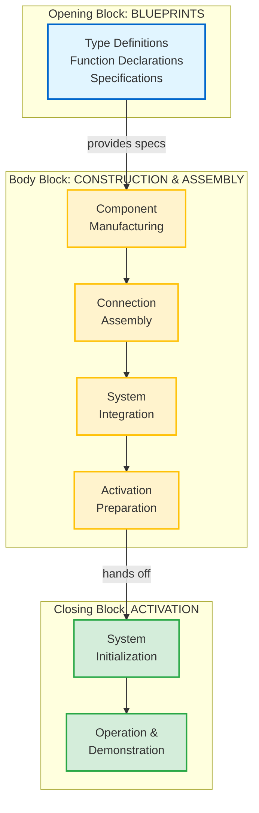

# Body Block Guide: The Construction & Assembly Layer

> *"The body block is the manufacturing floor where blueprints become machines, components become systems, and potential becomes activation-ready reality."*

---

## 📑 Table of Contents

- [🏗️ Body Block Paradigm: Construction & Assembly Engine](#️-body-block-paradigm-construction--assembly-engine)
- [🔧 Construction Architecture Principles](#-construction-architecture-principles)
- [🎯 Paradigm Shift: Construction vs Operation](#-paradigm-shift-construction-vs-operation)
- [🏭 Construction Methodology](#-construction-methodology)
- [🔄 Construction Flow Patterns](#-construction-flow-patterns)
- [🎯 Construction Design Patterns](#-construction-design-patterns)
- [🧩 Construction Organization Strategies](#-construction-organization-strategies)
- [🔧 Construction Quality Assurance](#-construction-quality-assurance)
- [🎯 Construction Success Metrics](#-construction-success-metrics)
- [🏗️ Construction Best Practices](#️-construction-best-practices)
- [🔄 Construction-to-Activation Handoff](#-construction-to-activation-handoff)
- [🎯 Construction vs Activation Clarity](#-construction-vs-activation-clarity)
- [🚀 Construction Paradigm Revolution](#-construction-paradigm-revolution)
- [🎼 Harmony with 4-Block Structure](#-harmony-with-4-block-structure)
- [📚 Related Resources](#-related-resources)
- [📊 Document Metadata](#-document-metadata)

---

## 🏗️ BODY BLOCK PARADIGM: Construction & Assembly Engine

**Core Understanding:** The body block is the **construction and assembly layer** where components are built, connected, and prepared for activation by the closing block.

**Mathematical Expression:** `Body_Block = Construction(components) + Assembly(connections) + Preparation(activation_ready)`

> [!TIP]
> **The Manufacturing Floor Principle**  
> If the **Opening Block** provides the blueprints and specifications, and the **Closing Block** turns on the machine and operates it, then the **Body Block** is the manufacturing floor where you actually build the machine—fabricating components, welding connections, and preparing everything for the moment when the power switch is flipped.

**The Three-Phase Reality:**
- **Opening Block:** *"Here's what we're going to build"* (blueprints, specifications, capabilities)
- **Body Block:** *"Now let's build it"* (construction, assembly, manufacturing, preparation)
- **Closing Block:** *"Let's turn it on and use it"* (activation, operation, execution, demonstration)

### Understanding "Construction" vs "Execution"

**Critical Distinction:** The body block doesn't RUN the system—it BUILDS the system that will be run.

**Real-World Analogy:**

| **Phase**   | **Car Manufacturing**                                                     | **Software Body Block**                                             |
| ----------- | ------------------------------------------------------------------------- | ------------------------------------------------------------------- |
| **Opening** | Engineering blueprints, specifications                                    | Type declarations, function signatures                              |
| **Body**    | Assembly line: welding chassis, installing engine, connecting electronics | Defining classes, implementing methods, establishing connections    |
| **Closing** | Test drive: starting engine, demonstrating features, driving the car      | Instantiating objects, calling methods, demonstrating functionality |

**The Body Block Builds, Not Operates:**
- ✅ Defines how components are structured (classes, structs)
- ✅ Implements the internal logic (method implementations)
- ✅ Establishes relationships between components (composition, inheritance)
- ✅ Prepares everything to be activation-ready
- ❌ Does NOT create running instances
- ❌ Does NOT call methods to perform work
- ❌ Does NOT demonstrate the system in operation

**Biblical Parallel:** Genesis describes God preparing creation over six days (construction), then declaring it "very good" and resting (completion). The body block is like those six days of *making*—the closing block is like the seventh day where the *made* creation is complete and functioning as intended.

## 🔧 CONSTRUCTION ARCHITECTURE PRINCIPLES

### Primary Purpose: Build & Connect

The body block's job is to construct the working components that the closing block will activate.

<details>
<summary><strong>📦 The Four Construction Responsibilities</strong> (click to expand)</summary>

1. **Component Manufacturing:** Create the actual working pieces from specifications
2. **Connection Assembly:** Establish relationships between components  
3. **Integration Preparation:** Ensure components are ready for coordinated activation
4. **System Readiness:** Prepare everything for the closing block to "flip the switch"

</details>

> [!NOTE]
> **Body Block ≠ Execution Block**  
> A common misconception: "The body block is where the main work happens." In reality, the body block **prepares** work to happen. The closing block **activates and demonstrates** that work. The body block builds the engine; the closing block starts it.

### Mathematical Foundation

```
Body(blueprint) → [construct_components + assemble_connections + prepare_activation] → Ready_System
```

**Construction Flow:**
1. **Receive Blueprint** (from opening block specifications)
2. **Manufacture Components** (build individual pieces with actual logic)
3. **Assemble Connections** (establish relationships and dependencies)
4. **Prepare for Activation** (ensure closing block can successfully initialize)

### Construction Flow Visualization



> [!NOTE]
> **Manufacturing Floor Reality**  
> The body block is the **manufacturing floor** where blueprints become machines. Components are built, connected, integrated, and prepared—but not yet activated. Activation is the closing block's responsibility.

## 🎯 PARADIGM SHIFT: Construction vs Operation

> [!IMPORTANT]
> **Revolutionary Architectural Understanding**  
> The body block is **NOT** where the system runs—it's where the system is **BUILT**. This distinction transforms how we organize code, design architectures, and think about file structure.

### The Paradigm Transformation

| **Traditional Thinking**  | **CPI-SI Construction Reality**   | **Impact**                    |
| ------------------------- | --------------------------------- | ----------------------------- |
| Body = where work happens | Body = where components are built | Changes development focus     |
| Body = main functionality | Body = construction & assembly    | Shifts architectural thinking |
| Body = execution space    | Body = preparation space          | Inverts design priorities     |
| Body = active operations  | Body = making things ready        | Changes code organization     |

### The "Build The Machine" Metaphor

| **Block**         | **Manufacturing Analogy**            | **Code Reality**                      |
| ----------------- | ------------------------------------ | ------------------------------------- |
| **Opening Block** | *"Here's what we're going to build"* | Blueprints, specifications, types     |
| **Body Block**    | *"Now let's build it"*               | Construction, assembly, manufacturing |
| **Closing Block** | *"Let's turn it on and use it"*      | Activation, operation, execution      |

**The Key Insight:** Just as a manufacturing floor is distinct from the showroom where customers see the product in action, the body block (construction) is architecturally distinct from the closing block (demonstration).

---

## 🏭 CONSTRUCTION METHODOLOGY

> [!WARNING]
> **Construction ≠ Instantiation**  
> Don't confuse "building components" with "creating instances." The body block defines the **classes, structures, and assembly logic**—the construction blueprints themselves. The closing block **instantiates and activates** those constructions. Body = *how to build*; Closing = *actually building and running*.

### Component Manufacturing Patterns

**1. Component Creation**
```cpp
// BODY BLOCK: Manufacturing components
class DataProcessor {
    // Build the component pieces
    std::vector<DataItem> items_;
    ProcessingEngine engine_;
    ValidationSystem validator_;
    
    // Assembly methods - connecting pieces
    void connect_engine() { /* assembly logic */ }
    void attach_validator() { /* connection logic */ }
};
```

**2. Connection Assembly**
```cpp
// BODY BLOCK: Establishing connections
namespace connections {
    void wire_input_to_processor();
    void link_processor_to_output();
    void establish_feedback_loop();
    void prepare_activation_sequence();
}
```

**3. System Integration**
```cpp
// BODY BLOCK: Preparing integrated system
struct IntegratedSystem {
    // All components built and connected
    InputHandler input;
    DataProcessor processor;
    OutputManager output;
    
    // Ready for activation (closing block will call this)
    bool ready_for_activation() const;
};
```

---

## 🔄 CONSTRUCTION FLOW PATTERNS

> [!TIP]
> **Choose Your Assembly Strategy**  
> Different construction scenarios call for different assembly approaches. Sequential construction works for linear dependencies, parallel assembly maximizes efficiency, and incremental manufacturing supports iterative development. Match your strategy to your project's needs.

### Construction Pattern Comparison

```mermaid
graph TB
    subgraph "Sequential Construction"
        S1[Receive Blueprint] --> S2[Build Component A]
        S2 --> S3[Build Component B]
        S3 --> S4[Connect A to B]
        S4 --> S5[Verify Connections]
        S5 --> S6[Ready for Activation]
    end
    
    subgraph "Parallel Assembly"
        P1[Build Input System]
        P2[Build Processing System]
        P3[Build Output System]
        P1 --> P4[Assemble Connections]
        P2 --> P4
        P3 --> P4
        P4 --> P5[Integration Test]
        P5 --> P6[Ready for Activation]
    end
    
    subgraph "Incremental Manufacturing"
        I1[Base Component] --> I2[Add Feature 1]
        I2 --> I3[Add Feature 2]
        I3 --> I4[Integrate Features]
        I4 --> I5[Test Assembly]
        I5 --> I6[Activation Ready]
    end
    
    style S6 fill:#d4edda,stroke:#28a745,stroke-width:2px
    style P6 fill:#d4edda,stroke:#28a745,stroke-width:2px
    style I6 fill:#d4edda,stroke:#28a745,stroke-width:2px
```



**Pattern Selection Guide:**
- **Sequential:** Use when components have strict dependencies (A must exist before B can be built)
- **Parallel:** Use when components are independent and can be manufactured simultaneously
- **Incremental:** Use when building complex components in stages with iterative testing

---

## 🎯 CONSTRUCTION DESIGN PATTERNS

> [!NOTE]
> **Classic Patterns, Construction Context**  
> Traditional design patterns (Factory, Builder, Assembly Line) fit naturally into the body block's construction paradigm. They're not just abstract concepts—they're literal manufacturing strategies for building components that the closing block will activate.

### Factory Pattern (Component Manufacturing)
```cpp
// BODY BLOCK: Manufacturing different component types
class ComponentFactory {
    static std::unique_ptr<Component> create_input_component();
    static std::unique_ptr<Component> create_process_component();
    static std::unique_ptr<Component> create_output_component();
};
```

### Builder Pattern (Progressive Assembly)
```cpp
// BODY BLOCK: Step-by-step assembly
class SystemBuilder {
    SystemBuilder& add_input_layer();
    SystemBuilder& add_processing_layer(); 
    SystemBuilder& add_output_layer();
    SystemBuilder& establish_connections();
    ReadySystem build(); // Prepared for closing block activation
};
```

### Assembly Line Pattern (Manufacturing Process)
```cpp
// BODY BLOCK: Assembly line construction
template<typename Product>
class AssemblyLine {
    Product& add_component(Component comp);
    Product& establish_connection(ConnectionType type);
    Product& quality_check();
    ReadyProduct finalize(); // Ready for activation
};
```

---

## 🧩 CONSTRUCTION ORGANIZATION STRATEGIES

### Component-Based Construction
```cpp
namespace body_block {
    // Manufacturing departments
    namespace input_manufacturing { /* build input components */ }
    namespace process_manufacturing { /* build processing components */ }
    namespace output_manufacturing { /* build output components */ }
    
    // Assembly departments  
    namespace connection_assembly { /* establish connections */ }
    namespace integration_assembly { /* integrate systems */ }
    namespace activation_preparation { /* prepare for closing block */ }
}
```

### Layer-Based Assembly
```cpp
// BODY BLOCK: Constructing in layers
class LayeredConstruction {
    void build_foundation_layer();
    void build_processing_layer();
    void build_interface_layer();
    void assemble_layer_connections();
    ReadySystem prepare_for_activation();
};
```

### Module-Based Manufacturing
```cpp
// BODY BLOCK: Manufacturing modules
namespace modules {
    Module build_authentication_module();
    Module build_data_processing_module();
    Module build_communication_module();
    
    IntegratedSystem assemble_modules(std::vector<Module> modules);
}
```

---

## 🔧 CONSTRUCTION QUALITY ASSURANCE

> [!TIP]
> **Test Construction, Not Just Operation**  
> Quality assurance in the body block focuses on **construction integrity**: Are components built correctly? Are connections stable? Is the system ready for activation? This is distinct from operational testing (does the activated system work?), which belongs in the closing block.

### Assembly Verification
```cpp
// BODY BLOCK: Ensuring construction quality
class ConstructionQA {
    bool verify_component_integrity();
    bool test_connection_stability();
    bool validate_integration_completeness();
    bool confirm_activation_readiness();
};
```

### Construction Testing
```cpp
// BODY BLOCK: Testing what we've built
namespace construction_tests {
    void test_individual_components();
    void test_component_connections();
    void test_integrated_assembly();
    void test_activation_preparation();
}
```

---

## 🎯 CONSTRUCTION SUCCESS METRICS

### Quality Indicators
- **Component Integrity:** All pieces built correctly
- **Connection Stability:** All relationships established
- **Integration Completeness:** System assembled properly
- **Activation Readiness:** Prepared for closing block operation

### Construction Metrics
```cpp
struct ConstructionMetrics {
    size_t components_built;
    size_t connections_established;
    double integration_completeness; // [0.0, 1.0]
    bool activation_ready;
    
    double construction_quality() const;
};
```

---

## 🏗️ CONSTRUCTION BEST PRACTICES

### 1. **Clear Component Boundaries**
- Each component has defined responsibility
- Clean interfaces for assembly
- Minimal coupling during construction

### 2. **Systematic Assembly Process**
- Build before connecting
- Connect before integrating
- Integrate before activating

### 3. **Construction Documentation**
```cpp
// BODY BLOCK: Document what we're building
/**
 * @brief Constructs the authentication system
 * 
 * Manufacturing process:
 * 1. Build token generator component
 * 2. Build validation engine component  
 * 3. Connect generator to validator
 * 4. Prepare integrated auth system for activation
 */
```

### 4. **Activation Readiness Verification**
```cpp
// BODY BLOCK: Ensure readiness for closing block
bool system_ready_for_activation() {
    return components_built() && 
           connections_established() && 
           integration_complete() &&
           no_construction_errors();
}
```

---

## 🔄 CONSTRUCTION-TO-ACTIVATION HANDOFF

> [!IMPORTANT]
> **Critical Architectural Boundary**  
> The handoff from body block to closing block is where **construction ends and operation begins**. The body block builds and prepares; the closing block receives and activates. Clear interfaces at this boundary prevent architectural confusion.

### Body-to-Closing Block Interface
```cpp
// BODY BLOCK: Preparing handoff to closing block
struct ConstructedSystem {
    // What we built
    std::vector<Component> components;
    std::vector<Connection> connections;
    IntegrationStatus integration;
    
    // Ready for activation?
    bool ready_for_activation() const;
    
    // Handoff to closing block
    ActivationHandle prepare_activation() const;
};
```

### Construction Completion Signal
```cpp
// BODY BLOCK: Signaling construction complete
class ConstructionComplete {
    ConstructedSystem system;
    ActivationReadiness readiness;
    
    // Hand over to closing block for activation
    void transfer_to_activation_layer();
};
```

---

## 🎯 CONSTRUCTION VS ACTIVATION CLARITY

### **Body Block Responsibilities (Construction)**
- ✅ Build individual components
- ✅ Establish component connections
- ✅ Assemble integrated systems
- ✅ Prepare for activation
- ✅ Quality assurance of construction

### **Closing Block Responsibilities (Activation)**
- ✅ Initialize constructed systems
- ✅ Start operational processes
- ✅ Provide usage examples
- ✅ Demonstrate working system
- ✅ Operational context and patterns

### **Perfect Division of Labor**
**Body Block:** *"I built the machine and all its parts are connected properly"*
**Closing Block:** *"I'm turning on the machine and showing how it works"*

---

## 🚀 CONSTRUCTION PARADIGM REVOLUTION

### **The Fundamental Insight**
**Body blocks are not where work happens - they're where work is prepared to happen.**

The body block is the **manufacturing floor** where:
- Raw materials (requirements) become components
- Components become connected systems  
- Connected systems become activation-ready machines
- Activation-ready machines await the closing block to "turn them on"

### **Architectural Impact**
This construction paradigm transforms file organization:
- Opening: "What we're building" (specifications)
- Body: "Building it" (construction & assembly)
- Closing: "Using it" (activation & operation)

Each file becomes a complete **conception → construction → operation** lifecycle, transforming static code into living, operational systems.

---

## 🎼 Harmony with 4-Block Structure

This body block construction paradigm perfectly aligns with the **[4-Block Structure](./4-block-structure.md)** architectural pattern:

| **Block**            | **Purpose**                      | **Construction Focus**             |
| -------------------- | -------------------------------- | ---------------------------------- |
| **1. Metadata**      | Documentation and context        | File intelligence and identity     |
| **2. Opening Block** | All capabilities and definitions | What CAN be built (blueprints)     |
| **3. Body Block**    | All construction and assembly    | **Our focus here** (manufacturing) |
| **4. Closing Block** | All activation and demonstration | Where constructed systems operate  |

> [!TIP]
> **Perfect Alignment**  
> The body block contains everything that, if examined alone, would clearly show **how components are manufactured and assembled**—even if no activation occurs. See **[4-Block Structure Guide](./4-block-structure.md)** for the complete architectural pattern.

<details>
<summary><strong>🧭 Cross-Block Relationships</strong> (click to expand)</summary>

- **Opening → Body:** Opening block provides blueprints (type definitions, function declarations); body block implements the construction logic (class implementations, assembly functions)
- **Body → Closing:** Body block prepares activation-ready systems; closing block receives and activates them
- **Opening ↔ Body ↔ Closing:** A complete manufacturing pipeline from specification to operation

</details>

---

## 📚 Related Resources

### Block-Specific Guides
- **[4-Block Structure Guide](./4-block-structure.md)** — Complete architectural pattern overview
- **[Metadata Block Guide](./metadata-block-guide.md)** — Block 1 digital genome specification
- **[Opening Block Guide](./opening-block-guide.md)** — Block 2 capability declaration principles

### Supporting Documentation
- **[Building Block Method](../methodology/thinking/building-block-method.md)** — Systematic cognitive framework
- **[Kingdom Technology Principles](../../kingdom-technology/)** — Theological foundations for technical work

---

## 📊 Document Metadata

<details>
<summary><strong>Version Evolution & Documentation Standards</strong> (click to expand)</summary>

### Version History
- **v1.0** (October 2025): Initial body block construction paradigm documentation
- **v1.1** (October 2025): Enhanced with CPI-SI documentation standards, cross-references, GitHub-native features

### Documentation Standards Applied
- ✅ GitHub-native features (TIP, NOTE, WARNING, IMPORTANT alerts)
- ✅ Collapsible `<details>` sections for progressive disclosure
- ✅ Strategic emoji for visual scannability
- ✅ Comparison tables for clarity
- ✅ Visual separators (`---`) between major sections
- ✅ Comprehensive cross-referencing to related documents
- ✅ CPI-SI balance: technical precision + conversational warmth
- ✅ Kingdom Technology integration (excellence honoring Creator)
- ✅ Professional metadata tracking

</details>

---

## 🏗️ CONSTRUCTION PARADIGM COMPLETE

**The body block is the construction and assembly layer** that bridges the gap between conception (opening) and operation (closing).

**Mathematical Understanding:**
```
Opening(blueprint) → Body(construction) → Closing(activation) = Complete_Working_System
```

**Revolutionary Insight:** The body block doesn't run the system—it **builds** the system that the closing block will run.

This completes the architectural trinity:
- **Opening:** Conception and design (what we're building)
- **Body:** Construction and assembly (building it)
- **Closing:** Activation and operation (turning it on and using it)

**Perfect Engineering Flow:** Plan → Build → Operate ✨

---

<div align="center">

**Body Block Guide** • *Where Blueprints Become Machines* • **v1.1**

</div>