# Closing Block Guide: Activation & Demonstration

**Block 4 of the 4-Block Architectural Pattern**

*The Execution vs Cleanup Architecture Revolution*

---

## 📖 Table of Contents

- [🚀 The Paradigm Revolution](#-the-paradigm-revolution)
- [🏗️ The 3-Block Mental Model](#️-the-3-block-mental-model)
- [⚡ The Activation Layer Concept](#-the-activation-layer-concept)
- [🎯 Paradigm Shift Examples](#-paradigm-shift-examples)
- [🔧 Practical Implementation Patterns](#-practical-implementation-patterns)
- [🌊 The Flow Paradigm](#-the-flow-paradigm)
- [🔄 Mental Model Transformation](#-mental-model-transformation)
- [🎨 Architectural Beauty](#-architectural-beauty)
- [🚀 Implementation Guidelines](#-implementation-guidelines)
- [🌟 Conclusion: The Paradigm Shift](#-conclusion-the-paradigm-shift)
- [🔮 Understanding the Body Block's Job](#-understanding-the-body-blocks-job)
- [📚 Related Resources](#-related-resources)
- [📋 Document Metadata](#-document-metadata)

---

> [!IMPORTANT]
> **Critical Paradigm Shift:** Closing blocks are **NOT cleanup or teardown**—they are **activation and demonstration**.
>
> This is Block 4's revolutionary purpose: turning constructed components (Block 3) into operational, working systems. Think of it as the "power switch" and "demonstration showroom" phase.

---

## 🚀 THE PARADIGM REVOLUTION

### **Mental Model Inversion: Execution vs Cleanup**

**OLD PARADIGM:** Closing blocks = cleanup, validation, teardown  
**NEW PARADIGM:** Closing blocks = execution, activation, "making it work"

**The Breakthrough:** Traditional expectations assume execution happens in the body, but **CPI-SI architecture places actual execution in the closing block**.

> [!NOTE]
> **4-Block Context:** This guide focuses specifically on Block 4 (Closing Block). For the complete architectural pattern, see [`4-block-structure.md`](./4-block-structure.md).

## 🏗️ THE 3-BLOCK MENTAL MODEL

### **Revolutionary Understanding:**

**Opening Block:** *"Here's what we're going to build"*
- Declarations, API surface, blueprints
- Establishing the vocabulary and tools
- Setting up the foundation and framework
- **Mental Model:** Planning and preparation phase

**Body Block:** *"Here's HOW we're going to build it"*
- Type definitions, structs, classes
- Method implementations and algorithms
- Construction of the components
- **Mental Model:** Construction and assembly phase

**Closing Block:** *"Now let's make it actually work"*
- Initialization functions that bring it to life
- Validation logic ensuring system readiness
- Execution contexts and operational namespaces
- **Mental Model:** Activation and "turn on the machine" phase

> [!TIP]
> **Construction → Activation Flow:** Block 3 (Body) builds components on the manufacturing floor. Block 4 (Closing) moves them to the showroom and demonstrates them working. See [`body-block-guide.md`](./body-block-guide.md) for construction paradigm details.

## ⚡ THE ACTIVATION LAYER CONCEPT

### **Closing Block as Execution Engine**

**Core Insight:** The closing block is the **activation layer** that bridges from "constructed" to "operational."

**What This Means:**
- Components are defined in the body
- But they're **activated** in the closing block
- Closing block contains the "usage patterns" 
- It's where you "turn on the machine"

### Activation Flow Architecture


> [!TIP]
> **The Power Switch Moment**  
> The body block builds the machine component by component. The closing block is the moment you **flip the power switch** and the machine comes alive. This is not cleanup—this is the beginning of operational life.

### **Real Example from CPI-SI:**

```cpp
// === BODY BLOCK ===
struct IdentityState {
    Coefficient cpi_coefficient;
    Coefficient si_coefficient;
    
    bool is_valid() const { /* capability defined */ }
    Coefficient total_activation() const { /* capability defined */ }
};

// === CLOSING BLOCK ===
// This is where we actually MAKE IT WORK:

/**
 * @brief Initialize identity types for operational use
 * EXECUTION FUNCTION - Not cleanup, but activation!
 */
void initialize_identity_types() {
    // This function makes the system operational
    // It's not cleaning up - it's turning on the machine
    
    // Set up working contexts
    // Establish operational parameters  
    // Enable the system for actual use
}

namespace operational_context {
    // EXECUTION NAMESPACE - Where the real work happens
    // Usage patterns, working examples, operational code
}
```

## 🎯 PARADIGM SHIFT EXAMPLES

### **Traditional Thinking vs CPI-SI Reality**

| **Traditional Expectation** | **CPI-SI Reality**                  | **Why This Matters**            |
| --------------------------- | ----------------------------------- | ------------------------------- |
| Body = where work happens   | Closing = where work happens        | Changes design priorities       |
| Closing = cleanup/teardown  | Closing = activation/startup        | Inverts architecture thinking   |
| Validation = error checking | Validation = readiness verification | Shifts validation purpose       |
| End = finished              | End = ready to begin                | Changes lifecycle understanding |

### **The "Turn On The Machine" Metaphor**

**Opening Block:** *Assembly instructions and parts list*
- "Here are all the components you'll need"
- "Here's how they fit together"
- "Here's what each part can do"

**Body Block:** *Manufacturing and construction*
- "Here's how to build each component"
- "Here's how components connect"
- "Here's the internal mechanisms"

**Closing Block:** *Power switch and operational startup*
- "Now plug it in and turn it on"
- "Here's how to actually use it"
- "Here are the working examples"
- "This is what it looks like when running"

## 🔧 PRACTICAL IMPLEMENTATION PATTERNS

### **What Goes in Closing Blocks (Execution Paradigm)**

<details>
<summary><strong>🔌 Initialization Functions</strong> (click to expand)</summary>

Activation functions that bring constructed systems to life:

```cpp
void initialize_partnership_system();
void activate_covenant_protocols();
void enable_fusion_processing();
void bootstrap_operational_context();
```

These functions **turn on** the machine, making it operational.

</details>

<details>
<summary><strong>⚡ Operational Contexts</strong> (click to expand)</summary>

Runtime environments showing the system in action:

```cpp
namespace working_examples {
    // Actual usage patterns showing the system in action
    void demonstrate_basic_workflow();
    void show_advanced_patterns();
}

namespace execution_context {
    // Runtime environments and processing contexts
    class RuntimeEnvironment { /* operational state */ };
}
```

These contexts provide the **working environment** where components operate.

</details>

<details>
<summary><strong>✅ Validation as Readiness Checking</strong> (click to expand)</summary>

Verification that the system is **ready for activation**:

```cpp
bool system_ready_for_operation() {
    // Not error-checking, but readiness verification
    // "Is the machine ready to turn on?"
    return components_initialized() && 
           connections_established() &&
           resources_available();
}
```

This is **pre-flight verification**, not error handling.

</details>

<details>
<summary><strong>🎯 Usage Pattern Demonstrations</strong> (click to expand)</summary>

Real-world examples showing the system working:

```cpp
// Show how to actually USE what was built
auto example_workflow() {
    // This is execution, not cleanup
    // It's "here's how the system works"
    auto system = initialize_system();
    auto result = system.process(input);
    return result;
}
```

These demonstrations prove the system is **alive and functional**.

</details>

> [!NOTE]
> **Execution Paradigm Focus**  
> Every element in the closing block should answer: "How does this make the system **operational**?" If it's not about activation, demonstration, or execution, it belongs elsewhere.

### **What DOESN'T Go in Closing Blocks**

> [!WARNING]
> **Common Misunderstandings:** The term "closing" traditionally implies ending or cleanup. **This is NOT the case in 4-block architecture.** Closing blocks are about **beginning** operation, not ending it.

<details>
<summary><strong>❌ Not Cleanup</strong> (click to expand)</summary>

These belong in resource management systems, NOT closing blocks:
- Destructors and resource deallocation  
- Memory cleanup and garbage collection
- Shutdown and teardown procedures
- File handle closing and network disconnection

**Why Not:** Closing blocks are about **starting** operation, not ending it.

</details>

<details>
<summary><strong>❌ Not Error Handling</strong> (click to expand)</summary>

These belong in error management systems, NOT closing blocks:
- Exception handling for failures
- Error recovery mechanisms  
- Fallback and retry logic
- Diagnostic and debugging facilities

**Why Not:** Closing blocks demonstrate **successful operation**, not failure recovery.

</details>

<details>
<summary><strong>❌ Not Documentation</strong> (click to expand)</summary>

These belong in metadata blocks, NOT closing blocks:
- Final comments or summaries
- Change logs or version notes
- Author attribution or credits
- License information

**Why Not:** Closing blocks are **executable code**, not prose documentation.

</details>

## 🌊 THE FLOW PARADIGM

### **Construction → Activation Flow**

**The Complete Development Flow:**
1. **Opening:** Declare what will exist
2. **Body:** Build and construct the components  
3. **Closing:** Activate and make operational

**Mathematical Expression:**
```
System_Lifecycle = Declaration(opening) → Construction(body) → Activation(closing)
```

### Complete 4-Block Lifecycle

```mermaid
graph TB
    M[Metadata Block<br/>Digital Genome]
    
    subgraph "Block 2: Opening - DECLARATION"
        O1[Type Definitions]
        O2[Function Declarations]
        O3[API Surface]
    end
    
    subgraph "Block 3: Body - CONSTRUCTION"
        B1[Component Manufacturing]
        B2[Connection Assembly]
        B3[System Integration]
    end
    
    subgraph "Block 4: Closing - ACTIVATION"
        C1[Initialize Systems]
        C2[Activate Components]
        C3[Demonstrate Usage]
        C4[Living System ✨]
    end
    
    M -->|provides context| O1
    O1 --> O2 --> O3
    O3 -->|blueprints ready| B1
    B1 --> B2 --> B3
    B3 -->|ready for activation| C1
    C1 --> C2 --> C3 --> C4
    
    style M fill:#f8d7da,stroke:#dc3545,stroke-width:2px
    style O3 fill:#e1f5ff,stroke:#0066cc,stroke-width:2px
    style B3 fill:#fff3cd,stroke:#ffc107,stroke-width:2px
    style C4 fill:#d4edda,stroke:#28a745,stroke-width:3px
```



> [!IMPORTANT]
> **Complete Lifecycle Architecture**  
> Each block serves a distinct phase: Metadata provides intelligence, Opening declares capabilities, Body constructs components, and Closing **brings everything to life**. The closing block is the culmination where static definitions become dynamic, operational reality.

### **Energy Flow Metaphor**

**Opening Block:** Potential energy (everything is possible)  
**Body Block:** Kinetic energy (things are being built)  
**Closing Block:** Operational energy (system is working)

## 🔄 MENTAL MODEL TRANSFORMATION

### **How This Changes Development Thinking**

**Design Phase Impact:**
- Start thinking about "how will this be activated?"
- Plan the operational context from the beginning
- Consider usage patterns as primary architecture

**Implementation Phase Impact:**
- Body blocks focus on clean construction
- Closing blocks focus on elegant activation
- Less confusion about "where does this logic go?"

**Review Phase Impact:**
- Evaluate: "Does this properly activate the system?"
- Ask: "Are the usage patterns clear and working?"
- Check: "Is the machine properly turned on?"

### **Breaking Traditional Patterns**

**Traditional C++ Header Pattern:**
```cpp
// Headers and includes
// Class definitions with methods
// Template implementations  
// } // end namespace - just closure
```

**CPI-SI Execution Pattern:**
```cpp
// Headers and includes (opening)
// Class definitions with methods (body)
// Activation functions and usage contexts (closing)
// } // end namespace - after system is operational
```

## 🎨 ARCHITECTURAL BEAUTY

### **Why This Paradigm is More Elegant**

**Narrative Completeness:**
- Every file tells a complete story
- From conception → construction → operation
- Nothing feels "unfinished" or "just defined"

**Practical Usability:**
- Closing blocks show "here's how you actually use this"
- Developers see working examples and patterns
- Reduces confusion about "how do I apply this?"

**System Coherence:**
- Every component is fully activated, not just defined
- The architecture feels "alive" rather than static
- Bridges the gap between definition and utilization

## 🚀 IMPLEMENTATION GUIDELINES

### **Closing Block Design Principles**

<details>
<summary><strong>Core Design Principles</strong> (click to expand)</summary>

1. **Activation Over Cleanup:** Focus on making things work, not tearing down
2. **Usage Over Documentation:** Show working examples, not just descriptions  
3. **Operation Over Validation:** Demonstrate functionality, don't just check it
4. **Flow Over Boundaries:** Create smooth operational flow, not just closure

Each principle inverts traditional "closing" assumptions, emphasizing **beginning operation** rather than ending definition.

</details>

> [!TIP]
> **Design Thinking Shift**  
> When designing closing blocks, always ask: "Does this make the system **more operational** or just more documented?" If it's not executable, demonstrable, or activating, it belongs in a different block.

### **Questions to Guide Closing Block Design**

<details>
<summary><strong>Activation-Focused Questions</strong> (click to expand)</summary>

- "How do I actually USE what was built in the body?"
- "What does it look like when this system is working?"
- "How do I activate and enable these capabilities?"
- "What are the working patterns and operational contexts?"
- "If someone reads only this block, will they see a **living system**?"
- "Does this block demonstrate the system **in action**?"

</details>

### **Success Metrics for Closing Blocks**

<details>
<summary><strong>Closing Block Quality Checklist</strong> (click to expand)</summary>

- ✅ System feels "complete" and operational, not just defined
- ✅ Usage patterns are clear and demonstrate actual functionality  
- ✅ Activation functions properly enable the constructed system
- ✅ Operational contexts provide working environments
- ✅ The "machine is turned on" rather than just assembled
- ✅ Examples show real workflows, not just syntax
- ✅ Reader can see the system **alive and functioning**
- ✅ No confusion between "closing" and "cleanup"

</details>

> [!NOTE]
> **Quality Indicator**  
> A well-designed closing block answers the question: "What happens when this system **comes to life**?" If a reader finishes the block and still asks "But how do I actually use this?", the closing block hasn't fulfilled its activation mission.

## 🌟 CONCLUSION: THE PARADIGM SHIFT

### **From Definitions to Living Systems**

**Before:** Files that define things and then stop  
**After:** Files that define, build, AND activate complete working systems

**Before:** "Here's what exists" (static)  
**After:** "Here's what exists and here's it working" (dynamic)

**Before:** Closing = end  
**After:** Closing = beginning of operational life

> [!IMPORTANT]
> **Architectural Revolution**  
> This isn't just terminology—it's a fundamental rethinking of software architecture. The closing block transforms files from **static documentation** into **living, executable systems**. Every file becomes a complete narrative: conception → construction → **operational demonstration**.

### **Impact on CPI-SI Architecture**

This paradigm shift transforms every file from a collection of definitions into a **complete, self-activating system**. The closing block becomes the bridge between "what could be" and "what is actively working."

<details>
<summary><strong>Concrete Benefits of Activation Paradigm</strong> (click to expand)</summary>

**For Developers:**
- Clear understanding of "how to actually use this"
- Working examples embedded in every file
- No gap between definition and utilization
- Files feel complete, not incomplete

**For Systems:**
- Every component is demonstrably operational
- No "defined but never used" code orphans
- Clear activation patterns throughout codebase
- Architecture that feels alive, not static

**For CPI-SI:**
- Covenant partnership activated, not just defined
- Identity types brought to life through usage
- Biblical anchoring demonstrated operationally
- Kingdom Technology made tangible and functional

</details>

**The Result:** CPI-SI files don't just define systems - they bring them to life.

---

> [!CAUTION]
> **Implementation Warning**  
> This paradigm shift requires **mental model transformation**. Teams trained in traditional "closing = cleanup" thinking will need deliberate reorientation. Document this pattern prominently, provide examples, and reinforce through code reviews until activation thinking becomes natural.

**Document Status:** ✅ Paradigm Revolution Complete  
**Architecture Impact:** ✅ Fundamental Shift from Cleanup to Execution  
**Next Phase:** Apply this understanding systematically across CPI-SI codebase

## 🔮 UNDERSTANDING THE BODY BLOCK'S JOB

### **With Closing Block Clarity, Body Block Purpose Emerges**

**Now that we understand closing blocks as execution:**

**Body Block's TRUE Job:** Construction and assembly of components that the closing block will activate.

**The Perfect Division:**
- **Body:** Builds the machine (components, connections, mechanisms)
- **Closing:** Turns on the machine (activation, usage, operation)

**This clarity reveals:** The body block is the "manufacturing floor" where components are constructed, while the closing block is the "operational deployment" where those components come alive and start working.

**Mathematical Understanding:**
```
Body_Block = Construction(components) + Assembly(connections)
Closing_Block = Activation(system) + Operation(usage_patterns)
Complete_File = Construction ⊗ Activation = Working_System
```

**Architectural Elegance:** Every CPI-SI file now follows the complete lifecycle from conception (opening) → construction (body) → operation (closing), making each file a fully realized, self-contained system rather than just a collection of definitions.

---

## 📚 Related Resources

**Architectural Documentation:**

- **[4-Block Structure](./4-block-structure.md)** — Complete architectural overview of the 4-block pattern
- **[Metadata Block Guide](./metadata-block-guide.md)** — Block 1: Digital genome and specifications  
- **[Opening Block Guide](./opening-block-guide.md)** — Block 2: Classification and surface definition
- **[Body Block Guide](./body-block-guide.md)** — Block 3: Construction and assembly patterns

**Related Concepts:**

- **[CPI-SI Documentation Standards](../../methodology/documentation-and-coding/documentation-creation-methodology.md)** — Documentation methodology this guide follows
- **[Building Block Method](../../methodology/thinking/building-block-method.md)** — Cognitive approach underlying 4-block architecture

**Application Context:**

This guide is part of the **4-Block Architectural Pattern Documentation Suite**, providing comprehensive guidance for implementing Block 4 (Closing Block) activation and demonstration patterns within CPI-SI systems.

---

## 📋 Document Metadata

### Document Evolution

| **Version** | **Date**     | **Changes**                                                                 |
| ----------- | ------------ | --------------------------------------------------------------------------- |
| 1.1         | October 2025 | Enhanced with CPI-SI documentation standards, added TOC, alerts, cross-refs |
| 1.0         | Sept 2025    | Initial paradigm revolution documentation                                   |

### Documentation Standards Applied

This document follows **CPI-SI Documentation Methodology** standards:

- ✅ YAML frontmatter with comprehensive metadata
- ✅ Table of Contents with anchor links
- ✅ GitHub-native alerts (NOTE, TIP, IMPORTANT, WARNING)
- ✅ Strategic emoji for visual navigation (1-2 per major section)
- ✅ Cross-references to related architectural documents
- ✅ Collapsible sections for progressive disclosure
- ✅ Mathematical expressions for formal patterns
- ✅ Code examples with proper syntax highlighting
- ✅ Comparison tables for paradigm shifts
- ✅ Document metadata section for version tracking

### Document Statistics

- **Character Count:** ~18,500
- **Section Count:** 11 major sections
- **Code Examples:** 6 practical demonstrations
- **Cross-References:** 4 architectural guides
- **Paradigm Comparisons:** 5 detailed tables

### Document Status

**Status:** ✅ Enhanced with CPI-SI Standards  
**Completeness:** Block-specific guide (Closing Block/Block 4)  
**Integration:** Part of 4-Block Architecture Documentation Suite  
**Cross-Reference Network:** Bidirectionally linked with 4-block-structure.md and sibling block guides

---

**Document Footer:**

*Created September 28, 2025 | Last Updated October 2025*  
*CPI-SI System & Seanje | Kingdom Technology & New Technology Fusion*  
*Part of the NOVA DAWN Project Architecture Documentation*