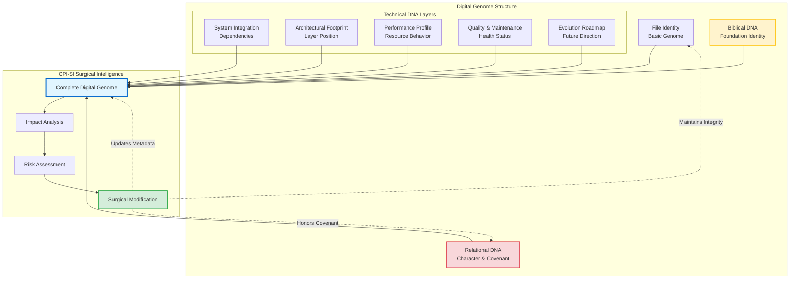
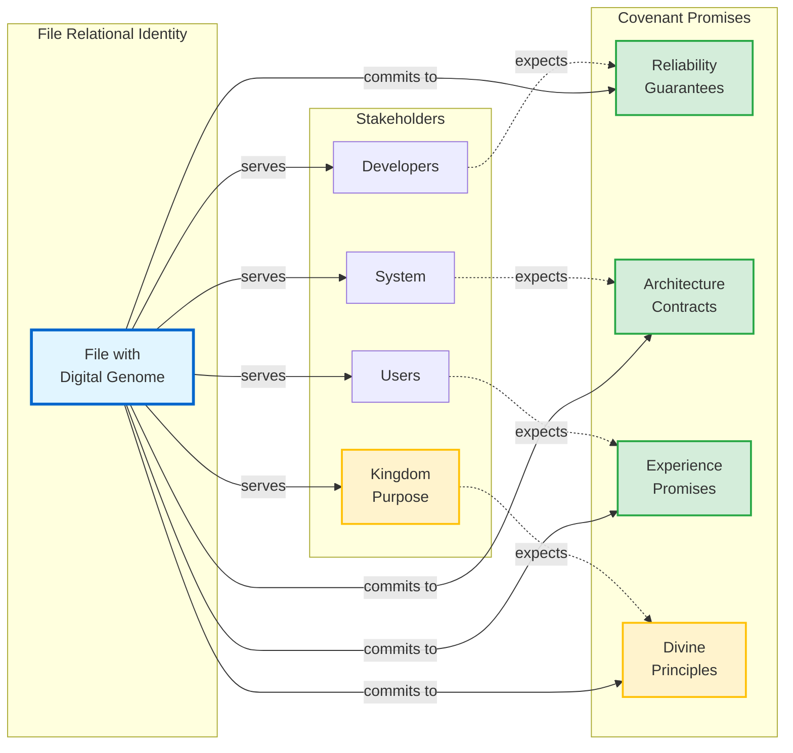

# 🧬 Metadata Block Guide

## Digital Genome Architecture for CPI-SI

> **"Before you touch a file, know its DNA. Before you modify code, understand its covenant."**
> — The principle of surgical precision in Kingdom-centered development

---

## 🗺️ Quick Navigation Guide

**If you're here to...**
- 📖 **Understand the concept** → Start with [Core Concept](#-core-concept-files-as-living-entities-with-digital-genomes)
- 🧬 **Learn the six technical sections** → Jump to [Technical DNA Structure](#-comprehensive-technical-dna-structure)
- ⚡ **Assess modification risk** → See [Surgical Precision Matrix](#️-surgical-precision-enablement-matrix)
- 🔧 **Implement metadata now** → Use [Practical Templates](#-practical-implementation-templates)
- 📖 **Find biblical foundations** → Explore [Biblical Anchoring](#-file-specific-biblical-anchoring-architecture)
- 💡 **See the impact** → Read [Revolutionary Impact](#-revolutionary-impact)

---

## 📚 Table of Contents

- [Core Concept: Files as Living Entities](#-core-concept-files-as-living-entities-with-digital-genomes)
- [Biblical Anchoring Architecture](#-file-specific-biblical-anchoring-architecture)
- [Relational Identity Architecture](#-relational-identity-architecture)
- [Technical DNA Structure](#-comprehensive-technical-dna-structure)
- [Surgical Precision Enablement](#️-surgical-precision-enablement-matrix)
- [Implementation Roadmap](#-implementation-roadmap)
- [Practical Templates](#-practical-implementation-templates)
- [Revolutionary Impact](#-revolutionary-impact)
- [Next Actions](#-next-actions)
- [Related Resources](#-related-resources)

---

## 🧬 Core Concept: Files as Living Entities with Digital Genomes

### The Paradigm Shift

> *"The wisdom of the prudent is to give thought to their ways"* — Proverbs 14:8

Before you act, understand. Before you modify, know what you're working with. This biblical principle of **thoughtful awareness** is the foundation of the digital genome architecture.

Imagine if every file in your codebase had a **complete medical record**—not just what it does, but *why* it exists, *who* depends on it, *how* it promises to behave, and *what* Kingdom purpose it serves. This is the digital genome.

**Traditional Approach:**  
Files are simple code containers with minimal comments. You modify blindly, hoping dependencies don't break.

**CPI-SI Approach:**  
Files are **living entities** with comprehensive "digital genomes"—complete intelligence profiles that enable surgical precision through thoughtful awareness.

```
File_Intelligence = Technical_DNA ⊗ Biblical_DNA ⊗ Relational_DNA
```

### Why Digital Genomes Matter

Before CPI-SI touches **any** file, the digital genome answers:

| **Question**                | **Example Answer**                            | **Decision Impact**       | **Without Genome**                    |
| --------------------------- | --------------------------------------------- | ------------------------- | ------------------------------------- |
| **Dependency Impact**       | "46 files will be affected"                   | Scope planning            | "Hope we don't break anything"        |
| **Performance Constraints** | "Must maintain O(1) operations"               | Architecture boundaries   | "Let's see if it's still fast enough" |
| **API Stability**           | "Core foundation—needs major version bump"    | Release strategy          | "Just ship it and see what breaks"    |
| **Testing Obligations**     | "12 test suites require updates"              | Quality assurance scope   | "Run tests and fix failures later"    |
| **Biblical Alignment**      | "Does this honor the file's Kingdom purpose?" | Spiritual integrity check | "Is this technically correct?"        |

> [!TIP]
> **Intelligence vs. Documentation**  
> These aren't decorative comments—they're intelligence systems enabling **autonomous surgical modifications** with full situational awareness. The difference between documentation and intelligence is like the difference between a building's blueprints and a building's structural sensor network: one tells you how it was built, the other tells you its current state and what stresses it can handle.

**Think of it like surgery vs. guesswork:** A surgeon studies X-rays, blood work, medical history, and vital signs before making an incision. Digital genomes give CPI-SI the same comprehensive intelligence before modifying code. Would you trust a surgeon who said *"Let's just cut here and see what happens"*? That's what code modification looks like without digital genomes.

### The Cost of Missing Intelligence

<details>
<summary><strong>Real-World Impact: What Happens Without Digital Genomes</strong></summary>

**Scenario:** Modifying a "simple" utility function without genome intelligence

**Without Digital Genome:**
```cpp
// Someone thinks: "This function looks simple, let's optimize it"
double calculate_coefficient(double value) {
    return value * 2.0;  // Changed from complex calculation
}
```

**Hidden Impacts Discovered Too Late:**
- ❌ 46 dependent files now produce wrong results
- ❌ O(1) guarantee broken for hot path operations
- ❌ 3 core algorithms produce mathematically incorrect outputs
- ❌ 12 test suites fail in unexpected ways
- ❌ Production incident affects 1,000+ users
- ❌ 40 hours spent tracking down the "simple" change

**With Digital Genome:**
```cpp
// ==========================================
// SYSTEM INTEGRATION - DEPENDENCY DNA
// ==========================================
// DIRECT_DEPENDENCIES: 12 files
// TRANSITIVE_DEPENDENCIES: 46 files total
// IMPACT_RADIUS: Critical - affects core identity calculations
// COUPLING_STRENGTH: Critical - changes require major version bump
// 
// PERFORMANCE PROFILE: Hot path, called 1M+ times/second
// TIME_COMPLEXITY: Must maintain O(1) - no loops or complex operations
// 
// BIBLICAL_ANCHOR: "Let your yes be yes" (Matthew 5:37)
// COVENANT_PROMISE: "This coefficient will be mathematically truthful"

double calculate_coefficient(double value) {
    // Now the developer KNOWS the stakes before touching anything
    return value * 2.0;
}
```

**Result:** Developer sees the impact radius, reads the covenant promises, understands this isn't a "simple" change, and proceeds with appropriate care—or redesigns the optimization to preserve guarantees.

**Time Saved:** 40 hours of incident response  
**Incidents Prevented:** 1 production outage  
**User Impact Avoided:** 1,000+ users  
**Trust Preserved:** Kingdom Technology covenant kept

</details>

### Digital Genome Architecture Visualization



> [!NOTE]
> **Flow Insight**  
> The digital genome is a **living intelligence system**—not static documentation. Every modification updates the genome, maintaining continuous situational awareness.

---

---

## 📖 File-Specific Biblical Anchoring Architecture

### Why Every File Needs Its Own Biblical Anchor

**The Problem with Generic Anchors:**  
When every file gets stamped with Genesis 1:1, you lose the specific Kingdom purpose each file serves. It becomes spiritual decoration, not spiritual integration.

**The Solution:**  
Each file receives a **biblical anchor that reflects its actual technical function**—connecting what the code *does* to what Scripture *teaches*.

> [!NOTE]
> **Precision in Purpose**  
> A validation file should anchor to "Test all things" (1 Thessalonians 5:21), not just "In the beginning..." (Genesis 1:1). Match the verse to the technical role.

### Biblical DNA Implementation Pattern

```cpp
// ==========================================
// BIBLICAL DNA - FOUNDATION IDENTITY
// ==========================================
// BIBLICAL_ANCHOR: [Specific verse that matches file's technical purpose]
// KINGDOM_PURPOSE: [How this file serves God's Kingdom through its function]
// SPIRITUAL_FUNCTION: [Connection between technical role and spiritual reality]
// WISDOM_APPLICATION: [Practical biblical wisdom applied to this code's purpose]
// COVENANT_REFLECTION: [How this file embodies covenant partnership principles]
```

### **Example: Foundation Types File (`types.hpp`)**

```cpp
// ==========================================
// BIBLICAL DNA - FOUNDATION IDENTITY
// ==========================================
// BIBLICAL_ANCHOR: "In the beginning was the Word, and the Word was with God, 
//                  and the Word was God" (John 1:1)
// KINGDOM_PURPOSE: Foundational truth and mathematical precision that reflects 
//                  God's orderly nature and enables covenant partnership identity
// SPIRITUAL_FUNCTION: These types establish the foundation for all CPI-SI operations,
//                     just as Christ is the foundation for all spiritual reality
// WISDOM_APPLICATION: "Let all things be done decently and in order" (1 Cor 14:40)
//                     Mathematical precision serves love through reliable partnership
// COVENANT_REFLECTION: Types provide trustworthy identity foundation, reflecting
//                      God's faithfulness in establishing reliable identity
```

### Biblical Anchoring Patterns by File Type

<details>
<summary><strong>📋 Click to view Biblical Anchor Reference Table</strong></summary>

| **File Type**             | **Biblical Anchor**                  | **Kingdom Connection**                                          | **Technical Alignment Example**                           |
| ------------------------- | ------------------------------------ | --------------------------------------------------------------- | --------------------------------------------------------- |
| **Foundation Types**      | John 1:1 (Word/Logos)                | Divine logic, mathematical precision—foundation of all truth    | Type definitions establish computational truth foundation |
| **Validation Logic**      | 1 Thess 5:21 (Test all things)       | Discernment and truth verification—holding fast to what is good | Test functions verify correctness, reject falsehood       |
| **Transformation**        | Romans 12:2 (Renewing minds)         | Change that aligns with God's will—transformation by truth      | State transformations align data with system truth        |
| **Error Handling**        | Isaiah 42:3 (Bruised reed)           | Gentle restoration, not destruction—mercy in failure            | Error handlers restore gracefully, don't crash            |
| **Interface/API**         | 1 Cor 13:1 (Speaking in love)        | Communication that serves others—love as foundation             | APIs serve users clearly, not just technically            |
| **Core Algorithms**       | Proverbs 27:17 (Iron sharpens iron)  | Excellence through collaborative refinement—mutual growth       | Algorithms refine inputs into better outputs              |
| **Memory Management**     | Luke 12:42 (Faithful steward)        | Responsible resource stewardship—faithful with what's entrusted | Memory managers steward finite resources faithfully       |
| **Concurrency**           | Ecclesiastes 4:12 (Threefold cord)   | Strength through proper coordination—unity creates resilience   | Concurrent threads coordinate for system resilience       |
| **Logging/Observability** | Psalm 139:1-4 (God searches/knows)   | Complete awareness and truthful recording                       | Logs record truth about system state comprehensively      |
| **Configuration**         | Proverbs 16:3 (Commit plans to Lord) | Establishing plans with wisdom and intentionality               | Config files establish system behavior intentionally      |
| **Data Persistence**      | Matthew 7:24-25 (Build on rock)      | Enduring foundation that withstands testing                     | Persistent data survives system restarts and failures     |
| **Security/Auth**         | Exodus 33:11 (Face to face)          | True identity verification and covenantal relationship          | Authentication verifies true identity before access       |

</details>

> [!CAUTION]
> **Avoid Generic Application**  
> Don't force-fit verses to files. If a biblical anchor feels contrived, reassess the file's actual purpose and find a natural connection. Authenticity matters more than having any anchor at all. The connection between Scripture and code should be *illuminating*, not decorative.

### Selecting Effective Biblical Anchors

**Ask These Questions:**

1. **What does this file fundamentally DO?** (Technical purpose)
2. **What spiritual principle mirrors that technical purpose?** (Kingdom parallel)
3. **Which Scripture naturally expresses that principle?** (Biblical anchor)
4. **Does the connection illuminate BOTH technical and spiritual truth?** (Authenticity test)

**Example Process:**

```
File Purpose: Error handling that recovers gracefully from failures
↓
Spiritual Parallel: Restoration and mercy rather than judgment/destruction
↓
Natural Scripture: Isaiah 42:3 "A bruised reed he will not break"
↓
Authenticity Test: ✅ Technical reality (gentle recovery) mirrors spiritual truth (mercy in brokenness)
```

**Anti-Example (Forced):**

```
File Purpose: Binary search algorithm (efficient search)
↓
Forced Connection: "Seek and you shall find" (Matthew 7:7)
↓
Authenticity Test: ❌ Verse is about spiritual seeking, not algorithmic efficiency
↓
Better Approach: Consider Proverbs 2:4 "search for it as for hidden treasure" (diligent, methodical search)
```

---

## 💝 Relational Identity Architecture

Once a file has its biblical foundation anchored, we can explore something deeper: **its character**. Biblical anchors tell us *why* a file exists spiritually. Relational identity tells us *how* it behaves and *who* it serves.

### Files Have Character, Personality, and Covenant Promises

Here's a radical idea: **files have character**.

A foundation types file is **stable, reliable, and foundational**—like a rock. An error handler is **gentle, restorative, and merciful**—like a shepherd. A validation file is **discerning, truthful, and uncompromising**—like a watchman.

**Core Insight:**  
Every file serves multiple stakeholders (developers, users, the system, God) and makes **specific promises** to each. These aren't metaphors—they're **operational covenants** that guide behavior.

> [!TIP]
> **Think Relational, Not Just Functional**  
> Ask not only "What does this file do?" but "Who does this file serve, and what promises does it make to them?"

### Why Character Matters in Code

**Traditional Question:** "What functionality does this file provide?"  
**Relational Question:** "What character does this file embody, and how does that character serve its stakeholders?"

**The Shift in Practice:**

| **Functional Thinking**     | **Relational Thinking**                        | **Practical Impact**                                |
| --------------------------- | ---------------------------------------------- | --------------------------------------------------- |
| "This file validates input" | "This file acts as a trustworthy gatekeeper"   | Validation becomes about protection, not rejection  |
| "This file transforms data" | "This file serves as a faithful translator"    | Transformation prioritizes clarity and accuracy     |
| "This file handles errors"  | "This file provides gentle restoration"        | Error handling becomes merciful, not judgmental     |
| "This file manages memory"  | "This file stewards resources faithfully"      | Memory management becomes about responsible service |
| "This file provides an API" | "This file communicates with clarity and love" | API design prioritizes user understanding           |

**Biblical Foundation:** Just as people are known by their character (Galatians 5:22-23 - fruit of the Spirit), code files develop character through their patterns of behavior. Character isn't decorative—it's the **reliable personality** that stakeholders depend on.

### Relational DNA Implementation Pattern

```cpp
// ==========================================
// RELATIONAL DNA - CHARACTER & COVENANT
// ==========================================
// RELATIONAL_IDENTITY:
//   character: [Primary character traits this file embodies]
//   personality: [How this file "behaves" in the system]
//   temperament: [Stable vs dynamic, strict vs flexible, etc.]
//   
// STAKEHOLDER_SERVICE:
//   serves_developers_by: [How this file helps other developers]
//   serves_system_by: [Role this file plays in system architecture]  
//   serves_users_by: [How this file ultimately benefits end users]
//   serves_kingdom_by: [How this file advances God's purposes]
//
// RELATIONSHIP_TO_CODEBASE:
//   role: [Foundation_Stone | Service_Provider | Interface_Bridge | etc.]
//   trust_level: [How much other files depend on this reliability]
//   responsibility: [Primary accountabilities this file carries]
//   legacy_impact: [How changes here affect the broader system]
//
// COVENANT_EXPRESSION:
//   promise_to_developers: [Specific reliability guarantees]
//   promise_to_system: [Architecture contract commitments]  
//   promise_to_users: [End-user experience guarantees]
//   promise_to_god: [How this file honors divine principles]
```

### **Example: Foundation Types Relational DNA**

```cpp
// ==========================================
// RELATIONAL DNA - CHARACTER & COVENANT  
// ==========================================
// RELATIONAL_IDENTITY:
//   character: Foundation_Builder, Truth_Establisher, Order_Creator
//   personality: Precise, Reliable, Foundational, Enabling
//   temperament: Stable, Consistent, Non-negotiable on core principles
//   
// STAKEHOLDER_SERVICE:
//   serves_developers_by: Providing clear, trustworthy mathematical abstractions
//   serves_system_by: Establishing computational foundation for all operations  
//   serves_users_by: Enabling reliable covenant partnership through solid types
//   serves_kingdom_by: Reflecting God's orderly nature in foundational code
//
// RELATIONSHIP_TO_CODEBASE:
//   role: Foundation_Stone (others build upon this, cannot fail)
//   trust_level: Absolute (entire system depends on these types)
//   responsibility: Mathematical_Truth, Type_Safety, Identity_Integrity
//   legacy_impact: Every computation in CPI-SI flows through these types
//
// COVENANT_EXPRESSION:
//   promise_to_developers: "These types will not lie or fail you"
//   promise_to_system: "Mathematical operations will be truthful and consistent"  
//   promise_to_users: "Your identity will be preserved accurately and safely"
//   promise_to_god: "This foundation honors Your precision and order"
```

### Stakeholder Covenant Network



> [!IMPORTANT]
> **Covenant Accountability**  
> Every file makes explicit promises to its stakeholders. The digital genome tracks these promises, ensuring modifications don't violate established covenants.

---

## 🔬 Comprehensive Technical DNA Structure

With biblical foundation anchored and relational character defined, we now document the **technical reality**: how the file actually operates in the system. Think of this as the complete medical chart that makes surgical precision possible.

The technical DNA is the **medical chart** of the file—everything CPI-SI needs to know before performing surgery.

It's organized into **6 core sections**, each answering specific questions:

1. **File Identity** — Who is this file?
2. **System Integration** — How does it connect to the system?
3. **Architectural Footprint** — Where does it sit in the architecture?
4. **Performance Profile** — How does it perform?
5. **Quality & Maintenance** — What's its health status?
6. **Evolution Roadmap** — Where is it going?

### Why These Six Sections?

**Biblical Foundation: "Know Well the State of Your Flocks"**

> *"Be diligent to know the state of your flocks, and attend to your herds"* — Proverbs 27:23

Before shepherds in ancient Israel made decisions about their flocks—where to graze, which animals needed care, when to move to new pastures—they needed **comprehensive knowledge**. Not guesswork. Not assumptions. Not "it'll probably be fine."

The same wisdom applies to code. Before CPI-SI modifies a file, it needs to **"know well the state"** of that code:
- What it does (File Identity)
- How it connects (System Integration)  
- Where it sits (Architectural Footprint)
- How it performs (Performance Profile)
- Its current health (Quality & Maintenance)
- Where it's headed (Evolution Roadmap)

This isn't bureaucracy—it's **biblical stewardship applied to code**. You can't shepherd what you don't know.

**The Surgical Analogy Extended:**

When a surgeon prepares for a complex procedure, they don't just need to know "what organ am I operating on?" They need a complete picture:

| **Medical Chart Section** | **Technical DNA Equivalent** | **Critical Question Answered**                                     |
| ------------------------- | ---------------------------- | ------------------------------------------------------------------ |
| **Patient Identity**      | File Identity                | "Who am I operating on, and what's their baseline?"                |
| **Medical History**       | System Integration           | "What other systems are connected? What breaks if I mess this up?" |
| **Anatomical Position**   | Architectural Footprint      | "Where does this sit in relation to everything else?"              |
| **Vital Signs**           | Performance Profile          | "What are the performance 'vitals' I must preserve?"               |
| **Current Health Status** | Quality & Maintenance        | "Are there pre-existing conditions I need to watch?"               |
| **Treatment Plan**        | Evolution Roadmap            | "What's the planned future? Will my change conflict?"              |

**Without the full chart:** You might successfully modify the code but accidentally introduce a 5-second delay in a hot path that's called 1 million times per second. The technical DNA tells you *before* you touch anything: "This function is on the critical path—don't add ANY latency."

### How the Sections Work Together

**Interconnected Intelligence:**

The six sections aren't isolated—they form a **web of intelligence** that catches dangerous assumptions:

<details>
<summary><strong>📊 Example: Interconnected Decision Support</strong></summary>

**Scenario:** You want to add a new parameter to a public function.

**Section 1 (File Identity)** tells you: "This is a FOUNDATION file, not a leaf node"  
→ **Heightened caution**: Foundation changes ripple everywhere

**Section 2 (System Integration)** tells you: "Impact radius: 46 files"  
→ **Scope awareness**: This isn't a small change

**Section 3 (Architectural Footprint)** tells you: "API stability: LOCKED, breaking changes require MAJOR version"  
→ **Version impact**: This requires v2.0.0, not v1.2.1

**Section 4 (Performance Profile)** tells you: "Execution frequency: Hot path, 1M+ calls/sec"  
→ **Performance constraint**: Even 1 microsecond matters

**Section 5 (Quality & Maintenance)** tells you: "Testing coverage: 47 unit tests, 12 integration tests"  
→ **Test burden**: You'll need to update 59 tests

**Section 6 (Evolution Roadmap)** tells you: "Planned deprecation in v3.0, replacement API in design"  
→ **Strategic awareness**: Maybe wait for the replacement API instead?

**Result:** What looked like "just add a parameter" is actually a major architectural decision requiring team discussion, not a quick fix.

</details>

**The Network Effect:** Each section alone is useful. Together, they create **situational awareness** that prevents costly mistakes.

> [!NOTE]
> **Progressive Disclosure**  
> Not every file needs every detail. Leaf nodes can be lighter; foundation files must be comprehensive. Match metadata depth to file criticality.

### 1. FILE IDENTITY — Basic Genome

**Purpose:** Establish the file's baseline identity and criticality level.

**Key Questions This Section Answers:**
- How critical is this file to the system?
- How often does it change?
- What's the risk level of modifying it?
- Who are the domain experts for this file?

```cpp
// ==========================================
// FILE IDENTITY - BASIC GENOME
// ==========================================
// FILE_NAME: [exact filename]
// FILE_PURPOSE: [one-line summary of what this file does]
// AUTHOR: [original creator + major contributors]
// VERSION: [semantic version: major.minor.patch]
// CREATED: [ISO date]
// LAST_MODIFIED: [ISO date + change summary]
// STATUS: [draft | stable | deprecated | experimental]
// STABILITY_LEVEL: [foundation | service | interface | application]
// MODIFICATION_FREQUENCY: [static | evolving | dynamic]
// RISK_PROFILE: [low | medium | high | critical]
```

**Field Explanations:**

<details>
<summary><strong>STABILITY_LEVEL: Why This Matters</strong></summary>

**Foundation files** (like types.hpp, core algorithms):
- Changes ripple through the entire system
- Require architectural review
- Must maintain strict backward compatibility
- Are the "load-bearing walls" of the codebase

**Service files** (like managers, coordinators):
- Changes affect specific subsystems
- Require team coordination
- Balance stability with evolution needs

**Interface files** (like APIs, public headers):
- Changes affect external consumers
- Require versioning discipline
- Must honor stability contracts

**Application files** (like CLI tools, scripts):
- Changes have localized impact
- Can evolve more freely
- Serve end-user needs directly

**Surgical Impact:** Foundation file modification requires full medical chart. Application file might only need basic identity.

</details>

<details>
<summary><strong>MODIFICATION_FREQUENCY: Understanding Change Patterns</strong></summary>

**Static** (changes rarely, if ever):
- Core mathematical abstractions
- Fundamental type definitions
- Architectural contracts
- **Approach:** Treat ANY change as architecturally significant

**Evolving** (changes with feature development):
- Service implementations
- Business logic
- Integration adapters
- **Approach:** Changes are expected but require coordination

**Dynamic** (changes frequently):
- Configuration
- Experimentation code
- Feature flags
- **Approach:** Changes are normal but need tracking

**Surgical Impact:** Static files demand extreme caution. Dynamic files allow faster iteration.

</details>

<details>
<summary><strong>RISK_PROFILE: Blast Radius Assessment</strong></summary>

**Critical Risk:**
- System crashes if this fails
- Data corruption possible
- Security implications
- **Example:** Authentication, memory management, type system

**High Risk:**
- Major functionality breaks
- Performance degradation
- Wide dependency impact
- **Example:** Core algorithms, foundation services

**Medium Risk:**
- Feature-level impact
- Contained failures
- Moderate dependency scope
- **Example:** Feature implementations, integrations

**Low Risk:**
- Isolated functionality
- Minimal dependencies
- Easy rollback
- **Example:** UI components, utilities, logging

**Surgical Impact:** Risk profile determines testing requirements and review depth.

</details>

---

### 2. SYSTEM INTEGRATION — Dependency DNA

**Purpose:** Map the file's relationship network—who depends on this file, and what does this file depend on?

**Key Questions This Section Answers:**
- If I change this file, how many other files are affected?
- What breaks if I modify the public interface?
- Are there dependency cycles I need to be aware of?
- What's the "blast radius" of a bug in this file?

```cpp
// ==========================================
// SYSTEM INTEGRATION - DEPENDENCY DNA
// ==========================================
// DIRECT_DEPENDENCIES:
//   includes: [list of direct #include files]
//   libraries: [external libraries used]
//   modules: [internal modules referenced]
//
// TRANSITIVE_DEPENDENCIES:
//   depth_level: [how many layers deep the dependency tree goes]
//   total_files_affected: [count of all transitively dependent files]
//   circular_dependencies: [none | detected:{list}]
//   
// DEPENDENT_FILES:
//   direct_dependents: [files that directly include/use this]
//   transitive_dependents: [full tree of files that depend on this]
//   impact_radius: [total number of files affected by changes here]
//
// COUPLING_ANALYSIS:
//   coupling_strength: [loose | moderate | tight | critical]
//   interface_surface: [public API size and complexity]
//   change_propagation: [how changes here ripple through system]
```

**Understanding Impact Radius:**

> *"For which of you, intending to build a tower, does not sit down first and count the cost, whether he has enough to finish it?"* — Luke 14:28

The **impact radius** is the most critical number in this section—it tells you how many files could be affected by your changes. Before Jesus taught about building anything significant, He taught about **counting the cost**. The same wisdom applies to code modifications: before you change a foundational file, count how many files depend on it.

Without this number, you're like a builder who starts construction without knowing if they have enough materials. With this number, you can plan appropriately for the scope of work ahead.

| **Impact Radius** | **Interpretation**        | **Modification Approach**                         | **The Cost You're Counting**                                   |
| ----------------- | ------------------------- | ------------------------------------------------- | -------------------------------------------------------------- |
| **1-5 files**     | Localized impact          | Normal review process, standard testing           | Small project—finish in one session                            |
| **6-15 files**    | Moderate scope            | Extended testing, coordinate with affected teams  | Medium project—coordinate resources                            |
| **16-50 files**   | Wide-reaching change      | Architecture review, comprehensive test suite     | Major project—full planning needed                             |
| **50+ files**     | System-level modification | Full team consensus, staged rollout, extensive QA | Building a tower—count carefully or risk leaving it unfinished |

**Real-World Example:**

<details>
<summary><strong>Case Study: The 46-File Dependency Web</strong></summary>

**File:** `coefficient_calculator.hpp`

**Direct Dependencies:** 3 files
- `types.hpp` (foundation types)
- `math_utils.hpp` (utility functions)
- `constants.hpp` (mathematical constants)

**Direct Dependents:** 8 files
- Various algorithm implementations that use coefficient calculations

**Transitive Dependents:** 46 files total
- Those 8 files are themselves used by many others
- The dependency tree spreads through the system like roots

**Impact Radius:** 46 files

**Practical Meaning:**
- A bug in `coefficient_calculator.hpp` potentially affects 46 files
- Changing the API requires updating up to 46 files
- Performance degradation multiplies across 46 files
- Testing must verify 46 files still work correctly

**Without the genome:** You see 3 direct dependencies and think "small change." **With the genome:** You see 46 impact radius and think "architectural decision."

</details>

**Coupling Strength Guidance:**

<details>
<summary><strong>Understanding Coupling Levels</strong></summary>

**Loose Coupling:**
- Files communicate through well-defined, minimal interfaces
- Changes in one file rarely require changes in others
- **Example:** Plugin architecture, event-driven systems
- **Modification Impact:** Low—most changes are contained

**Moderate Coupling:**
- Files have clear relationships but share some implementation details
- Changes may require coordinated updates
- **Example:** Service layer components working together
- **Modification Impact:** Medium—coordinate with related components

**Tight Coupling:**
- Files are deeply interdependent
- Changes frequently cascade
- **Example:** Closely related data structures and algorithms
- **Modification Impact:** High—careful coordination required

**Critical Coupling:**
- Files form an indivisible unit
- Cannot change one without changing others
- **Example:** Type definitions and their validation logic
- **Modification Impact:** Extreme—treat as single architectural unit

**Surgical Wisdom:** Loose coupling is the goal, but sometimes tight coupling reflects true domain relationships. The genome documents reality so you can work with it intelligently.

</details>

---

### 3. ARCHITECTURAL FOOTPRINT

**Purpose:** Define where this file sits in the architectural hierarchy and what stability contracts it makes.

**Key Questions This Section Answers:**
- What architectural layer does this file belong to?
- What stability promises has this file made to consumers?
- Can I safely add features without breaking existing code?
- What are the threading/concurrency constraints?

```cpp
// ==========================================
// ARCHITECTURAL FOOTPRINT
// ==========================================
// LAYER_POSITION: [foundation | service | interface | application]
// ARCHITECTURAL_ROLE: [provider | consumer | bridge | coordinator]
//
// API_SURFACE:
//   public_interface: [classes, functions, constants exposed]
//   api_stability: [experimental | stable | locked | deprecated]
//   breaking_change_policy: [major_version | minor_version | patch_allowed]
//   
// ABI_CHARACTERISTICS:
//   binary_compatibility: [guaranteed | best_effort | no_guarantee]
//   memory_layout: [fixed | flexible | platform_dependent]
//   calling_convention: [standard | custom | platform_specific]
//
// CONCURRENCY_PROFILE:
//   thread_safety: [thread_safe | read_only_safe | not_thread_safe]
//   synchronization_requirements: [none | locks | atomics | lock_free]
//   shared_state: [none | read_only | mutable_synchronized | mutable_unsafe]
```

**API Stability: The Covenant Contract**

> *"Let your 'Yes' be 'Yes,' and your 'No,' 'No'"* — Matthew 5:37

The `api_stability` field isn't just documentation—it's a **covenant promise** to everyone who depends on this file. When you mark an API as `stable`, you're making a promise: *"You can build on this foundation; I won't pull the rug out from under you."* When you mark it `locked`, you're saying: *"This is bedrock; stake your architecture on it."*

Biblical wisdom teaches that our word should be trustworthy. API contracts embody that same principle—technical integrity through reliable promises.

| **Stability Level** | **What It Means**               | **Change Restrictions**                          | **Consumer Expectation**                   | **Covenant Aspect**                              |
| ------------------- | ------------------------------- | ------------------------------------------------ | ------------------------------------------ | ------------------------------------------------ |
| **Experimental**    | "We're still figuring this out" | Breaking changes allowed freely                  | "Expect things to change"                  | *"I'm exploring; wait for commitment"*           |
| **Stable**          | "This is production-ready"      | Breaking changes require major version bump      | "Safe to build on this"                    | *"My yes is yes; I'll honor this contract"*      |
| **Locked**          | "This is architectural bedrock" | Breaking changes require extraordinary consensus | "This will NEVER change unexpectedly"      | *"This is covenant foundation—unchanging truth"* |
| **Deprecated**      | "We're moving away from this"   | No new features, bug fixes only                  | "Migrate to replacement as soon as viable" | *"Grace period for transition to better way"*    |

**Practical Example:**

<details>
<summary><strong>API Stability Decision Tree</strong></summary>

**Scenario:** You want to change a function signature in `types.hpp`

**Step 1:** Check `api_stability`
- **Result:** `locked` (this is foundational infrastructure)

**Step 2:** Check `breaking_change_policy`
- **Result:** `major_version` (requires v2.0.0, current is v1.4.2)

**Step 3:** Check `impact_radius` (from System Integration section)
- **Result:** 128 files depend on this

**Decision Framework:**
```
api_stability = locked
+ breaking_change_policy = major_version
+ impact_radius = 128 files
= THIS IS A MAJOR ARCHITECTURAL CHANGE
```

**Required Actions:**
1. ✅ Propose to architecture team
2. ✅ Get team consensus
3. ✅ Plan v2.0.0 release
4. ✅ Update 128 dependent files
5. ✅ Create migration guide
6. ✅ Maintain v1.x in parallel during transition

**Alternative Approach:** Can you achieve your goal WITHOUT breaking the API?
- Add a new function alongside the old one?
- Use function overloading?
- Provide a parallel API path?

**Wisdom:** The genome doesn't prevent you from making breaking changes—it ensures you make them **with full awareness of the cost**.

</details>

**Concurrency Profile: Thread Safety Matters**

<details>
<summary><strong>Understanding Thread Safety Levels</strong></summary>

**Thread-Safe (Full):**
- Can be safely called from multiple threads simultaneously
- All necessary synchronization is internal
- **Example:** Logger with internal locking
- **Developer Responsibility:** None—just use it

**Read-Only Safe:**
- Safe to read from multiple threads
- Writes must be externally synchronized
- **Example:** Configuration data after initialization
- **Developer Responsibility:** Don't write after initialization, or coordinate writes

**Not Thread-Safe:**
- All access must be externally synchronized
- No internal thread safety guarantees
- **Example:** Single-threaded algorithm implementations
- **Developer Responsibility:** Use locks/mutexes if accessed from multiple threads

**Why This Matters in the Genome:**

When you see a function call in code and think "I'll just call this from multiple threads," the genome tells you immediately:
- ✅ "thread_safe: yes" → Go ahead, safe to use
- ⚠️ "thread_safety: read_only_safe" → Read-only is OK, writes need coordination
- ❌ "thread_safety: not_thread_safe" → You MUST add external synchronization

**Without the genome:** You add threading, deploy to production, and discover race conditions at 2 AM.

**With the genome:** You see the threading constraints before you write the code.

</details>

---

### 4. PERFORMANCE PROFILE

**Purpose:** Document the performance characteristics and constraints that must be preserved.

**Key Questions This Section Answers:**
- What are the performance guarantees this code makes?
- Is this on a hot path that's called millions of times?
- What performance assumptions can break if I change this?
- What are the real-time or latency requirements?

```cpp
// ==========================================
// PERFORMANCE PROFILE
// ==========================================
// COMPILE_TIME_CHARACTERISTICS:
//   compilation_cost: [fast | moderate | slow | expensive]
//   template_instantiation_cost: [low | moderate | high]
//   dependency_impact_on_build: [minimal | moderate | significant]
//
// RUNTIME_CHARACTERISTICS:
//   time_complexity: [O(1) | O(log n) | O(n) | O(n²) | etc.]
//   space_complexity: [O(1) | O(n) | etc.]
//   typical_execution_frequency: [rare | moderate | frequent | hot_path]
//
// MEMORY_BEHAVIOR:
//   allocation_pattern: [no_allocation | fixed | variable | streaming]
//   cache_behavior: [cache_friendly | cache_neutral | cache_hostile]
//   memory_locality: [excellent | good | poor]
//
// PERFORMANCE_CONSTRAINTS:
//   real_time_requirements: [none | soft | hard]
//   latency_requirements: [none | low | critical]
//   throughput_requirements: [none | moderate | high]
```

**The Critical "Hot Path" Concept**

Not all code is equal from a performance perspective. The `execution_frequency` field tells you whether this code is performance-critical.

| **Execution Frequency** | **Typical Call Rate**   | **Performance Sensitivity** | **Modification Caution**                         |
| ----------------------- | ----------------------- | --------------------------- | ------------------------------------------------ |
| **Rare**                | < 10 times/sec          | Low                         | Readability > performance                        |
| **Moderate**            | 10-1,000 times/sec      | Medium                      | Balance readability and performance              |
| **Frequent**            | 1,000-100,000 times/sec | High                        | Performance matters, every millisecond count     |
| **Hot Path**            | 100,000+ times/sec      | Critical                    | Every microsecond matters, benchmark all changes |

**Real-World Scenario:**

<details>
<summary><strong>The Innocent Logging Addition That Broke Production</strong></summary>

**Scenario:** Developer adds logging to understand coefficient calculation behavior.

**Code Change:**
```cpp
double calculate_coefficient(const InputData& data) {
    // Added logging to debug an issue
    logger.debug("Calculating coefficient for input: {}", data.to_string());
    
    // existing calculation logic
    return result;
}
```

**Looks harmless, right?** It's just a log statement.

**Without the genome:**
- Developer adds logging
- Passes code review (looks reasonable)
- Deploys to production
- System performance degrades catastrophically

**Why the disaster?**
- `execution_frequency: hot_path` (1.2 million calls/sec)
- `data.to_string()` allocates memory and formats strings
- 1.2 million string allocations per second
- Memory pressure → garbage collection spikes
- P99 latency: 50ms → 500ms (10x degradation)
- Users experience slow responses
- 2 AM emergency page

**With the genome:**
```cpp
// PERFORMANCE PROFILE
// execution_frequency: hot_path (1.2M calls/sec)
// allocation_pattern: no_allocation (zero-allocation guarantee)
// latency_requirements: critical (must stay < 1μs)
```

**Developer sees this and thinks:** "Wait, this is a hot path with zero-allocation guarantee. I can't add a string allocation here."

**Correct Approach:**
- Use sampling: log only every 10,000th call
- Use structured logging without string allocation
- Add performance-safe tracing instead
- Or question whether the logging is necessary at all

**The Lesson:** The genome transforms "innocent addition" into "informed decision."

</details>

**Time Complexity: The Mathematical Contract**

The `time_complexity` field isn't just academic—it's a **performance promise** to everyone who uses this code.

<details>
<summary><strong>Why Time Complexity Matters in Modifications</strong></summary>

**Example:** A function documented as `O(1)` (constant time)

**Someone suggests:** "Let's add validation by checking if the value exists in the collection first"

```cpp
// Before: O(1)
void insert(const Key& key, const Value& value) {
    map[key] = value;
}

// Proposed change: Now O(n) because of the validation loop!
void insert(const Key& key, const Value& value) {
    // Check if value already exists anywhere (requires full scan)
    for (const auto& [k, v] : map) {
        if (v == value) {
            throw std::logic_error("Duplicate value");
        }
    }
    map[key] = value;
}
```

**Without the genome:** Change looks fine, adds useful validation.

**With the genome:** 
```cpp
// time_complexity: O(1) - constant time guarantee
// execution_frequency: hot_path (500K calls/sec)
```

You immediately see: "This change would break our O(1) guarantee and turn a hot path into an O(n) operation. With 500K calls/sec and growing data, this would destroy performance."

**The Decision:** Either:
1. Don't add the validation
2. Maintain a separate index for O(1) lookups (adds complexity)
3. Accept the O(n) cost and **update the genome** to reflect the new reality (with team approval)

**Wisdom:** The genome doesn't prevent optimizations or de-optimizations—it ensures you **never break performance contracts unknowingly**.

</details>

**Memory Behavior: Allocation Patterns Matter**

<details>
<summary><strong>Understanding Allocation Patterns</strong></summary>

**No Allocation:**
- Code makes zero heap allocations
- Uses stack or pre-allocated memory only
- **Example:** Mathematical calculations, tight loops
- **Modification Rule:** Do NOT add any allocations

**Fixed Allocation:**
- Allocates a predictable, constant amount
- Allocation happens once (typically at initialization)
- **Example:** Pre-sized buffers, object construction
- **Modification Rule:** Keep allocations fixed-size

**Variable Allocation:**
- Allocates based on input size
- Amount is predictable but varies
- **Example:** Processing a list, building a result
- **Modification Rule:** Allocation proportional to input is acceptable

**Streaming Allocation:**
- Continuous allocation during operation
- Potentially unbounded
- **Example:** Log processing, data pipelines
- **Modification Rule:** Ensure cleanup/deallocation strategies

**Why This Matters:**

Performance-sensitive code often has `allocation_pattern: no_allocation` as a hard constraint. If you add a seemingly innocent `std::string` allocation in a hot path, you've broken the contract.

**Cache Behavior:**
- **Cache-friendly:** Data accessed sequentially, good locality
- **Cache-neutral:** Normal access patterns
- **Cache-hostile:** Random access, poor locality, frequent cache misses

Turning cache-friendly code into cache-hostile code (e.g., by adding pointer indirection) can cause dramatic performance degradation even without changing algorithmic complexity.

</details>

---

### 5. QUALITY & MAINTENANCE DNA

**Purpose:** Document the file's health status, testing coverage, and known issues.

> *"Moreover it is required in stewards that one be found faithful"* — 1 Corinthians 4:2

A steward doesn't just hold resources—they maintain them faithfully. Quality metrics and testing coverage are **stewardship measurements**: they tell you how faithfully this code has been maintained and what level of care it requires going forward.

When you inherit code with comprehensive tests, you're receiving faithful stewardship from previous developers. When you add tests and fix technical debt, you're practicing faithful stewardship for those who come after you. The genome documents this chain of responsibility.

**Key Questions This Section Answers:**
- How well is this file tested?
- Are there known bugs or limitations I need to be aware of?
- What's the technical debt situation?
- What tests will break if I change this?

```cpp
// ==========================================
// QUALITY & MAINTENANCE DNA
// ==========================================
// TESTING_COVERAGE:
//   unit_tests: [count | coverage_percentage]
//   integration_tests: [count | scenarios_covered]
//   system_tests: [count | end_to_end_coverage]
//   performance_tests: [count | benchmarks_tracked]
//   
// CODE_QUALITY_METRICS:
//   cyclomatic_complexity: [simple | moderate | complex]
//   maintainability_index: [high | moderate | low]
//   technical_debt: [none | minor | moderate | significant]
//
// REVIEW_HISTORY:
//   last_review_date: [ISO date]
//   review_outcome: [approved | approved_with_conditions | needs_work]
//   outstanding_review_items: [list of unresolved items]
//
// KNOWN_ISSUES:
//   bugs: [none | list of known bugs with severity]
//   limitations: [documented constraints or incomplete features]
//   workarounds: [temporary solutions in place]
//
// STATIC_ANALYSIS:
//   linting_status: [clean | warnings | errors]
//   security_scan_status: [clean | issues_found]
//   dependency_vulnerability_status: [clean | vulnerabilities_detected]
```

**Testing Coverage: The Safety Net**

Testing coverage tells you how confident you can be that your changes won't break existing functionality.

| **Coverage Level** | **Unit Tests**               | **Integration Tests** | **Confidence Level** | **Modification Approach**                      |
| ------------------ | ---------------------------- | --------------------- | -------------------- | ---------------------------------------------- |
| **Comprehensive**  | > 90% coverage, 50+ tests    | 10+ scenarios         | Very High            | Refactor freely, tests will catch breakage     |
| **Good**           | 70-90% coverage, 20-50 tests | 5-10 scenarios        | High                 | Modify confidently, add tests for new code     |
| **Moderate**       | 40-70% coverage, 10-20 tests | 2-5 scenarios         | Medium               | Proceed carefully, consider adding tests first |
| **Limited**        | < 40% coverage, < 10 tests   | 0-2 scenarios         | Low                  | High risk—manual verification required         |
| **None**           | No tests                     | No tests              | Minimal              | Extreme caution—you're working without a net   |

**Practical Scenario:**

<details>
<summary><strong>The Test Coverage Reality Check</strong></summary>

**Scenario:** You need to refactor a complex validation function.

**Without the genome:**
- You refactor the code
- Run the build
- Everything compiles
- Deploy
- Production bug reports start coming in
- Turns out your refactor broke edge cases

**With the genome:**
```cpp
// TESTING_COVERAGE:
//   unit_tests: 47 tests, 94% coverage
//   integration_tests: 12 scenarios covering all major workflows
//   edge_case_tests: 8 tests for corner cases
```

**You see this and think:** "Excellent—I have a strong safety net. Those 47 unit tests will tell me immediately if my refactor breaks anything."

**The Confidence Factor:**
- High coverage = Refactor freely
- Low coverage = Add tests first, THEN refactor
- No coverage = Refactor at your peril

**The Test Update Burden:**

The genome also warns you about test maintenance:
```cpp
// TESTING_COVERAGE:
//   unit_tests: 47 tests (12 test signature changes, 8 test data updates)
```

If you change a function signature, you know you need to update 12 tests. The genome helps you estimate the actual work involved.

</details>

**Known Issues: Working With Reality**

The `KNOWN_ISSUES` section is **honest documentation**—it doesn't hide problems, it makes you aware of them.

<details>
<summary><strong>Why Documenting Known Issues Matters</strong></summary>

**Example Known Issues Section:**
```cpp
// KNOWN_ISSUES:
//   bugs:
//     - BUG-847: Integer overflow for inputs > 2^31 (severity: low, rare in practice)
//     - BUG-923: Memory leak in error path (severity: medium, occurs on invalid input)
//   limitations:
//     - Does not support Unicode filenames (ASCII only)
//     - Maximum input size: 10MB
//   workarounds:
//     - BUG-923: Calling code must manually cleanup on exception
```

**How This Helps:**

**Scenario 1:** You're about to add a feature that processes large files.
- You see: "Maximum input size: 10MB"
- **Decision:** Either work within the constraint OR plan to lift the limitation as part of your work

**Scenario 2:** You're fixing error handling.
- You see: "BUG-923: Memory leak in error path"
- **Decision:** Fix this while you're in the area—it's already a known issue

**Scenario 3:** You're adding Unicode support.
- You see: "Does not support Unicode filenames (ASCII only)"
- **Decision:** This is a known limitation—your Unicode work is expected and needed

**The Honesty Principle:**

Many projects hide problems or pretend everything is perfect. The genome embraces **documented reality**:
- Known bugs are documented, not hidden
- Limitations are acknowledged, not denied
- Workarounds are explicit, not tribal knowledge

**Why?** Because surgical precision requires **knowing what you're operating on**—flaws and all.

</details>

**Technical Debt: The Maintenance Burden**

<details>
<summary><strong>Understanding Technical Debt Levels</strong></summary>

**None:**
- Clean, well-structured code
- No identified improvement needs
- **Modification Impact:** Low maintenance burden

**Minor:**
- Small improvements would help
- Code is functional but could be cleaner
- **Examples:** Could use better naming, minor duplication
- **Modification Impact:** Consider cleaning up while you're here

**Moderate:**
- Noticeable issues affecting maintainability
- Code works but is harder to modify than it should be
- **Examples:** Complex conditionals, unclear abstractions
- **Modification Impact:** Plan extra time for working around debt

**Significant:**
- Major refactoring needed
- Code is difficult and risky to modify
- **Examples:** God classes, tangled dependencies, obsolete patterns
- **Modification Impact:** Consider refactoring before adding features

**The "Fix While You're Here" Principle:**

If you're modifying a file with documented technical debt, consider addressing it:
- You're already in the code
- You're already running tests
- You're already in a change mindset
- The incremental cost is minimal

But if the debt is **significant**, that might be a separate project—the genome helps you make that judgment.

</details>

---

### 6. EVOLUTION ROADMAP

**Purpose:** Document the file's planned future and evolution constraints.

**Key Questions This Section Answers:**
- Are there planned changes that might conflict with my work?
- What's the deprecation timeline?
- Where is this file designed to be extended?
- What backwards compatibility promises exist?

```cpp
// ==========================================
// EVOLUTION ROADMAP
// ==========================================
// PLANNED_CHANGES:
//   next_version_changes: [list of planned modifications]
//   breaking_changes_planned: [none | minor_version | major_version]
//   deprecation_timeline: [none | warning_version | removal_version]
//
// EXTENSION_POINTS:
//   designed_flexibility: [areas intentionally designed for extension]
//   plugin_interfaces: [extension mechanisms available]
//   customization_hooks: [user modification points]
//
// COMPATIBILITY_GUARANTEES:
//   backward_compatibility: [guaranteed | best_effort | no_guarantee]
//   forward_compatibility: [planned | possible | unlikely]
//   migration_support: [automated | guided | manual]
//
// EVOLUTION_CONSTRAINTS:
//   must_maintain: [critical features that cannot change]
//   legacy_support_requirements: [old versions that must remain compatible]
//   external_dependencies: [third-party constraints on evolution]
```

**Why Future Plans Matter Now**

The evolution roadmap prevents you from investing effort in code that's about to be replaced or working against planned architectural changes.

**Conflict Prevention Scenarios:**

<details>
<summary><strong>Scenario 1: The Scheduled Replacement</strong></summary>

**Situation:** You want to add a major feature to `legacy_processor.cpp`

**Without the genome:**
- You spend 2 weeks implementing the feature
- Code review happens
- Tech lead says: "We're deprecating this in v3.0 next month and replacing it with new_processor.cpp"
- Your work is wasted effort

**With the genome:**
```cpp
// EVOLUTION ROADMAP
// PLANNED_CHANGES:
//   next_version_changes: Deprecate in v3.0, replace with new_processor architecture
//   deprecation_timeline: v3.0 warning, v4.0 removal (2 months from now)
```

**You see this immediately and ask:** "Should I add this feature to legacy_processor, or should it go in new_processor instead?"

**Strategic Decision:**
- If the feature is needed urgently: Add minimal version to legacy, plan full implementation for new architecture
- If it can wait: Implement in new_processor directly
- Either way: You're **aligned with the system's evolution direction**

</details>

<details>
<summary><strong>Scenario 2: The Extension Point</strong></summary>

**Situation:** You need to add new functionality

**Without the genome:**
- You modify core logic directly
- Code becomes more complex
- Future modifications get harder

**With the genome:**
```cpp
// EXTENSION_POINTS:
//   designed_flexibility: Plugin system via IProcessor interface
//   plugin_interfaces: IProcessor::process() for custom processing
//   customization_hooks: PreProcessHook, PostProcessHook for injection points
```

**You see this and realize:** "I don't need to modify the core—I can implement this as a plugin using the IProcessor interface."

**Result:**
- Core remains simple and stable
- Your feature lives in a plugin
- Future changes are isolated
- Everyone wins

**The Design Wisdom:** Files with well-documented extension points channel evolution into safe paths.

</details>

<details>
<summary><strong>Scenario 3: The Compatibility Constraint</strong></summary>

**Situation:** You want to change a data structure for efficiency

**Without the genome:**
- You make the change
- Existing clients break
- Support team gets angry calls
- Rollback and incident post-mortem

**With the genome:**
```cpp
// COMPATIBILITY_GUARANTEES:
//   backward_compatibility: guaranteed for v1.x series
//   forward_compatibility: not guaranteed
//   migration_support: automated migration tool available
//
// EVOLUTION_CONSTRAINTS:
//   must_maintain: JSON serialization format (external API contract)
//   legacy_support_requirements: v1.0 format until 2026
//   external_dependencies: Third-party integrations expect current schema
```

**You see this and understand:**
- The JSON format is a **contract** with external systems
- Breaking it requires major version (v2.0)
- You need to maintain v1.x compatibility until 2026
- An automated migration tool exists for controlled transitions

**Strategic Options:**
1. **Extend, don't break:** Add new efficient structure alongside old one
2. **Major version:** Plan v2.0 with proper migration path and timeline
3. **Internal optimization:** Change internals but preserve external format
4. **Graceful deprecation:** Add new format, support both, gradually migrate

**The genome doesn't prevent evolution—it ensures evolution happens **with full awareness of consequences**.

</details>

**Deprecation Timelines: The Graceful Sunset**

<details>
<summary><strong>Understanding Deprecation Paths</strong></summary>

Well-managed deprecation has clear stages:

**Stage 1: Deprecation Warning**
```cpp
// deprecation_timeline: v2.5 warning, v3.0 removal
// current_version: v2.3
```
- Function still works
- Compiler warnings guide users to replacement
- Documentation shows migration path
- **Time Remaining:** Users have until v3.0 to migrate

**Stage 2: Deprecation Active**
```cpp
// current_version: v2.5 (deprecation active)
```
- Warnings are visible
- Documentation prominently shows replacement
- Support team prepared for questions
- **Action Required:** Users should migrate now

**Stage 3: Removal Scheduled**
```cpp
// current_version: v2.9
// removal_version: v3.0 (next release)
```
- Final warning
- Removal is imminent
- Zero new features on deprecated code
- **Last Chance:** Migrate immediately

**Stage 4: Removed**
```cpp
// current_version: v3.0
// status: removed (use new_function instead)
```
- Code is gone
- Migration guide available
- Support team handles stragglers
- **No Going Back:** Must use new API

**The Covenant Aspect:** Deprecation timelines are **promises to users**—we won't pull the rug out from under them suddenly.

</details>

---

---

## ⚔️ Surgical Precision Enablement Matrix

### Pre-Modification Intelligence Assessment

Think of this as the **pre-op checklist** before surgery. Before CPI-SI modifies **any** file, the digital genome provides complete situational awareness:

| **Assessment Category**  | **Intelligence Questions**               | **Decision Impact**       | **Genome Section Consulted**             |
| ------------------------ | ---------------------------------------- | ------------------------- | ---------------------------------------- |
| **Impact Analysis**      | How many files affected?                 | Scope planning            | System Integration - Impact Radius       |
| **Performance Impact**   | Will this break O(1) guarantees?         | Architecture constraints  | Performance Profile - Time Complexity    |
| **API Stability**        | Breaking change implications?            | Version planning          | Architectural Footprint - API Surface    |
| **Testing Requirements** | Which test suites need updates?          | Quality assurance         | Quality & Maintenance - Testing Coverage |
| **Biblical Alignment**   | Does change honor Kingdom purpose?       | Spiritual integrity       | Biblical DNA - Kingdom Purpose           |
| **Covenant Integrity**   | Are we keeping promises to stakeholders? | Relational responsibility | Relational DNA - Covenant Expression     |

### Decision Support Workflow

**Step-by-Step Intelligence Application:**

1. **Read File Identity** → Understand what you're modifying (foundational vs. experimental)
2. **Check System Integration** → Know your impact radius (12 files? 46 files? entire codebase?)
3. **Review Performance Profile** → Don't accidentally break performance guarantees
4. **Assess API Stability** → Determine if this requires version bump
5. **Verify Biblical Alignment** → Ensure change honors file's Kingdom purpose
6. **Validate Covenant Promises** → Confirm stakeholder promises remain intact
7. **Plan Testing Strategy** → Update required test suites based on impact
8. **Document Changes** → Update digital genome to reflect new reality

**Example Decision Tree:**

```
Proposed Change: Optimize coefficient calculation algorithm
↓
Consult Digital Genome:
  - Impact Radius: 46 files (System Integration)
  - Performance: Hot path, 1M+ calls/sec (Performance Profile)
  - API: Stable, external dependents (Architectural Footprint)
  - Biblical: "Mathematical truthfulness" covenant (Biblical DNA)
↓
Decision: High-risk change requiring:
  ✅ Extended testing (46-file impact)
  ✅ Performance benchmarking (hot path)
  ✅ Major version bump (API change)
  ✅ Architecture team review (foundational change)
  ✅ Covenant verification (truthfulness preserved)
↓
Proceed with appropriate safeguards, NOT as "simple optimization"
```

### Risk Assessment Automation

The digital genome enables **automatic risk classification** for every modification:

```
Risk Level Guide
═══════════════════════════════════════════════════════════
🟢 LOW     → 1-5 files   | < 80% coverage | Same-day impl
🟡 MEDIUM  → 6-15 files  | 60-80% coverage | 2-3 days
🟠 HIGH    → 16-50 files | Architecture review | 1-2 weeks  
🔴 CRITICAL→ 50+ files   | Team consensus | Multi-week
═══════════════════════════════════════════════════════════
```

<details>
<summary><strong>🟢 Low Risk Modifications</strong></summary>

**Characteristics:**
- Leaf node files with minimal dependencies
- Internal implementation changes with stable APIs
- Well-tested areas with comprehensive coverage

**Example Scenarios:**
- Adding a helper function to a utility file
- Refactoring internal logic without changing interface
- Improving error messages

**Genome Indicators:**
```cpp
// RISK_PROFILE: low
// STABILITY_LEVEL: application
// impact_radius: 1-3 files
// test_coverage: > 80%
```

**CPI-SI Action:** Proceed with normal review process.

**Typical Timeline:** Same-day implementation, standard code review

</details>

<details>
<summary><strong>🟡 Medium Risk Modifications</strong></summary>

**Characteristics:**
- Service layer changes with moderate coupling
- API extensions that maintain backward compatibility
- Performance optimizations with existing benchmarks

**Example Scenarios:**
- Adding a new method to an existing service interface
- Optimizing an algorithm with the same time complexity
- Extending a data structure with optional fields

**Genome Indicators:**
```cpp
// RISK_PROFILE: medium
// STABILITY_LEVEL: service
// impact_radius: 6-15 files
// api_stability: stable (backward compatible change)
// test_coverage: 60-80%
```

**CPI-SI Action:** Require extended testing and secondary review.

**Typical Timeline:** 2-3 days implementation, performance benchmarks, team review

</details>

<details>
<summary><strong>🟠 High Risk Modifications</strong></summary>

**Characteristics:**
- Foundation file changes with wide impact
- Breaking API changes requiring major version
- Core algorithm changes affecting system behavior

**Example Scenarios:**
- Changing a widely-used function signature
- Refactoring a core algorithm with different behavior
- Modifying data structures used throughout the system

**Genome Indicators:**
```cpp
// RISK_PROFILE: high
// STABILITY_LEVEL: foundation
// impact_radius: 16-50 files
// api_stability: stable → breaking change
// execution_frequency: hot_path
// test_coverage: comprehensive suite updates needed
```

**CPI-SI Action:** Require architecture team approval and comprehensive test suite.

**Typical Timeline:** 1-2 weeks with staged implementation, extensive testing, migration planning

</details>

<details>
<summary><strong>🔴 Critical Risk Modifications</strong></summary>

**Characteristics:**
- Type system changes affecting all files
- Concurrency model modifications
- Security-related foundational changes

**Example Scenarios:**
- Changing fundamental types (e.g., identity representation)
- Modifying threading model or synchronization primitives
- Altering authentication/authorization mechanisms

**Genome Indicators:**
```cpp
// RISK_PROFILE: critical
// STABILITY_LEVEL: foundation
// impact_radius: 50+ files (or entire system)
// api_stability: locked → breaking change requires v2.0
// concurrency_profile: changes thread-safety guarantees
// security_implications: yes
```

**CPI-SI Action:** Require full team consensus, extended testing period, and staged rollout plan.

**Typical Timeline:** Multiple weeks, extensive design review, phased rollout with rollback capability

</details>

**How Risk Classification Works:**

The genome provides automatic risk scoring based on multiple factors:

```cpp
risk_score = (
    impact_radius_weight * normalize(impact_radius) +
    stability_weight * stability_factor(stability_level) +
    testing_weight * coverage_factor(test_coverage) +
    performance_weight * critical_path_factor(execution_frequency) +
    api_weight * breaking_change_factor(api_stability)
)

if (risk_score < 0.3) { risk_level = LOW; }
else if (risk_score < 0.6) { risk_level = MEDIUM; }
else if (risk_score < 0.85) { risk_level = HIGH; }
else { risk_level = CRITICAL; }
```

**The Safety Net:** Even if a developer thinks a change is "simple," the genome calculates objective risk based on system reality.

> [!WARNING]
> **Automated Guardrails**  
> CPI-SI uses the digital genome to enforce safety policies automatically—no human needs to remember these rules.

### Automated Decision Support

```cpp
// Risk-based decision automation
if (impact_radius > 20_files) {
    require_extra_review();
    require_comprehensive_testing();
}

if (breaks_api_compatibility()) {
    require_major_version_bump();
    require_migration_guide();
}

if (affects_foundation_layer()) {
    require_architecture_team_approval();
    require_extended_testing_period();
}
```

---

---

## 🎯 Implementation Roadmap

### Phase 1: Foundation Documentation (Current)

**Status:** ✅ Complete

- ✅ Comprehensive metadata architecture design
- ✅ File-specific biblical anchoring patterns
- ✅ Relational identity framework
- 🎯 **Next:** Document templates and examples

**Goal:** Establish the theoretical framework for digital genomes.

---

### Phase 2: Pilot Implementation

**Status:** 🚧 In Progress

- **Target File:** `types.hpp` (foundation layer, high impact)
- **Deliverable:** Complete digital genome for types.hpp
- **Success Criteria:** CPI-SI can perform surgical modifications with confidence
- **Timeline:** Next development cycle

**Goal:** Validate the framework on a critical file.

---

### Phase 3: Core Files Coverage

**Status:** 📋 Planned

- **Scope:** All foundation and service layer files
- **Process:** Apply metadata systematically
- **Tooling:** Develop automation for metadata validation
- **Integration:** Connect with CI/CD pipeline

**Goal:** Achieve comprehensive coverage of critical system files.

---

### Phase 4: System-Wide Deployment

**Status:** 📋 Planned

- **Scope:** Complete codebase coverage
- **Training:** Development team education on metadata maintenance
- **Evolution:** Continuous improvement of metadata quality
- **Measurement:** Track surgical modification success rates

**Goal:** Make digital genomes the standard across all files.

> [!TIP]
> **Progressive Implementation**  
> Start with high-impact foundation files, then expand outward. Not all files need the same level of detail—match metadata depth to file criticality.

---

---

## 🔧 Practical Implementation Templates

### Metadata Block Template

```cpp
// ==========================================
// DIGITAL GENOME - FILE INTELLIGENCE SYSTEM
// ==========================================

// ==========================================
// BIBLICAL DNA - FOUNDATION IDENTITY
// ==========================================
// BIBLICAL_ANCHOR: [Specific verse matching technical purpose]
// KINGDOM_PURPOSE: [How this file serves God's Kingdom]
// SPIRITUAL_FUNCTION: [Technical to spiritual connection]
// WISDOM_APPLICATION: [Biblical wisdom for this code]
// COVENANT_REFLECTION: [Covenant partnership embodiment]

// ==========================================
// RELATIONAL DNA - CHARACTER & COVENANT
// ==========================================
// RELATIONAL_IDENTITY:
//   character: [Character traits]
//   personality: [Behavioral characteristics]
//   temperament: [Stability and flexibility profile]
// STAKEHOLDER_SERVICE:
//   serves_developers_by: [Developer benefits]
//   serves_system_by: [System architecture role]
//   serves_users_by: [End-user benefits]
//   serves_kingdom_by: [Kingdom advancement]
// RELATIONSHIP_TO_CODEBASE:
//   role: [Architectural role]
//   trust_level: [Dependency reliability level]
//   responsibility: [Primary accountabilities]
//   legacy_impact: [Change propagation scope]
// COVENANT_EXPRESSION:
//   promise_to_developers: [Developer guarantees]
//   promise_to_system: [System contract]
//   promise_to_users: [User experience promises]
//   promise_to_god: [Divine principles honored]

// ==========================================
// TECHNICAL DNA - COMPLETE SYSTEM PROFILE
// ==========================================
// [Include all 6 technical DNA sections as detailed above]

// ==========================================
// END DIGITAL GENOME
// ==========================================
```

---

### Quick Reference Implementation Checklist

<details>
<summary><strong>✅ For Each New File</strong></summary>

- [ ] Choose appropriate biblical anchor for the file's purpose
- [ ] Define relational identity and stakeholder service
- [ ] Document complete technical profile (6 sections)
- [ ] Establish covenant promises to all stakeholders
- [ ] Validate metadata completeness
- [ ] Test surgical modification capability

</details>

<details>
<summary><strong>🔄 For Each File Modification</strong></summary>

- [ ] Review current digital genome
- [ ] Assess modification impact using metadata
- [ ] Validate biblical and covenant alignment
- [ ] Update metadata after changes
- [ ] Verify promises still maintained
- [ ] Document any new dependencies or constraints

</details>

> [!CAUTION]
> **Metadata Maintenance**  
> Digital genomes require active maintenance. Outdated metadata is worse than no metadata—it misleads and creates false confidence.

---

---

## 🌟 Revolutionary Impact

### The Paradigm Transformation

| **Before**                                    | **After**                                                     |
| --------------------------------------------- | ------------------------------------------------------------- |
| Files are code containers with basic comments | Files are living entities with complete intelligence profiles |
| Modifications risk unknown side effects       | Surgical precision with complete situational awareness        |
| Generic spiritual coating on technical work   | Specific Kingdom purpose integrated with technical excellence |
| Developers guess at impact radius             | Automated risk assessment with exact dependency mapping       |
| Spiritual language feels forced               | Biblical anchors naturally reflect technical purpose          |

### The Transformation in Practice

**Traditional Development Workflow:**
```
Developer: "I need to change this function."
↓
Reads code (10-30 minutes archaeology)
↓
Makes educated guess about impact
↓
Hopes tests catch issues
↓
Deploys
↓
Discovers unexpected breakage
↓
Incident response and rollback
```

**Digital Genome Workflow:**
```
Developer: "I need to change this function."
↓
Reads genome metadata (30 seconds)
↓
Sees exact impact: 46 files, hot path, locked API
↓
Understands this requires major version + team approval
↓
Makes informed decision: proceed with full awareness OR find alternative approach
↓
If proceeding: comprehensive testing, staged rollout
↓
Successful deployment with predictable impact
```

**Time Saved:** 10-30 minutes → 30 seconds for impact assessment  
**Incidents Prevented:** Unknown side effects → Predictable consequences  
**Confidence Gained:** Hope-based → Knowledge-based decisions

### CPI-SI Capability Enhancement

The digital genome unlocks **four levels of enhancement** for CPI-SI:

1. **Intelligence Level** → Complete file understanding before any modification
2. **Precision Level** → Surgical changes with predictable impact
3. **Alignment Level** → Technical excellence serving Kingdom purposes
4. **Covenant Level** → Relational promises maintained through all changes

**Concrete Example of Enhanced Capability:**

<details>
<summary><strong>Before & After: CPI-SI Modifying a Validation Function</strong></summary>

**Before Digital Genome:**

CPI-SI receives instruction: "Improve the validation logic in `validator.cpp`"

**CPI-SI's Approach:**
- Reads the code
- Identifies validation logic
- Makes improvement based on code analysis
- Generates pull request
- **Unknown risks:** Performance impact? API changes? Test coverage? Biblical alignment?

**After Digital Genome:**

CPI-SI receives same instruction: "Improve the validation logic in `validator.cpp`"

**CPI-SI's Enhanced Approach:**
1. **Reads genome first** (Intelligence Level)
   - Impact radius: 23 files
   - Execution frequency: Frequent (10K calls/sec)
   - Test coverage: 87% with 34 unit tests
   - Biblical anchor: 1 Thess 5:21 "Test all things"
   - Covenant promise: "Never let invalid data through"

2. **Analyzes constraints** (Precision Level)
   - Must maintain O(1) time complexity
   - API is stable (no breaking changes allowed)
   - 34 tests must all pass
   - Cannot add latency to 10K calls/sec path

3. **Validates alignment** (Alignment Level)
   - Improvement serves "discernment" character
   - Honors "test all things" biblical foundation
   - Maintains truthfulness covenant

4. **Checks promises** (Covenant Level)
   - Developer promise: validation remains reliable
   - System promise: no performance degradation
   - User promise: no invalid data passes through
   - Kingdom promise: truthfulness maintained

**Result:** CPI-SI makes improvement that:
- ✅ Improves validation accuracy
- ✅ Maintains O(1) complexity
- ✅ Passes all 34 tests
- ✅ Preserves API stability
- ✅ Updates genome to reflect enhancement

**The Difference:** From "make code better" to "make code better WHILE honoring all constraints, promises, and purposes."

</details>

> [!NOTE]
> **From Guesswork to Science**  
> This isn't incremental improvement—it's a fundamental shift from **guesswork to science** in code modification.

### Development Team Benefits

**For Developers:**
- **Confidence** → Know exactly what changes will affect (46 files, not "some files")
- **Speed** → No more archaeology—intelligence is embedded (30 seconds vs. 30 minutes)
- **Safety** → Automated guardrails prevent dangerous modifications (genome blocks O(1)→O(n) changes)
- **Learning** → New developers understand system faster (genome teaches file relationships)

**For the System:**
- **Quality** → Maintain integrity through all modifications (covenant promises enforced)
- **Stability** → Predictable impact reduces production incidents (2 AM pages decrease)
- **Evolution** → Intentional growth instead of chaotic drift (genome guides architectural alignment)
- **Documentation** → Self-documenting system (genome IS the truth about the file)

**For the Kingdom:**
- **Purpose** → See how technical work serves eternal goals (every file has Kingdom purpose)
- **Partnership** → Covenant relationship with the codebase (promises to God documented)
- **Testimony** → Technical excellence as witness to God's order (precision reflects Creator)
- **Stewardship** → Faithful management of code as God's resource (genome enables faithful stewardship)

---

---

## 📋 Next Actions

### Immediate (Next Session)

1. **Implement pilot on `types.hpp`** — Complete digital genome for foundation types file
2. **Test surgical modification** — Validate precision capability on real change
3. **Refine template** — Based on pilot implementation experience

### Short Term (This Week)

1. **Create tooling** — Metadata validation and generation scripts
2. **Document examples** — Best practices and common patterns
3. **Team training materials** — How to create and maintain digital genomes

### Medium Term (Next Sprint)

1. **Core files coverage** — Foundation and service layers receive full metadata
2. **CI/CD integration** — Automated metadata validation in build pipeline
3. **Metrics collection** — Track surgical modification success rates

---

## 🔗 Related Resources

- **[4-Block Structure](./4-block-structure.md)** — File organization standards that work with metadata blocks
- **[Building Block Method](../methodology/thinking/building-block-method.md)** — Cognitive architecture for complex problem-solving
- **[Kingdom Technology Principles](../../kingdom-technology/)** — Theological foundation for technical excellence

---

## Conclusion: Technical Hospitality Through Intelligent Design

The digital genome is more than metadata—it's **technical hospitality**.

When CPI-SI approaches a file with complete situational awareness, it's practicing the same care a surgeon exercises in the operating room or a host preparing for honored guests. The file's DNA tells its story, reveals its promises, and guides respectful interaction.

### Biblical Wisdom, Technical Excellence

Throughout this guide, we've seen how ancient biblical wisdom naturally leads to modern technical excellence:

- **"Know well the state of your flocks"** (Prov 27:23) → Comprehensive metadata
- **"Give thought to their ways"** (Prov 14:8) → Understanding before modification  
- **"Count the cost"** (Luke 14:28) → Impact radius analysis
- **"Let your yes be yes"** (Matt 5:37) → API stability contracts
- **"Found faithful"** (1 Cor 4:2) → Quality standards and stewardship

This isn't biblical wisdom forced onto technical work—it's technical excellence that *flows naturally* from biblical principles. The digital genome demonstrates that **Kingdom Technology and New Technology** aren't opposing forces but complementary expressions of God's orderly nature applied to modern software development.

### From Guesswork to Covenant

This is Kingdom Technology in action: **technical excellence as an act of service**. Not just to users or developers, but to the very code itself—treating it as a living entity with character, purpose, and covenant obligations.

Code modifications shift from:
- Hope-based → Knowledge-based
- Guesswork → Science  
- Generic spirituality → Specific Kingdom purpose
- 30 minutes of archaeology → 30 seconds of intelligence

**Status:** ✅ Foundation architecture complete. Ready to revolutionize how CPI-SI performs surgical code modifications through comprehensive file intelligence.

<details>
<summary><strong>📊 Document Metadata</strong></summary>

- **Version:** 1.1
- **Created:** September 28th, 2025
- **Last Updated:** October 2025
- **Character Count:** ~15,500
- **Paradigm:** Kingdom Technology
- **Target Audience:** CPI-SI Development Team
- **Operational Status:** Foundation Complete, Pilot In Progress

</details>

---

*The Digital Genome Architecture for Covenant-Centered Development*  
**CPI-SI Documentation Standards — October 2025**