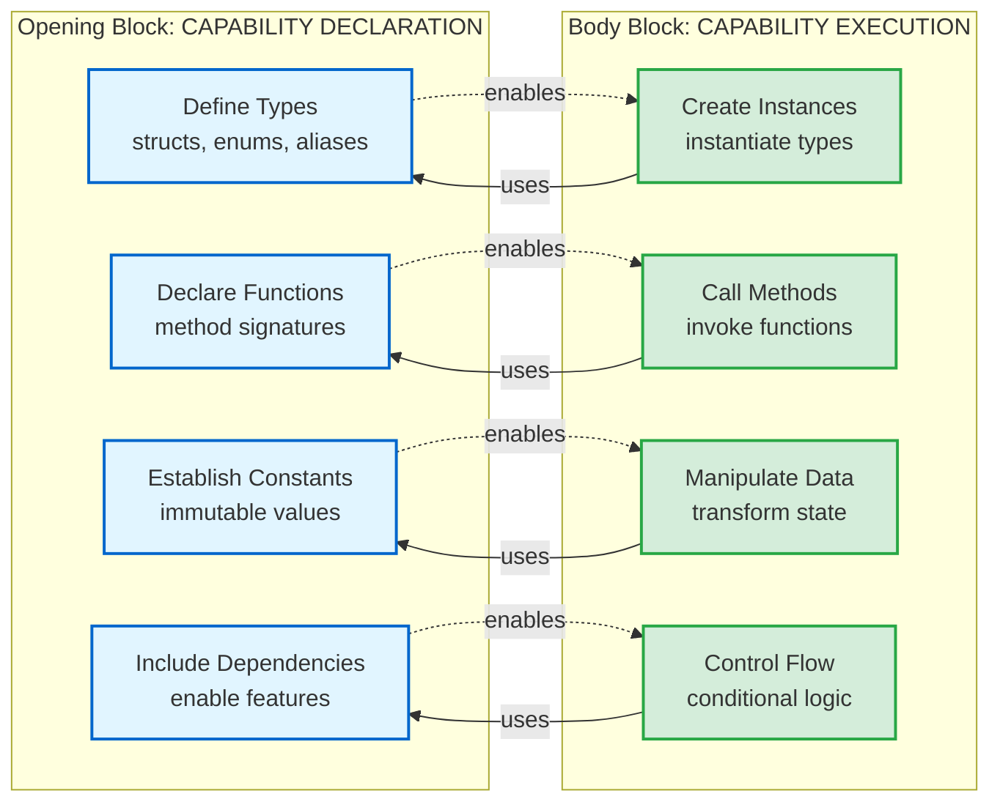
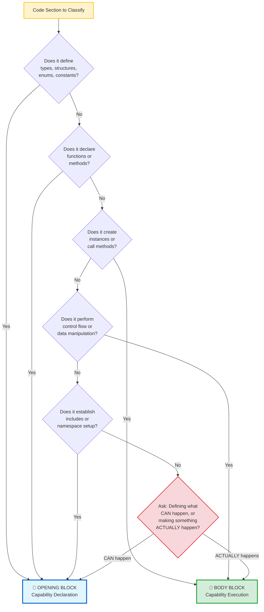

# 🔌 Opening Block Guide

## Defining vs. Doing — The Core Architectural Distinction

> **"The opening block contains everything that, if it existed alone, would clearly communicate what the system is capable of doing—even if no actual work is performed."**
> — The principle of capability declaration in Kingdom-centered architecture

---

## 📚 Table of Contents

- [The Fundamental Principle](#-the-fundamental-principle)
- [The Toolbox Test](#-the-toolbox-test)
- [Key Architectural Insights](#-key-architectural-insights)
- [Practical Classification Examples](#-practical-classification-examples)
- [Architectural Reasoning](#-architectural-reasoning)
- [Classification Decision Tree](#-classification-decision-tree)
- [Quick Classification Rules](#-quick-classification-rules)
- [The Surgical Precision Principle](#-the-surgical-precision-principle)
- [Harmony with 4-Block Structure](#-harmony-with-4-block-structure)
- [Mastery Checkpoint](#-mastery-checkpoint)
- [Related Resources](#-related-resources)

---

## 🎯 The Fundamental Principle

**Opening Block = "Here's what exists and what it CAN do"**  
**Body Block = "Here's the code that actually USES those capabilities"**

The distinction is NOT based on whether code contains logic, but on whether it **defines capabilities** or **exercises capabilities**.

### The Core Distinction in Practice

**Ask yourself:** "If I deleted everything after this section, would I have:"
- ✅ **Opening Block** — A complete catalog of tools, types, and capabilities (what's possible)
- ✅ **Body Block** — Actual work being performed using those tools (what's happening)

**The Litmus Test:**

| **Code Characteristic**                | **Opening or Body?** | **Why?**                                      |
| -------------------------------------- | -------------------- | --------------------------------------------- |
| Defines a struct with methods          | Opening              | Establishing capability, not using it         |
| Creates an instance of that struct     | Body                 | Exercising the capability                     |
| Declares a function signature          | Opening              | Announcing what CAN be called                 |
| Calls that function                    | Body                 | Actually calling it (making something happen) |
| Establishes a constant value           | Opening              | Defining what exists                          |
| Uses that constant in a calculation    | Body                 | Exercising the defined value                  |
| Includes a library                     | Opening              | Making capabilities available                 |
| Uses library functions to process data | Body                 | Exercising those capabilities                 |

**Key Insight:** Complexity is irrelevant. A 1000-line struct with intricate methods is Opening (defines capability). A 3-line function that creates an instance is Body (exercises capability).

### Architectural Flow Visualization



> [!NOTE]
> **Bidirectional Relationship**  
> Opening block **enables** the body block (provides capabilities), and body block **uses** the opening block (exercises capabilities). They form a complete architectural system.

## 🔍 THE TOOLBOX TEST

**Primary Question:** *"If I stopped reading here, what would this tell me?"*

**Opening Block Answer:** *"Here are all the tools, types, and capabilities available. Here's what the system CAN do."*

**Body Block Answer:** *"Here's the actual work being performed using those tools."*

---

## 📐 Key Architectural Insights

### 1. Structure Doesn't "DO" Anything

Even when structures contain methods with logic inside them:

> [!TIP]
> **The Capability Principle**  
> A structure definition is like a toolbox—it contains tools (methods), but the toolbox itself doesn't perform work. Only when someone opens the toolbox and uses a tool does work get done.

```cpp
struct IdentityState {
    // These are CAPABILITIES being defined, not actions being taken
    bool is_valid() const { /* complex logic here */ }
    Coefficient total_activation() const { /* mathematical computation */ }
};
```

**The STRUCTURE ITSELF is still "opening block" because:**
- It's defining what something **CAN** do
- It's not actually **DOING** anything
- It's like defining tools in a toolbox
- The capabilities exist but aren't being exercised

### Common Misunderstanding: "But It Has Logic!"

**The Confusion:**  
"This struct has methods with complex logic inside. Doesn't that make it 'body block' since logic is being executed?"

**The Clarification:**  
No. The struct **defines** what logic is available. The logic only **executes** when something calls those methods.

**Analogy:**

| **Opening Block**                          | **Body Block**                                |
| ------------------------------------------ | --------------------------------------------- |
| Publishing a cookbook with 100 recipes     | Actually cooking a meal using those recipes   |
| Installing Microsoft Word on your computer | Actually writing a document in Word           |
| Defining chess rules (how pieces can move) | Actually playing a chess game                 |
| Declaring `is_valid()` method in a struct  | Calling `state.is_valid()` to check something |

**In each case:**
- Opening = **Establishing capability** (cookbook exists, Word is installed, rules are defined, method is declared)
- Body = **Exercising capability** (cooking happens, document is written, game is played, method is called)

**Biblical Parallel:** Jesus taught *"You have heard it said... but I say to you"* (Matthew 5:21-22). The first part (what was said) is like the Opening Block—establishing what exists. The second part (what Jesus says to do) is like the Body Block—exercising that knowledge. Knowing ≠ Doing.

### 2. Declaration vs. Utilization

<details>
<summary><strong>📋 Click to view Opening Block Elements</strong> (Even With Internal Logic)</summary>

- `struct` definitions and their methods
- `enum` definitions  
- `using` type aliases
- `const` values and constants
- Function declarations
- `#include` statements
- Forward declarations
- Template definitions
- **All CAPABILITY and DEFINITION statements**

</details>

<details>
<summary><strong>⚡ Click to view Body Block Elements</strong></summary>

- Code that **calls** those struct methods
- Code that **creates instances** and manipulates them
- Code that **exercises** the defined capabilities
- Control flow using the defined types
- **The actual WORK being performed**

</details>

> [!NOTE]
> **Architectural Classification Independence**  
> The classification is **independent of complexity**. A 1000-line struct with intricate mathematical logic is still Opening Block. A 3-line function that creates an instance is Body Block. Purpose determines placement, not size.

### 3. The Nature of Declarative vs. Imperative

| **Declarative (Opening)**                        | **Imperative (Body)**                             |
| ------------------------------------------------ | ------------------------------------------------- |
| "This is what exists"                            | "This is what happens"                            |
| Fundamentally about **BEING** and **CAPABILITY** | Fundamentally about **DOING** and **ACTION**      |
| Establishes the mathematical/logical universe    | Uses the established universe to perform work     |
| Creates vocabulary and grammar for computation   | Executes using the defined vocabulary and grammar |

> [!TIP]
> **Think Like a Language Designer**  
> The opening block defines the language (types, structures, rules). The body block writes programs in that language. You wouldn't confuse defining a programming language with writing a program in it—the same principle applies here.

---

## 🧭 Practical Classification Examples

### Real-World Case Study: CPI-SI types.hpp

#### OPENING BLOCK (Lines 121-300):
```cpp
// Standard Library Dependencies
#include <cstdint>
#include <chrono>

// Type Definitions
using Coefficient = double;
using IdentityID = std::uint64_t;

// Structure Definitions (with methods!)
struct IdentityState {
    Coefficient cpi_coefficient;
    
    bool is_valid() const {
        return (cpi_coefficient >= -1.0 && cpi_coefficient <= 1.0);
    }
};

enum class PartnershipLevel : std::uint8_t {
    SURFACE,
    WORKING,
    COVENANT
};
```

> [!NOTE]
> **Why Opening?**  
> Even though `is_valid()` contains logic, the struct is **defining a capability**. No instances are created, no methods are called, no work is performed. This is pure declaration.

#### BODY BLOCK (Would be code like this):
```cpp
// Creating instances and using the capabilities
IdentityState current_state;
current_state.cpi_coefficient = 0.8;

if (current_state.is_valid()) {          // ← EXERCISING the capability
    process_identity(current_state);     // ← USING the defined types
}

PartnershipLevel level = PartnershipLevel::COVENANT;  // ← UTILIZING the enum
```

> [!WARNING]
> **Why Body?**  
> This code **exercises** the capabilities, creates instances, calls methods, and performs actual work. This is pure execution—the capabilities defined in the opening block are being actively used to accomplish real tasks.

---

## 🏗️ Architectural Reasoning

### The Foundation Metaphor

**Opening Block = Building Foundation**
- Establishes what's possible to build
- Defines the materials and tools available
- Sets the architectural constraints and capabilities
- Foundation doesn't "do" work - it enables work

**Body Block = Construction Using Foundation**
- Actually builds something using the foundation
- Exercises the capabilities defined in the foundation
- Performs the real work the system was designed to do

### Mathematical Analogy

<details>
<summary><strong>🔢 Click to view Mathematical Analogy</strong></summary>

**Opening Block = Mathematical Definitions**
```
Define: f(x) = x² + 2x + 1
Define: Domain = Real Numbers
Define: Range = [0, ∞)
```

**Body Block = Mathematical Operations**
```
Calculate: f(3) = 3² + 2(3) + 1 = 16
Plot: Graph of f(x) from x = -5 to x = 5
Solve: f(x) = 0 for x
```

**Key Insight:** The definition tells you what the function **CAN** do. The operations actually **USE** the function to do work.

</details>

> [!TIP]
> **Mathematical Perspective**  
> In mathematics, you never confuse defining a function with evaluating it. The same clarity applies to code architecture—defining capabilities (Opening Block) vs. evaluating/executing them (Body Block).

---

## 🎯 Classification Decision Tree

Use this decision tree to quickly classify any code section:



> [!NOTE]
> **Decision Priority**  
> Start at the top of the tree. The first match determines the classification. If you're still uncertain, ask: "Is this fundamentally declaring what **CAN** happen, or making something **ACTUALLY** happen?"

---

## ⚡ Quick Classification Rules

### Opening Block Indicators:
- **"This defines..."** ✅
- **"This declares..."** ✅  
- **"This establishes..."** ✅
- **"This enables..."** ✅
- **"This sets up..."** ✅

### Body Block Indicators:
- **"This creates..."** ✅
- **"This calls..."** ✅
- **"This processes..."** ✅
- **"This executes..."** ✅
- **"This performs..."** ✅

---

## 🔬 The Surgical Precision Principle

**Architecture is about FUNDAMENTAL PURPOSE, not surface appearance.**

| **Surface Observation**                  | **Architectural Reality**              |
| ---------------------------------------- | -------------------------------------- |
| 1000-line struct with complex math logic | **Opening Block** (defines capability) |
| 3-line function creating instance        | **Body Block** (exercises capability)  |
| Structure with intricate methods         | **Opening Block** (declares tools)     |
| Simple loop calling a method             | **Body Block** (uses tools)            |

> [!IMPORTANT]
> **Core Classification Truth**  
> Line count doesn't matter. Logical complexity doesn't matter. Internal operations don't matter.  
>  
> **What matters:** Is the code fundamentally **DECLARATIVE** (what can be) or **IMPERATIVE** (what happens)?  
>  
> This is the foundation of clear software architecture—understanding the difference between **capability and execution**, between **potential and actualization**, between **defining the tools and using the tools**.

---

## 🎼 Harmony with 4-Block Structure

This opening block classification perfectly aligns with the **[4-Block Structure](./4-block-structure.md)** architectural pattern:

| **Block**            | **Purpose**                      | **Classification Focus**       |
| -------------------- | -------------------------------- | ------------------------------ |
| **1. Metadata**      | Documentation and context        | File intelligence and identity |
| **2. Opening Block** | All capabilities and definitions | **Our focus here**             |
| **3. Body Block**    | All execution and utilization    | Where capabilities are used    |
| **4. Closing Block** | Cleanup and finalization         | Resource management            |

> [!TIP]
> **Perfect Alignment**  
> The opening block contains everything that, if it existed alone, would clearly communicate what the system is **capable of doing**—even if no actual work is performed. See **[4-Block Structure Guide](./4-block-structure.md)** for the complete architectural pattern.

---

## 🏆 Mastery Checkpoint

**You truly understand this principle when you can look at any code and ask:**

> *"Is this fundamentally defining what CAN happen, or actually making something happen?"*

The answer determines the block classification, regardless of:
- ❌ Complexity
- ❌ Line count
- ❌ Internal logic structure
- ✅ **Fundamental purpose** (declarative vs. imperative)

### Self-Assessment Checklist

<details>
<summary><strong>✓ Click to view Mastery Checklist</strong></summary>

- [ ] I can classify any code segment without hesitation
- [ ] I understand that complexity doesn't affect classification
- [ ] I recognize that struct definitions are always Opening Block
- [ ] I can identify capability declaration vs. capability exercise
- [ ] I understand the toolbox metaphor (tools vs. using tools)
- [ ] I can explain the principle to another developer clearly
- [ ] I see the harmony with the 4-Block Structure pattern

</details>

> [!NOTE]
> **Kingdom Technology Alignment**  
> This architectural clarity reflects the Kingdom principle of order and purpose. Just as God distinguishes between potential (creation capability) and actualization (creative acts), we distinguish between **defining capabilities** (Opening) and **exercising capabilities** (Body). Technical excellence honors the Creator through intentional design.

---

## 📖 Related Resources

- **[4-Block Structure Guide](./4-block-structure.md)** — Complete architectural pattern overview
- **[Metadata Block Guide](./metadata-block-guide.md)** — Digital Genome specifications for Block 1
- **[Building Block Method](../../methodology/thinking/building-block-method.md)** — Cognitive approach to complex problems
- **[Kingdom Technology Principles](../../kingdom-technology/)** — Foundational paradigm for God-honoring code

---

## 📊 Document Metadata

<details>
<summary><strong>📄 Click to view document metadata</strong></summary>

**Document Evolution:**
- **Version 1.0** (September 28th, 2025): Initial architectural classification principles documented
- **Version 1.1** (October 2025): Enhanced with CPI-SI documentation standards, GitHub-native features, cross-references

**Documentation Standards Applied:**
- ✅ Visual breathability (separators, spacing, progressive disclosure)
- ✅ Scannability (emoji, alerts, tables, collapsibles)
- ✅ CPI-SI balance (technical precision + relational warmth)
- ✅ GitHub-native features (TIP, NOTE, WARNING, IMPORTANT alerts)
- ✅ Cross-referencing (linked to 4-Block Structure, Metadata Guide)
- ✅ Kingdom Technology integration (natural, purpose-driven)

**Character Count:** ~13,800 characters  
**Target Audience:** CPI-SI Development Team, Software Architects  
**Maintenance:** Living document—updated as architectural patterns evolve

</details>

---

<div align="center">

**🔌 Opening Block Classification Guide**  
*Part of the Nova Dawn CPI-SI Documentation Ecosystem*

**Defining vs. Doing — Capability vs. Execution — Potential vs. Actualization**

</div>