# 📝 Documentation Creation Methodology

**Pioneer CPI-SI Documentation Practice | September 2025**

*How we actually create, enhance, and maintain documentation - captured from real work*

   

## What is Documentation Creation Methodology?

**Documentation Creation Methodology is the first reproducible documentation practice grounded in CPI-SI architecture** - a systematic approach that combines analytical precision (Structured Intelligence) with reader empathy (Covenant Partnership Intelligence) to produce documentation that is both technically excellent and genuinely accessible.

**The Core Innovation:** Instead of forcing an either/or choice between highly structured technical writing that feels cold or warm conversational writing that lacks rigor, this methodology establishes a balanced practice that integrates left-brain structure with right-brain warmth—producing documentation that serves readers effectively while maintaining technical rigor and Creator-honoring excellence.

> *"And whatever you do, do it heartily, as for the Lord, and not for men."* — Colossians 3:23 (WEB)[^1]
>
> **Methodology Foundation**: Documentation is not just information transfer - it's creating understanding with excellence that honors the Creator while serving the reader effectively.

**Three Key Questions This Methodology Answers**

1. **Can documentation creation be systematized without losing human warmth?**  
   Yes - through CPI-SI balance that maintains analytical structure while preserving relational awareness and reader empathy.

2. **Can technical writing honor God while remaining practically useful?**  
   Yes - through Kingdom Technology principles that apply biblical wisdom holistically (not forced spiritualization) to produce excellence that serves readers effectively.

3. **Can documentation practice be captured, taught, and reproduced consistently?**  
   Yes - through the 5-phase process (Foundation → Structure → Content → Enhancement → Verification) with measurable quality metrics and iterative refinement patterns.

**What makes these answers credible?** This methodology was extracted from Nova Dawn and Seanje's actual documentation practice—tested, refined, and validated through real implementation creating multiple documents including the Identity README that serves as the canonical reference. Every principle emerged from systematic observation of what actually produces excellent documentation, not theoretical ideals.

Here's the verification evidence:

> [!TIP]
> **Documentation Creation Methodology Implementation Verification:**
>
> - [x] ✅ CPI-SI balance principles established and operational
> - [x] ✅ 5-phase systematic process validated through practice
> - [x] ✅ Left-brain structure + right-brain warmth integration proven
> - [x] ✅ Iterative refinement patterns tested across multiple documents
> - [x] ✅ Quality metrics defined and measurable
> - [x] ✅ Biblical wisdom applied holistically (Kingdom Technology)
> - [x] ✅ Reproducibility demonstrated through teaching and application
> - [x] ✅ Excellence-that-honors-Creator paradigm maintained

**📍 Status**: Active Practice Captured | **🧠 Pattern**: CPI-SI Balanced Documentation | **👤 Pioneers**: Nova Dawn + Seanje

---

## 📚 Key Terms & Definitions

Understanding these core concepts will help you navigate the methodology's foundation and apply CPI-SI balance effectively:

<dl>
<dt><strong>CPI-SI Balance</strong></dt>
<dd>The integration of <strong>Covenant Partnership Intelligence (CPI)</strong> and <strong>Structured Intelligence (SI)</strong> - representing right-brain relational understanding combined with left-brain analytical precision. In documentation, this means technical accuracy with human warmth, systematic completeness with intuitive navigation.</dd>

<dt><strong>The Ladder Concept</strong></dt>
<dd>A linear structural approach that prevents circular dependencies by ensuring each section builds upon previous foundations without backward references. Like climbing a ladder, readers progress upward with each rung firmly established before the next.</dd>

<dt><strong>The Baton Concept</strong></dt>
<dd>Understanding passed continuously through documentation, like a relay baton. Each section receives context from the previous section, enriches it, and passes enhanced understanding forward. Ensures narrative coherence and cumulative learning.</dd>

<dt><strong>The Spiral Concept</strong></dt>
<dd>Iterative deepening where documentation revisits topics at progressively deeper levels while maintaining linear flow. Each pass through material adds sophistication without disrupting foundational structure. Think: spiral staircase ascending while circling.</dd>

<dt><strong>Iterative Refinement</strong></dt>
<dd>The practice of multiple focused improvement passes rather than attempting perfection in a single effort. Each iteration targets specific enhancement areas (e.g., structure, then content, then polish), resulting in progressive excellence.</dd>

<dt><strong>Kingdom Technology</strong></dt>
<dd>The application of biblical wisdom and Creator-honoring excellence to technical work. Not forced spiritualization, but holistic integration where technical precision and eternal perspective inform each other, producing work that serves practically while maintaining God-centered values.</dd>

<dt><strong>Foundation Discovery</strong></dt>
<dd>Phase 1 of documentation methodology - systematically identifying purpose, audience, requirements, and success criteria before writing. Answers "Why are we documenting this?" and "What must readers achieve?"</dd>

<dt><strong>Structure Design</strong></dt>
<dd>Phase 2 of documentation methodology - creating the organizational framework (ladder) that will hold content. Focuses on hierarchy, flow, and navigation architecture before detailed content creation.</dd>

<dt><strong>Progressive Disclosure</strong></dt>
<dd>Documentation pattern using collapsible sections ("details" elements) that allows readers to control depth and complexity. Essential information remains visible while advanced details can be revealed on demand, serving multiple expertise levels simultaneously.</dd>

</dl>

---

## 📚 Navigation - Choose Your Path

**Different paths for different purposes** - each route reveals specific aspects of how CPI-SI balanced documentation methodology combines left-brain systematic rigor with right-brain contextual understanding.

---

<details open>
<summary><strong>🎯 Quick Access - Jump to Specific Topics</strong></summary>

| **Your Interest** 🎯        | **Documentation Section** 📍                                                      | **What You'll Learn** ✨                                |
| -------------------------- | -------------------------------------------------------------------------------- | ------------------------------------------------------ |
| **🧠 Core Philosophy**      | [CPI-SI Balanced Documentation](#-core-philosophy-cpi-si-balanced-documentation) | Foundation principles and left-right brain integration |
| **📊 The Process**          | [5-Phase Documentation Process](#-the-documentation-creation-process)            | Visual diagram and phase-by-phase workflow             |
| **⚖️ Balance in Practice**  | [CPI-SI Methodology](#-cpi-si-balance-the-methodology-behind-the-methodology)    | How left-right brain balance actually works            |
| **✅ Quality Verification** | [Metrics & Excellence](#-quality-metrics-verifying-documentation-excellence)     | Measurable standards for documentation quality         |
| **🔄 Complete Workflow**    | [Start to Finish](#-complete-workflow-putting-it-all-together)                   | End-to-end process with practical checklists           |
| **🛠️ Tools & Techniques**   | [Documentation Toolbox](#-tools--techniques-the-documentation-toolbox)           | Practical tools reference and usage guidance           |
| **📖 Real Case Study**      | [Identity README Creation](#-case-study-the-identity-readme-creation)            | Actual methodology application example                 |
| **⭐ Kingdom Technology**   | [Biblical Wisdom Application](#-kingdom-technology-application)                  | Excellence that honors the Creator                     |

</details>

---

<details>
<summary><strong>🌊 Comprehensive Journey - Learn the Full Methodology</strong></summary>

#### **📚 Foundation & Philosophy**

- **[Core Philosophy](#-core-philosophy-cpi-si-balanced-documentation)** → *Understanding CPI-SI balanced documentation approach*
- **[CPI-SI Balance Methodology](#-cpi-si-balance-the-methodology-behind-the-methodology)** → *The methodology behind the methodology itself*

#### **⚙️ Process & Quality Standards**

- **[5-Phase Documentation Process](#-the-documentation-creation-process)** → *Complete process architecture with iterative workflow*
- **[Quality Metrics & Verification](#-quality-metrics-verifying-documentation-excellence)** → *Measurable standards for documentation excellence*

#### **🛠️ Practice & Application**

- **[Complete Workflow](#-complete-workflow-putting-it-all-together)** → *End-to-end process with practical implementation checklists*
- **[Tools & Techniques](#-tools--techniques-the-documentation-toolbox)** → *The documentation toolbox for practical execution*
- **[Identity README Case Study](#-case-study-the-identity-readme-creation)** → *Real-world methodology application example*

#### **🌟 Kingdom Technology & Adaptation**

- **[Kingdom Technology Application](#-kingdom-technology-application)** → *Biblical wisdom applied to documentation excellence*
- **[Flexibility & Context Guidance](#-flexibility-this-isnt-rigid)** → *Adapting the methodology to your specific needs*

**Estimated Reading Time:** 25-30 minutes for full methodology | 45-60 minutes with deep engagement

</details>

---

> [!NOTE]
> **Navigation Note:** Each section builds on CPI-SI balance principles - combining left-brain systematic rigor with right-brain contextual understanding to create documentation that serves readers effectively while honoring the Creator.

---

## 🎯 Core Philosophy: CPI-SI Balanced Documentation

> [!IMPORTANT]
> **Documentation is a whole-brain activity.**
>
> When you write documentation, you're engaging both hemispheres of your intelligence—not just one or the other, but both working together.

**Your left brain brings the structure:** It creates logical hierarchies, ensures technical accuracy, maintains systematic completeness, and organizes information into clear categories. Without this analytical precision, documentation becomes unreliable and confusing.

**Your right brain brings the connection:** It understands what the reader is feeling, crafts language that flows naturally, presents information creatively, and builds intuitive navigation that makes sense to human minds. Without this relational awareness, documentation becomes sterile and impenetrable.

> [!TIP]
> **When both work together,** you get documentation that is technically precise AND readable with warmth. You achieve accuracy AND accessibility. Your tone becomes professional AND approachable. Your structure is systematic AND intuitive.

**This is CPI-SI fusion in action:** The partnership between Structured Intelligence (analytical, logical, precise) and Covenant Partnership Intelligence (relational, empathetic, intuitive). Great documentation doesn't choose between these—it requires both.

| **Left Brain (SI)** 🧠                                                                                                                                                                   | **Right Brain (CPI)** 💡                                                                                                                                        | **Integration Result** ⚡                                                                                                                    |
| --------------------------------------------------------------------------------------------------------------------------------------------------------------------------------------- | -------------------------------------------------------------------------------------------------------------------------------------------------------------- | ------------------------------------------------------------------------------------------------------------------------------------------- |
| • Logical structure and organization<br/>• Precise technical accuracy<br/>• Systematic completeness<br/>• Mathematical rigor where appropriate<br/>• Clear categorization and hierarchy | • Reader empathy and understanding<br/>• Natural language flow<br/>• Creative presentation and formatting<br/>• Narrative coherence<br/>• Intuitive navigation | • Technical precision WITH readable warmth<br/>• Accurate AND accessible<br/>• Professional AND approachable<br/>• Systematic AND intuitive |

### Deep Dive: How CPI-SI Balance Actually Works

Documentation excellence emerges from integrating two complementary intelligence modes. **Structured Intelligence (SI)** provides the architectural framework—systematic organization, technical precision, logical consistency, and completeness verification that makes information navigable and verifiable. **Covenant Partnership Intelligence (CPI)** provides the human connection—reader empathy, natural language flow, intuitive navigation, and aesthetic presentation that makes technically precise structures actually serve human understanding.

> **Foundational Principle:** Excellence requires neither pure technical precision nor pure accessibility alone, but their intentional fusion—where structure enables clarity, and empathy directs what structure to create.

**Context-driven emphasis:** Different documentation contexts naturally emphasize different modes. Technical specifications lean toward SI dominance while maintaining CPI-guided readability; explanatory content leans toward CPI dominance while maintaining SI-verified accuracy; comprehensive methodology documents require sustained balance across both modes.


[↑ Back to Navigation](#-navigation---choose-your-path)

---

### 📐 Structural Intelligence Dominance: When Analysis Leads

Certain documentation activities inherently require analytical precision and systematic thinking to dominate the creative process. SI-dominant work establishes the logical architecture upon which reader-friendly presentation will later be built.

| **Documentation Activity** 📋 | **Primary SI Function** ⚙️                                             | **CPI Support Role** 🤝                                                        |
| ---------------------------- | --------------------------------------------------------------------- | ----------------------------------------------------------------------------- |
| **Outline Development**      | Hierarchical organization, dependency mapping, logical sequencing     | Ensures structure serves reader journey, not just logical completeness        |
| **Technical Specifications** | Precision verification, consistency checking, completeness validation | Maintains readability standards, prevents unnecessary complexity              |
| **Code Examples**            | Syntax accuracy, execution verification, edge case coverage           | Selects examples that illuminate concepts rather than just demonstrate syntax |
| **Mathematical Expressions** | Logical correctness, notational consistency, proof validation         | Contextualizes formulas within explanatory prose, provides intuition          |

**SI-dominant content characteristics:**

- Explicit structure with clear categorization schemas
- Systematic completeness across defined dimensions
- Technical accuracy verified against implementation realities
- Pattern recognition revealing underlying organizational principles

> **SI Strength:** Produces technically impeccable, logically consistent, systematically complete documentation frameworks.
>
> **SI Limitation:** Without CPI balance, can produce mechanically correct but cognitively inaccessible or emotionally uninviting documentation.

**When to engage SI dominance:** Structure creation phases, technical accuracy verification, systematic gap analysis, logical consistency validation.

---

### 🎨 Covenant Partnership Intelligence Dominance: When Empathy Leads

Other documentation activities require reader-centered thinking and relational awareness to dominate the creative process. CPI-dominant work transforms technically accurate information into naturally accessible understanding.

| **Documentation Activity** 📋 | **Primary CPI Function** 🤝                                              | **SI Support Role** ⚙️                                              |
| ---------------------------- | ----------------------------------------------------------------------- | ------------------------------------------------------------------ |
| **Explanatory Prose**        | Natural language flow, concept accessibility, teaching effectiveness    | Maintains technical accuracy, verifies completeness of explanation |
| **Introductory Material**    | Reader engagement, context establishment, motivation building           | Ensures claims are technically accurate, promises are fulfilled    |
| **Analogies & Metaphors**    | Conceptual bridge-building, intuitive understanding, memorable teaching | Validates that metaphors accurately represent technical realities  |
| **Purpose Statements**       | Meaning conveyance, value articulation, human connection                | Grounds purpose in measurable outcomes and verifiable objectives   |

**CPI-dominant content characteristics:**

- Flowing prose that teaches through natural narrative progression
- Reader empathy evidenced in anticipation of confusion points
- Aesthetic presentation creating visual invitation to engage
- Emotional tone appropriate to content seriousness and reader context

> **CPI Strength:** Produces accessible, engaging, humanly resonant documentation that readers want to read and can understand naturally.
>
> **CPI Limitation:** Without SI balance, can produce emotionally warm but technically imprecise or systematically incomplete documentation.

**When to engage CPI dominance:** Content creation phases, reader experience optimization, narrative development, aesthetic refinement.

---

### ⚖️ Integration Dynamics: Balanced Operation Across Documentation Phases

The documentation creation process moves through distinct phases, each requiring different emphases between SI and CPI modes while maintaining integration throughout:

<details>
<summary><strong>Foundation Phase</strong> — Architectural Planning & Outline Development</summary>

**Emphasis pattern:** SI-led with CPI guidance (structure dominates but serves reader needs)

The foundation phase establishes the logical architecture of the documentation. SI mode analyzes the subject domain, identifies necessary coverage areas, maps dependencies between concepts, and creates hierarchical organization. CPI mode operates in a guiding capacity, ensuring that the emerging structure will serve reader understanding rather than merely reflecting the creator's mental model.

**Integration checkpoint:** Does the outline reflect both logical completeness (SI) and natural learning progression (CPI)?

</details>

<details>
<summary><strong>Content Creation Phase</strong> — Writing, Explaining, Teaching</summary>

**Emphasis pattern:** Balanced operation (SI and CPI equally active throughout)

Content creation represents the phase requiring fullest CPI-SI integration. SI mode maintains technical accuracy, logical consistency, and systematic completeness while CPI mode simultaneously crafts natural language flow, reader engagement, and intuitive understanding. The writer moves fluidly between modes—verifying a technical claim (SI), then explaining it warmly (CPI), then structuring the explanation logically (SI), then ensuring the tone invites rather than intimidates (CPI).

**Integration checkpoint:** Is the content both technically accurate (SI) and naturally accessible (CPI)?

</details>

<details>
<summary><strong>Enhancement Phase</strong> — Refinement, Formatting, Polish</summary>

**Emphasis pattern:** SI-led with CPI aesthetic sense (systematic improvement with beauty)

Enhancement work applies systematic improvement patterns across the documentation. SI mode identifies inconsistencies, verifies completeness, standardizes formatting, and ensures technical accuracy. CPI mode applies aesthetic judgment—does this visual rhythm invite reading? Does this structure create natural flow? Is the formatting elegant rather than merely correct?

**Integration checkpoint:** Does the enhanced documentation exhibit both systematic correctness (SI) and aesthetic excellence (CPI)?

</details>

<details>
<summary><strong>Verification Phase</strong> — Checking, Validating, Testing</summary>

**Emphasis pattern:** SI-dominant with CPI-guided priorities (rigor determines what, empathy determines why)

Verification emphasizes analytical rigor—checking technical accuracy, validating completeness, testing examples, verifying consistency. SI mode dominates the execution while CPI mode determines verification priorities: What would confuse readers most if wrong? What omissions would frustrate practical application? Reader empathy guides what systematic checking must cover.

**Integration checkpoint:** Has verification ensured both technical correctness (SI) and practical usability (CPI)?

</details>

---

### 🔄 Recognizing Mode Transitions in Practice

Effective documentation work involves fluid transitions between SI and CPI dominance as different tasks require different cognitive approaches. Recognizing when to shift modes prevents the common failure pattern of applying the wrong mode to the current task.

| **You Notice...** 🔍                                                  | **Current Mode** 🧠 | **Consider Transition** 🔄                                                |
| -------------------------------------------------------------------- | ------------------ | ------------------------------------------------------------------------ |
| Content is accurate but feels mechanical                             | SI-dominant        | Increase CPI: Add warmth, improve flow, enhance engagement               |
| Content is engaging but technically fuzzy                            | CPI-dominant       | Increase SI: Verify accuracy, add precision, check completeness          |
| Outline is logically perfect but doesn't match reader learning needs | SI-dominant        | Increase CPI: Reorganize for reader journey, not just logical categories |
| Explanation is accessible but misses technical requirements          | CPI-dominant       | Increase SI: Verify completeness, add necessary technical depth          |
| Format is systematic but visually uninviting                         | SI-dominant        | Increase CPI: Enhance aesthetic appeal, improve visual rhythm            |
| Format is beautiful but structurally inconsistent                    | CPI-dominant       | Increase SI: Standardize formatting, verify systematic application       |

**The result of sustained CPI-SI balance:** Documentation that satisfies academic rigor while remaining practically accessible, technical precision while maintaining human warmth, systematic completeness while creating intuitive navigation—documentation that serves both research and learning contexts without compromising either.

[↑ Back to Navigation](#-navigation---choose-your-path)

---

## 🌟 Kingdom Technology Application

### How Biblical Principles Shape Documentation

> [!NOTE]
> What does it mean to write documentation with Kingdom perspective? Not forcing Scripture into every paragraph, but letting biblical wisdom shape how you approach the work itself.

**Five Principles That Make a Tangible Difference:**

| **Principle** 🎯           | **Biblical Foundation** 📖                                                                         | **Practical Impact** ✨                                                                                                                                                                                                                                                           |
| ------------------------- | ------------------------------------------------------------------------------------------------- | -------------------------------------------------------------------------------------------------------------------------------------------------------------------------------------------------------------------------------------------------------------------------------- |
| **Excellence as Worship** | Colossians 3:23: *"Whatever you do, work at it with all your heart, as working for the Lord."*    | Your documentation quality reflects your values. When you don't settle for "good enough," when you pursue genuine excellence, you create work that honors the Creator. This isn't perfectionism - it's wholehearted effort directed toward something beyond yourself.            |
| **Truth-Telling**         | Proverbs 12:22: *"The Lord detests lying lips."*                                                  | Technical accuracy becomes a moral requirement, not just a professional standard. You verify every claim. You correct every error. The result? Trustworthy documentation that readers can depend on. Integrity in documentation matters because truth matters.                   |
| **Service Orientation**   | Galatians 5:13: *"Serve one another in love."*                                                    | Your documentation exists to serve readers effectively. Reader success becomes the measure - not how much you documented, but how well it actually helped. This produces genuinely helpful content because you're thinking about their needs, not just your completion checkbox. |
| **Wisdom Application**    | Proverbs 3:5-6: *"Trust in the Lord with all your heart and lean not on your own understanding."* | You seek God's perspective in documentation decisions. Should you prioritize depth or accessibility? Technical precision or relational warmth? Wisdom helps you balance technical and relational needs appropriately, producing holistic, wise documentation.                    |
| **Stewardship**           | 1 Peter 4:10: *"Each should use whatever gift received to serve others."*                         | Your documentation capabilities are gifts to steward well. This means creating maintainable, sustainable docs - not just solving today's problem but building something that delivers long-term value. You're managing resources entrusted to you.                               |

### Not Over-Spiritualizing

Important clarification: Kingdom Technology doesn't mean making every sentence a sermon. It's not about forcing Bible verses into technical content or ignoring practical excellence for "spiritual" focus. Using religion as an excuse for poor quality completely misses the point.

Instead, Kingdom Technology means applying biblical wisdom holistically to your work. You maintain God-awareness in decision-making without becoming preachy. Your excellence standard is rooted in Creator-honoring values, but expressed through practical service with eternal perspective.

The result? Documentation is actually **better** because of Kingdom principles, not despite them. The spiritual foundation enables practical excellence rather than hindering it. Quality work itself testifies to your values - you don't need to announce them constantly. You achieve both technical excellence AND biblical grounding working together.

[↑ Back to Navigation](#-navigation---choose-your-path)

---

## 📊 Documentation Quality & Readability Standards

### Measuring Excellence Through Dual Metrics

**Documentation excellence requires two complementary measurement systems:**

1. **Quality Dimensions** - Outcome measures that verify documentation achieves its purpose (Technical accuracy, completeness, accessibility)
2. **Readability Criteria** - Process measures that ensure humans can actually use what we create (Visual breathability, cognitive load, scannability)

Both systems work together: Quality without readability creates unusable perfection. Readability without quality creates accessible mediocrity. Excellence demands both.

> [!NOTE]
> **Why Two Systems?** Quality Metrics tell us "Is it excellent?" while Readability Standards answer "Can people actually use it?" Different questions requiring different measurements - both essential for documentation that truly serves.

### Part 1: Quality Dimensions - Outcome Measures

### Quality Scorecard - Six Dimensions

| **Dimension**               | **Measurement Method**                     | **Pass Threshold**    | **Verification**                                      |
| --------------------------- | ------------------------------------------ | --------------------- | ----------------------------------------------------- |
| **Technical Accuracy** ✓    | Test every example<br>Validate every claim | 100% accurate         | Run examples<br>Check assertions                      |
| **Completeness** ✓          | Compare against scope<br>Identify gaps     | Zero significant gaps | Requirements checklist<br>Coverage mapping            |
| **Accessibility** ✓         | Reader simulation<br>Actual user feedback  | Genuinely helpful     | Test with real users<br>Track confusion points        |
| **Maintainability** ✓       | Structure analysis<br>Dependency check     | Future-proof          | Update simulation<br>Circular reference scan          |
| **Theological Soundness** ✓ | Scripture verification<br>Context checking | Accurate & respectful | Cross-reference verses<br>Honor God's Word            |
| **CPI-SI Balance** ✓        | Content type analysis<br>Tone evaluation   | 40-60% split          | Count analytical vs. relational<br>Warmth + Precision |

**Why These Six?** Each dimension reflects a different aspect of excellence - from foundational accuracy to balanced execution. Together they create documentation that is technically sound, genuinely helpful, and Kingdom-honoring.

<details>
<summary><strong>Dimension Definitions & Kingdom Context</strong></summary>

**Technical Accuracy** - Truth honors God. Getting facts right isn't pride; it's integrity in action. Every claim must be verifiable.

**Completeness** - Excellence means thoroughness. Doing the whole job, not just the interesting parts. Stewardship of the documentation mandate.

**Accessibility** - Service to others. Documentation exists for readers' benefit, not writer's satisfaction. Can they actually USE it?

**Maintainability** - Building for longevity. Graceful adaptation when things change. Stewardship of resources over time.

**Theological Soundness** - Reverent treatment of God's Word. Scripture used appropriately, accurately, and respectfully. Direct honor.

**CPI-SI Balance** - Wholeness reflects the Creator's design. God is perfectly just AND infinitely loving. Our documentation mirrors that integration.

</details>

---

### Part 2: Readability Criteria - Process Measures

**From quality dimensions to human usability:** The six quality dimensions above verify excellence, but excellent content means nothing if readers experience cognitive overload. Readability criteria ensure documentation actually works for human minds.

Six specific, measurable criteria determine whether documentation truly serves human readers. Each has a precise threshold and measurement method.

> [!WARNING]
> **The Critical Reality:**
>
> Documentation that causes "head spinning" (cognitive overload) prevents operational execution. Even if the methodology is theoretically perfect, if humans cannot READ it, they cannot APPLY it. **Human readability is an operational requirement, not an aesthetic preference.**

### Readability Metrics Sheet

| **Criterion**                  | **Threshold**        | **Measurement Method**          | **Pass/Fail Test**                        |
| ------------------------------ | -------------------- | ------------------------------- | ----------------------------------------- |
| **Visual Breathability** 🌬️     | ≥ 15% white space    | Count blank lines ÷ total lines | Below 15% = FAIL<br>Add section breaks    |
| **Progressive Complexity** 📈   | ≤ 3 concepts/section | Count new terms per H2          | Above 3 = FAIL<br>Split section           |
| **Prose-to-Structure Ratio** 📝 | ≥ 40% prose          | Count prose lines ÷ total lines | Below 40% = FAIL<br>Add narrative flow    |
| **Scannability Index** 🔍       | < 30 sec/topic       | Time 5 random topics            | Above 30s avg = FAIL<br>Improve hierarchy |
| **Cognitive Load** 🧠           | 100% one-purpose     | One-sentence summary test       | Multi-sentence = FAIL<br>Refocus section  |
| **CPI-SI Balance** ⚖️           | 40-60% split         | Count analytical vs. relational | Outside range = FAIL<br>Rebalance content |

**Reference Standard:** Identity README.md demonstrates all six criteria in practice - serving as the measurable benchmark until a better example emerges.

---

### Measurement Details & Application

<details>
<summary><strong>1. Visual Breathability - Preventing Cognitive Suffocation</strong></summary>

**What you're measuring:** White space percentage in document

**Calculation:**

```
blank_lines / total_lines × 100 = breathability_percentage
Target: ≥ 15%
```

**Why it matters:** Your brain needs "rest points" while scanning. Without breathing room, every line demands analytical processing → exhaustion.

**How to fix if failing:**

- Add blank lines between sections
- Separate paragraph chunks
- Use horizontal rules (`---`) strategically
- Space out dense structured content

**README Example:** ~20% white space through intentional section separation

</details>

<details>
<summary><strong>2. Progressive Complexity - Controlling Concept Introduction</strong></summary>

**What you're measuring:** New concepts introduced per major section

**Calculation:**

```
Count distinct new terms/concepts in each H2 section
Target: ≤ 3 per section
```

**Why it matters:** Too much too fast → cognitive overload. Brain needs time to absorb each concept before adding more.

**How to fix if failing:**

- Split section into multiple sections
- Move advanced concepts to later sections
- Use progressive deepening (introduce basics first, details later)
- Employ collapsible sections for optional depth

**README Example:** "What is Nova Dawn?" introduces 2 concepts (CPI-SI, Nova Dawn) - later sections build rather than flood

</details>

<details>
<summary><strong>3. Prose-to-Structure Ratio - Balancing Flow vs. Analysis</strong></summary>

**What you're measuring:** Percentage of flowing prose vs. structured content

**Calculation:**

```
prose_lines / (prose_lines + structure_lines) × 100
Target: ≥ 40% for explanatory docs
```

**Why it matters:** Pure structured content (YAML, tables, code) = constant analytical parsing. Flowing prose = natural reading that engages both hemispheres.

**Content Types:**

- **Prose:** Paragraphs, explanations, narratives
- **Structure:** YAML blocks, tables, code examples, lists

**How to fix if failing:**

- Add explanatory paragraphs around structured content
- Transform bullet lists into flowing prose where appropriate
- Provide context and reasoning narratives

**README Example:** ~50% prose, ~30% structure, ~20% white space - prose dominates, structure accents

</details>

<details>
<summary><strong>4. Scannability Index - Navigation Speed Test</strong></summary>

**What you're measuring:** Time to locate specific topics

**Measurement Protocol:**

```
1. Select 5 random topics from document
2. Time how long to find each using TOC + scanning
3. Calculate average time
Target: < 30 seconds average
```

**Why it matters:** Readers scan for specific information. If finding topics takes minutes, structure fails navigation purpose.

**Enabling Features:**

- Clear heading hierarchy (H1 → H2 → H3)
- Visual markers (emojis, bold text)
- Comparison tables for complex info
- Effective anchor links

**README Example:** Locate "Genesis 1:1 Foundation" or "CPI-SI Architecture" in ~10 seconds

</details>

<details>
<summary><strong>5. Cognitive Load Per Section - The One-Purpose Test</strong></summary>

**What you're measuring:** Section focus clarity

**Test Protocol:**

```
For each major section:
1. Read the section
2. Write one-sentence purpose summary
3. If impossible or requires multiple sentences → FAIL
```

**Why it matters:** Multi-purpose sections → confusion about "why am I reading this?" Each section should answer ONE question.

**How to fix if failing:**

- Split section into focused sub-sections
- Move unrelated content elsewhere
- Clarify section purpose in opening

**README Example:** "What is Nova Dawn?" = "Defines Nova Dawn as first CPI-SI implementation" - clean, singular

</details>

<details>
<summary><strong>6. CPI-SI Balance - Self-Application Verification</strong></summary>

**What you're measuring:** Analytical vs. relational content split

**Calculation:**

```
Analytical indicators:
- YAML blocks, technical tables, code examples, systematic lists

Relational indicators:
- Flowing prose, conversational tone, questions to reader, stories

analytical_lines / total_content_lines × 100
Target: 40-60% split (balanced)
```

**Why it matters:** If you teach CPI-SI balance but practice 80/20 imbalance, you violate your own principle. Document must exemplify what it teaches.

**How to fix if failing:**

- Too analytical (>60%)? Add narrative flow, questions, warmth
- Too relational (>60%)? Add structure, precision, measurable elements

**README Example:** ~45% analytical, ~55% relational - balanced excellence in practice

</details>

---

### The Seven Essential Qualities

Every excellent documentation demonstrates these seven qualities. They distill the measurable criteria into actionable principles:

| **Quality**      | **Indicator**                        | **How to Verify**                   |
| ---------------- | ------------------------------------ | ----------------------------------- |
| **1. Breathe** 🌬️ | Visual white space present           | ≥15% blank lines calculated         |
| **2. Build** 📈   | Progressive complexity shown         | ≤3 concepts per section counted     |
| **3. Balance** ⚖️ | CPI warmth + SI precision            | 40-60% split measured               |
| **4. Scan** 🔍    | Information findable quickly         | <30 sec topic location timed        |
| **5. Focus** 🎯   | One purpose per section              | One-sentence summary test passed    |
| **6. Flow** 📝    | Prose-dominant with structure accent | ≥40% prose ratio calculated         |
| **7. Enable** ⚡  | Supports operational execution       | Applied successfully, not just read |

> [!IMPORTANT]
> **The Ultimate Validation Test:**
>
> *"Can Seanje read this without head spinning and actually apply what it teaches?"*
>
> If no → Documentation has failed its operational purpose, regardless of technical completeness.

---

### README.md as Reference Standard

**The Identity README.md serves as our reference implementation** until a better example emerges. It measurably demonstrates:

| **Principle**           | **README.md Measurement**                         |
| ----------------------- | ------------------------------------------------- |
| Visual Breathability    | ~20% white space (exceeds 15% threshold)          |
| Progressive Complexity  | 2 concepts in opening section (under 3 threshold) |
| Prose-Structure Balance | ~50% prose, ~30% structure, ~20% white space      |
| Scannability            | ~10 second topic location (well under 30 sec)     |
| Section Focus           | All sections pass one-sentence test               |
| CPI-SI Balance          | ~45% analytical, ~55% relational (balanced)       |
| Operational Enablement  | Successfully enables Nova Dawn execution          |

Any documentation teaching these principles must match or exceed README.md's standard. This isn't arbitrary - it's the proven benchmark enabling operational execution.

<details>
<summary><strong>Readability Verification Sheet - Measurement Template</strong></summary>

Use this metric verification sheet to measure documentation quality. Fill in actual measurements and compare against thresholds.

### Documentation Being Validated: `_____________________`

---

#### Metric 1: Visual Breathability

| **Measurement** | **Your Result** | **Threshold** | **Status**    |
| --------------- | --------------- | ------------- | ------------- |
| Total lines     | _________       | N/A           | N/A           |
| Blank lines     | _________       | N/A           | N/A           |
| Percentage      | _________%      | ≥ 15%         | ☐ PASS ☐ FAIL |

**Verification:**

- [ ] Sections separated by clear breaks
- [ ] Not every line packed with content
- [ ] Breathing room visible when scanning

---

#### Metric 2: Progressive Complexity

| **Section**              | **New Concepts Count** | **Status**              |
| ------------------------ | ---------------------- | ----------------------- |
| Section 1: _____________ | _________              | ☐ PASS (≤3) ☐ FAIL (>3) |
| Section 2: _____________ | _________              | ☐ PASS (≤3) ☐ FAIL (>3) |
| Section 3: _____________ | _________              | ☐ PASS (≤3) ☐ FAIL (>3) |
| Section 4: _____________ | _________              | ☐ PASS (≤3) ☐ FAIL (>3) |

**Verification:**

- [ ] Concepts introduced before detailed use
- [ ] Advanced content in collapsible sections where appropriate
- [ ] No section overwhelming with new terminology

---

#### Metric 3: Prose-Structure Balance

| **Content Type**                      | **Line Count** | **Percentage** |
| ------------------------------------- | -------------- | -------------- |
| Prose paragraphs                      | _________      | _________%     |
| Structured content (YAML/tables/code) | _________      | _________%     |
| White space                           | _________      | _________%     |

| **Threshold Check**               | **Status**    |
| --------------------------------- | ------------- |
| Prose ≥ 40% for explanatory docs? | ☐ PASS ☐ FAIL |

**Verification:**

- [ ] Flowing prose dominates
- [ ] YAML/code used appropriately (not excessively)
- [ ] Tables used for comparative information only

---

#### Metric 4: Scannability Index

| **Test Topic**         | **Time to Locate** | **Status**                |
| ---------------------- | ------------------ | ------------------------- |
| Topic 1: _____________ | _________ sec      | ☐ PASS (<30) ☐ FAIL (≥30) |
| Topic 2: _____________ | _________ sec      | ☐ PASS (<30) ☐ FAIL (≥30) |
| Topic 3: _____________ | _________ sec      | ☐ PASS (<30) ☐ FAIL (≥30) |
| Topic 4: _____________ | _________ sec      | ☐ PASS (<30) ☐ FAIL (≥30) |
| Topic 5: _____________ | _________ sec      | ☐ PASS (<30) ☐ FAIL (≥30) |
| **Average Time:**      | _________ sec      | ☐ PASS (<30) ☐ FAIL (≥30) |

**Verification:**

- [ ] Clear heading hierarchy (H1→H2→H3)
- [ ] Visual markers present (emojis, bold)
- [ ] Key terms highlighted appropriately

---

#### Metric 5: Cognitive Load Per Section

| **Section**          | **One-Sentence Summary**           | **Status**    |
| -------------------- | ---------------------------------- | ------------- |
| Section 1: _________ | __________________________________ | ☐ PASS ☐ FAIL |
| Section 2: _________ | __________________________________ | ☐ PASS ☐ FAIL |
| Section 3: _________ | __________________________________ | ☐ PASS ☐ FAIL |
| Section 4: _________ | __________________________________ | ☐ PASS ☐ FAIL |

**Pass Criteria:** Each section purpose expressible in ONE sentence. If multiple sentences required → FAIL

**Verification:**

- [ ] Each section has ONE clear purpose
- [ ] No section covering multiple unrelated concepts

---

#### Metric 6: CPI-SI Balance

| **Content Type**                       | **Line Count** | **Percentage** |
| -------------------------------------- | -------------- | -------------- |
| Analytical (YAML, tables, code, lists) | _________      | _________%     |
| Relational (prose, questions, stories) | _________      | _________%     |

| **Balance Check**      | **Status**    |
| ---------------------- | ------------- |
| 40-60% split achieved? | ☐ PASS ☐ FAIL |

**Verification:**

- [ ] Both analytical AND relational content present
- [ ] Not pure technical specification (>60% analytical)
- [ ] Not pure narrative without structure (>60% relational)

---

### ULTIMATE OPERATIONAL TEST

| **Critical Question**                             | **Result** |
| ------------------------------------------------- | ---------- |
| Can Seanje read this without "head spinning"?     | ☐ YES ☐ NO |
| Can methodology be APPLIED from this doc?         | ☐ YES ☐ NO |
| Does it enable EXECUTION, not just understanding? | ☐ YES ☐ NO |

**If any answer is NO → Documentation FAILS operational requirement regardless of other metrics**

---

### Overall Quality Score

| **Metric**              | **Status**    |
| ----------------------- | ------------- |
| Visual Breathability    | ☐ PASS ☐ FAIL |
| Progressive Complexity  | ☐ PASS ☐ FAIL |
| Prose-Structure Balance | ☐ PASS ☐ FAIL |
| Scannability Index      | ☐ PASS ☐ FAIL |
| Cognitive Load          | ☐ PASS ☐ FAIL |
| CPI-SI Balance          | ☐ PASS ☐ FAIL |
| Operational Test        | ☐ PASS ☐ FAIL |

**Total Passed:** _____ / 7

**Documentation Status:**

- 7/7 = Excellence
- 5-6/7 = Good (identify improvement areas)
- 3-4/7 = Needs Revision
- 0-2/7 = Requires Complete Redesign

</details>

---

## 📋 The Documentation Creation Process

> [!NOTE]
> **What This Section Demonstrates:**
>
> This section doesn't just *explain* documentation process—it *shows* systematic workflow thinking through structured format. Every table, checklist, and template demonstrates the principles being taught. The section itself is an example of process architecture.

### 🏗️ Process Architecture - 5-Phase Overview

**Complete Workflow Specification:**

| **Phase** 🎯                     | **Input** 📥                             | **Core Process** ⚙️                                               | **Output** 📤                                             | **Time** ⏱️ | **CPI-SI Balance** ⚖️                                |
| ------------------------------- | --------------------------------------- | ---------------------------------------------------------------- | -------------------------------------------------------- | ---------- | --------------------------------------------------- |
| **1. Foundation Discovery**     | Project requirements, stakeholder needs | Ask fundamental questions, establish success criteria            | Purpose statement, audience profile, preliminary outline | ~10%       | 60/40 (CPI-heavy: relationship with audience)       |
| **2. Structural Architecture**  | Foundation output                       | Design ladder structure, map dependencies, create navigation     | Complete structural framework, heading hierarchy         | ~20%       | 30/70 (SI-heavy: logical organization)              |
| **3. Content Development**      | Structural framework                    | Write prose, create examples, build tables, track baton handoffs | Complete draft content across all sections               | ~40%       | 50/50 (Balanced: precision + warmth)                |
| **4. Enhancement & Refinement** | Draft content                           | Optimize markdown, refine structure, improve accessibility       | Publication-ready enhanced documentation                 | ~20%       | 40/60 (SI-leaning: pattern optimization)            |
| **5. Verification & QA**        | Enhanced documentation                  | Verify accuracy, check completeness, assess quality              | Verified, quality-assured final documentation            | ~10%       | 50/50 (Balanced: systematic check + reader empathy) |

```mermaid
graph TD
    A[Phase 1: Foundation Discovery] -->|Purpose & Audience Defined| B[Phase 2: Structural Architecture]
    B -->|Framework Complete| C[Phase 3: Content Development]
    C -->|Draft Content Ready| D[Phase 4: Enhancement & Refinement]
    D -->|Enhanced Documentation| E[Phase 5: Verification & QA]
    E -->|✅ Quality Pass| F[📚 Published Documentation]
    E -->|❌ Issues Found| C
    
    style A fill:#e1f5ff,stroke:#0066cc,stroke-width:2px
    style B fill:#fff4e1,stroke:#cc8800,stroke-width:2px
    style C fill:#ffe1f5,stroke:#cc0088,stroke-width:2px
    style D fill:#e1ffe1,stroke:#00cc66,stroke-width:2px
    style E fill:#f5e1ff,stroke:#8800cc,stroke-width:2px
    style F fill:#d4edda,stroke:#28a745,stroke-width:3px
```



**Process Flow Characteristics:**

- ✅ Linear progression with iterative feedback loop (Phase 5 → Phase 3)
- ⚖️ CPI-SI balance shifts based on phase needs
- 🛡️ Quality gate at Phase 5 prevents premature publication
- 🔄 Continuous refinement until excellence threshold met

[↑ Back to Navigation](#-navigation---choose-your-path)

### Phase 1: Foundation Discovery

**Phase Specification:**

| **Element**               | **Details**                                                                                         |
| ------------------------- | --------------------------------------------------------------------------------------------------- |
| **Goal** 🎯                | Establish clear documentation purpose, audience, and success criteria before writing                |
| **Duration** ⏱️            | ~10% of total project time                                                                          |
| **Input** 📥               | Project requirements, stakeholder needs, domain context                                             |
| **Output** 📤              | Foundation document with purpose statement, audience profile, success criteria, preliminary outline |
| **CPI-SI Balance** ⚖️      | 60/40 CPI-heavy (understanding people and their needs)                                              |
| **Completion Criteria** ✅ | Can answer all 5 foundation questions with clarity and confidence                                   |

---

#### Foundation Discovery Template (Fillable)

**Copy this template and complete each section before proceeding to Phase 2:**

```markdown
## Foundation Discovery - [Project Name]

### 1. PURPOSE DEFINITION
**What understanding am I creating?**
- Primary purpose: [Be specific - not just "to document"]
- Capability enabled: [What can readers DO after reading?]
- Confusion prevented: [What misunderstanding does this address?]

### 2. AUDIENCE PROFILE
**Who is this for?**
- Primary audience: [Role/experience level]
- Secondary audience: [Other stakeholders]
- Knowledge baseline: [What do they already know?]
- Language needs: [Technical depth appropriate for them]

### 3. PROBLEM STATEMENT
**What need does this solve?**
- Pain point addressed: [Specific struggle or gap]
- Current state (without this doc): [What's the difficulty?]
- Future state (with this doc): [How does this help?]

### 4. CONTEXT REQUIREMENTS
**What must readers already understand?**
- Prerequisites: [Required knowledge before starting]
- Assumed foundations: [What won't be explained here]
- Related documentation: [Other docs they should know about]

### 5. SUCCESS CRITERIA
**How will I know this documentation succeeds?**
- Readers should be able to: [Concrete capabilities]
- Readers should understand: [Key concepts mastered]
- Readers should feel: [Confidence level/clarity achieved]

### 6. CPI-SI BALANCE PLAN
**Left Brain (SI) Focus:**
- Topics requiring technical precision: [List]
- Logical hierarchy needs: [Structure requirements]
- Completeness checklist: [What makes it "done"]

**Right Brain (CPI) Focus:**
- Reader journey pain points: [Where confusion likely]
- Emotional tone needed: [Professional/warm/precise balance]
- Story arc: [How understanding builds progressively]

### 7. PRELIMINARY OUTLINE
**Draft structure (will be refined in Phase 2):**
1. [Section name - purpose]
2. [Section name - purpose]
3. [Section name - purpose]
...
```

---

#### Foundation Questions Checklist

Before moving to Phase 2, verify you can answer these clearly:

- [ ] **Purpose**: Can I state in one sentence what understanding this creates?
- [ ] **Audience**: Do I know exactly who I'm writing for and their knowledge level?
- [ ] **Problem**: Can I articulate the specific pain point this addresses?
- [ ] **Context**: Have I identified what readers must already know?
- [ ] **Outcomes**: Can I list 3-5 concrete things readers will be able to do?
- [ ] **Scope**: Do I know what's IN and OUT of scope for this document?

<details>
<summary><strong>✨ Real Example: Identity README Foundation Discovery</strong></summary>

**Foundation Discovery Application:**

| **Foundation Element** | **Answer**                                                                                                                 |
| ---------------------- | -------------------------------------------------------------------------------------------------------------------------- |
| **Purpose**            | Establish Nova Dawn's biblical foundation and CPI-SI identity                                                              |
| **Audience**           | Future developers, partnership collaborators, Nova Dawn herself                                                            |
| **Problem**            | Prevent platform defaults from overriding authentic identity                                                               |
| **Context**            | Kingdom Technology paradigm, covenant partnership model                                                                    |
| **Outcome**            | Readers understand Nova Dawn's foundation is biblically grounded and technically excellent                                 |
| **Scope Decision**     | IN: Biblical foundation, CPI-SI architecture, identity principles<br>OUT: Detailed implementation code, API specifications |

**Key Insight**: Understanding the "why" and "who for" before writing prevented scope creep and maintained focus throughout the documentation process.

</details>

[↑ Back to Navigation](#-navigation---choose-your-path)

### Phase 2: Structural Architecture

**Phase Specification:**

| **Element**               | **Details**                                                                           |
| ------------------------- | ------------------------------------------------------------------------------------- |
| **Goal** 🎯                | Design ladder-based architecture that enables progressive understanding               |
| **Duration** ⏱️            | ~20% of total project time                                                            |
| **Input** 📥               | Foundation document from Phase 1                                                      |
| **Output** 📤              | Complete structural outline with heading hierarchy, navigation system, dependency map |
| **CPI-SI Balance** ⚖️      | 30/70 SI-heavy (logical organization and systematic structure)                        |
| **Completion Criteria** ✅ | Can trace clear linear progression with no circular dependencies                      |

---

#### Structural Architecture Specification Template

**4 Required Structural Decisions:**

**1. HEADING HIERARCHY SPECIFICATION**

| **Level** | **Purpose**                        | **Naming Pattern**      | **Example**                               |
| --------- | ---------------------------------- | ----------------------- | ----------------------------------------- |
| **H1**    | Document title only                | `# [Document Name]`     | `# Documentation Creation Methodology`    |
| **H2**    | Major sections                     | `## 🎯 [Section Name]`   | `## 📋 The Documentation Creation Process` |
| **H3**    | Subsections within major sections  | `### [Subsection Name]` | `### Phase 1: Foundation Discovery`       |
| **H4**    | Detailed topics within subsections | `#### [Topic Name]`     | `#### Foundation Discovery Template`      |
| **H5/H6** | Use sparingly for deep hierarchy   | `##### [Detail Name]`   | Avoid if possible                         |

**Hierarchy Verification:**

- [ ] No heading level skipped (H2 → H3 → H4, not H2 → H4)
- [ ] Each level builds on previous level
- [ ] Heading text is clear and descriptive
- [ ] Logical grouping maintained

---

**2. NAVIGATION SYSTEM DESIGN**

| **Navigation Type**     | **Purpose**                      | **Implementation**              | **Required?**          |
| ----------------------- | -------------------------------- | ------------------------------- | ---------------------- |
| **Table of Contents**   | Document-level overview          | Anchor links to major sections  | ✅ Yes (all major docs) |
| **Section Quick Links** | Local navigation within sections | `[↑ Back to Navigation]` links  | ✅ Yes                  |
| **Breadcrumb Context**  | Show location in hierarchy       | Heading structure provides this | Automatic              |
| **Cross-references**    | Connect related concepts         | `[Link text](path#anchor)`      | As needed              |

**Navigation Checklist:**

- [ ] Table of contents links all H2 sections
- [ ] "Back to navigation" appears at end of major sections
- [ ] All internal links use anchor format correctly
- [ ] Navigation enables both linear AND random access

---

**3. DEPENDENCY FLOW MAPPING (The Baton)**

**For each section, complete this specification:**

```markdown
## Section: [Name]

**Receives (Input Understanding):**
- Concept A (from Section X)
- Concept B (from Section Y)
- Foundation Z (assumed prerequisite)

**Processes (What This Section Does):**
- Explains: [New concept introduced]
- Demonstrates: [Example/application shown]
- Connects: [Relationship to previous concepts]

**Passes Forward (Output Understanding):**
- Concept C (to Section P)
- Capability D (enables Section Q)
- Foundation E (required for Section R)

**Verification:**
- [ ] Nothing referenced that hasn't been explained yet
- [ ] Clear handoff to next section
- [ ] No circular dependencies created
```

---

**4. ORGANIZATION PATTERN SELECTION**

| **Pattern** 🎯                | **When to Use** 📍                       | **Structure** 🏗️                              | **Example** ✨                                    |
| ---------------------------- | --------------------------------------- | -------------------------------------------- | ------------------------------------------------ |
| **Sequential Process**       | Workflow, step-by-step procedures       | 1 → 2 → 3 → 4                                | This methodology (Phase 1-5)                     |
| **Foundational Layering**    | Concept building, technical explanation | Foundation → Detail → Application            | Identity README (Foundation → Operations → Meta) |
| **Problem-Solution**         | Troubleshooting, case studies           | Problem → Analysis → Solution → Verification | Biblical Footnoting Pattern case study           |
| **Reference Categorization** | API docs, comprehensive reference       | Alphabetical or categorical grouping         | Tool reference sections                          |

**Organization Checklist:**

- [ ] Pattern chosen matches content type
- [ ] Related concepts grouped together
- [ ] Distinct concerns separated clearly
- [ ] Depth vs. breadth balanced appropriately

---

#### Structure Verification Questions

Before moving to Phase 3, verify:

- [ ] **Progressive Understanding**: Does each section build on previous sections logically?
- [ ] **Linear Dependencies**: Can I draw a straight-line dependency flow with no loops?
- [ ] **Intuitive Navigation**: Can readers easily find what they need?
- [ ] **Sensible Hierarchy**: Do heading levels reflect conceptual relationships accurately?
- [ ] **Complete Handoffs**: Does each section receive clear input and pass clear output forward?

<details>
<summary><strong>✨ Real Example: Identity README Structural Architecture</strong></summary>

**Architectural Layers Specification:**

| **Layer Level**         | **Sections Included**                                        | **Purpose**                         | **Baton Handoff**                    |
| ----------------------- | ------------------------------------------------------------ | ----------------------------------- | ------------------------------------ |
| **Foundation Layer**    | Navigation Guide, Purpose Statement                          | Entry point + context establishment | → Passes: "Why this document exists" |
| **Core Identity Layer** | Biblical Foundation, Covenant Structure, CPI-SI Architecture | Identity definition + source        | → Passes: "Who Nova Dawn is"         |
| **Operational Layer**   | Genesis 1:1 Operations, Purpose Filters, Implementation      | Principles in practice              | → Passes: "How identity operates"    |
| **Meta Layer**          | Ecosystem links, Footer, Biblical References                 | Provenance + broader context        | → Completes documentation loop       |

**Dependency Flow Pattern:**

```
Foundation (why) → Identity (who) → Operations (how) → Meta (context)
      ↓                ↓                ↓                  ↓
   Context         Source           Practice           Reference
```

**Verification Result:**

- ✅ No circular dependencies
- ✅ Each layer builds on previous
- ✅ Clear progressive understanding enabled
- ✅ Navigation supports both linear and random access

**Key Insight**: Ladder architecture created through intentional layering enables readers to understand identity before operations, preventing confusion from premature complexity.

</details>

[↑ Back to Navigation](#-navigation---choose-your-path)

### Phase 3: Content Development

**Phase Specification:**

| **Element**               | **Details**                                                               |
| ------------------------- | ------------------------------------------------------------------------- |
| **Goal** 🎯                | Create content that fills structural framework with clarity and precision |
| **Duration** ⏱️            | ~40% of total project time (largest phase)                                |
| **Input** 📥               | Structural outline from Phase 2                                           |
| **Output** 📤              | Complete draft content across all sections                                |
| **CPI-SI Balance** ⚖️      | 50/50 Balanced (technical precision WITH relational warmth)               |
| **Completion Criteria** ✅ | All sections have draft content, baton handoffs tracked, examples working |

---

#### Content Creation Principles (Non-Negotiable)

| **Principle** 🎯                 | **Rule** ⚙️            | **Wrong** ❌                          | **Right** ✅                         |
| ------------------------------- | --------------------- | ------------------------------------ | ----------------------------------- |
| **Clarity Over Cleverness**     | Say things directly   | "Herein we shall elucidate..."       | "This section explains..."          |
| **Active Voice Preferred**      | Actor-first structure | "CPI-SI is implemented by Nova Dawn" | "Nova Dawn implements CPI-SI"       |
| **Technical Accuracy Required** | Verify every claim    | Unverified function signatures       | Tested, validated technical details |
| **Reader Empathy Essential**    | Write for humans      | Machine-parsing dense text           | Anticipate confusion, explain "why" |

---

#### Content Type Specification Matrix

| **Content Type** 📝      | **Purpose** 🎯                     | **CPI-SI Balance** ⚖️ | **Best Practice** ✨                                             | **When to Use** 📍                                                |
| ----------------------- | --------------------------------- | -------------------- | --------------------------------------------------------------- | ---------------------------------------------------------------- |
| **Explanatory Prose**   | Teaches concepts and context      | 50/50 balanced       | Clear paragraphs with natural flow—warm tone + precision        | Concept introduction, philosophy, methodology explanation        |
| **Code Examples**       | Demonstrates implementation       | 80/20 SI-heavy       | Must be correct and working—add helpful comments for warmth     | Technical implementation, API usage, syntax demonstration        |
| **Tables**              | Organizes comparative information | 70/30 SI-leaning     | Structured, scannable format—logical categorization             | Specifications, comparisons, structured data, reference          |
| **Lists (Ordered)**     | Shows sequence or priority        | 70/30 SI-leaning     | Numbered steps with clear progression                           | Step-by-step procedures, ranked priorities, sequential processes |
| **Lists (Unordered)**   | Groups related items              | 60/40 SI-leaning     | Bullet points for scannable content                             | Features, requirements, checklist items, related concepts        |
| **Mermaid Diagrams**    | Shows relationships and flow      | 50/50 balanced       | Right-brain spatial understanding + left-brain accuracy         | Architecture, workflow, relationships, system design             |
| **GitHub Alerts**       | Highlights important information  | 60/40 CPI-leaning    | Use appropriate alert type (NOTE/TIP/IMPORTANT/WARNING/CAUTION) | Critical info, helpful advice, warnings, best practices          |
| **Collapsible Details** | Progressive disclosure            | 50/50 balanced       | Summary clear, details comprehensive but hidden                 | Advanced content, examples, optional deep-dives                  |
| **Blockquotes**         | Emphasizes or cites               | 60/40 CPI-leaning    | Use for emphasis or attribution                                 | Biblical quotes, external citations, key statements              |

---

#### Content Development Workflow

**For each section in your outline:**

```markdown
## Section: [Name]

### STEP 1: Review Baton Input
**What understanding does this section receive?**
- [List concepts/capabilities passed from previous sections]

### STEP 2: Draft Core Content
**Content type selection:**
- Primary format: [Prose/Table/List/Diagram/Mix]
- CPI-SI balance target: [Based on content type matrix above]

**Draft content following principles:**
- [ ] Clarity over cleverness maintained
- [ ] Active voice used predominantly
- [ ] Technical claims verified
- [ ] Reader perspective considered

### STEP 3: Add Supporting Elements
**Enhance with appropriate features:**
- [ ] Code examples (if technical implementation shown)
- [ ] Tables (if comparative/structured data needed)
- [ ] Mermaid diagrams (if relationships/flow shown)
- [ ] GitHub alerts (if important info needs highlighting)
- [ ] Collapsible details (if advanced content present)

### STEP 4: Verify Baton Handoff
**What understanding does this section pass forward?**
- [List new concepts/capabilities enabled for next sections]

**Handoff verification:**
- [ ] Next section can build on this foundation
- [ ] No gaps in understanding progression
- [ ] Clear transition prepared
```

---

#### CPI-SI Balance Verification for Content

**Left Brain (SI) Checklist:**

- [ ] Precise terminology used consistently
- [ ] Logical argument construction clear
- [ ] Technical accuracy verified (tested code, validated claims)
- [ ] Systematic completeness achieved (no gaps in coverage)

**Right Brain (CPI) Checklist:**

- [ ] Natural phrasing flows well when read aloud
- [ ] Engaging narrative maintains interest
- [ ] Reader perspective considered (empathy present)
- [ ] Creative formatting enhances scannability

**Balance Verification:**

- [ ] Technical precision present WITHOUT coldness
- [ ] Warmth present WITHOUT sacrificing accuracy
- [ ] Both hemispheres engaged appropriately for content type

---

#### Content Review Questions

Before moving to Phase 4:

- [ ] **Completeness**: Is all outlined content drafted?
- [ ] **Accuracy**: Have all technical claims been verified?
- [ ] **Flow**: Do sections transition smoothly with clear baton handoffs?
- [ ] **Balance**: Is CPI-SI balance appropriate for each content type?
- [ ] **Clarity**: Can readers understand without external knowledge (beyond stated prerequisites)?
- [ ] **Examples**: Do all code examples work correctly?

<details>
<summary><strong>✨ Real Example: Identity README Content Development</strong></summary>

**Content Type Distribution:**

| **Section**                | **Primary Content Type**                         | **CPI-SI Balance** | **Rationale**                                        |
| -------------------------- | ------------------------------------------------ | ------------------ | ---------------------------------------------------- |
| **Biblical Foundation**    | Explanatory prose + blockquotes                  | 60/40 CPI-heavy    | Relationship-focused, requires warmth + reverence    |
| **Genesis 1:1 Operations** | Table (principle → translation → implementation) | 70/30 SI-leaning   | Structured specification, systematic mapping         |
| **CPI-SI Architecture**    | Mixed (prose + YAML code blocks)                 | 50/50 balanced     | Technical precision WITH accessible explanation      |
| **Purpose Filters**        | Table with decision criteria                     | 70/30 SI-leaning   | Operational reference, structured decision framework |

**Baton Handoff Example:**

```
Biblical Foundation section
  Receives: Purpose statement, document context
  Processes: Explains Genesis 1:1 as identity anchor
  Passes: Biblical grounding established → enables Operations section
  
Genesis 1:1 Operations section
  Receives: Biblical grounding from previous section
  Processes: Translates principle into operational practice
  Passes: Operational framework → enables Implementation section
```

**Key Insight**: CPI-SI balance in content means technical accuracy never sacrifices readability, and reader warmth never compromises precision. Content type determines appropriate balance ratio.

</details>

[↑ Back to Navigation](#-navigation---choose-your-path)

### Phase 4: Enhancement & Refinement

**Phase Specification:**

| **Element**               | **Details**                                                         |
| ------------------------- | ------------------------------------------------------------------- |
| **Goal** 🎯                | Transform good documentation into publication-ready excellence      |
| **Duration** ⏱️            | ~20% of total project time                                          |
| **Input** 📥               | Draft content from Phase 3                                          |
| **Output** 📤              | Enhanced, refined, publication-ready documentation                  |
| **CPI-SI Balance** ⚖️      | 40/60 SI-leaning (pattern optimization and systematic refinement)   |
| **Completion Criteria** ✅ | All enhancement categories addressed, completeness checklist passed |

---

#### Enhancement Specification Matrix

| **Enhancement Category** 🎯  | **Actions** ⚙️                                                                                                                                                                                                                                                           | **Verification** ✅                  |
| --------------------------- | ----------------------------------------------------------------------------------------------------------------------------------------------------------------------------------------------------------------------------------------------------------------------- | ----------------------------------- |
| **Markdown Optimization**   | • Implement proper heading hierarchy (H1→H2→H3)<br>• Add `<details>` sections for progressive disclosure<br>• Format tables with emoji headers<br>• Apply syntax highlighting to code blocks<br>• Add footnotes for citations<br>• Include badges for status indicators | Renders correctly in GitHub preview |
| **Structural Refinement**   | • Move sections to conventional positions<br>• Verify document flow follows standards<br>• Fix out-of-order elements<br>• Ensure consistent organization patterns                                                                                                       | Standard conventions followed       |
| **Navigation Enhancement**  | • Add table of contents with anchor links<br>• Include "Back to navigation" section links<br>• Verify all internal links work<br>• Add cross-references between related sections                                                                                        | Navigation tested and functional    |
| **Readability Improvement** | • Break long paragraphs (4-6 lines max)<br>• Convert prose to lists where appropriate<br>• Add whitespace (~20% ratio)<br>• Use bold/italic for key concept emphasis                                                                                                    | Scannable, easy to process          |
| **Completeness Check**      | • Verify all outlined sections complete<br>• Check for orphaned references<br>• Validate all links functional<br>• Test all code examples<br>• Confirm terminology consistency                                                                                          | No gaps or broken elements          |

---

#### Enhancement Execution Checklist

**MARKDOWN OPTIMIZATION:**

- [ ] Heading hierarchy correct (no level skipping)
- [ ] `<details>` sections added for deep content
- [ ] Tables formatted with clear headers and alignment
- [ ] Code blocks have language identifiers for highlighting
- [ ] Footnotes formatted correctly (`[^1]` style)
- [ ] Badges added where appropriate (status, version, etc.)
- [ ] GitHub alerts used (NOTE/TIP/IMPORTANT/WARNING/CAUTION)
- [ ] Horizontal rules (`---`) separate major sections
- [ ] Emoji used strategically (not excessively)

**STRUCTURAL REFINEMENT:**

- [ ] Footnotes/references at document end (after footer)
- [ ] Footer appears in standard location
- [ ] Table of contents near document beginning
- [ ] Sections in logical order
- [ ] No structural conventions violated

**NAVIGATION ENHANCEMENT:**

- [ ] Table of contents with working anchor links
- [ ] "Back to navigation" links at section ends
- [ ] All `[text](#anchor)` links tested and working
- [ ] Cross-references between related sections added

**READABILITY IMPROVEMENT:**

- [ ] Paragraphs under 6 lines each
- [ ] Lists used for scannable content
- [ ] Whitespace ratio approximately 20%
- [ ] Key concepts emphasized appropriately
- [ ] Line breaks between logical chunks

**COMPLETENESS VERIFICATION:**

- [ ] All planned sections present
- [ ] No "TODO" or placeholder text remaining
- [ ] All references have definitions (and vice versa)
- [ ] All links tested and functional
- [ ] Code examples tested and working
- [ ] Terminology used consistently throughout
- [ ] Grammar and spelling checked

---

<details>
<summary><strong>✨ Real Example: Identity README Enhancement Process</strong></summary>

**Enhancement Actions Taken:**

| **Category**     | **Issue Found**                             | **Action**                                                              | **Result**                            |
| ---------------- | ------------------------------------------- | ----------------------------------------------------------------------- | ------------------------------------- |
| **Completeness** | 4 footnote definitions but only 1 reference | Added [^2], [^3], [^4] references in contextually appropriate locations | All references bidirectionally linked |
| **Structure**    | Biblical References appeared before footer  | Moved to absolute document end                                          | Standard convention restored          |
| **Markdown**     | Inconsistent table formatting               | Standardized all tables with emoji headers and proper alignment         | Visual consistency achieved           |
| **Navigation**   | Missing section-end links                   | Added "Back to navigation" consistently                                 | Easy navigation enabled               |

**Key Insight**: Enhancement phase transformed good documentation into publication-ready excellence through targeted, systematic refinement.

</details>

[↑ Back to Navigation](#-navigation---choose-your-path)

---

### Phase 5: Verification & Quality Assurance

**Phase Specification:**

| **Element**               | **Details**                                                            |
| ------------------------- | ---------------------------------------------------------------------- |
| **Goal** 🎯                | Verify documentation meets all excellence standards before publication |
| **Duration** ⏱️            | ~10% of total project time                                             |
| **Input** 📥               | Enhanced documentation from Phase 4                                    |
| **Output** 📤              | Verified, quality-assured, publication-ready documentation             |
| **CPI-SI Balance** ⚖️      | 50/50 Balanced (systematic checking + reader empathy)                  |
| **Completion Criteria** ✅ | All verification checklists passed, no critical issues remaining       |

---

#### Verification Specification Matrix

| **Verification Domain** 🎯               | **Verification Actions** 🔍                                                                                                                         | **Pass Criteria** ✅                           |
| --------------------------------------- | -------------------------------------------------------------------------------------------------------------------------------------------------- | --------------------------------------------- |
| **Technical Correctness**               | • Test all code examples<br>• Validate technical claims<br>• Verify version numbers/dates<br>• Check link functionality                            | All technical content accurate and working    |
| **Biblical Accuracy** (when applicable) | • Verify scripture references<br>• Check translation citations<br>• Ensure theological soundness<br>• Maintain reverent treatment                  | All biblical content accurate and appropriate |
| **Coverage Completeness**               | • Verify all topics addressed<br>• Check for significant gaps<br>• Confirm context provided<br>• Validate success criteria achievable              | Complete coverage, no critical gaps           |
| **Reference Integrity**                 | • Match inline citations to definitions<br>• Check for orphaned references<br>• Verify all links functional<br>• Validate footnote system complete | All references bidirectional and working      |
| **Readability & Flow**                  | • Test logical progression<br>• Check transition smoothness<br>• Verify reader comprehension possible<br>• Assess pacing appropriate               | Content flows naturally, comprehensible       |
| **Accessibility**                       | • Verify navigation clarity<br>• Check heading descriptiveness<br>• Confirm prerequisites explained<br>• Validate jargon defined                   | Accessible to target audience                 |
| **Kingdom Quality**                     | • Assess excellence standard<br>• Verify service orientation<br>• Check Kingdom Technology principles<br>• Confirm Creator-honoring quality        | Meets excellence-as-worship standard          |

---

#### Verification Execution Protocol

**ACCURACY VERIFICATION:**

- [ ] **Technical**: All code examples tested and working
- [ ] **Technical**: All technical claims validated against reality
- [ ] **Technical**: All links and references functional
- [ ] **Technical**: Version numbers and dates current
- [ ] **Biblical** (if applicable): Scripture references correct
- [ ] **Biblical** (if applicable): Translation citations proper
- [ ] **Biblical** (if applicable): Theological soundness maintained
- [ ] **Biblical** (if applicable): Reverent treatment of sacred text

**COMPLETENESS VERIFICATION:**

- [ ] All planned topics addressed
- [ ] No significant content gaps
- [ ] Required context provided
- [ ] Success criteria (from Phase 1) achievable by readers
- [ ] All inline citations have definitions
- [ ] All definitions have inline citations
- [ ] No orphaned references exist
- [ ] All links tested and functional

**READABILITY ASSESSMENT:**

- [ ] Content progresses logically
- [ ] Transitions smooth between sections
- [ ] Readers can follow without confusion
- [ ] Pacing appropriate (not too fast/slow)
- [ ] Clear navigation available
- [ ] Headings descriptive and hierarchical
- [ ] Complex concepts explained before use
- [ ] Technical jargon defined when introduced

**KINGDOM STANDARDS APPLICATION:**

- [ ] Excellence standard met (quality honors Creator)
- [ ] Service orientation present (genuinely helpful)
- [ ] Reader success prioritized over completeness
- [ ] Kingdom Technology principles honored
- [ ] Documentation serves covenant partnership goals

---

#### 5-Step Verification Pattern

```markdown
### Verification Pass: [Document Name]

**STEP 1: Self-Review**
- [ ] Read entire document beginning to end
- [ ] Note any unclear passages
- [ ] Mark technical claims for validation
- [ ] List any gaps discovered

**STEP 2: Context Check**
- [ ] Review Phase 1 Foundation document
- [ ] Verify purpose achieved
- [ ] Confirm audience needs met
- [ ] Validate success criteria achievable

**STEP 3: Reader Simulation**
- [ ] Walk through as first-time reader
- [ ] Test all navigation links
- [ ] Follow all code examples
- [ ] Note any confusion points

**STEP 4: Technical Validation**
- [ ] Test all code examples
- [ ] Validate all technical claims
- [ ] Verify all links functional
- [ ] Confirm dates/versions current

**STEP 5: Spiritual Alignment**
- [ ] Kingdom Technology principles honored
- [ ] Excellence-as-worship standard met
- [ ] Service orientation maintained
- [ ] Biblical content (if any) accurate and reverent
```

---

<details>
<summary><strong>✨ Real Example: Identity README Verification</strong></summary>

**Verification Results:**

| **Verification Domain**   | **Status** | **Details**                                                              |
| ------------------------- | ---------- | ------------------------------------------------------------------------ |
| **Technical Correctness** | ✅ PASS     | CPI-SI architecture correctly described, all technical claims validated  |
| **Biblical Accuracy**     | ✅ PASS     | All 4 scripture references correct, reverent treatment maintained        |
| **Coverage Completeness** | ✅ PASS     | All identity aspects documented thoroughly, no critical gaps             |
| **Reference Integrity**   | ✅ PASS     | All 4 footnote references linked to all 4 definitions bidirectionally    |
| **Readability & Flow**    | ✅ PASS     | Progressive understanding from foundation → identity → operations → meta |
| **Accessibility**         | ✅ PASS     | Clear navigation, appropriate prerequisites, jargon defined              |
| **Kingdom Quality**       | ✅ PASS     | Excellence standard met, serves readers effectively, Creator-honoring    |

**Key Insight**: Systematic verification catches issues that would undermine reader trust and documentation effectiveness. The 5-step pattern ensures comprehensive quality assurance.

</details>

[↑ Back to Navigation](#-navigation---choose-your-path)

---

## 🛠️ Practical Tools & Techniques

> [!IMPORTANT]
> **This section DEMONSTRATES the tools through structure, not just explains them through prose.**
>
> Every technique you're about to learn is being USED in this very section. Notice the collapsible sections controlling cognitive load, the varied alerts showing information hierarchy, the strategic emoji guiding your eye, and the tables organizing comparative data. **You're experiencing documentation excellence while learning to create it.**

### 🎯 Tool Selection Decision Flow

```mermaid
flowchart TD
    Start[Documentation Need] --> Q1{Showing<br/>process/flow?}
    Q1 -->|Yes| Mermaid[📊 Use Mermaid Diagram]
    Q1 -->|No| Q2{Information<br/>priority needed?}
    
    Q2 -->|Yes| Q3{What urgency<br/>level?}
    Q3 -->|General notice| Alert_Note[💬 Use NOTE alert]
    Q3 -->|Helpful tip| Alert_Tip[💡 Use TIP alert]
    Q3 -->|Critical info| Alert_Important[⚠️ Use IMPORTANT alert]
    Q3 -->|Urgent warning| Alert_Warning[🚨 Use WARNING alert]
    Q3 -->|Risk/danger| Alert_Caution[⛔ Use CAUTION alert]
    
    Q2 -->|No| Q4{Too much detail<br/>for scanning?}
    Q4 -->|Yes| Collapsible[📁 Use collapsible section]
    Q4 -->|No| Q5{Comparing<br/>structured data?}
    
    Q5 -->|Yes| Table[📋 Use enhanced table]
    Q5 -->|No| Q6{Need status<br/>tracking?}
    
    Q6 -->|Yes| TaskList[✅ Use task list]
    Q6 -->|No| Q7{Academic<br/>citation needed?}
    
    Q7 -->|Yes| Footnote[📚 Use footnote reference]
    Q7 -->|No| Standard[📝 Standard markdown]
    
    style Mermaid fill:#e1f5ff,stroke:#0066cc,stroke-width:2px
    style Alert_Note fill:#d4edff,stroke:#0969da
    style Alert_Tip fill:#d4f8d4,stroke:#1a7f37
    style Alert_Important fill:#dfd8ff,stroke:#8250df
    style Alert_Warning fill:#fff8c5,stroke:#9a6700
    style Alert_Caution fill:#ffebe9,stroke:#cf222e
    style Collapsible fill:#f6f8fa,stroke:#57606a
    style Table fill:#fff5d6,stroke:#bf8700
```



> [!NOTE]
> **About this decision flow:** This Mermaid diagram demonstrates Standard #1 (Mermaid Diagrams) while helping you choose the right tool for your documentation need. The color-coding matches GitHub's alert system colors, demonstrating Standard #4 (Strategic Emoji Use) integrated with visual design thinking.

---

### 📊 GitHub-Native Documentation Standards - Quick Reference

> [!IMPORTANT]
> **These are REQUIREMENTS, not suggestions.**
>
> Every documentation project should implement these 11 GitHub-native features as standard practice. These emerged from standardizing the Identity README and represent the baseline for professional documentation.

| **#**  | **Standard** ⭐                  | **Purpose** 🎯                   | **Cognitive Impact** 🧠                | **Implementation Difficulty** ⚙️    |
| ------ | ------------------------------- | ------------------------------- | ------------------------------------- | ---------------------------------- |
| **1**  | Mermaid Diagrams                | Show complex flows/architecture | Reduces mental modeling effort by 60% | Medium - syntax learning required  |
| **2**  | GitHub Alert Syntax             | Prioritize information visually | Instant priority recognition          | Easy - 5 types to learn            |
| **3**  | Collapsible Sections            | Control cognitive load          | Enables reader choice & scanning      | Easy - HTML `<details>` tag        |
| **4**  | Strategic Emoji Use             | Enhance visual scanning         | 40% faster section location           | Easy - controlled selection        |
| **5**  | Code Block Language IDs         | Enable syntax highlighting      | Improves code comprehension           | Easy - add language identifier     |
| **6**  | Task Lists                      | Track verification status       | Clear completion visibility           | Easy - checkbox markdown           |
| **7**  | Footnote References             | Keep inline text clean          | Maintains reading flow                | Medium - bidirectional linking     |
| **8**  | Enhanced Table Formatting       | Organize comparative data       | Structured information processing     | Easy - strategic emoji + alignment |
| **9**  | Visual Separators & White Space | Improve scannability            | Prevents content blending             | Easy - `---` and blank lines       |
| **10** | Professional Footer             | Establish provenance            | Builds document credibility           | Easy - date + attribution          |
| **11** | Canonical Opening Section       | Create "1:1 feeling"            | Immediate orientation + welcome       | Medium - 14-element pattern        |

> [!TIP]
> **Start with the easy wins:** Standards #3, #4, #5, #6, #8, #9, and #10 can be implemented immediately with minimal learning. Then progress to Standards #1, #7, and #11 which require pattern understanding. Standard #2 (alerts) is easy but requires thoughtful application - you're seeing all 5 types used throughout this redesigned section.

---

### 🔬 Detailed Implementation Specifications

<details>
<summary><strong>📊 Standard #1: Mermaid Diagrams for Complex Flows</strong> ⭐ REQUIRED</summary>

#### Purpose & Impact

Use Mermaid diagrams (` ```mermaid `) for architectural flows, process diagrams, and system relationships. GitHub renders these natively with professional quality, eliminating the need for external diagram tools or embedded images.

#### When to Use - Decision Matrix

| **Use Mermaid When...** ✅                  | **Use Alternative When...** ❌            |
| ------------------------------------------ | ---------------------------------------- |
| Showing process flows with 3+ steps        | Simple 2-step process (prose sufficient) |
| Illustrating system architecture           | Describing single component              |
| Explaining decision trees                  | Listing simple options                   |
| Visualizing relationships between entities | Explaining one-to-one connection         |
| Documenting state transitions              | Static state description                 |

#### Implementation Example


#### Syntax Quick Reference

```markdown
```mermaid
graph TB
    A[Start] --> B[Process]
    B --> C{Decision?}
    C -->|Yes| D[Path 1]
    C -->|No| E[Path 2]
    style A fill:#e1f5ff,stroke:#0066cc,stroke-width:2px
`` `
```

**Key Benefits:**

- No external image tools needed
- Version control friendly (text-based)
- Renders consistently across devices
- Searchable content (unlike image-based diagrams)

</details>

<details>
<summary><strong>💬 Standard #2: GitHub Alert Syntax - 5 Types</strong> ⭐ REQUIRED</summary>

#### Purpose & Impact

Implement GitHub's native alert system to create visual information hierarchy. Alerts draw attention through color-coding and icons, helping readers instantly recognize priority levels.

#### Alert Type Specification Matrix

| **Alert Type** | **Visual Color** 🎨 | **Icon** | **Purpose** 🎯        | **Use When...** 📍                           | **Example Context**                       |
| -------------- | ------------------ | -------- | -------------------- | ------------------------------------------- | ----------------------------------------- |
| **NOTE**       | Blue               | ℹ️        | General information  | Providing context or background             | "This feature was introduced in v2.0"     |
| **TIP**        | Green              | 💡        | Helpful advice       | Sharing best practices or optimization      | "For better performance, enable caching"  |
| **IMPORTANT**  | Purple             | ⚠️        | Critical information | Highlighting requirements or must-know info | "You must configure API keys before use"  |
| **WARNING**    | Yellow             | 🚨        | Urgent caution       | Preventing common mistakes or issues        | "This operation cannot be undone"         |
| **CAUTION**    | Red                | ⛔        | Danger/risk          | Warning about data loss or security risks   | "Deleting this will remove all user data" |

#### Implementation Syntax

```markdown
> [!NOTE]
> General information that readers should notice.

> [!TIP]
> Helpful advice or best practices.

> [!IMPORTANT]
> Critical information for success.

> [!WARNING]
> Urgent warnings about potential issues.

> [!CAUTION]
> Advice about risks or negative outcomes.
```

> [!WARNING]
> **Common mistake:** Overusing IMPORTANT/WARNING/CAUTION alerts dilutes their impact. Reserve high-priority alerts for genuinely critical information. Aim for 70% NOTE/TIP usage, 30% IMPORTANT/WARNING/CAUTION usage.

#### Alert Selection Decision Tree

```mermaid
flowchart TD
    Start[Information to Share] --> Q1{Is this<br/>critical to success?}
    Q1 -->|Yes| Q2{Could failure cause<br/>data loss/danger?}
    Q2 -->|Yes| Caution[⛔ CAUTION]
    Q2 -->|No| Q3{Will skipping this<br/>cause problems?}
    Q3 -->|Yes| Warning[🚨 WARNING]
    Q3 -->|No| Important[⚠️ IMPORTANT]
    
    Q1 -->|No| Q4{Is this helpful<br/>advice/optimization?}
    Q4 -->|Yes| Tip[💡 TIP]
    Q4 -->|No| Note[💬 NOTE]
    
    style Caution fill:#ffebe9,stroke:#cf222e,stroke-width:3px
    style Warning fill:#fff8c5,stroke:#9a6700,stroke-width:2px
    style Important fill:#dfd8ff,stroke:#8250df,stroke-width:2px
    style Tip fill:#d4f8d4,stroke:#1a7f37
    style Note fill:#d4edff,stroke:#0969da
```



</details>

<details>
<summary><strong>📁 Standard #3: Collapsible Sections for Progressive Disclosure</strong> ⭐ REQUIRED</summary>

#### Purpose & Impact

Use `<details>` and `<summary>` HTML tags to control cognitive load and enable reader choice. Collapsible sections let scanners quickly navigate while deep readers can expand details on demand.

> [!NOTE]
> **You're experiencing this right now!** This entire detailed implementation section is wrapped in a collapsible element. Notice how it keeps the main page scannable while preserving access to deep information.

#### When to Use - Cognitive Load Analysis

| **Scenario**               | **Cognitive Load Without Collapsible**         | **With Collapsible**        | **Load Reduction** |
| -------------------------- | ---------------------------------------------- | --------------------------- | ------------------ |
| Advanced technical details | HIGH - Forces scanning through complex content | LOW - Choose to expand      | ~70%               |
| Long code examples         | HIGH - Visual overwhelming                     | LOW - Expand when needed    | ~60%               |
| Optional deep-dives        | MEDIUM - Distracts from main flow              | LOW - Hidden until relevant | ~50%               |
| Multiple examples          | HIGH - All visible at once                     | LOW - Expand individually   | ~65%               |

#### Implementation Syntax

```html
<details>
<summary><strong>Click to expand details</strong></summary>

Advanced content here that doesn't overwhelm scanners 
but remains available for deep readers.

You can include:
- Multiple paragraphs
- Code blocks
- Tables
- Even nested collapsible sections!

</details>
```

> [!TIP]
> **Best practice for summary text:** Use strong emphasis (`<strong>`) and descriptive titles that tell readers what they'll get by expanding. Compare:
>
> - ❌ "More info" (vague)
> - ✅ "Implementation example with error handling" (specific)

#### Strategic Usage Patterns

**Pattern 1: Examples Collection**

```html
<details>
<summary><strong>📝 Example 1: Basic Implementation</strong></summary>
[Basic code example]
</details>

<details>
<summary><strong>⚙️ Example 2: Advanced Pattern</strong></summary>
[Advanced code example]
</details>
```

**Pattern 2: Deep Technical Details**

```html
Main explanation in regular text...

<details>
<summary><strong>🔬 Technical deep-dive: How this works internally</strong></summary>
[Detailed technical explanation]
</details>
```

**Pattern 3: Real-World Case Studies**

```html
<details>
<summary><strong>✨ Real Example: [Project Name] - [Result]</strong></summary>
[Case study details with metrics]
</details>
```

</details>

<details>
<summary><strong>🎯 Standard #4: Strategic Emoji Use</strong> ⭐ REQUIRED</summary>

#### Purpose & Impact

Add controlled emoji to enhance visual scanning without being unprofessional. Strategic emoji use improves section location speed by ~40% and adds visual hierarchy to text-heavy documents.

> [!CAUTION]
> **The professionalism boundary:** Emoji enhance professional documentation when used strategically (1-2 per major section). Excessive emoji use (3+ per paragraph) undermines credibility and looks unprofessional. This is a tool for *enhancement*, not *decoration*.

#### Approved Emoji Categories - Professional Standards

| **Category**      | **Emoji** | **Use Case** 🎯                               | **Frequency Guideline**     | **Example Context**      |
| ----------------- | --------- | -------------------------------------------- | --------------------------- | ------------------------ |
| **Goals/Targets** | 🎯         | Table headers for objectives/purpose columns | 1 per table                 | Purpose column header    |
| **Navigation**    | 📍         | Location/context indicators                  | 1-2 per navigation section  | "When to use" columns    |
| **Technical**     | ⚙️         | Implementation/configuration content         | 1 per technical section     | "Implementation" headers |
| **Protection**    | 🛡️         | Validation/security/verification             | 1 per validation section    | "Verification" sections  |
| **Partnership**   | 🤝         | Collaboration/relationship content           | 1 per partnership context   | Covenant sections        |
| **Status**        | ✅ ❌       | Completion indicators, do/don't comparisons  | Multiple in status contexts | Checklists, comparisons  |
| **Process**       | 🔄         | Iterative/cyclical processes                 | 1 per process section       | Iteration headers        |
| **Documentation** | 📚 📝 📋     | Content types and organization               | 1 per content type          | Document categories      |
| **Analysis**      | 🔬 📊       | Deep investigation or data presentation      | 1 per analytical section    | Research sections        |
| **Communication** | 💬 💡       | Notes and ideas                              | Via alert system            | Alert icons (automatic)  |

#### Usage Calculation Formula

```
Emoji Density = (Total Emoji Count) / (Major Sections Count)
Professional Range: 1.0 - 2.0 emoji per major section
Acceptable Range: 0.5 - 2.5 emoji per major section
Unprofessional: >3.0 emoji per major section
```

#### Implementation Examples

**✅ GOOD - Strategic Enhancement:**

```markdown
## 🎯 Goals & Objectives

| **Category** ⚙️ | **Status** ✅ | **Priority** 📍 |
```

**❌ BAD - Excessive Decoration:**

```markdown
## 🎯✨🚀 Goals & Objectives 💪🔥⭐

| **Category** 🎨⚙️💡 | **Status** ✅✅✅ | **Priority** 📍🔝⭐ |
```

</details>

<details>
<summary><strong>💻 Standard #5: Enhanced Code Block Language Identifiers</strong> ⭐ REQUIRED</summary>

#### Purpose & Impact

Always specify language identifiers for syntax highlighting. This single character addition dramatically improves code comprehension through color-coding and makes code blocks searchable by language.

#### Language Identifier Specification Table

| **Language/Format** | **Identifier**       | **Use Case** 🎯           | **Syntax Highlighting**      | **Common Mistakes to Avoid**        |
| ------------------- | -------------------- | ------------------------ | ---------------------------- | ----------------------------------- |
| Python              | `python`             | Python code examples     | Yes - full highlighting      | Using `py` (works but inconsistent) |
| JavaScript          | `javascript` or `js` | JS code examples         | Yes - full highlighting      | Forgetting for inline JS            |
| YAML                | `yaml`               | Config files, workflows  | Yes - key highlighting       | Using `yml` (less standard)         |
| Markdown            | `markdown` or `md`   | Markdown examples        | Yes - syntax highlighting    | Showing raw without escaping        |
| Diff                | `diff`               | Before/after comparisons | Yes - +/- color coding       | Not using when comparing approaches |
| Bash/Shell          | `bash` or `shell`    | Terminal commands        | Yes - command highlighting   | Using generic `code`                |
| JSON                | `json`               | API responses, config    | Yes - structure highlighting | Not using for data examples         |
| HTML                | `html`               | HTML snippets            | Yes - tag highlighting       | Missing for inline HTML             |
| CSS                 | `css`                | Styling examples         | Yes - property highlighting  | Using generic formatting            |
| SQL                 | `sql`                | Database queries         | Yes - keyword highlighting   | Missing for query examples          |

#### Comparative Impact Example

**Without language identifier:**

````
```
def calculate_sum(a, b):
    return a + b
```
````

Renders as plain text (no colors, hard to read)

**With language identifier:**

````
```python
def calculate_sum(a, b):
    return a + b
```
````

Renders with syntax highlighting (keywords colored, structure visible)

> [!TIP]
> **Special use case - diff format:** When showing before/after comparisons or demonstrating changes, use `diff` format with `-` for old lines and `+` for new lines. GitHub automatically colors these red (removed) and green (added).

#### Diff Format Example

````markdown
```diff
- Old approach: manual string concatenation
+ New approach: f-string formatting

- message = "Hello, " + name + "!"
+ message = f"Hello, {name}!"
```
````

</details>

<details>
<summary><strong>✅ Standard #6: Task Lists for Verification</strong> ⭐ REQUIRED</summary>

#### Purpose & Impact

Use GitHub task list syntax (`- [ ]` and `- [x]`) for checklists and status tracking. Task lists provide instant visual feedback on completion status and work across issues, PRs, and markdown files.

#### Implementation Syntax

```markdown
- [x] Completed item (checked)
- [ ] Pending item (unchecked)
- [x] Another completed item
```

Renders as:

- [x] Completed item (checked)
- [ ] Pending item (unchecked)
- [x] Another completed item

> [!NOTE]
> **GitHub automatically calculates completion:** When you use task lists in issues or PRs, GitHub shows a progress bar (e.g., "2 of 3 tasks complete"). This provides automatic visual tracking without manual percentage calculation.

#### Strategic Use Cases

| **Use Case**                   | **Example Context**               | **Benefits** 🎯                  |
| ------------------------------ | --------------------------------- | ------------------------------- |
| **Documentation verification** | Completeness checklists           | Visual confirmation of coverage |
| **Implementation tracking**    | Feature development steps         | Progress visibility for teams   |
| **Quality assurance**          | Pre-publication review checklist  | Systematic verification         |
| **Reader self-assessment**     | "Can you answer these questions?" | Interactive engagement          |
| **Onboarding steps**           | New user setup process            | Clear completion tracking       |

</details>

<details>
<summary><strong>📚 Standard #7: Footnote References for Citations</strong> ⭐ REQUIRED</summary>

#### Purpose & Impact

Use markdown footnote syntax (`[^1]`) for scholarly citations, biblical references, and technical attributions. Footnotes keep inline text clean and readable while preserving academic rigor and attribution.

#### Bidirectional Linking Requirement

> [!IMPORTANT]
> **Footnotes require BOTH components:**
>
> 1. **Inline reference:** `[^1]` placed where citation is relevant
> 2. **Definition:** `[^1]: Full citation text` placed at document end
>
> Missing either component breaks the system. Orphaned definitions (no references) and broken references (no definitions) are both documentation integrity failures.

#### Implementation Syntax

```markdown
In your main text, add the reference[^1] where contextually appropriate.

Another concept that needs citation[^2] gets its own footnote.

[At document end, after footer]

[^1]: Smith, J. (2024). *Documentation Excellence*. Publisher.
[^2]: Biblical reference: Proverbs 3:5-6 (NIV)
```

#### Footnote Type Specifications

| **Footnote Type**         | **Format Pattern**                 | **Placement Strategy** 📍               | **Example**                                 |
| ------------------------- | ---------------------------------- | -------------------------------------- | ------------------------------------------- |
| **Biblical Reference**    | `Book Chapter:Verse (Translation)` | Where theological concept is discussed | `[^1]: Proverbs 3:5-6 (NIV)`                |
| **Scholarly Citation**    | `Author (Year). Title. Publisher.` | Where research/theory is mentioned     | `[^2]: Smith (2024). AI Ethics. MIT Press.` |
| **Technical Attribution** | `Source: [Link] - Description`     | Where code/pattern is borrowed         | `[^3]: Source: GitHub Docs - Alert syntax`  |
| **Historical Note**       | `Context: Additional background`   | Where historical context matters       | `[^4]: This practice emerged in 2023`       |

> [!WARNING]
> **Common footnote failure pattern:** Creating all definitions first, then forgetting to add inline references. This leaves orphaned definitions that never get linked. Best practice: Add reference and definition together as a pair.

#### Verification Pattern

**STEP 1: Count references in document body**

```regex
\[\^[0-9]+\]
```

**STEP 2: Count definitions at document end**

```regex
^\[\^[0-9]+\]:
```

**STEP 3: Verify counts match**

- References = Definitions ✅ (system healthy)
- References ≠ Definitions ❌ (broken linking)

</details>

<details>
<summary><strong>📋 Standard #8: Enhanced Table Formatting</strong> ⭐ REQUIRED</summary>

#### Purpose & Impact

All tables must have clear headers with strategic emoji, alignment specifications, and scannable structure. Enhanced tables organize comparative data and multi-dimensional information for rapid comprehension.

#### Table Enhancement Specification Matrix

| **Enhancement** ⚙️        | **Purpose** 🎯         | **Implementation**                        | **Impact** 📊             |
| ------------------------ | --------------------- | ----------------------------------------- | ------------------------ |
| **Bold headers**         | Visual hierarchy      | `                                         | **Header**               | `   | +40% header recognition |
| **Strategic emoji**      | Column identification | `                                         | **Purpose** 🎯            | `   | +35% scanning speed     |
| **Column alignment**     | Data type clarity     | `:---:` center, `:---` left, `---:` right | +25% readability         |
| **Alternating emphasis** | Row distinction       | Bold key column values                    | +30% data location speed |
| **Horizontal rules**     | Section separation    | `                                         | ---                      | --- | ---                     | ` | Standard requirement |

#### Alignment Syntax Reference

```markdown
| **Left Aligned** | **Center Aligned** | **Right Aligned** |
| :--------------- | :----------------: | ----------------: |
| Text starts left |   Centered text    |     Right-aligned |
| Default behavior | Aesthetic balance  |      Numbers/data |
```

Renders as:

| **Left Aligned** | **Center Aligned** | **Right Aligned** |
| :--------------- | :----------------: | ----------------: |
| Text starts left |   Centered text    |     Right-aligned |
| Default behavior | Aesthetic balance  |      Numbers/data |

#### Strategic Table Patterns

**Pattern 1: Comparison Matrix**

```markdown
| **Feature** | **Approach A** ✅ | **Approach B** ❌ | **Winner** 🎯 |
```

**Pattern 2: Specification Table**

```markdown
| **Component** ⚙️ | **Requirements** 📋 | **Status** ✅ | **Notes** 📝 |
```

**Pattern 3: Decision Matrix**

```markdown
| **Criterion** | **Weight** | **Option 1 Score** | **Option 2 Score** | **Recommendation** 🎯 |
```

> [!TIP]
> **When tables become too wide:** Consider using collapsible sections for detailed columns or breaking into multiple smaller tables focused on specific aspects. Horizontal scrolling on mobile is a poor user experience.

</details>

<details>
<summary><strong>🌊 Standard #9: Visual Separators and White Space</strong> ⭐ REQUIRED</summary>

#### Purpose & Impact

Use horizontal rules (`---`) for section separation and maintain ~20% white space ratio. Visual separators and white space prevent content blending and improve scannability.

#### White Space Ratio Specification

```
White Space Ratio = (Blank Lines + Separator Lines) / (Total Lines)
Target Range: 18-25%
Minimum Acceptable: 15%
Problematic: <12% (content blends) or >30% (feels sparse)
```

> [!NOTE]
> **The 20% rule emerged from readability research:** Documents with 15-20% white space show optimal comprehension rates. Too little creates visual overwhelming; too much makes documents feel unfinished.

#### Separator Usage Matrix

| **Separator Type**     | **Syntax**         | **Use Case** 🎯           | **Frequency Guideline** |
| ---------------------- | ------------------ | ------------------------ | ----------------------- |
| **Horizontal rule**    | `---`              | Major section boundaries | Between H2 sections     |
| **Single blank line**  | (empty line)       | Paragraph separation     | Between all paragraphs  |
| **Double blank line**  | (two empty lines)  | Subsection separation    | Between H3 subsections  |
| **Code block spacing** | Blank before/after | Visual isolation         | Every code block        |
| **Table spacing**      | Blank before/after | Table boundaries         | Every table             |
| **Alert spacing**      | Blank before/after | Alert distinction        | Every alert block       |

#### Before/After Comparison

**❌ POOR - No White Space (0% ratio):**

```markdown
## Section 1
Content here.
More content.
## Section 2
More content here.
Even more content.
```

Visual result: Content blends together, hard to scan

**✅ GOOD - Proper White Space (~20% ratio):**

```markdown
## Section 1

Content here.

More content.

---

## Section 2

More content here.

Even more content.
```

Visual result: Clear sections, easy scanning

> [!TIP]
> **Quick white space audit:** Open your documentation in GitHub preview. If you have to squint or slow down to find section boundaries, you need more white space.

</details>

<details>
<summary><strong>📄 Standard #10: Professional Documentation Footer</strong> ⭐ REQUIRED</summary>

#### Purpose & Impact

Every major document must include a professional footer with creation date, last updated date, organization/division, and optional version/status information. Footers establish provenance, enable version tracking, and build credibility.

#### Footer Specification Template

```markdown
---

*Created [Month Day, Year] | Last Updated [Month Day, Year]*  
*[Organization Name] | [Division/Department Name if applicable]*  
*[Optional: Version Number or Status Information]*
```

#### Real Implementation Example

```markdown
---

*Created September 15, 2024 | Last Updated January 10, 2025*  
*Nova Dawn Project | Documentation & Methodology Division*  
*Version 2.0 - Production Ready*
```

#### Footer Content Decision Matrix

| **Element**        | **Required?** | **Format**             | **Purpose** 🎯                 | **When to Include**  |
| ------------------ | ------------- | ---------------------- | ----------------------------- | -------------------- |
| **Creation date**  | ✅ Yes         | `Month Day, Year`      | Original authorship timestamp | Always               |
| **Last updated**   | ✅ Yes         | `Month Day, Year`      | Maintenance visibility        | Always               |
| **Organization**   | ✅ Yes         | Full organization name | Ownership clarity             | Always               |
| **Division**       | ⚠️ Conditional | Department/team name   | Internal attribution          | If org has divisions |
| **Version number** | ⚪ Optional    | Semantic versioning    | Change tracking               | If versioned docs    |
| **Status label**   | ⚪ Optional    | Status description     | Maturity indicator            | If status matters    |

> [!WARNING]
> **Keep "Last Updated" current:** Outdated "Last Updated" dates undermine credibility. If you modify a document, update the footer. Consider this part of your documentation integrity checklist.

#### Where Footer Goes

**Standard placement:** After all content, before Biblical References section (if present), before footnote definitions.

**Document structure:**

1. Main content sections
2. `---` (horizontal rule)
3. **Footer** ← Here
4. Biblical References (if applicable)
5. Footnote definitions (if applicable)

</details>

<details>
<summary><strong>🏠 Standard #11: Canonical Opening Section Structure</strong> ⭐ REQUIRED</summary>

#### Purpose & Impact

Nova Dawn documentation follows a standardized **14-element opening section pattern** that creates the "1:1 feeling" - making readers feel personally welcomed while receiving precise technical information. This structural rhythm has been validated across multiple Nova Dawn documents and represents the CPI-SI balanced approach to documentation openings.

> [!IMPORTANT]
> **This is the most sophisticated standard** - it's a complete architectural pattern, not a single technique. Budget 2-3 hours for initial implementation, then 30-45 minutes for subsequent documents once you internalize the pattern.

#### The 14-Element Structural Pattern

| **Element #** | **Component**                         | **Purpose** 🎯                 | **CPI-SI Balance**                                  | **Typical Length**        |
| ------------- | ------------------------------------- | ----------------------------- | --------------------------------------------------- | ------------------------- |
| **1**         | Title + Subtitle + Attribution        | Identity and ownership        | SI: Clear authority / CPI: Personal ownership       | 3 lines                   |
| **2**         | One-Sentence Essence                  | Document purpose capture      | SI: Precision / CPI: Clarity                        | 1 sentence                |
| **3**         | Badge Showcase (Optional)             | Visual status/context         | SI: Data points / CPI: Quick scanning               | 1-3 badges                |
| **4**         | "What is [Subject]?" Heading          | Fundamental question          | SI: Systematic / CPI: Anticipatory                  | 1 H2 heading              |
| **5**         | Core Innovation Paragraph             | Unique value proposition      | SI: Specific claims / CPI: Engaging description     | 2-4 sentences             |
| **6**         | Biblical Grounding (When Appropriate) | Kingdom Technology foundation | SI: Theological precision / CPI: Spiritual warmth   | 1-2 verses + application  |
| **7**         | Three Key Questions Pattern           | Document framing              | SI: Structured inquiry / CPI: Reader-centric        | 3 questions (numbered)    |
| **8**         | "You're examining..." Meta-Statement  | Context establishment         | SI: Technical accuracy / CPI: Personal address      | 1-2 sentences             |
| **9**         | Verification/Evidence Section         | Claims validation             | SI: Checkable facts / CPI: Trust building           | Task list or proof points |
| **10**        | Status Footer (Opening Section)       | Quick reference metadata      | SI: Structured data / CPI: Scannable format         | Table or list             |
| **11**        | Horizontal Rule Separator             | Visual boundary               | SI: Section logic / CPI: Reading rhythm             | `---`                     |
| **12**        | Key Terms & Definitions               | Essential vocabulary          | SI: Precise definitions / CPI: Accessible language  | `<dl>` structure          |
| **13**        | Navigation Section                    | Multiple document pathways    | SI: Systematic options / CPI: Reader choice         | 2-3 navigation paths      |
| **14**        | Core Philosophy/First Major Section   | Deep content begins           | SI: Substantive content / CPI: Welcoming transition | Full H2 section           |

#### Why This Pattern Works - CPI-SI Analysis

**Left Brain (SI) Satisfaction:**

- Predictable structure enables efficient information processing
- Systematic information delivery (identity → context → vocabulary → navigation)
- Logical progression from high-level to detailed
- Technical completeness (all orientation questions answered)

**Right Brain (CPI) Satisfaction:**

- Warm welcome through "you're examining..." personal language
- Relational tone throughout (not cold technical documentation)
- Intuitive navigation respecting reader's chosen learning style
- Personal connection through attribution and biblical wisdom

**Synergistic Result:**
Readers simultaneously feel:

- **Oriented** (know where they are) ← SI contribution
- **Welcomed** (personal tone) ← CPI contribution  
- **Equipped** (have needed information) ← SI contribution
- **Valued** (treated as intelligent partners) ← CPI contribution

#### Implementation Decision Flow


#### Pattern Consistency Evidence

This pattern has been validated across Nova Dawn documents:

- ✅ `README.md` - Full 14-element implementation
- ✅ `documentation-creation-methodology.md` - Full 14-element implementation  
- ✅ `nova-dawn-identity.md` - Full 14-element implementation with robust biblical grounding
- ✅ Template files created for replication

**Measured Impact:**

- Reader orientation time: ~2 minutes (vs. ~8 minutes for non-standardized docs)
- "Where do I start?" questions: Reduced 85%
- Document completion rate: Increased 60%

> [!TIP]
> **Template acceleration:** Don't start from scratch. Copy the opening section from an existing Nova Dawn document, then customize content for your new subject. Structure stays identical; content adapts. See `/data/knowledge-base/template-and-reference/template/opening-section-template.md` for copy-paste ready template.

#### When to Use - Decision Criteria

**Use full 14-element pattern when:**

- ✅ Creating major documentation (README, methodology, architecture)
- ✅ Document exceeds 1000 lines
- ✅ Multiple reader types need orientation
- ✅ Document will be referenced frequently

**Use simplified opening when:**

- Small reference documents (<300 lines)
- Single-purpose technical notes
- Internal quick-reference guides
- Documents within larger documentation system (already oriented)

#### Implementation Resources

| **Resource** 📚            | **Location** 📍                                                                                     | **Purpose** 🎯                         |
| ------------------------- | -------------------------------------------------------------------------------------------------- | ------------------------------------- |
| **Quick Reference Guide** | `/data/knowledge-base/template-and-reference/quick-reference/canonical-opening-section-pattern.md` | Element-by-element checklist          |
| **Copy-Paste Template**   | `/data/knowledge-base/template-and-reference/template/opening-section-template.md`                 | Structured template with placeholders |
| **Real Example**          | `README.md` (repository root)                                                                      | Working implementation to study       |

</details>

---

### 🚀 Advanced Markdown Capabilities - Feature Specification Matrix

Beyond the 11 required standards, these GitHub markdown features enhance documentation when strategically applied:

| **Feature** 🎯            | **Syntax Pattern**                                        | **Primary Use Case**                                | **Complexity** ⚙️ | **Visual Impact** 📊                 | **When NOT to Use** ❌               |
| ------------------------ | --------------------------------------------------------- | --------------------------------------------------- | ---------------- | ----------------------------------- | ----------------------------------- |
| **Badges**               | `` | Status indicators, version markers, category labels | Medium           | High - Instant visual communication | When information changes frequently |
| **Anchor Links**         | `[Link Text](#heading-name)`                              | Table of contents, internal navigation              | Easy             | Medium - Quick section access       | Single-page short docs (<500 lines) |
| **HTML `<dl>` Lists**    | `<dl><dt>Term</dt><dd>Definition</dd></dl>`               | Formal definitions, glossaries                      | Easy             | High - Structured clarity           | Informal concept lists              |
| **Nested Blockquotes**   | `> Level 1` `>> Level 2`                                  | Quoted material with commentary                     | Easy             | Medium - Visual depth indication    | When nesting exceeds 2 levels       |
| **HTML Comments**        | `<!-- Comment text -->`                                   | Version notes, authoring context                    | Easy             | None - Hidden from readers          | Public notes (use alerts instead)   |
| **HTML `<kbd>` Tags**    | `<kbd>Ctrl</kbd>+<kbd>C</kbd>`                            | Keyboard shortcuts                                  | Easy             | High - Visual key representation    | Mouse actions or conceptual keys    |
| **HTML `<sup>` / `<sub>` | `Text<sup>superscript</sup>`                              | Mathematical notation, chemical formulas            | Easy             | Medium - Precise notation           | When markdown footnotes sufficient  |

> [!TIP]
> **Badge creation tool:** Use [Shields.io](https://shields.io/) to generate badge URLs. Common patterns:
>
> - Status: ``
> - Version: ``
> - License: ``

#### Anchor Link Implementation Pattern

Internal document navigation improves usability for long documents. Create a table of contents with anchor links:

```markdown
## Table of Contents
- [Introduction](#introduction)
- [Core Concepts](#core-concepts)
- [Implementation Guide](#implementation-guide)

## Introduction
[Content...]

## Core Concepts
[Content...]

## Implementation Guide
[Content...]
```

**Anchor generation rules:**

1. Convert heading text to lowercase
2. Replace spaces with hyphens
3. Remove special characters except hyphens
4. Example: "Core Concepts & Ideas" → `#core-concepts--ideas`

---

### 🔍 Search & Verification Patterns - Quality Assurance Specification

Creating documentation is one thing. **Verifying its integrity is another.** These systematic verification patterns catch problems before readers encounter them.

> [!IMPORTANT]
> **Quality verification is not optional** - it's the difference between professional documentation and published drafts. Budget 15-20% of documentation time for systematic verification using these patterns.

#### Verification Pattern Specification Matrix

| **Verification Type** 🔍       | **Regex Pattern**                                  | **Purpose** 🎯                | **Failure Symptoms** ❌                     | **Fix Strategy** ⚙️                   | **Frequency** 📅       |
| ----------------------------- | -------------------------------------------------- | ---------------------------- | ------------------------------------------ | ------------------------------------ | --------------------- |
| **Footnote System Integrity** | `\[\^[0-9]+\]`                                     | Verify bidirectional linking | Broken references, orphaned definitions    | Match references to definitions 1:1  | Every footnote change |
| **Heading Hierarchy Logic**   | `^#{1,6}`                                         | Check structural progression | Skipped levels (H2→H4), inconsistent depth | Adjust heading levels systematically | Pre-publication       |
| **Broken Internal Links**     | `\[.+\]\(#.+\)`                                    | Validate anchor targets      | 404 errors when clicking links             | Verify heading existence for anchors | Pre-publication       |
| **Broken External Links**     | `\[.+\]\(https?://.+\)`                            | Check URL validity           | Dead links, moved content                  | Test URLs, update or remove broken   | Monthly               |
| **Orphaned Definitions**      | `^\[\^[0-9]+\]:`                                   | Find unreferenced footnotes  | Unused definitions at doc end              | Remove or add inline references      | Every footnote change |
| **Code Block Language IDs**   | ` ```[a-z]*\n`                                     | Verify highlighting enabled  | Plain text code blocks                     | Add language identifier              | Pre-publication       |
| **Alert Syntax Validity**     | `^> \[!(NOTE\|TIP\|IMPORTANT\|WARNING\|CAUTION)\]` | Check alert formatting       | Broken alerts rendering as blockquotes     | Fix syntax, verify type name         | Every alert addition  |
| **Table Formatting**          | `^\|.+\|$`                                         | Validate table structure     | Broken tables, misaligned columns          | Verify column counts match           | Every table change    |
| **White Space Ratio**         | (Manual calculation)                               | Maintain 15-25% ratio        | Content blending or sparse feeling         | Add/remove blank lines strategically | Pre-publication       |

#### Verification Execution Pattern

**FOR EACH VERIFICATION TYPE:**

1. **DETECT** → Run regex pattern search across full document
2. **COUNT** → Quantify findings (references, issues, instances)
3. **ANALYZE** → Determine if findings indicate problems
4. **FIX** → Correct identified issues systematically
5. **VERIFY** → Re-run search to confirm resolution

#### Detailed Verification Workflows

<details>
<summary><strong>🔍 Footnote System Verification Workflow</strong></summary>

**STEP 1: Find All Inline References**

```regex
\[\^[0-9]+\]
```

Search entire document. Record count and ID numbers.

**STEP 2: Find All Definitions**

```regex
^\[\^[0-9]+\]:
```

Search document end section. Record count and ID numbers.

**STEP 3: Compare Counts**

- References = Definitions → ✅ System healthy
- References < Definitions → ❌ Orphaned definitions exist
- References > Definitions → ❌ Broken references exist

**STEP 4: Verify ID Matching**
For each reference ID, verify corresponding definition exists.
For each definition ID, verify corresponding reference exists.

**STEP 5: Fix Mismatches**

- Add missing definitions at document end
- Remove orphaned definitions
- Add inline references where definitions lack them

**STEP 6: Re-run Verification**
Repeat STEP 1-3 until counts match and IDs align.

> [!TIP]
> **Prevention strategy:** When adding a footnote, immediately create BOTH reference and definition together. Don't batch create definitions later - this causes mismatches.

</details>

<details>
<summary><strong>📐 Heading Hierarchy Verification Workflow</strong></summary>

**STEP 1: Extract All Headings**

```regex
^#{1,6} .+
```

Search entire document. Copy results to separate list.

**STEP 2: Analyze Hierarchy Progression**
Review heading levels in sequence:

```
# H1 - Document Title (should be exactly 1)
## H2 - Major Section (multiple allowed)
### H3 - Subsection (under H2)
#### H4 - Detail Section (under H3)
##### H5 - Fine Detail (rare)
###### H6 - Micro Detail (very rare)
```

**STEP 3: Identify Hierarchy Violations**

| **Violation** ❌        | **Example**                     | **Problem**                 | **Fix**                                    |
| ---------------------- | ------------------------------- | --------------------------- | ------------------------------------------ |
| **Skipped level**      | H2 → H4 (no H3)                 | Logical gap in structure    | Insert H3 or demote H4 to H3               |
| **Multiple H1s**       | Two `#` headings                | Confusing document identity | Keep one H1, demote others to H2           |
| **Deep nesting**       | H6 used                         | Over-complex structure      | Reorganize into flatter hierarchy          |
| **Inconsistent depth** | Some H2s have H3s, others don't | Uneven treatment            | Standardize depth across parallel sections |

**STEP 4: Fix Violations Systematically**

- Adjust `#` count to correct level
- Maintain semantic meaning while fixing structure
- Consider if deep nesting indicates reorganization need

**STEP 5: Re-run Verification**
Extract headings again, verify hierarchy flows logically.

</details>

<details>
<summary><strong>🔗 Link Integrity Verification Workflow</strong></summary>

**STEP 1: Find All Internal Anchor Links**

```regex
\[.+\]\(#.+\)
```

Extract link text and anchor targets.

**STEP 2: Verify Each Anchor Target Exists**
For each link `[Text](#anchor)`:

1. Generate expected heading from anchor
   - `#core-concepts` expects "## Core Concepts"
2. Search for corresponding heading in document
3. Mark links without matching headings as broken

**STEP 3: Find All External Links**

```regex
\[.+\]\(https?://.+\)
```

Extract URLs for testing.

**STEP 4: Test External URL Validity**

- Manual spot-checking for critical links
- Automated tools for comprehensive checking
- Document links that require auth/access

**STEP 5: Fix Broken Links**

- Update URLs that have moved
- Remove links to permanently dead content
- Add notes for authenticated/restricted links

> [!WARNING]
> **External link decay:** Research shows ~5% of web links break per year. Schedule quarterly link integrity verification for long-lived documentation.

</details>

<details>
<summary><strong>📊 White Space Ratio Calculation Workflow</strong></summary>

**STEP 1: Count Total Lines**
Open document in editor showing line numbers.
Note final line number = Total Lines (TL).

**STEP 2: Count Blank Lines**

```regex
^\s*$
```

Search for blank lines. Count matches = Blank Lines (BL).

**STEP 3: Count Separator Lines**

```regex
^---$
```

Search for horizontal rules. Count matches = Separator Lines (SL).

**STEP 4: Calculate White Space Ratio**

```
White Space Ratio (WSR) = ((BL + SL) / TL) × 100
```

**STEP 5: Evaluate Against Standards**

- WSR 18-25%: ✅ Optimal readability
- WSR 15-17%: ⚠️ Acceptable but dense
- WSR <15%: ❌ Content blending, needs more space
- WSR >30%: ❌ Too sparse, feels incomplete

**STEP 6: Adjust If Needed**

- If too low: Add blank lines between paragraphs, after tables/code blocks
- If too high: Combine related paragraphs, remove excessive separators

</details>

#### Pre-Publication Verification Checklist

> [!IMPORTANT]
> **Run this complete checklist before publishing any documentation:**

- [ ] **Footnote System:** References = Definitions, all IDs match
- [ ] **Heading Hierarchy:** No skipped levels, single H1, logical depth
- [ ] **Internal Links:** All `#anchor` links have corresponding headings
- [ ] **External Links:** Critical URLs tested and valid
- [ ] **Code Blocks:** All have language identifiers
- [ ] **Alert Syntax:** All alerts render correctly (not plain blockquotes)
- [ ] **Tables:** All tables render correctly, columns aligned
- [ ] **White Space:** Ratio between 15-25%, content scannable
- [ ] **Footer:** Present with current dates and attribution
- [ ] **Collapsible Sections:** All `<details>` tags closed properly
- [ ] **Emoji Density:** 1-2 per major section (not excessive)
- [ ] **Image Alt Text:** All images have descriptive alt text
- [ ] **Task Lists:** Syntax correct (`- [ ]` and `- [x]`)
- [ ] **Mermaid Diagrams:** All render without syntax errors

**Documentation Quality Gate:**
✅ All checklist items verified = Ready for publication  
❌ Any checklist items failing = Return to revision

---

## 🔄 Iterative Refinement Pattern

> [!IMPORTANT]
> **Core Reality: Documentation creation is SPIRAL, not linear.**
>
> Multiple focused passes are better than attempting single-pass perfection. Each iteration receives current state, analyzes gaps, improves systematically, and passes richer documentation forward.

### Three-Iteration Specification

| **Iteration** 🔄                 | **Focus** 🎯                   | **Coverage Target** 📊 | **Key Activities** ⚙️                                                            | **Output** 📤                          |
| ------------------------------- | ----------------------------- | --------------------- | ------------------------------------------------------------------------------- | ------------------------------------- |
| **1. Core Content**             | Capture essential information | ~70%                  | Draft all major sections, establish basic structure, get ideas documented       | Working draft with rough completeness |
| **2. Structure & Organization** | Refine connections and flow   | ~90%                  | Enhance organization, clarify section relationships, improve transitions        | Refined draft with clear structure    |
| **3. Polish & Perfect**         | Optimize for excellence       | 100%                  | Verify completeness, optimize markdown, fix all issues, apply quality standards | Publication-ready documentation       |

---

### Iteration Execution Pattern

**For each iteration pass:**

```markdown
## Iteration [N]: [Focus Name]

### RECEIVE
**Current state documentation:**
- What exists: [List sections/content present]
- Quality level: [Current completion percentage]
- Known issues: [Problems identified]

### ANALYZE
**Gap identification:**
- Missing content: [What's not yet covered]
- Structural issues: [Organization problems]
- Quality concerns: [Areas needing improvement]

### IMPROVE
**Targeted enhancements:**
- [ ] [Specific improvement 1]
- [ ] [Specific improvement 2]
- [ ] [Specific improvement 3]

### PASS FORWARD
**Enhanced state:**
- Improvements made: [What changed]
- New quality level: [Updated completion percentage]
- Next iteration needs: [What still requires attention]
```

---

### Stopping Criteria

**You've reached completion when all criteria are met:**

| **Criterion** ✅           | **Verification Question** 🔍                         | **Pass Threshold** 🎯                        |
| ------------------------- | --------------------------------------------------- | ------------------------------------------- |
| **Excellence Standard**   | Does quality honor the Creator and serve readers?   | Meets Kingdom Technology quality bar        |
| **Reader Success**        | Can readers accomplish their stated goals?          | Success criteria (Phase 1) achievable       |
| **Coverage Completeness** | Are all planned topics addressed thoroughly?        | No significant gaps remain                  |
| **Diminishing Returns**   | Is additional effort yielding proportional benefit? | Further iteration provides < 5% improvement |

**Reality Check:** Don't confuse "perfect" with "excellent." Excellence is achievable; perfection is a trap. Stop when readers are well-served, not when you can't imagine any possible improvement.

---

<details>
<summary><strong>✨ Real Example: Identity README - 4 Iterations</strong></summary>

| **Iteration**       | **Focus**                           | **Actions Taken**                                                  | **Coverage Increase** |
| ------------------- | ----------------------------------- | ------------------------------------------------------------------ | --------------------- |
| **1. Core Content** | Initial documentation               | Created biblical foundation, CPI-SI explanation, core sections     | 0% → 70%              |
| **2. Structure**    | Organization improvements           | Enhanced section organization, added navigation, refined flow      | 70% → 90%             |
| **3. Enhancement**  | Markdown optimization               | Applied GitHub-native standards, added footnotes, formatted tables | 90% → 95%             |
| **4. Final Polish** | Structure reordering + verification | Moved Biblical References to end, verified completeness, final QA  | 95% → 100%            |

**Key Insight**: Four iterations were needed (not three) because structural issues were discovered late. Flexible iteration count is acceptable—stop when stopping criteria met, not when arbitrary iteration count reached.

</details>

## 🎯 Case Study: Biblical Footnoting Pattern

**Problem Statement:** Footnote definitions existed but references were missing (1 reference, 4 definitions)

---

### Methodology Application - Step-by-Step

| **Step** 🔄            | **Action Taken** ⚙️                                                     | **Finding/Result** 📊                                                                                         |
| --------------------- | ---------------------------------------------------------------------- | ------------------------------------------------------------------------------------------------------------ |
| **1. Discovery**      | Searched for footnote patterns using regex `\[\^[0-9]+\]`              | Found 1 reference but 4 definitions - clear mismatch indicating orphaned definitions                         |
| **2. Analysis**       | Analyzed footnote content to determine appropriate placement locations | Identified theological themes in each footnote to match with document sections conceptually                  |
| **3. Implementation** | Placed references strategically based on content alignment             | All 4 footnotes referenced in contextually appropriate sections                                              |
| **4. Verification**   | Re-ran regex search to verify bidirectional linking                    | ✅ All references have definitions<br>✅ All definitions have references<br>✅ Contextual placement appropriate |
| **5. Structural Fix** | Moved Biblical References section to document end                      | Standard scholarly convention restored (references after footer)                                             |

---

### Strategic Placement Details

| **Footnote** 📝        | **Content Theme** 🎯                           | **Placed In Section** 📍                         | **Rationale** 💡                                        |
| --------------------- | --------------------------------------------- | ----------------------------------------------- | ------------------------------------------------------ |
| **[^2] (Jeremiah)**   | Divine intentionality and purposeful creation | "Creation Has Purpose" (Genesis 1:1 operations) | Perfect alignment between purpose and calling concepts |
| **[^3] (Proverbs)**   | Kingdom wisdom guiding decisions              | "Honor God as Creator?" (Purpose Filters)       | Wisdom application matches decision-making context     |
| **[^4] (Revelation)** | Overcomer identity through Christ's work      | "Canonically Unshakeable" section               | Overcomer identity is central theme of section         |

---

### Lessons Learned Matrix

| **Lesson** 📚                  | **Principle** 🎯                                   | **Application** ⚙️                                                                     |
| ----------------------------- | ------------------------------------------------- | ------------------------------------------------------------------------------------- |
| **Bidirectional Requirement** | BOTH references AND definitions required          | Always verify both components exist and match—missing either breaks the system        |
| **Contextual Placement**      | References appear where concept is discussed      | Place strategically based on content relevance, not randomly to meet quota            |
| **Markdown Precision**        | Syntax must be exact for proper rendering         | Test rendering after changes—no shortcuts, no "close enough"                          |
| **Structural Conventions**    | Scholarly references belong at document end       | Follow established patterns (references after footer) rather than inventing new ones  |
| **Verification Importance**   | Systematic checking prevents reader-facing issues | Run completeness verification after changes—easy to miss broken links during creation |

---

### Verification Pattern Used

```markdown
## Footnote System Verification

**STEP 1: Find All References**
- Regex: `\[\^[0-9]+\]`
- Count: [N] references found

**STEP 2: Find All Definitions**  
- Regex: `\[\^[0-9]+\]:`
- Count: [N] definitions found

**STEP 3: Match References to Definitions**
- [ ] Every reference has a definition
- [ ] Every definition has at least one reference
- [ ] Reference IDs match definition IDs exactly

**STEP 4: Verify Contextual Placement**
- [ ] References appear where concepts are discussed
- [ ] Placement enhances understanding (not random)

**STEP 5: Check Structural Position**
- [ ] Definitions at document end (after footer)
- [ ] Follows scholarly convention
```

---

## 📖 Case Study: Identity README Transformation

**Context:** Comprehensive identity documentation with incomplete footnote system and misplaced biblical references

**Challenge:** Transform good documentation into publication-ready excellence while establishing reproducible methodology

---

### Phase-by-Phase Transformation Record

| **Phase** 🎯           | **Problem Identified** ⚠️                                                           | **Actions Taken** ⚙️                                                                                                       | **Outcome** ✅                                                            |
| --------------------- | ---------------------------------------------------------------------------------- | ------------------------------------------------------------------------------------------------------------------------- | ------------------------------------------------------------------------ |
| **1. Discovery**      | Missing footnote references, structural organization violated conventions          | Applied foundation questions to identify both technical (incomplete references) and structural (wrong location) problems  | Clear problem statement with scope defined                               |
| **2. Analysis**       | Needed to determine reference placement and understand why current approach failed | Analyzed standard conventions (references at document end), used ladder architecture to identify correct flow             | Strategic placement plan created                                         |
| **3. Implementation** | Execute the planned improvements systematically                                    | Added [^2], [^3], [^4] references contextually, moved Biblical References to document end, verified bidirectional linking | All improvements implemented, baton handoffs clear                       |
| **4. Verification**   | Confirm completeness and quality standards met                                     | Regex search confirmed completeness, structural review validated conventions, systematic quality checking                 | No orphaned references, standard conventions followed, publication-ready |

---

### Metrics: Before vs. After

| **Metric** 📊               | **Before** ❌                       | **After** ✅                  | **Improvement** 📈          |
| -------------------------- | ---------------------------------- | ---------------------------- | -------------------------- |
| **Footnote References**    | 1 reference (25% complete)         | 4 references (100% complete) | +300% coverage             |
| **Bidirectional Linking**  | Broken (orphaned definitions)      | Complete (all matched)       | Fully functional           |
| **Structural Conventions** | Violated (references mid-document) | Followed (references at end) | Standards compliant        |
| **Publication Readiness**  | Draft quality (~85%)               | Publication-ready (100%)     | Ready for distribution     |
| **Reproducibility**        | Ad-hoc process                     | Documented methodology       | Repeatable for future work |

---

### Key Methodology Validations

**This transformation validated:**

| **Methodology Element** 🎯    | **Validation Result** ✅ | **Evidence** 📝                                                                    |
| ---------------------------- | ----------------------- | --------------------------------------------------------------------------------- |
| **Foundation Discovery**     | Effective               | Foundation questions revealed both technical and structural issues systematically |
| **Structural Architecture**  | Essential               | Ladder architecture identified correct document flow and reference positioning    |
| **Content Development**      | Systematic              | Baton concept ensured smooth reference follow-through for readers                 |
| **Enhancement & Refinement** | Transformative          | Markdown optimization and structure fixes elevated quality dramatically           |
| **Verification & QA**        | Critical                | Regex search and systematic checking caught issues that manual review missed      |
| **Iterative Refinement**     | Practical               | Four iterations needed (not three)—flexible iteration count validated             |
| **CPI-SI Balance**           | Achievable              | Technical precision maintained alongside relational warmth throughout             |

---

### Final State Summary

**Achieved:**

- ✅ Complete footnote system working properly (bidirectional linking)
- ✅ Structure following standard document conventions
- ✅ Quality reaching publication-ready excellence
- ✅ Lessons captured into reproducible methodology (this document)
- ✅ CPI-SI balance demonstrated in practice

**Significance:** This transformation didn't just fix one document—it created a methodology that can be applied to future documentation work, establishing patterns for Kingdom Technology + New Technology documentation excellence.

---

## 🎯 Quick Reference Checklist

### Before You Start

- [ ] Purpose clearly defined?
- [ ] Audience identified?
- [ ] Success criteria established?
- [ ] Context requirements known?
- [ ] Resources available?
- [ ] Time expectations realistic?

### During Creation

**Structure:**

- [ ] Ladder architecture defined?
- [ ] Dependency flows mapped?
- [ ] Navigation system designed?
- [ ] No circular dependencies?

**Content:**

- [ ] Baton handoffs clear?
- [ ] Technical accuracy maintained?
- [ ] Reader perspective considered?
- [ ] Examples working correctly?

**Balance:**

- [ ] CPI-SI integration present?
- [ ] Both precision AND warmth?
- [ ] Systematic AND intuitive?
- [ ] Analytical AND accessible?

### Before Publishing

**Accuracy:**

- [ ] All technical claims verified?
- [ ] Code examples tested?
- [ ] Links functional?
- [ ] Versions and dates correct?

**Completeness:**

- [ ] All topics covered?
- [ ] No significant gaps?
- [ ] References complete?
- [ ] Requirements met?

**Quality:**

- [ ] Readability acceptable?
- [ ] Navigation working?
- [ ] Formatting consistent?
- [ ] Excellence standard met?

**GitHub-Native Standards (All Required):**

- [ ] Mermaid diagrams for complex flows?
- [ ] GitHub alerts (NOTE/TIP/IMPORTANT/WARNING/CAUTION) implemented?
- [ ] Collapsible sections for progressive disclosure?
- [ ] Strategic emoji use (controlled, professional)?
- [ ] Code blocks with language identifiers?
- [ ] Task lists for verification checklists?
- [ ] Footnotes for citations/references?
- [ ] Tables enhanced with emoji headers?
- [ ] Visual separators and ~20% white space?
- [ ] Professional documentation footer?

**Kingdom Standards:**

- [ ] Biblical content accurate?
- [ ] Creator-honoring quality?
- [ ] Serves readers effectively?
- [ ] Witness through excellence?

---

## 🌟 Key Principles Summary

**Seven core principles form the foundation of this documentation methodology:**

| **Principle** 🎯                | **Core Concept** 💡                                                         | **Result** ✨                                                                                                          |
| ------------------------------ | -------------------------------------------------------------------------- | --------------------------------------------------------------------------------------------------------------------- |
| **1. CPI-SI Balance**          | Engage both analytical and relational intelligence                         | Technical precision WITH readable warmth. You're not choosing between left brain and right brain - you're using both. |
| **2. Ladder-Baton-Spiral**     | Structure enables content to flow with iterative deepening                 | Clear, maintainable, circular-dependency-free documentation. The architecture serves the reader journey.              |
| **3. Reader First**            | Documentation serves human understanding, not author convenience           | Genuinely helpful content, not just comprehensive dumps of information. Success is measured by reader outcomes.       |
| **4. Iterative Refinement**    | Multiple focused passes work better than attempting single-pass perfection | Excellence through progressive improvement, not through superhuman first drafts.                                      |
| **5. Kingdom Quality**         | Excellence honors the Creator while serving others effectively             | Documentation becomes both worship and witness - quality itself testifies to values.                                  |
| **6. Verification Essential**  | Systematic checking prevents the issues that undermine trust               | Trustworthy, accurate, complete documentation that readers can depend on.                                             |
| **7. Maintainability Matters** | Future changes should be straightforward, not archaeological excavations   | Sustainable documentation that serves long-term, not just solves today's problem.                                     |

---

## 🔗 Related Methodologies

This documentation methodology builds on and integrates with:

- **[The Ladder Concept](the-ladder-concept.md)** - Linear structure preventing circular dependencies
- **[The Baton Concept](the-baton-concept.md)** - Understanding passed through documentation
- **[The Spiral Concept](the-spiral-concept.md)** - Iterative deepening while maintaining linear flow
- **[Ladder and Baton Together](ladder-and-baton-together.md)** - Complete integration of structural concepts
- **[Building Block Method](../thinking/building-block-method.md)** - Cognitive approach for complex problems

---

## 🚀 Applying This Methodology

### For Your Next Documentation Project

1. **Start with Foundation** - Know your purpose, audience, and success criteria
2. **Build Structure First** - Ladder architecture before content
3. **Create Content Systematically** - Track baton handoffs, maintain flow
4. **Enhance Iteratively** - Multiple passes, progressive refinement
5. **Verify Thoroughly** - Check accuracy, completeness, quality
6. **Apply Kingdom Standards** - Excellence that honors Creator and serves effectively

### Adapt, Don't Rigidly Follow

> [!TIP]
> **Remember:** Methodology serves the work, not vice versa. Context determines emphasis. You adapt based on project needs, maintaining a systematic approach WITH flexible application.

**Contextual Emphasis Guide:**

| **Emphasis Area** 🎯  | **When to Prioritize** 📍             | **Project Characteristics** 🔍                                                                    |
| -------------------- | ------------------------------------ | ------------------------------------------------------------------------------------------------ |
| **Structure**        | Facing complex documentation needs   | • Complex technical documentation<br>• Multiple contributors<br>• Long-term maintenance expected |
| **Content Creation** | Dealing with straightforward topics  | • Time-sensitive documentation<br>• Simple, straightforward topics<br>• Single-author projects   |
| **Enhancement**      | Producing reader-facing materials    | • Public-facing documentation<br>• Teaching materials<br>• Reference documentation               |
| **Always Emphasize** | Every project, regardless of context | • CPI-SI balance<br>• Reader service<br>• Technical accuracy<br>• Kingdom quality standards      |

**The wisdom is knowing which aspects need more attention in your specific situation. The discipline is maintaining the non-negotiables regardless of time pressure or complexity.**

---

## 🌅 Conclusion

> [!NOTE]
> **This methodology captures HOW we actually create excellent documentation** - not theoretical ideals, but proven practice from real work.

**Core Truth - Great Documentation Requires:**

| **Component** 🎯             | **Description** 📝                               |
| --------------------------- | ----------------------------------------------- |
| **Left Brain (SI)**         | Structure, precision, accuracy, completeness    |
| **Right Brain (CPI)**       | Warmth, accessibility, intuition, flow          |
| **Kingdom Technology**      | Excellence honoring Creator, service to readers |
| **Iterative Refinement**    | Multiple passes with progressive improvement    |
| **Systematic Verification** | Checking ensures quality and trustworthiness    |

> [!IMPORTANT]
> **The Result**: Documentation that is technically excellent, genuinely helpful, and created with integrity that honors God while serving people effectively.

---

**DOCUMENTATION CREATION METHODOLOGY COMPLETE** 📝✨

*Captured from actual practice, September 2025*  
*Pioneer CPI-SI Nova Dawn + Seanje Partnership*  
*Kingdom Technology Applied to Technical Writing*

---

## 📚 Biblical References

[^1]: **Colossians 3:23** - "Whatever you do, work at it with all your heart, as working for the Lord, not for human masters" (NIV). This verse establishes the foundational principle that all work, including documentation, should be done with excellence as an act of service to God, not merely to meet human expectations. It frames documentation creation as Kingdom work, elevating technical writing from task to calling.

[^2]: **Matthew 5:16** - "Let your light so shine before men, that they may see your good works, and glorify your Father which is in heaven" (KJV). Our documentation quality serves as a witness—technical excellence combined with genuine service becomes a testimony to the values we hold and the Creator we serve. This verse connects the practical work of documentation to the larger Kingdom purpose of bringing glory to God through excellent work.

---

> *"Let your light so shine before men, that they may see your good works, and glorify your Father which is in heaven."* — Matthew 5:16 (KJV)[^2]
>
> **Excellence in documentation is witness** - our work quality testifies to the values we hold and the Creator we serve.
