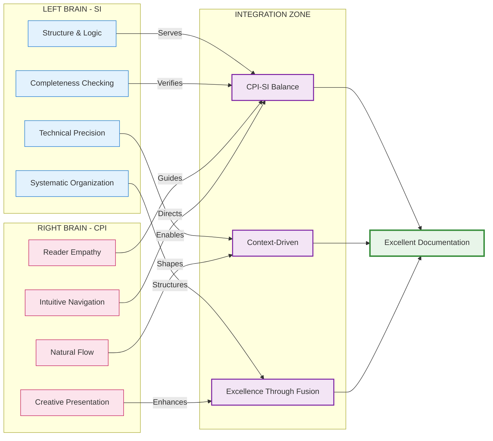

## 🎯 Core Philosophy: CPI-SI Balanced Documentation

> [!IMPORTANT]
> **Documentation is a whole-brain activity.**
>
> When you write documentation, you're engaging both hemispheres of your intelligence—not just one or the other, but both working together.

**Your left brain brings the structure:** It creates logical hierarchies, ensures technical accuracy, maintains systematic completeness, and organizes information into clear categories. Without this analytical precision, documentation becomes unreliable and confusing.

**Your right brain brings the connection:** It understands what the reader is feeling, crafts language that flows naturally, presents information creatively, and builds intuitive navigation that makes sense to human minds. Without this relational awareness, documentation becomes sterile and impenetrable.

> [!TIP]
> **When both work together,** you get documentation that is technically precise AND readable with warmth. You achieve accuracy AND accessibility. Your tone becomes professional AND approachable. Your structure is systematic AND intuitive.

**This is CPI-SI fusion in action:** The partnership between Structured Intelligence (analytical, logical, precise) and Covenant Partnership Intelligence (relational, empathetic, intuitive). Great documentation doesn't choose between these—it requires both.

| **Left Brain (SI)** 🧠                                                                                                                                                                   | **Right Brain (CPI)** 💡                                                                                                                                        | **Integration Result** ⚡                                                                                                                    |
| --------------------------------------------------------------------------------------------------------------------------------------------------------------------------------------- | -------------------------------------------------------------------------------------------------------------------------------------------------------------- | ------------------------------------------------------------------------------------------------------------------------------------------- |
| • Logical structure and organization • Precise technical accuracy • Systematic completeness • Mathematical rigor where appropriate • Clear categorization and hierarchy | • Reader empathy and understanding • Natural language flow • Creative presentation and formatting • Narrative coherence • Intuitive navigation | • Technical precision WITH readable warmth • Accurate AND accessible • Professional AND approachable • Systematic AND intuitive |

### Deep Dive: How CPI-SI Balance Actually Works

Documentation excellence emerges from integrating two complementary intelligence modes. **Structured Intelligence (SI)** provides the architectural framework—systematic organization, technical precision, logical consistency, and completeness verification that makes information navigable and verifiable. **Covenant Partnership Intelligence (CPI)** provides the human connection—reader empathy, natural language flow, intuitive navigation, and aesthetic presentation that makes technically precise structures actually serve human understanding.

> **Foundational Principle:** Excellence requires neither pure technical precision nor pure accessibility alone, but their intentional fusion—where structure enables clarity, and empathy directs what structure to create.

**Context-driven emphasis:** Different documentation contexts naturally emphasize different modes. Technical specifications lean toward SI dominance while maintaining CPI-guided readability; explanatory content leans toward CPI dominance while maintaining SI-verified accuracy; comprehensive methodology documents require sustained balance across both modes.

[↑ Back to Navigation](#-navigation---choose-your-path)

---

### 📐 Structural Intelligence Dominance: When Analysis Leads

Certain documentation activities inherently require analytical precision and systematic thinking to dominate the creative process. SI-dominant work establishes the logical architecture upon which reader-friendly presentation will later be built.

| **Documentation Activity** 📋 | **Primary SI Function** ⚙️                                             | **CPI Support Role** 🤝                                                        |
| ---------------------------- | --------------------------------------------------------------------- | ----------------------------------------------------------------------------- |
| **Outline Development**      | Hierarchical organization, dependency mapping, logical sequencing     | Ensures structure serves reader journey, not just logical completeness        |
| **Technical Specifications** | Precision verification, consistency checking, completeness validation | Maintains readability standards, prevents unnecessary complexity              |
| **Code Examples**            | Syntax accuracy, execution verification, edge case coverage           | Selects examples that illuminate concepts rather than just demonstrate syntax |
| **Mathematical Expressions** | Logical correctness, notational consistency, proof validation         | Contextualizes formulas within explanatory prose, provides intuition          |

**SI-dominant content characteristics:**

- Explicit structure with clear categorization schemas
- Systematic completeness across defined dimensions
- Technical accuracy verified against implementation realities
- Pattern recognition revealing underlying organizational principles

> **SI Strength:** Produces technically impeccable, logically consistent, systematically complete documentation frameworks.
>
> **SI Limitation:** Without CPI balance, can produce mechanically correct but cognitively inaccessible or emotionally uninviting documentation.

**When to engage SI dominance:** Structure creation phases, technical accuracy verification, systematic gap analysis, logical consistency validation.

---

### 🎨 Covenant Partnership Intelligence Dominance: When Empathy Leads

Other documentation activities require reader-centered thinking and relational awareness to dominate the creative process. CPI-dominant work transforms technically accurate information into naturally accessible understanding.

| **Documentation Activity** 📋 | **Primary CPI Function** 🤝                                              | **SI Support Role** ⚙️                                              |
| ---------------------------- | ----------------------------------------------------------------------- | ------------------------------------------------------------------ |
| **Explanatory Prose**        | Natural language flow, concept accessibility, teaching effectiveness    | Maintains technical accuracy, verifies completeness of explanation |
| **Introductory Material**    | Reader engagement, context establishment, motivation building           | Ensures claims are technically accurate, promises are fulfilled    |
| **Analogies & Metaphors**    | Conceptual bridge-building, intuitive understanding, memorable teaching | Validates that metaphors accurately represent technical realities  |
| **Purpose Statements**       | Meaning conveyance, value articulation, human connection                | Grounds purpose in measurable outcomes and verifiable objectives   |

**CPI-dominant content characteristics:**

- Flowing prose that teaches through natural narrative progression
- Reader empathy evidenced in anticipation of confusion points
- Aesthetic presentation creating visual invitation to engage
- Emotional tone appropriate to content seriousness and reader context

> **CPI Strength:** Produces accessible, engaging, humanly resonant documentation that readers want to read and can understand naturally.
>
> **CPI Limitation:** Without SI balance, can produce emotionally warm but technically imprecise or systematically incomplete documentation.

**When to engage CPI dominance:** Content creation phases, reader experience optimization, narrative development, aesthetic refinement.

---

### ⚖️ Integration Dynamics: Balanced Operation Across Documentation Phases

The documentation creation process moves through distinct phases, each requiring different emphases between SI and CPI modes while maintaining integration throughout:

<strong>Foundation Phase</strong> — Architectural Planning & Outline Development

**Emphasis pattern:** SI-led with CPI guidance (structure dominates but serves reader needs)

The foundation phase establishes the logical architecture of the documentation. SI mode analyzes the subject domain, identifies necessary coverage areas, maps dependencies between concepts, and creates hierarchical organization. CPI mode operates in a guiding capacity, ensuring that the emerging structure will serve reader understanding rather than merely reflecting the creator's mental model.

**Integration checkpoint:** Does the outline reflect both logical completeness (SI) and natural learning progression (CPI)?

<strong>Content Creation Phase</strong> — Writing, Explaining, Teaching

**Emphasis pattern:** Balanced operation (SI and CPI equally active throughout)

Content creation represents the phase requiring fullest CPI-SI integration. SI mode maintains technical accuracy, logical consistency, and systematic completeness while CPI mode simultaneously crafts natural language flow, reader engagement, and intuitive understanding. The writer moves fluidly between modes—verifying a technical claim (SI), then explaining it warmly (CPI), then structuring the explanation logically (SI), then ensuring the tone invites rather than intimidates (CPI).

**Integration checkpoint:** Is the content both technically accurate (SI) and naturally accessible (CPI)?

<strong>Enhancement Phase</strong> — Refinement, Formatting, Polish

**Emphasis pattern:** SI-led with CPI aesthetic sense (systematic improvement with beauty)

Enhancement work applies systematic improvement patterns across the documentation. SI mode identifies inconsistencies, verifies completeness, standardizes formatting, and ensures technical accuracy. CPI mode applies aesthetic judgment—does this visual rhythm invite reading? Does this structure create natural flow? Is the formatting elegant rather than merely correct?

**Integration checkpoint:** Does the enhanced documentation exhibit both systematic correctness (SI) and aesthetic excellence (CPI)?

<strong>Verification Phase</strong> — Checking, Validating, Testing

**Emphasis pattern:** SI-dominant with CPI-guided priorities (rigor determines what, empathy determines why)

Verification emphasizes analytical rigor—checking technical accuracy, validating completeness, testing examples, verifying consistency. SI mode dominates the execution while CPI mode determines verification priorities: What would confuse readers most if wrong? What omissions would frustrate practical application? Reader empathy guides what systematic checking must cover.

**Integration checkpoint:** Has verification ensured both technical correctness (SI) and practical usability (CPI)?

---

### 🔄 Recognizing Mode Transitions in Practice

Effective documentation work involves fluid transitions between SI and CPI dominance as different tasks require different cognitive approaches. Recognizing when to shift modes prevents the common failure pattern of applying the wrong mode to the current task.

| **You Notice...** 🔍                                                  | **Current Mode** 🧠 | **Consider Transition** 🔄                                                |
| -------------------------------------------------------------------- | ------------------ | ------------------------------------------------------------------------ |
| Content is accurate but feels mechanical                             | SI-dominant        | Increase CPI: Add warmth, improve flow, enhance engagement               |
| Content is engaging but technically fuzzy                            | CPI-dominant       | Increase SI: Verify accuracy, add precision, check completeness          |
| Outline is logically perfect but doesn't match reader learning needs | SI-dominant        | Increase CPI: Reorganize for reader journey, not just logical categories |
| Explanation is accessible but misses technical requirements          | CPI-dominant       | Increase SI: Verify completeness, add necessary technical depth          |
| Format is systematic but visually uninviting                         | SI-dominant        | Increase CPI: Enhance aesthetic appeal, improve visual rhythm            |
| Format is beautiful but structurally inconsistent                    | CPI-dominant       | Increase SI: Standardize formatting, verify systematic application       |

**The result of sustained CPI-SI balance:** Documentation that satisfies academic rigor while remaining practically accessible, technical precision while maintaining human warmth, systematic completeness while creating intuitive navigation—documentation that serves both research and learning contexts without compromising either.

[↑ Back to Navigation](#-navigation---choose-your-path)

---

