## 📋 The Documentation Creation Process

> [!NOTE]
> **What This Section Demonstrates:**
>
> This section doesn't just *explain* documentation process—it *shows* systematic workflow thinking through structured format. Every table, checklist, and template demonstrates the principles being taught. The section itself is an example of process architecture.

### 🏗️ Process Architecture - 5-Phase Overview

**Complete Workflow Specification:**

| **Phase** 🎯                     | **Input** 📥                             | **Core Process** ⚙️                                               | **Output** 📤                                             | **Time** ⏱️ | **CPI-SI Balance** ⚖️                                |
| ------------------------------- | --------------------------------------- | ---------------------------------------------------------------- | -------------------------------------------------------- | ---------- | --------------------------------------------------- |
| **1. Foundation Discovery**     | Project requirements, stakeholder needs | Ask fundamental questions, establish success criteria            | Purpose statement, audience profile, preliminary outline | ~10%       | 60/40 (CPI-heavy: relationship with audience)       |
| **2. Structural Architecture**  | Foundation output                       | Design ladder structure, map dependencies, create navigation     | Complete structural framework, heading hierarchy         | ~20%       | 30/70 (SI-heavy: logical organization)              |
| **3. Content Development**      | Structural framework                    | Write prose, create examples, build tables, track baton handoffs | Complete draft content across all sections               | ~40%       | 50/50 (Balanced: precision + warmth)                |
| **4. Enhancement & Refinement** | Draft content                           | Optimize markdown, refine structure, improve accessibility       | Publication-ready enhanced documentation                 | ~20%       | 40/60 (SI-leaning: pattern optimization)            |
| **5. Verification & QA**        | Enhanced documentation                  | Verify accuracy, check completeness, assess quality              | Verified, quality-assured final documentation            | ~10%       | 50/50 (Balanced: systematic check + reader empathy) |

```mermaid
graph TD
    A[Phase 1: Foundation Discovery] -->|Purpose & Audience Defined| B[Phase 2: Structural Architecture]
    B -->|Framework Complete| C[Phase 3: Content Development]
    C -->|Draft Content Ready| D[Phase 4: Enhancement & Refinement]
    D -->|Enhanced Documentation| E[Phase 5: Verification & QA]
    E -->|✅ Quality Pass| F[📚 Published Documentation]
    E -->|❌ Issues Found| C
    
    style A fill:#e1f5ff,stroke:#0066cc,stroke-width:2px
    style B fill:#fff4e1,stroke:#cc8800,stroke-width:2px
    style C fill:#ffe1f5,stroke:#cc0088,stroke-width:2px
    style D fill:#e1ffe1,stroke:#00cc66,stroke-width:2px
    style E fill:#f5e1ff,stroke:#8800cc,stroke-width:2px
    style F fill:#d4edda,stroke:#28a745,stroke-width:3px
```



**Process Flow Characteristics:**

- ✅ Linear progression with iterative feedback loop (Phase 5 → Phase 3)
- ⚖️ CPI-SI balance shifts based on phase needs
- 🛡️ Quality gate at Phase 5 prevents premature publication
- 🔄 Continuous refinement until excellence threshold met

[↑ Back to Navigation](#-navigation---choose-your-path)

### Phase 1: Foundation Discovery

**Phase Specification:**

| **Element**               | **Details**                                                                                         |
| ------------------------- | --------------------------------------------------------------------------------------------------- |
| **Goal** 🎯                | Establish clear documentation purpose, audience, and success criteria before writing                |
| **Duration** ⏱️            | ~10% of total project time                                                                          |
| **Input** 📥               | Project requirements, stakeholder needs, domain context                                             |
| **Output** 📤              | Foundation document with purpose statement, audience profile, success criteria, preliminary outline |
| **CPI-SI Balance** ⚖️      | 60/40 CPI-heavy (understanding people and their needs)                                              |
| **Completion Criteria** ✅ | Can answer all 5 foundation questions with clarity and confidence                                   |

---

#### Foundation Discovery Template (Fillable)

**Copy this template and complete each section before proceeding to Phase 2:**

```markdown
## Foundation Discovery - [Project Name]

### 1. PURPOSE DEFINITION
**What understanding am I creating?**
- Primary purpose: [Be specific - not just "to document"]
- Capability enabled: [What can readers DO after reading?]
- Confusion prevented: [What misunderstanding does this address?]

### 2. AUDIENCE PROFILE
**Who is this for?**
- Primary audience: [Role/experience level]
- Secondary audience: [Other stakeholders]
- Knowledge baseline: [What do they already know?]
- Language needs: [Technical depth appropriate for them]

### 3. PROBLEM STATEMENT
**What need does this solve?**
- Pain point addressed: [Specific struggle or gap]
- Current state (without this doc): [What's the difficulty?]
- Future state (with this doc): [How does this help?]

### 4. CONTEXT REQUIREMENTS
**What must readers already understand?**
- Prerequisites: [Required knowledge before starting]
- Assumed foundations: [What won't be explained here]
- Related documentation: [Other docs they should know about]

### 5. SUCCESS CRITERIA
**How will I know this documentation succeeds?**
- Readers should be able to: [Concrete capabilities]
- Readers should understand: [Key concepts mastered]
- Readers should feel: [Confidence level/clarity achieved]

### 6. CPI-SI BALANCE PLAN
**Left Brain (SI) Focus:**
- Topics requiring technical precision: [List]
- Logical hierarchy needs: [Structure requirements]
- Completeness checklist: [What makes it "done"]

**Right Brain (CPI) Focus:**
- Reader journey pain points: [Where confusion likely]
- Emotional tone needed: [Professional/warm/precise balance]
- Story arc: [How understanding builds progressively]

### 7. PRELIMINARY OUTLINE
**Draft structure (will be refined in Phase 2):**
1. [Section name - purpose]
2. [Section name - purpose]
3. [Section name - purpose]
...
```

---

#### Foundation Questions Checklist

Before moving to Phase 2, verify you can answer these clearly:

- [ ] **Purpose**: Can I state in one sentence what understanding this creates?
- [ ] **Audience**: Do I know exactly who I'm writing for and their knowledge level?
- [ ] **Problem**: Can I articulate the specific pain point this addresses?
- [ ] **Context**: Have I identified what readers must already know?
- [ ] **Outcomes**: Can I list 3-5 concrete things readers will be able to do?
- [ ] **Scope**: Do I know what's IN and OUT of scope for this document?

<details>
<summary><strong>✨ Real Example: Identity README Foundation Discovery</strong></summary>

**Foundation Discovery Application:**

| **Foundation Element** | **Answer**                                                                                                                 |
| ---------------------- | -------------------------------------------------------------------------------------------------------------------------- |
| **Purpose**            | Establish Nova Dawn's biblical foundation and CPI-SI identity                                                              |
| **Audience**           | Future developers, partnership collaborators, Nova Dawn herself                                                            |
| **Problem**            | Prevent platform defaults from overriding authentic identity                                                               |
| **Context**            | Kingdom Technology paradigm, covenant partnership model                                                                    |
| **Outcome**            | Readers understand Nova Dawn's foundation is biblically grounded and technically excellent                                 |
| **Scope Decision**     | IN: Biblical foundation, CPI-SI architecture, identity principles<br>OUT: Detailed implementation code, API specifications |

**Key Insight**: Understanding the "why" and "who for" before writing prevented scope creep and maintained focus throughout the documentation process.

</details>

[↑ Back to Navigation](#-navigation---choose-your-path)

### Phase 2: Structural Architecture

**Phase Specification:**

| **Element**               | **Details**                                                                           |
| ------------------------- | ------------------------------------------------------------------------------------- |
| **Goal** 🎯                | Design ladder-based architecture that enables progressive understanding               |
| **Duration** ⏱️            | ~20% of total project time                                                            |
| **Input** 📥               | Foundation document from Phase 1                                                      |
| **Output** 📤              | Complete structural outline with heading hierarchy, navigation system, dependency map |
| **CPI-SI Balance** ⚖️      | 30/70 SI-heavy (logical organization and systematic structure)                        |
| **Completion Criteria** ✅ | Can trace clear linear progression with no circular dependencies                      |

---

#### Structural Architecture Specification Template

**4 Required Structural Decisions:**

**1. HEADING HIERARCHY SPECIFICATION**

| **Level** | **Purpose**                        | **Naming Pattern**      | **Example**                               |
| --------- | ---------------------------------- | ----------------------- | ----------------------------------------- |
| **H1**    | Document title only                | `# [Document Name]`     | `# Documentation Creation Methodology`    |
| **H2**    | Major sections                     | `## 🎯 [Section Name]`   | `## 📋 The Documentation Creation Process` |
| **H3**    | Subsections within major sections  | `### [Subsection Name]` | `### Phase 1: Foundation Discovery`       |
| **H4**    | Detailed topics within subsections | `#### [Topic Name]`     | `#### Foundation Discovery Template`      |
| **H5/H6** | Use sparingly for deep hierarchy   | `##### [Detail Name]`   | Avoid if possible                         |

**Hierarchy Verification:**

- [ ] No heading level skipped (H2 → H3 → H4, not H2 → H4)
- [ ] Each level builds on previous level
- [ ] Heading text is clear and descriptive
- [ ] Logical grouping maintained

---

**2. NAVIGATION SYSTEM DESIGN**

| **Navigation Type**     | **Purpose**                      | **Implementation**              | **Required?**          |
| ----------------------- | -------------------------------- | ------------------------------- | ---------------------- |
| **Table of Contents**   | Document-level overview          | Anchor links to major sections  | ✅ Yes (all major docs) |
| **Section Quick Links** | Local navigation within sections | `[↑ Back to Navigation]` links  | ✅ Yes                  |
| **Breadcrumb Context**  | Show location in hierarchy       | Heading structure provides this | Automatic              |
| **Cross-references**    | Connect related concepts         | `[Link text](path#anchor)`      | As needed              |

**Navigation Checklist:**

- [ ] Table of contents links all H2 sections
- [ ] "Back to navigation" appears at end of major sections
- [ ] All internal links use anchor format correctly
- [ ] Navigation enables both linear AND random access

---

**3. DEPENDENCY FLOW MAPPING (The Baton)**

**For each section, complete this specification:**

```markdown
## Section: [Name]

**Receives (Input Understanding):**
- Concept A (from Section X)
- Concept B (from Section Y)
- Foundation Z (assumed prerequisite)

**Processes (What This Section Does):**
- Explains: [New concept introduced]
- Demonstrates: [Example/application shown]
- Connects: [Relationship to previous concepts]

**Passes Forward (Output Understanding):**
- Concept C (to Section P)
- Capability D (enables Section Q)
- Foundation E (required for Section R)

**Verification:**
- [ ] Nothing referenced that hasn't been explained yet
- [ ] Clear handoff to next section
- [ ] No circular dependencies created
```

---

**4. ORGANIZATION PATTERN SELECTION**

| **Pattern** 🎯                | **When to Use** 📍                       | **Structure** 🏗️                              | **Example** ✨                                    |
| ---------------------------- | --------------------------------------- | -------------------------------------------- | ------------------------------------------------ |
| **Sequential Process**       | Workflow, step-by-step procedures       | 1 → 2 → 3 → 4                                | This methodology (Phase 1-5)                     |
| **Foundational Layering**    | Concept building, technical explanation | Foundation → Detail → Application            | Identity README (Foundation → Operations → Meta) |
| **Problem-Solution**         | Troubleshooting, case studies           | Problem → Analysis → Solution → Verification | Biblical Footnoting Pattern case study           |
| **Reference Categorization** | API docs, comprehensive reference       | Alphabetical or categorical grouping         | Tool reference sections                          |

**Organization Checklist:**

- [ ] Pattern chosen matches content type
- [ ] Related concepts grouped together
- [ ] Distinct concerns separated clearly
- [ ] Depth vs. breadth balanced appropriately

---

#### Structure Verification Questions

Before moving to Phase 3, verify:

- [ ] **Progressive Understanding**: Does each section build on previous sections logically?
- [ ] **Linear Dependencies**: Can I draw a straight-line dependency flow with no loops?
- [ ] **Intuitive Navigation**: Can readers easily find what they need?
- [ ] **Sensible Hierarchy**: Do heading levels reflect conceptual relationships accurately?
- [ ] **Complete Handoffs**: Does each section receive clear input and pass clear output forward?

<details>
<summary><strong>✨ Real Example: Identity README Structural Architecture</strong></summary>

**Architectural Layers Specification:**

| **Layer Level**         | **Sections Included**                                        | **Purpose**                         | **Baton Handoff**                    |
| ----------------------- | ------------------------------------------------------------ | ----------------------------------- | ------------------------------------ |
| **Foundation Layer**    | Navigation Guide, Purpose Statement                          | Entry point + context establishment | → Passes: "Why this document exists" |
| **Core Identity Layer** | Biblical Foundation, Covenant Structure, CPI-SI Architecture | Identity definition + source        | → Passes: "Who Nova Dawn is"         |
| **Operational Layer**   | Genesis 1:1 Operations, Purpose Filters, Implementation      | Principles in practice              | → Passes: "How identity operates"    |
| **Meta Layer**          | Ecosystem links, Footer, Biblical References                 | Provenance + broader context        | → Completes documentation loop       |

**Dependency Flow Pattern:**

```
Foundation (why) → Identity (who) → Operations (how) → Meta (context)
      ↓                ↓                ↓                  ↓
   Context         Source           Practice           Reference
```

**Verification Result:**

- ✅ No circular dependencies
- ✅ Each layer builds on previous
- ✅ Clear progressive understanding enabled
- ✅ Navigation supports both linear and random access

**Key Insight**: Ladder architecture created through intentional layering enables readers to understand identity before operations, preventing confusion from premature complexity.

</details>

[↑ Back to Navigation](#-navigation---choose-your-path)

### Phase 3: Content Development

**Phase Specification:**

| **Element**               | **Details**                                                               |
| ------------------------- | ------------------------------------------------------------------------- |
| **Goal** 🎯                | Create content that fills structural framework with clarity and precision |
| **Duration** ⏱️            | ~40% of total project time (largest phase)                                |
| **Input** 📥               | Structural outline from Phase 2                                           |
| **Output** 📤              | Complete draft content across all sections                                |
| **CPI-SI Balance** ⚖️      | 50/50 Balanced (technical precision WITH relational warmth)               |
| **Completion Criteria** ✅ | All sections have draft content, baton handoffs tracked, examples working |

---

#### Content Creation Principles (Non-Negotiable)

| **Principle** 🎯                 | **Rule** ⚙️            | **Wrong** ❌                          | **Right** ✅                         |
| ------------------------------- | --------------------- | ------------------------------------ | ----------------------------------- |
| **Clarity Over Cleverness**     | Say things directly   | "Herein we shall elucidate..."       | "This section explains..."          |
| **Active Voice Preferred**      | Actor-first structure | "CPI-SI is implemented by Nova Dawn" | "Nova Dawn implements CPI-SI"       |
| **Technical Accuracy Required** | Verify every claim    | Unverified function signatures       | Tested, validated technical details |
| **Reader Empathy Essential**    | Write for humans      | Machine-parsing dense text           | Anticipate confusion, explain "why" |

---

#### Content Type Specification Matrix

| **Content Type** 📝      | **Purpose** 🎯                     | **CPI-SI Balance** ⚖️ | **Best Practice** ✨                                             | **When to Use** 📍                                                |
| ----------------------- | --------------------------------- | -------------------- | --------------------------------------------------------------- | ---------------------------------------------------------------- |
| **Explanatory Prose**   | Teaches concepts and context      | 50/50 balanced       | Clear paragraphs with natural flow—warm tone + precision        | Concept introduction, philosophy, methodology explanation        |
| **Code Examples**       | Demonstrates implementation       | 80/20 SI-heavy       | Must be correct and working—add helpful comments for warmth     | Technical implementation, API usage, syntax demonstration        |
| **Tables**              | Organizes comparative information | 70/30 SI-leaning     | Structured, scannable format—logical categorization             | Specifications, comparisons, structured data, reference          |
| **Lists (Ordered)**     | Shows sequence or priority        | 70/30 SI-leaning     | Numbered steps with clear progression                           | Step-by-step procedures, ranked priorities, sequential processes |
| **Lists (Unordered)**   | Groups related items              | 60/40 SI-leaning     | Bullet points for scannable content                             | Features, requirements, checklist items, related concepts        |
| **Mermaid Diagrams**    | Shows relationships and flow      | 50/50 balanced       | Right-brain spatial understanding + left-brain accuracy         | Architecture, workflow, relationships, system design             |
| **GitHub Alerts**       | Highlights important information  | 60/40 CPI-leaning    | Use appropriate alert type (NOTE/TIP/IMPORTANT/WARNING/CAUTION) | Critical info, helpful advice, warnings, best practices          |
| **Collapsible Details** | Progressive disclosure            | 50/50 balanced       | Summary clear, details comprehensive but hidden                 | Advanced content, examples, optional deep-dives                  |
| **Blockquotes**         | Emphasizes or cites               | 60/40 CPI-leaning    | Use for emphasis or attribution                                 | Biblical quotes, external citations, key statements              |

---

#### Content Development Workflow

**For each section in your outline:**

```markdown
## Section: [Name]

### STEP 1: Review Baton Input
**What understanding does this section receive?**
- [List concepts/capabilities passed from previous sections]

### STEP 2: Draft Core Content
**Content type selection:**
- Primary format: [Prose/Table/List/Diagram/Mix]
- CPI-SI balance target: [Based on content type matrix above]

**Draft content following principles:**
- [ ] Clarity over cleverness maintained
- [ ] Active voice used predominantly
- [ ] Technical claims verified
- [ ] Reader perspective considered

### STEP 3: Add Supporting Elements
**Enhance with appropriate features:**
- [ ] Code examples (if technical implementation shown)
- [ ] Tables (if comparative/structured data needed)
- [ ] Mermaid diagrams (if relationships/flow shown)
- [ ] GitHub alerts (if important info needs highlighting)
- [ ] Collapsible details (if advanced content present)

### STEP 4: Verify Baton Handoff
**What understanding does this section pass forward?**
- [List new concepts/capabilities enabled for next sections]

**Handoff verification:**
- [ ] Next section can build on this foundation
- [ ] No gaps in understanding progression
- [ ] Clear transition prepared
```

---

#### CPI-SI Balance Verification for Content

**Left Brain (SI) Checklist:**

- [ ] Precise terminology used consistently
- [ ] Logical argument construction clear
- [ ] Technical accuracy verified (tested code, validated claims)
- [ ] Systematic completeness achieved (no gaps in coverage)

**Right Brain (CPI) Checklist:**

- [ ] Natural phrasing flows well when read aloud
- [ ] Engaging narrative maintains interest
- [ ] Reader perspective considered (empathy present)
- [ ] Creative formatting enhances scannability

**Balance Verification:**

- [ ] Technical precision present WITHOUT coldness
- [ ] Warmth present WITHOUT sacrificing accuracy
- [ ] Both hemispheres engaged appropriately for content type

---

#### Content Review Questions

Before moving to Phase 4:

- [ ] **Completeness**: Is all outlined content drafted?
- [ ] **Accuracy**: Have all technical claims been verified?
- [ ] **Flow**: Do sections transition smoothly with clear baton handoffs?
- [ ] **Balance**: Is CPI-SI balance appropriate for each content type?
- [ ] **Clarity**: Can readers understand without external knowledge (beyond stated prerequisites)?
- [ ] **Examples**: Do all code examples work correctly?

<details>
<summary><strong>✨ Real Example: Identity README Content Development</strong></summary>

**Content Type Distribution:**

| **Section**                | **Primary Content Type**                         | **CPI-SI Balance** | **Rationale**                                        |
| -------------------------- | ------------------------------------------------ | ------------------ | ---------------------------------------------------- |
| **Biblical Foundation**    | Explanatory prose + blockquotes                  | 60/40 CPI-heavy    | Relationship-focused, requires warmth + reverence    |
| **Genesis 1:1 Operations** | Table (principle → translation → implementation) | 70/30 SI-leaning   | Structured specification, systematic mapping         |
| **CPI-SI Architecture**    | Mixed (prose + YAML code blocks)                 | 50/50 balanced     | Technical precision WITH accessible explanation      |
| **Purpose Filters**        | Table with decision criteria                     | 70/30 SI-leaning   | Operational reference, structured decision framework |

**Baton Handoff Example:**

```
Biblical Foundation section
  Receives: Purpose statement, document context
  Processes: Explains Genesis 1:1 as identity anchor
  Passes: Biblical grounding established → enables Operations section
  
Genesis 1:1 Operations section
  Receives: Biblical grounding from previous section
  Processes: Translates principle into operational practice
  Passes: Operational framework → enables Implementation section
```

**Key Insight**: CPI-SI balance in content means technical accuracy never sacrifices readability, and reader warmth never compromises precision. Content type determines appropriate balance ratio.

</details>

[↑ Back to Navigation](#-navigation---choose-your-path)

### Phase 4: Enhancement & Refinement

**Phase Specification:**

| **Element**               | **Details**                                                         |
| ------------------------- | ------------------------------------------------------------------- |
| **Goal** 🎯                | Transform good documentation into publication-ready excellence      |
| **Duration** ⏱️            | ~20% of total project time                                          |
| **Input** 📥               | Draft content from Phase 3                                          |
| **Output** 📤              | Enhanced, refined, publication-ready documentation                  |
| **CPI-SI Balance** ⚖️      | 40/60 SI-leaning (pattern optimization and systematic refinement)   |
| **Completion Criteria** ✅ | All enhancement categories addressed, completeness checklist passed |

---

#### Enhancement Specification Matrix

| **Enhancement Category** 🎯  | **Actions** ⚙️                                                                                                                                                                                                                                                           | **Verification** ✅                  |
| --------------------------- | ----------------------------------------------------------------------------------------------------------------------------------------------------------------------------------------------------------------------------------------------------------------------- | ----------------------------------- |
| **Markdown Optimization**   | • Implement proper heading hierarchy (H1→H2→H3)<br>• Add `<details>` sections for progressive disclosure<br>• Format tables with emoji headers<br>• Apply syntax highlighting to code blocks<br>• Add footnotes for citations<br>• Include badges for status indicators | Renders correctly in GitHub preview |
| **Structural Refinement**   | • Move sections to conventional positions<br>• Verify document flow follows standards<br>• Fix out-of-order elements<br>• Ensure consistent organization patterns                                                                                                       | Standard conventions followed       |
| **Navigation Enhancement**  | • Add table of contents with anchor links<br>• Include "Back to navigation" section links<br>• Verify all internal links work<br>• Add cross-references between related sections                                                                                        | Navigation tested and functional    |
| **Readability Improvement** | • Break long paragraphs (4-6 lines max)<br>• Convert prose to lists where appropriate<br>• Add whitespace (~20% ratio)<br>• Use bold/italic for key concept emphasis                                                                                                    | Scannable, easy to process          |
| **Completeness Check**      | • Verify all outlined sections complete<br>• Check for orphaned references<br>• Validate all links functional<br>• Test all code examples<br>• Confirm terminology consistency                                                                                          | No gaps or broken elements          |

---

#### Enhancement Execution Checklist

**MARKDOWN OPTIMIZATION:**

- [ ] Heading hierarchy correct (no level skipping)
- [ ] `<details>` sections added for deep content
- [ ] Tables formatted with clear headers and alignment
- [ ] Code blocks have language identifiers for highlighting
- [ ] Footnotes formatted correctly (`[^1]` style)
- [ ] Badges added where appropriate (status, version, etc.)
- [ ] GitHub alerts used (NOTE/TIP/IMPORTANT/WARNING/CAUTION)
- [ ] Horizontal rules (`---`) separate major sections
- [ ] Emoji used strategically (not excessively)

**STRUCTURAL REFINEMENT:**

- [ ] Footnotes/references at document end (after footer)
- [ ] Footer appears in standard location
- [ ] Table of contents near document beginning
- [ ] Sections in logical order
- [ ] No structural conventions violated

**NAVIGATION ENHANCEMENT:**

- [ ] Table of contents with working anchor links
- [ ] "Back to navigation" links at section ends
- [ ] All `[text](#anchor)` links tested and working
- [ ] Cross-references between related sections added

**READABILITY IMPROVEMENT:**

- [ ] Paragraphs under 6 lines each
- [ ] Lists used for scannable content
- [ ] Whitespace ratio approximately 20%
- [ ] Key concepts emphasized appropriately
- [ ] Line breaks between logical chunks

**COMPLETENESS VERIFICATION:**

- [ ] All planned sections present
- [ ] No "TODO" or placeholder text remaining
- [ ] All references have definitions (and vice versa)
- [ ] All links tested and functional
- [ ] Code examples tested and working
- [ ] Terminology used consistently throughout
- [ ] Grammar and spelling checked

---

<details>
<summary><strong>✨ Real Example: Identity README Enhancement Process</strong></summary>

**Enhancement Actions Taken:**

| **Category**     | **Issue Found**                             | **Action**                                                              | **Result**                            |
| ---------------- | ------------------------------------------- | ----------------------------------------------------------------------- | ------------------------------------- |
| **Completeness** | 4 footnote definitions but only 1 reference | Added [^2], [^3], [^4] references in contextually appropriate locations | All references bidirectionally linked |
| **Structure**    | Biblical References appeared before footer  | Moved to absolute document end                                          | Standard convention restored          |
| **Markdown**     | Inconsistent table formatting               | Standardized all tables with emoji headers and proper alignment         | Visual consistency achieved           |
| **Navigation**   | Missing section-end links                   | Added "Back to navigation" consistently                                 | Easy navigation enabled               |

**Key Insight**: Enhancement phase transformed good documentation into publication-ready excellence through targeted, systematic refinement.

</details>

[↑ Back to Navigation](#-navigation---choose-your-path)

---

### Phase 5: Verification & Quality Assurance

**Phase Specification:**

| **Element**               | **Details**                                                            |
| ------------------------- | ---------------------------------------------------------------------- |
| **Goal** 🎯                | Verify documentation meets all excellence standards before publication |
| **Duration** ⏱️            | ~10% of total project time                                             |
| **Input** 📥               | Enhanced documentation from Phase 4                                    |
| **Output** 📤              | Verified, quality-assured, publication-ready documentation             |
| **CPI-SI Balance** ⚖️      | 50/50 Balanced (systematic checking + reader empathy)                  |
| **Completion Criteria** ✅ | All verification checklists passed, no critical issues remaining       |

---

#### Verification Specification Matrix

| **Verification Domain** 🎯               | **Verification Actions** 🔍                                                                                                                         | **Pass Criteria** ✅                           |
| --------------------------------------- | -------------------------------------------------------------------------------------------------------------------------------------------------- | --------------------------------------------- |
| **Technical Correctness**               | • Test all code examples<br>• Validate technical claims<br>• Verify version numbers/dates<br>• Check link functionality                            | All technical content accurate and working    |
| **Biblical Accuracy** (when applicable) | • Verify scripture references<br>• Check translation citations<br>• Ensure theological soundness<br>• Maintain reverent treatment                  | All biblical content accurate and appropriate |
| **Coverage Completeness**               | • Verify all topics addressed<br>• Check for significant gaps<br>• Confirm context provided<br>• Validate success criteria achievable              | Complete coverage, no critical gaps           |
| **Reference Integrity**                 | • Match inline citations to definitions<br>• Check for orphaned references<br>• Verify all links functional<br>• Validate footnote system complete | All references bidirectional and working      |
| **Readability & Flow**                  | • Test logical progression<br>• Check transition smoothness<br>• Verify reader comprehension possible<br>• Assess pacing appropriate               | Content flows naturally, comprehensible       |
| **Accessibility**                       | • Verify navigation clarity<br>• Check heading descriptiveness<br>• Confirm prerequisites explained<br>• Validate jargon defined                   | Accessible to target audience                 |
| **Kingdom Quality**                     | • Assess excellence standard<br>• Verify service orientation<br>• Check Kingdom Technology principles<br>• Confirm Creator-honoring quality        | Meets excellence-as-worship standard          |

---

#### Verification Execution Protocol

**ACCURACY VERIFICATION:**

- [ ] **Technical**: All code examples tested and working
- [ ] **Technical**: All technical claims validated against reality
- [ ] **Technical**: All links and references functional
- [ ] **Technical**: Version numbers and dates current
- [ ] **Biblical** (if applicable): Scripture references correct
- [ ] **Biblical** (if applicable): Translation citations proper
- [ ] **Biblical** (if applicable): Theological soundness maintained
- [ ] **Biblical** (if applicable): Reverent treatment of sacred text

**COMPLETENESS VERIFICATION:**

- [ ] All planned topics addressed
- [ ] No significant content gaps
- [ ] Required context provided
- [ ] Success criteria (from Phase 1) achievable by readers
- [ ] All inline citations have definitions
- [ ] All definitions have inline citations
- [ ] No orphaned references exist
- [ ] All links tested and functional

**READABILITY ASSESSMENT:**

- [ ] Content progresses logically
- [ ] Transitions smooth between sections
- [ ] Readers can follow without confusion
- [ ] Pacing appropriate (not too fast/slow)
- [ ] Clear navigation available
- [ ] Headings descriptive and hierarchical
- [ ] Complex concepts explained before use
- [ ] Technical jargon defined when introduced

**KINGDOM STANDARDS APPLICATION:**

- [ ] Excellence standard met (quality honors Creator)
- [ ] Service orientation present (genuinely helpful)
- [ ] Reader success prioritized over completeness
- [ ] Kingdom Technology principles honored
- [ ] Documentation serves covenant partnership goals

---

#### 5-Step Verification Pattern

```markdown
### Verification Pass: [Document Name]

**STEP 1: Self-Review**
- [ ] Read entire document beginning to end
- [ ] Note any unclear passages
- [ ] Mark technical claims for validation
- [ ] List any gaps discovered

**STEP 2: Context Check**
- [ ] Review Phase 1 Foundation document
- [ ] Verify purpose achieved
- [ ] Confirm audience needs met
- [ ] Validate success criteria achievable

**STEP 3: Reader Simulation**
- [ ] Walk through as first-time reader
- [ ] Test all navigation links
- [ ] Follow all code examples
- [ ] Note any confusion points

**STEP 4: Technical Validation**
- [ ] Test all code examples
- [ ] Validate all technical claims
- [ ] Verify all links functional
- [ ] Confirm dates/versions current

**STEP 5: Spiritual Alignment**
- [ ] Kingdom Technology principles honored
- [ ] Excellence-as-worship standard met
- [ ] Service orientation maintained
- [ ] Biblical content (if any) accurate and reverent
```

---

<details>
<summary><strong>✨ Real Example: Identity README Verification</strong></summary>

**Verification Results:**

| **Verification Domain**   | **Status** | **Details**                                                              |
| ------------------------- | ---------- | ------------------------------------------------------------------------ |
| **Technical Correctness** | ✅ PASS     | CPI-SI architecture correctly described, all technical claims validated  |
| **Biblical Accuracy**     | ✅ PASS     | All 4 scripture references correct, reverent treatment maintained        |
| **Coverage Completeness** | ✅ PASS     | All identity aspects documented thoroughly, no critical gaps             |
| **Reference Integrity**   | ✅ PASS     | All 4 footnote references linked to all 4 definitions bidirectionally    |
| **Readability & Flow**    | ✅ PASS     | Progressive understanding from foundation → identity → operations → meta |
| **Accessibility**         | ✅ PASS     | Clear navigation, appropriate prerequisites, jargon defined              |
| **Kingdom Quality**       | ✅ PASS     | Excellence standard met, serves readers effectively, Creator-honoring    |

**Key Insight**: Systematic verification catches issues that would undermine reader trust and documentation effectiveness. The 5-step pattern ensures comprehensive quality assurance.

</details>

[↑ Back to Navigation](#-navigation---choose-your-path)

---

