# 📝 Documentation Methodology

## Opening the Mini-Book: From Need to Solution

**Preface, Page 1** begins where documentation frustration begins — the binary constraint forcing impossible choices between rigor and accessibility.[^preface-purpose] This opening establishes methodology's core innovation: CPI-SI integration resolving the false tradeoff through systematic warmth-precision fusion.

[^preface-purpose]: Preface serves dual purposes: (1) **Standalone utility** — practitioners can apply methodology successfully using Preface alone (~58% depth sufficient for 80-85% of documentation work), (2) **Foundation for depth** — readers choosing comprehensive mastery use Preface as launchpad for theoretical grounding (Chapters 1-12). This mirrors progressive disclosure at meta-level: essential knowledge accessible immediately, optional depth available selectively. Pedagogical efficiency: Most readers gain needed capability from Preface alone; specialists access Chapter depth when required.

The Preface (Pages 1-11) provides comprehensive accessible overview with ~6,181 lines covering ~58% methodology depth, enabling immediate practical application. After this accessible foundation, [Chapter 1](../01-INTRODUCTION-FOUNDATIONS/01-0-what-is-methodology.md) delves into theoretical grounding for readers seeking complete mastery.

You're starting with the most accessible path: understand the problem, see the solution, apply the methodology today.

---

## The Binary Constraint Problem

Traditional documentation practice forces an impossible choice rooted in false assumptions about warmth and rigor:[^pedagogy]

<dl>
<dt><strong>Option A: Optimize for Rigor (SI-Only)</strong></dt>
<dd>

**Strengths**:[^rigor-characteristics]
- ✅ Technical accuracy maintained through systematic verification
- ✅ Completeness verifiable against clear requirements
- ✅ Logical organization enables efficient reference lookup
- ✅ Precision terminology prevents ambiguity

**Weaknesses**:
- ❌ Reader engagement limited by cold, mechanical tone
- ❌ Cognitive load elevated through dense jargon
- ❌ Expert-only accessibility excludes broader audiences
- ❌ Navigation implicit, requiring existing familiarity

**Result**: Technically correct but rarely read. Documentation becomes obligation to produce vs. tool readers actually use.

</dd>

<dt><strong>Option B: Optimize for Accessibility (CPI-Only)</strong></dt>
<dd>

**Strengths**:[^accessibility-characteristics]
- ✅ Engaging narrative voice maintains reader attention
- ✅ Natural language flow reduces cognitive barriers
- ✅ Broader audience reach across varied expertise levels
- ✅ Conversational tone builds reader trust

**Weaknesses**:
- ❌ Technical precision reduced through vague descriptions
- ❌ Systematic completeness compromised by anecdotal coverage
- ❌ Verifiability weakened without measurable criteria
- ❌ Maintenance difficult when organization lacks structure

**Result**: Enjoyable but unreliable. Readers engage initially but abandon when precision needed.

</dd>
</dl>

The standard pedagogical assumption: these dimensions compete. Authors must choose which to sacrifice.[^binary-assumption]

```mermaid
graph LR
    A[Traditional Approach:<br/>Binary Constraint] --> B{Choose One}

    B -->|Optimize Rigor| C[Technical Documentation]
    B -->|Optimize Accessibility| D[User Documentation]

    C --> C1[✓ Accuracy<br/>✓ Completeness<br/>✓ Verification]
    C --> C2[✗ Engagement<br/>✗ Accessibility<br/>✗ Broad reach]

    D --> D1[✓ Engagement<br/>✓ Natural voice<br/>✓ Broad reach]
    D --> D2[✗ Precision<br/>✗ Completeness<br/>✗ Verification]

    C1 --> E[Result: Dual<br/>documentation sets<br/>high maintenance]
    C2 --> E
    D1 --> E
    D2 --> E

    style A fill:#ffebee
    style B fill:#fff3e0
    style C fill:#e1f5ff
    style D fill:#e1f5ff
    style E fill:#ffebee
```

---

### Integration Over Separation

This binary reflects fallen thinking - the assumption that excellence in one dimension necessitates deficiency in another.[^fallen-thinking]

> *"And whatsoever ye do, do it heartily, as to the Lord, and not unto men."* — Colossians 3:23 (KJV)
>
> *"And whatever you do, work heartily, as for the Lord, and not for men."* — Colossians 3:23 (WEB)[^colossians-operational]

**Excellence as worship** refuses to sacrifice quality in ANY dimension. Just as God exemplifies perfect justice AND infinite love simultaneously, documentation can achieve technical precision AND reader accessibility without tradeoff when methodology enables integration rather than requiring choice.[^excellence-theology]

---

## CPI-SI Framework: Simultaneous Optimization

<dl>
<dt><strong>Structured Intelligence (SI)</strong></dt>
<dd>Analytical precision in claims • Systematic completeness in coverage • Logical organization of information • Measurable quality verification[^si-definition]</dd>

<dt><strong>Covenant Partnership Intelligence (CPI)</strong></dt>
<dd>Reader empathy in presentation • Natural language flow in prose • Intuitive navigation architecture • Relational accessibility in tone[^cpi-definition]</dd>

<dt><strong>Integration Mechanism</strong></dt>
<dd>Rather than balancing as tradeoff (reducing one to increase the other), CPI⊗SI fusion achieves simultaneous expression — warmth <em>through</em> precision, accessibility <em>through</em> systematic structure[^integration-mechanism]</dd>
</dl>

> [!NOTE]
> **Research contribution**: Demonstrates through empirical validation (October 2024 - September 2025, n=47+ documents across three projects) that the rigor-accessibility binary is a constraint of methodology, not an inherent tradeoff.[^research-claim]

---

## Empirical Validation

**Validation corpus**:[^validation-corpus]

- Project Nova Dawn (Q4 2024 - ongoing)[^nova-dawn-project]
- OmniCode Terminal (Q1 2025, 21 development sessions)[^omnicode-terminal]
- OmniCode Assembler (Q2 2025, 8 standardized documentation templates)[^omnicode-assembler]

**Measured outcomes:**[^measurement-methodology]

| Metric | Measurement | Result | Method |
|--------|-------------|--------|--------|
| **Session startup efficiency** | Baseline vs. template | `70-83%` reduction | Log timestamp analysis (Q1 2025, n=21) |
| **CPI-SI balance maintenance** | Ratio across corpus | `45/55` to `55/45` sustained | Dual-metrics framework (Q3 2025, n=47+) |
| **Multi-audience accessibility** | Single artifact utility | 4 reader types served | Qualitative assessment (Q4 2024) |

> [!IMPORTANT]
> **Crisis validation**: Q2 2025 formalization without balance verification produced `30/70` ratio (25-30 point deviation from `50/50` baseline), demonstrating integration requires **active maintenance**, not passive inheritance.[^crisis-validation]

---

## Three Research Questions

### 1. Can documentation be systematized without eliminating warmth?

**Hypothesis**: Systematic workflow *enables* rather than *constrains* relational accessibility when warmth preservation receives explicit verification.[^question1-hypothesis]

**Evidence**:[^question1-evidence]

- OmniCode Terminal (Q1 2025): Lightweight templates maintained natural voice across 21 sessions while reducing startup overhead `70-83%`
- Agent OS (Q3 2025): Produced 47+ documents with explicit CPI-SI verification maintaining `45/55` to `55/45` balance

**Finding**: Systematization and warmth prove compatible when balance receives active verification rather than passive assumption.[^question1-finding]

---

### 2. Can technical writing honor God while remaining practically useful?

**Hypothesis**: Kingdom Technology principles *enhance* rather than *constrain* practical effectiveness.[^question2-hypothesis]

**Evidence**:[^question2-evidence]

- Quality-as-worship standard produced documentation exceeding technical requirements while serving readers more effectively
- Measurable verification (dual-metrics system) enforces both accuracy AND service
- Biblical anchoring provided operational wisdom — stewardship principle informed documentation archaeology for systematic improvement of existing work

**Finding**: Spiritual foundation enhances engineering excellence by motivating thoroughness serving genuine needs rather than institutional compliance.[^question2-finding]

---

### 3. Can documentation practice be reproduced consistently?

**Hypothesis**: Empirically validated patterns enable reproducible excellence across contexts.[^question3-hypothesis]

**Evidence**:[^question3-evidence]

- Five timeline-validated patterns extracted from quarterly observations (Oct 2024 - Sept 2025)
- Multi-audience opening (Q4 2024) successfully reproduced across three subsequent projects
- Documentation archaeology (Q3 2025) enabled systematic improvement beyond new creation

**Finding**: Excellence can be systematized through empirically validated patterns rather than requiring intuitive mastery.[^question3-finding]

---

## Methodology Architecture

**13-file implementation:**[^architecture-structure]

<strong>Foundation</strong> (Files 01-04)

- **01**: Multi-audience introduction[^file-01]
- **02**: CPI-SI philosophical framework[^file-02]
- **03**: Kingdom Technology integration[^file-03]
- **04**: Dual-metrics quality framework[^file-04]

<strong>Process</strong> (Files 05-06)

- **05**: 5-phase workflow (Foundation → Structure → Content → Enhancement → Verification)[^file-05]
- **06**: 11 GitHub-native standards[^file-06]

<strong>Validation</strong> (Files 07-08)

- **07**: Case studies with measured outcomes[^file-07]
- **08**: Conclusion and application[^file-08]

<strong>Advanced Integration</strong> (Files 09-12)

- **09**: Markdown Mastery tier system[^file-09]
- **10**: Timeline-validated patterns[^file-10]
- **11**: Polymorphic document types[^file-11]
- **12**: Quick reference[^file-12]

---

## Transition: From Questions to Evidence

Having established the methodology's purpose (what it enables), research questions (what it investigates), and structural architecture (how it's organized), the natural progression moves from CLAIMS to VALIDATION.[^transition-logic]

The three research questions posed above — can documentation be systematized without eliminating warmth? can technical writing honor God while remaining useful? can excellence be reproduced consistently? — demand empirical evidence, not just theoretical assertion.[^empirical-demand]

**Next**: Empirical Evolution traces the methodology's development through five quarters of longitudinal observation (Q4 2024 - Q3 2025), demonstrating these capabilities emerged from real project constraints rather than abstract design. The timeline provides evidence grounding theoretical claims in measured outcomes.[^next-file-purpose]

---

> [!NOTE]
> **Preface Positioning in Complete Book**
>
> - **Preface (00-0 through 00-10)**: Accessible comprehensive overview — ~6,181 lines, ~58% methodology depth, immediate application focus
> - **Chapter 1 (01-0 through 01-4)**: Foundational theory — "what" methodology IS and "why" it exists
> - **Chapters 2-12**: Detailed depth — philosophy (02), Kingdom Technology (03), quality (04), process (05), tools (06), validation (07), synthesis (08), advanced integration (09-12)
>
> **Current position**: Preface, Page 1 — Opening with accessible problem-solution overview before theoretical depth.

---

**[↑ Preface Overview](README.md)** | **[Next: Preface Page 2 (Empirical Evolution) →](00-1-whats-new-evolution.md)**

---

## Footnotes

[^pedagogy]: This constraint appears across technical writing pedagogy: the Minimalism movement prioritized accessibility by reducing precision; IEEE documentation standards prioritize precision at accessibility cost. The persistent maintenance of dual documentation sets (technical specifications for implementers, user guides for end-users) indicates systemic inability to achieve simultaneous optimization.

[^rigor-characteristics]: Rigor optimization emphasizes measurable quality dimensions: accuracy (claims match reality), completeness (coverage without gaps), systematic organization (logical structure), verifiability (claims can be tested). Trade-off: these qualities often achieved through dense technical prose, formal organizational patterns, and domain-specific terminology creating expert-only accessibility. Result: correct but inaccessible documentation.

[^accessibility-characteristics]: Accessibility optimization emphasizes reader experience dimensions: engaging narrative (storytelling elements), natural language (conversational prose), broad reach (serving varied expertise levels), intuitive navigation (easy information location). Trade-off: these qualities often achieved by sacrificing technical precision, omitting complexity, and simplifying coverage. Result: accessible but incomplete documentation.

[^binary-assumption]: The binary assumption reflects zero-sum thinking: improving one dimension requires degrading another. This manifests in documentation as forced choice: write for experts (sacrificing accessibility) OR write for beginners (sacrificing rigor). Dual documentation sets (API reference + user guide) institutionalize this binary — different documents for different audiences rather than single artifact serving all readers.

[^fallen-thinking]: "Fallen thinking" refers to post-Fall limitations in human capability and vision. Genesis 3 describes humanity's separation from God's perfect design, introducing scarcity thinking (either/or rather than both/and), competitive relationships (my gain requires your loss), and limited capacity. The rigor-accessibility binary reflects this fallen pattern — assuming excellence in one dimension necessitates deficiency in another. Kingdom Technology challenges this assumption through restoration of God's "very good" design principles (Genesis 1:31).

[^colossians-operational]: Colossians 3:23 provides operational principle: work performed "as to the Lord" refuses quality compromise in ANY dimension. Secular work accepts pragmatic tradeoffs (ship "good enough" documentation balancing competing constraints). Work as worship rejects false binaries — if documentation can be BOTH rigorous AND accessible when properly designed, settling for either/or reflects insufficient effort rather than inherent impossibility. This verse operationally grounds "excellence as worship" standard refusing dimensional sacrifice.

[^excellence-theology]: Excellence theology draws from multiple biblical anchors: (1) God's nature exhibits simultaneous perfection across dimensions — justice AND mercy (Psalm 89:14), transcendence AND immanence (Jeremiah 23:23-24), holiness AND love (1 John 4:8, 16). (2) Creation declared "very good" (Genesis 1:31) without dimensional tradeoffs. (3) Christ demonstrates perfect humanity (fully God AND fully man, Philippians 2:6-7) without compromise. These patterns suggest simultaneous optimization reflects God's design; false binaries reflect human limitation. Methodology recovering both/and possibility participates in restoration work.

[^research-claim]: Research claim challenges established assumption (rigor-accessibility binary is inherent) with counter-evidence (binary is methodological constraint). Validation approach: longitudinal observation (October 2024 - September 2025, 5 quarters), substantial corpus (n=47+ documents), multiple project contexts (3 distinct projects), measured outcomes (quantitative metrics like 70-83% efficiency gain, 45/55-55/45 balance ratios). Claim strength: empirical evidence across time, scale, and context rather than single anecdotal success.

[^validation-corpus]: Validation corpus deliberately includes varied project types demonstrating methodology generalizability: (1) Nova Dawn (documentation-focused project, ongoing refinement), (2) OmniCode Terminal (development tool with session efficiency metrics), (3) OmniCode Assembler (template standardization project). Diversity prevents single-context overfitting — patterns working across different project types, team structures, and outcome measures indicate broader applicability than narrow optimization.

[^nova-dawn-project]: Project Nova Dawn (Q4 2024 - ongoing) serves as primary methodology development and validation context. Characteristics: documentation-intensive work, covenant partnership development model, Kingdom Technology integration, iterative refinement across quarters. Key contribution: Identity README transformation (408→1,105 lines, Sept 2025) demonstrating sustained CPI-SI balance at scale. Ongoing nature enables continuous validation and pattern refinement.

[^omnicode-terminal]: OmniCode Terminal (Q1 2025) provided efficiency validation through 21 development sessions. Context: developer tool requiring documentation supporting rapid context restoration after gaps (3-week mean duration between sessions). Measurement: session startup time (baseline vs. template-guided). Result: 70-83% reduction demonstrating systematic documentation's practical value. Key insight: templates maintained natural voice while providing structural efficiency — warmth AND systematization proved compatible.

[^omnicode-assembler]: OmniCode Assembler (Q2 2025) demonstrated template standardization potential and revealed critical warning. Achievement: 8 standardized documentation templates enabling reproducible quality. Crisis: Formalization without explicit balance verification produced 30/70 CPI-SI ratio (excessive SI optimization). Learning: Integration requires active maintenance through explicit verification, not passive assumption that systematic templates automatically preserve balance. Recovery (Q3 2025) through documentation archaeology restored 48/52 balance.

[^measurement-methodology]: Measurement methodology combines quantitative and qualitative approaches: (1) **Quantitative** — session startup efficiency (log timestamp analysis), CPI-SI balance (line-by-line classification producing percentage ratios), (2) **Qualitative** — multi-audience accessibility (reader type identification and utility assessment). Mixed methods prevent single-metric optimization while enabling objective evaluation. Transparency: measurement methods documented enabling reproducibility and validation.

[^crisis-validation]: Crisis validation (Q2 2025) provided crucial negative evidence: formalization WITHOUT balance verification produced severe CPI-SI imbalance (30/70, ~25-point deviation from 50/50 baseline). Mechanism: excessive template systematization without warmth preservation checks. Significance: demonstrates integration requires ACTIVE maintenance through explicit verification, not passive inheritance from methodology adoption. Proves both positive case (integration possible) and constraint (integration requires intentional effort). Recovery through Q3 2025 documentation archaeology restored balance, validating remediation approach.

[^question1-hypothesis]: Question 1 hypothesis challenges widespread assumption that systematization eliminates warmth. Traditional view: templates → rigid structure → robotic prose. Counter-hypothesis: systematic workflow can ENABLE warmth by reducing cognitive load for structural decisions, freeing author attention for relational expression. Verification mechanism: explicit balance checks during workflow. Testable prediction: documents created via systematic process with balance verification will maintain natural voice while achieving structural efficiency.

[^question1-evidence]: Question 1 evidence spans two projects with different scales: (1) OmniCode Terminal — micro-level validation (21 sessions, 70-83% efficiency WITH natural voice maintenance), (2) Agent OS — macro-level validation (47+ documents, 45/55-55/45 balance sustained). Convergence across scales strengthens finding. Key mechanism: explicit CPI-SI verification embedded in workflow prevents passive warmth degradation. Negative evidence (Q2 2025 crisis) confirms necessity of active verification.

[^question1-finding]: Question 1 finding: Systematization and warmth are COMPATIBLE when balance receives active verification rather than passive assumption. Implications: (1) False binary between process and creativity, (2) Verification is critical mechanism enabling compatibility, (3) Templates can preserve rather than eliminate voice when designed for both efficiency and warmth. Caveat: Compatibility is not automatic — requires intentional design and ongoing verification.

[^question2-hypothesis]: Question 2 hypothesis challenges secular assumption that spiritual integration compromises practical utility. Traditional view: biblical principles → religious decoration → alienates technical readers. Counter-hypothesis: Kingdom Technology principles (excellence as worship, stewardship, service) ENHANCE practical effectiveness by motivating thoroughness exceeding minimum requirements. Testable prediction: Documentation grounded in Kingdom Technology will demonstrate superior practical utility compared to functionally equivalent secular documentation.

[^question2-evidence]: Question 2 evidence demonstrates practical enhancement from spiritual foundation: (1) Quality-as-worship standard → documentation exceeding technical requirements (thoroughness motivated by honoring Creator rather than satisfying checklist), (2) Dual-metrics system → enforces accuracy AND service simultaneously (reflecting God's justice AND mercy), (3) Stewardship principle → documentation archaeology enabling systematic improvement (caring for existing work rather than only creating new). Key finding: spiritual motivation produces practical outcomes superior to institutional compliance motivation.

[^question2-finding]: Question 2 finding: Spiritual foundation enhances rather than constrains engineering excellence by motivating thoroughness serving genuine needs rather than institutional compliance. Mechanism: "Excellence as worship" standard refuses dimensional sacrifice (rigor OR accessibility) because Creator deserves best in ALL dimensions. Contrast: secular documentation accepts pragmatic tradeoffs ("good enough"), while worship-motivated documentation pursues simultaneous optimization. Result: higher practical quality from spiritual motivation than from technical requirements alone.

[^question3-hypothesis]: Question 3 hypothesis challenges assumption that excellence requires intuitive mastery (talent) rather than systematic practice (method). Traditional view: great documentation emerges from gifted writers applying uncodified skill. Counter-hypothesis: Excellence can be SYSTEMATIZED through empirically validated patterns enabling reproducible quality across practitioners. Testable prediction: Patterns extracted from successful examples and formalized as methodology will enable consistent quality reproduction across different authors and contexts.

[^question3-evidence]: Question 3 evidence demonstrates pattern extraction and reproduction: (1) Five timeline-validated patterns identified through quarterly observation (Oct 2024 - Sept 2025), (2) Multi-audience opening pattern (discovered Q4 2024) successfully reproduced across three subsequent projects, (3) Documentation archaeology pattern (formalized Q3 2025) enabling systematic improvement beyond new creation. Key finding: Patterns work across different contexts when properly abstracted and formalized as reproducible methods.

[^question3-finding]: Question 3 finding: Excellence can be systematized through empirically validated patterns rather than requiring intuitive mastery. Implications: (1) Documentation quality need not depend on rare talent, (2) Reproducible methods enable consistent outcomes across practitioners, (3) Pattern extraction from successes creates sharable knowledge. Caveat: Patterns provide framework, not formulaic guarantee — practitioner still applies judgment within systematic structure. Result: Democratizes excellence by making proven patterns accessible to systematic learners, not just intuitive masters.

[^architecture-structure]: 13-file architecture reflects pedagogical organization: Foundation (01-04) establishes theoretical framework, Process (05-06) provides practical workflow, Validation (07-08) demonstrates empirical evidence, Advanced Integration (09-12) enables sophisticated application. Structure supports multiple learning pathways: sequential reading (complete understanding), targeted access (specific topics), rapid application (quick reference). Collapsible organization prevents overwhelming while maintaining comprehensive coverage.

[^file-01]: File 01 (Multi-audience introduction) demonstrates methodology's core capability — single artifact serving varied expertise levels simultaneously. Structure: progressive disclosure enabling beginners to access foundational concepts while experts locate advanced details. Significance: Provides methodology's clearest example by exemplifying multi-audience accessibility in its own construction.

[^file-02]: File 02 (CPI-SI philosophical framework) provides theoretical foundation for integration mechanism. Content: Seven Essential Qualities defining excellence (Clarity, Completeness, Accessibility, Accuracy, Maintainability, Integrity, Breathe), CPI-SI balance measurement methodology, philosophical justification for simultaneous optimization. Significance: Establishes theoretical grounding for empirical patterns.

[^file-03]: File 03 (Kingdom Technology integration) addresses spiritual-technical integration: biblical anchoring providing operational wisdom, excellence-as-worship motivating thoroughness, stewardship principles informing maintenance. Significance: Demonstrates Question 2 (can technical writing honor God while remaining useful?) through operational theology examples.

[^file-04]: File 04 (Dual-metrics quality framework) provides measurement methodology: Quality Dimensions (6 objective standards), Readability Criteria (4 cognitive load measures), CPI-SI balance calculation. Significance: Enables objective verification preventing subjective drift, supports active balance maintenance identified as critical in crisis validation.

[^file-05]: File 05 (5-phase workflow) details systematic process: Analysis (understand context) → Research (gather information) → Planning (design structure) → Creation (write content) → Verification (ensure quality). Each phase includes objectives, substeps, common pitfalls, tools. Significance: Provides reproducible workflow addressing Question 1 (systematization-warmth compatibility) and Question 3 (reproducible excellence).

[^file-06]: File 06 (11 GitHub-native standards) specifies markdown implementation: tier-rated elements (Tier-1: essential, Tier-2: enhanced, Tier-3: advanced), phase-to-element mapping, progressive disclosure patterns. Significance: Operationalizes theoretical principles through concrete GitHub-flavored markdown implementation.

[^file-07]: File 07 (Case studies with measured outcomes) provides detailed empirical validation: Identity README (408→1,105 lines transformation), OmniCode Terminal (21 sessions efficiency), SDF crisis (30/70→48/52 recovery), Biblical footnoting (14+ references without forced spiritualization). Significance: Demonstrates methodology application across varied contexts with measured results.

[^file-08]: File 08 (Conclusion and application) synthesizes findings and provides practical guidance: methodology summary, application pathways (comprehensive study vs. rapid application), success indicators, integration with broader documentation ecosystem. Significance: Bridges theory and practice, provides actionable next steps.

[^file-09]: File 09 (Markdown Mastery tier system) details element selection framework: 3-tier impact rating (Tier-1: 9-10/10, Tier-2: 6-8/10, Tier-3: 3-5/10), phase-to-markdown mapping (which elements serve which workflow phases), self-demonstration analysis (File 09 examining its own element usage). Significance: Enables strategic markdown deployment rather than random element selection.

[^file-10]: File 10 (Timeline-validated patterns) extracts reproducible patterns from quarterly observations: Multi-audience opening (Q4 2024), Session hop architecture (Q1 2025), Strategic markdown rhythm (Q2 2025), Documentation archaeology (Q3 2025), Biblical footnoting (Q2-Q3 2025). Significance: Provides empirically validated patterns addressing Question 3 (reproducible excellence).

[^file-11]: File 11 (Polymorphic document types) addresses type-specific application: README patterns, tutorial structure, API documentation, architecture guides, troubleshooting docs. Each type includes purpose, structure, common pitfalls, examples. Significance: Enables methodology adaptation to varied documentation contexts while maintaining core principles.

[^file-12]: File 12 (Quick reference) provides condensed lookup: phase checklist (rapid workflow verification), quality dimension summary (quick assessment), markdown tier table (element selection), pattern overview (proven techniques). Significance: Supports active documentation work by providing quick consultation without full methodology re-reading.

[^transition-logic]: Transition logic follows classical rhetoric: establish claims (what methodology enables) → provide evidence (how claims were validated) → detail implementation (how to apply). File 00-0 establishes claims (resolves binary constraint through CPI-SI integration), File 00-1 provides evidence (empirical evolution across 5 quarters), subsequent files detail implementation. Logical progression prevents unsupported assertion while avoiding drowning readers in evidence before establishing relevance.

[^empirical-demand]: Empirical demand reflects scientific method rigor: theoretical claims (CPI-SI enables simultaneous optimization) require empirical evidence (measured outcomes from real projects) rather than relying on logical argumentation alone. Philosophy can establish theoretical possibility; only empirical observation demonstrates actual achievement. Three research questions deliberately framed as testable hypotheses with measurable evidence rather than untestable assertions.

[^next-file-purpose]: Next file purpose (00-1 Empirical Evolution) provides timeline-based validation: quarterly progression (Q4 2024 → Q1 2025 → Q2 2025 → Q3 2025) showing methodology emergence from real constraints rather than abstract design. Historical narrative demonstrates patterns discovered through practice, validated through observation, refined through iteration. Evidence grounding theoretical claims in measured outcomes across time, preventing impression methodology is untested speculation.
