# 🆕 Empirical Evolution

## From Research Questions to Timeline Validation

**Preface, Page 2** continues from [Page 1's research questions](00-0-what-is-methodology.md#three-research-questions) by providing empirical validation through longitudinal timeline. Where Page 1 posed questions (Can systematization preserve warmth? Can Kingdom Technology enhance practicality? Can excellence be reproduced?), Page 2 demonstrates answers through five quarters of measured outcomes.[^empirical-grounding]

This isn't theoretical design imposed on projects—it's pattern extraction from real constraints, validated through crisis-recovery cycles, systematized through observed reproducibility.

## Methodological Approach

This methodology emerged from longitudinal observation of documentation work across five quarters (Q4 2024 - Q3 2025), validated through measured outcomes, refined through crisis recovery, and systematized through pattern extraction.[^method]

> [!NOTE]
> **Failures teach what successes cannot**: The Q2 2025 formalization crisis validated necessity of explicit CPI-SI monitoring. Without this failure, the methodology would lack its critical verification component.[^failure-value]

---

## Q4 2024 (Oct-Dec): Genesis

**Observation**: Project Nova Dawn documentation created organically without explicit methodology. Natural CPI⊗SI balance emerged intuitively through covenant partnership development.[^q4-context]

**Genesis Story README** (October 2024) demonstrated multi-audience accessibility:[^genesis-readme]

- Single artifact served 4 distinct reader types
- Technical precision maintained alongside relational warmth
- No explicit balance verification — integration occurred naturally

**Finding**: CPI⊗SI balance CAN exist without formalized methodology (existence proof)[^existence-proof]

**Question raised**: Can intuitive balance be systematized and reproduced by other practitioners?[^systematization-question]

---

## Q1 2025 (Jan-Mar): Templates Emerge

**Context**: OmniCode Terminal development across 21 sessions spanning 3 months with irregular gaps (mean `3-week` interval). ADHD workflow required session continuity mechanism without heavy cognitive load.[^q1-context]

**Challenge**: Session startup overhead high when context restoration required manual review of previous work. Heavy formalization would impede neurodivergent workflow patterns.[^adhd-challenge]

**Solution emerged**: Two template patterns developed organically:[^organic-emergence]

<dl>
<dt><strong>Dev log template</strong></dt>
<dd>Session hop context (Previous → Current → Work → Challenges → Next)[^dev-log-template]</dd>

<dt><strong>Bible study template</strong></dt>
<dd>Theological-technical integration structure[^bible-study-template]</dd>
</dl>

```mermaid
graph TB
    A[Q1 2025 Challenge:<br/>Session startup overhead<br/>Mean 45 min baseline] --> B[Solution:<br/>Template patterns]

    B --> C[Dev Log Template]
    B --> D[Bible Study Template]

    C --> C1[Session hop context<br/>Previous → Current<br/>→ Work → Challenges<br/>→ Next]
    D --> D1[Theological-technical<br/>integration structure]

    C1 --> E[Measured Outcomes]
    D1 --> E

    E --> E1[Startup time:<br/>45 min → 7-13 min<br/>70-83% reduction]
    E --> E2[Context loss:<br/>3 of 5 → 0 of 16<br/>100% elimination]
    E --> E3[Natural voice:<br/>Maintained across<br/>all 16 sessions]

    E1 --> F[Finding: Templates<br/>enable WITHOUT<br/>constraining when<br/>designed as servants]
    E2 --> F
    E3 --> F

    style A fill:#ffebee
    style B fill:#fff3e0
    style C fill:#e1f5ff
    style D fill:#e1f5ff
    style E fill:#e8f5e9
    style F fill:#1b5e20,color:#fff
```

**Measured outcomes**:[^q1measurement]

| Metric | Baseline (n=5) | With Template (n=16) | Reduction |
|--------|----------------|---------------------|-----------|
| Session startup time | Mean `45 min` | Mean `7-13 min` | **`70-83%`** |
| Context loss incidents | 3 of 5 sessions | 0 of 16 sessions | **`100%`** |
| Natural voice preservation | Qualitative | Maintained | Verified |

**Finding**: Templates can standardize WITHOUT sterilizing when designed as servants of partnership rather than replacements for judgment.[^templates-as-servants]

---

## Q2 2025 (Apr-Jun): Formalization Crisis

**Initial approach**: OmniCode Assembler project initiated with "documentation-first development" — create 8 standardized documentation format (SDF) templates BEFORE implementation code.[^q2-approach]

**Assumption**: "We've proven templates work (Q1 2025). Now systematize EVERYTHING."[^systematize-everything]

**Confidence**: High. Q1 success suggested templates universally beneficial.[^overconfidence]

> *"Pride goeth before destruction, and an haughty spirit before a fall."* — Proverbs 16:18 (KJV)
>
> *"Pride goes before destruction, and an arrogant spirit before a fall."* — Proverbs 16:18 (WEB)[^proverbs-16-18]

### Crisis Point

**Observable symptom**: Documentation technically complete but emotionally FLAT.[^flat-symptom]

**Measured problem**:[^crisis]

| Metric | Baseline | Measured | Deviation |
|--------|----------|----------|-----------|
| CPI-SI balance | `45/55` to `55/45` | **`30/70`** | `25-30` points |
| Reader engagement | Qualitative positive | Reported as "sterile" | Negative shift |
| Completeness | Target 100% | 100% | Met target |

**Root cause**: Template application lacked explicit warmth verification. We systematized STRUCTURE (headers, sections, required fields) but not BALANCE CHECKING.[^root-cause]

**What templates optimized**: Completeness, consistency, systematic coverage
**What templates neglected**: Reader empathy, natural voice, relational accessibility[^optimization-neglect]

### Biblical Illumination

The crisis revealed assumption: *"Our templates are sufficient."* We leaned on our understanding of what made Q1 successful (templates) without acknowledging we needed wisdom beyond our systematization (balance verification).[^biblical-diagnosis]

> *"Trust in the LORD with all thine heart; and lean not unto thine own understanding. In all thy ways acknowledge him, and he shall direct thy paths."* — Proverbs 3:5-6 (KJV)
>
> *"Trust in Yahweh with all your heart, and don't lean on your own understanding. In all your ways acknowledge him, and he will make your paths straight."* — Proverbs 3:5-6 (WEB)[^proverbs-3-5-6]

Methodology must include VERIFICATION rather than assuming framework is complete. Pride says "our system works." Wisdom says "test if our system maintains what matters."[^pride-vs-wisdom]

### Recovery

**Intervention**: Added explicit CPI-SI balance verification to template application:[^recovery-intervention]

1. Draft document using SDF template (structure)
2. **NEW STEP**: CPI-SI ratio measurement using dual-metrics framework
3. If imbalance detected (outside `40/60` to `60/40` range), warmth enhancement pass
4. Re-measure until balance achieved

**Results** (Apr-Jun 2025, n=47 documents):[^recovery-results]

- CPI-SI balance corrected to **`48/52` mean** (within healthy range)
- Templates preserved as workflow scaffolding
- Balance verification prevented regression

> [!IMPORTANT]
> **Critical finding**: Formalization without balance verification ELIMINATES warmth. Integration requires **active maintenance**, not passive assumption. This crisis validated the dual-metrics framework (File 04) as essential methodology component, not optional enhancement.[^critical-finding]

---

## Q3 2025 (Jul-Sept): Balance Recovery

**Approach**: Agent OS framework development applied Q2 lessons — templates WITH explicit balance verification from inception, not as recovery intervention.[^q3-approach]

**Implementation**:[^q3-implementation]

- SDF templates from Q2 (structure scaffolding)
- CPI-SI ratio measurement DURING content creation (not after completion)
- Warmth preservation checks at section level (not just document level)
- Partnership voice validation through covenant partnership review

**Measured outcomes** (Jul-Sept 2025, n=47+ documents):[^q3-outcomes]

| Metric | Target Range | Observed | Compliance |
|--------|--------------|----------|------------|
| CPI-SI balance mean | `40/60` to `60/40` | **`48/52`** | Within range |
| CPI-SI balance range | Healthy variance | `42/58` to `56/44` | **100%** compliant |
| Template efficiency | Q1 baseline maintained | `70-83%` reduction sustained | Maintained |

**Finding**: Systematization + explicit verification = reproducible balance[^q3-finding]

### Operational Theology

This quarter demonstrated operational application of Proverbs 3:5-6:[^operational-theology]

- **"Trust in the LORD"**: Acknowledged our systematization insufficient alone
- **"Lean not on your own understanding"**: Added verification rather than assuming templates complete
- **"In all your ways acknowledge him"**: Made balance verification explicit workflow step
- **"He will make your paths straight"**: Explicit verification DID restore balance reliably

Humility (acknowledging need for verification) produced better engineering (measurable balance maintenance across `47+` documents).[^humility-engineering]

---

## Sept 2025: Methodology Extraction

**Empirical foundation sufficient**:[^extraction-readiness]

- Existence proof (Q4 2024: balance possible)
- Efficiency validation (Q1 2025: templates enable without constraining)
- Necessity validation (Q2 2025: balance requires explicit verification)
- Reproducibility validation (Q3 2025: verified patterns work reliably)

**Crisis-recovery cycle complete**: Q2 failure → Q3 recovery provided strongest validation. Methodology works BECAUSE it includes recovery from our mistakes.[^crisis-recovery-value]

**Stewardship principle**: We learned through pain so others don't have to. This mini-book captures both successes AND failures for others' benefit — servant leadership expressed through honest documentation.[^stewardship-documentation]

---

## What Changed from Q2 2025 SDF System

**Earlier iteration** (Q2 2025): Standardization without balance verification[^q2-iteration]
**Current methodology** (Sept 2025): Crisis recovery lessons integrated[^sept-iteration]

| Addition | Contribution | Biblical Wisdom Connection |
|----------|--------------|---------------------------|
| **Markdown Mastery Integration** (Files 09, 12) | Tier-rated element selection (`9-10/10` impact) | Excellence as worship: thoroughness in classification serves readers |
| **Timeline Pattern Extraction** (File 10) | 5 empirically validated patterns with quarterly evidence | Faithful witness: documenting what actually happened |
| **Polymorphic Document Types** (File 11) | 6 type profiles showing CPI⊗SI ratio adaptation | Wisdom applied contextually |
| **Expanded Case Studies** (File 07) | 5 comprehensive examples with measured outcomes | Truth in communication: more evidence = honesty |
| **Quality Archaeology** (File 04) | Systematic existing documentation improvement | Stewardship: caring for what exists |
| **CPI-SI Philosophy Evolution** (File 02) | Crisis → recovery narrative | Humility: documenting mistakes serves learning |

<strong>Growth Justification</strong> (Click for measurement methodology)

**Growth trajectory**: Q2 2025 SDF system (`3,159` lines) → Current methodology (`10,790` lines)[^growth-trajectory]

**Expansion**: **+`7,631` lines (`242%`)**[^expansion-magnitude]

**What grew**:

- Q3 2025 balance recovery → File 09 (Markdown Mastery, `1,252` lines)
- Timeline pattern extraction → File 10 (Validated Patterns, `1,028` lines)
- Polymorphic adaptation → File 11 (Document Types, `663` lines)
- Practitioner accessibility → File 12 (Quick Reference, `708` lines)

**Validation**: This `242%` growth validates hypothesis that formalizing implicit practices requires substantially more documentation than the practices themselves — making tacit knowledge explicit necessitates detailed exposition.[^growth-validation]

---

## Evolution Demonstrates

**Iterative refinement methodology**: Hypothesis (templates preserve warmth) → Crisis (templates eliminated warmth) → Revised hypothesis (templates + verification preserve warmth) → Validation (Q3 success with `100%` compliance)[^iterative-refinement]

**Longitudinal validation**: Each quarter observation provides falsifiable claim with measurement methodology. Q2 crisis wasn't hidden — it's documented as essential learning validating necessity of explicit verification.[^longitudinal-rigor]

**Operational theology**: Biblical principles EXPLAIN technical outcomes. Pride (assuming templates sufficient) produced engineering failure (`30/70` imbalance). Humility (acknowledging need for verification) produced engineering success (`48/52` balance across `47+` documents).[^theology-engineering]

The methodology works because it integrates both success AND failure lessons. You receive refined version incorporating crisis recovery we learned through pain.[^complete-learning]

---

## Transition: From Timeline to Structure

Having traced the methodology's empirical evolution through five quarters — witnessing patterns emerge, crisis validate necessity, and recovery demonstrate reproducibility — the natural question becomes: **How is this knowledge organized for practical use?**[^transition-question]

Timeline evidence demonstrates WHAT happened and WHEN. Structural architecture explains HOW the resulting methodology corpus organizes `10,790` lines across 13 files serving varied learning objectives and time budgets.[^timeline-vs-structure]

**Next**: Mini-Book Architecture examines the organizational philosophy enabling single methodology corpus to serve foundational learning through scholarly citation — the structure itself demonstrating CPI⊗SI integration through systematic organization serving intuitive multi-path navigation.[^next-file-preview]

---

> [!NOTE]
> **Preface Positioning in Complete Book**
>
> - **Preface (00-0 through 00-10)**: Accessible comprehensive overview — ~6,181 lines, ~58% methodology depth, immediate application focus
> - **Chapter 1 (01-0 through 01-4)**: Foundational theory — "what" methodology IS and "why" it exists
> - **Chapters 2-12**: Detailed depth — philosophy (02), Kingdom Technology (03), quality (04), process (05), tools (06), validation (07), synthesis (08), advanced integration (09-12)
>
> **Current position**: Preface, Page 2 — Demonstrating empirical timeline validation after establishing research questions.

---

**[← Previous: Preface Page 1 (What Is Methodology)][what-is]** | **[↑ Preface Overview][orch]** | **[Next: Preface Page 3 (Mini-Book Architecture) →][arch]**

[what-is]: 00-0-what-is-methodology.md
[orch]: README.md
[arch]: 00-2-mini-book-structure.md

---

## Footnotes

[^method]: Research design: Observational study with opportunistic crisis validation. Unlike controlled experiments isolating variables, this methodology developed through real project constraints — ADHD workflow needs (Q1 2025), production deadlines (Q2 2025), quality recovery imperatives (Q3 2025). The Q2 crisis provided natural experiment validating necessity of explicit balance verification.

[^empirical-grounding]: Empirical grounding prevents methodology from being untested speculation. Theoretical claims (CPI-SI enables simultaneous optimization) gain credibility through timeline evidence showing emergence from real constraints, validation through measured outcomes, refinement through crisis recovery. Timeline answers skeptical question: "Did you actually USE this methodology, or just design it theoretically?"

[^failure-value]: Failure value in research: negative evidence often more informative than positive evidence. Q2 2025 crisis provided falsifiable test — if templates ALWAYS preserve balance, crisis wouldn't occur. Crisis occurrence → balance doesn't preserve passively → verification necessity validated. Without documented failure, methodology would incorrectly imply templates alone sufficient.

[^q4-context]: Q4 2024 context establishes baseline: documentation created without explicit methodology demonstrates CPI-SI balance CAN exist (existence proof). This baseline enables comparison with later formalization attempts. Covenant partnership development model provided natural relational context supporting warmth — question becomes whether this balance transfers to systematized approaches.

[^genesis-readme]: Genesis Story README (October 2024) demonstrated multi-audience accessibility serving 4 reader types: (1) newcomers (project purpose, basic orientation), (2) practitioners (implementation guidance), (3) covenant partners (relational context), (4) researchers (methodological foundation). Single artifact serving varied audiences without explicit "for beginners" labels — implicit audience targeting through progressive disclosure architecture.

[^existence-proof]: Existence proof establishes possibility without specifying mechanism. Q4 2024 demonstrates balance CAN exist, not HOW to achieve reliably. Like mathematical existence proof showing solution exists before constructive proof showing how to find it. This motivates subsequent quarters' work: systematize mechanism achieving demonstrated possibility.

[^systematization-question]: Systematization question addresses reproducibility: intuitive balance (Q4 2024) may depend on specific partnership dynamic or author skill. Question: Can patterns be extracted enabling other practitioners to achieve similar balance systematically? This research question drives Q1-Q3 empirical investigation.

[^q1-context]: Q1 2025 context introduces ADHD workflow constraint: irregular session gaps (3-week mean) with high context-restoration overhead (45-minute baseline). This real constraint prevents heavy formalization — solutions must be lightweight enough for neurodivergent patterns while structured enough to reduce cognitive load. Constraint drives organic template emergence.

[^adhd-challenge]: ADHD challenge represents neurodivergent accessibility: heavy formalization (extensive forms, rigid structure) often impedes rather than enables neurodivergent workflow. Solution must enable efficiency without imposing cognitive burden. This constraint ensures templates remain servants rather than masters — proving methodology serves diverse cognitive patterns, not just neurotypical workflows.

[^organic-emergence]: Organic emergence (vs. designed imposition) reflects real development pattern: templates emerged from actual needs, not abstract design sessions. Dev log template arose from session hop pain points; Bible study template from theological-technical integration needs. Organic emergence validates patterns solve real problems, not hypothetical concerns.

[^dev-log-template]: Dev log template structure (Previous → Current → Work → Challenges → Next) provides minimal session hop context: Previous (where we were), Current (where we are), Work (what we did), Challenges (what blocked us), Next (where we're going). Five sections provide continuity without overwhelming detail — enough context to resume work without re-reading entire history.

[^bible-study-template]: Bible study template enables theological-technical integration: Scripture reference → operational principle → engineering application → validation. Structure prevents forced spiritualization (requiring genuine connection between Scripture and technical decision) while enabling Kingdom Technology integration where authentic connections exist. See Case Study 4 (Biblical Footnoting, File 07) for detailed application.

[^q1measurement]: Q1 measurement methodology: Development log timestamps analyzed for time between session start and first productive work (defining startup overhead). Context loss defined operationally: session requiring review of ≥2 previous sessions to resume work (vs. template enabling direct resumption from single current session entry). Natural voice assessed qualitatively through partnership review (CPI preservation check).

[^templates-as-servants]: "Templates as servants" principle: templates provide scaffolding enabling efficiency, not scripts requiring mechanical compliance. Author judgment remains primary; template reduces cognitive load for structural decisions freeing attention for content quality. Servant vs. master distinction: servant supports author's intent, master replaces author's judgment. Q1 templates served; Q2 templates (without verification) mastered.

[^q2-approach]: Q2 2025 approach ("documentation-first development") created templates BEFORE implementation code. Rationale: standardize documentation format enabling consistent cross-project patterns. Assumption: Q1 success demonstrates template universality. This assumption proved incorrect — templates require explicit balance verification, not mere structural standardization.

[^systematize-everything]: "Systematize EVERYTHING" reflects pride: Q1 success (templates work in specific context) generalized to universal principle (templates work everywhere always). Pride assumes sufficiency without humility testing assumptions. Proverbs 16:18 proven operationally — pride assuming template sufficiency → destruction of warmth balance.

[^overconfidence]: Overconfidence based on limited evidence: single positive case (Q1 2025) generated high confidence in universal pattern. Statistical error: n=1 success insufficient for generalization. This overconfidence prevented proactive verification — "templates work, no need to verify" assumption. Crisis corrected overconfidence through painful negative evidence.

[^proverbs-16-18]: Proverbs 16:18 provides operational diagnosis of Q2 crisis: "Pride goeth before destruction" explains causal mechanism. Pride = assuming template sufficiency without verification. Destruction = 30/70 CPI-SI imbalance (25-30 point deviation from healthy baseline). "Haughty spirit before fall" = overconfidence from Q1 success preceding Q2 failure. Scripture EXPLAINS engineering outcome, not decorates it.

[^flat-symptom]: "Emotionally flat" symptom qualitative but observable: documentation reading as sterile, robotic, cold despite technical completeness. Partnership review noting documentation "doesn't sound like us anymore." Symptom preceded quantitative measurement (30/70 ratio) but motivated investigation revealing imbalance. Qualitative symptoms often precede quantitative measurement in real development.

[^crisis]: CPI-SI ratio measurement methodology: Dual-metrics framework analyzing quality dimensions (CPI indicators: accessibility, intuitive navigation, natural flow, reader empathy) vs. readability criteria (SI indicators: systematic structure, measurable completeness, logical organization, analytical precision). Line-by-line classification produces percentage split. 30/70 ratio = 30% CPI characteristics, 70% SI characteristics — severe imbalance toward systematization at warmth expense.

[^root-cause]: Root cause analysis: templates systematized STRUCTURE (headers, sections, required fields — SI characteristics) but lacked BALANCE CHECKING (warmth verification, CPI preservation). Authors filled templates mechanically producing structurally complete but relationally flat documentation. Missing mechanism: explicit step verifying balance after template application.

[^optimization-neglect]: Optimization-neglect pattern common in engineering: optimize measurable objective (completeness, consistency, coverage — all measurable) while neglecting hard-to-measure quality (empathy, natural voice, accessibility — subjective assessment). Templates optimized measurable qualities; neglected qualities requiring subjective judgment. Solution: make subjective qualities measurable via dual-metrics framework enabling objective verification.

[^biblical-diagnosis]: Biblical diagnosis identifies spiritual root of engineering failure: "leaning on own understanding" (trusting Q1 success pattern) rather than "trusting in LORD with all heart" (acknowledging need for wisdom beyond our systematization). Technical manifestation: assumed templates sufficient, didn't acknowledge need for verification. Spiritual humility (acknowledging limits) would produce better engineering (adding verification step).

[^proverbs-3-5-6]: Proverbs 3:5-6 provides operational correction: "Trust in LORD" → acknowledge systematization alone insufficient. "Lean not on own understanding" → don't assume Q1 success translates universally without verification. "In all ways acknowledge him" → make verification explicit workflow step. "He shall direct paths" → verification DOES reliably restore balance (Q3 validation). Scripture provides engineering guidance, not just spiritual platitude.

[^pride-vs-wisdom]: Pride vs. wisdom contrast: Pride says "our system works" (assumes sufficiency based on limited evidence). Wisdom says "test if our system maintains what matters" (verifies assumptions through measurement). Pride-driven engineering: ship without verification assuming quality. Wisdom-driven engineering: verify quality through explicit testing. Q2 crisis validates wisdom approach — verification necessary, not paranoid over-engineering.

[^recovery-intervention]: Recovery intervention added explicit 4-step process: (1) Draft using template (structure scaffolding), (2) Measure CPI-SI ratio (dual-metrics framework application), (3) If imbalanced → warmth enhancement pass (targeted CPI improvements), (4) Re-measure until balance achieved (iterative refinement). New step #2 (measurement) makes balance verification explicit rather than assumed.

[^recovery-results]: Recovery results demonstrate intervention effectiveness: 47 documents corrected from 30/70 crisis imbalance to 48/52 mean balance. Templates preserved (structural efficiency maintained) while adding verification step (quality assurance). Key finding: templates + verification = both efficiency AND balance, resolving apparent templates-vs-warmth tradeoff.

[^critical-finding]: Critical finding validates dual-metrics framework (File 04) as essential rather than optional. Without crisis, framework might seem like extra complexity ("just write good docs, don't measure ratios"). Crisis proves: formalization WITHOUT measurement eliminates warmth passively. Active measurement necessary for balance maintenance. Framework essential for methodology completeness, not academic decoration.

[^q3-approach]: Q3 2025 approach applies Q2 lessons proactively: templates + verification FROM INCEPTION rather than verification as recovery intervention. Prevention vs. cure: build verification into workflow rather than applying after crisis. This approach tests whether proactive verification prevents imbalance (vs. only correcting existing imbalance).

[^q3-implementation]: Q3 implementation details: (1) SDF templates from Q2 (proven structural scaffolding), (2) CPI-SI measurement DURING creation (not after completion — enabling real-time correction), (3) Section-level checks (catching imbalance early vs. document-level detection after extensive writing), (4) Partnership voice validation (qualitative supplement to quantitative metrics). Multi-layered approach prevents imbalance at multiple points.

[^q3-outcomes]: Q3 outcomes demonstrate proactive verification success: 48/52 mean balance (within 40/60-60/40 healthy range), 42/58 to 56/44 variance (100% compliance — ALL documents balanced), 70-83% efficiency sustained (Q1 template benefit maintained). Results validate hypothesis: templates + verification = simultaneous efficiency AND balance. No tradeoff required.

[^q3-finding]: Q3 finding resolves Question 1 from File 00-0: "Can documentation be systematized without eliminating warmth?" Answer: YES, when systematization includes explicit balance verification. Mechanism: verification prevents passive warmth degradation. Reproducibility: 100% compliance across 47+ documents demonstrates reliable pattern, not occasional success.

[^operational-theology]: Operational theology shows Proverbs 3:5-6 providing engineering guidance: (1) "Trust LORD" → engineered as acknowledging systematization limits, (2) "Lean not on understanding" → engineered as adding verification vs. assuming sufficiency, (3) "Acknowledge him" → engineered as explicit workflow step, (4) "Direct paths" → validated through reliable balance restoration. Theology translated to operational engineering practice.

[^humility-engineering]: Humility-engineering connection: spiritual humility (acknowledging need for verification) produces superior technical outcome (measurable balance across 47+ documents). Contrast: pride (assuming sufficiency) produced inferior outcome (30/70 imbalance). Mechanism: humility enables learning from mistakes; pride prevents acknowledging problems until crisis forces recognition. Better spirituality → better engineering.

[^extraction-readiness]: Extraction readiness requires four validation types: (1) Existence proof (balance possible — Q4 2024), (2) Efficiency validation (systematization enables — Q1 2025), (3) Necessity validation (verification required — Q2 2025), (4) Reproducibility validation (patterns reliable — Q3 2025). All four present enables confident methodology extraction. Missing any creates gaps: without Q2 crisis, might incorrectly omit verification step.

[^crisis-recovery-value]: Crisis-recovery cycle value: demonstrates methodology includes recovery mechanisms, not just success patterns. Real projects experience failures; methodology addressing only success paths proves incomplete. Q2→Q3 cycle shows: detect imbalance (dual-metrics) → diagnose cause (template without verification) → intervene (add verification) → validate (measure recovery). Complete troubleshooting cycle, not just "do this successfully."

[^stewardship-documentation]: Stewardship documentation reflects Kingdom Technology principle: honest documentation of failures serves readers better than hiding mistakes presenting false impression of effortless success. Stewardship = caring for reader's learning by sharing complete experience (successes AND failures). Servant leadership = we endured pain learning these lessons so you can benefit without repeating our mistakes. Truth in communication over self-promotion.

[^q2-iteration]: Q2 iteration (3,159 lines) represented standardization without balance verification: SDF templates providing structural consistency, comprehensive coverage, systematic organization. Achievement: reproducible structure. Failure: warmth neglect producing 30/70 imbalance. Iteration valuable but incomplete — established foundation requiring verification layer.

[^sept-iteration]: September 2025 iteration (10,790 lines) integrates crisis recovery lessons: maintains Q2 structural achievements while adding verification mechanisms, pattern extraction (File 10), type adaptation (File 11), accessibility features (File 12). Growth not arbitrary expansion but systematic incorporation of empirical learnings from 5-quarter observation.

[^growth-trajectory]: Growth trajectory (3,159 → 10,790 lines, +242%) reflects tacit-to-explicit knowledge transformation. Q2 iteration contained implicit practices (how to apply templates). September iteration makes implicit knowledge explicit: WHY verification necessary (Q2 crisis), HOW to measure balance (dual-metrics), WHEN to apply patterns (timeline validation), WHAT adaptations needed (polymorphic types). Explicit documentation necessarily exceeds implicit practice scope.

[^expansion-magnitude]: Expansion magnitude (+7,631 lines, 242%) validates hypothesis: formalizing implicit knowledge requires substantially more documentation than practices themselves. Analogy: experienced practitioner applies implicit knowledge efficiently; teaching same knowledge requires extensive explanation making tacit patterns explicit. Documentation IS the teaching artifact, thus requires teaching-level detail exceeding practice-level conciseness.

[^growth-validation]: Growth validation: 242% expansion reflects research finding across domains — making tacit knowledge explicit typically requires 2-3x documentation vs. original practice. Examples: expert chess player applies patterns implicitly in moves; teaching same patterns requires extensive explanation. Methodology captures this transformation from implicit Q1-Q2 practices to explicit teachable patterns.

[^iterative-refinement]: Iterative refinement methodology demonstrates scientific method: hypothesis → experiment → evidence → revised hypothesis → validation. Initial hypothesis (templates preserve warmth) proven wrong (Q2 crisis). Revised hypothesis (templates + verification preserve warmth) validated (Q3 success). This cycle demonstrates learning from mistakes rather than hiding failures — honest science produces reliable knowledge.

[^longitudinal-rigor]: Longitudinal rigor provides temporal validation: quarterly observations create falsifiable claims with temporal structure. Q2 crisis not hidden — documented as essential learning. This honesty distinguishes rigorous research (documenting negative evidence) from promotional material (hiding failures). Longitudinal structure enables cause-effect inference: Q2 formalization → imbalance → Q3 verification → balance restoration.

[^theology-engineering]: Theology-engineering integration shows biblical principles explaining technical outcomes causally: Pride (assuming sufficiency) → 30/70 imbalance (warmth destruction), Humility (acknowledging verification need) → 48/52 balance (warmth preservation). Not correlation but causation: spiritual state drives engineering decisions driving measurable outcomes. Operational theology = Scripture provides engineering wisdom, not decorative quotes.

[^complete-learning]: Complete learning integrates success AND failure: success shows what works (Q1 templates, Q3 verification), failure shows what doesn't (Q2 templates without verification). Incomplete learning presents only successes creating false impression of easy achievement. Complete learning documents complete experience enabling readers to learn from our mistakes without repeating them. Stewardship through honest teaching.

[^transition-question]: Transition question pivots from timeline evidence (WHAT happened WHEN) to structural organization (HOW knowledge is organized). Timeline provides empirical validation demonstrating methodology emergence from real constraints. Structure question addresses practical use: given 10,790 lines of methodology, how does practitioner access relevant knowledge without overwhelming cognitive load?

[^timeline-vs-structure]: Timeline vs. structure distinction: timeline proves methodology validity through historical evidence (emerged from real projects, validated through measured outcomes, refined through crisis recovery). Structure addresses usability: how 13-file architecture enables varied access patterns (foundational study, rapid application, targeted problem-solving). Validity precedes usability; both necessary for practical methodology.

[^next-file-preview]: Next file preview (Mini-Book Architecture): examines organizational philosophy enabling single corpus serving multiple uses. Key question: How does methodology avoid binary choice between comprehensive-but-overwhelming vs. accessible-but-incomplete? Answer: mini-book architecture with multiple navigation pathways, progressive disclosure, targeted entry points. Structure itself demonstrates CPI-SI integration: systematic organization (SI) serving intuitive navigation (CPI).

