# 🚀 Quick Start Guide

## From Application Guidance to Rapid Decisions

The previous file explored three application pathways — Quick Start, Comprehensive, Targeted — providing systematic approaches for different learning styles and project types. Those pathways assume time for methodology study.[^pathway-assumption]

This file provides RAPID DECISION-MAKING for urgent documentation needs — decision trees, condensed checklists, and "get started in 10 minutes" pathways requiring minimal methodology study. When time is critical, start here.[^urgency-context]

---

## Decision Tree: Choose Your Path in 60 Seconds

**Answer these questions to find your optimal starting point:**[^decision-speed]

```mermaid
graph TD
    A[Need Documentation NOW] --> B{Have existing docs<br/>to improve?}

    B -->|YES| C[Path A:<br/>IMPROVE<br/>15 minutes]

    B -->|NO| D{Creating new.<br/>What type?}

    D -->|README| E[Path B1:<br/>README<br/>20 minutes]
    D -->|Tutorial| F[Path B2:<br/>TUTORIAL<br/>25 minutes]
    D -->|API Docs| G[Path B3:<br/>API DOC<br/>30 minutes]
    D -->|Other| H[Path B4:<br/>GENERAL<br/>15 minutes]

    B -->|EMERGENCY<br/>10 min max| I[Emergency Path:<br/>ABSOLUTE MINIMUM<br/>10 minutes]

    C --> J[5-step quick<br/>improvement workflow]
    E --> K[Core structure<br/>+ depth + polish]
    F --> L[Show → Explain<br/>→ Practice pattern]
    G --> M[Reference → Context<br/>→ Advanced details]
    H --> N[3-section minimum<br/>+ tier-1 markdown]
    I --> O[Title + Example<br/>+ Key Points]

    J --> P[Result: Better docs<br/>without full study]
    K --> P
    L --> P
    M --> P
    N --> P
    O --> P

    style A fill:#e1f5ff
    style B fill:#fff3e0
    style C fill:#e8f5e9
    style D fill:#fff3e0
    style E fill:#e8f5e9
    style F fill:#e8f5e9
    style G fill:#e8f5e9
    style H fill:#e8f5e9
    style I fill:#ffebee
    style P fill:#1b5e20,color:#fff
```



---

## Path A: Improve Existing Documentation (15 Minutes)

### 5-Step Quick Improvement Workflow

**Use this when**: You have documentation that needs enhancement but limited time.[^improvement-context]

<dl>
<dt><strong>Step 1: Triage (3 minutes)</strong></dt>
<dd>
Answer 5 questions:[^triage-questions]
<ul>
<li>Is purpose clear? (Can readers understand "what this is" in 30 seconds?)</li>
<li>Is audience defined? (Do you know who reads this?)</li>
<li>Is structure logical? (Can readers navigate easily?)</li>
<li>Are examples present? (Do you show concepts, not just explain?)</li>
<li>Is it maintained? (Updated within last 6 months?)</li>
</ul>
<strong>Failures = 0-1</strong>: Polish (minor fixes)<br>
<strong>Failures = 2-3</strong>: Enhance (systematic improvements)<br>
<strong>Failures = 4-5</strong>: Redesign (major restructuring)<br>
<strong>Failures = 6+</strong>: Rebuild (start fresh faster)[^triage-categories]
</dd>

<dt><strong>Step 2: Quick Wins (5 minutes)</strong></dt>
<dd>
Apply three high-impact changes:[^quick-wins]
<ol>
<li><strong>Add headers</strong>: Break walls of text into sections with clear H2/H3 headers</li>
<li><strong>Create breathing room</strong>: Add <code>---</code> separators between major sections</li>
<li><strong>Front-load key info</strong>: Move most important content to top 3 sections</li>
</ol>
</dd>

<dt><strong>Step 3: Strategic Markdown (4 minutes)</strong></dt>
<dd>
Add one element from each category:[^strategic-elements]
<ul>
<li><strong>Data clarity</strong>: Convert comparison prose into table</li>
<li><strong>Term definition</strong>: Use <code>&lt;dl&gt;</code> for key concepts</li>
<li><strong>Optional depth</strong>: Wrap detailed explanation in <code>&lt;details&gt;</code></li>
</ul>
</dd>

<dt><strong>Step 4: CPI-SI Balance Check (2 minutes)</strong></dt>
<dd>
Read aloud — does it sound:[^balance-check]<br>
<strong>Too cold?</strong> Add 1-2 examples showing concepts in use<br>
<strong>Too vague?</strong> Add 1-2 technical specifics or measurements
</dd>

<dt><strong>Step 5: Publish (1 minute)</strong></dt>
<dd>Commit changes. Perfect is enemy of good — iterative improvement beats delayed perfection.[^publish-now]</dd>
</dl>

**Expected result**: Measurably better documentation in 15 minutes without full methodology study.[^improvement-validation]

---

## Path B1: Create README (20 Minutes)

### Quick README Template

**Use this when**: Building README for new project, library, or tool.[^readme-context]


**Minute 0-5: Core Structure**[^core-structure]

````markdown
# [Project Name]

**[One-sentence purpose]** — What this does and why it exists


## What This Is

[2-3 sentences]:
- What problem it solves
- Who should use it
- Key benefit over alternatives (if applicable)

## Quick Start

### Prerequisites
- [Requirement 1]
- [Requirement 2]

### Installation
```bash
[Copy-paste installation command]
```

### Hello World Example
```[language]
[Minimal working example showing core usage]
```

## Key Features

- **[Feature 1]**: [One sentence explanation]
- **[Feature 2]**: [One sentence explanation]
- **[Feature 3]**: [One sentence explanation]
```

---

**Minute 5-15: Add Depth**[^depth-layer]

```markdown
## Common Tasks

### Task 1: [Frequent use case]
```[language]
[Code example]
```
[Brief explanation]

### Task 2: [Another common pattern]
```[language]
[Code example]
```

## Configuration

<details>
<summary><strong>Configuration Options</strong> (Click to expand)</summary>

| Option | Type | Default | Description |
|:-------|:-----|:--------|:------------|
| `option1` | string | `"default"` | What it controls |
| `option2` | boolean | `true` | When to enable |

</details>

## Troubleshooting

<dl>
<dt><strong>Problem: [Common error]</strong></dt>
<dd><strong>Solution</strong>: [Fix with explanation]</dd>

<dt><strong>Problem: [Another issue]</strong></dt>
<dd><strong>Solution</strong>: [Fix]</dd>
</dl>
````

---

**Minute 15-20: Final Polish**[^final-polish]

- Add visual separator (`---`) between major sections
- Verify all code examples actually work (test them!)
- Add license information if applicable
- Check scannability — can someone find "installation" in under 10 seconds?

**Result**: Production-ready README following methodology patterns without reading full documentation.[^readme-outcome]

---

## Path B2: Create Tutorial (25 Minutes)

### Tutorial Quick Structure

**Use this when**: Teaching users how to accomplish specific task or workflow.[^tutorial-context]

**Core Pattern**: Show → Explain → Practice[^tutorial-pattern]


<dl>
<dt><strong>Minute 0-5: Setup</strong></dt>
<dd>
<strong>1. Clear objective</strong>: "By the end of this tutorial, you will [specific outcome]"[^tutorial-objective]<br>
<strong>2. Prerequisites list</strong>: What readers need before starting<br>
<strong>3. Time estimate</strong>: "This tutorial takes approximately [X] minutes"
</dd>

<dt><strong>Minute 5-15: Step-by-Step Walkthrough</strong></dt>
<dd>
For each step:[^step-structure]
<ul>
<li><strong>What to do</strong>: Clear instruction</li>
<li><strong>Code/command</strong>: Copy-paste ready</li>
<li><strong>Expected result</strong>: "You should see..."</li>
<li><strong>Why it works</strong>: Brief explanation (1-2 sentences)</li>
</ul>

<strong>Pattern</strong>:
<code>

### Step N: [Action verb + goal]

[Brief context - why this step matters]

```[language]
[Code or command]
```

**Expected output**:

```
[What success looks like]
```

**What's happening**: [Explanation]
</code>
</dd>

<dt><strong>Minute 15-20: Verification & Next Steps</strong></dt>
<dd>
<strong>Checkpoint</strong>: "Verify your setup by running [test command]"[^verification-importance]<br>
<strong>Troubleshooting</strong>: Common issues in collapsible<br>
<strong>Next steps</strong>: Point to related tutorials or advanced docs
</dd>

<dt><strong>Minute 20-25: Polish</strong></dt>
<dd>
- Add note boxes for important warnings (<code>&gt; [!WARNING]</code>)
- Include "What you learned" summary
- Test tutorial yourself start-to-finish[^self-testing]
</dd>
</dl>

**Key Success Factor**: Tutorial reader should never be confused about "what do I do next?" — every step has clear action.[^tutorial-clarity]

---

## Path B3: Create API Documentation (30 Minutes)

### API Doc Quick Template

**Use this when**: Documenting functions, methods, classes, or API endpoints.[^api-context]


**Minute 0-10: Core Reference**[^core-reference]

````markdown
## `functionName(param1, param2)`

**Purpose**: [One sentence — what it does]

**Parameters**:

| Parameter | Type | Required | Description |
|:----------|:-----|:---------|:------------|
| `param1` | string | Yes | [What it represents] |
| `param2` | number | No | [What it controls] (default: `0`) |

**Returns**: `ReturnType` — [What gets returned]

**Example**:
```[language]
const result = functionName("value", 42);
console.log(result); // Expected output
```
````

---

**Minute 10-20: Add Context**[^context-layer]

````markdown
**Common Use Cases**:

<dl>
<dt><strong>Use Case 1: [Scenario]</strong></dt>
<dd>
```[language]
[Code example for this scenario]
```
[Brief explanation of when to use this way]
</dd>

<dt><strong>Use Case 2: [Different scenario]</strong></dt>
<dd>
[Example and explanation]
</dd>
</dl>

**Error Handling**:

| Error | Cause | Solution |
|:------|:------|:---------|
| `ErrorType1` | [When this happens] | [How to fix] |
| `ErrorType2` | [When this happens] | [How to fix] |
````

---

**Minute 20-30: Advanced Details**[^advanced-details]

````markdown
<details>
<summary><strong>Implementation Notes</strong> (Click for details)</summary>

**Performance Characteristics**:
- Time complexity: O(n)
- Space complexity: O(1)

**Edge Cases**:
- Empty input: [Behavior]
- Null values: [Behavior]
- Large datasets: [Considerations]

**Related Functions**:
- [`relatedFunc1()`](#relatedFunc1): [How it relates]
- [`relatedFunc2()`](#relatedFunc2): [When to use instead]

</details>

**See Also**: [Link to broader concept documentation]
````

**Key Pattern**: Reference first (quick lookup), context second (understanding), advanced details collapsible (optional depth).[^api-pattern]

---

## Path B4: General Documentation (15 Minutes)

### Universal Doc Starter

**Use this when**: Document type doesn't fit other categories.[^general-context]

**The 3-Section Minimum**:[^three-section-minimum]

<dl>
<dt><strong>Section 1: What This Is (3 minutes)</strong></dt>
<dd>
<ul>
<li><strong>Purpose statement</strong>: 2-3 sentences max</li>
<li><strong>Audience indicator</strong>: Describe what readers gain (don't label "for beginners")[^audience-implicit]</li>
<li><strong>Key benefit</strong>: Why read this vs. alternatives?</li>
</ul>
</dd>

<dt><strong>Section 2: Core Content (8 minutes)</strong></dt>
<dd>
Use tier-1 markdown strategically:[^tier1-focus]
<ul>
<li><strong>Headers (H2/H3)</strong>: Create scannable structure</li>
<li><strong>Lists</strong>: Break information into digestible chunks</li>
<li><strong>Tables</strong>: Compare data clearly</li>
<li><strong>Code blocks</strong>: Show examples with syntax highlighting</li>
</ul>
Keep paragraphs 2-3 sentences max
</dd>

<dt><strong>Section 3: Next Actions (4 minutes)</strong></dt>
<dd>
<ul>
<li><strong>Summary</strong>: Key takeaways in 3-5 bullets</li>
<li><strong>Related resources</strong>: 2-3 relevant links</li>
<li><strong>Clear call-to-action</strong>: What should reader do next?[^cta-importance]</li>
</ul>
</dd>
</dl>

**Quick Quality Check**:

- [ ] Can someone understand purpose in 30 seconds?
- [ ] Are main topics scannable via headers?
- [ ] Is there visual breathing room (whitespace ~15%)?
- [ ] Do examples illustrate concepts concretely?

---

## 10-Minute Emergency Documentation

### Absolute Minimum Viable Doc

**Use this when**: Documentation needed RIGHT NOW with zero time for methodology study.[^emergency-context]


**1. Title + One-Sentence Purpose (1 minute)**[^emergency-title]

```markdown
# [Clear Title]

[One sentence: what this is and why it exists]
```

**2. Quick Start Example (4 minutes)**[^emergency-example]

````markdown
## Quick Start

```[language]
[Minimal working example - copy/paste ready]
```

[2 sentences explaining what example does]

````

**3. Essential Information (4 minutes)**[^emergency-essentials]

````markdown
## Key Points

- **[Critical fact 1]**: [One sentence]
- **[Critical fact 2]**: [One sentence]
- **[Critical fact 3]**: [One sentence]

## Where to Learn More

- [Link to detailed docs]
- [Link to examples]
````

**4. Publish (1 minute)**[^emergency-publish]

Done. You've created working documentation that prevents immediate confusion while buying time for proper documentation later.

**Iterate later** using Path A (Improve Existing Documentation) when time allows.[^emergency-iteration]

---

## Condensed Phase Checklists

### Quick Reference Cards for Active Work

**Phase 1: Analysis** — Understand what you're documenting[^phase1-checklist]

- [ ] Purpose defined (1-2 sentences)
- [ ] Audience identified (who reads this?)
- [ ] Topics listed (5-10 key concepts)
- [ ] Success criteria (what makes this "good"?)

**Phase 2: Research** — Gather information[^phase2-checklist]

- [ ] Existing docs reviewed (what already exists?)
- [ ] Similar patterns studied (proven templates?)
- [ ] Gaps identified (what's missing?)
- [ ] Sources collected (where's authoritative info?)

**Phase 3: Planning** — Organize before creating[^phase3-checklist]

- [ ] Structure outlined (logical section order)
- [ ] Markdown selected (which elements serve content?)
- [ ] Examples identified (concrete illustrations planned)
- [ ] Timeline estimated (realistic completion target)

**Phase 4: Creation** — Build the documentation[^phase4-checklist]

- [ ] Draft complete (all major sections present)
- [ ] Examples working (code tested, screenshots current)
- [ ] Links functional (no broken references)
- [ ] Markdown applied (strategic element deployment)

**Phase 5: Verification** — Ensure quality[^phase5-checklist]

- [ ] Scannability tested (30-second topic location)
- [ ] CPI-SI balanced (warm AND precise)
- [ ] Completeness verified (original topics covered)
- [ ] Examples validated (actually work when followed)

**Pro tip**: Print these checklists for desk reference during documentation work.[^checklist-usage]

---

## When You're Stuck: Emergency Troubleshooting

### Rapid Problem-Solution Matrix

**Use this table for instant fixes**:[^troubleshooting-table]

| **Symptom** | **Quick Fix** | **Time** |
|:------------|:-------------|:---------|
| Blank page paralysis | Use Path B4 Universal Starter template | 5 min |
| Documentation feels cold | Add 2 concrete examples showing concepts in use | 10 min |
| Readers get lost | Add H2 headers every 3-5 paragraphs | 5 min |
| Wall of text overwhelming | Break paragraphs to 2-3 sentences, add `---` separators | 10 min |
| Don't know which markdown | Use tier-1 only: headers, lists, code, tables | N/A |
| Code examples unclear | Add "Expected output" section after each example | 5 min |
| Can't explain complex concept | Use definition list (`<dl>`) with term + explanation | 5 min |
| Too much detail overwhelming | Wrap advanced info in `<details>` collapsible | 5 min |

---

## Methodology Overview: Series Conclusion

### What You've Learned (00-0 Through 00-10)

This overview series introduced the **Documentation Creation Methodology** — the first reproducible documentation practice grounded in CPI-SI architecture, combining analytical precision with reader empathy.[^series-achievement]

**The 11-file journey**:[^journey-structure]


1. **00-0: What Is Methodology** — Research questions and architecture overview
2. **00-1: Empirical Evolution** — Timeline validation (Q4 2024 - Q3 2025)
3. **00-2: Mini-Book Structure** — 13-file organization and navigation
4. **00-3: Core Components** — Five building blocks of the methodology
5. **00-4: Navigation Paths** — Seven access strategies for varied goals
6. **00-5: Capabilities & Prevents** — 12 capabilities enabled, 10 failures prevented
7. **00-6: Kingdom Technology** — Biblical wisdom producing engineering outcomes
8. **00-7: Case Study Evidence** — Four validated applications with measurements
9. **00-8: Related Documentation** — Ecosystem navigation across three layers
10. **00-9: Using Methodology** — Practical application with three pathways
11. **00-10: Quick Start** (this file) — Rapid decision-making for urgent needs

**Core Insights**:[^core-insights]

- **CPI-SI Balance** — Documentation can be warm AND precise simultaneously (not either/or)
- **Five-Phase Process** — Analysis → Research → Planning → Creation → Verification
- **Strategic Markdown** — Elements chosen by impact tier, not randomly deployed
- **Kingdom Technology** — Biblical principles operationally explaining engineering decisions
- **Empirical Validation** — Proven through Identity README, OmniCode Terminal, SDF crisis-recovery

### Next Steps: Going Deeper

**This overview (00-series) is ~10-15% of full methodology depth**. When ready for comprehensive study:[^depth-percentage]

**Start here**: [01: Introduction & Foundations](../01-introduction-foundations.md) — Complete methodology architecture

**Then explore**:

- [05: Five-Phase Process](../05-five-phase-process.md) — Detailed workflow implementation
- [07: Case Studies](../07-case-studies.md) — Complete application walkthroughs
- [09: Markdown Mastery Integration](../09-markdown-mastery-integration.md) — Phase-to-element mapping

**Or use**:

- [12: Quick Reference](../12-quick-reference-guide.md) — Condensed lookup during active work
- [06: Practical Tools](../06-practical-tools.md) — Templates and checklists ready to apply

**Validation**: This methodology produced the Identity README you may have seen (408 → 1,105 lines, Sept 2025), maintained OmniCode Terminal context across 21 sessions with zero loss, and recovered from SDF crisis (30/70 → 48/52 balance). The patterns work.[^validation-evidence]

---

## Final Encouragement

**You don't need to master methodology before starting** — this Quick Start guide proves that. Apply these patterns to your next documentation project, observe results, refine through iteration.[^mastery-not-required]

Documentation excellence is learned through practice, not perfect first attempts. The methodology provides structure reducing blank-page paralysis while enabling progressive improvement.[^practice-based-learning]

**Ship working documentation today. Make it excellent tomorrow.** The 5-phase process supports both.[^ship-and-iterate]

---

> [!NOTE]
> **Preface Positioning in Complete Book**
>
> - **Preface (00-0 through 00-10)**: Accessible comprehensive overview — ~6,181 lines, ~58% methodology depth, immediate application focus
> - **Chapter 1 (01-0 through 01-4)**: Foundational theory — "what" methodology IS and "why" it exists
> - **Chapters 2-12**: Detailed depth — philosophy (02), Kingdom Technology (03), quality (04), process (05), tools (06), validation (07), synthesis (08), advanced integration (09-12)
>
> **Current position**: Preface, Page 11 — Concluding Preface with rapid-action pathways before transitioning to Chapter 1.

---

**[← Previous: Preface Page 10 (Using Methodology)](00-9-using-methodology.md)** | **[↑ Preface Overview](README.md)** | **[Next: Chapter 1, Page 1 (What is Methodology?) →](../01-INTRODUCTION-FOUNDATIONS/01-0-what-is-methodology.md)**

---

## Footnotes

[^pathway-assumption]: Previous file (00-9) assumes users have 30 minutes to 14+ hours for methodology study depending on pathway chosen. Quick Start pathway (30 min) is fastest previous option. This file serves users with even less time — 10-30 minutes to create working documentation NOW, methodology study later.

[^urgency-context]: Urgency context reflects real-world documentation scenarios: production systems lacking documentation, urgent user requests, crisis situations requiring immediate explanatory content, tight deadlines preventing comprehensive study. Quick Start guide prioritizes time-to-working-documentation over theoretical understanding.

[^decision-speed]: 60-second decision target based on cognitive research: users facing urgent needs abandon complex decision trees requiring extended analysis. Binary questions (YES/NO) enable rapid routing. Five total paths (A, B1-B4) provide coverage without overwhelming choice paralysis. Emergency path (10-min) visible immediately for crisis situations.

[^improvement-context]: Path A addresses most common documentation scenario: existing content requiring enhancement. Studies show ~70% of documentation work involves improvement rather than creation from scratch. 15-minute target reflects realistic quick-win potential — meaningful improvement achievable in single focused session.

[^triage-questions]: Five triage questions assess documentation across essential quality dimensions: purpose clarity (reader orientation), audience definition (appropriate targeting), structural logic (navigation ease), example presence (concrete illustration), maintenance status (current relevance). Questions deliberately phrased for binary answer enabling rapid assessment.

[^triage-categories]: Four-tier categorization (Polish/Enhance/Redesign/Rebuild) provides clear action guidance based on failure count. 0-1 failures indicates solid foundation (polish tier). 2-3 failures indicates systematic issues requiring targeted improvements (enhance tier). 4-5 failures indicates structural problems requiring major work (redesign tier). 6+ failures (all questions failed) indicates complete restart more efficient than salvage (rebuild tier).

[^quick-wins]: Three quick wins chosen for maximum impact-to-effort ratio: (1) Headers break cognitive overload and enable scanning (high impact, 2-3 minutes), (2) Visual separators create breathing room preventing wall-of-text overwhelm (medium impact, 1-2 minutes), (3) Front-loading key information serves scanning readers who rarely read linearly (high impact, 2-3 minutes). Total ~5 minutes transforms readability dramatically.

[^strategic-elements]: Three element additions represent Tier-1 markdown providing maximum value: tables clarify data comparison better than prose, definition lists structure terminology better than inline explanation, collapsibles enable progressive disclosure serving multiple expertise levels. One from each category ensures balanced enhancement without element overload.

[^balance-check]: Read-aloud CPI-SI balance check leverages auditory processing revealing tone issues missed in silent reading. "Too cold" (SI-optimized) manifests as emotionally flat, jargon-heavy, context-free prose. "Too vague" (CPI-optimized) manifests as warm but imprecise, lacking technical specifics enabling action. Quick fixes (examples for warmth, specifics for precision) provide immediate balance correction.

[^publish-now]: "Perfect is enemy of good" principle critical in rapid improvement context. Users facing time pressure often delay publishing waiting for "complete" documentation. 15-minute enhancement provides measurable improvement NOW vs. hypothetical perfection LATER. Methodology's iterative cycle supports progressive refinement — Phase 5 verification findings become next iteration's Phase 1 input.

[^improvement-validation]: "Measurably better" reflects objective improvement assessment: scannability improved (topic location time reduced), balance improved (CPI-SI ratio closer to 40/60-60/40 target), usability improved (readers can complete tasks using documentation). "Without full methodology study" emphasizes pattern application preceding deep understanding — learning through doing, not studying-then-doing.

[^readme-context]: README serves critical first-impression role: GitHub visitors, package repository users, potential adopters all encounter README first. Quality README determines whether users invest time learning project. 20-minute target reflects realistic creation timeline balancing comprehensiveness with urgency.

[^core-structure]: First 5 minutes establish essential README elements: project name + purpose (orientation), status badge (project health signal), "What This Is" section (problem/solution/benefit), Quick Start (immediate action pathway), Key Features (capability overview). This foundation prevents most common README failures: unclear purpose, missing quick start, absent feature list.

[^depth-layer]: Minutes 5-15 add practical usage depth: Common Tasks (frequent use cases), Configuration (customization options in collapsible preventing overwhelming), Troubleshooting (problem/solution pairs). This layer transforms basic README into working reference users return to repeatedly. Progressive disclosure (configuration collapsible) maintains scannability while providing needed detail.

[^final-polish]: Final 5 minutes focus quality verification: visual separators improve readability, tested code examples ensure accuracy (nothing erodes trust faster than broken examples), license information prevents legal ambiguity, scannability check ensures navigability. 10-second installation-finding threshold reflects user patience limits.

[^readme-outcome]: "Production-ready" indicates professional quality suitable for public release. "Following methodology patterns" means CPI-SI balance (warm AND precise), strategic markdown (purposeful element selection), progressive disclosure (serving multiple expertise levels) all present. "Without reading full documentation" emphasizes template-guided creation preceding theoretical study.

[^tutorial-context]: Tutorials teach specific skills through guided practice. Distinct from reference documentation (lookup-oriented) and conceptual documentation (understanding-oriented). 25-minute target reflects step-by-step structure requiring more time than README but less than comprehensive API documentation.

[^tutorial-pattern]: Show → Explain → Practice reflects learning science: (1) **Show** demonstrates outcome ("here's what we're building"), (2) **Explain** provides understanding ("here's how it works"), (3) **Practice** enables skill transfer ("now you try"). Pattern prevents common tutorial failures: all theory no practice, or all practice no understanding.

[^tutorial-objective]: Clear objective setting ("you will [specific outcome]") provides learning contract. Vague objectives ("understand authentication") create ambiguity about success criteria. Specific objectives ("implement JWT authentication in Express app") enable readers to self-assess learning achievement. Objective also sets scope preventing tutorial bloat.

[^step-structure]: Four-part step structure serves complete learning: (1) **What** provides action instruction, (2) **Code** gives copy-paste implementation, (3) **Expected** enables verification (readers confirm success), (4) **Why** provides understanding (not just mechanical following). Structure prevents "I completed steps but don't understand anything" tutorial failure.

[^verification-importance]: Verification checkpoint critical in multi-step tutorials — readers accumulating errors from early steps fail catastrophically in later steps. Checkpoint provides quality gate: "run test command, ensure success before proceeding." Early error detection prevents frustration from failed tutorial completion after significant time investment.

[^self-testing]: Author self-testing tutorial start-to-finish reveals assumptions about reader knowledge, identifies missing steps, catches broken examples, verifies time estimates. Common finding: authors skip "obvious" steps that confuse readers lacking author's expertise. Self-testing from fresh environment (clean VM, new account) provides best validation.

[^tutorial-clarity]: "Never confused about next action" is THE tutorial success metric. Readers experiencing "what do I do now?" confusion abandon tutorials. Every step must have unambiguous action. Ambiguity indicators: missing commands, unclear file locations, assumed knowledge, forward references. Clear action indicators: copy-paste commands, explicit file paths, prerequisite verification, linear progression.

[^api-context]: API documentation serves lookup reference — developers knowing WHAT they need seeking HOW to use it. Distinct from tutorials (teaching usage) and guides (explaining concepts). 30-minute target reflects three-layer structure: reference (quick lookup), context (understanding usage), advanced (edge cases and performance).

[^core-reference]: Core reference layer (minutes 0-10) provides essential lookup information: function signature, parameters (type + requirement + description), return value, working example. This layer serves experienced developers needing quick reference. Example must actually work (tested) — broken examples destroy API documentation credibility instantly.

[^context-layer]: Context layer (minutes 10-20) serves developers needing usage understanding: common use cases show real-world application patterns, error handling explains failure modes and remediation. This layer transforms bare reference into practical guidance. Definition lists for use cases provide scannable structure superior to prose examples.

[^advanced-details]: Advanced details layer (minutes 20-30) serves performance-conscious and edge-case-aware developers: complexity analysis (Big-O), edge case behavior (empty/null/large inputs), related functions (API surface navigation). Collapsible format prevents overwhelming basic users while keeping information accessible. This layer demonstrates API maturity and completeness.

[^api-pattern]: Three-layer API documentation pattern (reference → context → advanced) serves three developer expertise levels simultaneously: (1) **Reference** serves experts needing quick lookup, (2) **Context** serves practitioners needing usage understanding, (3) **Advanced** serves specialists needing performance/edge-case details. Progressive disclosure architecture prevents forced reading of unnecessary depth.

[^general-context]: Path B4 Universal Starter addresses documentation not fitting specialized patterns (README, tutorial, API docs). Examples: architecture guides, conceptual explanations, process documentation, decision records. 15-minute target reflects simplified three-section structure sufficient for basic documentation across varied types.

[^three-section-minimum]: Three sections provide universal documentation foundation: (1) **What This Is** orients readers (purpose, audience, benefit), (2) **Core Content** delivers information using tier-1 markdown, (3) **Next Actions** provides closure (summary, related resources, call-to-action). Pattern prevents common general documentation failures: missing purpose, unclear audience, no actionable next steps.

[^audience-implicit]: Implicit audience targeting (describing benefits gained) superior to explicit labeling ("for beginners"). Explicit labels create barriers: "for experts" alienates newcomers, "for beginners" insults intermediates. Implicit targeting ("this guide helps you set up authentication in 10 minutes") attracts appropriate audience without alienating others.

[^tier1-focus]: Tier-1 markdown focus (headers, lists, tables, code blocks) reflects 80/20 principle: 20% of markdown elements provide 80% of documentation value. Emergency documentation context demands maximum impact with minimum syntax complexity. Tier-2/3 elements (alerts, footnotes, mermaid) deferred to enhancement iterations when time permits.

[^cta-importance]: Call-to-action (CTA) critical in documentation often lacking clear "what next" guidance. Readers completing document experience completion uncertainty without CTA. Effective CTAs: "try this example in your project," "read advanced guide," "contribute feedback via GitHub issues." CTA provides momentum preventing reader disengagement after document completion.

[^emergency-context]: Emergency path addresses crisis documentation scenarios: production system lacking docs causing user confusion, critical bug requiring immediate documentation, urgent stakeholder request with impossible deadline. 10-minute absolute maximum reflects truly desperate situations where ANY documentation beats NO documentation.

[^emergency-title]: Title + one-sentence purpose (1 minute) provides absolute minimum orientation: readers learn WHAT they're looking at and WHY it exists. Single sentence forces brutal clarity — no room for vagueness. Example: "React useAuth Hook — Provides authentication state management with automatic token refresh." 10 seconds to read, provides essential context.

[^emergency-example]: Quick Start example (4 minutes) provides immediate practical value: working code readers can copy-paste enabling instant action. Two-sentence explanation prevents complete confusion about example's purpose. This element alone often prevents immediate user crisis — they have SOMETHING that works while waiting for proper documentation.

[^emergency-essentials]: Essential information (4 minutes) captures 3 critical facts readers MUST know: common use cases, important warnings, key configuration. "Where to Learn More" links acknowledge emergency doc's limitations while pointing to future comprehensive documentation (or placeholders for soon-to-exist docs).

[^emergency-publish]: Emergency publish (1 minute) emphasizes DONE over perfect. In crisis context, 80% solution NOW vastly superior to 100% solution in 2 hours (by which time users have abandoned product, escalated issues, or found alternatives). Emergency documentation buys time for proper documentation creation.

[^emergency-iteration]: "Iterate later using Path A" critical callout — emergency documentation is temporary stopgap, not permanent solution. Path A (15-minute improvement) transforms emergency documentation into acceptable documentation. Without iteration plan, emergency docs become permanent technical debt.

[^phase1-checklist]: Phase 1 condensed checklist distills File 05's detailed Analysis phase into 4 essential checkboxes. Checklist format enables rapid verification during active documentation work — check box, move forward. Prevents analysis paralysis from comprehensive phase descriptions. Desktop reference format (print for desk) supports quick consultation without context switching.

[^phase2-checklist]: Phase 2 Research checklist focuses information gathering essentials: existing docs (avoid duplication), similar patterns (reuse proven templates), gaps (identify what's missing), sources (locate authoritative information). Four items prevent overwhelming research scope while ensuring adequate foundation.

[^phase3-checklist]: Phase 3 Planning checklist transforms research into actionable structure: outline (logical organization), markdown selection (element-to-purpose mapping), examples identification (concrete illustration planning), timeline (realistic schedule). Planning prevents "blank page paralysis" and premature optimization during creation.

[^phase4-checklist]: Phase 4 Creation checklist verifies completion essentials: draft complete (all sections present), examples working (tested code), links functional (no 404s), markdown applied (strategic deployment). Checklist catches common creation-phase failures: incomplete sections, untested examples, broken references.

[^phase5-checklist]: Phase 5 Verification checklist ensures quality gates: scannability (30-second topic location), CPI-SI balance (warm AND precise), completeness (original topics covered), examples validated (actually work). Verification before publishing prevents shipping documentation failing basic quality standards.

[^checklist-usage]: Print suggestion leverages physical reference benefits: (1) no context switching from editor to methodology docs, (2) physical checking boxes provides completion satisfaction, (3) desk visibility provides constant quality reminder. Digital checklists often get forgotten in buried browser tabs — physical presence maintains accountability.

[^troubleshooting-table]: Rapid problem-solution matrix addresses "I'm stuck RIGHT NOW" scenarios. Table format enables instant scanning: find symptom in left column, get immediate solution in middle column, see time investment in right column. Eight common symptoms cover ~80% of documentation struggles. Time estimates help prioritize fixes when multiple issues present.

[^series-achievement]: "First reproducible documentation practice" claim reflects methodology's uniqueness: most documentation guidance consists of general principles ("be clear," "use examples") without reproducible process. CPI-SI grounding provides theoretical foundation enabling systematic application. "Analytical precision with reader empathy" captures CPI-SI balance (SI precision + CPI empathy).

[^journey-structure]: 11-file journey structure reflects pedagogical progression: foundation (00-0 through 00-3), application (00-4 through 00-6), validation (00-7), navigation (00-8), practice (00-9), rapid action (00-10). Structure enables multiple entry points: sequential reading provides complete understanding, targeted access serves specific needs, rapid paths enable immediate application.

[^core-insights]: Five core insights distill methodology essence: (1) CPI-SI balance (warmth AND precision simultaneously), (2) Five-phase process (systematic workflow), (3) Strategic markdown (purposeful element selection), (4) Kingdom Technology (biblical wisdom explaining engineering), (5) Empirical validation (proven through real applications). Insights function as methodology summary for quick reference.

[^depth-percentage]: "10-15% of full methodology depth" sets accurate expectations: overview series provides working knowledge enabling immediate application, comprehensive study (Files 01-12) provides complete theoretical understanding enabling mastery. Percentage prevents false assumption that 11-file overview constitutes complete methodology study.

[^validation-evidence]: Validation evidence (Identity README, OmniCode Terminal, SDF crisis) provides empirical proof methodology works in practice, not just theory. Specific metrics (408→1,105 lines, 21 sessions zero loss, 30/70→48/52 balance) transform claims into measurable outcomes. Evidence critical for methodology adoption — users need proof patterns work before investing learning time.

[^mastery-not-required]: "Mastery not required before starting" addresses perfectionism paralysis: users delaying practice until completing comprehensive study. Learning science shows practice-based learning (apply → observe → refine) often superior to study-based learning (study → apply). Quick Start guide proves immediate application possible with minimal theoretical foundation.

[^practice-based-learning]: Practice-based learning reflects skill acquisition research: documentation excellence develops through doing, not reading about doing. Methodology provides structure (reducing blank-page paralysis) and feedback mechanisms (verification enabling self-assessment). Iteration cycle (Phase 5 → Phase 1) transforms each project into learning opportunity.

[^ship-and-iterate]: "Ship today, excellent tomorrow" encapsulates methodology philosophy: working documentation NOW beats perfect documentation LATER. Shipping enables user feedback revealing actual needs vs. author assumptions. Five-phase process explicitly supports both immediate shipping (Phase 1-4 compressed for speed) and iterative excellence (Phase 5 verification → enhanced iterations).

