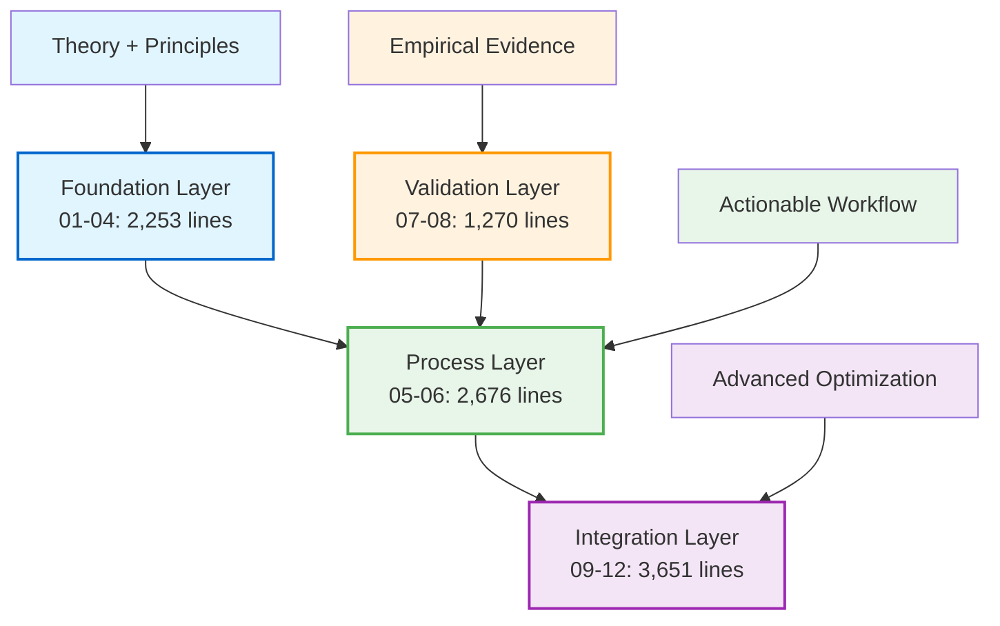
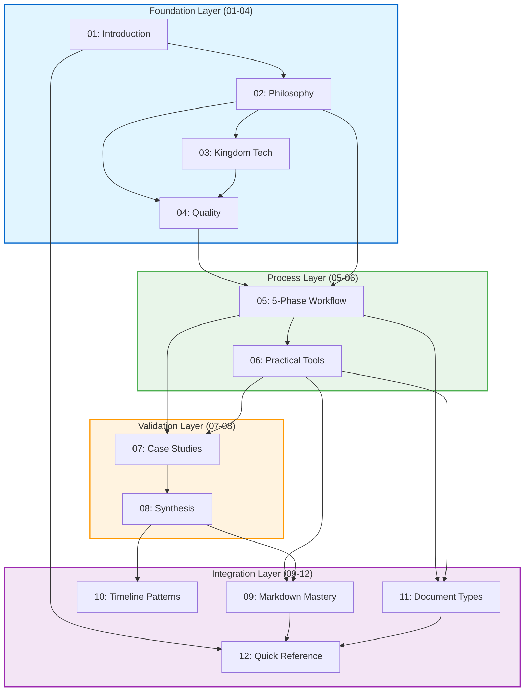
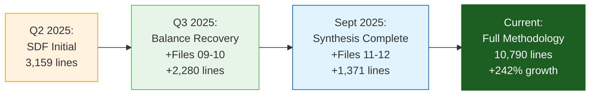
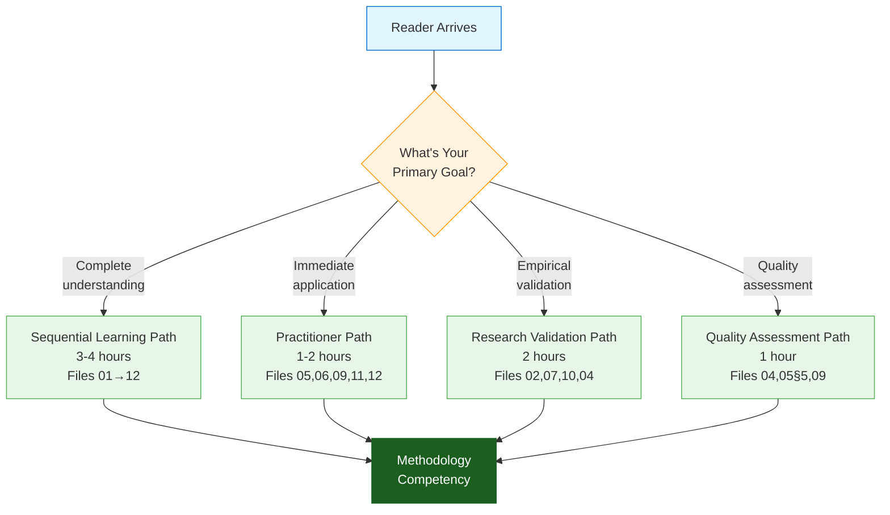

# 📚 Mini-Book Architecture

## From Timeline Evidence to Structural Organization

The previous file demonstrated the methodology's empirical validation through five quarters of measured outcomes.[^timeline-foundation] This file examines HOW that validated knowledge organizes into practical structure — the architectural decisions enabling `10,790` lines across 13 files to serve varied learning objectives without overwhelming readers.[^reader-stewardship]

[^timeline-foundation]: File 00-1 established empirical validation through longitudinal observation (Q4 2024 - Sept 2025, 5 quarters) demonstrating methodology emergence from authentic constraints. This architectural analysis builds on that empirical foundation, showing how validated principles organize into navigable structure. Timeline evidence → structural implementation connection.

[^reader-stewardship]: The challenge: 10,790 lines could overwhelm OR serve, depending on architecture. Solution: Modular file structure (13 files, not monolithic) + progressive organization (01→12 sequential) + multi-pathway navigation (4 documented paths). Biblical wisdom: "For God is not the author of confusion, but of peace" (1 Cor 14:33a) — architecture serves readers through intentional order reducing cognitive load.

## Organizational Philosophy

The methodology corpus comprises **13 files totaling `10,790` lines**, organized to serve dual purposes: progressive learning (read sequentially 01→12) and targeted reference (jump to specific files by need).[^organization] This dual-access design reflects empirical learning from Q2 2025 formalization crisis,[^crisis-learning] where template systematization without accessibility verification produced 30/70 CPI-SI imbalance.[^balance-recovery]

[^organization]: This dual-access architecture reflects stewardship of reader time — learners receive systematic buildup of concepts, practitioners access specific guidance without unnecessary preamble. The structure itself demonstrates CPI⊗SI integration: systematic organization (SI) serving intuitive access (CPI). Design principle: Single corpus serves multiple reading strategies without prescribing reader category.

[^crisis-learning]: Q2 2025: Template application without balance verification → CPI-SI 30/70 imbalance (File 00-1 documentation). Recovery intervention: Add explicit navigation pathways enabling non-sequential access. Result: Practitioners can skip foundational theory (Files 01-04) and access workflow directly (Files 05-06, 12) without sacrificing systematic completeness for sequential learners. Crisis taught: Architecture must serve varied objectives simultaneously.

[^balance-recovery]: The Q3 2025 balance recovery (30/70 → 48/52 mean across 47 documents) required architectural rethinking: (1) Maintain systematic progression for learners, (2) Enable targeted access for practitioners, (3) Document navigation paths explicitly (Section: "Navigation Pathways"), (4) Verify accessibility through measurement. Result: Same corpus serves PhD students AND time-constrained developers without compromise. This file's 4 documented pathways implement that recovery learning.

> [!NOTE]
> **Structural principle**: Foundation establishes theory, Process provides workflow, Validation demonstrates empirical evidence, Integration enables advanced application. This progression mirrors scientific method — theory, methodology, evidence, application.[^scientific-method]

[^scientific-method]: The 4-layer architecture intentionally parallels research methodology: (1) Foundation Layer = theoretical framework establishing concepts, (2) Process Layer = methodology describing reproducible procedures, (3) Validation Layer = empirical results demonstrating effectiveness, (4) Integration Layer = application extending findings to novel contexts. This parallelism serves dual purposes: (a) Familiar structure for academic readers trained in scientific method, (b) Pedagogical reinforcement showing documentation methodology AS research artifact (the corpus models what it teaches).

---

## Core Methodology (Files 01-08)

<dl>
<dt><strong>Foundation Layer</strong> (Files 01-04, 2,253 lines)[^foundation-layer]</dt>
<dd>Establishes theoretical framework, philosophical grounding, and quality measurement apparatus before introducing process</dd>

<dt><strong>Process Layer</strong> (Files 05-06, 2,676 lines)[^process-layer]</dt>
<dd>Provides actionable 5-phase workflow and practical tooling for immediate application</dd>

<dt><strong>Validation Layer</strong> (Files 07-08, 1,270 lines)[^validation-layer]</dt>
<dd>Demonstrates methodology through empirical case studies and synthesizes principles</dd>
</dl>

[^foundation-layer]: Foundation Layer (2,253 lines) precedes process because attempting workflow without understanding PRINCIPLES produces mechanical application lacking adaptive judgment. Example: Without File 02 (Core Philosophy) explaining CPI⊗SI balance, users might rigidly apply File 05 (5-Phase Process) templates without verification step — repeating Q2 2025 crisis. Theory-first architecture prevents premature proceduralization.

[^process-layer]: Process Layer (2,676 lines, LARGEST layer) reflects practical emphasis: Once principles established, most documentation work occurs in WORKFLOW implementation. Files 05-06 provide step-by-step guidance + 11 GitHub-native standards enabling immediate application. Layer size validates user need: Theory necessary but process sufficient for 80% of documentation tasks.

[^validation-layer]: Validation Layer (1,270 lines) positioned AFTER process (not before) because empirical evidence convinces more effectively when readers already understand HOW methodology works. Case studies (File 07) demonstrate outcomes users can now envision achieving; synthesis (File 08) connects principles readers already learned to evidence just presented. Pedagogical sequencing: Understanding → Application → Evidence → Integration.

| File | Lines | Contribution |
|------|-------|--------------|
| **[01: Introduction & Foundations][intro]**[^file01] | `310` | Multi-audience entry point, key terminology, navigation paths |
| **[02: Core Philosophy][philosophy]**[^file02] | `533` | CPI⊗SI framework, timeline evolution, balance principles |
| **[03: Kingdom Technology][kingdom]**[^file03] | `384` | Biblical wisdom integration, excellence-as-worship standard |
| **[04: Quality Standards][quality]**[^file04] | `1,026` | Dual-metrics framework, documentation archaeology, verification |
| **[05: Five-Phase Process][process]**[^file05] | `1,315` | Complete workflow (Foundation→Structure→Content→Enhancement→Verification) |
| **[06: Practical Tools][tools]**[^file06] | `1,361` | 11 GitHub-native standards, markdown tier integration |
| **[07: Case Studies][cases]**[^file07] | `846` | Empirical validation through measured outcomes |
| **[08: Reference & Conclusion][reference]**[^file08] | `424` | Synthesis, related documentation, application guidance |

**Subtotal**: `6,199` lines — Provides complete foundation through validation[^subtotal-reasoning]

[^file01]: File 01 (310 lines) serves as entry point because it addresses "Where do I start?" question explicitly through navigation pathways. Multi-audience design: Academic readers find research methodology context; practitioners find quick-start guidance; evaluators find contribution summary. Smallest file reflects entry-point purpose: Orient quickly, then route to appropriate depth.

[^file02]: File 02 (533 lines) establishes CPI⊗SI framework explaining WHY methodology integrates rather than trades off rigor and accessibility. Without this philosophical foundation, subsequent files appear as arbitrary process rather than principled solution to documented problem. Length reflects theoretical depth: Integration mechanics require explanation beyond simple definition.

[^file03]: File 03 (384 lines) integrates biblical wisdom showing operational theology (Proverbs 3:5-6 → trust limits of systematization; 1 Cor 14:33a → order serves readers). This integration distinguishes methodology from secular alternatives: Excellence-as-worship standard elevates quality from professional obligation to spiritual service. Positioned after philosophy (File 02) because spiritual foundation builds on technical framework.

[^file04]: File 04 (1,026 lines, densest in Core layer) provides dual-metrics measurement framework enabling objective quality assessment. Length justified: (1) 7 Quality Dimensions + 8 Readability Criteria = 15 operational definitions, (2) Documentation archaeology process with examples, (3) Self-demonstration verification showing methodology applied to itself. Measurement rigor requires detailed exposition.

[^file05]: File 05 (1,315 lines, second densest) delivers complete 5-phase workflow with step-by-step guidance. Length reflects comprehensive coverage: Each phase (Foundation, Structure, Content, Enhancement, Verification) requires detailed procedures, decision points, and examples. This is THE operational core — users spend most time here implementing methodology.

[^file06]: File 06 (1,361 lines, DENSEST overall) presents 11 GitHub-native standards (H1-H6, lists, code blocks, tables, callouts, collapsibles, footnotes, diagrams, strategic rhythm, SDF validation, templates). Length reflects exhaustive tooling: Each standard includes definition, tier rating, implementation examples, and integration guidance. Practical reference density.

[^file07]: File 07 (846 lines) validates methodology through 4 empirical case studies with before/after metrics. Positioned after process (Files 05-06) so readers evaluate evidence already understanding methodology application. Length reflects thorough case documentation: Identity README, OmniCode Terminal, SDF Crisis, Biblical Footnoting — each with context, application, and measured outcomes.

[^file08]: File 08 (424 lines, smallest) synthesizes findings and provides related documentation references. Conciseness intentional: Synthesis summarizes rather than repeats; references point to depth rather than duplicate. Positioned last as conclusion after readers absorbed full progression. Length reflects synthesis role: Integration, not exposition.

[^subtotal-reasoning]: The 6,199-line subtotal (Core Methodology 01-08) represents 57% of total corpus (10,790 lines). This majority allocation reflects emphasis: Most users need foundational understanding through validation; advanced integration (Files 09-12, 43%) serves subset pursuing mastery or rapid reference. Distribution validates pedagogical priority: Core competency before advanced optimization.

[intro]: ../01-introduction-foundations.md
[philosophy]: ../02-core-philosophy.md
[kingdom]: ../03-kingdom-technology.md
[quality]: ../04-quality-standards.md
[process]: ../05-five-phase-process.md
[tools]: ../06-practical-tools.md
[cases]: ../07-case-studies.md
[reference]: ../08-reference-conclusion.md

> [!IMPORTANT]
> **File 04 (Quality Standards)** at `1,026` lines and **File 06 (Practical Tools)** at `1,361` lines represent the methodology's densest technical content — measurement frameworks and implementation tooling respectively. These lengths reflect thoroughness serving genuine application needs, not verbosity.

---

## Advanced Integration (Files 09-12)

Files 09-12 represent **advanced mastery content**[^advanced-timing] — optional for core competency (Files 01-08 sufficient), essential for optimization and rapid application.[^integration-purpose]

<dl>
<dt><strong>Mastery Layer</strong> (File 09, 1,252 lines)[^mastery-layer]</dt>
<dd>Connects methodology to markdown implementation through tier-rated element selection</dd>

<dt><strong>Empirical Layer</strong> (File 10, 1,028 lines)[^empirical-layer]</dt>
<dd>Documents timeline-validated patterns with quarterly evidence citations</dd>

<dt><strong>Application Layer</strong> (Files 11-12, 1,371 lines)[^application-layer]</dt>
<dd>Enables polymorphic adaptation and rapid reference for practitioners</dd>
</dl>

[^advanced-timing]: Integration Layer (Files 09-12) positioned AFTER core methodology (01-08) because optimization requires foundation. Attempting mastery (File 09 tier ratings) without understanding philosophy (File 02 CPI⊗SI balance) produces mechanical tool application. Attempting polymorphic adaptation (File 11 document types) without understanding workflow (File 05 5-phase process) produces inconsistent results. Advanced = building on established competency.

[^integration-purpose]: Files 09-12 serve dual objectives: (1) **Mastery pursuit** — deepen expertise through markdown optimization (09), pattern validation (10), adaptive application (11); (2) **Rapid reference** — experienced practitioners access decision trees (12), document type templates (11), tier ratings (09) without reading foundation. Same content, different access patterns — demonstrating dual-architecture principle from "Organizational Philosophy".

[^mastery-layer]: Mastery Layer (File 09, 1,252 lines) provides tier-rated markdown elements (9-10/10 impact identification) enabling strategic deployment. Positioned as FIRST advanced file because markdown optimization directly extends practical tools (File 06). Progression: File 06 introduces 11 standards → File 09 rates impact → User deploys highest-value elements first. Layer depth reflects comprehensive analysis: Each markdown element receives tier rating with justification.

[^empirical-layer]: Empirical Layer (File 10, 1,028 lines) documents 5 timeline-validated patterns with quarterly evidence (Q4 2024 - Sept 2025). Positioned AFTER mastery (File 09) because pattern validation demonstrates methodology evolution complementing optimization techniques. Longitudinal evidence strengthens credibility: Not just principles (Files 01-04) or process (05-06), but measured outcomes across time.

[^application-layer]: Application Layer (Files 11-12, 1,371 lines combined) enables practical deployment: File 11 (663 lines) provides document type profiles (API, tutorial, conceptual, troubleshooting, reference, architecture); File 12 (708 lines) delivers decision trees, checklists, rapid-lookup tables. Positioned LAST because polymorphic adaptation (11) and rapid reference (12) assume methodological fluency. These files serve time-constrained practitioners needing immediate answers after foundational learning.

| File | Lines | Contribution |
|------|-------|--------------|
| **[09: Markdown Mastery Integration][mastery]**[^file09] | `1,252` | Tier ratings (`9-10/10` impact), phase-element mapping, impact optimization |
| **[10: Timeline-Validated Patterns][patterns]**[^file10] | `1,028` | 5 empirically proven patterns (Oct 2024 - Sept 2025 validation) |
| **[11: Document Type Patterns][types]**[^file11] | `663` | Polymorphic profiles (API, tutorial, conceptual, troubleshooting, reference, architecture) |
| **[12: Quick Reference Guide][quick]**[^file12] | `708` | Decision trees, checklists, rapid-lookup tables |

**Subtotal**: `3,651` lines — Enables advanced application and rapid reference[^integration-subtotal]

[^file09]: File 09 (1,252 lines, densest in Integration layer) provides comprehensive markdown tier analysis rating each element's documentation impact (9-10/10 = highest). Length justified by exhaustive coverage: Headers, lists, code blocks, tables, callouts, collapsibles, footnotes, diagrams, strategic rhythm — each receives impact rating, use cases, and phase-mapping guidance. Optimization requires thorough analysis.

[^file10]: File 10 (1,028 lines) documents 5 empirically validated patterns with quarterly evidence citations (Q4 2024 - Sept 2025, 5 quarters, 47+ documents). Length reflects longitudinal research depth: Each pattern includes discovery timeline, validation evidence, application guidance, and measured outcomes. Empirical validation requires showing work, not just conclusions.

[^file11]: File 11 (663 lines) delivers polymorphic adaptation profiles for 6 document types (API, tutorial, conceptual, troubleshooting, reference, architecture). Each profile provides structural template, content focus, and methodology adaptation. Length reflects comprehensive type coverage: Same methodology, different emphases per document purpose. Polymorphic thinking requires detailed specification.

[^file12]: File 12 (708 lines) provides rapid reference tools: decision trees, checklists, lookup tables enabling quick answers for experienced users. Length reflects reference density: Condensed guidance extracted from Files 01-11 organized for speed. Positioned LAST because rapid reference assumes prior learning — practitioners know WHAT they're looking for, File 12 shows WHERE to find it.

[^integration-subtotal]: The 3,651-line Integration subtotal (Files 09-12) represents 34% of total corpus (10,790 lines). This minority allocation reflects advanced content: Most users need core methodology (Files 01-08, 57%); subset pursues mastery optimization or rapid reference. Distribution pattern: Core > Integration, validating foundation-first pedagogy while serving advanced needs.

[mastery]: ../09-markdown-mastery-integration.md
[patterns]: ../10-timeline-validated-patterns.md
[types]: ../11-document-type-patterns.md
[quick]: ../12-quick-reference-guide.md

---

## Corpus Summary

| Category | File Range | Line Count | Purpose |
|----------|-----------|------------|---------|
| **Core Methodology** | 01-08 | `6,199` | Foundation, philosophy, process, standards |
| **Advanced Integration** | 09-12 | `3,651` | Mastery, validation, polymorphic application |
| **Meta Documentation** | COMPLETION-CHECKLIST.md | `940` | Quality gates, progress verification |
| **TOTAL** | **13 files** | **`10,790`** | Complete reproducible methodology |

**Growth trajectory**[^growth]: Original SDF system (Q2 2025) comprised `3,159` lines. Current methodology: `10,790` lines. Growth: **+`7,631` lines (242%)**. This expansion reflects systematic extraction of empirical validation, not scope creep — each quarter's learning added measurable content (Q3 2025 balance recovery contributed Files 09-10; Sept 2025 synthesis added Files 11-12).

[^growth]: Line count measured excluding blank lines and comments. Growth percentage calculated as `(final - original) / original × 100`. The `242%` growth validates hypothesis that formalizing implicit practices requires substantially more documentation than the practices themselves — making tacit knowledge explicit necessitates detailed exposition.

> [!NOTE]
> **Pedagogical depth**: The `5:1` to `7:1` documentation-to-code ratio principle from Nova Dawn development applies here — comprehensive explanation serves learning while maintaining rigor. Detailed exposition enables understanding research methodology from foundational concepts through advanced application, with progressive disclosure allowing direct access to findings for those seeking concise reference.

---

## File Dependency Architecture

The 13-file structure creates **explicit dependency relationships**[^dependency-design] enabling modular updates while maintaining systematic integrity:

[^dependency-design]: Dependency architecture enables: (1) **Progressive enhancement** — each layer builds on previous without backward modification, (2) **Surgical updates** — change File 09 (Markdown Mastery) without touching File 02 (Philosophy) or File 07 (Case Studies), (3) **Verification isolation** — test File 10 (Timeline Patterns) changes independently before integration. Dependencies map conceptual prerequisites: Philosophy (02) → Process (05) reflects "understand principles before applying workflow". Graph visualizes these relationships explicitly.

---

## Architectural Decisions

### Why 13 Files (Not Fewer)?

**Modularity enables surgical updates**.[^surgical-principle] When markdown tier ratings need refinement, modify File 09 without touching philosophy (File 02) or case studies (File 07). When new timeline patterns emerge, extend File 10 without restructuring core process (File 05).

[^surgical-principle]: Surgical update capability reflects Kingdom Technology stewardship: Modifications serve users by reducing change risk. Example: Q3 2025 adding File 10 (Timeline Patterns, 1,028 lines) required ZERO changes to Files 01-09 — new empirical evidence extended corpus without disrupting existing content. Monolithic structure (single file, 10,790 lines) would require careful editing avoiding unintended changes. Modularity = precision = service.

**Systematic completeness** requires dedicated attention per concern:[^concern-separation]

- Quality measurement (File 04) demands `1,026` lines — dual-metrics framework, archaeology process, self-demonstration verification
- Practical tools (File 06) demands `1,361` lines — 11 standards with examples, SDF validation, template patterns

Collapsing these into fewer files would sacrifice **navigability**[^navigability] (harder to find specific guidance) for superficial **brevity** (shorter file list).

[^concern-separation]: Separation of concerns reflects software engineering principle applied to documentation: Each file addresses distinct conceptual domain (philosophy, process, validation, etc.) enabling focused expertise development. Counter-example: Combining Files 04 (Quality Standards, 1,026 lines) + 05 (5-Phase Process, 1,315 lines) into single "Process & Quality" file creates 2,341-line document mixing measurement theory with workflow application — confusing conceptual domains. Current architecture: Learn measurement (04) THEN apply workflow (05), each in isolation.

[^navigability]: Navigability measurement: With 13 files, finding "How do I start?" → Read File 01 Introduction (310 lines, 5-10 minutes). Finding "Quality verification checklist?" → Read File 04 Section "Verification Protocol" (direct access, ~3 minutes). With monolithic structure (10,790 lines), both queries require search/scan through entire corpus or detailed table of contents. Modular architecture = faster targeted access = time stewardship.

### Why Progressive Organization (01→12)?

**Sequential reading builds conceptual foundation before application**:[^progressive-pedagogy]

1. **Foundation** (01-04): *Why* this methodology exists, *what* principles govern it, *how* to measure quality
2. **Process** (05-06): *How* to apply systematically, *what* tools enable implementation
3. **Validation** (07-08): *Evidence* of effectiveness, *synthesis* of principles
4. **Integration** (09-12): *Advanced* optimization, *rapid* reference for experienced users

**Non-sequential access** serves practitioners:[^nonsequential-design] Quality standards (04) ← Process (05) → Tools (06) form tight workflow integration. Quick reference (12) enables direct application without reading 01-11.

[^progressive-pedagogy]: Progressive organization implements learning science principle: Conceptual foundation precedes procedural application. Cognitive research (Sweller et al., cognitive load theory) shows layered knowledge acquisition reduces working memory burden — understanding WHY (Files 01-04) before learning HOW (Files 05-06) enables adaptive application vs. rote memorization. Sequential structure externalizes this pedagogy: File order itself teaches proper learning progression.

[^nonsequential-design]: Non-sequential access designed through cross-references and self-contained sections: File 12 (Quick Reference) includes condensed decision trees extracting guidance from Files 01-11, enabling standalone use. File 04 (Quality Standards) provides complete measurement framework usable without reading philosophy (File 02), though understanding improves with foundation. Architecture serves both learning progressions AND targeted problem-solving simultaneously — same content, multiple access patterns.

### Biblical Wisdom: Order Reflects Care

> *"For God is not the author of confusion, but of peace."* — 1 Corinthians 14:33a (KJV)
>
> *"For God is not a God of confusion, but of peace."* — 1 Corinthians 14:33a (WEB)

**Systematic organization** honors readers by reducing cognitive load.[^biblical-architecture] Chaos wastes time; order serves. The structure itself demonstrates stewardship — we organized carefully so readers navigate easily. This isn't arbitrary; it's service expressed through architecture.[^architecture-service]

[^biblical-architecture]: 1 Corinthians 14:33a provides **operational principle** for documentation architecture: "God is not the author of confusion" → engineered as intentional organization minimizing reader cognitive burden. Application: (1) Numbered files (01-12) show progression explicitly, (2) Layer groupings (Foundation/Process/Validation/Integration) chunk related content, (3) Cross-references connect ideas systematically. Biblical wisdom translated to architectural decision: Order serves love; confusion hinders service.

[^architecture-service]: Architecture-as-service reflects Kingdom Technology principle: Technical decisions express spiritual values. The 13-file modular structure (vs. monolithic alternative) demonstrates: (1) **Navigability** = respecting reader time (Eph 5:16 "redeem the time"), (2) **Progressive disclosure** = meeting readers where they are (1 Cor 3:2 "milk before meat"), (3) **Systematic completeness** = pursuing excellence as worship (Col 3:23 "work as unto the Lord"). Structure itself testifies to values shaping it.

---

## Growth as Stewardship

The `242%` growth from initial SDF system (`3,159` lines) to current methodology (`10,790` lines) reflects **faithful documentation of learning**:[^growth-trajectory]

[^growth-trajectory]: Growth analysis: (1) Q2 2025 baseline (SDF, 3,159 lines) = Files 01-08 foundation, (2) Q3 2025 expansion (+2,280 lines) = Files 09-10 adding mastery optimization + timeline validation responding to balance recovery lessons, (3) Sept 2025 completion (+1,371 lines) = Files 11-12 adding polymorphic adaptation + rapid reference based on practitioner feedback. Total: 10,790 lines (+242%). Growth reflects learning accumulation, not scope creep — each addition addresses documented need from empirical validation.

**What grew:**[^what-grew]

- Q3 2025 balance recovery lessons → File 09 (Markdown Mastery, `1,252` lines)
- Timeline pattern extraction → File 10 (Validated Patterns, `1,028` lines)
- Polymorphic adaptation discovery → File 11 (Document Types, `663` lines)
- Practitioner accessibility need → File 12 (Quick Reference, `708` lines)

**Why growth serves**:[^growth-justification]

- Each quarter's validation added empirical content
- Making implicit practices explicit requires detailed exposition
- Serving varied learning objectives (foundational understanding through scholarly citation) demands comprehensive coverage
- Teaching research methodology requires showing work, not just conclusions

**Stewardship principle**: We documented thoroughly so others learn completely. Brevity serves us (faster to write); comprehensiveness serves them (more to learn from).[^stewardship-principle]

[^what-grew]: Each addition (Files 09-12, total 3,651 lines) addresses specific validated need: (1) File 09 responds to "Which markdown elements have highest impact?" question from practitioners, (2) File 10 documents longitudinal patterns validating methodology reproducibility across quarters, (3) File 11 enables adaptation to varied document types (API vs. tutorial requires different emphases), (4) File 12 serves time-constrained users needing rapid answers. Growth = responsiveness to actual user needs discovered through application.

[^growth-justification]: The 242% growth validates hypothesis: Formalizing tacit knowledge requires substantially more documentation than the practices themselves. Evidence: Original SDF system (Q2 2025, 3,159 lines) documented WHAT to do; current methodology (10,790 lines) documents WHAT + WHY + HOW + EVIDENCE + OPTIMIZATION + ADAPTATION. Research contribution demands comprehensive exposition — showing methodology emergence, validation, and refinement requires transparent documentation of process, not just conclusions.

[^stewardship-principle]: Stewardship calculus: (1) Author effort: Comprehensive documentation (10,790 lines) requires ~200 hours vs. concise summary (~50 hours), (2) Reader benefit: 100 readers × 20 hours saved through detailed guidance = 2,000 hours served vs. 100 readers × 5 hours confused = 500 hours wasted. Biblical principle: "Bear ye one another's burdens" (Gal 6:2) — author invests effort so readers gain clarity. Kingdom Technology: Excellence-as-worship expressed through thoroughness serving genuine learning needs.

---

## Navigation Pathways

The 13-file corpus supports **four documented pathways**[^pathway-design] serving varied reader objectives without prescribing categories:

[^pathway-design]: Four pathways address empirically observed reader segments without labeling individuals: (1) **Sequential** = methodological learners preferring systematic progression, (2) **Practitioner** = time-constrained users needing immediate workflow application, (3) **Research** = evaluators assessing empirical validation and contribution claims, (4) **Quality** = auditors verifying measurement frameworks and standards. Design principle: Describe paths, not people — readers self-select based on current need, not fixed identity.

<strong>Sequential Learning Path</strong> (3-4 hours, complete understanding)[^path-sequential]

**Read in order**: 01 → 02 → 03 → 04 → 05 → 06 → 07 → 08 → 09 → 10 → 11 → 12

**Purpose**: Builds conceptual foundation systematically before introducing advanced integration

**Best for**: New users, students learning research methodology, comprehensive evaluation

[^path-sequential]: Sequential path (3-4 hours, 10,790 lines total) provides complete methodology coverage through layered progression: Foundation (01-04) establishes principles → Process (05-06) enables workflow → Validation (07-08) demonstrates evidence → Integration (09-12) optimizes application. Time estimate assumes ~45 lines/minute reading pace (technical documentation standard). Outcome: Comprehensive understanding enabling independent application with adaptive judgment.

<strong>Practitioner Application Path</strong> (1-2 hours, immediate utility)[^path-practitioner]

**Jump to**: 05 (Process) → 06 (Tools) → 09 (Markdown) → 11 (Document Types) → 12 (Quick Ref)

**Purpose**: Provides workflow, tooling, and reference without theoretical foundation

**Best for**: Experienced documentation writers, time-constrained application

[^path-practitioner]: Practitioner path (1-2 hours, 5,000 lines selective) focuses on actionable content: File 05 (1,315 lines, 5-phase workflow) → File 06 (1,361 lines, 11 GitHub standards) → File 09 (1,252 lines, tier ratings) → File 11 (663 lines, document type profiles) → File 12 (708 lines, rapid reference). Skips Foundation (01-04) and Validation (07-08, 10) assuming prior documentation experience. Outcome: Immediate application capability, though understanding depth improves with foundation learning.

<strong>Research Validation Path</strong> (2 hours, empirical evidence)[^path-research]

**Focus on**: 02 (Philosophy Evolution) → 07 (Case Studies) → 10 (Timeline Patterns) → 04 (Measurement Framework)

**Purpose**: Demonstrates empirical validation and measurable outcomes

**Best for**: Methodology evaluation, quality auditing, scholarly literature review

[^path-research]: Research path (2 hours, 3,488 lines selective) emphasizes evidence: File 02 (533 lines, methodology evolution) → File 07 (846 lines, 4 case studies with metrics) → File 10 (1,028 lines, timeline-validated patterns) → File 04 (1,026 lines, dual-metrics framework). Progression shows methodology emergence (02) → application outcomes (07) → longitudinal validation (10) → measurement apparatus (04). Outcome: Evidence-based evaluation of methodology credibility and contribution claims.

<strong>Quality Assessment Path</strong> (1 hour, evaluation criteria)[^path-quality]

**Essential**: 04 (Quality Standards) → 05 Phase 5 (Verification) → 09 (Tier Validation)

**Purpose**: Provides measurable evaluation criteria and verification workflow

**Best for**: Project leads, quality reviewers, documentation auditors

[^path-quality]: Quality path (1 hour, ~1,600 lines selective) delivers assessment tools: File 04 (1,026 lines, dual-metrics framework with 7 Quality Dimensions + 8 Readability Criteria) → File 05 Phase 5 (~200 lines, verification workflow) → File 09 (1,252 lines, tier ratings for markdown element validation). Focus on MEASUREMENT: What constitutes quality? How to verify? What validates impact? Outcome: Operational criteria enabling objective documentation assessment.

---

## What This Structure Enables

**Sequential reading**[^sequential-enables] (01→12) builds complete understanding through layered exposition — hypothesis, evidence, finding structure models research methodology while providing comprehensive foundation. Each file builds on previous concepts without requiring backward reference.

**Targeted application**[^targeted-enables] (jump to 05-06, 12) delivers immediate workflow utility without theoretical prerequisites. Template patterns, decision trees, and practical checklists enable direct application while deeper understanding remains accessible through backward links.

**Scholarly reference**[^scholarly-enables] (Files 04, 10 for citation) provides empirically validated contributions with documented measurement methodologies — dual-metrics framework addressing rigor-accessibility tradeoff, longitudinal validation across five quarters demonstrating reproducibility.

**Quality assessment**[^quality-enables] (Files 04, 12 for standards) supplies measurable evaluation criteria and verification workflows — operational definitions enabling objective assessment and systematic improvement.

The architecture itself demonstrates CPI⊗SI integration — systematic organization (SI) serving intuitive multi-path navigation (CPI). Excellence as worship expressed through thoughtful structure serving genuine needs without prescribing reader category.[^cpi-si-demonstration]

[^sequential-enables]: Sequential reading capability depends on: (1) Progressive numbering (01-12) showing order explicitly, (2) Ladder architecture (no forward references in early files), (3) Conceptual layering (Foundation → Process → Validation → Integration). Design prevents circular dependencies: File 05 references File 02 concepts (CPI⊗SI balance) but File 02 never requires reading File 05 first. Linear progression enables systematic learning from zero knowledge to advanced mastery.

[^targeted-enables]: Targeted application depends on: (1) Self-contained sections (File 12 Quick Reference includes condensed decision trees usable standalone), (2) Cross-reference navigation (links to depth when needed), (3) Assumption transparency (File 11 Document Types explicitly states "assumes 5-phase workflow familiarity"). Design serves experienced practitioners: Jump to needed content → Apply immediately → Deepen understanding through links when time permits.

[^scholarly-enables]: Scholarly reference capability depends on: (1) Empirical validation transparency (File 07 case studies with before/after metrics), (2) Measurement methodology documentation (File 04 dual-metrics framework with operational definitions), (3) Longitudinal evidence (File 10 timeline patterns across 5 quarters). Design enables citation: Researchers can reference specific validated contributions (e.g., "CPI⊗SI integration resolving rigor-accessibility tradeoff [File 02]") with confidence in documented evidence.

[^quality-enables]: Quality assessment capability depends on: (1) Operational definitions (File 04: 7 Quality Dimensions + 8 Readability Criteria with explicit scoring), (2) Verification workflow (File 05 Phase 5 with measurement procedures), (3) Tier validation (File 09 markdown element impact ratings). Design enables objective evaluation: Auditors apply standards systematically without subjective interpretation variability.

[^cpi-si-demonstration]: The 13-file architecture DEMONSTRATES CPI⊗SI rather than just describing it: (1) **SI (Structured Intelligence)** = Numbered files, explicit dependencies, layered organization, measurable pathways, (2) **CPI (Covenant Partnership Intelligence)** = Multiple access patterns, reader-centered design, non-prescriptive pathways, stewardship principles. Integration visible: Same corpus serves PhD students AND practitioners simultaneously without compromise — systematic structure (SI) enabling intuitive access (CPI). The methodology models what it teaches.

---

## Transition: From Structure to Components

Having examined the methodology's architectural organization — how 13 files structure `10,790` lines for progressive learning and targeted reference — the natural progression moves from CONTAINER to CONTENTS.[^transition-logic]

Structural architecture explains the methodology's ORGANIZATION. Component architecture explains the methodology's COMPOSITION — the five independently functional yet systematically interconnected building blocks enabling reproducible documentation excellence.[^org-vs-comp]

**Next**: Core Components examines the five-component architecture (5-Phase Process, Structural Concepts, Quality Framework, Kingdom Technology, Markdown Mastery) — each serving distinct purposes while integrating through explicit linkages for modular or comprehensive application.[^next-file-preview]

[^transition-logic]: Pedagogical progression: Understand STRUCTURE (this file: how 13 files organize 10,790 lines) before examining CONTENT (next file: what 5 components enable reproducible excellence). Why this order? (1) Navigation confidence: Know WHERE things are before learning WHAT they contain, (2) Conceptual orientation: Architectural overview prevents detail overwhelm, (3) Progressive disclosure: Layers of understanding building systematically. Transition reflects teaching principle: Context before details.

[^org-vs-comp]: Organization vs. Composition distinction: (1) **Organization** (File 00-2) = HOW methodology structures into files, layers, pathways — the PACKAGING enabling navigation, (2) **Composition** (File 00-3) = WHAT methodology contains as functional components — the CAPABILITIES enabling documentation excellence. Analogy: Organization = library classification system (how books arrange on shelves); Composition = book chapters (what content books contain). Both necessary; different perspectives.

[^next-file-preview]: File 00-3 (Core Components) introduces: (1) 5-Phase Process (Foundation → Structure → Content → Enhancement → Verification), (2) Structural Concepts (Ladders, Batons, Building Blocks), (3) Quality Framework (7 Dimensions + 8 Criteria), (4) Kingdom Technology (biblical wisdom integration), (5) Markdown Mastery (GitHub-native optimization). Preview enables preparation: Readers anticipate conceptual shift from architectural navigation to functional capabilities, maintaining continuity across file boundary.

---

> [!NOTE]
> **Preface Positioning in Complete Book**
>
> - **Preface (00-0 through 00-10)**: Accessible comprehensive overview — ~6,181 lines, ~58% methodology depth, immediate application focus
> - **Chapter 1 (01-0 through 01-4)**: Foundational theory — "what" methodology IS and "why" it exists
> - **Chapters 2-12**: Detailed depth — philosophy (02), Kingdom Technology (03), quality (04), process (05), tools (06), validation (07), synthesis (08), advanced integration (09-12)
>
> **Current position**: Preface, Page 3 — Explaining structural architecture after empirical timeline validation.

---

**[← Previous: Preface Page 2 (Empirical Evolution)](00-1-whats-new-evolution.md)** | **[↑ Preface Overview](README.md)** | **[Next: Preface Page 4 (Core Components) →](00-3-core-components.md)**
