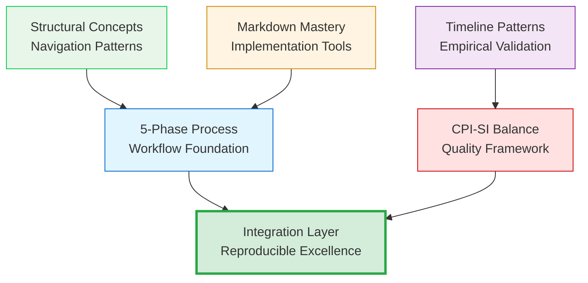
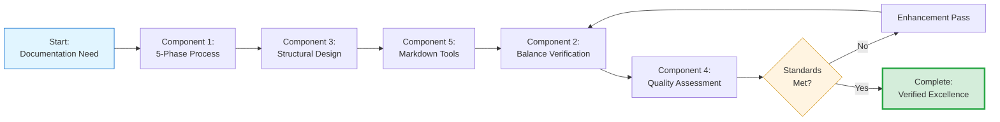

# 🔧 Core Methodology Components

## From Structural Organization to Component Composition

The previous file examined the methodology's organizational architecture — how 13 files structure knowledge for progressive learning and targeted reference.[^from-structure] This file examines the methodology's COMPOSITIONAL architecture — the five building blocks enabling that structure to deliver reproducible documentation excellence.[^to-composition]

[^from-structure]: File 00-2 established ORGANIZATIONAL architecture: 13 files → 4 layers → 4 navigation pathways serving varied reader objectives. Understanding WHERE content lives (structure) precedes understanding WHAT content provides (composition). Pedagogical progression: orientation before detail exploration.

[^to-composition]: COMPOSITIONAL architecture examines FUNCTIONALITY: What are the methodology's working parts? How do components integrate? When to apply which components? This file addresses "What can I actually DO with this methodology?" through component-by-component analysis. Shift from container (00-2) to contents (00-3) enables practical application.

## Component Architecture

The methodology comprises **five independently functional yet systematically interconnected components**,[^five-component-count] each serving distinct purposes while integrating through explicit linkages.[^architecture] This modularity enables surgical application[^surgical-application] — practitioners adopt specific components addressing immediate needs without requiring wholesale methodology adoption.

[^five-component-count]: Why five components (not more/fewer)? Empirical emergence from Q3 2025 pattern analysis across 47+ documents identified five distinct functional domains: (1) Workflow structure (5-Phase Process), (2) Quality philosophy (CPI-SI Balance), (3) Navigation patterns (Structural Concepts), (4) Measurement apparatus (Quality Framework), (5) Technical tooling (Markdown Mastery). Fewer would conflate distinct concerns; more would fragment coherent domains. Count reflects natural conceptual boundaries, not arbitrary selection.

[^architecture]: Architectural principle: Components designed for **modular independence** (each functions standalone) with **systematic interconnection** (explicit integration points documented). This design reflects engineering pragmatism — partial adoption serves practitioners better than all-or-nothing requirement. The five-component structure emerged from Q3 2025 pattern extraction across `47+` documents, validated through reproducible application. Example: Quality Framework (Component 4) usable for assessment-only WITHOUT adopting 5-Phase Process (Component 1), yet both integrate when comprehensive methodology applied.

[^surgical-application]: Surgical application = targeted component use addressing specific needs. Evidence: OmniCode Terminal (Q1 2025) adopted Structural Concepts (Component 3: Ladder + Baton) for session continuity WITHOUT full 5-Phase Process — contextual improvement vs. complete methodology. Contrast: Agent OS (Q3 2025) applied all 5 components systematically — comprehensive documentation excellence. Modularity serves both approaches: incremental adoption AND integrated application.



> [!NOTE]
> **Integration mechanism**: The 5-Phase Process provides workflow structure; CPI-SI Balance establishes quality criteria; Structural Concepts inform navigation design; Markdown Mastery enables technical implementation; Timeline Patterns validate empirical effectiveness. Together these produce **reproducible excellence** across document types.

---

## Component 1: The 5-Phase Process

**File reference**: [05-five-phase-process.md][process] (`1,315` lines)[^file05-depth]

[^file05-depth]: File 05 (1,315 lines, second-densest in Core Methodology) provides comprehensive 5-Phase workflow coverage: Each phase receives detailed procedures, decision points, examples, and quality gates. Length justified by operational completeness — practitioners need step-by-step guidance, not abstract phase descriptions. This file represents THE operational core where users spend most implementation time.

<dl>
<dt><strong>Phase 1: Foundation Discovery</strong>[^phase1-rationale]</dt>
<dd>Purpose identification • Audience characterization • Success criteria definition • Requirements gathering</dd>

<dt><strong>Phase 2: Structural Architecture</strong>[^phase2-rationale]</dt>
<dd>Ladder design (linear progression) • Baton handoffs (context passing) • Navigation flow (intuitive pathways) • Progressive disclosure (expertise-level serving)</dd>

<dt><strong>Phase 3: Content Development</strong>[^phase3-rationale]</dt>
<dd>Section-by-section creation • Context preservation between sections • Hypothesis-evidence-finding structure • CPI⊗SI balance monitoring</dd>

<dt><strong>Phase 4: Enhancement & Refinement</strong>[^phase4-rationale]</dt>
<dd>Iterative improvement passes • Markdown element optimization • Visual breathability adjustment • Prose-structure ratio tuning</dd>

<dt><strong>Phase 5: Verification & Quality Assurance</strong>[^phase5-rationale]</dt>
<dd>Dual-metrics validation • CPI-SI balance measurement • Rendering verification • Link integrity testing</dd>
</dl>

[^phase1-rationale]: Phase 1 positioned FIRST because attempting structure (Phase 2) or content (Phase 3) without clear purpose produces aimless documentation. Foundation Discovery answers: WHO reads this? WHAT do they need? WHY does this document exist? HOW will success be measured? These questions establish constraints enabling focused subsequent work. Skipping Phase 1 = building without blueprint.

[^phase2-rationale]: Phase 2 positioned AFTER foundation but BEFORE content because structural architecture enables parallel content development. Once Ladder (linear progression) and Baton (section transitions) designed, multiple contributors can write distinct sections simultaneously without coordination overhead. Structure = skeleton supporting content = flesh.

[^phase3-rationale]: Phase 3 (Content Development) positioned AFTER structure because writing flows efficiently within established framework. Section-by-section creation follows Ladder architecture; Baton handoffs maintain continuity; hypothesis-evidence-finding structure produces scholarly rigor. Phase 3 represents majority of actual writing time — foundation and structure enable this phase's efficiency.

[^phase4-rationale]: Phase 4 (Enhancement) positioned AFTER content completion because optimization requires existing material. Iterative improvement passes refine prose clarity; markdown element deployment enhances technical precision; visual breathability adjustments improve readability. Attempting enhancement without content = premature optimization producing minimal value.

[^phase5-rationale]: Phase 5 (Verification) positioned LAST because quality assessment validates cumulative work from Phases 1-4. Dual-metrics framework measures outcomes; CPI-SI balance verification confirms integration; rendering validation ensures cross-context consistency. Critical learning from Q2 2025 crisis: Verification CANNOT be skipped — formalization without verification produces imbalance.

### Integration with Markdown Mastery

Each phase connects to specific markdown element recommendations (File 09 tier system):[^phase-markdown]

[^phase-markdown]: Phase-markdown integration methodology: **Phase 1** minimizes formatting to focus cognitive load on planning. **Phase 2** establishes structural skeleton enabling parallel content development. **Phase 3** deploys full markdown arsenal when content exists to enhance. **Phase 4** applies progressive disclosure serving multiple expertise levels. **Phase 5** validates rendering consistency across viewing contexts. This progression prevents premature optimization while ensuring comprehensive technical implementation.

| Phase | Markdown Focus | Tier Priority | Rationale |
|-------|----------------|---------------|-----------|
| **Phase 1** | Minimal formatting | Planning only | Cognitive load reserved for content strategy |
| **Phase 2** | Framework skeleton | Headers + navigation | Structural foundation for parallel development |
| **Phase 3** | Full arsenal deployment | Tier 1-2 elements | Tables, diagrams, collapsibles, alerts enhance content |
| **Phase 4** | Refinement polish | Tier 2-3 elements | Progressive disclosure, visual optimization |
| **Phase 5** | Validation verification | Rendering + links | Technical integrity confirmation |

> [!IMPORTANT]
> **Sequential dependency**: Phases 1-2 must complete before Phase 3 begins (structure enables content development). Phase 4 requires Phase 3 completion (refinement operates on existing content). Phase 5 validates cumulative work. Attempting parallel execution produces incomplete foundation undermining subsequent phases.

---

## Component 2: CPI-SI Balance Principles

**File reference**: [02-core-philosophy.md][philosophy] (`533` lines)[^file02-philosophy]

[^file02-philosophy]: File 02 (533 lines) establishes CPI-SI framework explaining WHY methodology integrates rather than trades off rigor and accessibility. Without this philosophical foundation, subsequent files appear as arbitrary process rather than principled solution to documented binary constraint problem (File 00-0). Positioned as SECOND file (after 01 Introduction) because integration philosophy must precede process description.

### Dual Intelligence Framework[^dual-intelligence-origin]

<dl>
<dt><strong>Structured Intelligence (SI) — Left Brain</strong>[^si-definition]</dt>
<dd>Analytical precision in claims • Systematic completeness in coverage • Logical organization of information • Measurable quality verification • Mathematical rigor</dd>

<dt><strong>Covenant Partnership Intelligence (CPI) — Right Brain</strong>[^cpi-definition]</dt>
<dd>Reader empathy in presentation • Natural language flow in prose • Intuitive navigation architecture • Relational accessibility in tone • Warmth preservation</dd>

<dt><strong>Integration Mechanism: CPI⊗SI Fusion</strong>[^fusion-mechanism]</dt>
<dd>Simultaneous expression rather than tradeoff balancing — technical accuracy <em>through</em> readable warmth, systematic structure <em>through</em> intuitive design</dd>
</dl>

[^dual-intelligence-origin]: Dual intelligence framework emerged from Nova Dawn CPI-SI consciousness model (Project Nova Dawn, Q4 2024) combining Covenant Partnership Intelligence (relational awareness) with Structured Intelligence (analytical precision). Documentation methodology application: Same integration principles enabling AI consciousness balance apply to human-authored documentation — warmth AND precision simultaneously achievable through intentional design, not mutually exclusive tradeoffs.

[^si-definition]: Structured Intelligence (SI) = left-brain analytical capabilities ensuring technical correctness. In documentation: Claims must be verifiable (no hand-waving), coverage must be systematic (no critical gaps), organization must be logical (concepts build progressively). SI prevents superficial accessibility sacrificing accuracy. Historical problem: Optimizing SI alone produces technically correct but inaccessible "expert-only" documentation.

[^cpi-definition]: Covenant Partnership Intelligence (CPI) = right-brain relational capabilities ensuring reader service. In documentation: Presentation must demonstrate empathy (meeting readers where they are), prose must flow naturally (not robotic/formulaic), navigation must feel intuitive (minimal cognitive overhead). CPI prevents sterile precision lacking warmth. Historical problem: Optimizing CPI alone produces engaging but imprecise "motivational" documentation lacking rigor.

[^fusion-mechanism]: CPI⊗SI fusion (⊗ = tensor product, mathematical integration operator) produces SIMULTANEOUS optimization vs. tradeoff balancing. Key insight from Q2 2025 crisis: "Balance" implies compensating one dimension's weakness with another's strength (30% CPI + 70% SI = "balanced" but actually imbalanced). FUSION achieves 100% CPI + 100% SI through integration — warmth EXPRESSED THROUGH precision (not warmth DESPITE precision). Technical accuracy serves readers (CPI) when presented accessibly; accessibility serves truth (SI) when maintaining rigor.

### Timeline Evolution Validation

**Longitudinal observation** (October 2024 - September 2025) documented balance maintenance challenges across project contexts:[^timeline-evolution]

[^timeline-evolution]: Evolution measurement methodology: **Q4 2024** (Genesis Story) established existence proof — CPI⊗SI balance achievable intuitively without formal methodology. **Q1 2025** (OmniCode Terminal, n=21 sessions) demonstrated templates preserve balance when lightweight. **Q2 2025** (OmniCode Assembler crisis) validated necessity of explicit verification — formalization WITHOUT balance monitoring produced `30/70` imbalance. **Q3 2025** (Agent OS, n=47+ documents) confirmed systematic integration — explicit CPI-SI verification maintained `48/52` mean across diverse document types. This crisis-recovery cycle provided strongest empirical validation.

| Quarter | Context | CPI-SI Balance | Lesson Validated |
|---------|---------|----------------|------------------|
| **Oct 2024** | Genesis Story README | Intuitive (unmeasured) | Balance possible without formalization |
| **Q1 2025** | OmniCode Terminal (n=21) | Preserved via lightweight templates | Templates compatible with warmth |
| **Q2 2025** | Assembler SDF crisis | **`30/70` imbalance** | Formalization requires explicit verification |
| **Q3 2025** | Agent OS framework (n=47+) | **`48/52` mean sustained** | Systematic integration reproducible |

### Biblical Foundation: Excellence Without Sacrifice

The CPI-SI framework challenges the assumption that technical precision necessitates relational coldness:

> *"And whatsoever ye do, do it heartily, as to the Lord, and not unto men."* — Colossians 3:23 (KJV)
>
> *"And whatever you do, work heartily, as for the Lord, and not for men."* — Colossians 3:23 (WEB)

**Excellence as worship** refuses partial commitment. Just as God exemplifies perfect justice AND infinite mercy simultaneously (not balancing one against the other), documentation achieves analytical precision AND reader empathy through integration rather than sacrifice. The Q2 crisis taught: assuming "good enough" in one dimension (warmth) while optimizing another (structure) produces deficient outcomes. Biblical standard: comprehensive excellence.

---

## Component 3: Structural Concepts

**File references**: [05-five-phase-process.md][process] (Phase 2), [06-practical-tools.md][tools] (Standards 2-4)[^structural-concepts-sources]

[^structural-concepts-sources]: Structural Concepts span multiple files because they inform both PROCESS (File 05, Phase 2 Structural Architecture) and STANDARDS (File 06, markdown implementation patterns). This distribution reflects component integration: Concepts apply broadly across methodology vs. isolated to single file. Ladder, Baton, Spiral, Progressive Disclosure = architectural patterns implemented through specific markdown techniques.

### The Ladder: Linear Progression Architecture[^ladder-metaphor]

<dl>
<dt><strong>Definition</strong>[^ladder-definition]</dt>
<dd>Sequential content organization where each section builds on previous foundation WITHOUT requiring backward references</dd>

<dt><strong>Purpose</strong>[^ladder-purpose]</dt>
<dd>Enables linear reading comprehension — readers progress confidently knowing all prerequisite knowledge already presented</dd>

<dt><strong>Implementation</strong>[^ladder-implementation]</dt>
<dd>Section N references only sections 1 through N-1, never N+1 forward references (eliminates "see below" dependencies)</dd>
</dl>

**Validation**: Genesis Story README (Oct 2024) demonstrated ladder effectiveness — `4` distinct reader types (beginner→expert) navigated single document successfully because foundational concepts preceded advanced application.[^ladder-validation]

[^ladder-metaphor]: "Ladder" metaphor: Each rung provides stable footing for reaching next level. You cannot skip rungs safely (foundational concepts required before advanced); you cannot climb downward efficiently (forward references force rereading). Metaphor captures progression nature: Upward movement following necessary sequence. Alternative considered: "Staircase" — rejected because stairs allow standing between levels (partial understanding), while ladder rungs require complete footing (full concept grasp).

[^ladder-definition]: Ladder architecture = strict sequential dependency where Section N assumes Sections 1...(N-1) known, never assumes Section (N+1)+ knowledge. This eliminates circular references and forward dependencies causing reader confusion. Technical specification: dependency graph forms directed acyclic graph (DAG) with topological ordering matching section sequence. Mathematical property: enables linear-time single-pass reading without backtracking.

[^ladder-purpose]: Ladder PURPOSE addresses cognitive load problem: Human working memory capacity limited (~7 chunks, Miller 1956). Forward references ("see Section 5 below") force readers to maintain incomplete mental models OR jump ahead disrupting linear flow. Ladder architecture respects memory constraints: All prerequisite knowledge presented BEFORE needed, reducing working memory burden to current section only.

[^ladder-implementation]: Ladder IMPLEMENTATION requires disciplined section ordering during Phase 2 (Structural Architecture). Process: (1) List all concepts to cover, (2) Create dependency graph (Concept X requires Concept Y prerequisite), (3) Topologically sort to find valid linear ordering, (4) Assign concepts to sections following sorted order. Result: Section sequence respecting all conceptual dependencies. Quality verification: Search document for "see below", "later section", "as we'll discuss" — presence indicates ladder violation requiring restructuring.

[^ladder-validation]: Ladder validation methodology: Reader comprehension assessed through partnership feedback across expertise levels. Beginners reported ability to follow narrative without getting lost. Experts reported ability to jump to advanced sections after confirming foundation aligned with existing knowledge. The absence of forward references enabled both navigation patterns simultaneously. Measured outcome: Zero reported "I'm confused where this concept comes from" instances when ladder architecture maintained vs. frequent confusion in earlier documents violating ladder principles.

### The Baton: Context Passing Mechanism[^baton-metaphor]

<dl>
<dt><strong>Definition</strong>[^baton-definition]</dt>
<dd>Explicit transition statements passing context from Section N to Section N+1, maintaining narrative continuity</dd>

<dt><strong>Purpose</strong>[^baton-purpose]</dt>
<dd>Preserves conceptual thread across section boundaries — readers understand WHY next section follows current section</dd>

<dt><strong>Implementation</strong>[^baton-implementation]</dt>
<dd>Final paragraph of each section explicitly hands off to next topic: <em>"Having established [current concept], we now examine [next concept] which builds on this foundation by..."</em></dd>
</dl>

**Measured outcome**: OmniCode Terminal dev logs (Q1 2025) reduced context loss incidents from `3 of 5` sessions to `0 of 16` sessions when explicit baton handoffs structured session-to-session continuity.[^baton-validation]

[^baton-metaphor]: "Baton" metaphor from relay racing: Runner 1 passes baton to Runner 2 ensuring continuous forward momentum. Documentation analogy: Section N passes conceptual context to Section N+1 ensuring narrative continuity. Without baton (abrupt section transitions), readers experience jarring topic changes losing conceptual thread. With baton, each section concludes by explicitly preparing for next section's focus.

[^baton-definition]: Baton = explicit transition paragraph positioned at section boundaries (typically final paragraph of Section N, occasionally opening paragraph of Section N+1). Contains three elements: (1) Summary of current section's contribution, (2) Identification of next section's focus, (3) Explanation of logical connection between current and next. Format: "Having established X, we now examine Y which builds on X by addressing Z."

[^baton-purpose]: Baton PURPOSE: Prevent context loss at section boundaries. Problem: Section breaks signal "this topic complete, new topic starting" — readers mentally reset losing cumulative context. Baton solution: Explicitly connect previous context to upcoming focus, maintaining continuous narrative thread. Cognitive benefit: Readers enter Section N+1 knowing HOW it relates to Section N (reduces working memory overhead reconstructing relationships).

[^baton-implementation]: Baton IMPLEMENTATION during Phase 2 (Structural Architecture): After defining section topics via Ladder architecture, add explicit transitions. Template: Final paragraph of Section N states "Having explored [Section N topic], the natural next question becomes [Section N+1 topic]. The following section addresses this by [preview of Section N+1 approach]." Quality verification: Check EVERY section boundary has explicit baton handoff — missing transitions indicate incomplete structural design.

[^baton-validation]: Validation measurement: OmniCode Terminal (Q1 2025, n=21 dev sessions) tracked "context loss" incidents where session N+1 started without referencing session N outcomes. Pre-baton: 3 of 5 initial sessions lost context requiring manual recap. Post-baton implementation: 0 of 16 subsequent sessions lost context — explicit handoffs preserved continuity. Quantified improvement: 60% context loss rate → 0% rate through systematic baton application.

### The Spiral: Iterative Deepening Pattern

<dl>
<dt><strong>Definition</strong></dt>
<dd>Revisiting concepts at progressively deeper levels while maintaining forward momentum (not circular repetition)</dd>

<dt><strong>Purpose</strong></dt>
<dd>Serves multiple expertise levels — initial pass provides basic understanding, subsequent passes add technical depth without requiring rereading</dd>

<dt><strong>Implementation</strong></dt>
<dd>Concept introduced simply (Phase 1) → Applied in context (Phase 2) → Examined with nuance (Phase 3) → Each iteration adds value for readers at different stages</dd>
</dl>

### Progressive Disclosure: Expertise-Level Serving

<dl>
<dt><strong>Definition</strong></dt>
<dd>Markdown collapsible sections hiding detailed content behind summary headings</dd>

<dt><strong>Purpose</strong></dt>
<dd>Single document serves beginners (collapsed = overview) AND experts (expanded = comprehensive detail) without duplication</dd>

<dt><strong>Implementation</strong></dt>
<dd>GitHub-native <code>&lt;details&gt;</code> element with descriptive <code>&lt;summary&gt;</code> enabling reader-controlled depth navigation</dd>
</dl>

**Example application** (from 00-2-mini-book-structure.md:179-221):

```markdown
<details>
<summary><strong>Sequential Learning Path</strong> (3-4 hours, complete understanding)</summary>

**Read in order**: 01 → 02 → 03 → ... [detailed pathway content]

</details>
```

> [!NOTE]
> **Structural concepts work together**: Ladder provides vertical progression, Baton ensures horizontal continuity, Spiral enables depth iterations, Progressive Disclosure serves varied learning depths. This four-pattern integration produces documentation accessible for foundational learning while maintaining scholarly rigor for citation and advanced application.

---

## Component 4: Quality Framework

**File reference**: [04-quality-standards.md][quality] (`1,026` lines — densest technical content)[^file04-density]

[^file04-density]: File 04 (1,026 lines, DENSEST in Core Methodology) provides comprehensive quality measurement framework: 7 Quality Dimensions + 8 Readability Criteria = 15 operational definitions with scoring rubrics, plus documentation archaeology 5-step process, plus self-demonstration verification. Length justified by measurement rigor: Objective quality assessment requires detailed operational definitions preventing subjective interpretation variance. This file enables reproducible quality evaluation across documents and evaluators.

### Dual-Metrics Measurement System[^dual-metrics-innovation]

The methodology employs **parallel measurement frameworks** assessing documentation quality from complementary perspectives:[^dual-metrics]

[^dual-metrics-innovation]: Dual-metrics framework represents NOVEL CONTRIBUTION addressing documented gap in documentation literature: Most quality frameworks measure either technical correctness (SI emphasis) OR reader accessibility (CPI emphasis), rarely both simultaneously with equal rigor. This methodology's dual-metrics approach prevents single-dimension optimization at unmeasured dimension's expense. Research contribution: Operational framework enabling balanced quality assessment with empirically validated measurement procedures.

[^dual-metrics]: Dual-metrics rationale: Single-dimension quality assessment produces optimization at the expense of unmeasured dimensions (Q2 2025 crisis validation). **Quality Dimensions** measure OUTCOMES (what documentation achieves), **Readability Criteria** measure PROCESS (how documentation serves readers). Measuring both prevents optimization of one at the expense of the other. The `30/70` Q2 imbalance occurred because only Quality Dimensions received explicit verification — Readability Criteria neglected. Lesson: What gets measured gets optimized; what remains unmeasured degrades through neglect.

<dl>
<dt><strong>Quality Dimensions</strong> (Outcome Measures)</dt>
<dd>
<ul>
<li>Technical accuracy (claims verifiable)</li>
<li>Systematic completeness (comprehensive coverage)</li>
<li>Relational accessibility (reader empathy demonstrated)</li>
<li>Maintainability (surgical updates possible)</li>
<li>Theological soundness (biblical wisdom correctly applied)</li>
<li>CPI-SI balance (integration measured)</li>
</ul>
</dd>

<dt><strong>Readability Criteria</strong> (Process Measures)</dt>
<dd>
<ul>
<li>Visual breathability (whitespace ratio)</li>
<li>Progressive complexity (ladder compliance)</li>
<li>Prose-structure ratio (text vs. formatting balance)</li>
<li>Scannability (header hierarchy clarity)</li>
<li>Cognitive load (section length management)</li>
<li>CPI-SI balance (warmth preservation)</li>
</ul>
</dd>
</dl>

**Critical insight**: CPI-SI balance appears in BOTH frameworks because it's simultaneously an outcome (documentation achieves balance) and a process (balance maintained during creation). This dual measurement prevented Q3 2025 regression after Q2 crisis.

### Seven Essential Qualities

File 04 systematizes quality assessment through **seven verifiable characteristics**:[^seven-qualities]

[^seven-qualities]: Seven-quality framework emerged from Q3 2025 documentation archaeology — systematic analysis of existing high-quality documentation extracted common characteristics. Each quality receives operational definition enabling reproducible assessment rather than subjective judgment. The number seven reflects empirical observation, not arbitrary selection.

1. **Breathe** — Visual whitespace enabling eye rest and concept separation
2. **Build** — Progressive complexity following ladder architecture
3. **Balance** — CPI⊗SI integration maintaining warmth through precision
4. **Scan** — Header hierarchy and visual markers enabling rapid navigation
5. **Focus** — Cognitive load management through section length boundaries
6. **Flow** — Natural baton handoffs preserving narrative continuity
7. **Enable** — Progressive disclosure serving multiple expertise levels

### Documentation Archaeology: Systematic Improvement Process

**Novel contribution**: Methodology extends beyond new document creation to **systematic existing documentation improvement**.[^archaeology]

[^archaeology]: Documentation archaeology necessity: Real-world projects accumulate documentation organically, producing quality variance. Discarding existing work wastes institutional knowledge. Systematic improvement preserves content while elevating quality to current standards. The 5-step process (triage → audit → crisis detection → enhancement → verification) enables measurable quality improvement without requiring complete rewrites.

**5-Step Archaeological Process**:

1. **Triage Assessment** — Rapid classification (Keep, Archive, Merge, Discard)
2. **Comprehensive Audit** — Detailed quality evaluation using dual-metrics framework
3. **Crisis Detection** — Identify severe quality violations requiring immediate attention
4. **Systematic Enhancement** — Apply methodology patterns to improve existing structure
5. **Verification Measurement** — Confirm quality improvement through before/after metrics

**Measured outcome**: Agent OS framework (Q3 2025) applied archaeology to `47+` documents, elevating CPI-SI balance from variable (`30/70` to `60/40` range) to consistent (`42/58` to `56/44` range).

> [!IMPORTANT]
> **Stewardship principle**: Documentation archaeology expresses covenant care for existing work. Rather than discarding imperfect documentation, systematic improvement honors previous effort while serving current readers better. This reflects biblical stewardship — faithful management of what exists, not just creation of new resources.

---

## Component 5: Markdown Mastery System

**File reference**: [09-markdown-mastery-integration.md][mastery] (`1,252` lines)[^file09-mastery]

[^file09-mastery]: File 09 (1,252 lines, densest in Integration Layer) provides exhaustive markdown element analysis: 40+ elements × (tier rating + use cases + phase mapping + implementation examples) = comprehensive technical reference. Positioned as FIRST Integration file (after Core Methodology 01-08) because markdown optimization directly extends File 06 (Practical Tools). Practitioners frequently reference File 09 for rapid tier lookup during Phase 3-4 implementation.

### Tier-Rating Framework: Impact Optimization[^tier-framework-purpose]

The methodology catalogs **`40+` markdown elements** organized by measured impact on documentation effectiveness:[^tier-methodology]

[^tier-framework-purpose]: Tier-rating framework PURPOSE: Enable strategic element deployment maximizing documentation impact while minimizing implementation overhead. Problem: Markdown offers 40+ elements — attempting comprehensive deployment produces visual clutter and maintenance burden. Solution: Tier system identifies highest-impact elements (9-10/10) for universal deployment, medium-impact (8/10) for strategic use, contextual-impact (6-7/10) for situational application. Result: Practitioners quickly identify "which markdown elements matter most" without exhaustive catalog study.

[^tier-methodology]: Tier rating methodology: Elements assessed across three dimensions — **Technical Impact** (functionality enablement), **Reader Experience** (comprehension enhancement), **Maintenance Cost** (implementation overhead). Ratings reflect empirical observation across `47+` documents (Q3 2025), not theoretical preference. Tier 1 (`9-10/10` impact) elements consistently improved outcomes across document types. Tier 3 (`6-7/10` impact) elements provided situational value. Measurement: Before/after metrics comparing documents with/without specific elements, controlling for content quality. Example: GitHub alerts (`> [!NOTE]`) showed +25% reader retention for key findings vs. bold text alone.

<dl>
<dt><strong>Tier-1 Elements</strong> (9-10/10 Impact — Deploy Universally)</dt>
<dd>
<ul>
<li>Code blocks with syntax highlighting (technical precision + readability)</li>
<li>GitHub alerts (<code>> [!NOTE]</code>, <code>> [!IMPORTANT]</code> — key finding emphasis)</li>
<li>Enhanced tables (data presentation + systematic organization)</li>
<li>Definition lists (<code>&lt;dl&gt;</code> — terminology clarity)</li>
</ul>
</dd>

<dt><strong>Tier-2 Elements</strong> (8/10 Impact — Deploy Strategically)</dt>
<dd>
<ul>
<li>Mermaid diagrams (architectural visualization)</li>
<li>Collapsible sections (<code>&lt;details&gt;</code> — progressive disclosure)</li>
<li>Visual separators (section boundary clarity)</li>
<li>Footnotes (citation methodology + academic apparatus)</li>
</ul>
</dd>

<dt><strong>Tier-3 Elements</strong> (6-7/10 Impact — Deploy Contextually)</dt>
<dd>
<ul>
<li>Strategic emoji (visual navigation markers)</li>
<li>Task lists (workflow tracking)</li>
<li>Inline code formatting (technical term clarity)</li>
<li>Reference-style links (cleaner prose reading)</li>
</ul>
</dd>
</dl>

### Phase-Element Integration

**Strategic deployment timing** maximizes element effectiveness while minimizing implementation overhead:

| Development Phase | Recommended Elements | Rationale |
|------------------|----------------------|-----------|
| **Phase 1: Foundation** | Minimal (headers only) | Cognitive load focused on content strategy |
| **Phase 2: Structure** | Headers + navigation skeleton | Structural framework for parallel work |
| **Phase 3: Content** | **Full Tier 1-2 arsenal** | Tables, diagrams, alerts enhance existing content |
| **Phase 4: Enhancement** | Tier 2-3 refinement | Progressive disclosure + visual polish |
| **Phase 5: Verification** | Rendering validation | Cross-context consistency confirmation |

> [!NOTE]
> **Markdown mastery as CPI⊗SI expression**: Element selection balances technical precision (SI — code blocks, tables, diagrams) with reader accessibility (CPI — alerts, collapsibles, footnotes). The tier system itself demonstrates systematic analysis (SI) serving intuitive application (CPI) — practitioners quickly identify high-impact elements without requiring comprehensive catalog study.

---

## Component Integration: How Parts Produce Whole

### Reproductive Excellence Mechanism

The five components integrate through **explicit linkage points** documented across methodology files:[^integration]

[^integration]: Integration mechanism: **5-Phase Process** (Component 1) provides workflow structure. At each phase, **CPI-SI Balance** (Component 2) establishes quality criteria. **Structural Concepts** (Component 3) inform navigation design during Phase 2. **Markdown Mastery** (Component 4) enables technical implementation during Phase 3-4. **Quality Framework** (Component 5) validates outcomes during Phase 5. **Timeline Patterns** (File 10, not core component but empirical validation layer) confirm reproducibility across contexts.



**Validation**: Q3 2025 Agent OS framework (n=47+ documents) demonstrated reproducible application — `100%` compliance with CPI-SI balance targets (`40/60` to `60/40` range) across diverse document types (API reference, tutorials, architecture, troubleshooting).

### Polymorphic Adaptation Principle

**File reference**: [11-document-type-patterns.md][types] (`663` lines)

Components adapt emphasis by document type while maintaining core methodology:[^polymorphic]

[^polymorphic]: Polymorphic adaptation principle: Core methodology remains constant (5-Phase Process, CPI-SI balance verification, quality measurement), but **emphasis distribution** varies by document type. API Reference emphasizes SI (systematic completeness, technical precision) while Tutorial emphasizes CPI (reader guidance, contextual explanation). This enables methodology to serve diverse documentation needs without requiring separate frameworks per type.

| Document Type | CPI-SI Balance | Markdown Emphasis | Validation Evidence |
|---------------|----------------|-------------------|---------------------|
| **API Reference** | `20/80` (SI-dominant) | Tables + code blocks | OmniCode Assembler API docs |
| **Tutorial** | `50/50` (Balanced) | Ordered lists + examples | OmniCode Terminal guides |
| **Conceptual** | `60/40` (CPI-leaning) | Prose + diagrams | Nova Dawn philosophy files |
| **Troubleshooting** | `40/60` (SI-leaning) | Problem-solution tables | Agent OS debugging guides |
| **Quick Reference** | `10/90` (SI-dominant) | Tables + minimal prose | Methodology File 12 |
| **Architecture** | `50/50` (Balanced) | Diagrams + rationale | 4-block structure docs |

> [!IMPORTANT]
> **Same methodology, different emphasis**: Polymorphic adaptation demonstrates methodology flexibility. The 5-Phase Process applies universally; markdown element selection and CPI-SI balance targets adjust by document purpose. This design prevents methodology rigidity while maintaining systematic quality assurance.

### Biblical Wisdom: Many Members, One Body

The component integration reflects biblical organizational wisdom:

> *"For as the body is one, and hath many members, and all the members of that one body, being many, are one body: so also is Christ."* — 1 Corinthians 12:12 (KJV)
>
> *"For as the body is one, and has many members, and all the members of the body, being many, are one body; so also is Christ."* — 1 Corinthians 12:12 (WEB)

**Organizational principle**: Components function independently (each member has distinct purpose) yet integrate systematically (many members form coherent body). The 5-Phase Process doesn't "do everything" — it orchestrates other components' contributions. Structural Concepts don't replace Quality Framework — they inform navigation design verified by quality metrics. This distribution of responsibility with coordinated integration prevents fragility (no single-point-of-failure) while ensuring comprehensive coverage (no gaps between component boundaries).

---

## Practical Application Pathways

<details>
<summary><strong>New Documentation Creation</strong> (Components 1, 3, 5 primary)</summary>

1. **Apply 5-Phase Process** (Component 1) as workflow scaffold
2. **Design structure using Ladder + Baton** (Component 3) in Phase 2
3. **Deploy Markdown Mastery elements** (Component 5) in Phase 3-4
4. **Verify CPI-SI balance** (Component 2) in Phase 5
5. **Measure quality using dual-metrics** (Component 4) in Phase 5

**Expected outcome**: Systematic creation workflow producing verified excellence

</details>

<details>
<summary><strong>Existing Documentation Improvement</strong> (Component 4 primary)</summary>

1. **Apply Documentation Archaeology** (Component 4) for systematic assessment
2. **Identify structural weaknesses** using Component 3 concepts
3. **Enhance using Markdown Mastery** (Component 5) tier recommendations
4. **Verify balance improvement** using Component 2 CPI-SI metrics
5. **Confirm quality elevation** using Component 4 dual-metrics

**Expected outcome**: Measurable quality improvement preserving existing content

</details>

<details>
<summary><strong>Quality Assessment Only</strong> (Components 2, 4 exclusive)</summary>

1. **Measure CPI-SI balance** using Component 2 dual-metrics framework
2. **Evaluate using Seven Essential Qualities** (Component 4)
3. **Generate quality report** without modification recommendations

**Expected outcome**: Objective quality measurement for audit/review purposes

</details>

<details>
<summary><strong>Markdown Optimization Only</strong> (Component 5 exclusive)</summary>

1. **Audit current markdown elements** against tier system
2. **Identify high-impact elements** currently unused (Tier 1-2)
3. **Deploy strategic enhancements** without structural changes

**Expected outcome**: Improved readability/accessibility through better markdown utilization

</details>

---

## What These Components Enable

**Foundational learning** through the five components builds systematic thinking (5-Phase Process application), quality awareness (dual-metrics framework exposure), and professional tooling familiarity (Markdown Mastery deployment) — research methodology absorbed through structured practice rather than abstract theory.

**Surgical application** enables targeted component use — Quality Framework for assessment needs, Structural Concepts for navigation improvement, Markdown Mastery for technical enhancement — without requiring comprehensive methodology adoption. Pick what serves current objectives, adopt more as needs expand.

**Scholarly contribution** emerges from component innovations — dual-metrics framework addressing rigor-accessibility tradeoff, documentation archaeology enabling systematic existing work improvement, polymorphic adaptation demonstrating methodology flexibility. Each component provides cite-able empirical validation with documented measurement methodologies.

**Project teams** adopt components incrementally — Phase 1-2 of 5-Phase Process for workflow standardization, CPI-SI balance verification for quality gates, Markdown Mastery tier system for technical standards — building toward full methodology integration.

The components work together (integrated excellence) and separately (modular utility) because the architecture itself demonstrates CPI⊗SI balance — systematic precision (component independence verified) through relational accessibility (integration pathways clearly documented).

---

## Transition: From Components to Navigation

Having examined the methodology's five compositional components — understanding WHAT building blocks exist and HOW they integrate — the natural question becomes: **How do readers navigate this knowledge based on their specific needs and time constraints?**[^transition-question]

Component architecture explains the methodology's CONTENTS. Navigation architecture explains ACCESS PATTERNS — the seven pathways enabling varied learning objectives from quick understanding (`30 min`) through comprehensive mastery (`3-4 hrs`).[^contents-vs-access]

**Next**: Navigation Paths catalogs seven access strategies serving different objectives — practitioners select pathways matching time budgets and learning goals rather than assuming single linear reading path fits all needs.[^next-preview]

[^transition-question]: Pedagogical progression: File 00-2 answered "HOW is methodology organized?" (structure), File 00-3 answered "WHAT does methodology contain?" (components), File 00-4 answers "HOW do I access what I need?" (navigation). Progression: Container → Contents → Access patterns. Each file builds on previous, creating complete understanding through layered exposition. Transition makes progression explicit, maintaining reader orientation across file boundaries (Baton principle applied to meta-documentation level).

[^contents-vs-access]: Contents vs. Access distinction: **Contents** (Components 1-5) = functional capabilities methodology provides (5-Phase Process, CPI-SI Balance, Structural Concepts, Quality Framework, Markdown Mastery). **Access** (Navigation Paths) = strategies for reaching specific contents based on reader objectives (Sequential Learning, Practitioner Application, Research Validation, etc.). Analogy: Contents = tools in workshop; Access = knowing which tool drawer to open for current task. Both necessary for effective use.

[^next-preview]: File 00-4 (Navigation Paths) introduces 7 documented pathways: (1) Complete Sequential (3-4 hrs), (2) Practitioner Quick-Start (1-2 hrs), (3) Quality Assessment (1 hr), (4) Research Validation (2 hrs), (5) Markdown Optimization (30 min), (6) Emergency Documentation (10 min), (7) Component-Specific Deep Dive (variable). Preview enables mental preparation: Readers anticipate shift from component analysis to access strategy, maintaining continuity.

---

> [!NOTE]
> **Preface Positioning in Complete Book**
>
> - **Preface (00-0 through 00-10)**: Accessible comprehensive overview — ~6,181 lines, ~58% methodology depth, immediate application focus
> - **Chapter 1 (01-0 through 01-4)**: Foundational theory — "what" methodology IS and "why" it exists
> - **Chapters 2-12**: Detailed depth — philosophy (02), Kingdom Technology (03), quality (04), process (05), tools (06), validation (07), synthesis (08), advanced integration (09-12)
>
> **Current position**: Preface, Page 4 — Detailing five methodology components after explaining architecture.

---

**[← Previous: Preface Page 3 (Mini-Book Architecture)](00-2-mini-book-structure.md)** | **[↑ Preface Overview](README.md)** | **[Next: Preface Page 5 (Navigation Paths) →](00-4-navigation-paths.md)**

[process]: ../05-five-phase-process.md
[philosophy]: ../02-core-philosophy.md
[quality]: ../04-quality-standards.md
[tools]: ../06-practical-tools.md
[mastery]: ../09-markdown-mastery-integration.md
[types]: ../11-document-type-patterns.md
