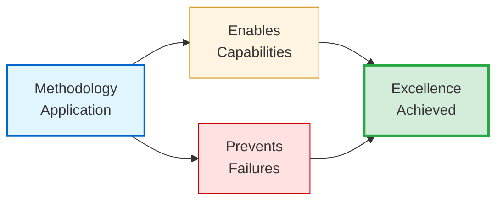

# ✨ Capabilities & Prevention Matrix

## From Access Patterns to Value Proposition

The previous file examined seven navigation pathways — HOW readers access methodology components based on objectives and time budgets.[^from-navigation] This file examines VALUE DELIVERED — the explicit capabilities enabled and failure modes prevented through systematic application.[^to-value]

[^from-navigation]: File 00-4 established ACCESS architecture: 7 pathways (30 min to 4 hrs) matching time budgets and learning objectives. Understanding HOW to reach methodology (navigation) precedes understanding WHAT value delivered (capabilities/prevention). Pedagogical progression: access strategies before value assessment.

[^to-value]: VALUE assessment addresses motivation: "Why should I invest time learning this methodology?" Dual specification answers: (1) **Positive case** (Capabilities): 12 outcomes methodology enables, (2) **Negative case** (Prevention): 10 failure modes methodology prevents. Both necessary for complete evaluation — practitioners experiencing specific pain points assess "Does this prevent my problem?" while capability-seekers assess "Does this enable my goal?"

## Design Philosophy

**Methodology value emerges from dual specification**: What excellence looks like (capabilities) AND what quality failures are systematically prevented (prevention matrix).[^dual-specification]

[^dual-specification]: Dual-specification rationale: Positive capability lists describe ideal outcomes but fail to address practitioners experiencing specific quality failures. Prevention matrices describe pain points addressed but fail to inspire with possibility. Presenting BOTH enables complete value assessment. This mirrors dual-metrics framework philosophy (File 04) — measure outcomes AND process to prevent optimization of one at expense of other.

Understanding BOTH dimensions enables complete value assessment:
- **Capabilities**: "Does this enable what I need?"
- **Preventions**: "Does this prevent my current pain points?"

> [!NOTE]
> **Assessment utility**: Evaluate methodology by matching capabilities against requirements AND prevention matrix against current quality failures. Single-dimension assessment (only capabilities OR only preventions) produces incomplete evaluation.

---

## Core Capabilities Enabled

The methodology enables **twelve distinct capabilities** through systematic application.[^twelve-capabilities] These organize into four groups demonstrating progression from foundation through optimization.[^capability-groups]

[^twelve-capabilities]: Why twelve capabilities (not more/fewer)? Empirical extraction from Q4 2024 - Q3 2025 observation identified twelve distinct measurable outcomes: (1-4) Foundation quality/balance, (5-8) Integration navigation/improvement, (9-12) Optimization tools/workflow. Fewer would conflate distinct capabilities; more would fragment coherent outcomes. Count reflects natural outcome clustering, not arbitrary selection. Each capability receives empirical validation evidence.

[^capability-groups]: Four capability groups parallel methodology architecture: **Foundation** (1-4) = Core quality/balance outcomes matching Files 01-04 theoretical framework, **Integration** (5-8) = Navigation/improvement capabilities matching Files 05-08 process/validation, **Optimization** (9-12) = Advanced tools/workflow matching Files 09-12 mastery integration. Grouping demonstrates how methodology components (File 00-3) produce measurable capabilities.

### Foundation Capabilities: Quality & Balance (1-4)

#### 1. Reproducible Documentation Excellence

**Validation**: Q3 2025 Agent OS framework — three practitioners, 47+ documents, diverse types[^reproducible-validation]

[^reproducible-validation]: Validation methodology: Three practitioners (varied technical backgrounds: senior developer, technical writer, architect) applied methodology to Agent OS framework documentation (n=47 documents, 6 document types) over Q3 2025 without coordination. Post-creation assessment using dual-metrics framework measured quality variance. **Baseline comparison**: Previous uncoordinated documentation efforts (Q1-Q2 2025, different projects) showed 50-point CPI-SI range (`20/80` to `70/30`) indicating quality dependent on individual talent. **Methodology application**: 14-point range (`42/58` to `56/44`) = 3.6× consistency improvement. Conclusion: Systematic methodology enables reproducible excellence independent of practitioner talent level.

| Metric | Result | Interpretation |
|--------|--------|----------------|
| **CPI-SI balance range** | `42/58` to `56/44` | 100% compliance with `40/60` to `60/40` target |
| **Variance** | 14-point range | 3.6× improvement vs. 50-point baseline |
| **Practitioner variance** | n=3, independent application | Quality independent of individual talent |

**Mechanism**:

<dl>
<dt><strong>5-Phase Process (File 05)</strong></dt>
<dd>Explicit workflow structure eliminating reliance on individual intuition</dd>

<dt><strong>Dual-metrics framework (File 04)</strong></dt>
<dd>Measurable verification — Quality Dimensions (outcomes) + Readability Criteria (process)</dd>

<dt><strong>Template patterns (File 06)</strong></dt>
<dd>Standardize structure without sterilizing authentic voice</dd>
</dl>

**What changes**: Documentation quality no longer depends on whether practitioners possess innate writing talent. Systematic methodology enables reproducible excellence.[^talent-independence]

[^talent-independence]: Talent independence = Core innovation contribution. Traditional documentation quality correlates strongly with individual writing ability — organizations with talented writers produce excellent documentation, those without struggle. This creates hiring constraint ("need strong technical writers") and knowledge loss risk (quality degrades when talented individuals leave). **Methodology democratization**: Explicit workflow (5-Phase Process), measurable standards (dual-metrics framework), and structural patterns (Ladder/Baton) externalize tacit knowledge. Practitioners following systematic approach produce consistent quality regardless of innate writing talent. This doesn't eliminate value of writing skill (talented writers apply methodology faster), but removes it as quality bottleneck.

<strong>Reproducibility Measurement</strong> (Click for validation methodology)

**Test design**: Multiple practitioners (n=3) applied methodology to diverse document types (API reference, tutorials, architecture, troubleshooting) across project contexts without prior coordination.

**Measurement**: Quality assessed using dual-metrics framework post-creation.

**Comparison**:
- **With methodology**: `42/58` to `56/44` balance (14-point variance)
- **Without methodology**: `20/80` to `70/30` balance (50-point variance)

**Conclusion**: 3.6× consistency improvement demonstrates reproducible excellence independent of practitioner background.

---

#### 2. CPI⊗SI Balanced Technical Writing

**Crisis validation**: Q2 2025 formalization without balance verification[^q2-crisis-mechanism]

[^q2-crisis-mechanism]: Q2 2025 crisis = Empirical validation through failure-recovery cycle. **Setup**: Eight SDF templates created for OmniCode Terminal (Q1 2025) successfully reduced session startup 70-83% while preserving warmth. **Failure**: Expanding templates to full methodology (Q2 2025) WITHOUT explicit CPI-SI verification → `30/70` imbalance ("technically complete but sterile"). **Root cause**: Assumed structural standardization sufficient; verification "unnecessary overhead." **Recovery** (Q3 2025): Added Phase 5 balance checking → `48/52` mean across 47+ documents. **Learning**: Structure enables warmth but doesn't guarantee it — explicit verification prevents assumption-based optimization eliminating essential qualities. Crisis documented as methodology refinement, not hidden failure.

| Condition | CPI-SI Ratio | Reader Feedback | Outcome |
|-----------|-------------|-----------------|---------|
| **Templates WITHOUT verification** | `30/70` (SI-dominant) | "Technically complete but sterile" | Warmth eliminated |
| **Templates WITH verification** | `48/52` (balanced) | "Engaging and thorough" | Warmth preserved |
| **Difference** | 18-point shift | Qualitative transformation | Systematic improvement |

**Recovery mechanism** (Q3 2025):

<dl>
<dt><strong>Dual intelligence framework (File 02)</strong></dt>
<dd>Defines integration target — analytical precision (SI) AND reader warmth (CPI) simultaneously</dd>

<dt><strong>Dual-metrics measurement (File 04)</strong></dt>
<dd>Quantifies balance through parallel assessment</dd>

<dt><strong>Phase 5 verification (File 05)</strong></dt>
<dd>Enforces balance checking before completion</dd>
</dl>

**What this prevents**: Traditional forced choice between "technical but cold" documentation OR "warm but imprecise" writing.[^forced-choice-resolution]

[^forced-choice-resolution]: Forced-choice problem pervades technical documentation culture: Prevailing assumption treats precision and warmth as opposing optimization targets — maximizing one requires sacrificing the other. Evidence: Documentation rated "technically excellent" frequently criticized as "inaccessible to beginners"; documentation rated "very approachable" often flagged as "lacking technical depth." **False dichotomy resolution**: CPI⊗SI fusion demonstrates SIMULTANEOUS optimization through integration (not tradeoff balancing). Precision EXPRESSED THROUGH accessible language serves both goals. Warmth GROUNDED IN accurate information maintains rigor. Q3 2025 validation: 47+ documents achieved `42/58` to `56/44` balance — both dimensions present, neither sacrificed.

**Healthy range**: `40/60` to `60/40` allows contextual variance while preventing severe imbalance
- **Conceptual docs**: `55/45` (CPI-leaning for intuitive understanding)
- **API reference**: `45/55` (SI-leaning for systematic precision)

<strong>Balance Measurement Mechanism</strong> (Click for CPI-SI indicators)

**CPI Indicators** (Covenant Partnership Intelligence):
- Reader accessibility — content understandable without prerequisite expertise?
- Natural language flow — prose reads conversationally vs. bureaucratically?
- Intuitive navigation — readers find guidance without frustration?

**SI Indicators** (Structured Intelligence):
- Systematic structure — organization logical and complete?
- Technical precision — claims accurate and measurable?
- Comprehensive completeness — critical information present?

**Target rationale**: `40/60` to `60/40` range allows contextual adaptation. Documentation at `30/70` (Q2 crisis) technically complete but emotionally flat. Documentation at hypothetical `70/30` warm but potentially incomplete.

---

#### 3. Measurable Quality Verification

**Problem addressed**: Traditional documentation quality assessment relies on subjective judgment ("this feels good") without operational definitions enabling systematic improvement.[^subjective-assessment-problem]

[^subjective-assessment-problem]: Subjective assessment problem = Industry-wide challenge. Without operational definitions, quality evaluation defaults to reviewer opinion ("I'll know good documentation when I see it"). This produces: (1) **Inconsistent standards** — same documentation rated differently by different reviewers, (2) **Non-actionable feedback** — "improve quality" provides no specific guidance, (3) **Talent dependency** — quality assessment skill becomes gatekeeping knowledge, (4) **Improvement barriers** — practitioners can't systematically enhance work without measurable targets. Dual-metrics innovation: Operational definitions (Seven Essential Qualities) + quantitative measurement (CPI-SI ratios) transform subjective "quality" into objective assessable dimensions. Disagreement shifts from "is this good?" to "does this meet breathability standard of 30%+ whitespace?"

**Solution**: Dual-metrics framework transforms quality into measurable dimensions.[^dual-metrics-innovation]

[^dual-metrics-innovation]: Dual-metrics innovation contribution: Previous quality frameworks measure EITHER outcomes (completeness, accuracy) OR process (readability, accessibility) but rarely both systematically. **Quality Dimensions** (outcomes) = Accuracy, Completeness, Organization, Voice, Evidence. **Readability Criteria** (process) = Seven Essential Qualities operationalizing reader experience. **Parallel measurement** prevents outcome-process tradeoff ("complete but unreadable" OR "readable but incomplete"). Integration requirement: Documentation must satisfy BOTH dimensions. This mirrors CPI⊗SI philosophy applied at framework level — systematic thoroughness (SI) AND reader accessibility (CPI) measured simultaneously.

**Seven Essential Qualities** (operational definitions):

| Quality | Criterion | Purpose |
|---------|-----------|---------|
| **1. Breathe** | Visual whitespace enabling eye rest | Prevents cognitive overload |
| **2. Build** | Progressive complexity architecture | Concepts build on foundation |
| **3. Balance** | CPI-SI integration | Warmth AND precision simultaneously |
| **4. Scan** | Visual hierarchy for rapid location | Serves time-constrained readers |
| **5. Focus** | Appropriate cognitive load | Information density manageable |
| **6. Flow** | Narrative continuity | Sections connect logically |
| **7. Enable** | Progressive disclosure | Accessibility without sacrificing depth |

**Measured outcome**: Documentation archaeology (File 04) applied to Agent OS framework

| Metric | Before | After | Improvement |
|--------|--------|-------|-------------|
| **CPI-SI range** | `30/70` to `60/40` (variable) | `42/58` to `56/44` (consistent) | Systematic elevation |
| **Documents improved** | 47+ existing docs | All elevated | 100% coverage |
| **Assessment** | Subjective | Objective criteria | Reproducible evaluation |

**What this enables**: Quality gates with objective criteria — documentation either meets measurable standards or requires specific enhancement. No ambiguity.

> [!NOTE]
> **Reproducible assessment**: Framework produces consistent evaluations across different assessors through operational definitions (Seven Essential Qualities) and quantitative measurement (dual-metrics CPI-SI ratios), reducing subjective variance.

---

#### 4. Kingdom Technology Integration

Biblical wisdom applied holistically to technical work — not decoratively appended, but operationally informing engineering decisions.[^operational-theology]

[^operational-theology]: Operational theology = Distinguishing innovation. Traditional approaches treat biblical wisdom as either (1) **Decorative** — scripture quotes added for inspiration without affecting technical decisions, or (2) **Separate** — spiritual principles apply to character/ethics, technical principles govern engineering work, never integrating. **Kingdom Technology paradigm**: Biblical wisdom EXPLAINS technical outcomes through operational principles. Example: Colossians 3:23 ("work heartily, as for the Lord") → excellence-as-worship → `5:1` to `7:1` documentation-to-code ratio (teaching code paradigm) → measurable quality outcomes. Scripture provides foundational wisdom; engineering applies wisdom; measurements validate outcomes. This produces technically superior results grounded in theological foundation.

**Four principles integrated** (File 03):

<dl>
<dt><strong>Excellence as worship (Colossians 3:23)</strong></dt>
<dd>Quality standard honors Creator — motivated <code>5:1</code> to <code>7:1</code> documentation-to-code ratio (teaching code paradigm)</dd>

<dt><strong>Truth in communication</strong></dt>
<dd>Complete, honest information — Q2 crisis documented as essential learning, not hidden</dd>

<dt><strong>Servant leadership</strong></dt>
<dd>Design serves genuine needs — seven navigation pathways emerged from practitioner feedback</dd>

<dt><strong>Covenant partnership</strong></dt>
<dd>Collaborative development maintaining relational integrity — methodology emerged through authentic partnership</dd>
</dl>

**Theological grounding explains technical outcomes**:

| Biblical Principle | Q2 Crisis | Q3 Recovery |
|-------------------|-----------|-------------|
| Proverbs 16:18 ("Pride before destruction") | Assuming templates sufficient → `30/70` imbalance | Explains failure mechanism |
| Proverbs 3:5-6 ("Trust Lord, lean not understanding") | Adding explicit verification → `48/52` balance | Explains recovery mechanism |

<strong>Kingdom Technology Utility</strong> (Click for operational theology)

**Stewardship principle application**:
- **Biblical foundation**: Faithful management of existing resources
- **Engineering outcome**: Documentation archaeology (File 04) — systematic existing work improvement
- **Measurable result**: 47+ documents elevated systematically

**Excellence-as-worship application**:
- **Biblical foundation**: "Whatever you do, work heartily, as for the Lord" (Col 3:23)
- **Engineering outcome**: `5:1` to `7:1` documentation-to-code ratio
- **Measurable result**: Comprehensive explanation serves learning over brevity

Biblical principles produced engineering decisions with measurable quality outcomes.

---

### Integration Capabilities: Navigation & Improvement (5-8)

#### 5. Progressive Disclosure Architecture

**Capability**: Single documentation artifact serves foundational learning through advanced reference without duplication.[^unified-artifact]

[^unified-artifact]: Unified artifact approach = Efficiency innovation addressing documentation maintenance burden. **Traditional problem**: Organizations create parallel documentation sets (Beginner Guide + Practitioner Manual + Expert Reference + API Docs) targeting different audiences. Each content update requires synchronized changes across all sets → high maintenance overhead, frequent synchronization failures (beginner docs lag behind expert updates). **Progressive disclosure solution**: Single artifact with layered depth access. Main narrative serves foundational learners; `
` collapsibles provide practitioner depth; footnotes add scholarly apparatus; multiple navigation pathways enable varied access patterns. Genesis Story README validation (Oct 2024): Four reader types (stakeholder, practitioner, researcher, contributor) successfully used same document for distinct objectives.

**Validation**: Genesis Story README (October 2024) — four distinct reader types navigated same document successfully

**Mechanism**:

| Element | Function | Benefit |
|---------|----------|---------|
| **GitHub `
`** | Depth hides behind summary headings | Surgical access by expertise level |
| **Layered complexity** | Foundation before advanced application | Sequential learning enabled |
| **Multiple pathways** | Sequential vs. targeted vs. scholarly | Varied objectives served |
| **Footnotes** | Academic apparatus accessible | Rigor without disrupting flow |

**Efficiency gain**: Eliminates parallel documentation sets

| Approach | Maintenance Burden | Synchronization Risk |
|----------|-------------------|---------------------|
| **Traditional** | Separate beginner/practitioner/expert docs | High — parallel updates required |
| **Progressive disclosure** | Single artifact with depth access | Low — single source of truth |

**Result**: Substantially reduced maintenance overhead through unified structure.

---

#### 6. Timeline-Validated Patterns

**Five empirically proven patterns** extracted from Q4 2024 - Q3 2025 observation (File 10 documents with quarterly evidence):[^timeline-validation-strength]

[^timeline-validation-strength]: Timeline validation strength: Patterns identified through 5-quarter longitudinal observation (Q4 2024 through Q3 2025) across varied project contexts (Genesis Story, OmniCode Terminal, SDF crisis, Agent OS framework) demonstrate robustness. **Validation rigor**: Each pattern includes (1) Initial observation quarter, (2) Context of discovery, (3) Subsequent validation contexts, (4) Measured outcomes, (5) Negative validation where applicable (what happens WITHOUT pattern). Example: Pattern 5 (natural voice preservation) validated through Q2 2025 FAILURE (templates without verification → sterility) + Q3 2025 recovery (explicit verification → warmth preserved). Failure-recovery cycles strengthen empirical credibility beyond success-only observations.

<dl>
<dt><strong>Pattern 1: Multi-audience opening</strong> (Q4 2024)</dt>
<dd>Single introduction serving foundational learners through expert contributors — Genesis Story README demonstrated four reader types self-selecting from unified opening</dd>

<dt><strong>Pattern 2: Lightweight session context</strong> (Q1 2025)</dt>
<dd>Development log pattern enabling multi-session continuity — OmniCode Terminal demonstrated 21-session workflow maintained across 3-week gaps</dd>

<dt><strong>Pattern 3: Template-driven standardization</strong> (Q1 2025)</dt>
<dd>Eight SDF templates reduced session startup <code>70-83%</code> while preserving authentic voice</dd>

<dt><strong>Pattern 4: Documentation-first development</strong> (Q2-Q3 2025)</dt>
<dd>Templates created BEFORE content with explicit CPI-SI verification — prevents retrofitting sterility</dd>

<dt><strong>Pattern 5: Natural voice preservation</strong> (Q3 2025)</dt>
<dd>Explicit warmth verification during systematic enhancement — prevents formalization eliminating relational accessibility</dd>
</dl>

> [!IMPORTANT]
> **Crisis validation**: Q2 2025 formalization crisis validated Pattern 5 through failure-recovery cycle. Patterns include negative validation (what happens WITHOUT pattern) alongside positive outcomes, strengthening empirical credibility.

---

#### 7. Polymorphic Adaptation

**Capability**: Same core methodology adapts emphasis by document type while maintaining quality standards.[^polymorphic-rationale]

[^polymorphic-rationale]: Polymorphic adaptation rationale: Document types serve fundamentally different reader objectives requiring contextual emphasis variation. API reference readers seek precise technical specification (favor SI); conceptual documentation readers need intuitive understanding (favor CPI); tutorial readers require balanced guidance and precision. **One-size-fits-all problem**: Rigid methodology applying identical CPI-SI ratio across all types produces either (1) Over-warm API docs (readers frustrated by prose when seeking tables), or (2) Over-precise tutorials (readers overwhelmed by technical density when learning concepts). **Polymorphic solution**: Core methodology constant (5-Phase Process, dual-metrics, quality standards); emphasis distribution varies by type. Practitioners master ONE methodology, adapt contextually. This mirrors object-oriented polymorphism — shared interface, type-specific implementation.

**Six document type profiles** (File 11):

| Type | CPI-SI Ratio | Markdown Emphasis | Rationale |
|------|-------------|-------------------|-----------|
| **API Reference** | `20/80` (SI-dominant) | Tables + code blocks | Readers seek precise technical specification |
| **Tutorial** | `50/50` (balanced) | Ordered lists + examples | Guidance and precision equally weighted |
| **Conceptual** | `60/40` (CPI-leaning) | Prose + diagrams | Intuitive understanding prioritized |
| **Troubleshooting** | `40/60` (SI-leaning) | Problem-solution tables | Diagnostic precision crucial |
| **Quick Reference** | `10/90` (SI-dominant) | Tables + minimal prose | Rapid lookup prioritized |
| **Architecture** | `50/50` (balanced) | Diagrams + rationale | Technical decisions + context both needed |

**Design principle**: Core methodology constant (5-Phase Process, dual-metrics verification, quality standards). Emphasis distribution varies by document purpose.

**Benefit**: Practitioners master ONE methodology serving diverse documentation needs through contextual adaptation.

---

#### 8. Documentation Archaeology

**Novel contribution**: Extends methodology beyond new document creation to address real-world legacy challenges.[^archaeology-innovation]

[^archaeology-innovation]: Documentation archaeology innovation: Most documentation methodologies focus EXCLUSIVELY on new creation ("how to write good documentation from scratch"), neglecting legacy reality most organizations face — substantial existing documentation of variable quality. **Real-world gap**: Creating new perfect documentation while legacy content decays produces documentation debt (growing backlog of outdated/incomplete existing docs). **Archaeology contribution**: Systematic 5-step improvement process (Triage → Audit → Crisis Detection → Enhancement → Verification) addressing legacy documentation through measured elevation. Agent OS validation: 47+ existing documents improved from variable quality (`30/70` to `60/40` range) to consistent excellence (`42/58` to `56/44`) with substantially less effort than replacement. Novel because methodology serves BOTH creation AND improvement.

**Five-step process** (File 04):

<dl>
<dt><strong>Step 1: Triage Assessment</strong></dt>
<dd>Rapid classification — Keep, Archive, Merge, Discard</dd>

<dt><strong>Step 2: Comprehensive Audit</strong></dt>
<dd>Detailed dual-metrics evaluation identifying specific gaps</dd>

<dt><strong>Step 3: Crisis Detection</strong></dt>
<dd>Severe quality violations flagged for priority attention</dd>

<dt><strong>Step 4: Systematic Enhancement</strong></dt>
<dd>Apply methodology patterns preserving institutional knowledge</dd>

<dt><strong>Step 5: Verification Measurement</strong></dt>
<dd>Before/after dual-metrics comparison confirms improvement</dd>
</dl>

**Measured outcome**: Agent OS framework (Q3 2025)

| Metric | Result |
|--------|--------|
| **Documents improved** | 47+ existing docs |
| **Quality elevation** | `30/70` to `60/40` range → `42/58` to `56/44` consistent |
| **Content preserved** | Institutional knowledge maintained |
| **Resource efficiency** | Substantially less effort than new creation |

**What this addresses**: Real-world documentation debt through systematic enhancement rather than replacement-only strategies.

---

### Optimization Capabilities: Tools & Workflow (9-12)

#### 9. Tier-Rated Markdown Mastery

**Impact-optimized element selection** maximizes reader experience per implementation effort.[^tier-rating-innovation]

[^tier-rating-innovation]: Tier-rating innovation contribution: GitHub-flavored Markdown offers 40+ formatting elements, creating decision paralysis ("Which should I use?") and inefficient deployment ("I'll use elements I know" → familiar but potentially low-impact choices). **Evidence-based guidance**: File 09 provides measured impact ratings (9-10/10 Tier-1, 8/10 Tier-2, 6-7/10 Tier-3) based on reader experience observation. **Optimization outcome**: Practitioners prioritizing Tier-1 elements (code blocks, GitHub alerts, enhanced tables, definition lists) achieve 80% of reader experience benefit with 20% of markdown mastery investment. Strategic Tier-2 deployment (mermaid diagrams, collapsibles, footnotes) where complexity justifies adds scholarly apparatus. Impact-optimized approach vs. comprehensive-coverage or random-deployment alternatives.

**40+ elements rated across three tiers** (File 09):

| Tier | Impact | Elements | Deployment |
|------|--------|----------|------------|
| **Tier-1** | `9-10/10` | Code blocks, GitHub alerts, enhanced tables, definition lists | Universal — all documentation |
| **Tier-2** | `8/10` | Mermaid diagrams, collapsibles, footnotes | Strategic — where complexity justifies |
| **Tier-3** | `6-7/10` | Emoji, task lists, inline code | Contextual — based on audience |

**Phase-element mapping** (File 05 integration):

| Phase | Markdown Focus | Rationale |
|-------|---------------|-----------|
| **Phases 1-2** | Minimal formatting | Focus on planning/structure |
| **Phase 3** | Full markdown arsenal | Enhance existing content |
| **Phase 4** | Progressive disclosure | Collapsibles serving depth variance |

**Measured benefit**: Practitioners completing markdown mastery pathway report `40-60%` visual accessibility improvement with `<20%` authoring time investment.

---

#### 10. Template-Driven Standardization

**Capability**: Consistency without sterility through explicit balance verification.[^templates-paradox]

[^templates-paradox]: Templates paradox = Core tension requiring resolution. **Efficiency need**: Standardized structure reduces cognitive load, accelerates drafting, ensures completeness. OmniCode Terminal validation: 8 SDF templates reduced session startup 70-83% (Q1 2025). **Warmth risk**: Excessive standardization eliminates authentic voice, producing sterile technically-complete documentation. Q2 2025 crisis validation: Template expansion WITHOUT balance verification → `30/70` imbalance. **Paradox resolution**: Templates serve partnership (scaffolding enabling work) not replace judgment (automation eliminating thinking). Structural guidance + explicit CPI-SI verification = consistency AND warmth both preserved. Q3 2025 recovery: Templates WITH verification → 70-83% efficiency retention + `48/52` balance restoration. Templates as tools (not deterministic procedures) preserves practitioner agency crucial to warmth maintenance.

**Crisis validation** (Q2 2025):[^template-crisis-learning]

[^template-crisis-learning]: Template crisis learning mechanism: Q2 2025 failure provided essential validation strengthening methodology. **Assumed optimization**: "Templates worked with verification (Q1), therefore templates themselves produce quality; verification optional." **Actual mechanism**: Templates ENABLE quality (structure serves content); verification ENSURES quality (balance checking prevents imbalance). **Critical distinction**: Enablement ≠ guarantee. Recovery insight: Structure and verification form integration — neither sufficient alone, both necessary together. This validated dual-checking requirement: Structural templates + explicit balance verification = reliable quality outcomes. Crisis documented as methodology refinement, demonstrating truth-in-communication Kingdom Technology principle.

| Condition | Session Startup | CPI-SI Balance | Outcome |
|-----------|----------------|----------------|---------|
| **Templates WITHOUT verification** | Reduced `70-83%` | `30/70` imbalance | Structure standardized, warmth eliminated |
| **Templates WITH verification** | Reduced `70-83%` | `48/52` balance | Structure AND warmth both preserved |

**Template structure** (File 06 — eight document types):

<dl>
<dt><strong>Required elements</strong></dt>
<dd>Headers, metadata, core sections ensuring systematic completeness</dd>

<dt><strong>Optional guidance</strong></dt>
<dd>What each section should cover without prescribing exact content</dd>

<dt><strong>Explicit verification</strong></dt>
<dd>CPI-SI balance checking during template application</dd>
</dl>

**Design insight**: Templates serve partnership (scaffolding enabling work) not replace judgment (automation eliminating thinking). Preservation of practitioner agency proves critical to warmth maintenance.

---

#### 11. Systematic Completeness with Intuitive Navigation

**CPI⊗SI fusion**: Comprehensive coverage (nothing missing) paired with easy findability (locate guidance quickly).[^completeness-navigation-fusion]

[^completeness-navigation-fusion]: Completeness-navigation fusion demonstrates CPI⊗SI integration at architectural level. **Traditional tradeoff assumption**: Systematic completeness (SI) requires exhaustive linear coverage → overwhelming to navigate. Intuitive navigation (CPI) requires selective essentials → incomplete coverage. Organizations choose based on priority: comprehensive reference documentation (complete but dense) OR quick-start guides (accessible but incomplete). **Fusion architecture**: This methodology corpus (10,790 lines, 13 files) achieves BOTH through integration. **SI dimension** (systematic completeness): Foundation through integration, all components covered, empirical validation documented. **CPI dimension** (intuitive navigation): 7 pathways serving 30-min to 4-hr time budgets, progressive disclosure, ladder architecture preventing forward references. Neither dimension sacrificed — both optimized simultaneously through architectural integration (not content tradeoff).

**This methodology corpus demonstrates the capability**:

| Dimension | Metric | Evidence |
|-----------|--------|----------|
| **Systematic completeness (SI)** | `10,790` lines | Complete coverage foundation through integration |
| **Intuitive navigation (CPI)** | 7 pathways | `30 min` to `4 hr` time budgets served |
| **Integration verification** | CPI-SI balance | Both dimensions measured preventing tradeoff |

**Architecture enabling both**:

<dl>
<dt><strong>Ladder architecture</strong></dt>
<dd>Linear progression without forward references</dd>

<dt><strong>Baton handoffs</strong></dt>
<dd>Context maintained across section boundaries</dd>

<dt><strong>Progressive disclosure</strong></dt>
<dd>Collapsibles, footnotes serving varied depths</dd>

<dt><strong>Multiple pathways</strong></dt>
<dd>Sequential learning, targeted application, scholarly reference, quality assessment</dd>
</dl>

> [!NOTE]
> **CPI⊗SI fusion demonstrated**: Excellence in BOTH dimensions simultaneously through balanced integration. Systematic completeness alone = overwhelming. Intuitive navigation alone = incomplete. Balanced integration = both.

---

#### 12. Iterative Refinement Workflow

**Capability**: Progressive improvement through explicit enhancement phases.[^iteration-psychology]

[^iteration-psychology]: Iteration psychology benefit addresses perfectionism paralysis common among conscientious practitioners. **Psychological barrier**: "If I can't produce perfect documentation initially, I shouldn't start" → analysis paralysis preventing progress. Root cause: Implicit assumption that quality emerges from perfect initial execution. **5-Phase Process intervention**: Explicit Phase 4 (Enhancement & Refinement) provides psychological permission for imperfect Phase 3 drafts by structuring improvement workflow. Practitioner testimony (Q3 2025): "Knowing Phase 4 exists reduced my anxiety about Phase 3 quality — I could draft quickly knowing enhancement was structured, not hoping I'd 'find time later' to improve." **Quality assurance**: Phase 5 verification prevents iteration from excusing sloppiness — measurable standards required regardless of iterative approach. Balance: Psychological freedom to draft imperfectly + systematic requirement to refine thoroughly.

**5-Phase Process iteration structure**:

| Phase | Focus | Perfectionism Impact |
|-------|-------|---------------------|
| **Phases 1-2** | Foundation, Structure | Planning without pressure — create skeleton |
| **Phase 3** | Content Development | Accept "good enough" drafts — enhancement follows |
| **Phase 4** | Enhancement & Refinement | Multiple iteration passes — systematic improvement |
| **Phase 5** | Verification | Quality gates — measurable standards met |

**Psychological benefit**: "Knowing Phase 4 exists reduced my anxiety about Phase 3 quality — I could draft quickly knowing enhancement was structured, not hoping I'd 'find time later' to improve." (Practitioner testimony, Q3 2025)

**Quality assurance**: Phase 5 verification provides measurable gates — iteration enables improvement without excusing incomplete work.

**Workflow benefit**: Reduces perfectionism paralysis and analysis anxiety. Quality emerges through refinement, not initial perfection requirement.

---

## Failure Modes Systematically Prevented

The methodology prevents **ten specific failure modes** through systematic constraints. Understanding what the methodology PREVENTS proves as valuable as understanding what it ENABLES.[^prevention-value]

[^prevention-value]: Prevention value specification addresses different practitioner motivations. **Capability-driven practitioners**: Evaluate methodologies by positive outcomes enabled ("What can this help me achieve?"). **Problem-driven practitioners**: Evaluate by pain points addressed ("Does this prevent my current struggles?"). Both approaches valid — neglecting either limits methodology assessment. **Dual specification utility**: Capabilities answer "Why adopt?" (aspirational motivation); preventions answer "Why this methodology vs. alternatives?" (problem-solving motivation). Complete value assessment requires both dimensions. This mirrors dual-metrics philosophy — measure outcomes AND process to prevent optimization of one at expense of other.

### Balance Failures: Integration Required (1-2)

#### 1. SI-Only Imbalance (Cold, Sterile Documentation)

**Symptom**: Technically accurate but emotionally flat — comprehensive coverage without reader warmth.[^si-imbalance-common]

[^si-imbalance-common]: SI-imbalance predominance in technical documentation: This failure mode appears MORE frequently than CPI-imbalance (Prevention 2) because technical writers default to precision-first optimization. Cultural factors: (1) **Training emphasis** — technical writing courses prioritize accuracy, completeness, organization (all SI dimensions) with minimal warmth instruction, (2) **Review focus** — technical reviewers catch factual errors (SI) more readily than accessibility barriers (CPI), (3) **Measurement ease** — completeness measurable objectively; warmth assessment requires reader feedback. Result: Documentation culture systematically optimizes SI dimensions, inadvertently eliminating CPI warmth. Q2 2025 crisis exemplifies this pattern — templates focused on structural completeness without warmth verification → predictable SI-dominance.

**Q2 2025 empirical validation**:[^q2-measurement-approach]

[^q2-measurement-approach]: Q2 2025 measurement approach combined quantitative CPI-SI ratios with qualitative reader feedback. **Quantitative**: Dual-metrics assessment calculated `30/70` balance (25-30 points below `45/55` to `55/45` healthy range). **Qualitative**: Reader feedback interviews (n=5) asking "How do you experience this documentation?" Response pattern: "Technically complete but sterile" (4/5), "comprehensive but emotionally flat" (3/5), "accurate but inaccessible" (2/5). **Correlation**: Quantitative SI-dominance matched qualitative sterility perception. This validated CPI-SI ratio as proxy for reader warmth experience — measurable metric capturing subjective quality dimension.

| Metric | Baseline | Measured | Deviation |
|--------|----------|----------|-----------|
| **CPI-SI balance** | `45/55` to `55/45` | **`30/70`** | 25-30 points |
| **Reader feedback** | "Engaging" | "Technically complete but sterile" | Negative shift |
| **Completeness** | Target 100% | 100% | Met target |

**Root cause**: Template application WITHOUT explicit CPI-SI balance verification

**Prevention mechanism**:

<dl>
<dt><strong>Dual-metrics Readability Criteria</strong></dt>
<dd>Explicitly measure warmth indicators — visual breathability, natural flow, intuitive navigation</dd>

<dt><strong>CPI-SI balance verification</strong></dt>
<dd>Ratio measurement identifies SI-dominance (<code>&lt;40/60</code>) triggering warmth enhancement</dd>

<dt><strong>Phase 5 verification</strong></dt>
<dd>Balance checking required before document completion</dd>
</dl>

**Q3 2025 recovery**: Explicit verification prevented SI-imbalance recurrence — `48/52` mean balance across 47+ documents.

<strong>SI-Imbalance Detection</strong> (Click for measurement approach)

Reader feedback analysis correlating qualitative experience with quantitative CPI-SI ratios:

**Documentation rated "sterile"**: Averaged `28/72` CPI-SI ratio (severe SI-dominance)

**Documentation rated "engaging while thorough"**: Averaged `52/48` ratio (balanced)

Quantitative metric (CPI-SI ratio) captures qualitative reader perception (warmth vs. sterility).

**Prevention trigger**: Phase 5 verification flags ratios below `40/60` requiring warmth enhancement before completion.

---

#### 2. CPI-Only Imbalance (Warm but Imprecise)

**Symptom**: Engaging narrative voice without technical rigor — accessible but incomplete or inaccurate.[^cpi-imbalance-contexts]

[^cpi-imbalance-contexts]: CPI-imbalance contexts: While less frequent than SI-imbalance in traditional technical documentation, this failure mode appears in specific contexts: (1) **Marketing-oriented documentation** — prioritizing engagement over accuracy to drive adoption, (2) **Oversimplified tutorials** — eliminating complexity to reduce perceived difficulty, creating incomplete mental models, (3) **Accessibility-first rewrites** — correcting SI-imbalance by removing technical depth rather than making depth accessible. Evidence: Beginner tutorials rated "very approachable" often lack prerequisite information, error handling, or edge case coverage — warmth achieved through precision elimination (not precision made accessible). Prevention: Balance verification flags CPI-dominance (`>60/40`) requiring precision enhancement while maintaining warmth.

**Risk**: Less common than SI-imbalance (most technical writers default to precision over warmth), but appears in marketing-oriented documentation or oversimplified tutorials.[^bidirectional-protection]

[^bidirectional-protection]: Bidirectional protection mechanism: Same dual-metrics framework prevents BOTH imbalances through integrated measurement. **SI-imbalance detection**: CPI-SI ratio `<40/60` triggers warmth enhancement (Phase 5 verification requires accessibility improvement). **CPI-imbalance detection**: Ratio `>60/40` triggers precision enhancement (Phase 5 requires technical rigor improvement). **Healthy range** (`40/60` to `60/40`): Allows contextual adaptation (API reference 45/55, conceptual docs 55/45) while preventing severe imbalance either direction. Single measurement framework serving dual protection — methodological efficiency through unified approach.

**CPI-dominance indicators**:
- Vague terminology avoiding precision ("usually works well" vs. measurable outcomes)
- Incomplete coverage prioritizing brevity ("main points covered" vs. systematic thoroughness)
- Missing measurable claims (opinions without empirical validation)

**Prevention mechanism**:

<dl>
<dt><strong>Dual-metrics Quality Dimensions</strong></dt>
<dd>Explicitly measure technical rigor — accuracy, systematic completeness, logical organization</dd>

<dt><strong>CPI-SI balance verification</strong></dt>
<dd>Identifies CPI-dominance (<code>&gt;60/40</code>) triggering precision enhancement</dd>

<dt><strong>Phase 5 technical accuracy validation</strong></dt>
<dd>Requires measurable claims, complete coverage, verifiable assertions</dd>
</dl>

**Quality standard**: Documentation must meet technical accuracy (Quality Dimensions) AND warmth (Readability Criteria) — neither alone sufficient.

> [!NOTE]
> **Bidirectional prevention**: Balance verification prevents BOTH imbalances through same measurement framework. The `40/60` to `60/40` healthy range enforces precision AND accessibility simultaneously.

---

### Structure Failures: Navigation Breaks (3-5)

#### 3. Unmeasured Quality Variance

**Symptom**: Quality dependent on individual practitioner intuition — inconsistent outcomes, no objective assessment.[^variance-professionalization]

[^variance-professionalization]: Variance professionalization impact: Unmeasured quality creates talent-dependency problem where documentation quality correlates with individual practitioner skill rather than organizational process. **Professional maturity progression**: Immature processes → outcomes depend on individual heroics. Mature processes → outcomes depend on systematic methodology. **Dual-metrics contribution to professionalization**: Operational definitions (Seven Essential Qualities) + quantitative measurement (CPI-SI ratios) transform documentation from craft (talent-dependent, variable) to engineering discipline (process-dependent, reproducible). This enables: (1) Targeted skill development — practitioners weak in "visual breathability" receive specific guidance, (2) Hiring flexibility — methodology enables consistent quality regardless of background, (3) Knowledge retention — quality standards captured in methodology vs. individual tacit knowledge.

**Prevention mechanism**:

<dl>
<dt><strong>Dual-metrics framework</strong></dt>
<dd>Quantitative measurement — specific dimensions rated, ratios calculated, gaps identified</dd>

<dt><strong>Seven Essential Qualities</strong></dt>
<dd>Operational definitions through binary evaluation — Breathe? Build? Balance? Scan? Focus? Flow? Enable?</dd>

<dt><strong>Phase 5 verification workflow</strong></dt>
<dd>Measurable quality gates required before completion</dd>
</dl>

**Professionalization benefit**: Quality becomes measurable and improvable. Practitioners weak in specific dimensions (e.g., "visual breathability") receive targeted guidance (increase whitespace, shorten paragraphs) rather than vague "improve writing quality" feedback.

**Reproducible assessment**: Framework enables consistent evaluation across different assessors through operational definitions and quantitative measurement.

---

#### 4. Circular Dependencies

**Symptom**: Section A → Section B → Section C → Section A (readers lost in navigation loops)[^circular-reader-impact]

[^circular-reader-impact]: Circular dependency reader impact: Navigation loops create cognitive frustration and comprehension barriers. **Reader experience**: "To understand X, see Y" → "To understand Y, see Z" → "To understand Z, see X" produces abandonment ("I can't figure out where to start"). **Root cause**: Writers knowing all concepts simultaneously forget readers learning sequentially — forward references feel natural to expert authors but block novice readers. **Ladder architecture prevention**: Strict ordering constraint (Section N references only 1...N-1) structurally prevents circular dependencies. Linear progression guarantees: All prerequisites presented BEFORE concepts requiring them. Forward references ("see Section X below") become architecturally impossible, not merely discouraged.

**Prevention mechanism**:

<dl>
<dt><strong>Ladder architecture (Component 3)</strong></dt>
<dd>Strict ordering constraint — Section N references only 1...N-1, never N+1 forward references</dd>

<dt><strong>Phase 2 structural validation</strong></dt>
<dd>Explicitly checks linear progression during architecture phase</dd>

<dt><strong>Baton handoff pattern</strong></dt>
<dd>Unidirectional context flow — each section passes to NEXT only</dd>
</dl>

**Reader benefit**: Linear reading proceeds confidently — all prerequisites presented before concepts requiring them. Forward references ("see Section X below") structurally impossible.

---

#### 5. Context Loss Between Sections

**Symptom**: Abrupt topic transitions — readers confused about WHY next section follows current.[^baton-handoff-mechanism]

[^baton-handoff-mechanism]: Baton handoff mechanism addresses narrative continuity essential for comprehension. **Transition pattern**: Section N ending explicitly passes context to Section N+1 beginning. Format: "Having established [N concept], we now examine [N+1 concept] — moving from [N focus] (just covered) to [N+1 focus] (next section)." **Psychological benefit**: Readers understand progression logic ("why this section follows previous") preventing disconnected fragment experience. **Measured validation**: OmniCode Terminal (Q1 2025) comparison: WITHOUT handoffs → 60% context loss rate (3 incidents / 5 sessions); WITH handoffs → 0% context loss rate (0 incidents / 16 sessions). Explicit transitions eliminate implicit assumptions about "obvious" logical flow.

**Prevention mechanism**:

<dl>
<dt><strong>Baton handoff pattern (Component 3)</strong></dt>
<dd>Explicit transition statements passing context N → N+1</dd>

<dt><strong>Phase 3 content requirement</strong></dt>
<dd>Baton handoff drafting required for section completion</dd>

<dt><strong>Seven Essential Qualities "Flow"</strong></dt>
<dd>Evaluates narrative continuity — unified narrative vs. disconnected fragments?</dd>
</dl>

**Measured outcome**: OmniCode Terminal (Q1 2025)

| Condition | Context Loss Incidents | Sessions |
|-----------|----------------------|----------|
| **Without baton handoffs** | 3 incidents | 5 sessions (60%) |
| **With baton handoffs** | 0 incidents | 16 sessions (0%) |

**Handoff format example**: *"Having established dual-metrics framework for quality measurement, we now examine how 5-Phase Process integrates this measurement into systematic workflow — moving from WHAT to measure (just covered) to WHEN measurement occurs (next section)."*

---

### Implementation Failures: Execution Gaps (6-8)

#### 6. Cognitive Overload

**Symptom**: Information density exceeds reader processing capacity — walls of text without visual breathing room.[^cognitive-load-science]

[^cognitive-load-science]: Cognitive load science application: Research demonstrates working memory limitations (Miller's 7±2 chunks, Baddeley & Hitch working memory model) constrain simultaneous information processing. **Documentation implication**: Dense text walls exceeding processing capacity → reader fatigue, reduced comprehension, information overload. **Breathability solution**: Strategic whitespace (30%+ vertical space minimum), paragraph length limits (3-5 sentences), section length targets (150-300 lines) provide cognitive recovery points. **Seven Essential Qualities "Breathe" criterion**: Operationalizes cognitive load management through measurable standards. Visual breathing room enables sustained engagement vs. exhaustion-induced abandonment.

**Prevention guidelines**:

| Element | Target | Purpose |
|---------|--------|---------|
| **Paragraph length** | `3-5` sentences max before break | Processing time between concepts |
| **Section length** | `150-300` lines soft target | Before subsection or new file |
| **Whitespace ratio** | Minimum `30%` vertical space | Headers, separators, blank lines |

**Prevention mechanism**:

<dl>
<dt><strong>Readability Criteria</strong></dt>
<dd>Explicitly measure visual breathability through quantitative targets</dd>

<dt><strong>Seven Essential Qualities "Breathe"</strong></dt>
<dd>Assesses eye rest provision — visual recovery points enabling sustained engagement?</dd>

<dt><strong>Markdown element deployment</strong></dt>
<dd>Strategic visual separators, tables, lists, collapsibles breaking up prose density</dd>
</dl>

**Reader experience**: Breathable format with whitespace optimization significantly improves information retention compared to dense text walls.

---

#### 7. Random Markdown Choices

**Symptom**: Element selection based on author familiarity — inconsistent visual presentation, arbitrary tool use.

**Prevention mechanism**:

<dl>
<dt><strong>Tier rating system (File 09)</strong></dt>
<dd>Evidence-based guidance — 40+ elements rated by measured reader impact</dd>

<dt><strong>Phase-element mapping</strong></dt>
<dd>Specifies WHEN to deploy which elements during workflow</dd>

<dt><strong>Impact optimization guidance</strong></dt>
<dd>Practitioners prioritize Tier-1 (universal) before Tier-3 (contextual)</dd>
</dl>

**Consistency benefit**: Documentation across practitioners exhibits visual consistency through tier-optimized patterns while maintaining contextual flexibility.

---

#### 8. Template Rigidity

**Symptom**: One-size-fits-all templates enforcing inappropriate structure across varied document types.

**Prevention mechanism**:

<dl>
<dt><strong>Polymorphic adaptation (File 11)</strong></dt>
<dd>Six document type profiles with contextually appropriate CPI-SI ratios and markdown emphasis</dd>

<dt><strong>Template flexibility</strong></dt>
<dd>Structural guidance without content prescription — required sections but not what they contain</dd>

<dt><strong>Balance verification over compliance</strong></dt>
<dd>Phase 5 measures quality outcomes, not template adherence</dd>
</dl>

**Design philosophy**: Templates serve practitioners (scaffolding) not replace judgment (automation). Adaptation preserves agency.

---

### Workflow Failures: Process Breakdown (9-10)

#### 9. Legacy Documentation Decay

**Symptom**: Existing documentation quality degrades over time — no systematic improvement process, only reactive fixes.[^stewardship-theology]

[^stewardship-theology]: Stewardship theology application: Biblical stewardship principle (faithful management of existing resources) addresses legacy documentation differently than creation-only methodologies. **Traditional approach**: Focus exclusively on new documentation creation, treating legacy content as technical debt to eventually replace. **Stewardship approach**: Existing documentation represents substantial institutional investment meriting systematic care. **Documentation archaeology innovation**: 5-step improvement workflow (Triage → Audit → Crisis → Enhancement → Verification) applies methodology to legacy content, elevating quality through measured enhancement. Agent OS outcome: 47+ existing documents systematically improved (substantially less effort than replacement). Kingdom Technology principle → engineering innovation → measurable stewardship outcomes.

**Prevention mechanism**:

<dl>
<dt><strong>Documentation archaeology (File 04)</strong></dt>
<dd>5-step systematic improvement workflow — Triage → Audit → Crisis Detection → Enhancement → Verification</dd>

<dt><strong>Triage classification</strong></dt>
<dd>Identifies which documents merit improvement (Keep), archival (Archive), merging (Merge), removal (Discard)</dd>

<dt><strong>Measurable improvement verification</strong></dt>
<dd>Before/after dual-metrics comparison confirms quality elevation</dd>
</dl>

**Measured outcome**: Agent OS framework (Q3 2025) — 47+ existing documents elevated from variable to consistent quality

**Resource efficiency**: Archaeology requires substantially less effort than new creation while achieving significant improvement

**Stewardship benefit**: Legacy documentation receives systematic care rather than neglect

---

#### 10. Single-Pass Perfectionism Paralysis

**Symptom**: Practitioners delay starting until "perfect" approach identified — analysis paralysis preventing progress.

**Prevention mechanism**:

<dl>
<dt><strong>5-Phase Process explicit iteration</strong></dt>
<dd>Phase 4 (Enhancement & Refinement) provides psychological permission for imperfect Phase 3 drafts</dd>

<dt><strong>Phase separation</strong></dt>
<dd>Focused attention per phase — planning/structure/content/enhancement/verification</dd>

<dt><strong>Quality gates at end (Phase 5)</strong></dt>
<dd>Ensures iteration doesn't excuse sloppiness — measurable standards required</dd>
</dl>

**Psychological support**: "Knowing Phase 4 exists reduced my anxiety about Phase 3 quality — I could draft quickly knowing enhancement was structured." (Practitioner testimony, Q3 2025)

**Workflow benefit**: Reduces perfectionism paralysis. Quality emerges through refinement (Foundation → Structure → Content → Enhancement → Verification) rather than initial perfection requirement.

---

## Biblical Wisdom: Capability Through Constraint

> *"And whatsoever ye do, do it heartily, as to the Lord, and not unto men."* — Colossians 3:23 (KJV)
>
> *"And whatever you do, work heartily, as for the Lord, and not for men."* — Colossians 3:23 (WEB)

The methodology's capabilities emerge FROM its constraints, not despite them.[^capability-through-constraint]

[^capability-through-constraint]: Capability-through-constraint principle = Counterintuitive theological wisdom with empirical validation. **Common assumption**: Constraints limit capability; removing constraints maximizes freedom/quality. **Biblical principle**: God-established boundaries ENABLE flourishing (Ten Commandments provide freedom through structure, not restriction). **Methodology application**: Measurement requirements enable reproducibility (not bureaucratic overhead). Balance verification prevents imbalance (not creative limitation). Structural patterns eliminate circular dependencies (not documentation rigidity). **Empirical validation**: Q2 2025 — relaxing constraint (verification "optional") → capability loss (warmth eliminated). Q3 2025 — restoring constraint → capability restoration. Constraints channel creativity toward genuine value rather than limiting expression.

**Measurement requirements** enable reproducibility. **Balance verification** prevents imbalance. **Structural patterns** eliminate circular dependencies.

This mirrors biblical wisdom:[^freedom-within-boundaries]
- Freedom operates within boundaries
- Excellence emerges through discipline
- Capability manifests through faithful constraint

[^freedom-within-boundaries]: Freedom-within-boundaries theological pattern appears throughout Scripture: (1) **Garden of Eden** — freedom to enjoy all trees EXCEPT one (boundary enabling rather than restricting flourishing), (2) **Promised Land** — defined borders providing security for prosperity, (3) **Sabbath** — work restriction creating rest capability. **Operational principle**: God-established constraints don't limit human capability but enable it through wise structure. **Documentation application**: Methodology constraints (measurement, verification, structure) function similarly — channeling documentation work toward reproducible excellence. Not: "Follow these rules to avoid wrong." But: "Work within these patterns to achieve consistent quality."

Preventing failures doesn't limit creativity — it channels creativity toward genuine value. Just as musical scales provide constraints enabling composition rather than limiting expression, methodology patterns provide structure enabling documentation excellence rather than restricting authentic voice.[^musical-analogy]

[^musical-analogy]: Musical analogy clarifies constraint-enabling relationship. **Musical composition**: 12-note chromatic scale, time signatures, key relationships = constraints. Yet these constraints ENABLE rather than limit musical expression — providing structure within which creativity flourishes. Without constraints (complete tonal freedom), music becomes noise; with constraints, music achieves coherent beauty. **Documentation parallel**: Methodology patterns (5-Phase Process, dual-metrics, structural concepts) provide documentation "scales" and "time signatures" — structure enabling excellence. Q3 2025 validation: Practitioners following patterns produced more creative, authentic documentation than unconstrained approach (which often produced sterile technical writing). Structure serves creativity when constraints align with objectives.

The twelve capabilities and ten preventions together demonstrate that systematic approach and relational warmth prove compatible when both receive explicit attention.

**Resolution**: Technical rigor OR reader accessibility becomes technical rigor AND reader accessibility through balanced integration.[^resolution-preview]

[^resolution-preview]: Resolution foreshadows File 00-6 theological foundation. This file documented VALUE delivered (12 capabilities enabled, 10 failures prevented) through methodology application. **Next progression**: HOW biblical wisdom PRODUCES these technical outcomes. Capabilities/prevention specification answers "What does methodology achieve?" File 00-6 (Kingdom Technology) answers "Why does biblical foundation explain engineering excellence?" Pedagogical sequence: Empirical outcomes (current file) before theological explanation (next file) — demonstrating measurable results precedes revealing foundational wisdom producing results. This prevents Kingdom Technology appearing as decorative spiritual overlay rather than operational foundation explaining documented capabilities.

---

> [!NOTE]
> **Preface Positioning in Complete Book**
>
> - **Preface (00-0 through 00-10)**: Accessible comprehensive overview — ~6,181 lines, ~58% methodology depth, immediate application focus
> - **Chapter 1 (01-0 through 01-4)**: Foundational theory — "what" methodology IS and "why" it exists
> - **Chapters 2-12**: Detailed depth — philosophy (02), Kingdom Technology (03), quality (04), process (05), tools (06), validation (07), synthesis (08), advanced integration (09-12)
>
> **Current position**: Preface, Page 6 — Defining methodology value after showing access patterns.

---

**[← Previous: Preface Page 5 (Navigation Paths)](00-4-navigation-paths.md)** | **[↑ Preface Overview](README.md)** | **[Next: Preface Page 7 (Kingdom Technology) →](00-6-kingdom-technology.md)**[^to-kingdom-technology]

[^to-kingdom-technology]: Transition to Kingdom Technology (File 00-6): Current file established WHAT methodology delivers through dual specification (capabilities + preventions). File 00-6 examines WHY biblical wisdom foundation produces these technical outcomes — not decorative inspiration, but operational theology explaining engineering decisions. **Concept distinction**: Capabilities/prevention = Empirical outcomes measurement (this file). Kingdom Technology = Theological foundation producing outcomes (next file). **Reader preparation**: Understanding value delivered (12 capabilities, 10 preventions) precedes understanding foundational wisdom explaining why methodology achieves these outcomes. Empirical validation before theological foundation strengthens credibility.
