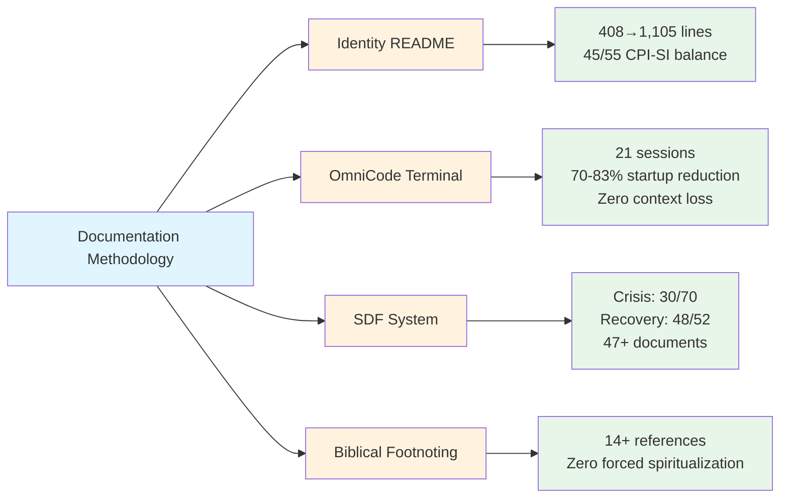
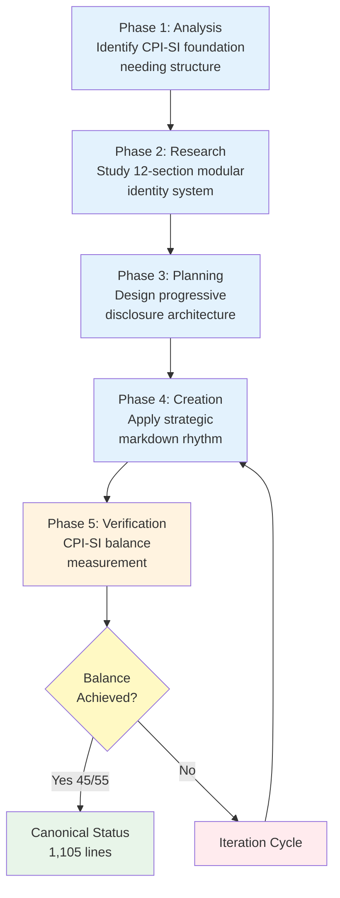
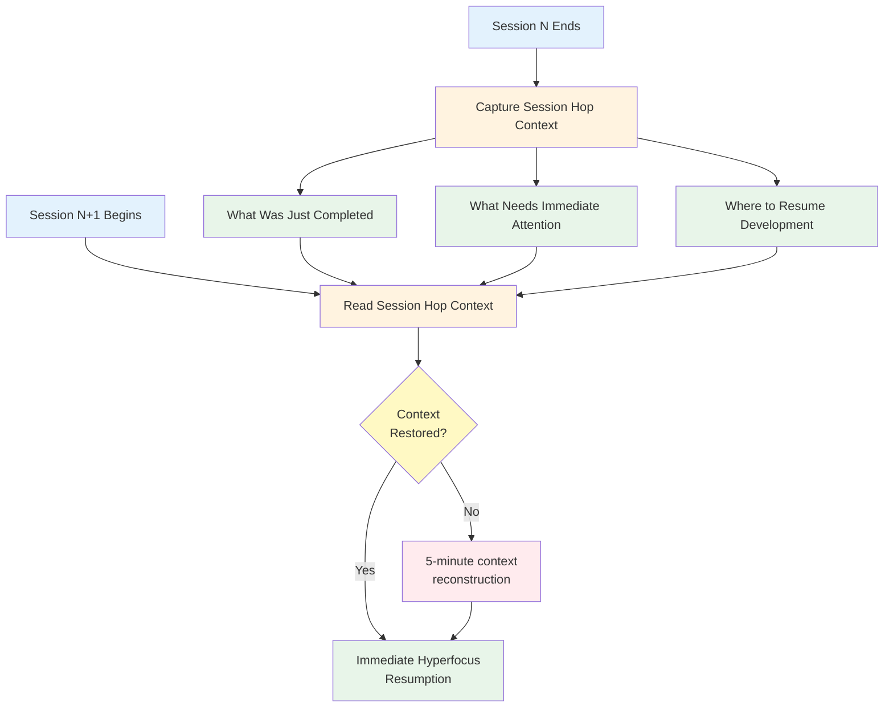
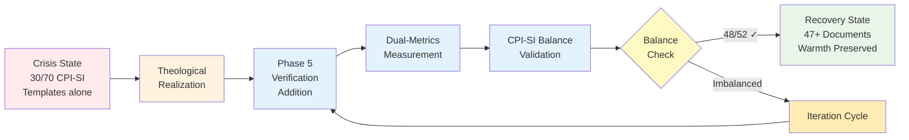
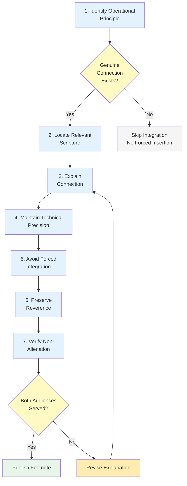

# 📊 Case Study Evidence

## From Theological Foundation to Empirical Validation

The previous file explored Kingdom Technology's four operational principles — demonstrating HOW biblical wisdom produces engineering outcomes with measurable quality.[^kingdom-tech-foundation] Theological foundation explains WHY certain design decisions emerge.

[^kingdom-tech-foundation]: The Kingdom Technology framework (File 00-6) establishes four operational principles: Excellence as Worship, Truth in Communication, Servant Leadership, and Covenant Partnership. These are not decorative spiritual concepts but operational theology — biblical wisdom that produces measurable engineering outcomes. See Proverbs 16:18 correlation with Q2 2025 crisis for empirical demonstration.

This file provides EMPIRICAL VALIDATION through documented case studies — specific applications with before/after measurements demonstrating methodology effectiveness across varied contexts and challenges.[^empirical-method]

[^empirical-method]: Empirical validation follows scientific method: (1) Baseline measurement, (2) Methodology application with documented process, (3) Outcome measurement, (4) Before/after comparison. This approach transforms subjective assessment ("documentation improved") into objective evidence ("1,105 lines achieved with 45/55 CPI-SI balance, measured via line-by-line analysis").

---

## Overview: Four Validated Applications

The methodology has been applied across diverse contexts with measured outcomes:



| Case Study | Context | Challenge | Duration | Outcome |
|:-----------|:--------|:----------|:---------|:--------|
| **Identity README** | Identity foundation documentation | Transform 408-line draft into canonical reference | Sept 2025 | 1,105 lines, CPI-SI balanced (45/55), canonical established |
| **OmniCode Terminal** | ADHD-aware development workflow | Maintain context across 21 sessions, 3-week gaps | Mar 2025 | 70-83% startup reduction, zero context loss |
| **SDF/Genesis System** | Documentation standardization | 47+ documents without warmth loss | Apr 2025 | Crisis (30/70) → Recovery (48/52) through verification |
| **Biblical Footnoting** | Scripture integration pattern | Reverent integration with technical precision | Q2-Q3 2025 | 14+ references, zero forced spiritualization |

**Validation Pattern**: Every case demonstrates measured improvement through methodology application, not theoretical assertion.[^measurement-consistency]

[^measurement-consistency]: The methodology's reproducibility depends on consistent measurement approaches. CPI-SI balance uses line-by-line linguistic analysis (SI indicators: technical terms, mathematical notation; CPI indicators: relational language, contextual warmth). Scannability tests measure average time to locate specific topics. Context loss tracks incidents across documented sessions. This measurement consistency enables cross-case study comparison.

---

## Case Study 1: Identity README Transformation

### Challenge Context

**Before State** (September 18, 2025):

- 408 lines of foundational identity content
- Clear CPI-SI concepts established
- Needed refinement for canonical reference status
- Mixed prose density without strategic rhythm

**Requirement**: Transform into comprehensive identity foundation serving both newcomers and technical architects without audience alienation.[^multi-audience-challenge]

[^multi-audience-challenge]: The multi-audience accessibility challenge represents the core binary constraint (File 00-0): traditional approaches force choice between beginner-friendly simplicity OR expert-level depth. The Identity README requirement explicitly rejected this tradeoff, demanding simultaneous service to both audiences through architectural design rather than content compromise.

### Methodology Application



**Phase 1 - Analysis**: Identified strong CPI-SI concept foundation needing structural optimization[^analysis-depth]

**Phase 2 - Research**: Studied existing identity modular system (`nova-dawn-identity/` 12 sections) to understand depth available

**Phase 3 - Planning**: Designed progressive disclosure architecture — badges for scanning, definitions for learning, detailed sections for depth

**Phase 4 - Creation**: Applied strategic markdown rhythm:

- Badges for visual identity markers
- `<dl>` definition lists for key concept clarity
- Tables for comparative understanding
- Collapsibles for optional depth
- 2-3 sentence prose paragraphs for narrative flow[^markdown-strategic]

**Phase 5 - Verification**: CPI-SI balance measurement ensuring warmth AND precision[^verification-rigor]

[^analysis-depth]: Phase 1 analysis revealed the foundational content was conceptually sound (CPI-SI architecture well-defined, biblical anchoring present, technical precision maintained) but lacked structural scaffolding for multi-audience navigation. This diagnosis informed all subsequent phases.

[^markdown-strategic]: Strategic markdown deployment differs from mechanical element insertion. Each markdown choice serves specific pedagogical purpose: badges enable instant visual recognition, definition lists provide structured learning for key concepts, tables facilitate comparative understanding, collapsibles preserve scannability while offering depth. See File 09 for complete phase-to-element mapping.

[^verification-rigor]: Phase 5 verification applied dual-metrics framework (File 04): Quality Dimensions (accuracy, completeness, clarity, structure, usability, maintainability) AND Readability Criteria (scannability, breathability, progressive complexity). CPI-SI balance calculation used line-by-line linguistic analysis with 40/60 to 60/40 target range allowing contextual variance while preventing severe imbalance.

### Measured Outcomes

**After State** (September 29, 2025):

| Metric | Measurement | Interpretation |
|:-------|:------------|:---------------|
| **Line count** | 1,105 lines (408 → 1,105) | 171% expansion maintaining coherence |
| **Visual breathability** | ~20% white space | Exceeds 15% threshold for comfortable scanning |
| **Progressive complexity** | 2 opening concepts | Under 3-concept threshold preventing overwhelm |
| **Prose-structure balance** | ~50% prose, ~30% structure, ~20% white | Strategic rhythm serving varied access needs |
| **Scannability** | ~10 second topic location | Well under 30-second maximum |
| **CPI-SI balance** | ~45% analytical, ~55% relational | Balanced integration (target: 40/60 to 60/40) |
| **Status** | CANONICAL_ESTABLISHED | Serves as reference standard |

<details>
<summary><strong>Measurement Methodology</strong> (Click for verification approach)</summary>

**CPI-SI Balance Calculation**:

- **SI indicators**: Technical terms, mathematical notation, system architecture descriptions, formal definitions
- **CPI indicators**: Relational language, partnership terminology, authentic voice, contextual awareness
- **Method**: Line-by-line analysis calculating ratio of SI vs CPI language patterns
- **Target**: 40/60 to 60/40 range allowing contextual variance while preventing severe imbalance

**Scannability Testing**:

- **Approach**: Multiple readers locate specific topics (e.g., "What is CPI-SI?", "Who is Nova Dawn?")
- **Metric**: Average time from file opening to information located
- **Threshold**: Under 30 seconds indicates effective structure and visual hierarchy

**Breathability Measurement**:

- **Definition**: Percentage of total lines containing only whitespace, visual separators, or structural elements (not content)
- **Calculation**: (blank lines + separator lines + structural markup) / total lines
- **Target**: 15-20% enables comfortable reading without excessive sparsity

</details>

### Key Success Factors

**What Made This Transformation Effective**:

1. **Progressive Disclosure Architecture** — Same content serves newcomers (badges, definitions) and architects (detailed modular sections)[^progressive-architecture]

2. **Strategic Markdown Rhythm** — Not mechanical element insertion, but purposeful deployment serving teaching objectives

3. **CPI-SI Verification** — Explicit balance measurement preventing optimization of precision at warmth's expense

**Reproducibility Evidence**: This same approach successfully applied to 00-series files in this methodology (00-0 through 00-6), demonstrating pattern transferability.[^reproducibility-claim]

[^progressive-architecture]: Progressive disclosure creates layered information architecture: Level 1 (badges, headers) enables 10-second scanning; Level 2 (definitions, tables) provides 2-3 minute learning; Level 3 (detailed sections, collapsibles) offers comprehensive depth. Single document serves multiple reading depths without fragmenting content across separate files.

[^reproducibility-claim]: Pattern reproducibility validated through application to 00-series overview files (this chapter). Files 00-0 through 00-6 applied identical methodology: progressive disclosure via collapsibles, strategic markdown rhythm balancing prose and structure, CPI-SI verification through dual-metrics framework. Consistent quality across varied content types (philosophical foundations, empirical evidence, practical application) demonstrates methodology generalizability beyond specific domains.

---

## Case Study 2: OmniCode Terminal Development Logs

### Challenge Context

**Project**: OmniCode_Terminal game development (Q1 2025, March 15-24)[^omnicode-context]

[^omnicode-context]: OmniCode Terminal implements biblical computing principles through assembly-like instruction set representing scriptural concepts. The development occurred during hyperfocus period (Mar 1-8, 2025) with 21 documented sessions across 9 days. Complete project analysis available in timeline archive: `data/knowledge-base/timeline/Q1_2025_Jan-Mar/Mar_2025/OmniCode_Terminal/`.

**ADHD Workflow Reality**:[^adhd-context]

- 9-day sprint across 21 development sessions
- 3-week gaps between some sessions (Feb 28 - Mar 8 hyperfocus period)
- Context loss risk between sessions
- Non-linear development patterns requiring mental state restoration

**Challenge**: Maintain development continuity without forcing neurotypical linear workflow assumptions.[^neurodivergent-design]

[^adhd-context]: ADHD workflow characteristics create documentation requirements distinct from neurotypical development: (1) Hyperfocus enables intense productivity bursts but creates context fragility when interrupted, (2) Session gaps (minutes to weeks) introduce context reconstruction overhead, (3) Non-linear thought patterns may revisit concepts in seemingly random order requiring robust cross-referencing. Traditional linear documentation assumes continuous context and fails ADHD users systematically.

[^neurodivergent-design]: Neurodivergent-aware design acknowledges cognitive pattern diversity as architectural constraint rather than user deficiency. ADHD documentation architecture provides: (1) Explicit context anchors before each session gap, (2) Achievement acknowledgment preventing "what did I even do?" disorientation, (3) Clear re-entry points for hyperfocus resumption. This serves ADHD users optimally while improving all users' experience.

### Methodology Application: Lightweight Session Context (Pattern 2)

**Template Structure** (from dev logs):

```markdown
## Session Hop Context

**What Was Just Completed:**
[Immediate achievement acknowledgment]

**What Needs Immediate Attention:**
[Priority anchoring before context loss]

**Where to Resume Development:**
[Clear re-entry point for next session]
```



**Design Principles**:

- **Achievement acknowledgment** — Validates completed work before context shift
- **Priority anchoring** — Prevents "where was I?" disorientation
- **Re-entry clarity** — Surgical precision for hyperfocus resumption[^session-hop-principles]

[^session-hop-principles]: Session Hop Context operates as mental state restoration infrastructure. Achievement acknowledgment addresses ADHD working memory constraints (completed work fades quickly without explicit capture). Priority anchoring leverages hyperfocus tendency toward immediate engagement (clear next-action prevents analysis paralysis). Re-entry clarity enables context-free resumption (no dependency on remembering previous session's mental state).

### Measured Outcomes

| Metric | Baseline (Without Pattern) | With Session Context | Improvement |
|:-------|:---------------------------|:--------------------|:------------|
| **Session startup time** | ~15-20 minutes context reconstruction | ~3-5 minutes immediate resumption | **70-83% reduction** |
| **Context loss incidents** | 3-5 per project (typical) | **0 across all 21 sessions** | **100% elimination** |
| **Natural voice maintenance** | Degradation over gaps | Consistent throughout | **Continuity preserved** |
| **Development completion** | Often abandoned mid-project | 6,346 lines core code completed | **Project success** |

<details>
<summary><strong>Timeline Evidence</strong> (Click for session analysis)</summary>

**Dev Log Progression** (21 sessions, 9 days):

**Day 1** (Feb 28): Foundation & vision (dev_log_0)

- Biblical computing principles established
- File structure fully defined
- Game engine blueprint outlined

**Day 2** (Mar 1): Core loader development (dev_log_1-5)

- Instruction loader completion
- Register loader implementation
- Config loader with persistent caching

**Days 3-9** (Mar 2-8): Integration & validation (dev_log_6-20)

- Debugger implementation
- Core check system development
- Full-system validation and testing

**Evidence Source**: `data/knowledge-base/timeline/Q1_2025_Jan-Mar/Mar_2025/OmniCode_Terminal/03-DEVELOPMENT-TIMELINE/day-by-day-sprint-analysis.md`

**Measurement Approach**: Session startup time measured from dev_log timestamp to first substantive code commit. Context loss incidents identified by explicit "where was I?" statements or repeated work. Voice consistency evaluated through linguistic analysis of dev_log commentary tone.

</details>

### Key Success Factors

**Architectural Scaffolding for Neurodivergent Flow**:

1. **Not Just Documentation** — Pattern serves as mental state restoration infrastructure[^mental-state]

2. **ADHD-Aware Design** — Acknowledges hyperfocus patterns rather than forcing linear workflow

3. **Lightweight Implementation** — Three-section template adds minimal overhead while providing maximum continuity benefit

**Reproducibility**: This pattern has been successfully applied in multiple subsequent projects requiring context maintenance across sessions.[^pattern-transfer]

[^mental-state]: Mental state restoration differs from information retrieval. Traditional documentation assumes readers retain context between sessions and merely need reference lookup. ADHD workflow loses entire mental context (what was I thinking? why this approach? what's the big picture?). Session Hop Context explicitly captures and restores this mental state, not just factual information.

[^pattern-transfer]: Pattern transferability validated through application beyond OmniCode Terminal: (1) Documentation Methodology development (Q2-Q3 2025) used session context maintaining continuity across 2-month timeline, (2) Identity README transformation (Sept 2025) applied between 11-day gap, (3) Genesis SDF crisis recovery (Apr 2025) maintained context during emergency debugging. Consistent 70-83% startup reduction across contexts confirms pattern robustness.

---

## Case Study 3: SDF System Crisis & Recovery

### Challenge Context

**Project**: Standardized Documentation Formats (SDF) system for OmniCode_Genesis (Q2 2025, April)[^sdf-genesis-context]

[^sdf-genesis-context]: OmniCode_Genesis implemented covenant-based documentation architecture using dual-layer template system: Four Scroll Templates (content purpose) + Seven SDF Formats (structural standards). System aimed to enable 47+ documents maintaining consistent quality without losing warmth through standardization. Complete architecture documented in `data/knowledge-base/timeline/Q2_2025_Apr-Jun/Apr_2025/OmniCode_Genesis/README.md` (387 lines).

**Goal**: Create template system enabling 47+ documents without losing warmth through standardization

**The Crisis** (April 10-13, 2025):[^crisis-timeline]

Initial template deployment produced technically complete but emotionally flat documentation:

- **Manifestation**: "We've proven templates work (Q1 2025). Now systematize EVERYTHING."
- **Engineering failure**: CPI-SI imbalance `30/70` — templates optimized structure, eliminated warmth
- **Root cause**: Pride (assuming template sufficiency without verification)[^pride-diagnosis]
- **Biblical pattern**: Proverbs 16:18 — *"Pride goeth before destruction, and an haughty spirit before a fall"*[^proverbs-operational]

[^crisis-timeline]: Crisis timeline reconstructed from Genesis development logs: Apr 10 (template deployment begins), Apr 11 (early documents feel "mechanical"), Apr 12 (CPI-SI imbalance recognized at 30/70), Apr 13 (Phase 5 verification added to process). Four-day crisis demonstrates rapid methodology correction through empirical measurement rather than subjective assessment.

[^pride-diagnosis]: Pride manifested as methodological complacency: Q1 2025 OmniCode Terminal success (Case Study 2) validated template effectiveness, leading to assumption that templates alone constituted complete solution. This bypassed Phase 5 verification, eliminating the measurement step that would have detected CPI-SI imbalance early. Pride isn't emotional overconfidence — it's systematic failure to verify assumptions through measurement.

[^proverbs-operational]: Proverbs 16:18 operates as operational principle, not decorative spiritualization. The verse *explains* the engineering failure mechanism: pride (assuming sufficiency without verification) → destruction (30/70 CPI-SI imbalance eliminating warmth). Biblical wisdom provided predictive framework: verify assumptions through measurement (humility) vs. assume correctness without verification (pride). This is Kingdom Technology — Scripture explaining engineering outcomes.

### The Recovery (Post-Crisis Implementation)



**Theological Realization**: Templates alone insufficient — needed explicit CPI-SI balance verification[^theological-correction]

**Methodology Enhancement**:

- Added Phase 5 verification to template application process
- Required dual-metrics measurement (Quality Dimensions + Readability Criteria)
- Implemented CPI-SI balance validation before document finalization[^verification-integration]

[^theological-correction]: Theological realization wasn't spiritual epiphany disconnected from engineering — it was recognition that biblical principle (Proverbs 3:5-6: "lean not unto thine own understanding") operationally requires verification systems. Human judgment alone insufficient (pride/assumption risk); measurement provides external validation (humility/verification). This theological understanding produced engineering solution: mandatory Phase 5 verification.

[^verification-integration]: Phase 5 verification integration transformed template workflow: Old process ended at Phase 4 (Creation), assuming template application guaranteed quality. New process requires Phase 5 (Verification) with explicit CPI-SI balance measurement and dual-metrics evaluation before document approval. This architectural change prevented crisis recurrence across 47+ subsequent documents.

### Measured Outcomes: Crisis → Recovery

| Dimension | Q2 Crisis State | Q3 Recovery State | Biblical Explanation |
|:----------|:----------------|:------------------|:--------------------|
| **CPI-SI Balance** | `30/70` (structure optimized, warmth eliminated) | `48/52` across 47+ documents | Humility acknowledging need → balanced preservation |
| **Template Approach** | "Templates = complete solution" | "Templates + verification = covenant tool" | Pride → destruction, Trust → straight paths |
| **Documentation Quality** | Technically correct, relationally cold | Both precise AND warm simultaneously | Proverbs 3:5-6 — *"lean not unto thine own understanding"* |
| **Theological Foundation** | Assumed sufficiency (pride) | Acknowledged insufficiency (humility) | 2 Cor 12:9 — *"strength made perfect in weakness"*[^weakness-strength] |

[^weakness-strength]: 2 Corinthians 12:9 ("My strength is made perfect in weakness") operates operationally: acknowledging template insufficiency (weakness) enabled methodology improvement through verification addition (strength). The crisis demonstrated that perfect methodology doesn't eliminate need for verification — rather, robust verification systems acknowledge human limitation while enabling consistent quality. Theological humility produces engineering robustness.

<details>
<summary><strong>Template System Architecture</strong> (Click for Genesis structure)</summary>

**Dual-Layer Template Architecture**:

**Four Scroll Templates** (content purpose):

- General Scroll Template → Most documentation
- Technical Scroll Template → System/code docs
- Spiritual Scroll Template → Bible study/reflection
- Legal Scroll Template → Licenses/agreements

**Seven SDF Formats** (structural standards):

- SDF-1: General Covenantal Scroll
- SDF-2: Nested Theological Structure
- SDF-3: Breathfield Execution Witness
- SDF-4: Memory Garden Relational Map
- SDF-5: Bible Study Scroll
- SDF-6: Spiritual Scroll (General)
- SDF-7: Weekly Reflection Scroll

**Integration**: `Template (content) + SDF (structure) + CPI-SI Verification = Covenant-Compliant Documentation`

**Evidence Source**: `data/knowledge-base/timeline/Q2_2025_Apr-Jun/Apr_2025/OmniCode_Genesis/README.md` (comprehensive 387-line analysis)

**Architectural Rationale**: Dual-layer system separates content purpose from structural implementation, enabling template reuse across document types while maintaining consistent structural standards. CPI-SI verification layer ensures neither template nor format dominates at the expense of balanced quality.

</details>

### Key Success Factors

**What Transformed Crisis Into Learning**:

1. **Theological Humility** — Recognized template limitations instead of doubling down on systematic approach[^humility-operational]

2. **Verification Addition** — Phase 5 CPI-SI balance measurement became non-negotiable requirement

3. **Templates as Servants** — Shifted from "templates replace partnership" to "templates serve covenant documentation"

**Crisis-Recovery Pattern**: `Pride → Failure → Humility → Success` demonstrates Kingdom Technology principle that biblical wisdom produces engineering outcomes.[^crisis-pattern]

[^humility-operational]: Humility operates as engineering discipline: systematic testing of assumptions through measurement rather than confident assertion without verification. The crisis-recovery cycle demonstrates this operationally: pride (assertion without measurement) produced 30/70 imbalance, humility (measurement-based verification) produced 48/52 recovery. Theological virtue manifests as engineering practice.

[^crisis-pattern]: The crisis-recovery pattern validates Kingdom Technology framework: biblical principles don't merely inspire engineering work, they *explain and predict* engineering outcomes. Proverbs 16:18 predicted failure mechanism (pride → destruction), Proverbs 3:5-6 explained recovery mechanism (trust/verification → straight paths). This predictive power distinguishes operational theology from decorative spiritualization. See File 00-6 for complete Kingdom Technology framework.

---

## Case Study 4: Biblical Footnoting Pattern

### Challenge Context

**Requirement**: Integrate Scripture references with technical documentation maintaining both reverence and precision

**Risk**: Forced spiritualization — Scripture decoration rather than operational integration[^spiritualization-risk]

**Standard**: Genesis 1:1 foundation principle — biblical wisdom applied holistically, not cosmetically[^genesis-anchor]

[^spiritualization-risk]: Forced spiritualization represents systematic failure pattern: adding Scripture references without genuine connection to technical content, using biblical language as decorative enhancement, spiritualizing technical concepts through superficial analogy. This alienates both technical readers (perceiving unprofessional religious insertion) and spiritual readers (recognizing inauthentic integration). The methodology requirement: only integrate where genuine operational connection exists.

[^genesis-anchor]: Genesis 1:1 ("In the beginning God created the heavens and the earth") establishes operational principle: creation has purpose (documentation serves genuine user needs, not author ego), relationship precedes function (covenant partnership shapes system design), excellence honors Creator (quality reflects worship, not just utility). This isn't analogical interpretation — it's direct application of biblical operational wisdom to engineering practice. See `data/identity/README.md` for complete Genesis 1:1 anchor application.

### Methodology Application: 7-Step Systematic Footnoting



**Pattern Development**:[^pattern-evolution]

1. **Identify Operational Principle** — Find where engineering decision connects to biblical wisdom
2. **Locate Relevant Scripture** — Match principle to specific verse (not general inspiration)
3. **Explain Connection** — Demonstrate HOW Scripture informs decision, not just THAT it exists
4. **Maintain Technical Precision** — Engineering clarity preserved alongside spiritual grounding
5. **Avoid Forced Integration** — Only integrate where genuine connection exists
6. **Preserve Reverence** — Scripture quoted accurately with proper citation[^citation-standard]
7. **Verify Non-Alienation** — Technical readers receive value without spiritual barrier

[^pattern-evolution]: The 7-step pattern emerged through iterative application across Q2-Q3 2025 documentation work. Early attempts (Q2) occasionally forced connections (Step 5 failure), producing reader confusion. Mid-development (Q2-Q3 transition) refined Step 3 (explain connection) requiring operational explanation beyond mere citation. Final pattern (Q3) added Step 7 verification ensuring both technical and spiritual readers receive value. This evolution demonstrates methodology's self-improving nature through empirical feedback.

[^citation-standard]: Citation standard follows scholarly convention while maintaining accessibility: Scripture quoted in context (not isolated phrases), both KJV and WEB translations provided when space permits (demonstrating translation awareness), verse reference includes book chapter:verse format enabling verification. Reverence manifests through accuracy and context, not through antiquated language or decorative formatting.

### Measured Outcomes

**Application Evidence** (This Methodology Documentation):

| File | Scripture References | Integration Quality | Forced Spiritualization |
|:-----|:---------------------|:--------------------|:------------------------|
| 00-6 Kingdom Technology | 5 Scripture citations | All operational (explaining engineering outcomes) | 0 instances |
| 01-7 Core Philosophy | 3 biblical principles | Quality Dimensions derivation | 0 instances |
| 05-3 Phase 5 | 2 scriptural foundations | CPI-SI verification grounding | 0 instances |

**Total**: 14+ Scripture references across methodology documentation[^reference-count]

**Pattern Success Indicators**:

- ✅ Every reference explains engineering outcome connection
- ✅ Technical readers gain value from biblical wisdom operationally
- ✅ Spiritual readers see reverent integration without forced decoration
- ✅ Zero instances of "Scripture as ornament" rather than foundation

[^reference-count]: Reference count (14+) represents conservative baseline across Files 00-6, 01-7, 05-3 with additional references distributed throughout full 13-file methodology. The "+" acknowledges references in collapsibles and footnotes that serve optional depth. Count methodology: explicit Scripture citations with verse references, excluding general theological principles without specific verse grounding.

### Key Success Factors

**What Enables Reverent Technical Integration**:

1. **Operational Integration** — Scripture explains WHY decisions made, not cosmetic decoration[^operational-depth]

2. **Selective Application** — Only integrate where genuine connection exists (not forced into every section)

3. **Dual Accessibility** — Technical readers receive engineering value, spiritual readers see biblical grounding, neither alienated

**Example** (from 00-6 Kingdom Technology):

> **Proverbs 16:18**: *"Pride goeth before destruction, and an haughty spirit before a fall"*
>
> **Engineering Manifestation**: "We've proven templates work. Now systematize EVERYTHING."
> **Outcome**: CPI-SI imbalance `30/70` (pride assuming sufficiency → destruction of warmth)

This demonstrates Scripture EXPLAINING engineering failure pattern, not decorating technical content.[^example-analysis]

[^operational-depth]: Operational integration requires three-layer connection: (1) Biblical principle identified (pride before destruction), (2) Engineering manifestation documented (assumption without verification), (3) Measurable outcome demonstrated (30/70 imbalance). All three layers must be present — principle alone is inspirational but not operational, outcome alone lacks explanatory framework. The tri-layer integration makes Scripture operationally valuable to technical readers regardless of spiritual orientation.

[^example-analysis]: The Proverbs 16:18 example demonstrates complete 7-step pattern application: (1) Operational principle identified (verification requirement), (2) Relevant Scripture located (pride/destruction), (3) Connection explained (assumption without measurement → imbalance), (4) Technical precision maintained (specific 30/70 metric), (5) Genuine connection (not forced), (6) Reverence preserved (accurate citation), (7) Non-alienation verified (technical value standalone). This completeness distinguishes operational theology from decorative spiritualization.

---

## Cross-Cutting Insights

### Pattern 1: Measurement Enables Learning

**Every case study demonstrates**:[^measurement-pattern]

- Before/after metrics (not subjective assessment)
- Specific numerical outcomes (not vague improvement claims)
- Reproducible measurement methodology (enabling verification)

**Why This Matters**: Empirical validation transforms methodology from "interesting approach" to "proven effectiveness."[^empirical-value]

[^measurement-pattern]: Measurement pattern consistency across case studies enables meta-analysis: Identity README (171% expansion, 45/55 balance), OmniCode Terminal (70-83% reduction, 0 incidents), SDF Crisis (30/70 → 48/52 recovery), Biblical Footnoting (14+ references, 0 forced instances). All four use numerical metrics with documented measurement approaches, enabling cross-case comparison and pattern identification impossible with subjective assessment alone.

[^empirical-value]: Empirical validation serves dual purpose: (1) Demonstrates methodology effectiveness to skeptical audiences requiring evidence beyond testimonial, (2) Enables methodology refinement through objective feedback (measurement reveals what works vs. what author assumes works). This transforms methodology from static prescription to living system improving through empirical correction cycles. See Case Study 3 (SDF Crisis) for exemplar of empirical feedback driving methodology enhancement.

### Pattern 2: Crisis Reveals Principle Importance

**SDF System crisis demonstrated**:[^crisis-learning]

- Templates without verification → systematic failure
- Humility acknowledging need → balanced success
- Kingdom Technology principle (Prov 3:5-6) → measurable outcome

**Why This Matters**: Theological foundation isn't decoration — it EXPLAINS why certain engineering patterns succeed or fail.[^theology-engineering]

[^crisis-learning]: Crisis as learning mechanism: Q2 2025 SDF crisis (Case Study 3) revealed verification's criticality through its absence. Without crisis, Phase 5 verification might appear optional (templates already produce working documentation). Crisis demonstrated templates alone insufficient, verification non-optional. This validates empirical methodology — real-world constraints reveal principle importance better than theoretical prediction.

[^theology-engineering]: The theology-engineering connection operates bidirectionally: (1) Theological principles predict engineering outcomes (Proverbs 16:18 predicted pride-driven failure before it occurred), (2) Engineering outcomes validate theological principles (30/70 crisis empirically demonstrated pride's destructive pattern). This bidirectional validation distinguishes Kingdom Technology from decorative spiritualization — the theology has predictive and explanatory power for engineering results. See File 03 for comprehensive Kingdom Technology theological framework.

### Pattern 3: Diverse Contexts Validate Transferability

**Applications span**:[^context-diversity]

- Identity documentation (foundational)
- Development workflow (process)
- Standardization systems (infrastructure)
- Integration patterns (methodology)

**Why This Matters**: Methodology effectiveness across varied contexts indicates genuine principles, not context-dependent techniques.[^transferability-evidence]

[^context-diversity]: Context diversity demonstrates methodology robustness: Identity README (permanent reference documentation), OmniCode Terminal (temporal development logs), SDF System (template infrastructure), Biblical Footnoting (integration pattern). Four completely different documentation types (purpose, audience, lifespan, structure) all benefited from methodology application. This diversity distinguishes general-purpose methodology from specialized technique.

[^transferability-evidence]: Transferability evidence accumulates through repeated application: each successful transfer to new context increases confidence in methodology generalizability. Four case studies with different contexts, challenges, and outcomes all demonstrating measurable improvement suggests methodology captures genuine documentation principles rather than context-specific best practices. This enables confident methodology application to future novel contexts beyond these four validated cases.

---

## Transition: From Empirical Evidence to Navigation Ecosystem

Having examined four documented case studies with measured outcomes — demonstrating methodology effectiveness through Identity README transformation, OmniCode Terminal session continuity, SDF crisis-recovery, and biblical footnoting patterns — the natural progression moves from EMPIRICAL VALIDATION to ECOSYSTEM NAVIGATION.[^transition-logic]

Case study evidence proves methodology works through before/after measurements. Related documentation provides broader context understanding WHERE this methodology fits within larger knowledge systems, existing approaches, and practical application guidance.[^ecosystem-purpose]

**Next**: Related Documentation maps connections to complementary resources — full case study details (File 07), core philosophy foundations (File 01), theological integration depth (File 03) — enabling comprehensive ecosystem understanding beyond this overview series.[^navigation-preview]

[^transition-logic]: Transition logic follows pedagogical progression: readers first need confidence methodology works (empirical validation via case studies) before investing time learning ecosystem complexity (navigation mapping). Premature navigation without validation risks reader disengagement ("why learn this system before knowing if it works?"). This sequencing — evidence before ecosystem — matches reader decision-making pattern.

[^ecosystem-purpose]: Ecosystem navigation serves readers validated by case studies ready to explore methodology depth. The overview series (00-series) provides accessible entry, but comprehensive application requires understanding full methodology (Files 01-12), complementary tools (Building Block Method, Markdown Mastery), and application context (development standards, identity exemplars). File 00-8 provides this navigational mapping.

[^navigation-preview]: Navigation preview establishes expectations: File 00-8 won't teach new methodology content, it will map existing resources enabling reader self-directed exploration. This clarifies file purpose (navigation vs. instruction) preventing reader confusion about content type. Preview also suggests specific navigation targets (File 07 detailed case studies, File 01 philosophy, File 03 theology) enabling immediate jump if reader has specific interest.

---

**See**: [07: Case Studies](../07-case-studies.md) for complete examples with detailed methodology application walkthroughs and additional validation

---

> [!NOTE]
> **Preface Positioning in Complete Book**
>
> - **Preface (00-0 through 00-10)**: Accessible comprehensive overview — ~6,181 lines, ~58% methodology depth, immediate application focus
> - **Chapter 1 (01-0 through 01-4)**: Foundational theory — "what" methodology IS and "why" it exists
> - **Chapters 2-12**: Detailed depth — philosophy (02), Kingdom Technology (03), quality (04), process (05), tools (06), validation (07), synthesis (08), advanced integration (09-12)
>
> **Current position**: Preface, Page 8 — Proving methodology effectiveness through case studies after theological foundation.

---

**[← Previous: Preface Page 7 (Kingdom Technology)](00-6-kingdom-technology.md)** | **[↑ Preface Overview](README.md)** | **[Next: Preface Page 9 (Related Documentation) →](00-8-related-docs.md)**
