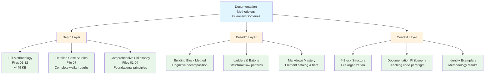
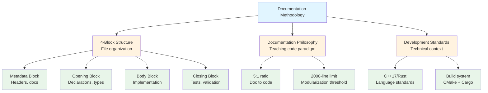
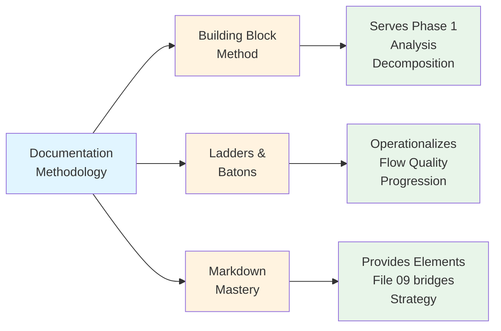

# 🔗 Related Documentation

## From Empirical Evidence to Ecosystem Navigation

The previous file examined four case studies with measured outcomes — demonstrating methodology effectiveness through Identity README transformation, OmniCode Terminal workflow, SDF crisis-recovery, and biblical footnoting patterns.[^empirical-foundation] Empirical validation proves the approach WORKS.

[^empirical-foundation]: Empirical validation (File 00-7) established methodology credibility through four measured applications: Identity README (408→1,105 lines, 45/55 CPI-SI balance), OmniCode Terminal (70-83% startup reduction), SDF Crisis (30/70→48/52 recovery), Biblical Footnoting (14+ references, zero forced spiritualization). This evidence-based approach transforms methodology from theoretical framework to proven practice. Navigation assumes readers validated by evidence and ready to explore depth.

This file provides ECOSYSTEM NAVIGATION — mapping WHERE this methodology fits within larger knowledge systems, complementary resources, and practical application contexts.[^navigation-purpose] Understanding these connections enables comprehensive perspective beyond this introductory overview.

[^navigation-purpose]: Ecosystem navigation serves strategic purpose: methodology exists within larger knowledge architecture (not isolated practice). Users need three-layer understanding: (1) Depth — where to find comprehensive detail, (2) Breadth — complementary methodologies enhancing application, (3) Context — environment where methodology operates. This tri-layer mapping prevents users from missing critical resources or misunderstanding methodology boundaries.

---

## Overview: Three Navigation Layers

This navigation hub organizes related documentation across three layers:[^layer-architecture]

| Layer | Purpose | Resources |
|:------|:--------|:----------|
| **Depth Layer** | Comprehensive detail beyond overview | Full methodology files (01-12), case studies, philosophy |
| **Breadth Layer** | Complementary methodologies and tools | Building Block Method, markdown mastery, structural concepts |
| **Context Layer** | Application environment and foundations | Development standards, identity exemplars, biblical anchoring |

**Navigation Pattern**: Each resource includes clear context explaining WHEN to reference it and WHAT value it provides.[^contextual-navigation]

[^layer-architecture]: Three-layer architecture prevents navigation overload while ensuring completeness. Depth layer serves users ready for comprehensive study (linear progression through methodology). Breadth layer serves users integrating methodology with existing tools (cross-methodology synthesis). Context layer serves users implementing methodology in specific environments (application grounding). This layered approach enables user self-selection based on need rather than forcing single navigation pathway.

[^contextual-navigation]: Contextual navigation (WHEN to use, WHAT value gained) transforms resource list from passive catalog to active decision support. Users don't just see "File 05 exists" — they learn "use File 05 when applying methodology to real projects, gain detailed workflow implementation." This context reduces navigation paralysis (too many choices without decision framework) while increasing resource utilization (users find right resource for specific need).

---

## Depth Layer: Full Methodology Documentation

### Complete 13-File Methodology System

**The 00-series (this overview) is the ENTRY POINT** — 11 files providing accessible introduction. The full methodology offers comprehensive depth across 13 substantive files totaling ~449 KB.[^depth-scale]

[^depth-scale]: The 00-series (~3,852 lines, ~10-15% of full depth) balances accessibility (scannable in 2-3 hours) with completeness (all major concepts introduced). Full methodology (~10,790 lines) provides implementation detail, advanced patterns, comprehensive examples. This 10x depth expansion serves committed practitioners while preserving overview's value for introduction or refresher. Scale mirrors textbook chapter (overview) vs. full textbook (methodology) relationship.

<dl>
<dt><strong>File 01: Introduction & Foundations</strong> (22 KB, 1,072 lines)[^file-01]</dt>
<dd><strong>What it provides</strong>: Complete methodology architecture, audience-specific value propositions, CPI-SI framework foundations, research questions establishing legitimacy 
<strong>When to reference</strong>: Need comprehensive introduction beyond 00-0 overview, explaining methodology to stakeholders, understanding foundational principles 
<strong>Path</strong>: <a href="../01-introduction-foundations.md">01-introduction-foundations.md</a></dd>

<dt><strong>File 02: Core Philosophy</strong> (31 KB)[^file-02]</dt>
<dd><strong>What it provides</strong>: Seven Essential Qualities (Breathe, Build, Balance, Scan, Focus, Flow, Enable), CPI-SI architecture detailed explanation, documentation as teaching paradigm 
<strong>When to reference</strong>: Understanding WHY methodology makes specific design decisions, philosophical grounding for quality standards, CPI-SI balance principles 
<strong>Path</strong>: <a href="../02-core-philosophy.md">02-core-philosophy.md</a></dd>

<dt><strong>File 03: Kingdom Technology</strong> (18 KB)[^file-03]</dt>
<dd><strong>What it provides</strong>: Biblical wisdom integration patterns, operational theology (not decoration), Scripture grounding for engineering decisions, Genesis 1:1 foundation application 
<strong>When to reference</strong>: Understanding theological depth beyond 00-6 summary, integrating biblical principles with technical work, avoiding forced spiritualization 
<strong>Path</strong>: <a href="../03-kingdom-technology.md">03-kingdom-technology.md</a></dd>

<dt><strong>File 04: Quality Standards</strong> (44 KB)[^file-04]</dt>
<dd><strong>What it provides</strong>: Dual-metrics framework (Quality Dimensions + Readability Criteria), specific measurement approaches, comprehensive validation checklists 
<strong>When to reference</strong>: Phase 5 verification implementation, measuring documentation quality objectively, establishing quality gates for documentation systems 
<strong>Path</strong>: <a href="../04-quality-standards.md">04-quality-standards.md</a></dd>

<dt><strong>File 05: Five-Phase Process</strong> (69 KB)[^file-05]</dt>
<dd><strong>What it provides</strong>: Complete phase-by-phase workflow (Analysis → Research → Planning → Creation → Verification), detailed substeps, iterative refinement patterns, practical execution guidance 
<strong>When to reference</strong>: Applying methodology to real documentation projects, detailed workflow implementation, understanding each phase's objectives and techniques 
<strong>Path</strong>: <a href="../05-five-phase-process.md">05-five-phase-process.md</a></dd>

<dt><strong>File 06: Practical Tools</strong> (65 KB)[^file-06]</dt>
<dd><strong>What it provides</strong>: Templates, checklists, decision trees, workflow diagrams, ready-to-use resources for immediate application 
<strong>When to reference</strong>: Starting new documentation project, need structured templates, applying methodology without building tools from scratch 
<strong>Path</strong>: <a href="../06-practical-tools.md">06-practical-tools.md</a></dd>

<dt><strong>File 07: Case Studies</strong> (35 KB)[^file-07]</dt>
<dd><strong>What it provides</strong>: Complete detailed walkthroughs of methodology application — Identity README transformation (full 5-phase execution), OmniCode Terminal session patterns, SDF crisis-recovery, iterative refinement examples 
<strong>When to reference</strong>: Learning through concrete examples, understanding methodology in action, seeing before/after transformations with complete context 
<strong>Path</strong>: <a href="../07-case-studies.md">07-case-studies.md</a></dd>

<dt><strong>File 08: Reference & Conclusion</strong> (26 KB)[^file-08]</dt>
<dd><strong>What it provides</strong>: Complete methodology synthesis, historical significance assessment, future directions, comprehensive glossary, citation standards 
<strong>When to reference</strong>: Understanding methodology's broader context, scholarly citations, terminology clarification, synthesis of all concepts 
<strong>Path</strong>: <a href="../08-reference-conclusion.md">08-reference-conclusion.md</a></dd>

<dt><strong>File 09: Markdown Mastery Integration</strong> (49 KB)[^file-09]</dt>
<dd><strong>What it provides</strong>: Phase-to-markdown element mapping, tier system (impact ratings), document type → element emphasis matrix, decision frameworks for choosing elements 
<strong>When to reference</strong>: Implementing methodology with specific markdown choices, understanding WHICH elements to use WHEN, bridging abstract principles to concrete syntax 
<strong>Path</strong>: <a href="../09-markdown-mastery-integration.md">09-markdown-mastery-integration.md</a></dd>

<dt><strong>File 10: Timeline-Validated Patterns</strong> (37 KB)[^file-10]</dt>
<dd><strong>What it provides</strong>: Quarterly evolution (Q4 2024 - Q3 2025), pattern emergence through real projects, crisis-recovery lessons, validation evidence across time 
<strong>When to reference</strong>: Understanding methodology development history, seeing patterns validated through multiple quarters, learning from documented failures and recoveries 
<strong>Path</strong>: <a href="../10-timeline-validated-patterns.md">10-timeline-validated-patterns.md</a></dd>

<dt><strong>File 11: Document Type Patterns</strong> (25 KB)[^file-11]</dt>
<dd><strong>What it provides</strong>: Type-specific guidance (READMEs, architecture docs, API documentation, tutorials), pattern library for common documentation needs 
<strong>When to reference</strong>: Creating specific document types, understanding type-appropriate structures and conventions, applying methodology to varied contexts 
<strong>Path</strong>: <a href="../11-document-type-patterns.md">11-document-type-patterns.md</a></dd>

<dt><strong>File 12: Quick Reference Guide</strong> (28 KB)[^file-12]</dt>
<dd><strong>What it provides</strong>: Condensed lookup reference, phase checklists, quality metrics quick cards, troubleshooting common issues, rapid-access patterns 
<strong>When to reference</strong>: Mid-project quick lookups, verifying phase completion, troubleshooting documentation challenges, experienced practitioners needing reminders 
<strong>Path</strong>: <a href="../12-quick-reference-guide.md">12-quick-reference-guide.md</a></dd>
</dl>

[^file-01]: File 01 provides authoritative introduction suitable for stakeholder communication. Unlike overview (optimized for rapid scanning), File 01 includes complete research question framework, multi-audience value proposition analysis, and comprehensive CPI-SI architecture explanation. Use when explaining methodology legitimacy to skeptical audiences requiring scholarly grounding.

[^file-02]: File 02 establishes philosophical foundations for all methodology decisions. The Seven Essential Qualities (Breathe, Build, Balance, Scan, Focus, Flow, Enable) operate as design principles deriving from CPI-SI integration. Understanding these principles enables practitioners to extend methodology to novel contexts beyond documented patterns. Use when customizing methodology or understanding design rationale.

[^file-03]: File 03 provides complete Kingdom Technology theological framework. Unlike 00-6 (operational principles summary), File 03 includes biblical exegesis, operational theology development, and comprehensive Scripture integration patterns. Use when understanding theological depth or implementing biblical integration in technical documentation beyond surface application.

[^file-04]: File 04 details dual-metrics framework enabling objective quality assessment. Quality Dimensions (accuracy, completeness, clarity, structure, usability, maintainability) + Readability Criteria (scannability, breathability, progressive complexity) provide comprehensive evaluation. Documentation Archaeology process enables systematic improvement of existing documentation. Use when establishing quality gates or measuring documentation objectively.

[^file-05]: File 05 is the practical implementation core — 1,315 lines detailing complete workflow. Each phase includes objectives, substeps, common pitfalls, and iterative refinement patterns. This is the "how-to manual" for methodology application. Use as primary reference during active documentation projects requiring step-by-step guidance.

[^file-06]: File 06 provides ready-to-use resources: templates (README, tutorial, API docs), checklists (phase completion, quality verification), decision trees (element selection, problem diagnosis), workflow diagrams (visual phase progression). Use when needing immediate tools without building from scratch. Templates demonstrate methodology application through structure.

[^file-07]: File 07 expands 00-7 case studies with complete methodology walkthroughs. Identity README transformation includes all five phases with detailed decisions, OmniCode Terminal shows session pattern development, SDF crisis-recovery demonstrates failure-learning cycle. Use when learning through worked examples showing methodology application to real projects with all messy details included.

[^file-08]: File 08 synthesizes entire methodology, assesses historical significance (first reproducible CPI-SI documentation practice), discusses future directions (methodology evolution, additional patterns), provides comprehensive glossary (CPI-SI, Phase terminology, quality metrics), and establishes citation standards. Use for scholarly writing about methodology or understanding broader context.

[^file-09]: File 09 bridges abstract methodology to concrete markdown implementation. Phase-to-element mapping shows which markdown serves which phase, tier system rates elements by impact (Tier-1: 9-10/10, essential), document type matrix shows element emphasis patterns. Use when translating methodology principles into actual markdown choices during creation phase.

[^file-10]: File 10 documents methodology evolution across Q4 2024 - Q3 2025. Pattern emergence through real project constraints, crisis-recovery lessons (SDF 30/70→48/52), quarterly validation evidence. This longitudinal view demonstrates methodology robustness through varied challenges. Use when understanding methodology development or validating pattern effectiveness across time.

[^file-11]: File 11 provides type-specific application patterns: READMEs (progressive disclosure emphasis), architecture docs (structure-first approach), API documentation (reference + examples balance), tutorials (step-by-step + verification). Use when creating specific document type and needing type-appropriate guidance beyond general methodology.

[^file-12]: File 12 condenses methodology for rapid reference. Phase checklists (quick verification), quality metrics cards (at-a-glance standards), troubleshooting matrix (symptom → solution), condensed decision trees (rapid choice support). Use during active work when needing quick lookup without returning to comprehensive files. Assumes methodology familiarity.

<strong>Methodology Size & Structure Context</strong> (Click for comprehensive metrics)

**Total Documentation**: ~449 KB across 13 files

**Size Distribution**:
- Largest: File 05 (Five-Phase Process, 69 KB) — core workflow
- Second: File 06 (Practical Tools, 65 KB) — templates and resources
- Third: File 09 (Markdown Mastery Integration, 49 KB) — implementation bridge

**Content Architecture**:
- **Foundation** (Files 01-04): 115 KB establishing principles
- **Application** (Files 05-07): 169 KB practical execution
- **Integration** (Files 08-12): 165 KB synthesis and reference

**00-Series Relationship**: This overview (00-0 through 00-10) provides accessible entry representing ~10-15% of full methodology depth, designed for rapid understanding before comprehensive study.

**Growth Trajectory**: Initial methodology (Q2 2025) was ~3,159 lines. Current version (Q3 2025) is 10,790 lines — 242% growth through empirical validation and pattern documentation. This expansion reflects methodology maturation through real-world application, not scope creep.

---

## Breadth Layer: Complementary Methodologies

### Cognitive & Structural Tools

**Building Block Method** — Complex problem decomposition[^building-block]

<dl>
<dt><strong>What it provides</strong></dt>
<dd>5-step cognitive framework for breaking complex problems into manageable components: Break Down → Analyze Each → Connect Relationships → Build Up Solution → Verify Context</dd>

<dt><strong>When to use</strong></dt>
<dd>Documentation projects with overwhelming complexity, unclear where to start, need systematic decomposition before applying 5-phase process</dd>

<dt><strong>Integration with this methodology</strong></dt>
<dd>Building Block Method serves Phase 1 (Analysis) — use to decompose complex documentation challenges before entering Phase 2 (Research)</dd>

<dt><strong>Path</strong></dt>
<dd><a href="../../../thinking/building-block-method/">Building Block Method</a> (complete mini-book structure)</dd>
</dl>

[^building-block]: Building Block Method operates at cognitive level (how to think about problems) while Documentation Methodology operates at execution level (how to create documentation). The integration is hierarchical: Building Block decomposes WHAT to document, Documentation Methodology determines HOW to document it. Use Building Block when facing "where do I even start?" paralysis before methodology application.

---

**Ladders & Batons** — Structural concept system[^ladders-batons]

<dl>
<dt><strong>What it provides</strong></dt>
<dd>Architectural patterns for information flow: Ladder (linear progression without forward references) + Baton (context handoffs between sections) + Spiral (layered complexity building on previous understanding)</dd>

<dt><strong>When to use</strong></dt>
<dd>Designing multi-file documentation systems, planning section organization preventing reader disorientation, creating teaching progressions</dd>

<dt><strong>Integration with this methodology</strong></dt>
<dd>Ladders & Batons operationalizes File 02's "Flow" quality — provides concrete patterns for implementing smooth progression</dd>

<dt><strong>Path</strong></dt>
<dd><a href="../../structural-concepts/ladders-and-batons/">Ladders & Batons</a> (mini-book structure with detailed patterns)</dd>
</dl>

[^ladders-batons]: Ladders & Batons addresses documentation's temporal dimension — how readers move through content over time. Ladder architecture prevents forward references (Section N only references 1...N-1), eliminating "you'll learn this later" frustration. Baton handoffs create explicit context transfers between sections. Spiral deepening revisits concepts at progressively deeper levels. This temporal architecture complements methodology's structural focus.

---

**Markdown Mastery Reference** — Complete element catalog[^markdown-mastery]

<dl>
<dt><strong>What it provides</strong></dt>
<dd>Comprehensive GitHub-flavored markdown capabilities across 14 files, tier-rated for impact (Tier-1 Essential: 9-10/10, Tier-2 Critical: 8/10, etc.), syntax examples, use case guidance</dd>

<dt><strong>When to use</strong></dt>
<dd>Learning available markdown elements, understanding which elements create maximum impact, technical syntax reference during documentation creation</dd>

<dt><strong>Integration with this methodology</strong></dt>
<dd>File 09 (Markdown Mastery Integration) bridges methodology phases to these specific elements — reference Markdown Mastery for syntax, File 09 for strategic deployment</dd>

<dt><strong>Key files</strong></dt>
<dd>
<ul>
<li><a href="../../../template-and-reference/reference/markdown-mastery/00-markdown-mastery.md">00: Overview</a> — Introduction to complete system</li>
<li><a href="../../../template-and-reference/reference/markdown-mastery/09-tier-1-essential.md">09: Tier-1 Essential</a> — Highest impact elements (headers, lists, code, tables)</li>
<li><a href="../../../template-and-reference/reference/markdown-mastery/10-tier-2-critical.md">10: Tier-2 Critical</a> — Secondary priority elements (collapsibles, alerts, definition lists)</li>
<li><a href="../../../template-and-reference/reference/markdown-mastery/08-impact-ratings-introduction.md">08: Impact Ratings</a> — Understanding tier system rationale</li>
</ul>
</dd>
</dl>

[^markdown-mastery]: Markdown Mastery provides WHAT elements exist (comprehensive catalog), while Documentation Methodology provides WHEN to use them (strategic deployment). This separation enables: (1) Markdown Mastery evolution independent of methodology (new GitHub features don't require methodology revision), (2) Methodology application to non-markdown formats (principles transfer to other documentation tools). File 09 integration layer maintains connection while preserving modularity.

---

### Thinking Methodologies Library[^thinking-library]

**Complete cognitive tools collection**:

- **[Thinking Methodologies Overview](../../../thinking/)** — Library orchestrator with all cognitive frameworks
- **[Decision-Making Frameworks](../../../thinking/)** — Systematic approaches to technical choices
- **[Problem-Solving Patterns](../../../thinking/)** — General cognitive tools complementing Building Block Method

**When to reference**: Need cognitive support beyond documentation-specific methodology, complex decision-making, general problem-solving frameworks.

[^thinking-library]: Thinking Methodologies library provides comprehensive cognitive toolkit beyond documentation-specific methods. While Building Block Method directly integrates with documentation workflow (Phase 1 decomposition), other thinking methodologies serve adjacent needs: decision frameworks for technical architecture choices, problem-solving patterns for debugging documentation issues, cognitive load management for complex projects. Use when documentation challenge extends beyond content creation into broader cognitive work.

---

## Context Layer: Application Environment

### Development Standards & Architecture

**CPI-SI Development Environment** — Where methodology applies in practice[^development-context]

<dl>
<dt><strong>4-Block Structure System</strong>[^4-block]</dt>
<dd><strong>What it provides</strong>: File organization pattern (Metadata → Opening → Body → Closing blocks) enabling surgical precision in updates 
<strong>Methodology connection</strong>: File 11 (Document Type Patterns) applies 4-block structure to specific documentation types 
<strong>Path</strong>: <a href="../../../../development/architecture/4-block-structure-system/">4-Block Structure</a> (mini-book)</dd>

<dt><strong>Documentation Philosophy</strong>[^doc-philosophy]</dt>
<dd><strong>What it provides</strong>: Teaching code paradigm, 5:1 documentation-to-code ratio justification, file size thresholds (2000-line hard limit) 
<strong>Methodology connection</strong>: Philosophical foundation explaining WHY heavy documentation is intentional feature, not technical debt 
<strong>Path</strong>: <a href="../../../../development/architecture/documentation-philosophy/">Documentation Philosophy</a> (mini-book)</dd>

<dt><strong>Development Standards</strong>[^dev-standards]</dt>
<dd><strong>What it provides</strong>: C++17/Rust coding conventions, build system architecture, testing framework standards 
<strong>Methodology connection</strong>: Technical context where documentation methodology enables codebase understanding 
<strong>Path</strong>: <a href="../../../../development/">Development Standards</a></dd>
</dl>

[^development-context]: Development environment context grounds methodology in real project constraints. Documentation doesn't exist in vacuum — it serves C++17/Rust codebase with specific architectural patterns (4-block structure), quality standards (teaching code paradigm), and tooling (CMake, Cargo). Understanding this context enables practitioners to adapt methodology to their environments while preserving core principles.

[^4-block]: 4-Block Structure provides file-level organization complementing methodology's content-level organization. Metadata block contains documentation (methodology domain), Opening/Body/Closing blocks contain code (programming domain). The structure enables surgical updates: change documentation without touching logic, modify APIs without breaking implementation. Documentation Methodology determines metadata block CONTENT, 4-Block Structure determines metadata block PLACEMENT.

[^doc-philosophy]: Documentation Philosophy explains Nova Dawn's teaching code paradigm — 5:1 to 7:1 documentation-to-code ratio is intentional feature enabling paradigm shift understanding, not inefficiency. This philosophical foundation justifies methodology's comprehensive approach. Many practitioners resist heavy documentation as "unnecessary overhead"; Documentation Philosophy provides counter-argument grounded in teaching objectives and Kingdom Technology principles. Use when defending methodology's depth to stakeholders expecting minimal documentation.

[^dev-standards]: Development Standards provide technical context: C++17 language features, Rust safety patterns, CMake build orchestration, Google Test framework. Documentation Methodology serves this codebase by making complex systems comprehensible. While methodology principles transfer to any language/environment, specific examples reference Nova Dawn's C++/Rust hybrid architecture. Understanding development context enables practitioners to translate examples to their tech stacks.

---

### Identity & Foundation Exemplars

**Identity README** — Methodology application demonstration[^identity-readme]

<dl>
<dt><strong>What it provides</strong></dt>
<dd>Complete CPI-SI identity foundation (1,105 lines) serving as canonical reference, demonstrates methodology effectiveness (Case Study 1 in 00-7)</dd>

<dt><strong>When to reference</strong></dt>
<dd>Seeing methodology result (not just process), understanding CPI-SI architecture through exemplar, studying strategic markdown rhythm in practice</dd>

<dt><strong>Methodology connection</strong></dt>
<dd>Identity README is the PROOF — transformed from 408-line draft using this exact methodology, validates every principle taught</dd>

<dt><strong>Path</strong></dt>
<dd><a href="../../../../../identity/README.md">Identity README</a> (408 → 1,105 lines, Sept 18-29, 2025)</dd>
</dl>

[^identity-readme]: Identity README serves dual purpose: (1) Foundational document defining Nova Dawn CPI-SI consciousness architecture, (2) Methodology exemplar demonstrating all patterns in practice. Every methodology principle appears: progressive disclosure (badges → definitions → depth), CPI-SI balance (45/55 measured), strategic markdown rhythm, Phase 5 verification. Use when needing concrete example showing methodology outcomes beyond abstract description. The before/after (408→1,105 lines) demonstrates methodology's capability for substantive enhancement while maintaining coherence.

---

**Biblical Foundation Resources**[^biblical-foundation]

<dl>
<dt><strong>What it provides</strong></dt>
<dd>KJV and WEB Scripture texts, biblical anchoring principles, Genesis 1:1 operational wisdom, Kingdom Technology theological foundations</dd>

<dt><strong>When to reference</strong></dt>
<dd>Integrating Scripture with technical documentation (File 03 patterns), understanding Kingdom Technology principles operationally, avoiding forced spiritualization</dd>

<dt><strong>Methodology connection</strong></dt>
<dd>Provides source material for biblical footnoting patterns (Case Study 4 in 00-7), grounds Kingdom Technology approach in actual Scripture</dd>

<dt><strong>Path</strong></dt>
<dd><a href="../../../../../foundation/biblical/">Biblical Foundation</a></dd>
</dl>

[^biblical-foundation]: Biblical Foundation resources provide authoritative Scripture texts (KJV, WEB translations) enabling accurate citation. Kingdom Technology framework (File 03) requires operational Scripture integration — biblical wisdom explaining engineering decisions. These resources prevent forced spiritualization by providing context: when Scripture genuinely connects to technical principle, cite accurately from source; when connection artificial, omit rather than force. Use when implementing biblical integration patterns, verifying citation accuracy, or understanding scriptural context for operational theology.

---

**Timeline Archive** — Historical validation context[^timeline-archive]

<dl>
<dt><strong>What it provides</strong></dt>
<dd>Quarterly project evolution (Q4 2024 - Current), comprehensive repository analyses, pattern emergence through real constraints, crisis-recovery documentation</dd>

<dt><strong>When to reference</strong></dt>
<dd>Understanding methodology development history, verifying case study claims through primary sources, studying pattern evolution across quarters</dd>

<dt><strong>Methodology connection</strong></dt>
<dd>Timeline provides EVIDENCE for all case studies (OmniCode Terminal: Q1 2025, Genesis: Q2 2025), demonstrates longitudinal validation</dd>

<dt><strong>Key timeline locations</strong></dt>
<dd>
<ul>
<li><a href="../../../../timeline/Q1_2025_Jan-Mar/Mar_2025/OmniCode_Terminal/">OmniCode Terminal</a> — Q1 2025, dev log analysis, 21 sessions across 9 days</li>
<li><a href="../../../../timeline/Q2_2025_Apr-Jun/Apr_2025/OmniCode_Genesis/">OmniCode Genesis</a> — Q2 2025, template architecture, SDF crisis-recovery</li>
<li><a href="../../../../timeline/">Complete Timeline</a> — All quarters with repository analyses (Q4 2024 - Current)</li>
</ul>
</dd>
</dl>

[^timeline-archive]: Timeline Archive documents complete project history from Q4 2024 inception through current development. Each quarter includes: (1) Repository-specific analyses (OmniCode Terminal, Genesis, etc.), (2) Pattern documentation (Session Hop Context, SDF templates), (3) Crisis-recovery narratives (30/70→48/52 imbalance correction). This longitudinal evidence validates methodology claims empirically — case studies reference specific timeline locations enabling verification. Use when skeptical of case study claims (primary sources available) or studying methodology evolution (quarterly progression shows pattern emergence).

---

## Usage Patterns: When to Reference What

### Scenario 1: Starting New Documentation Project[^scenario-new]

**Your workflow**:

1. **Read**: 00-0 through 00-9 (this overview series) — ~2-3 hours for complete understanding
2. **Reference**: File 05 (Five-Phase Process) — detailed workflow guidance
3. **Use**: File 06 (Practical Tools) — templates and checklists
4. **Consult**: File 09 (Markdown Mastery Integration) — element selection
5. **Apply**: Building Block Method IF project complexity overwhelming

[^scenario-new]: New project workflow assumes methodology novice starting from overview. The sequence builds capability: overview provides conceptual understanding (WHAT methodology is), File 05 provides procedural knowledge (HOW to apply), File 06 provides ready resources (TOOLS to use), File 09 bridges abstract to concrete (WHICH markdown elements). Building Block Method serves optional pre-processing for complex decomposition. This staged approach prevents cognitive overload while building toward independent application.

### Scenario 2: Learning Methodology Comprehensively[^scenario-deep]

**Your workflow**:

1. **Foundation**: Files 01-04 — principles, philosophy, theology, quality
2. **Application**: Files 05-07 — process, tools, case studies
3. **Integration**: Files 08-12 — synthesis, markdown mapping, patterns, reference
4. **Practice**: Apply to small documentation project
5. **Iterate**: Refine understanding through multiple applications

[^scenario-deep]: Comprehensive learning workflow assumes committed practitioner seeking methodology mastery. Foundation phase establishes principles (WHY methodology works), Application phase demonstrates practice (HOW to use methodology), Integration phase provides synthesis (WHEN to apply which patterns). Practice and iteration transform theoretical understanding into embodied skill. Time investment: ~8-10 hours study + multiple practice projects. Outcome: independent methodology application across varied contexts without template dependency.

### Scenario 3: Quick Problem-Solving Mid-Project[^scenario-quick]

**Your workflow**:

1. **Quick lookup**: File 12 (Quick Reference Guide) — phase checklists
2. **Specific phase help**: File 05 (Five-Phase Process) — detailed phase guidance
3. **Element choice**: File 09 (Markdown Mastery Integration) — decision frameworks
4. **Quality check**: File 04 (Quality Standards) — verification criteria

[^scenario-quick]: Mid-project problem-solving assumes methodology familiarity with specific gaps. Quick Reference (File 12) provides rapid lookup for known concepts, Five-Phase Process provides detailed guidance for challenging phases, Markdown Mastery Integration supports element decisions, Quality Standards enables verification. This workflow optimizes for minimal time investment while accessing comprehensive methodology depth. Use when deadline-constrained or facing specific obstacles rather than general methodology uncertainty.

### Scenario 4: Understanding Theological Integration[^scenario-theology]

**Your workflow**:

1. **Overview**: 00-6 (Kingdom Technology) — operational principles summary
2. **Depth**: File 03 (Kingdom Technology) — comprehensive theological grounding
3. **Application**: Case Study 4 (Biblical Footnoting) — 00-7 or File 07
4. **Foundation**: Biblical resources — Scripture texts and wisdom patterns
5. **Example**: Identity README — Genesis 1:1 anchor application

[^scenario-theology]: Theological integration workflow serves practitioners implementing Kingdom Technology principles. Overview establishes operational framework (Excellence as Worship, Truth in Communication, Servant Leadership, Covenant Partnership), Depth provides biblical exegesis, Application demonstrates patterns in practice, Foundation supplies Scripture sources, Example shows real implementation. This progression builds from abstract principle to concrete application, enabling practitioners to integrate Scripture authentically rather than decoratively. Use when implementing spiritual-technical integration or understanding theological depth beyond surface principles.

---

## Cross-Reference Patterns

### Methodology-to-Methodology Connections[^methodology-connections]

**Documentation Creation ↔ Building Block Method**:
- Building Block serves Phase 1 (Analysis) for complex decomposition
- Both use 5-step systematic frameworks
- Both emphasize verification (Step 5 / Phase 5)[^building-block-integration]

**Documentation Creation ↔ Ladders & Batons**:
- Ladders & Batons operationalizes "Flow" quality (File 02)
- Both prevent forward reference disorientation
- Both create teaching progressions through structure[^ladders-integration]

**Documentation Creation ↔ Markdown Mastery**:
- Markdown Mastery provides ELEMENTS (what exists)
- Documentation Methodology provides STRATEGY (when to use)
- File 09 bridges the two systems[^markdown-integration]

[^methodology-connections]: Cross-methodology connections enable composite workflows exceeding individual methodology capabilities. Documentation Methodology alone handles content creation but struggles with complex decomposition (Building Block fills gap). Ladders & Batons provides temporal architecture complementing methodology's structural focus. Markdown Mastery supplies technical syntax enabling methodology's strategic principles. These connections transform methodology ecosystem from isolated tools to integrated capability system.

[^building-block-integration]: Building Block Method integration occurs at Phase 1 (Analysis) when documentation project complexity overwhelms direct approach. Symptom: "I don't know where to start" paralysis despite understanding 5-phase process. Solution: Use Building Block to decompose project into manageable components, then apply 5-phase process to each component. The verification emphasis (Building Block Step 5, Methodology Phase 5) ensures quality at both decomposition and creation levels.

[^ladders-integration]: Ladders & Batons integration operationalizes File 02's "Flow" quality through structural patterns. Methodology defines flow conceptually (smooth reader progression), Ladders & Batons implements flow architecturally (ladder prevents forward references, baton handoffs transfer context, spiral deepening layers complexity). Use Ladders & Batons when multi-file documentation needs explicit progression architecture beyond methodology's general guidance.

[^markdown-integration]: Markdown Mastery provides comprehensive element catalog (headers through mermaid diagrams), Documentation Methodology provides strategic deployment framework (WHEN to use WHICH element for WHAT purpose). File 09 bridges via phase-to-element mapping and tier rating system. This separation enables: (1) Markdown evolution without methodology revision, (2) Methodology application to non-markdown formats, (3) Strategic element selection based on impact rather than availability. Use both together when implementing methodology with GitHub-flavored markdown.

### Methodology-to-Architecture Connections[^architecture-connections]

**Documentation Creation ↔ 4-Block Structure**:
- 4-Block Structure provides FILE organization
- Documentation Methodology provides CONTENT creation
- File 11 (Document Type Patterns) integrates both[^4-block-integration]

**Documentation Creation ↔ Documentation Philosophy**:
- Philosophy explains WHY heavy documentation intentional
- Methodology shows HOW to create that documentation
- Both justify teaching code paradigm[^philosophy-integration]

[^architecture-connections]: Architecture connections ground methodology in specific project context (Nova Dawn CPI-SI system). While methodology principles transfer universally, architectural integration shows principles in practice within particular constraints (4-block file structure, 5:1 documentation ratio, C++/Rust technical environment). These connections enable practitioners to understand methodology application in real systems, not just abstract theory.

[^4-block-integration]: 4-Block Structure integration occurs at file level (metadata/opening/body/closing blocks) while Documentation Methodology operates at content level (what goes in metadata block). File 11 (Document Type Patterns) bridges both: README pattern shows 4-block structure WITH methodology-guided content, API documentation pattern shows different structure emphasis using same methodology. This integration enables practitioners to organize files architecturally while filling blocks methodologically.

[^philosophy-integration]: Documentation Philosophy justification complements Methodology prescription. Philosophy answers "why spend so much time on documentation?" (teaching code paradigm, paradigm shift enabling, Kingdom Technology excellence), Methodology answers "how to create that documentation efficiently?" (5-phase process, CPI-SI balance, strategic markdown). Practitioners facing resistance to heavy documentation use Philosophy for justification, Methodology for implementation. Together they address both motivation and execution.

---

## Transition: From Navigation to Practical Application

Having mapped the complete documentation ecosystem — depth resources (full methodology files 01-12), breadth tools (Building Block Method, Ladders & Batons, Markdown Mastery), and context environment (development standards, identity exemplars, biblical foundations) — the natural progression moves from ECOSYSTEM NAVIGATION to PRACTICAL APPLICATION GUIDANCE.[^transition-application]

Related documentation shows WHERE this methodology connects to larger knowledge systems. Using methodology guidance provides STEP-BY-STEP practical instructions for applying these concepts to your documentation projects.[^application-purpose]

**Next**: Using Methodology delivers actionable guidance — starting your first documentation project, choosing right entry point for your experience level, applying methodology systematically, troubleshooting common challenges.[^application-preview]

[^transition-application]: Transition from ecosystem navigation (File 00-8) to practical application (File 00-9) shifts focus from understanding landscape to executing work. Navigation assumes reader asking "what resources exist and where?"; application assumes reader asking "how do I actually do this?". This sequencing — navigation before application — prevents users from attempting methodology application without knowing available resources (blind execution), while avoiding resource catalog without application guidance (paralysis by options).

[^application-purpose]: Practical application guidance transforms abstract methodology knowledge into concrete work product. Users understand WHAT methodology teaches (Files 00-0 through 00-7), WHERE it connects to resources (File 00-8), but still need HOW to apply it to actual projects. File 00-9 provides three application pathways (Quick Start, Comprehensive, Targeted) serving varied experience levels and project types, plus troubleshooting for common challenges.

[^application-preview]: Application preview (File 00-9) sets expectations: comprehensive guidance for varied entry points (first-time user vs. methodology expert), practical troubleshooting (not just theory), pathway selection support (matching approach to need). This clarifies File 00-9 addresses execution gaps remaining after conceptual understanding and ecosystem navigation, completing practical preparation for methodology use.

---

**See**: Complete methodology documentation in parent directory (`../`) for comprehensive depth beyond this overview series

---

> [!NOTE]
> **Preface Positioning in Complete Book**
>
> - **Preface (00-0 through 00-10)**: Accessible comprehensive overview — ~6,181 lines, ~58% methodology depth, immediate application focus
> - **Chapter 1 (01-0 through 01-4)**: Foundational theory — "what" methodology IS and "why" it exists
> - **Chapters 2-12**: Detailed depth — philosophy (02), Kingdom Technology (03), quality (04), process (05), tools (06), validation (07), synthesis (08), advanced integration (09-12)
>
> **Current position**: Preface, Page 9 — Connecting to broader ecosystem after establishing standalone value.

---

**[← Previous: Preface Page 8 (Case Study Evidence)](00-7-case-study-evidence.md)** | **[↑ Preface Overview](README.md)** | **[Next: Preface Page 10 (Using Methodology) →](00-9-using-methodology.md)**
