# 🛠️ Using This Methodology

## From Navigation to Practical Application

The previous file mapped the complete documentation ecosystem — depth resources (full methodology files), breadth tools (complementary methodologies), and context environment (development standards, exemplars, foundations). Navigation shows WHERE everything connects.[^navigation-vs-application]

This file provides PRACTICAL APPLICATION GUIDANCE — step-by-step instructions for using the methodology on your documentation projects. Understanding how to start, apply systematically, and troubleshoot challenges transforms conceptual knowledge into working practice.[^theory-to-practice]

---

## Overview: Three Application Pathways

Choose your entry point based on experience level and project type:[^pathway-rationale]

| Pathway | Best For | Time Investment | Outcome |
|:--------|:---------|:----------------|:--------|
| **Quick Start** | First-time users, simple projects | ~30 minutes reading + immediate application | Working documentation using core patterns |
| **Comprehensive** | Learning methodology deeply | ~8-10 hours study + practice projects | Complete understanding enabling advanced application |
| **Targeted** | Specific problems, existing documentation | ~1-2 hours targeted reading | Solving immediate challenges with methodology tools |

**Recommendation**: Most users benefit from Quick Start pathway first, then Comprehensive study after seeing initial results.[^quick-start-priority]


---

## Pathway 1: Quick Start (First Documentation Project)

### Prerequisites

**Before starting** — ensure you have:[^prerequisites-rationale]

- ✅ Documentation project identified (README, architecture doc, tutorial, etc.)
- ✅ Basic markdown familiarity (headers, lists, links)
- ✅ 2-4 hours available for initial draft creation

### Step-by-Step First Project Workflow

**Phase 1: Understand Your Project** (~15 minutes)[^phase-1-objectives]

<dl>
<dt><strong>1. Define document purpose</strong></dt>
<dd>Write 1-2 sentences answering: "What should readers know/do after reading this?"[^purpose-clarity]</dd>

<dt><strong>2. Identify target audience</strong></dt>
<dd>List primary reader types (newcomers, practitioners, experts) — but don't label them IN the document (see 00-5 guidance)[^audience-invisibility]</dd>

<dt><strong>3. List major topics</strong></dt>
<dd>Brainstorm 5-10 key concepts that MUST be covered[^topic-brainstorming]</dd>
</dl>

**Example** (README for new library):

- Purpose: "Help developers understand library capabilities and start first integration"
- Audience: JavaScript developers (beginner to intermediate)
- Topics: Installation, quick example, core concepts, API overview, troubleshooting


---

**Phase 2: Create Basic Structure** (~30 minutes)[^phase-2-objectives]

<dl>
<dt><strong>1. Start with essential elements</strong></dt>
<dd>Use Tier-1 markdown (headers, lists, code blocks, tables) — see <a href="../09-markdown-mastery-integration.md">File 09</a> for guidance[^tier-1-priority]</dd>

<dt><strong>2. Apply ladder architecture</strong></dt>
<dd>Order sections logically — Section N only references 1 through N-1, never forward (prevents reader disorientation)[^ladder-architecture]</dd>

<dt><strong>3. Write 2-3 sentence paragraphs</strong></dt>
<dd>Keep prose digestible — complex ideas in short bursts, not walls of text[^paragraph-sizing]</dd>
</dl>

**Template structure**:

```markdown
# [Document Title]

## What This Is

[2-3 sentences explaining purpose clearly]

## Quick Start

[Minimal example getting readers to "hello world" fast]

## Key Concepts

### Concept 1
[Explanation with example]

### Concept 2
[Explanation building on Concept 1]

## Common Tasks

[Practical how-to guidance]

## Troubleshooting

[Common issues and solutions]
```

---

**Phase 3: Add Strategic Depth** (~45 minutes)[^phase-3-objectives]

<dl>
<dt><strong>1. Progressive disclosure</strong></dt>
<dd>Use <code>&lt;details&gt;</code> collapsibles for optional depth — main content stays scannable, details available when needed[^progressive-disclosure]</dd>

<dt><strong>2. Visual breathing room</strong></dt>
<dd>Add <code>---</code> separators between major sections, ensure ~15-20% whitespace[^breathing-room]</dd>

<dt><strong>3. Definition lists for clarity</strong></dt>
<dd>Use <code>&lt;dl&gt;</code> for key terms — better than burying definitions in prose[^definition-lists]</dd>
</dl>

**Example transformation**:

```markdown
# BEFORE (prose-heavy):
The library uses a reactive pattern where components subscribe to state changes.
When state updates occur, subscribers receive notifications enabling UI updates.
This pattern reduces boilerplate compared to manual state management.

# AFTER (strategic markdown):
**Core Pattern**: Reactive state management

<dl>
<dt><strong>Subscribe</strong></dt>
<dd>Components register interest in specific state slices</dd>

<dt><strong>Update</strong></dt>
<dd>State changes trigger automatic subscriber notifications</dd>

<dt><strong>Benefit</strong></dt>
<dd>Reduces boilerplate vs. manual state management</dd>
</dl>

<details>
<summary><strong>Why Reactive Pattern?</strong> (Click for design rationale)</summary>

Traditional manual state management requires explicit update calls throughout
codebase. Reactive pattern centralizes update logic, reducing bugs from
forgotten manual updates and improving maintainability.
</details>
```

---

**Phase 4: Verify Quality** (~30 minutes)[^phase-4-objectives]

<dl>
<dt><strong>1. Scannability test</strong></dt>
<dd>Can readers locate specific topics in under 30 seconds? If not, add more headers or improve structure[^scannability-test]</dd>

<dt><strong>2. CPI-SI balance check</strong></dt>
<dd>Read through — does it feel warm AND precise? If too cold, add context and examples. If too vague, add technical specifics[^cpi-si-balance]</dd>

<dt><strong>3. Completeness audit</strong></dt>
<dd>Review your original topic list from Phase 1 — did you cover everything? Fill gaps before finalizing[^completeness-audit]</dd>
</dl>

**Quick verification checklist**:

- [ ] Document has clear purpose statement
- [ ] Major topics from brainstorm covered
- [ ] Headers create logical progression
- [ ] Code examples work (test them!)
- [ ] No forward references (ladder architecture)
- [ ] Both accessible AND technically precise

---

**Phase 5: Publish and Iterate** (~10 minutes)[^phase-5-objectives]

<dl>
<dt><strong>1. Ship it</strong></dt>
<dd>Perfect is the enemy of good — get working documentation published[^ship-it]</dd>

<dt><strong>2. Gather feedback</strong></dt>
<dd>Real reader questions reveal gaps your author-blind-spots missed[^feedback-value]</dd>

<dt><strong>3. Iterate based on reality</strong></dt>
<dd>Methodology supports enhancement — Phase 5 verification becomes Phase 1 analysis for next iteration[^iterative-cycle]</dd>
</dl>

**First project complete!** You've applied the methodology's core patterns. Now refine through practice.[^practice-refinement]

---

## Pathway 2: Comprehensive Learning

### Full Methodology Study Plan

**For deep understanding** enabling advanced application across varied contexts:[^comprehensive-rationale]

**Week 1: Foundation** (~8-10 hours total)

<dl>
<dt><strong>Day 1-2: Principles (3-4 hours)</strong></dt>
<dd>
<ul>
<li>Read: <a href="00-0-what-is-methodology.md">00-0 What Is Methodology</a> (overview)</li>
<li>Read: <a href="../01-introduction-foundations.md">File 01: Introduction & Foundations</a> (complete architecture)</li>
<li>Read: <a href="../02-core-philosophy.md">File 02: Core Philosophy</a> (Seven Essential Qualities)</li>
<li>Activity: Write summary of each quality in your own words[^active-summarization]</li>
</ul>
</dd>

<dt><strong>Day 3-4: Quality & Theology (3-4 hours)</strong></dt>
<dd>
<ul>
<li>Read: <a href="../04-quality-standards.md">File 04: Quality Standards</a> (dual-metrics framework)</li>
<li>Read: <a href="../03-kingdom-technology.md">File 03: Kingdom Technology</a> (biblical grounding)</li>
<li>Read: <a href="00-6-kingdom-technology.md">00-6 Kingdom Technology</a> (operational summary)</li>
<li>Activity: Evaluate existing documentation using Quality Dimensions checklist[^evaluation-practice]</li>
</ul>
</dd>

<dt><strong>Day 5-7: Process Deep Dive (2-3 hours)</strong></dt>
<dd>
<ul>
<li>Read: <a href="../05-five-phase-process.md">File 05: Five-Phase Process</a> (complete workflow)</li>
<li>Study: Each phase's objectives, substeps, common pitfalls</li>
<li>Activity: Map phases to small documentation task you'll do next week[^workflow-mapping]</li>
</ul>
</dd>
</dl>

---

**Week 2: Application** (~6-8 hours total)

<dl>
<dt><strong>Day 1-2: Practical Application (2-3 hours)</strong></dt>
<dd>
<ul>
<li>Read: <a href="../06-practical-tools.md">File 06: Practical Tools</a> (templates, checklists)</li>
<li>Read: <a href="../07-case-studies.md">File 07: Case Studies</a> (real examples)</li>
<li>Study: Identity README transformation (complete 5-phase walkthrough)</li>
<li>Activity: Apply 5-phase process to actual documentation project[^applied-practice]</li>
</ul>
</dd>

<dt><strong>Day 3-4: Markdown Integration (2-3 hours)</strong></dt>
<dd>
<ul>
<li>Read: <a href="../09-markdown-mastery-integration.md">File 09: Markdown Mastery Integration</a> (phase-to-element mapping)</li>
<li>Reference: <a href="../../../template-and-reference/reference/markdown-mastery/09-tier-1-essential.md">Markdown Mastery Tier-1</a> (high-impact elements)</li>
<li>Activity: Rewrite section from your project using tier-rated elements strategically[^strategic-rewriting]</li>
</ul>
</dd>

<dt><strong>Day 5-7: Advanced Patterns (2-3 hours)</strong></dt>
<dd>
<ul>
<li>Read: <a href="../10-timeline-validated-patterns.md">File 10: Timeline-Validated Patterns</a> (quarterly evolution)</li>
<li>Read: <a href="../11-document-type-patterns.md">File 11: Document Type Patterns</a> (type-specific guidance)</li>
<li>Read: <a href="../12-quick-reference-guide.md">File 12: Quick Reference</a> (condensed lookup)</li>
<li>Activity: Complete second documentation project applying advanced patterns[^advanced-application]</li>
</ul>
</dd>
</dl>

**Comprehensive study complete!** You now understand methodology architecture deeply and can apply across varied contexts.[^mastery-achievement]

---

## Pathway 3: Targeted Problem-Solving

### Common Challenges and Methodology Solutions

```mermaid
graph TB
    A[Documentation Challenge] --> B{What's the Problem?}

    B -->|Feels cold,<br/>too technical| C[Challenge 1:<br/>CPI Enhancement]
    B -->|Overwhelms<br/>readers| D[Challenge 2:<br/>Progressive Disclosure]
    B -->|Can't find right<br/>markdown| E[Challenge 3:<br/>Element Selection]
    B -->|Improve existing<br/>docs| F[Challenge 4:<br/>Documentation Archaeology]
    B -->|Biblical integration<br/>concerns| G[Challenge 5:<br/>Kingdom Technology]

    C --> C1[Add contextual why<br/>Practical examples<br/>Definition lists]
    C1 --> C2[Target: 40/60-60/40<br/>CPI-SI balance]

    D --> D1[Break long paragraphs<br/>Add collapsibles<br/>Visual separators]
    D1 --> D2[Test: 30-second<br/>topic location]

    E --> E1[Identify content type<br/>Check tier rating<br/>Match to phase]
    E1 --> E2[Quick ref:<br/>Tables, DLs,<br/>Collapsibles, Alerts]

    F --> F1[5-step process:<br/>Triage → Audit<br/>→ Crisis Check]
    F1 --> F2[Categories:<br/>Polish, Enhance,<br/>Redesign, Rebuild]

    G --> G1[7-step pattern:<br/>Operational principle<br/>→ Scripture match]
    G1 --> G2[Avoid forced<br/>spiritualization]

    style A fill:#e1f5ff
    style B fill:#fff3e0
    style C fill:#ffebee
    style D fill:#ffebee
    style E fill:#ffebee
    style F fill:#ffebee
    style G fill:#ffebee
    style C2 fill:#e8f5e9
    style D2 fill:#e8f5e9
    style E2 fill:#e8f5e9
    style F2 fill:#e8f5e9
    style G2 fill:#e8f5e9
```



**Challenge 1: Documentation Feels Cold and Technical**

<dl>
<dt><strong>Diagnosis</strong></dt>
<dd>SI (Structured Intelligence) optimized at CPI (Covenant Partnership Intelligence) expense — technically correct but relationally flat[^si-optimization]</dd>

<dt><strong>Solution</strong></dt>
<dd>Apply CPI enhancement patterns from <a href="../02-core-philosophy.md">File 02</a>:
<ul>
<li>Add contextual "why" explanations (not just "what")</li>
<li>Include practical examples showing concepts in use</li>
<li>Use conversational transitions between sections</li>
<li>Add definition lists explaining terms warmly</li>
</ul>
</dd>

<dt><strong>Verification</strong></dt>
<dd>CPI-SI balance measurement (File 04) — target 40/60 to 60/40 range[^balance-verification]</dd>
</dl>

---

**Challenge 2: Documentation Overwhelms Readers**

<dl>
<dt><strong>Diagnosis</strong></dt>
<dd>Violates "Breathe" quality (File 02) — insufficient visual breathing room, walls of text, cognitive overload[^breathe-violation]</dd>

<dt><strong>Solution</strong></dt>
<dd>Apply progressive disclosure architecture:
<ul>
<li>Break long paragraphs into 2-3 sentence chunks</li>
<li>Add <code>&lt;details&gt;</code> collapsibles for optional depth</li>
<li>Use visual separators (<code>---</code>) between major sections</li>
<li>Aim for ~15-20% whitespace (File 04 metric)</li>
<li>Front-load key information, defer details to collapsibles</li>
</ul>
</dd>

<dt><strong>Verification</strong></dt>
<dd>Scannability test — can readers locate topics in under 30 seconds?[^scannability-metric]</dd>
</dl>

---

**Challenge 3: Can't Find Right Markdown Elements**

<dl>
<dt><strong>Diagnosis</strong></dt>
<dd>Gap between abstract methodology and concrete implementation — know WHAT to do, unclear WHICH markdown to use[^implementation-gap]</dd>

<dt><strong>Solution</strong></dt>
<dd>Use <a href="../09-markdown-mastery-integration.md">File 09</a> decision framework:
<ol>
<li><strong>Identify content type</strong>: Data comparison? Use table. Key terms? Use definition list. Optional depth? Use collapsible.</li>
<li><strong>Check tier rating</strong>: Prioritize Tier-1 (9-10/10 impact) elements first</li>
<li><strong>Match to phase</strong>: Phase-to-markdown mapping shows which elements serve each phase</li>
<li><strong>Study examples</strong>: File 09 includes self-demonstration analysis showing elements in practice</li>
</ol>
</dd>

<dt><strong>Quick reference</strong></dt>
<dd>
<ul>
<li><strong>Data comparison</strong> → Tables</li>
<li><strong>Key definitions</strong> → Definition lists (<code>&lt;dl&gt;</code>)</li>
<li><strong>Optional depth</strong> → Collapsibles (<code>&lt;details&gt;</code>)</li>
<li><strong>Important callouts</strong> → Alert boxes (<code>&gt; [!NOTE]</code>)</li>
<li><strong>Code examples</strong> → Fenced code blocks with syntax highlighting</li>
</ul>
</dd>
</dl>

---

**Challenge 4: Improving Existing Documentation**

<dl>
<dt><strong>Diagnosis</strong></dt>
<dd>Documentation archaeology needed — existing work requires systematic enhancement, not ground-up rewrite[^archaeology-need]</dd>

<dt><strong>Solution</strong></dt>
<dd>Apply Documentation Archaeology 5-step process (File 04):
<ol>
<li><strong>Triage Assessment</strong>: Answer 5 diagnostic questions (purpose clear? audience defined? structure logical? examples present? maintained?) — score determines category</li>
<li><strong>Dimension-by-Dimension Audit</strong>: Evaluate against 6 Quality Dimensions (Accuracy, Completeness, Clarity, Structure, Usability, Maintainability)</li>
<li><strong>Readability Crisis Detection</strong>: Check for cognitive overload symptoms (walls of text, forward references, missing context)</li>
<li><strong>Strategic Enhancement Plan</strong>: Prioritize fixes using P0-P3 matrix (accuracy first, polish last)</li>
<li><strong>Verification</strong>: Operational test — can readers complete intended tasks using documentation?</li>
</ol>
</dd>

<dt><strong>Example triage categories</strong></dt>
<dd>
<ul>
<li><strong>0-1 failures</strong>: Polish tier — minor improvements needed</li>
<li><strong>2-3 failures</strong>: Enhancement tier — systematic improvements required</li>
<li><strong>4-5 failures</strong>: Redesign tier — major restructuring needed</li>
<li><strong>6+ failures</strong>: Rebuild tier — ground-up rewrite more efficient</li>
</ul>
</dd>
</dl>

---

**Challenge 5: Integrating Biblical Principles Without Forced Spiritualization**

<dl>
<dt><strong>Diagnosis</strong></dt>
<dd>Want Kingdom Technology benefits but concerned about decoration vs. operational integration[^kt-concerns]</dd>

<dt><strong>Solution</strong></dt>
<dd>Follow 7-step Biblical Footnoting Pattern (Case Study 4 in <a href="00-7-case-study-evidence.md">00-7</a>):
<ol>
<li><strong>Identify operational principle</strong> where engineering decision connects to biblical wisdom</li>
<li><strong>Locate relevant Scripture</strong> matching principle to specific verse (not general inspiration)</li>
<li><strong>Explain connection</strong> showing HOW Scripture informs decision</li>
<li><strong>Maintain technical precision</strong> — engineering clarity preserved</li>
<li><strong>Avoid forced integration</strong> — only integrate where genuine connection exists</li>
<li><strong>Preserve reverence</strong> — Scripture quoted accurately with proper citation</li>
<li><strong>Verify non-alienation</strong> — technical readers receive value without barrier</li>
</ol>
</dd>

<dt><strong>Example</strong> (from <a href="00-6-kingdom-technology.md">00-6</a>)</dt>
<dd>
<blockquote>
<strong>Proverbs 16:18</strong>: <em>"Pride goeth before destruction, and an haughty spirit before a fall"</em><br><br>
<strong>Engineering Manifestation</strong>: "We've proven templates work. Now systematize EVERYTHING."<br>
<strong>Outcome</strong>: CPI-SI imbalance 30/70 (pride assuming sufficiency → destruction of warmth)
</blockquote>
Scripture EXPLAINS engineering failure pattern — operational, not decorative.[^operational-theology]
</dd>
</dl>

---

## Adaptation Guidance: Framework, Not Rigid Rules

### Context-Appropriate Scaling

**The methodology adapts to your situation**:[^adaptation-philosophy]


| Context | Adaptation Strategy | Example |
|:--------|:-------------------|:--------|
| **Small doc (< 200 lines)** | Compress phases — combine Analysis + Research, Planning + Creation | README for simple utility: 2-hour application vs. full 5-phase rigor |
| **Large doc (> 1000 lines)** | Expand phases — add iteration cycles within each phase, multiple verification passes | Architecture guide: 3-week project with formal phase gates |
| **Technical audience** | Emphasize SI — more precision, less contextual explanation | API reference: 60/40 SI-CPI balance acceptable |
| **General audience** | Emphasize CPI — more examples, more warmth | Tutorial: 40/60 SI-CPI balance better serves learning |
| **Time-constrained** | Focus Tier-1 elements — skip Tier-3, defer Tier-2 to iteration | Quick guide: headers, lists, code blocks, tables only |

**Core principles remain constant**:[^constant-principles]

- CPI-SI balance (warm AND precise, not either/or)
- Quality verification (measure against standards)
- Iterative refinement (progressive improvement)
- Kingdom Technology (Creator-honoring excellence)

---

## Success Indicators: How You Know It's Working

### Short-Term Indicators (First Projects)

**Within first 1-3 documentation projects**, you should see:[^short-term-success]

- ✅ **Faster creation** — Structured process reduces "blank page paralysis"
- ✅ **Clearer structure** — Readers navigate documentation easily
- ✅ **Balanced tone** — Documentation feels both warm and precise
- ✅ **Strategic markdown** — Elements chosen purposefully, not randomly
- ✅ **Measurable quality** — Can objectively assess documentation against standards

### Long-Term Indicators (After 6+ Months Practice)

**With sustained application**, methodology becomes internalized:[^long-term-mastery]

- ✅ **Intuitive application** — Patterns feel natural, not forced
- ✅ **Consistent quality** — All documentation maintains high standards
- ✅ **Efficient iteration** — Enhancement cycles faster, more targeted
- ✅ **Reproducible results** — Team members achieve similar quality (if collaborative)
- ✅ **Reduced maintenance** — Well-structured docs age gracefully

**Validation evidence**: Identity README (408→1,105 lines), OmniCode Terminal (21 sessions, zero context loss), SDF system (47+ documents with verified CPI-SI balance) all demonstrate long-term success patterns.[^empirical-validation]

---

## Transition: From Application Guidance to Decision Trees

Having explored three application pathways — Quick Start for immediate results, Comprehensive for deep learning, Targeted for specific challenges — plus adaptation guidance and success indicators, the natural progression moves from GENERAL APPLICATION to RAPID DECISION-MAKING.[^transition-logic]

Using methodology guidance provides systematic approaches for different learning styles and project types. Quick Start guide delivers decision trees and pathways enabling fastest possible time-to-value for urgent documentation needs.

**Next**: Quick Start Guide provides rapid-access decision trees, condensed checklists, and "get started in 10 minutes" pathways for users needing immediate documentation solutions with minimal methodology study.

---

**See**: [12: Quick Reference Guide](../12-quick-reference-guide.md) for condensed lookup reference during active documentation work

---

> [!NOTE]
> **Preface Positioning in Complete Book**
>
> - **Preface (00-0 through 00-10)**: Accessible comprehensive overview — ~6,181 lines, ~58% methodology depth, immediate application focus
> - **Chapter 1 (01-0 through 01-4)**: Foundational theory — "what" methodology IS and "why" it exists
> - **Chapters 2-12**: Detailed depth — philosophy (02), Kingdom Technology (03), quality (04), process (05), tools (06), validation (07), synthesis (08), advanced integration (09-12)
>
> **Current position**: Preface, Page 10 — Guiding practical application after mapping ecosystem connections.

---

**[← Previous: Preface Page 9 (Related Documentation)](00-8-related-docs.md)** | **[↑ Preface Overview](README.md)** | **[Next: Preface Page 11 (Quick Start) →](00-10-quick-start.md)**

---

## Footnotes

[^navigation-vs-application]: Navigation (00-8) maps the knowledge ecosystem — WHERE resources live and HOW they connect. Application (00-9) provides step-by-step guidance — WHEN to use resources and WHICH pathway to follow. This distinction prevents "I know where everything is but don't know where to start" paralysis common in comprehensive documentation systems.

[^theory-to-practice]: The "knowing-doing gap" is a fundamental challenge in methodology adoption. Readers can understand concepts intellectually without knowing how to execute practically. This file bridges that gap through three pathways serving different learning styles: Quick Start (action-first learners), Comprehensive (theory-first learners), Targeted (problem-first learners).

[^pathway-rationale]: Three pathways reflect cognitive learning science: (1) **Quick Start** serves learners who need immediate results to build motivation, (2) **Comprehensive** serves learners requiring complete mental models before application, (3) **Targeted** serves experienced practitioners with specific problems. No single pathway serves all users — multiple entry points increase accessibility.

[^quick-start-priority]: Recommendation based on empirical observation: Users who see immediate results from Quick Start pathway develop motivation for deeper Comprehensive study. Starting with Comprehensive study often leads to analysis paralysis ("I need to finish studying before I can start"). Quick wins → motivation → deeper learning creates positive reinforcement cycle.

[^prerequisites-rationale]: Prerequisites prevent frustration from missing foundational knowledge. Identified project ensures immediate application context (abstract learning rarely transfers to practice). Basic markdown familiarity prevents syntax confusion disrupting methodology learning. Time allocation (2-4 hours) sets realistic expectations — documentation creation takes focused work, not casual reading.

[^phase-1-objectives]: Phase 1 establishes the foundation preventing "scope creep" and "feature bloat" in documentation. Without clear purpose, documents grow organically without coherent structure. Without audience identification, writing targets nobody specifically (serving everyone poorly). Topic listing creates mental outline preventing important concepts from being overlooked.

[^purpose-clarity]: One-sentence purpose forces clarity through constraint. Vague purposes ("document the system") provide no guidance for scope decisions. Specific purposes ("help developers start first integration in under 10 minutes") immediately clarify what belongs (installation, quick example) and what doesn't (advanced optimization patterns).

[^audience-invisibility]: Audience identification guides writing decisions (vocabulary, example complexity, assumed knowledge) but NEVER appears as explicit labels in documentation. Labeling creates barriers ("this section is for experts" alienates newcomers, "this is for beginners" insults intermediates). Write FOR specific audiences, don't write ABOUT them. See 00-5 for multi-audience accessibility patterns.

[^topic-brainstorming]: Brainstorming 5-10 topics creates completeness without overwhelm. Fewer than 5 topics often indicates insufficient coverage. More than 10 topics suggests scope too large for single document (consider splitting). This phase is expansive ("what COULD we cover?") — Phase 4 verification narrows to essentials ("what MUST we cover?").

[^phase-2-objectives]: Phase 2 transforms abstract planning into concrete structure. Tier-1 markdown elements provide maximum impact with minimal syntax complexity (headers for hierarchy, lists for scanning, code blocks for examples, tables for comparison). Ladder architecture prevents forward references disrupting reader comprehension. Short paragraphs maintain scannability and reduce cognitive load.

[^tier-1-priority]: Tier-1 elements (headers, lists, code blocks, tables, links) provide 80% of documentation value with 20% of markdown syntax complexity. File 09 provides tier ratings (Tier-1: 9-10/10 impact, Tier-2: 6-8/10, Tier-3: 3-5/10) enabling strategic element selection. Quick Start pathway focuses Tier-1 only — defer Tier-2/3 to future iterations or Comprehensive pathway.

[^ladder-architecture]: Ladder architecture is a fundamental structural pattern: Section N may reference Sections 1 through N-1, NEVER N+1 or later. Forward references ("see Section 7 for details") disorient readers who haven't reached referenced content yet. Ladder architecture enables confident linear reading — readers know prior sections provide necessary context for current section.

[^paragraph-sizing]: 2-3 sentence paragraphs reflect cognitive psychology: working memory holds ~3-4 chunks of information simultaneously. Paragraphs exceeding 3-4 sentences overwhelm working memory, forcing re-reading. Short paragraphs also improve scannability (eyes can parse structure quickly) and whitespace distribution (visual breathing room).

[^phase-3-objectives]: Phase 3 adds sophisticated depth while preserving accessibility established in Phase 2. Progressive disclosure (collapsibles) serves multi-level audiences simultaneously. Visual breathing room prevents cognitive overload. Definition lists clarify terminology without prose burial. This phase transforms "working documentation" into "polished documentation."

[^progressive-disclosure]: Progressive disclosure architecture solves the multi-audience challenge: beginners need context and examples (verbose), experts need concise reference (terse). Collapsibles enable both: main content stays scannable (expert-friendly), details remain available (beginner-friendly). Click-to-reveal mechanism prevents forced reading of unnecessary depth.

[^breathing-room]: Visual breathing room reflects gestalt psychology: humans perceive grouped elements as related, separated elements as distinct. Insufficient whitespace creates "wall of text" cognitive overwhelm. 15-20% whitespace target (measured as blank lines divided by total lines) provides comfortable scanning rhythm without excessive sparseness.

[^definition-lists]: Definition lists (`<dl>`, `<dt>`, `<dd>`) provide structured terminology explanation superior to prose burial ("The term 'reactive pattern' refers to..."). Structure enables scanning (readers locate term visually), separation enables clarity (definition not mixed with surrounding prose), and semantic HTML improves accessibility (screen readers announce definition relationships).

[^phase-4-objectives]: Phase 4 prevents common documentation failures through systematic verification. Scannability test ensures readers can navigate efficiently. CPI-SI balance check prevents tone failures (too cold/technical OR too warm/vague). Completeness audit ensures original scope commitments met. Verification BEFORE publishing catches issues when fixing is cheap.

[^scannability-test]: 30-second topic location test reflects real user behavior: readers scan documentation seeking specific information, rarely reading linearly. If topic location exceeds 30 seconds, structure needs improvement (add headers, improve table of contents, enhance visual hierarchy). This metric transforms subjective "good structure" into objective measurement.

[^cpi-si-balance]: CPI-SI balance check ensures documentation serves both relational understanding (CPI: context, examples, warmth) and technical precision (SI: specifics, accuracy, rigor). "Too cold" documentation alienates learners. "Too vague" documentation frustrates practitioners. Warm AND precise (40/60 to 60/40 range) serves both audiences simultaneously. File 04 provides measurement methodology.

[^completeness-audit]: Completeness audit compares Phase 4 result against Phase 1 commitments. Authors often discover during writing that planned topics were omitted, merged, or split. Systematic comparison prevents "I meant to cover that" gaps. Missing topics either get added (if essential) or documented as intentional scope exclusions (preventing reader confusion about coverage).

[^phase-5-objectives]: Phase 5 emphasizes shipping over perfection. Perfectionism paralyzes documentation projects — waiting for "complete" documentation prevents users from receiving "good enough" documentation. Early publishing enables feedback loops revealing actual user needs (vs. author assumptions). Methodology supports iterative enhancement — Phase 5 verification findings become Phase 1 analysis for next iteration.

[^ship-it]: "Perfect is the enemy of good" reflects practical wisdom: documentation providing 70% coverage NOW serves users better than documentation providing 100% coverage NEVER (perfectionism prevents shipping). Working documentation can be enhanced based on real feedback. Unpublished documentation serves nobody.

[^feedback-value]: Real reader feedback reveals "author blind spots" — concepts obvious to author but confusing to readers, assumed knowledge readers lack, missing practical examples readers need. Feedback transforms author's mental model (subjective) into reader's comprehension reality (objective). Methodology's iterative cycle specifically incorporates feedback as Phase 1 input for next enhancement.

[^iterative-cycle]: Iterative enhancement cycle: Phase 5 verification findings → Phase 1 analysis input → Phase 2-4 refinement → Phase 5 verification → next iteration. This cycle prevents "documentation rot" (outdated, unmaintained docs) by establishing continuous improvement as standard practice. Well-structured documentation (Phase 2-3) enables surgical enhancement without full rewrites.

[^practice-refinement]: Initial methodology application feels mechanical ("following steps carefully"). Continued practice internalizes patterns ("this feels natural"). Mastery enables creative adaptation ("I understand principles well enough to modify for context"). This progression from conscious incompetence → conscious competence → unconscious competence follows standard skill acquisition models.

[^comprehensive-rationale]: Comprehensive pathway serves learners requiring complete mental models before confident application. These learners experience anxiety from incomplete understanding ("what am I missing?") and benefit from systematic study building coherent knowledge architecture. 14+ hour investment reflects methodology's depth — complete understanding cannot be rushed.

[^active-summarization]: Active summarization (writing concepts in own words) forces cognitive processing beyond passive reading. Summarization reveals comprehension gaps (concepts that seemed clear during reading become unclear when explaining). This learning science principle (generation effect) improves retention and understanding compared to passive review.

[^evaluation-practice]: Evaluating existing documentation against Quality Dimensions framework provides concrete practice applying abstract standards. Evaluation develops calibration — understanding what "excellent clarity" vs. "poor clarity" looks like practically. This skill transfers to evaluating own documentation objectively (reducing author blind spots).

[^workflow-mapping]: Mapping phases to future documentation task creates mental bridge from abstract methodology to concrete application. Visualization ("Phase 1 will involve analyzing this README's purpose...") builds confidence and identifies potential challenges before execution begins. This planning reduces "starting paralysis" when actual project begins.

[^applied-practice]: Applying 5-phase process to actual project (not hypothetical exercise) ensures learning transfers to real work. Practice with real stakes (documentation that will be used) motivates quality and reveals practical challenges abstract exercises miss. This application-based learning produces skills immediately useful in professional work.

[^strategic-rewriting]: Rewriting existing section using tier-rated elements develops strategic markdown fluency — understanding WHICH elements serve WHICH purposes. Mechanical practice (using every element once) teaches syntax. Strategic practice (choosing elements purposefully) teaches judgment. Judgment separates competent from masterful documentation creators.

[^advanced-application]: Second documentation project applying advanced patterns tests pattern internalization. First project often follows instructions mechanically. Second project reveals whether patterns were understood (can apply without detailed reference) or merely executed (requires constant guide checking). Successful second project indicates approaching mastery.

[^mastery-achievement]: Comprehensive study completion indicates theoretical mastery — complete understanding of methodology architecture, principles, processes, patterns. Theoretical mastery enables confident application across varied contexts, creative adaptation to novel situations, and teaching methodology to others. This depth separates practitioners from experts.

[^si-optimization]: SI optimization (Structured Intelligence emphasis) creates technically accurate but relationally cold documentation. Common in engineering contexts where precision is valued over warmth. Results in correct but inaccessible documentation — "the information is there but I can't understand it." CPI enhancement adds human context making technical precision comprehensible.

[^balance-verification]: CPI-SI balance measurement (File 04) provides objective assessment of subjective "warmth" and "precision." Measurement methodology: line-by-line classification (CPI: examples, context, explanations; SI: definitions, specifications, technical details) producing percentage split. Target 40/60 to 60/40 range ensures both qualities present, neither dominating to exclusion of other.

[^breathe-violation]: "Breathe" quality violation manifests as cognitive overload — readers experience exhaustion, confusion, inability to locate information. Symptoms include: walls of text (paragraphs exceeding 5-6 sentences), insufficient whitespace (< 10%), missing visual hierarchy (few headers), no progressive disclosure (all depth forced into main content). Progressive disclosure architecture directly remedies these symptoms.

[^scannability-metric]: 30-second scannability threshold reflects user research: readers scanning documentation seeking specific information abandon search after ~30 seconds without finding target. Exceeding threshold indicates structural problems: insufficient headers, poor visual hierarchy, missing table of contents, unclear section organization. Measurement: observe user attempting to locate specific topic, time from search start to success.

[^implementation-gap]: Implementation gap ("knowledge-execution chasm") separates knowing WHAT to do from knowing HOW to do it. Abstract methodology provides principles (progressive disclosure aids comprehension) but not implementation (WHICH markdown element enables progressive disclosure?). File 09 bridges this gap through phase-to-markdown mapping showing concrete implementation of abstract principles.

[^archaeology-need]: Documentation archaeology addresses reality: most documentation work enhances existing content rather than creating from scratch. Enhancement requires different skills than creation: assessment (what needs improvement?), prioritization (what improvements matter most?), surgical modification (how to improve without disrupting what works?). 5-step archaeology process provides systematic approach to enhancement.

[^kt-concerns]: Kingdom Technology concerns often center on "forced spiritualization" — superficial religious decoration alienating technical readers. Valid concern: decoration provides no value and creates barriers. Solution: operational theology where Scripture EXPLAINS engineering outcomes (Proverbs 16:18 explaining pride → CPI-SI imbalance). Integration serves technical understanding, not religious signaling.

[^operational-theology]: Operational theology means Scripture provides engineering wisdom — explaining outcomes, guiding decisions, revealing patterns. Example: "Pride goeth before destruction" (Prov 16:18) explains actual engineering failure (pride in template sufficiency → 30/70 CPI-SI imbalance). Scripture becomes diagnostic tool, not decoration. This operational integration provides value to technical readers while honoring biblical reverence.

[^adaptation-philosophy]: "Framework, not rigid rules" reflects methodology's design philosophy: core principles remain constant (CPI-SI balance, quality verification, iterative refinement, Kingdom Technology) while implementation details adapt to context. Rigid rules fail in varied situations. Adaptable frameworks enable principled judgment. Users learn WHEN to adapt and WHICH principles remain invariant.

[^constant-principles]: Four constant principles provide invariant foundation while everything else adapts: (1) **CPI-SI balance** — warmth AND precision required in all contexts, (2) **Quality verification** — objective measurement prevents subjective self-deception, (3) **Iterative refinement** — progressive enhancement preferred over perfectionism, (4) **Kingdom Technology** — Creator-honoring excellence transcends mere technical correctness.

[^short-term-success]: Short-term indicators (1-3 projects) reflect initial methodology adoption success. Faster creation indicates structured process value. Clearer structure indicates architecture patterns working. Balanced tone indicates CPI-SI understanding. Strategic markdown indicates element-selection competence. Measurable quality indicates verification framework adoption. These indicators appear quickly (weeks) with consistent application.

[^long-term-mastery]: Long-term indicators (6+ months) reflect methodology internalization — patterns become intuitive rather than mechanical. Intuitive application indicates unconscious competence. Consistent quality indicates reliable skill (not occasional success). Efficient iteration indicates pattern fluency enabling rapid enhancement. Reproducible results indicate teachable mastery. Reduced maintenance indicates well-structured documentation aging gracefully.

[^empirical-validation]: Empirical validation cites real case studies (Identity README, OmniCode Terminal, SDF system) demonstrating long-term success patterns. These aren't hypothetical benefits but measured outcomes: 408→1,105 line growth with maintained quality, 21 sessions with zero context loss, 47+ documents with verified balance. Evidence transforms methodology claims from theory to proven practice.

[^transition-logic]: Transition follows logical progression: navigation (00-8) → application pathways (00-9) → rapid decision trees (00-10). Each file increases action-orientation: navigation shows WHERE resources are, application shows HOW to use them systematically, quick start shows FASTEST path to immediate results. This layered architecture serves readers at different comprehension/urgency levels.

