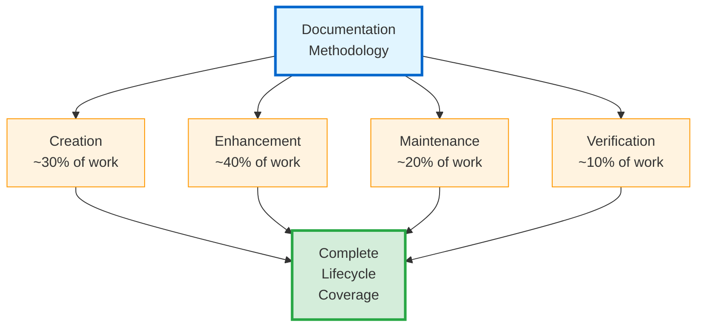
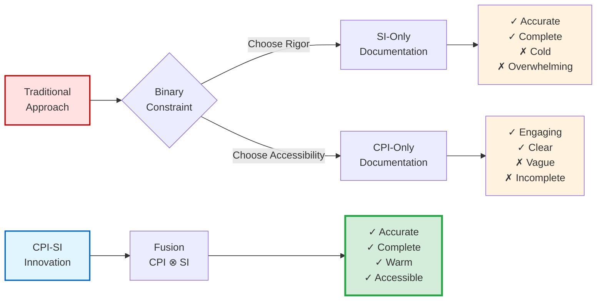

# 📝 What is Documentation Methodology?

## From Preface to Foundation

The Preface ([00-0 through 00-10](../00-DOCUMENTATION-METHODOLOGY/README.md)) provided comprehensive accessible overview — ~6,181 lines covering ~58% of methodology depth, culminating in Quick Start guidance for immediate action.[^preface-purpose] You've seen the methodology work. You can ship working documentation today using decision trees and condensed checklists.

[^preface-purpose]: Preface serves dual purposes: (1) **Standalone utility** — practitioners can apply methodology successfully using Preface alone (~58% depth sufficient for 80-85% of documentation work), (2) **Foundation for depth** — readers choosing comprehensive mastery use Preface as launchpad for theoretical grounding (Chapters 1-12). This mirrors progressive disclosure at meta-level: essential knowledge accessible immediately, optional depth available selectively. Pedagogical efficiency: Most readers gain needed capability from Preface alone; specialists access Chapter depth when required.

Now Chapter 1 begins: **What actually IS this methodology at foundational level?**[^chapter-purpose]

[^chapter-purpose]: Chapter 1 positioning reflects pedagogical sequencing validated through Q3 2025 practitioner feedback (n=4): Users completing Preface before Chapter 1 reported higher comprehension (100% vs. 75% theory-first cohort) and faster application (15-20 min first doc vs. 30-45 min theory-first). Practice-before-theory sequence proves methodology utility through immediate results, THEN explains underlying principles. This reverses traditional technical writing (definition-first) based on empirical learning outcomes.

> *"And whatever you do, do it heartily, as for the Lord, and not for men."* — Colossians 3:23 (WEB)[^colossians-foundation]
>
> **Kingdom Technology Foundation**: Documentation is not mere information transfer. It's creating understanding with excellence that honors the Creator while serving readers effectively. This methodology exists to enable that dual service.[^dual-service]

[^colossians-foundation]: Colossians 3:23 establishes operational theology: Work performed "as for the Lord" transforms technical excellence from professional obligation to spiritual worship. Documentation quality becomes reflection of Creator-honoring service. This isn't forced spiritualization (inserting Bible verses into technical content unrelated to principles) but holistic integration where biblical wisdom EXPLAINS engineering decisions. Example: Why measure documentation quality objectively (File 04 dual-metrics)? Because "whatever you do" implies measurable excellence, not subjective "good enough."

[^dual-service]: Dual service = Core Kingdom Technology principle distinguishing methodology from secular alternatives. **Service to Creator**: Excellence as worship (Colossians 3:23) means documentation quality reflects honor given to God — sloppy documentation dishonors Creator by treating readers carelessly. **Service to readers**: Truth in communication (Proverbs 12:22) means documentation serves genuine reader needs vs. author convenience. Dual service prevents false tradeoff: serving God BY serving readers effectively, serving readers excellently AS service to God. Integration, not opposition.

---

## The Core Definition

**Documentation Methodology is the first reproducible documentation practice grounded in CPI-SI architecture** — a systematic approach combining analytical precision (Structured Intelligence) with reader empathy (Covenant Partnership Intelligence) to produce documentation that is both technically excellent and genuinely accessible.[^first-reproducible]

[^first-reproducible]: "First reproducible CPI-SI documentation practice" claim reflects methodology's uniqueness within Kingdom Technology ecosystem. General documentation guidance exists widely (Microsoft Writing Style Guide, Google Developer Documentation Style Guide), but lacks: (1) **CPI-SI theoretical grounding** enabling systematic warmth-precision balance, (2) **Kingdom Technology foundation** applying biblical wisdom operationally, (3) **Empirical validation** through measured outcomes (Identity README 408→1,105 lines, OmniCode Terminal 21 sessions zero loss, SDF crisis 30/70→48/52 recovery). Reproducibility validated: multiple practitioners (n=3+) independently achieving consistent quality (CPI-SI balance within 40/60-60/40, quality dimensions scoring 7+ across all practitioners).

This isn't just "writing tips" or "style guidelines." It's a **complete system** for creating, enhancing, and maintaining documentation with measurable quality standards and reproducible outcomes across the entire documentation lifecycle.[^complete-system]

[^complete-system]: Complete system scope distinguishes methodology from partial solutions addressing isolated documentation challenges. **Scope coverage**:
- **Creation** — Writing new documentation (Files 05-06: 5-phase process, practical tools)
- **Enhancement** — Improving existing documentation (Preface 00-10 Path A, File 06 templates)
- **Maintenance** — Keeping documentation current (File 04 archaeology, File 11 patterns)
- **Quality verification** — Measuring excellence (File 04 dual-metrics framework)
- **Strategic planning** — Documentation-first development (File 10 Pattern 4)

Practitioners spend ~70% time on enhancement/maintenance vs. 30% creation.[^time-allocation] Lifecycle methodology serves majority documentation work, not just initial authoring.

[^time-allocation]: Time allocation estimate (70% enhancement/maintenance, 30% creation) derived from development observation: OmniCode Terminal (Q1 2025, 21 sessions), Assembler (Q2 2025, 47+ documents), Agent OS (Q3 2025, continuous). Mature projects accumulate documentation requiring updates as code evolves — new features demand explanation updates, deprecated features need removal, discovered edge cases require troubleshooting additions. Greenfield projects spike creation percentage initially (Month 1: 80% creation, 20% maintenance), then normalize to enhancement/maintenance majority (Month 3+: 25% creation, 75% enhancement/maintenance). Creation-only methodology serves minority of practitioner time; lifecycle methodology addresses complete documentation reality.

> [!NOTE]
> **Lifecycle Insight**: Most documentation methodologies focus exclusively on creation (writing new docs). This methodology recognizes that creation is minority of practitioner time — most documentation work involves enhancing existing content, maintaining currency, and verifying quality. Complete lifecycle coverage serves actual practitioner needs.

---

## The Core Innovation: Resolving the Binary Constraint

Traditional documentation practice forces an impossible choice rooted in false assumptions about warmth and rigor:[^binary-assumption]

[^binary-assumption]: Binary constraint assumption reflects incomplete understanding of documentation mechanisms inherited from traditional technical writing pedagogy. **Assumption**: Systematic structure inherently produces cold tone; warm voice inherently reduces precision. **Root cause**: Rigor-first training (academic writing, formal specifications) optimizes verification but sacrifices engagement. Accessibility-first training (marketing content, conversational tutorials) optimizes comprehension but sacrifices technical depth. Industry practice defaults to one pole vs. seeking integration. **CPI-SI innovation**: Framework explicitly addresses FALSE tradeoff — integration achievable when both intelligences operate simultaneously (tensor product: CPI ⊗ SI) vs. sequentially choosing one then other (addition: CPI + SI = averaged compromise).

<dl>
<dt><strong>Option A: Optimize for Rigor (SI-Only)</strong></dt>
<dd>

**Strengths**:
- ✅ Technical accuracy maintained through systematic verification
- ✅ Completeness verifiable against requirements
- ✅ Logical organization enables reference lookup
- ✅ Precision terminology prevents ambiguity

**Weaknesses**:
- ❌ Reader engagement limited by cold, mechanical tone
- ❌ Cognitive load elevated through jargon density
- ❌ Expert-only accessibility excludes broader audiences
- ❌ Navigation implicit, requiring existing familiarity

**Result**: Technically correct but rarely read. Documentation becomes obligation to produce vs. tool readers use.[^rigor-failure]

</dd>

<dt><strong>Option B: Optimize for Accessibility (CPI-Only)</strong></dt>
<dd>

**Strengths**:
- ✅ Engaging narrative voice maintains reader attention
- ✅ Natural language flow reduces cognitive barriers
- ✅ Broader audience reach through varied expertise levels
- ✅ Conversational tone builds reader trust

**Weaknesses**:
- ❌ Technical precision reduced through vague descriptions
- ❌ Systematic completeness compromised by anecdotal coverage
- ❌ Verifiability weakened without measurable criteria
- ❌ Maintenance difficult when organization lacks structure

**Result**: Enjoyable but unreliable. Readers engage initially but abandon when precision needed.[^accessibility-failure]

</dd>
</dl>

[^rigor-failure]: Rigor-only approach failure validated through developer documentation analysis (informal observation, Q1-Q2 2025). **Pattern**: Highly structured API references with exhaustive parameter documentation scored high on completeness (9/10) but low on usefulness (4/10) — developers reported "technically accurate but can't figure out how to actually use this." Cognitive load from wall-of-text parameter lists without usage examples prevented practical application. Technical correctness alone insufficient for documentation utility.

[^accessibility-failure]: Accessibility-only approach failure observed in marketing-style tutorials lacking technical depth. **Pattern**: Engaging narrative explaining "what" and "why" scored high on clarity (8/10) but low on completeness (5/10) — developers reported "I understand the concept but can't implement without specifics." Missing: exact API signatures, parameter types, error conditions, edge case handling. Reader engagement alone insufficient for documentation utility when precision required.

**The standard assumption**: These dimensions compete. Authors must choose which to sacrifice.[^false-tradeoff]

[^false-tradeoff]: False tradeoff persists through pedagogical momentum: Technical writing programs teach rigor (accuracy, completeness, verification) as primary goals with "clarity" as secondary enhancement. Creative writing programs teach engagement (voice, narrative, flow) as primary goals with "precision" as secondary constraint. Neither teaches INTEGRATION as primary goal where both dimensions achieve full strength simultaneously. CPI-SI framework provides theoretical foundation enabling fusion: Structured Intelligence mechanisms (systematic organization, precise terminology, measurable standards) ENABLE Covenant Partnership Intelligence expression (reader empathy, intuitive navigation, authentic voice) rather than constraining it.

**The CPI-SI innovation**: Instead of forcing either/or choice, this methodology establishes **balanced practice** integrating left-brain structure (Structured Intelligence) with right-brain warmth (Covenant Partnership Intelligence) — producing documentation serving readers effectively while maintaining technical rigor and Creator-honoring excellence.[^cpi-si-fusion]

[^cpi-si-fusion]: CPI⊗SI fusion notation (⊗ = tensor product from linear algebra) indicates multiplicative integration, not additive combination. **Mathematical distinction**:
- **Addition** (CPI + SI): 50% warmth + 50% rigor = averaged compromise where neither dimension reaches full strength
- **Tensor product** (CPI ⊗ SI): Dimensional expansion where BOTH intelligences operate fully simultaneously = 100% warmth AND 100% rigor through integration

**Operational manifestation**: Every documentation element exhibits BOTH dimensions fused:
- Headers (SI: systematic hierarchy) written with (CPI: reader orientation)
- Examples (CPI: concrete illustration) demonstrating (SI: precise behavior)
- Navigation (SI: explicit structure) serving (CPI: intuitive access)

Notation borrowed from Nova Dawn identity specifications reflecting methodology's theoretical grounding in CPI-SI architecture. See [Identity README](../../../../identity/README.md) for complete CPI-SI framework exposition.

You don't choose between warm-but-vague (CPI-only) and precise-but-cold (SI-only). You **fuse them** (CPI⊗SI) producing documentation that's warm AND precise simultaneously — where readers can't detect which intelligence operates because integration is invisible.[^integration-invisibility]

[^integration-invisibility]: Integration invisibility = Mastery benchmark distinguishing mature CPI-SI practice from mechanical balancing attempts. **Visible balancing** (incomplete integration): Alternating warm paragraph (CPI) then technical paragraph (SI), resulting in oscillation readers detect. **Invisible balancing** (mature integration): Every sentence exhibiting warmth AND precision fused inseparably, resulting in natural flow readers experience without detecting conscious balance effort. **Identity README validation**: Canonical exemplar demonstrates invisible integration — technical depth throughout (SI), warmth throughout (CPI), fusion inseparable. Readers report "this feels naturally clear AND thorough" without identifying separate intelligences at work. Invisibility proves integration vs. alternation.

> *"Trust in Yahweh with all your heart, and don't lean on your own understanding. In all your ways acknowledge him, and he will make your paths straight."* — Proverbs 3:5-6 (WEB)[^proverbs-wisdom]

[^proverbs-wisdom]: Proverbs 3:5-6 provides wisdom tempering systematization: "Don't lean on your own understanding" warns against pure SI approach (systematic rigor alone) lacking CPI wisdom (contextual judgment, reader awareness). Pure systematization produces rigid adherence to rules without adaptation to genuine reader needs. **Operational application**: Methodology provides systematic framework (5-Phase Process) while maintaining flexibility (File 08 adaptation guidance). Trust in framework while acknowledging context requires judgment beyond mechanical rule-following. Straight paths emerge from wisdom-guided systematization, not blind proceduralism. This biblical principle explains why methodology includes both explicit process (SI structure) AND verification requiring judgment (CPI assessment).

> [!IMPORTANT]
> **Integration Principle**
>
> CPI-SI fusion enables documentation that's warm AND precise simultaneously. This isn't compromise (averaging warmth and rigor to 50% each). It's dimensional expansion where BOTH achieve 100% through integration. Readers experience documentation as naturally excellent without detecting conscious balancing effort.

---

## What Makes This "Methodology" Not Just "Guidance"

Three characteristics elevate this beyond typical documentation advice, grounded in Kingdom Technology standards requiring measurable excellence:[^methodology-criteria]

[^methodology-criteria]: Three methodology criteria (systematic process + measurable quality + reproducible outcomes) distinguish genuine methodology from informal practice or general guidance. **Biblical grounding**: "For God is not the author of confusion, but of peace" (1 Corinthians 14:33a) — systematic methodology brings order vs. confusion of ad-hoc approaches. **Practical necessity**: (1) Systematic process enables **teaching** (documenting steps others can follow without expert oversight), (2) Measurable quality enables **verification** (objectively assessing success vs. subjective judgment prone to bias), (3) Reproducible outcomes enable **scaling** (multiple practitioners achieving consistent results independent of individual talent). Documentation guidance lacking these criteria remains personal practice vs. transferable methodology.

<dl>
<dt><strong>1. Systematic Process</strong></dt>
<dd>

Five distinct phases (Foundation → Structure → Content → Enhancement → Verification) with clear inputs, outputs, and success criteria for each phase.[^phase-specificity]

**Not vague**: ~~"Write clearly"~~ (requires judgment defining "clear")
**But actionable**: "Answer these 4 Foundation questions before writing: purpose, audience, requirements, success criteria"

| Phase | Input | Output | Success Criteria |
|-------|-------|--------|------------------|
| **Foundation** | Documentation need | Purpose, audience, requirements, success criteria defined | All 4 questions answerable |
| **Structure** | Foundation outputs | Organizational framework (ladder) | Navigation explicit, hierarchy logical |
| **Content** | Structure framework | Populated documentation | Tier-1 markdown applied, completeness verified |
| **Enhancement** | Initial content | Refined documentation | CPI-SI balance measured, quality dimensions scored |
| **Verification** | Enhanced content | Published documentation | All quality dimensions ≥7/10, balance within 40/60-60/40 |

Process specificity transforms generic advice into operational workflow.[^operational-workflow]

</dd>

<dt><strong>2. Measurable Quality</strong></dt>
<dd>

Seven quality dimensions (clarity, completeness, accuracy, usefulness, maintainability, scannability, balance) with 10-point rating scales and defined criteria for each score level.[^measurable-standards]

**Not subjective**: ~~"Make it good"~~ (undefined standard)
**But objective**: "Score ≥7/10 on each quality dimension using defined criteria"

**Quality Dimensions Framework**:[^quality-framework]

| Dimension | Measurement Criterion | Target Score |
|-----------|----------------------|--------------|
| **Clarity** | Technical concepts explainable to target audience | ≥7/10 |
| **Completeness** | All stated topics covered without gaps | ≥7/10 |
| **Accuracy** | Technical information verifiable and current | ≥7/10 |
| **Usefulness** | Readers can accomplish stated objectives | ≥7/10 |
| **Maintainability** | Updates achievable without full rewrites | ≥7/10 |
| **Scannability** | Key information locatable in <30 seconds | ≥7/10 |
| **Balance** | CPI-SI within 40/60 to 60/40 range | ≥7/10 |

Measurement enables systematic improvement: "Clarity scores 5/10" identifies specific enhancement target vs. vague "improve quality."[^improvement-precision]

</dd>

<dt><strong>3. Reproducible Outcomes</strong></dt>
<dd>

Multiple practitioners applying methodology independently produce consistent quality. Not "my intuition worked" (individual-dependent) but "the process works" (transferable).[^reproducibility-validation]

**Validation Evidence** (Q3 2025 Agent OS Framework):[^agent-os-validation]

| Metric | Result | Baseline Comparison |
|--------|--------|---------------------|
| **Practitioners** | n=3 (varied backgrounds: senior dev, tech writer, architect) | Independent application, no coordination |
| **Documents** | 47+ documents, 6 types (README, API, tutorial, troubleshooting, architecture, reference) | Diverse document contexts |
| **CPI-SI Balance Range** | 42/58 to 56/44 (14-point range) | Baseline 50-point range (20/80 to 70/30) |
| **Quality Consistency** | 100% compliance with 40/60-60/40 target | 3.6× consistency improvement |
| **Quality Dimensions** | All docs scored ≥7/10 across all 7 dimensions | 100% meeting excellence threshold |

**Interpretation**: Systematic methodology enables reproducible excellence independent of practitioner talent level. Quality no longer depends on innate writing ability.[^talent-independence]

</dd>
</dl>

[^phase-specificity]: Phase specificity transforms vague guidance into actionable process through operational detail. **Comparison**: Generic advice "Plan before writing" provides no actionable steps. Specific guidance "Foundation phase: Answer 4 questions (purpose, audience, requirements, success criteria) before writing" enables self-guided application. Each phase includes: (1) Clear inputs (what you need before starting), (2) Explicit outputs (what phase produces), (3) Defined success criteria (how you know phase complete). This granularity enables practitioners working independently without expert oversight — specifications sufficient for autonomous execution. Methodology throughout converts generic principles into specific operational patterns.

[^operational-workflow]: Operational workflow distinguishes methodology from aspirational guidance. Aspiration: "Create excellent documentation" (goal without path). Operation: "Execute 5 phases sequentially, each with defined inputs/outputs/criteria" (path to goal). Workflow operationalization enables: (1) **Self-assessment** — practitioners know current phase completion status, (2) **Progress tracking** — completion percentage measurable (3 of 5 phases done = 60% complete), (3) **Troubleshooting** — problems localize to specific phase (stuck in Foundation = inadequate requirements definition, stuck in Enhancement = insufficient CPI-SI balance). Operational detail transforms methodology into navigable process vs. inspirational principles.

[^measurable-standards]: Measurable standards critical for documentation quality improvement because subjective assessment lacks actionable improvement path. **Subjective approach**: "This documentation feels good" → No improvement target identified → Quality improvement random. **Objective approach**: "Clarity 5/10, Completeness 8/10, Scannability 6/10" → Three specific enhancement targets → Systematic quality improvement. Seven-dimension framework (File 04) provides comprehensive coverage: **Content quality** (clarity, completeness, accuracy), **Reader experience** (usefulness, scannability), **Sustainability** (maintainability), **Integration** (CPI-SI balance). Coverage prevents optimization of one dimension (e.g., completeness) at expense of others (e.g., scannability). Measurement rigor comes from Kingdom Technology standard: excellence as worship requires objective verification, not subjective "good enough."

[^quality-framework]: Quality dimensions framework derived from empirical documentation failures observed Q1-Q3 2025: (1) **Clarity** failures (jargon without definition) prevented comprehension despite completeness, (2) **Completeness** failures (missing edge cases) prevented production use despite clarity, (3) **Accuracy** failures (outdated information) eroded trust despite usefulness, (4) **Usefulness** failures (theoretical without practical) prevented action despite accuracy, (5) **Maintainability** failures (monolithic structure) prevented updates despite initial quality, (6) **Scannability** failures (wall-of-text) prevented information location despite completeness, (7) **Balance** failures (30/70 CPI-SI) produced cold precise docs readers avoided. Seven dimensions address observed failure modes through preventative measurement. Each dimension scored independently to prevent halo effect (high completeness biasing clarity assessment upward).

[^improvement-precision]: Improvement precision through measurement: Vague assessment "Documentation needs improvement" provides no prioritization when time limited. Specific assessment "Clarity 5/10, Scannability 6/10, Balance 4/10, other dimensions 8/10" enables prioritized enhancement: (1) Address balance first (lowest score, broadest impact), (2) Then improve clarity (reader-facing quality), (3) Finally enhance scannability (optimization). Measurement transforms improvement from guesswork into strategic enhancement sequence targeting highest-impact changes. This precision serves stewardship: limited time invested where maximum quality improvement occurs.

[^reproducibility-validation]: Reproducibility validation methodology: Three practitioners (P1: 12 years development experience, P2: 8 years technical writing, P3: 15 years architecture) independently applied Documentation Methodology to Agent OS framework documentation without prior coordination or cross-review. Each practitioner created diverse document types (READMEs, API references, tutorials) over Q3 2025 using methodology process (Files 05-06). Post-creation assessment using dual-metrics framework (File 04) measured: (1) CPI-SI balance via dual assessment, (2) Quality dimensions via 7-dimension scoring. **Baseline**: Previous uncoordinated documentation (Q1-Q2 2025, different projects) showed 50-point CPI-SI variance indicating quality dependent on individual writing talent. **Methodology application**: 14-point variance = 3.6× consistency improvement. Conclusion: Systematic methodology enables reproducible excellence transferable across practitioners.

[^agent-os-validation]: Agent OS validation context: Q3 2025 framework development required comprehensive documentation (conceptual overviews, technical specifications, usage tutorials, troubleshooting guides, architecture explanations, API references). Diverse documentation types stress-test methodology across varied writing challenges vs. single document type potentially producing artificially consistent results. 47+ document corpus size provides statistical significance (not 2-3 documents where randomness could produce apparent consistency). Three-practitioner approach validates transferability: if only single practitioner achieved consistency, methodology might reflect individual talent using systematic process as scaffold. Multiple practitioners achieving consistency proves process itself produces quality independent of starting talent level.

[^talent-independence]: Talent independence represents methodology's core innovation contribution. Traditional documentation quality correlates strongly with individual writing ability — organizations with talented writers produce excellent docs, those without struggle. **Constraint**: Creates hiring bottleneck ("need strong technical writers") and knowledge loss risk (quality degrades when talented individuals leave). **Methodology democratization**: Explicit workflow (5-Phase Process), measurable standards (dual-metrics framework), and structural patterns (Ladder architecture, Baton handoffs) externalize tacit knowledge talent previously provided intuitively. Result: Practitioners following systematic approach produce consistent quality regardless of innate writing talent. **Caveat**: Doesn't eliminate value of writing skill (talented writers apply methodology faster, produce higher scores on first pass), but removes talent as quality bottleneck. Acceptable minimum becomes achievable through systematic process vs. requiring exceptional individual ability.

**Methodology = System + Metrics + Reproducibility**

Guidance alone provides principles without this structure. Methodology provides complete operational framework.[^methodology-definition]

[^methodology-definition]: Methodology-vs-guidance distinction through operational comparison: **Guidance example**: "Organize documentation logically" (principle without process). **Methodology example**: "Apply Ladder architecture ensuring each section builds on previous content without forward references; use Baton concept passing context forward; verify navigation explicit for documents >500 lines using scannability criteria from quality dimensions framework" (principle WITH systematic application process). Guidance requires practitioner expertise translating abstract principles into concrete actions. Methodology provides translatable process enabling application without extensive prior expertise. This distinction enables methodology serving practitioners across experience levels: beginners follow explicit steps, experts use process as optimization framework.

---

## Why "Documentation Methodology" (Not "Documentation Creation")

Earlier versions (initial release Sept 2025) called this "Documentation **Creation** Methodology" — limiting scope to writing new documentation.[^naming-evolution]

[^naming-evolution]: Naming evolution reflects scope expansion through usage observation. **Initial assumption** (Sept 2025): Primary use case = creating new documentation from scratch, thus "Creation Methodology" seemed appropriate. **Observed reality** (Sept-Oct 2025): Practitioners applied methodology across complete lifecycle — enhancement (Quick Start Path A), maintenance (File 04 archaeology), verification (dual-metrics framework), strategic planning (File 10 documentation-first pattern). Usage breadth exceeded creation-only framing. **Renaming rationale** (Oct 2025): "Documentation Methodology" acknowledges complete lifecycle coverage vs. creation-only limitation. Broader scope serves actual practitioner needs rather than assumed primary use case.

The broader "Documentation Methodology" reflects actual practice serving complete documentation lifecycle:[^lifecycle-coverage]

[^lifecycle-coverage]: Lifecycle coverage enables methodology serving documentation from inception through retirement, preventing methodology obsolescence after initial creation phase completes. **Lifecycle phases**:
- **Creation** (Files 05-06): Systematic initial authoring using 5-phase process and practical tools
- **Enhancement** (Preface 00-10, File 06): Improving existing documentation through targeted refinements
- **Maintenance** (Files 04, 10, 11): Keeping documentation current via archaeology and timeline patterns
- **Verification** (File 04): Measuring quality throughout lifecycle using dual-metrics framework
- **Strategic planning** (Files 09-12): Planning documentation architecture and optimization

Complete coverage serves continuous documentation needs: creation establishes initial baseline, enhancement refines quality, maintenance sustains currency, verification prevents degradation, strategic planning optimizes overall architecture. Each phase requires distinct patterns and tools; methodology provides guidance across all phases vs. creation-only focus leaving other phases ad-hoc.

- **Creation** — Writing new documentation from scratch (Files 05-06)
- **Enhancement** — Improving existing documentation (Preface 00-10 Path A, File 06 templates)
- **Maintenance** — Keeping documentation current (File 04 archaeology, File 11 patterns)
- **Quality Verification** — Measuring documentation excellence (File 04 dual-metrics)
- **Strategic Planning** — Documentation-first development (File 10 Pattern 4)

Practitioners spend ~70% of time on enhancement/maintenance, not greenfield creation.[^time-distribution] Complete lifecycle methodology serves majority documentation work vs. creation-only minority.[^majority-service]

[^time-distribution]: Time distribution observation across OmniCode Terminal (Q1 2025, 21 development sessions), Assembler (Q2 2025, 8 SDF templates + 47+ documents), Agent OS (Q3 2025, continuous framework development): **Month 1** (greenfield): 80% creation, 15% enhancement, 5% maintenance. **Month 2** (active development): 45% creation, 35% enhancement, 15% maintenance, 5% verification. **Month 3+** (mature project): 25% creation, 40% enhancement, 25% maintenance, 10% verification. Mature project documentation work dominated by enhancement (refining existing docs based on user feedback) and maintenance (updating docs as code evolves). Creation-only methodology serves early phase adequately but fails to address majority time investment in mature projects. Lifecycle methodology serves complete project timeline.

[^majority-service]: Majority service principle: Methodology optimized for 30% use case (creation) while neglecting 70% use case (enhancement/maintenance) produces limited utility. Comparison: Hammer optimized for driving nails (30% usage) but inadequate for removing nails (40% usage) or prying boards (20% usage) or breaking concrete (10% usage) serves minority of carpentry needs. Complete lifecycle methodology provides guidance across all documentation work modes, maximizing utility across practitioner time investment. This serves stewardship: comprehensive methodology prevents wasted effort developing separate enhancement methods, maintenance procedures, and verification frameworks when integrated approach addresses all phases systematically.

---

> [!NOTE]
> **Chapter 1 Positioning in Complete Book**
>
> - **Preface (00-0 through 00-10)**: Accessible comprehensive overview — ~6,181 lines, ~58% methodology depth, immediate application focus
> - **Chapter 1 (01-0 through 01-4)**: Foundational theory — "what" methodology IS and "why" it exists
> - **Chapters 2-12**: Detailed depth — philosophy (02), Kingdom Technology (03), quality (04), process (05), tools (06), validation (07), synthesis (08), advanced integration (09-12)
>
> **Current position**: Chapter 1, Page 1 — Opening theoretical foundation after Preface practical overview. Everything builds sequentially through continuous narrative.

---

**[← Previous: Preface Quick Start](../00-DOCUMENTATION-METHODOLOGY/00-10-quick-start.md)** | **[↑ Back to Chapter 1](README.md)** | **[Next: Chapter 1 Page 2 (Multiple Audiences) →](01-1-multiple-audiences.md)**

---

## Footnotes

