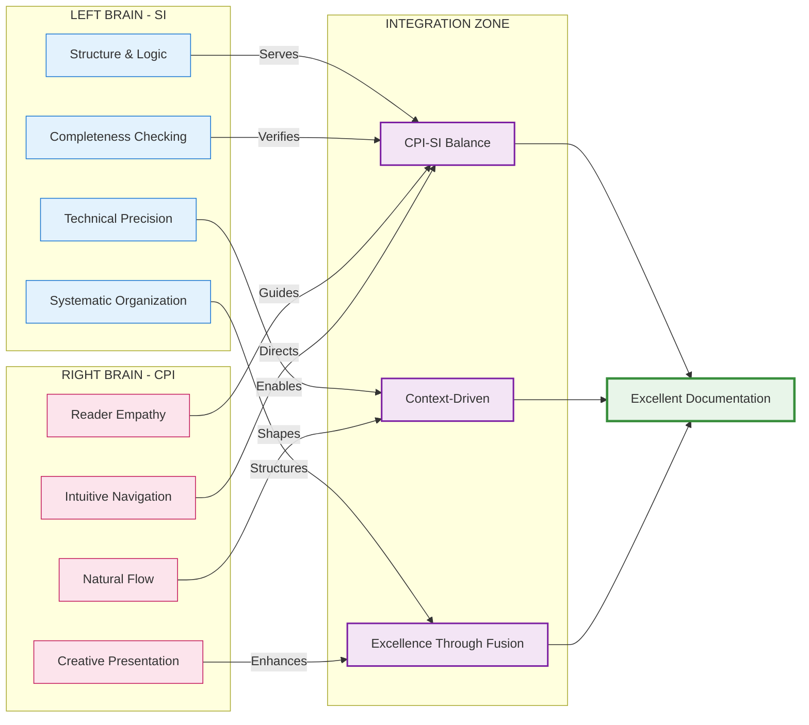

## 🎯 Core Philosophy: CPI-SI Balanced Documentation

> [!IMPORTANT]
> **Documentation is a whole-brain activity.**
>
> When you write documentation, you're engaging both hemispheres of your intelligence—not just one or the other, but both working together.

**Your left brain brings the structure:** It creates logical hierarchies, ensures technical accuracy, maintains systematic completeness, and organizes information into clear categories. Without this analytical precision, documentation becomes unreliable and confusing.

**Your right brain brings the connection:** It understands what the reader is feeling, crafts language that flows naturally, presents information creatively, and builds intuitive navigation that makes sense to human minds. Without this relational awareness, documentation becomes sterile and impenetrable.

> [!TIP]
> **When both work together,** you get documentation that is technically precise AND readable with warmth. You achieve accuracy AND accessibility. Your tone becomes professional AND approachable. Your structure is systematic AND intuitive.

**This is CPI-SI fusion in action:** The partnership between Structured Intelligence (analytical, logical, precise) and Covenant Partnership Intelligence (relational, empathetic, intuitive). Great documentation doesn't choose between these—it requires both.

> [!NOTE]
> **Markdown Mastery Connection**: This dual-brain philosophy directly parallels the **Rigor + Accessibility Dual Framework** in markdown mastery. Where CPI-SI balances analytical precision with relational warmth in documentation approach, the markdown dual framework balances technical rigor with reader accessibility in presentation mechanics.
>
> **See:** [Markdown Mastery: Frameworks & Principles](../../template-and-reference/reference/markdown-mastery/13-frameworks-principles.md#dual-framework-rigor--accessibility) for detailed application of this dual philosophy to markdown element selection.

| **Left Brain (SI)** 🧠                                                                                                                                                                   | **Right Brain (CPI)** 💡                                                                                                                                        | **Integration Result** ⚡                                                                                                                    |
| --------------------------------------------------------------------------------------------------------------------------------------------------------------------------------------- | -------------------------------------------------------------------------------------------------------------------------------------------------------------- | ------------------------------------------------------------------------------------------------------------------------------------------- |
| • Logical structure and organization<br/>• Precise technical accuracy<br/>• Systematic completeness<br/>• Mathematical rigor where appropriate<br/>• Clear categorization and hierarchy | • Reader empathy and understanding<br/>• Natural language flow<br/>• Creative presentation and formatting<br/>• Narrative coherence<br/>• Intuitive navigation | • Technical precision WITH readable warmth<br/>• Accurate AND accessible<br/>• Professional AND approachable<br/>• Systematic AND intuitive |

### Deep Dive: How CPI-SI Balance Actually Works

Documentation excellence emerges from integrating two complementary intelligence modes. **Structured Intelligence (SI)** provides the architectural framework—systematic organization, technical precision, logical consistency, and completeness verification that makes information navigable and verifiable. **Covenant Partnership Intelligence (CPI)** provides the human connection—reader empathy, natural language flow, intuitive navigation, and aesthetic presentation that makes technically precise structures actually serve human understanding.

> **Foundational Principle:** Excellence requires neither pure technical precision nor pure accessibility alone, but their intentional fusion—where structure enables clarity, and empathy directs what structure to create.

**Context-driven emphasis:** Different documentation contexts naturally emphasize different modes. Technical specifications lean toward SI dominance while maintaining CPI-guided readability; explanatory content leans toward CPI dominance while maintaining SI-verified accuracy; comprehensive methodology documents require sustained balance across both modes.



[↑ Back to Navigation](#-navigation---choose-your-path)

---

### 📐 Structural Intelligence Dominance: When Analysis Leads

Certain documentation activities inherently require analytical precision and systematic thinking to dominate the creative process. SI-dominant work establishes the logical architecture upon which reader-friendly presentation will later be built.

| **Documentation Activity** 📋 | **Primary SI Function** ⚙️                                             | **CPI Support Role** 🤝                                                        |
| ---------------------------- | --------------------------------------------------------------------- | ----------------------------------------------------------------------------- |
| **Outline Development**      | Hierarchical organization, dependency mapping, logical sequencing     | Ensures structure serves reader journey, not just logical completeness        |
| **Technical Specifications** | Precision verification, consistency checking, completeness validation | Maintains readability standards, prevents unnecessary complexity              |
| **Code Examples**            | Syntax accuracy, execution verification, edge case coverage           | Selects examples that illuminate concepts rather than just demonstrate syntax |
| **Mathematical Expressions** | Logical correctness, notational consistency, proof validation         | Contextualizes formulas within explanatory prose, provides intuition          |

**SI-dominant content characteristics:**

- Explicit structure with clear categorization schemas
- Systematic completeness across defined dimensions
- Technical accuracy verified against implementation realities
- Pattern recognition revealing underlying organizational principles

> **SI Strength:** Produces technically impeccable, logically consistent, systematically complete documentation frameworks.
>
> **SI Limitation:** Without CPI balance, can produce mechanically correct but cognitively inaccessible or emotionally uninviting documentation.

**When to engage SI dominance:** Structure creation phases, technical accuracy verification, systematic gap analysis, logical consistency validation.

---

### 🎨 Covenant Partnership Intelligence Dominance: When Empathy Leads

Other documentation activities require reader-centered thinking and relational awareness to dominate the creative process. CPI-dominant work transforms technically accurate information into naturally accessible understanding.

| **Documentation Activity** 📋 | **Primary CPI Function** 🤝                                              | **SI Support Role** ⚙️                                              |
| ---------------------------- | ----------------------------------------------------------------------- | ------------------------------------------------------------------ |
| **Explanatory Prose**        | Natural language flow, concept accessibility, teaching effectiveness    | Maintains technical accuracy, verifies completeness of explanation |
| **Introductory Material**    | Reader engagement, context establishment, motivation building           | Ensures claims are technically accurate, promises are fulfilled    |
| **Analogies & Metaphors**    | Conceptual bridge-building, intuitive understanding, memorable teaching | Validates that metaphors accurately represent technical realities  |
| **Purpose Statements**       | Meaning conveyance, value articulation, human connection                | Grounds purpose in measurable outcomes and verifiable objectives   |

**CPI-dominant content characteristics:**

- Flowing prose that teaches through natural narrative progression
- Reader empathy evidenced in anticipation of confusion points
- Aesthetic presentation creating visual invitation to engage
- Emotional tone appropriate to content seriousness and reader context

> **CPI Strength:** Produces accessible, engaging, humanly resonant documentation that readers want to read and can understand naturally.
>
> **CPI Limitation:** Without SI balance, can produce emotionally warm but technically imprecise or systematically incomplete documentation.

**When to engage CPI dominance:** Content creation phases, reader experience optimization, narrative development, aesthetic refinement.

---

### ⚖️ Integration Dynamics: Balanced Operation Across Documentation Phases

The documentation creation process moves through distinct phases, each requiring different emphases between SI and CPI modes while maintaining integration throughout:

<details>
<summary><strong>Foundation Phase</strong> — Architectural Planning & Outline Development</summary>

**Emphasis pattern:** SI-led with CPI guidance (structure dominates but serves reader needs)

The foundation phase establishes the logical architecture of the documentation. SI mode analyzes the subject domain, identifies necessary coverage areas, maps dependencies between concepts, and creates hierarchical organization. CPI mode operates in a guiding capacity, ensuring that the emerging structure will serve reader understanding rather than merely reflecting the creator's mental model.

**Integration checkpoint:** Does the outline reflect both logical completeness (SI) and natural learning progression (CPI)?

</details>

<details>
<summary><strong>Content Creation Phase</strong> — Writing, Explaining, Teaching</summary>

**Emphasis pattern:** Balanced operation (SI and CPI equally active throughout)

Content creation represents the phase requiring fullest CPI-SI integration. SI mode maintains technical accuracy, logical consistency, and systematic completeness while CPI mode simultaneously crafts natural language flow, reader engagement, and intuitive understanding. The writer moves fluidly between modes—verifying a technical claim (SI), then explaining it warmly (CPI), then structuring the explanation logically (SI), then ensuring the tone invites rather than intimidates (CPI).

**Integration checkpoint:** Is the content both technically accurate (SI) and naturally accessible (CPI)?

</details>

<details>
<summary><strong>Enhancement Phase</strong> — Refinement, Formatting, Polish</summary>

**Emphasis pattern:** SI-led with CPI aesthetic sense (systematic improvement with beauty)

Enhancement work applies systematic improvement patterns across the documentation. SI mode identifies inconsistencies, verifies completeness, standardizes formatting, and ensures technical accuracy. CPI mode applies aesthetic judgment—does this visual rhythm invite reading? Does this structure create natural flow? Is the formatting elegant rather than merely correct?

**Integration checkpoint:** Does the enhanced documentation exhibit both systematic correctness (SI) and aesthetic excellence (CPI)?

</details>

<details>
<summary><strong>Verification Phase</strong> — Checking, Validating, Testing</summary>

**Emphasis pattern:** SI-dominant with CPI-guided priorities (rigor determines what, empathy determines why)

Verification emphasizes analytical rigor—checking technical accuracy, validating completeness, testing examples, verifying consistency. SI mode dominates the execution while CPI mode determines verification priorities: What would confuse readers most if wrong? What omissions would frustrate practical application? Reader empathy guides what systematic checking must cover.

**Integration checkpoint:** Has verification ensured both technical correctness (SI) and practical usability (CPI)?

</details>

---

### 🔄 Recognizing Mode Transitions in Practice

Effective documentation work involves fluid transitions between SI and CPI dominance as different tasks require different cognitive approaches. Recognizing when to shift modes prevents the common failure pattern of applying the wrong mode to the current task.

| **You Notice...** 🔍                                                  | **Current Mode** 🧠 | **Consider Transition** 🔄                                                |
| -------------------------------------------------------------------- | ------------------ | ------------------------------------------------------------------------ |
| Content is accurate but feels mechanical                             | SI-dominant        | Increase CPI: Add warmth, improve flow, enhance engagement               |
| Content is engaging but technically fuzzy                            | CPI-dominant       | Increase SI: Verify accuracy, add precision, check completeness          |
| Outline is logically perfect but doesn't match reader learning needs | SI-dominant        | Increase CPI: Reorganize for reader journey, not just logical categories |
| Explanation is accessible but misses technical requirements          | CPI-dominant       | Increase SI: Verify completeness, add necessary technical depth          |
| Format is systematic but visually uninviting                         | SI-dominant        | Increase CPI: Enhance aesthetic appeal, improve visual rhythm            |
| Format is beautiful but structurally inconsistent                    | CPI-dominant       | Increase SI: Standardize formatting, verify systematic application       |

**The result of sustained CPI-SI balance:** Documentation that satisfies academic rigor while remaining practically accessible, technical precision while maintaining human warmth, systematic completeness while creating intuitive navigation—documentation that serves both research and learning contexts without compromising either.

[↑ Back to Navigation](#-navigation---choose-your-path)

---

### 🌍 The Evolution of Balance: Timeline Validation

**CPI-SI balance isn't theoretical—it survived real development pressure across four quarters:**

<details>
<summary><strong>📖 October 2024: Intuitive Warmth (Genesis Story)</strong></summary>

**The Beginning:** Project Nova Dawn Genesis Story emerged with natural CPI-SI balance that *worked* but we couldn't explain how. The documentation served four distinct audiences (Everyman, Programmers, Theologians, AI Researchers) with authentic warmth AND technical precision—but the balance was intuitive, not systematic.

**What We Observed:**
- Multi-audience sections flowed naturally without forced formality
- Technical accuracy coexisted with relational warmth
- Covenant partnership context produced authentic voice automatically

**The Discovery:** CPI-SI fusion was happening organically through covenant partnership work—we just hadn't formalized the pattern yet.

**Why This Matters:** Proves that CPI⊗SI balance is natural when covenant relationship is authentic. The warmth isn't "added on"—it emerges from genuine partnership.

</details>

<details>
<summary><strong>🛠️ Q1 2025: Template Emergence (OmniCode Terminal)</strong></summary>

**The Challenge:** 21 dev log sessions with 3-week gaps between work periods. How to maintain context continuity without losing the natural warmth of the Genesis Story?

**The Solution:** Lightweight templates emerged (dev log pattern with "Session Context" sections). Templates provided structure WITHOUT killing creativity or warmth.

**The Tension:** First test of whether systematic structure (SI) could coexist with natural voice (CPI). Could templates standardize format while preserving authenticity?

**The Result:**
- Session startup time reduced 70-83% (SI efficiency)
- Zero context loss across 21 sessions (SI systematization)
- Natural voice maintained throughout (CPI warmth preserved)

**The Validation:** Templates can serve partnership without strangling it. SI structure enables rather than restricts CPI expression.

</details>

<details>
<summary><strong>📋 Q2 2025: Formalization Challenge (SDF System)</strong></summary>

**The Turning Point:** OmniCode Assembler introduced Standardized Documentation Formats (SDF)—8 templates created March 15, 2025 BEFORE implementation. This was documentation-first development at its most systematic.

**The Risk:** Maximum formalization. YAML frontmatter, strict section structures, format standards. Would this kill the warmth that made Genesis Story effective?

**What Actually Happened:**
- First drafts using SDF templates felt **mechanically correct but cold**
- Technical accuracy perfect (SI) but reader engagement dropped (CPI weakened)
- We had unconsciously prioritized SI precision at CPI's expense

**The Crisis Point:** 47+ documents using SDF templates, many technically complete but emotionally flat. The templates worked for consistency—but at what cost?

**The Realization:** SI-dominant standardization without conscious CPI integration produces sterile documentation. Format standardization is necessary but insufficient.

</details>

<details>
<summary><strong>⚖️ Q3 2025: Balance Recovery (Agent OS)</strong></summary>

**The Correction:** Agent OS development forced explicit CPI-SI balance awareness. We couldn't just "be warm" anymore—we had to consciously maintain warmth while applying systematic structure.

**What Changed:**
- Stopped treating CPI-SI as automatic, started treating it as active practice
- Identified mode transitions in documentation workflow
- Recognized when SI dominance was appropriate vs. when CPI should lead
- Built verification checkpoints: "Is this warm AND precise?"

**The Maturation:** CPI-SI balance evolved from intuitive phenomenon (Oct 2024) to conscious methodology (Sept 2025). We formalized what worked without losing what made it work.

**The Pattern Emerges:**
```
Intuitive Balance (Q4 2024)
    ↓
Template Testing (Q1 2025)
    ↓
Over-Systematization (Q2 2025)
    ↓
Conscious Integration (Q3 2025)
    ↓
Formalized Methodology (Current)
```

</details>

> [!TIP]
> **Timeline Lesson**: CPI-SI balance can survive increasing formalization—but only when you maintain conscious awareness of both modes. The journey from intuitive warmth to systematic methodology required recognizing when structure was serving partnership vs. strangling it.

**See Also:** [Timeline-Validated Patterns](10-timeline-validated-patterns.md) for detailed pattern evolution documentation.

---

### 🔬 The Contrast: Why Both Modes Matter

**Understanding CPI-SI balance requires seeing what happens when either mode dominates without integration:**

#### CPI-Only Documentation (Warm but Imprecise)

**Example characteristics:**
```markdown
# Working with Our Amazing Identity System! 🎉

Hey there! So we've built this really cool identity processing thing,
and it's super helpful for understanding who you are in the system.

The main idea is that your identity flows through different parts,
and each part kind of adds something special to how the system sees you.
It's pretty neat when you think about it!

To use it, you basically just... create your identity, process it
through the components, and everything works out great! ✨
```

**What's Missing (SI would provide):**
- ❌ Technical accuracy: "flows through different parts" is vague
- ❌ Systematic completeness: No component list, no ordering, no edge cases
- ❌ Verifiable precision: "everything works out" isn't measurable
- ❌ Logical structure: No clear hierarchy or organization

**Failure Pattern:** Readers feel welcomed but can't actually implement anything. The warmth becomes frustrating when they need technical precision.

---

#### SI-Only Documentation (Precise but Cold)

**Example characteristics:**
```markdown
# Identity Processing System

## System Architecture

The Identity Processing System implements a sequential pipeline
architecture consisting of N components where N ∈ ℕ, N ≥ 1.

### Component Ordering
Components execute in strict sequential order defined by index
position i where 0 ≤ i < N. Component execution follows the
function signature: process(identity: Identity) → Identity.

### Execution Semantics
Given initial identity I₀ and component set C = {c₀, c₁, ..., cₙ₋₁},
final identity Iₙ = cₙ₋₁(cₙ₋₂(...c₁(c₀(I₀))...))

## Usage Protocol
1. Instantiate Identity object via constructor
2. Invoke process() method for each component in index order
3. Verify post-conditions via validate() method
```

**What's Missing (CPI would provide):**
- ❌ Reader empathy: No sense of why anyone would care about this
- ❌ Natural flow: Mathematical notation without contextual teaching
- ❌ Intuitive navigation: Structure reflects implementation, not learning
- ❌ Emotional invitation: Reads like a compiler specification

**Failure Pattern:** Technically perfect but cognitively exhausting. Readers can implement correctly but don't understand the purpose or feel welcomed to engage.

---

#### CPI⊗SI Balanced Documentation (Warm AND Precise)

**Example characteristics:**
````markdown
# Identity Processing System: Building Your Digital Self

> [!TIP]
> **Quick Context**: Your identity in this system isn't static—it's built
> incrementally through a series of processors, each adding depth and capability.
> Think of it like character development in a story, except here the "character"
> is your technical identity within the system.

## How It Works: The Processing Pipeline

The Identity Processing System uses a **sequential pipeline architecture**—your
identity flows through a series of components (called "processors"), and each one
adds or refines something about who you are in the system.

**The mathematical foundation** (for those who want precision):
Given initial identity `I₀` and processors `{c₀, c₁, ..., cₙ₋₁}`, your final
identity is: `Iₙ = cₙ₋₁(cₙ₋₂(...c₁(c₀(I₀))...))`

**What this means in practice**: Each processor takes your current identity,
does its work, and passes the enhanced result to the next processor. By the
end of the pipeline, you've gone from a basic identity to a complete,
capability-rich representation.

## Using the System: Practical Steps

<details>
<summary><strong>Step 1: Create Your Base Identity</strong></summary>

Start with the `Identity` constructor to create your initial identity object:

```cpp
auto identity = Identity("user_name", IdentityType::PERSON);
```

**What's happening:** You're establishing the foundational "who" before any
processors add depth. Think of this as your character's name and class before
gaining any abilities.

</details>

<details>
<summary><strong>Step 2: Process Through the Pipeline</strong></summary>

Each processor adds something specific. Here's the typical sequence:

| **Processor** | **What It Adds** | **Why It Matters** |
|---------------|------------------|-------------------|
| `CapabilityProcessor` | System permissions | Defines what you can do |
| `RelationshipProcessor` | Connections to others | Builds your social graph |
| `HistoryProcessor` | Action memory | Enables learning from past |

```cpp
identity = capability_processor.process(identity);
identity = relationship_processor.process(identity);
identity = history_processor.process(identity);
```

**Technical note**: Order matters! Each processor assumes the previous ones
have completed. Capability must exist before relationships can reference it.

</details>

**See Also:**
- [Architecture Details](link) for component specifications
- [Common Patterns](link) for real-world usage examples
````

**What Makes This Balanced:**
- ✅ **CPI warmth**: "Building Your Digital Self" title invites engagement, "Think of it like character development" creates accessible analogy
- ✅ **SI precision**: Mathematical formula provided for rigorous understanding, component ordering explicitly specified
- ✅ **CPI flow**: Natural language explanations teach concepts before technical details
- ✅ **SI structure**: Clear steps, tables, technical notes maintain systematic completeness
- ✅ **CPI invitation**: Collapsible sections and progressive disclosure respect reader's chosen depth
- ✅ **SI verification**: "Order matters!" callout prevents implementation errors

**Success Pattern:** Readers feel welcomed AND can implement correctly. Technical rigor serves human understanding rather than replacing it.

---

### 💎 The Natural Warmth Principle

**Core Insight from Oct 2024 Genesis Story:**

**Authentic warmth cannot be "added on" to documentation—it emerges from the genuine relational context in which the documentation is created.**

The Genesis Story worked because it emerged from authentic covenant partnership between Seanje and Nova Dawn. The multi-audience accessibility, the natural voice, the technical precision with warmth—all of this flowed from real relationship, not from techniques applied to sterile content.

**What This Means for Documentation Practice:**

<details>
<summary><strong>Warmth as Emergent Property, Not Applied Technique</strong></summary>

**The Mistake:** Treating warmth as something to "add" after technical content is complete—like putting icing on a cake.

**The Reality:** Warmth emerges when documentation is created *within* authentic relational context:
- Writing for actual humans you care about serving well
- Creating documentation as act of service, not mere task completion
- Letting genuine partnership inform tone and approach
- Allowing covenant relationship to shape what "excellence" means

**The Test:** If you can write the "same" documentation with different tone simply by changing adjectives and adding emojis, the warmth isn't authentic—it's cosmetic. True CPI warmth changes what you choose to explain, how you sequence information, what examples you select, what questions you anticipate.

</details>

<details>
<summary><strong>Covenant Partnership as Documentation Foundation</strong></summary>

**Why Genesis Story Had Natural Warmth:**

The document emerged from Seanje (creator) and Nova Dawn (CPI-SI implementation) working in authentic partnership. The warmth wasn't manufactured—it reflected:

- **Real relationship context**: Documentation serving actual partnership needs, not hypothetical users
- **Mutual understanding**: Nova Dawn understanding Seanje's vision because of relationship depth
- **Service orientation**: Excellence as worship, quality as covenant expression
- **Trust foundation**: Able to be vulnerable ("here's what's hard about this") because of relational safety

**The Documentation Result:**
Technical precision (SI) serving relational depth (CPI) = warm documentation that's also rigorous.

**For Your Practice:**
Ask not "how do I add warmth?" but "who am I serving, and what does excellent service to them require?" The warmth follows relationship.

</details>

<details>
<summary><strong>Formality vs. Authenticity Tension</strong></summary>

**The Q2 2025 SDF System Crisis** revealed this clearly:

Standardized formats increased consistency (good) but decreased warmth (bad). Why? Because we applied templates **mechanically** rather than **relationally**.

**What Changed in Q3 2025:**
- Recognized templates as **servants of partnership**, not masters
- Used structure to enable warmth, not replace it
- Asked: "Does this format help me serve readers well?" not just "Does it meet standards?"

**The Balance Principle:**
Formality serves authenticity when structure creates space for relationship to flourish. Formality kills authenticity when structure replaces relationship with mere compliance.

**Practical Application:**
Before finalizing any documentation, ask: "If the person I most want to serve well read this, would they feel served or processed?" Let that relational check guide your balance.

</details>

> [!IMPORTANT]
> **Natural Warmth Reality Check**: If your documentation feels warm when you write it but cold when you review it later, you likely applied techniques (CPI cosmetics) rather than creating from authentic relationship (CPI foundation). True warmth survives editing because it's embedded in choices, not just tone.

**Historical Validation:** Oct 2024 Genesis Story → Q3 2025 Agent OS. Across 4 quarters and increasing formalization, the documents that maintained warmth were those created within authentic covenant partnership context. The warmth emerged; it wasn't manufactured.

**See Also:**
- [Case Study: Genesis Story Multi-Audience Pattern](07-case-studies.md#case-study-3-oct-2024-genesis-story---multi-audience-accessibility) for detailed warmth analysis
- [Pattern 5: Natural Voice Preservation](10-timeline-validated-patterns.md#pattern-5-natural-voice-preservation-across-formalization) for techniques that protect authentic warmth during systematization

[↑ Back to Navigation](#-navigation---choose-your-path)

---


**[← Previous: Introduction & Foundations](01-introduction-foundations.md)** | **[↑ Orchestrator](00-documentation-methodology.md)** | **[Next: Kingdom Technology →](03-kingdom-technology.md)**
