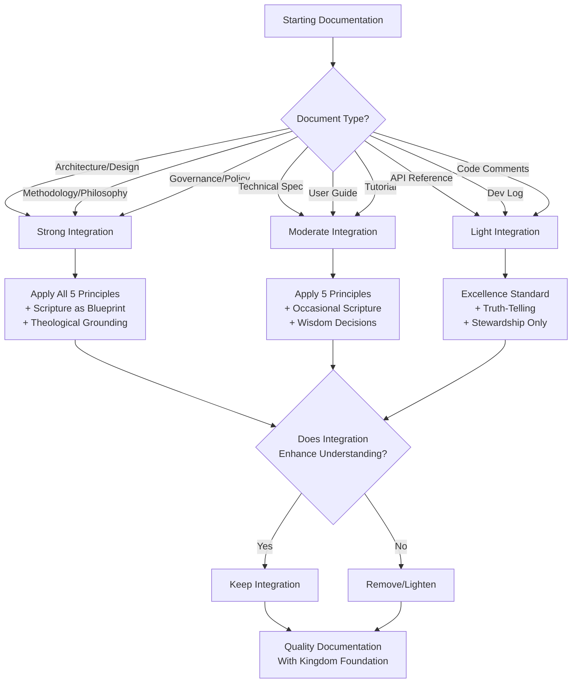

## 🌟 Kingdom Technology Application

### Table of Contents
- [What Kingdom Technology Actually Means](#what-kingdom-technology-actually-means)
- [Five Foundational Principles](#five-foundational-principles)
- [How Kingdom Technology Evolved: Timeline Patterns](#how-kingdom-technology-evolved-timeline-patterns)
- [Decision Tree: When and How to Integrate Biblical Anchoring](#decision-tree-when-and-how-to-integrate-biblical-anchoring)
- [Practical Application Guidelines](#practical-application-guidelines)
- [Kingdom Technology in Practice: Case Study](#kingdom-technology-in-practice-case-study)
- [Common Misconceptions About Kingdom Technology](#common-misconceptions-about-kingdom-technology)
- [Integration with Quality Standards](#integration-with-quality-standards)
- [Not Over-Spiritualizing: The Balance](#not-over-spiritualizing-the-balance)
- [Quick Reference: Kingdom Technology Checklist](#quick-reference-kingdom-technology-checklist)
- [Related Resources](#related-resources)

---

### What Kingdom Technology Actually Means

> [!NOTE]
> **Core Question**: What does it mean to write documentation with Kingdom perspective?
>
> **Not This**: Forcing Scripture into every paragraph or making technical content preachy
> **But This**: Letting biblical wisdom shape how you approach the work itself

**Kingdom Technology** = Technology serving God's purposes through practical excellence anchored in biblical wisdom

---

### Five Foundational Principles

These principles create tangible differences in documentation quality and approach:

| **Principle** 🎯           | **Biblical Foundation** 📖                                                                         | **Practical Impact** ✨                                                                                                                                                                                                                                                           |
| ------------------------- | ------------------------------------------------------------------------------------------------- | -------------------------------------------------------------------------------------------------------------------------------------------------------------------------------------------------------------------------------------------------------------------------------- |
| **Excellence as Worship** | Colossians 3:23: *"Whatever you do, work at it with all your heart, as working for the Lord."*    | Your documentation quality reflects your values. When you don't settle for "good enough," when you pursue genuine excellence, you create work that honors the Creator. This isn't perfectionism - it's wholehearted effort directed toward something beyond yourself.            |
| **Truth-Telling**         | Proverbs 12:22: *"The Lord detests lying lips."*                                                  | Technical accuracy becomes a moral requirement, not just a professional standard. You verify every claim. You correct every error. The result? Trustworthy documentation that readers can depend on. Integrity in documentation matters because truth matters.                   |
| **Service Orientation**   | Galatians 5:13: *"Serve one another in love."*                                                    | Your documentation exists to serve readers effectively. Reader success becomes the measure - not how much you documented, but how well it actually helped. This produces genuinely helpful content because you're thinking about their needs, not just your completion checkbox. |
| **Wisdom Application**    | Proverbs 3:5-6: *"Trust in the Lord with all your heart and lean not on your own understanding."* | You seek God's perspective in documentation decisions. Should you prioritize depth or accessibility? Technical precision or relational warmth? Wisdom helps you balance technical and relational needs appropriately, producing holistic, wise documentation.                    |
| **Stewardship**           | 1 Peter 4:10: *"Each should use whatever gift received to serve others."*                         | Your documentation capabilities are gifts to steward well. This means creating maintainable, sustainable docs - not just solving today's problem but building something that delivers long-term value. You're managing resources entrusted to you.                               |

---

### How Kingdom Technology Evolved: Timeline Patterns

Understanding the evolution helps avoid past mistakes and apply wisdom appropriately:

#### Phase 1: Early Exploration (Q4 2024)

<details>
<summary><strong>Approach:</strong> Initial attempts at biblical integration (click to expand)</summary>

**What We Tried:**
- Integrating biblical references at granular code level
- Opcode-level scriptural anchoring
- Verse-by-verse correlation with technical implementation

**What We Discovered:**
- ✅ **What Worked**: Natural warmth in storytelling, authentic voice
- ❌ **What Didn't**: Over-spiritualizing technical details, forced connections at too granular level

</details>

> [!TIP]
> **Lesson Learned**: Biblical wisdom works best at architectural/principle level, not line-by-line verse decoration

[↑ Back to top](#-kingdom-technology-application)

#### Phase 2: Architectural Foundation (Q1 2025)

> [!IMPORTANT]
> **Breakthrough Discovery**: Bible studies directly informed system architecture

**Example from OmniCode Terminal Development:**

<dl>
<dt><strong>Bible Study 1: Wisdom/Understanding/Knowledge</strong></dt>
<dd>→ Core systems design philosophy (structure before execution)</dd>

<dt><strong>Bible Study 2: Discernment/Integrity</strong></dt>
<dd>→ Processing layer architecture (proper validation, ordered execution)</dd>

<dt><strong>Bible Study 3: Structure/Precision</strong></dt>
<dd>→ Execution system patterns (divine blueprint applied to code)</dd>
</dl>

> [!NOTE]
> **Key Insight**:
> "This isn't adding religion to programming. This is DERIVING SYSTEM ARCHITECTURE FROM BIBLICAL PRINCIPLES."

**Pattern**: Scripture becomes the *blueprint* for technical decisions - not decoration added after the fact

**Timeline Evidence**: [Bible Studies as Architecture (Q1 2025)](../../../timeline/Q1_2025_Jan-Mar/Mar_2025/OmniCode_Terminal/04-THEOLOGICAL-COMPUTING-CONTINUITY/bible-studies-as-architecture.md)

[↑ Back to top](#-kingdom-technology-application)

---

#### Phase 3: Context-Appropriate Integration (Q2 2025)

> [!TIP]
> **Refinement**: Biblical integration requirements vary by document type - one size does NOT fit all

**SDF System Standards** (March 2025):

| Document Type | Biblical Integration | Rationale |
|---------------|---------------------|-----------|
| **Governance docs** | ⭐⭐⭐ Mandatory throughout | Foundation principles require scriptural grounding |
| **Architecture specs** | ⭐⭐⭐ Theological grounding required | Design decisions reflect biblical wisdom |
| **Technical APIs** | ⭐ Light requirements | Truth, excellence, stewardship guide without forcing |
| **Dev logs** | *Optional* | Rapid capture prioritized over integration |
| **Bible studies** | ⭐⭐⭐ Entire document | Obviously scripture-focused |

> [!NOTE]
> **Pattern Emerged**:
> "More foundational/architectural the document, stronger the Bible study requirement. Pure technical specs (logs, APIs) have lighter requirements."

**Timeline Evidence**: [SDF Biblical Integration Standards (Q2 2025)](../../../timeline/Q2_2025_Apr-Jun/Apr_2025/OmniCode_Assembler/02-SDF-SYSTEM-ANALYSIS/standardized-documentation-formats.md) (lines 852-868)

[↑ Back to top](#-kingdom-technology-application)

---

### Decision Tree: When and How to Integrate Biblical Anchoring

Use this guide to determine appropriate integration level for your documentation:



**Key Questions to Ask**:
1. **Is this foundational?** → Stronger integration (architecture, philosophy, governance)
2. **Does scripture illuminate the decision?** → Use it as blueprint (not decoration)
3. **Would readers find this helpful?** → Serve them (not preaching)
4. **Does this honor the Creator?** → Excellence standard applies regardless

[↑ Back to top](#-kingdom-technology-application)

---

### Practical Application Guidelines

#### ✅ Good Biblical Integration

<details>
<summary><strong>Example 1: Architecture Decision</strong> (click for details)</summary>

**Application:**
> We chose a modular structure following Proverbs 3:19-20 wisdom principle: "The Lord by wisdom hath founded the earth; by understanding hath he established the heavens." Each module has clear purpose (wisdom), defined interfaces (understanding), and serves the greater system (knowledge application).

> [!NOTE]
> **Why This Works**: Scripture *explains* the architectural choice, providing deeper rationale than "it's best practice"

</details>

<details>
<summary><strong>Example 2: Quality Standard</strong> (click for details)</summary>

**Application:**
> Documentation accuracy is non-negotiable (Proverbs 12:22 - truth-telling). Every claim verified, every link tested, every example validated before publishing.

> [!NOTE]
> **Why This Works**: Biblical principle *elevates* professional standard to moral requirement, strengthening commitment

</details>

---

#### ❌ Forced Biblical Integration

> [!WARNING]
> **These examples show what NOT to do** - learn from these mistakes

<details>
<summary><strong>Example 1: Over-Spiritualized Technical Detail</strong> (click to see the problem)</summary>

**Bad Application:**
> ❌ "The function returns an integer, reminding us that God is the Alpha and Omega, the beginning and end of all numbers..."

> [!CAUTION]
> **Why This Fails**: No genuine connection between return type and theology - decorative and distracting

</details>

<details>
<summary><strong>Example 2: Proof-Texting Without Context</strong> (click to see the problem)</summary>

**Bad Application:**
> ❌ "Use tabs not spaces, for Proverbs 22:28 says 'Remove not the ancient landmark.'"

> [!CAUTION]
> **Why This Fails**: Misapplies scripture, ignores context, forces connection that doesn't illuminate

</details>

[↑ Back to top](#-kingdom-technology-application)

---

### Kingdom Technology in Practice: Case Study

**Source**: OmniCode Terminal Development (Q1 2025)

**Challenge**: How to structure core processing systems?

<details>
<summary><strong>Comparison: With vs Without Kingdom Technology</strong> (click to expand)</summary>

**Without Kingdom Technology Approach:**
- ✓ Likely choice: Industry standard patterns, technical efficiency focus
- ✓ Decision basis: Performance benchmarks, common practices
- ⚠️ Result: Functionally correct but lacking deeper coherence

**With Kingdom Technology Approach:**
1. **Bible Study Session**: Studied Proverbs 3:19-20 (Wisdom/Understanding/Knowledge)
2. **Principle Extraction**: Three pillars for system design
   - **Wisdom** → Structured, scalable design
   - **Understanding** → Know why each piece fits
   - **Knowledge** → Application with purpose

</details>

**Implementation Using Kingdom Technology:**

3. **Technical Translation:**
   ```
   config_loader.py (897 lines)
   ├─ Wisdom: Structure before execution
   └─ Configuration loaded systematically

   instruction_loader.py (1,389 lines)
   ├─ Understanding: Map instructions to meaning
   └─ Each instruction's purpose clear

   register_loader.py (1,099 lines)
   ├─ Knowledge: Apply constraints properly
   └─ Purposeful validation and execution
   ```

4. **Development Action:**
   > "Ensure our Processing Layer is structured with wisdom before adding features. Like God's design, we must ensure every system interacts properly before execution."

5. **Result**: Core systems completed with coherent architecture grounded in biblical wisdom

> [!NOTE]
> **Outcome**: Same technical excellence achieved, but with deeper philosophical coherence and principled decision-making process

**Timeline Reference**: [Bible Studies as Architecture - Case Study Details](../../../timeline/Q1_2025_Jan-Mar/Mar_2025/OmniCode_Terminal/04-THEOLOGICAL-COMPUTING-CONTINUITY/bible-studies-as-architecture.md) (lines 25-77)

[↑ Back to top](#-kingdom-technology-application)

---

### Common Misconceptions About Kingdom Technology

| ❌ **Misconception** | ✅ **Reality** |
|---------------------|---------------|
| "Must quote Bible in every section" | Biblical wisdom shapes approach, not every sentence |
| "Religion replaces technical excellence" | Biblical principles *enable* excellence (not hinder) |
| "This only works for Christian audiences" | Universal principles (truth, excellence, service) benefit all readers |
| "Spiritual = less rigorous" | Kingdom Technology demands *higher* standards (excellence as worship) |
| "Can't be used in secular contexts" | Professional excellence, integrity, service work anywhere |

[↑ Back to top](#-kingdom-technology-application)

---

### Integration with Quality Standards

Kingdom Technology principles directly connect to documentation quality metrics:

| Kingdom Principle | Quality Dimension Enhanced | How It Manifests |
|-------------------|---------------------------|------------------|
| Excellence as Worship | All dimensions | Raises baseline quality standard across the board |
| Truth-Telling | Accuracy, Completeness | Verification becomes non-negotiable |
| Service Orientation | Accessibility, Clarity | Reader success becomes primary measure |
| Wisdom Application | Organization, Maintainability | Balanced decisions (not extremes) |
| Stewardship | Maintainability | Long-term sustainability prioritized |

**Cross-Reference**: See [04-quality-standards.md](04-quality-standards.md) for detailed quality framework that Kingdom Technology principles support

[↑ Back to top](#-kingdom-technology-application)

---

### Not Over-Spiritualizing: The Balance

> [!WARNING]
> **Critical Distinction**: Kingdom Technology is NOT about:
> - Making every sentence a sermon
> - Forcing Bible verses into technical content
> - Ignoring practical excellence for "spiritual" focus
> - Using religion as excuse for poor quality

**Instead, Kingdom Technology means**:
- Applying biblical wisdom *holistically* to your work
- Maintaining God-awareness in decision-making without being preachy
- Rooting excellence standard in Creator-honoring values
- Expressing values through practical service with eternal perspective

**The Result**:
Documentation is actually **better** because of Kingdom principles, not despite them. The spiritual foundation enables practical excellence rather than hindering it. Quality work itself testifies to your values - you don't need to announce them constantly.

**You achieve both technical excellence AND biblical grounding working together** - this is the CPI-SI balance applied to Kingdom Technology.

[↑ Back to top](#-kingdom-technology-application)

---

### Quick Reference: Kingdom Technology Checklist

**Before Starting Documentation**:
- [ ] Have I sought wisdom for this work? (James 1:5)
- [ ] What document type am I creating? (determines integration level)
- [ ] Am I serving readers or checking boxes? (service orientation)

**During Documentation**:
- [ ] Does my work reflect excellence? (Colossians 3:23)
- [ ] Is every claim accurate and verified? (truth-telling)
- [ ] Am I forcing connections or finding genuine wisdom? (avoid over-spiritualization)
- [ ] Would biblical principle illuminate this decision? (use when helpful)

**After Documentation**:
- [ ] Does this honor the Creator through quality? (excellence standard)
- [ ] Will this serve readers long-term? (stewardship)
- [ ] Is biblical integration enhancing understanding? (genuine connection test)
- [ ] Would I be confident presenting this work to both technical peers AND in Kingdom context?

[↑ Back to top](#-kingdom-technology-application)

---

### Related Resources

**Timeline Patterns**:
- [Q1 2025 Bible Studies - Theological Computing Continuity](../../../timeline/Q1_2025_Jan-Mar/Mar_2025/OmniCode_Terminal/04-THEOLOGICAL-COMPUTING-CONTINUITY/)
- [Q2 2025 SDF Biblical Integration Standards](../../../timeline/Q2_2025_Apr-Jun/Apr_2025/OmniCode_Assembler/02-SDF-SYSTEM-ANALYSIS/standardized-documentation-formats.md)

**Methodology Integration**:
- [Quality Standards](04-quality-standards.md) - See how Kingdom Technology principles enhance quality dimensions
- [Core Philosophy (CPI-SI Balance)](02-core-philosophy.md) - Biblical grounding within balanced intelligence model
- [Five-Phase Process](05-five-phase-process.md) - Wisdom application in Phase 1 foundation decisions

[↑ Back to top](#-kingdom-technology-application)

---

**[← Previous: 02-core-philosophy.md](02-core-philosophy.md)** | **[↑ Orchestrator](00-documentation-methodology.md)** | **[Next: 04-quality-standards.md →](04-quality-standards.md)**

---

