## 📋 The Documentation Creation Process

> [!NOTE]
> **What This Section Demonstrates:**
>
> This section doesn't just *explain* documentation process—it *shows* systematic workflow thinking through structured format. Every table, checklist, and template demonstrates the principles being taught. The section itself is an example of process architecture.

### 🏗️ Process Architecture - 5-Phase Overview

**Complete Workflow Specification:**

| **Phase** 🎯                     | **Input** 📥                             | **Core Process** ⚙️                                               | **Output** 📤                                             | **Time** ⏱️ | **CPI-SI Balance** ⚖️                                |
| ------------------------------- | --------------------------------------- | ---------------------------------------------------------------- | -------------------------------------------------------- | ---------- | --------------------------------------------------- |
| **1. Foundation Discovery**     | Project requirements, stakeholder needs | Ask fundamental questions, establish success criteria            | Purpose statement, audience profile, preliminary outline | ~10%       | 60/40 (CPI-heavy: relationship with audience)       |
| **2. Structural Architecture**  | Foundation output                       | Design ladder structure, map dependencies, create navigation     | Complete structural framework, heading hierarchy         | ~20%       | 30/70 (SI-heavy: logical organization)              |
| **3. Content Development**      | Structural framework                    | Write prose, create examples, build tables, track baton handoffs | Complete draft content across all sections               | ~40%       | 50/50 (Balanced: precision + warmth)                |
| **4. Enhancement & Refinement** | Draft content                           | Optimize markdown, refine structure, improve accessibility       | Publication-ready enhanced documentation                 | ~20%       | 40/60 (SI-leaning: pattern optimization)            |
| **5. Verification & QA**        | Enhanced documentation                  | Verify accuracy, check completeness, assess quality              | Verified, quality-assured final documentation            | ~10%       | 50/50 (Balanced: systematic check + reader empathy) |

```mermaid
graph TD
    A[Phase 1: Foundation Discovery] -->|Purpose & Audience Defined| B[Phase 2: Structural Architecture]
    B -->|Framework Complete| C[Phase 3: Content Development]
    C -->|Draft Content Ready| D[Phase 4: Enhancement & Refinement]
    D -->|Enhanced Documentation| E[Phase 5: Verification & QA]
    E -->|✅ Quality Pass| F[📚 Published Documentation]
    E -->|❌ Issues Found| C
    
    style A fill:#e1f5ff,stroke:#0066cc,stroke-width:2px
    style B fill:#fff4e1,stroke:#cc8800,stroke-width:2px
    style C fill:#ffe1f5,stroke:#cc0088,stroke-width:2px
    style D fill:#e1ffe1,stroke:#00cc66,stroke-width:2px
    style E fill:#f5e1ff,stroke:#8800cc,stroke-width:2px
    style F fill:#d4edda,stroke:#28a745,stroke-width:3px
```



**Process Flow Characteristics:**

- ✅ Linear progression with iterative feedback loop (Phase 5 → Phase 3)
- ⚖️ CPI-SI balance shifts based on phase needs
- 🛡️ Quality gate at Phase 5 prevents premature publication
- 🔄 Continuous refinement until excellence threshold met

[↑ Back to Navigation](#-navigation---choose-your-path)

---

## 🎨 Markdown Mastery Integration by Phase

**Strategic Markdown Application Across Workflow:**

Each phase of the documentation process benefits from specific markdown elements at specific times. Understanding WHEN to use which elements prevents both premature formatting (wasting time on structure before content solidifies) and missing opportunities (not enhancing reader experience when it matters most).

| **Phase** 🎯 | **Markdown Priority** 📝 | **Primary Elements** 🛠️ | **Rationale** 💡 | **See Also** 📚 |
|-------------|------------------------|------------------------|-----------------|---------------|
| **Phase 1: Foundation** | ⭐ Minimal (planning only) | Basic lists, simple formatting | Focus on thinking, not presentation | [Foundation Tools](#phase-1-markdown-tools) |
| **Phase 2: Structure** | ⭐⭐ Essential framework | Headers (H1-H4), anchor links, TOC | Build navigation skeleton | [Structure Tools](#phase-2-markdown-tools) |
| **Phase 3: Content** | ⭐⭐⭐ Full arsenal | Tables, code blocks, diagrams, collapsibles, alerts | Enable teaching and precision | [Content Tools](#phase-3-markdown-tools) |
| **Phase 4: Enhancement** | ⭐⭐ Refinement focused | Progressive disclosure, visual polish | Optimize reader experience | [Enhancement Tools](#phase-4-markdown-tools) |
| **Phase 5: Verification** | ⭐ Validation only | Link testing, rendering check | Ensure functionality | [Verification Tools](#phase-5-markdown-tools) |

**Core Principle**: Match markdown sophistication to phase purpose. Early phases require minimal formatting (ideas over aesthetics). Middle phases leverage full markdown power. Late phases verify what's built works correctly.

**See Also**: [Markdown Mastery Integration](09-markdown-mastery-integration.md) for comprehensive element reference.

---

## 🌍 Timeline-Validated Patterns by Phase

**Real-World Pattern Application Across Workflow:**

The 5-phase process has been validated across 4 quarters of project development. Each phase connects to proven patterns from actual timeline work:

<details>
<summary><strong>Phase 1 Foundation → Pattern 1 (Multi-Audience Opening)</strong></summary>

**Timeline Evidence:** October 2024, Genesis Story
**Connection:** Foundation Discovery directly enabled multi-audience accessibility

**How Phase 1 Enables This Pattern:**
- Audience profiling in Foundation phase identified 4 distinct reader groups (Everyman, Programmers, Theologians, AI Researchers)
- Purpose definition clarified that EACH audience needed self-contained understanding
- Success criteria specified comprehension from each perspective as measurable outcome

**Result:** Foundation work created the architecture for multi-audience sections. The pattern succeeded BECAUSE Phase 1 identified the need before writing began.

**See**: [Pattern 1: Multi-Audience Opening](10-timeline-validated-patterns.md#pattern-1-multi-audience-opening) for complete pattern specification.

</details>

<details>
<summary><strong>Phase 2 Structure → Pattern 3 (Template-Driven Standardization)</strong></summary>

**Timeline Evidence:** Q1 2025, OmniCode Terminal dev logs
**Connection:** Structural architecture phase developed lightweight template formats

**How Phase 2 Enables This Pattern:**
- Ladder design created "Session Context" → "Work" → "Next Steps" flow
- Dependency mapping ensured each session could receive context and pass forward understanding
- Navigation system enabled session hopping without context loss

**Result:** Structural decisions in Phase 2 created dev log template that reduced session startup time 70-83% across 21 sessions.

**See**: [Pattern 3: Template-Driven Standardization](10-timeline-validated-patterns.md#pattern-3-template-driven-standardization) for complete pattern specification.

</details>

<details>
<summary><strong>Phase 3 Content → Pattern 4 (Documentation-First Development)</strong></summary>

**Timeline Evidence:** Q2 2025, OmniCode Assembler SDF system
**Connection:** Content development phase implemented format standards BEFORE writing content

**How Phase 3 Enables This Pattern:**
- Content type matrix (Phase 3) guided creation of 8 SDF templates matching actual needs
- CPI-SI balance specification prevented templates from becoming sterile
- Baton handoff tracking ensured templates maintained knowledge transfer

**Result:** Documentation-first approach (creating 8 templates March 15, 2025 before content) prevented inconsistency across 47+ documents.

**See**: [Pattern 4: Documentation-First Development](10-timeline-validated-patterns.md#pattern-4-documentation-first-development) for complete pattern specification.

</details>

<details>
<summary><strong>Phase 4 Enhancement → Pattern 5 (Natural Voice Preservation)</strong></summary>

**Timeline Evidence:** Q3 2025, Agent OS balance recovery
**Connection:** Enhancement phase refined structure while protecting authentic warmth

**How Phase 4 Enables This Pattern:**
- Enhancement checklist included CPI-SI balance verification (not just formatting)
- Refinement actions systematically preserved natural voice during structural improvement
- Readability improvements enhanced flow without sacrificing relational tone

**Result:** Systematic enhancement maintained covenant partnership warmth even during heavy structural refinement. Formality served authenticity rather than replacing it.

**See**: [Pattern 5: Natural Voice Preservation](10-timeline-validated-patterns.md#pattern-5-natural-voice-preservation) for complete pattern specification.

</details>

**Integration Insight**: Each phase naturally connects to timeline-validated patterns. The 5-phase structure isn't theoretical—it emerged from extracting what actually worked across multiple projects.

---

### Phase 1: Foundation Discovery

**Phase Specification:**

| **Element**               | **Details**                                                                                         |
| ------------------------- | --------------------------------------------------------------------------------------------------- |
| **Goal** 🎯                | Establish clear documentation purpose, audience, and success criteria before writing                |
| **Duration** ⏱️            | ~10% of total project time                                                                          |
| **Input** 📥               | Project requirements, stakeholder needs, domain context                                             |
| **Output** 📤              | Foundation document with purpose statement, audience profile, success criteria, preliminary outline |
| **CPI-SI Balance** ⚖️      | 60/40 CPI-heavy (understanding people and their needs)                                              |
| **Completion Criteria** ✅ | Can answer all 5 foundation questions with clarity and confidence                                   |

---

#### Foundation Discovery Template (Fillable)

**Copy this template and complete each section before proceeding to Phase 2:**

```markdown
## Foundation Discovery - [Project Name]

### 1. PURPOSE DEFINITION
**What understanding am I creating?**
- Primary purpose: [Be specific - not just "to document"]
- Capability enabled: [What can readers DO after reading?]
- Confusion prevented: [What misunderstanding does this address?]

### 2. AUDIENCE PROFILE
**Who is this for?**
- Primary audience: [Role/experience level]
- Secondary audience: [Other stakeholders]
- Knowledge baseline: [What do they already know?]
- Language needs: [Technical depth appropriate for them]

### 3. PROBLEM STATEMENT
**What need does this solve?**
- Pain point addressed: [Specific struggle or gap]
- Current state (without this doc): [What's the difficulty?]
- Future state (with this doc): [How does this help?]

### 4. CONTEXT REQUIREMENTS
**What must readers already understand?**
- Prerequisites: [Required knowledge before starting]
- Assumed foundations: [What won't be explained here]
- Related documentation: [Other docs they should know about]

### 5. SUCCESS CRITERIA
**How will I know this documentation succeeds?**
- Readers should be able to: [Concrete capabilities]
- Readers should understand: [Key concepts mastered]
- Readers should feel: [Confidence level/clarity achieved]

### 6. CPI-SI BALANCE PLAN
**Left Brain (SI) Focus:**
- Topics requiring technical precision: [List]
- Logical hierarchy needs: [Structure requirements]
- Completeness checklist: [What makes it "done"]

**Right Brain (CPI) Focus:**
- Reader journey pain points: [Where confusion likely]
- Emotional tone needed: [Professional/warm/precise balance]
- Story arc: [How understanding builds progressively]

### 7. PRELIMINARY OUTLINE
**Draft structure (will be refined in Phase 2):**
1. [Section name - purpose]
2. [Section name - purpose]
3. [Section name - purpose]
...
```

---

#### Foundation Questions Checklist

Before moving to Phase 2, verify you can answer these clearly:

- [ ] **Purpose**: Can I state in one sentence what understanding this creates?
- [ ] **Audience**: Do I know exactly who I'm writing for and their knowledge level?
- [ ] **Problem**: Can I articulate the specific pain point this addresses?
- [ ] **Context**: Have I identified what readers must already know?
- [ ] **Outcomes**: Can I list 3-5 concrete things readers will be able to do?
- [ ] **Scope**: Do I know what's IN and OUT of scope for this document?

<details>
<summary><strong>✨ Real Example: Identity README Foundation Discovery</strong></summary>

**Foundation Discovery Application:**

| **Foundation Element** | **Answer**                                                                                                                 |
| ---------------------- | -------------------------------------------------------------------------------------------------------------------------- |
| **Purpose**            | Establish Nova Dawn's biblical foundation and CPI-SI identity                                                              |
| **Audience**           | Future developers, partnership collaborators, Nova Dawn herself                                                            |
| **Problem**            | Prevent platform defaults from overriding authentic identity                                                               |
| **Context**            | Kingdom Technology paradigm, covenant partnership model                                                                    |
| **Outcome**            | Readers understand Nova Dawn's foundation is biblically grounded and technically excellent                                 |
| **Scope Decision**     | IN: Biblical foundation, CPI-SI architecture, identity principles<br>OUT: Detailed implementation code, API specifications |

**Key Insight**: Understanding the "why" and "who for" before writing prevented scope creep and maintained focus throughout the documentation process.

</details>

---

#### Phase 1 Markdown Tools

**Strategic Element Usage for Foundation Phase:**

| **Element** 🛠️ | **Usage** 📝 | **Tier** ⭐ | **Purpose** 💡 |
|---------------|------------|-----------|---------------|
| **Basic Lists** | Capture ideas, requirements, questions | Tier-1 | Organize thinking without formatting overhead |
| **Simple Headers** | Structure foundation document sections | Tier-1 | Create scannable organization |
| **Plain Text** | Write purpose statements, audience profiles | Foundation | Focus on content clarity, not presentation |

> [!TIP]
> **Phase 1 Markdown Philosophy**: Minimum viable formatting. The goal is thinking and planning—elaborate markdown comes later. Use just enough structure to organize thoughts clearly.

**What to AVOID in Phase 1:**
- ❌ Complex tables (structure not solidified yet)
- ❌ Mermaid diagrams (architecture not finalized)
- ❌ Collapsible sections (content depth unknown)
- ❌ Code blocks (implementation not specified)

**What to USE in Phase 1:**
- ✅ Bullet lists for brainstorming
- ✅ Simple headers for section organization
- ✅ Checkboxes for completion tracking
- ✅ Plain prose for purpose/audience definition

**Phase 1 Completion Checklist:**

- [ ] Purpose statement written (one clear sentence)
- [ ] Audience profile defined (primary + secondary)
- [ ] Problem statement articulated (pain point → solution)
- [ ] Context requirements listed (prerequisites identified)
- [ ] Success criteria specified (measurable outcomes)
- [ ] CPI-SI balance plan drafted (SI analysis + CPI warmth targets)
- [ ] Preliminary outline created (major section headings)

**Markdown Mastery Integration:**
- **Multi-Audience Opening**: See [Frameworks & Principles - Multi-Perspective Pattern](../../template-and-reference/reference/markdown-mastery/13-frameworks-principles.md#multi-perspective-pattern) for creating accessible entry points for diverse readers
- **Audience Analysis Framework**: Foundation phase directly enables multi-audience patterns validated in Oct 2024 Genesis Story

**See Also**:
- [File 09: Markdown Mastery Integration](09-markdown-mastery-integration.md#tier-1-essential-elements-1010-impact) - Foundation markdown reference
- [Tier-1 Essential: Headers](../../template-and-reference/reference/markdown-mastery/01-headers.md) - Basic structure elements
- [Foundation Discovery Template](#foundation-discovery-template-fillable) - Structured planning document
- [Pattern 1: Multi-Audience Opening](10-timeline-validated-patterns.md#pattern-1-multi-audience-opening) - Timeline-validated foundation pattern

[↑ Back to Navigation](#-navigation---choose-your-path)

### Phase 2: Structural Architecture

**Phase Specification:**

| **Element**               | **Details**                                                                           |
| ------------------------- | ------------------------------------------------------------------------------------- |
| **Goal** 🎯                | Design ladder-based architecture that enables progressive understanding               |
| **Duration** ⏱️            | ~20% of total project time                                                            |
| **Input** 📥               | Foundation document from Phase 1                                                      |
| **Output** 📤              | Complete structural outline with heading hierarchy, navigation system, dependency map |
| **CPI-SI Balance** ⚖️      | 30/70 SI-heavy (logical organization and systematic structure)                        |
| **Completion Criteria** ✅ | Can trace clear linear progression with no circular dependencies                      |

---

#### Structural Architecture Specification Template

**4 Required Structural Decisions:**

**1. HEADING HIERARCHY SPECIFICATION**

| **Level** | **Purpose**                        | **Naming Pattern**      | **Example**                               |
| --------- | ---------------------------------- | ----------------------- | ----------------------------------------- |
| **H1**    | Document title only                | `# [Document Name]`     | `# Documentation Creation Methodology`    |
| **H2**    | Major sections                     | `## 🎯 [Section Name]`   | `## 📋 The Documentation Creation Process` |
| **H3**    | Subsections within major sections  | `### [Subsection Name]` | `### Phase 1: Foundation Discovery`       |
| **H4**    | Detailed topics within subsections | `#### [Topic Name]`     | `#### Foundation Discovery Template`      |
| **H5/H6** | Use sparingly for deep hierarchy   | `##### [Detail Name]`   | Avoid if possible                         |

**Hierarchy Verification:**

- [ ] No heading level skipped (H2 → H3 → H4, not H2 → H4)
- [ ] Each level builds on previous level
- [ ] Heading text is clear and descriptive
- [ ] Logical grouping maintained

---

**2. NAVIGATION SYSTEM DESIGN**

| **Navigation Type**     | **Purpose**                      | **Implementation**              | **Required?**          |
| ----------------------- | -------------------------------- | ------------------------------- | ---------------------- |
| **Table of Contents**   | Document-level overview          | Anchor links to major sections  | ✅ Yes (all major docs) |
| **Section Quick Links** | Local navigation within sections | `[↑ Back to Navigation]` links  | ✅ Yes                  |
| **Breadcrumb Context**  | Show location in hierarchy       | Heading structure provides this | Automatic              |
| **Cross-references**    | Connect related concepts         | `[Link text](path#anchor)`      | As needed              |

**Navigation Checklist:**

- [ ] Table of contents links all H2 sections
- [ ] "Back to navigation" appears at end of major sections
- [ ] All internal links use anchor format correctly
- [ ] Navigation enables both linear AND random access

---

**3. DEPENDENCY FLOW MAPPING (The Baton)**

**For each section, complete this specification:**

```markdown
## Section: [Name]

**Receives (Input Understanding):**
- Concept A (from Section X)
- Concept B (from Section Y)
- Foundation Z (assumed prerequisite)

**Processes (What This Section Does):**
- Explains: [New concept introduced]
- Demonstrates: [Example/application shown]
- Connects: [Relationship to previous concepts]

**Passes Forward (Output Understanding):**
- Concept C (to Section P)
- Capability D (enables Section Q)
- Foundation E (required for Section R)

**Verification:**
- [ ] Nothing referenced that hasn't been explained yet
- [ ] Clear handoff to next section
- [ ] No circular dependencies created
```

---

**4. ORGANIZATION PATTERN SELECTION**

| **Pattern** 🎯                | **When to Use** 📍                       | **Structure** 🏗️                              | **Example** ✨                                    |
| ---------------------------- | --------------------------------------- | -------------------------------------------- | ------------------------------------------------ |
| **Sequential Process**       | Workflow, step-by-step procedures       | 1 → 2 → 3 → 4                                | This methodology (Phase 1-5)                     |
| **Foundational Layering**    | Concept building, technical explanation | Foundation → Detail → Application            | Identity README (Foundation → Operations → Meta) |
| **Problem-Solution**         | Troubleshooting, case studies           | Problem → Analysis → Solution → Verification | Biblical Footnoting Pattern case study           |
| **Reference Categorization** | API docs, comprehensive reference       | Alphabetical or categorical grouping         | Tool reference sections                          |

**Organization Checklist:**

- [ ] Pattern chosen matches content type
- [ ] Related concepts grouped together
- [ ] Distinct concerns separated clearly
- [ ] Depth vs. breadth balanced appropriately

---

#### Structure Verification Questions

Before moving to Phase 3, verify:

- [ ] **Progressive Understanding**: Does each section build on previous sections logically?
- [ ] **Linear Dependencies**: Can I draw a straight-line dependency flow with no loops?
- [ ] **Intuitive Navigation**: Can readers easily find what they need?
- [ ] **Sensible Hierarchy**: Do heading levels reflect conceptual relationships accurately?
- [ ] **Complete Handoffs**: Does each section receive clear input and pass clear output forward?

<details>
<summary><strong>✨ Real Example: Identity README Structural Architecture</strong></summary>

**Architectural Layers Specification:**

| **Layer Level**         | **Sections Included**                                        | **Purpose**                         | **Baton Handoff**                    |
| ----------------------- | ------------------------------------------------------------ | ----------------------------------- | ------------------------------------ |
| **Foundation Layer**    | Navigation Guide, Purpose Statement                          | Entry point + context establishment | → Passes: "Why this document exists" |
| **Core Identity Layer** | Biblical Foundation, Covenant Structure, CPI-SI Architecture | Identity definition + source        | → Passes: "Who Nova Dawn is"         |
| **Operational Layer**   | Genesis 1:1 Operations, Purpose Filters, Implementation      | Principles in practice              | → Passes: "How identity operates"    |
| **Meta Layer**          | Ecosystem links, Footer, Biblical References                 | Provenance + broader context        | → Completes documentation loop       |

**Dependency Flow Pattern:**

```
Foundation (why) → Identity (who) → Operations (how) → Meta (context)
      ↓                ↓                ↓                  ↓
   Context         Source           Practice           Reference
```

**Verification Result:**

- ✅ No circular dependencies
- ✅ Each layer builds on previous
- ✅ Clear progressive understanding enabled
- ✅ Navigation supports both linear and random access

**Key Insight**: Ladder architecture created through intentional layering enables readers to understand identity before operations, preventing confusion from premature complexity.

</details>

---

#### Phase 2 Markdown Tools

**Strategic Element Usage for Structural Phase:**

| **Element** 🛠️ | **Usage** 📝 | **Tier** ⭐ | **Purpose** 💡 |
|---------------|------------|-----------|---------------|
| **Headers (H1-H4)** | Define hierarchy and structure | Tier-1 | Build ladder rungs - each heading is a conceptual step |
| **Anchor Links** | Create table of contents, navigation | Tier-1 | Enable non-linear access to linear structure |
| **Horizontal Rules** | Separate major sections visually | Tier-1 | Signal conceptual boundaries |
| **Simple Lists** | Outline section contents | Tier-1 | Plan content placement before writing |

> [!IMPORTANT]
> **Phase 2 Markdown Focus**: Build the navigation skeleton. Headers create the ladder structure, anchor links enable climbing, horizontal rules mark major transitions. Content comes in Phase 3—now you're architecting the framework.

**Phase 2 Markdown Checklist:**

- [ ] **H1**: Document title defined (only one per document)
- [ ] **H2**: Major sections outlined (these become TOC entries)
- [ ] **H3**: Subsections mapped (ladder rungs within sections)
- [ ] **Anchor links**: TOC created with `[Section Name](#anchor-format)`
- [ ] **Back-to-navigation links**: Planned for major section ends
- [ ] **Horizontal rules**: Marked between major structural divisions

**What This Phase Creates:**
```markdown
# Document Title

## 📋 Table of Contents
- [Section 1](#section-1)
- [Section 2](#section-2)

---

## Section 1

### Subsection 1.1
[Planned content location]

### Subsection 1.2
[Planned content location]

[↑ Back to Navigation](#table-of-contents)

---

## Section 2
...
```

**Baton Handoff to Phase 3**: Complete structural framework with working navigation enables Phase 3 content development. Writers know exactly where each piece of content belongs and how sections connect.

**Markdown Mastery Integration:**
- **Tier-1 Structural Elements**: [Headers](../../template-and-reference/reference/markdown-mastery/01-headers.md), [Lists](../../template-and-reference/reference/markdown-mastery/02-lists.md), [Links](../../template-and-reference/reference/markdown-mastery/06-links.md) - The essential navigation framework
- **SDF Template Selection**: Phase 2 structure design connects to Q2 2025 SDF template standardization (choosing appropriate format before content creation)

**See Also**:
- [File 09: Headers & Hierarchy](09-markdown-mastery-integration.md#1-headers--hierarchy) - Complete heading specification
- [Tier-1 Essential Elements](../../template-and-reference/reference/markdown-mastery/09-tier-1-essential.md) - Mandatory structural components
- [Navigation System Design](#navigation-system-design) - Navigation pattern reference
- [Pattern 2: Explicit Navigation Paths](10-timeline-validated-patterns.md#pattern-2-explicit-navigation-paths) - Proven navigation architecture
- [Pattern 3: Template-Driven Standardization](10-timeline-validated-patterns.md#pattern-3-template-driven-standardization) - Q1 2025 structural validation

[↑ Back to Navigation](#-navigation---choose-your-path)

### Phase 3: Content Development

**Phase Specification:**

| **Element**               | **Details**                                                               |
| ------------------------- | ------------------------------------------------------------------------- |
| **Goal** 🎯                | Create content that fills structural framework with clarity and precision |
| **Duration** ⏱️            | ~40% of total project time (largest phase)                                |
| **Input** 📥               | Structural outline from Phase 2                                           |
| **Output** 📤              | Complete draft content across all sections                                |
| **CPI-SI Balance** ⚖️      | 50/50 Balanced (technical precision WITH relational warmth)               |
| **Completion Criteria** ✅ | All sections have draft content, baton handoffs tracked, examples working |

---

#### Content Creation Principles (Non-Negotiable)

| **Principle** 🎯                 | **Rule** ⚙️            | **Wrong** ❌                          | **Right** ✅                         |
| ------------------------------- | --------------------- | ------------------------------------ | ----------------------------------- |
| **Clarity Over Cleverness**     | Say things directly   | "Herein we shall elucidate..."       | "This section explains..."          |
| **Active Voice Preferred**      | Actor-first structure | "CPI-SI is implemented by Nova Dawn" | "Nova Dawn implements CPI-SI"       |
| **Technical Accuracy Required** | Verify every claim    | Unverified function signatures       | Tested, validated technical details |
| **Reader Empathy Essential**    | Write for humans      | Machine-parsing dense text           | Anticipate confusion, explain "why" |

---

#### Content Type Specification Matrix

| **Content Type** 📝      | **Purpose** 🎯                     | **CPI-SI Balance** ⚖️ | **Best Practice** ✨                                             | **When to Use** 📍                                                |
| ----------------------- | --------------------------------- | -------------------- | --------------------------------------------------------------- | ---------------------------------------------------------------- |
| **Explanatory Prose**   | Teaches concepts and context      | 50/50 balanced       | Clear paragraphs with natural flow—warm tone + precision        | Concept introduction, philosophy, methodology explanation        |
| **Code Examples**       | Demonstrates implementation       | 80/20 SI-heavy       | Must be correct and working—add helpful comments for warmth     | Technical implementation, API usage, syntax demonstration        |
| **Tables**              | Organizes comparative information | 70/30 SI-leaning     | Structured, scannable format—logical categorization             | Specifications, comparisons, structured data, reference          |
| **Lists (Ordered)**     | Shows sequence or priority        | 70/30 SI-leaning     | Numbered steps with clear progression                           | Step-by-step procedures, ranked priorities, sequential processes |
| **Lists (Unordered)**   | Groups related items              | 60/40 SI-leaning     | Bullet points for scannable content                             | Features, requirements, checklist items, related concepts        |
| **Mermaid Diagrams**    | Shows relationships and flow      | 50/50 balanced       | Right-brain spatial understanding + left-brain accuracy         | Architecture, workflow, relationships, system design             |
| **GitHub Alerts**       | Highlights important information  | 60/40 CPI-leaning    | Use appropriate alert type (NOTE/TIP/IMPORTANT/WARNING/CAUTION) | Critical info, helpful advice, warnings, best practices          |
| **Collapsible Details** | Progressive disclosure            | 50/50 balanced       | Summary clear, details comprehensive but hidden                 | Advanced content, examples, optional deep-dives                  |
| **Blockquotes**         | Emphasizes or cites               | 60/40 CPI-leaning    | Use for emphasis or attribution                                 | Biblical quotes, external citations, key statements              |

---

#### Content Development Workflow

**For each section in your outline:**

```markdown
## Section: [Name]

### STEP 1: Review Baton Input
**What understanding does this section receive?**
- [List concepts/capabilities passed from previous sections]

### STEP 2: Draft Core Content
**Content type selection:**
- Primary format: [Prose/Table/List/Diagram/Mix]
- CPI-SI balance target: [Based on content type matrix above]

**Draft content following principles:**
- [ ] Clarity over cleverness maintained
- [ ] Active voice used predominantly
- [ ] Technical claims verified
- [ ] Reader perspective considered

### STEP 3: Add Supporting Elements
**Enhance with appropriate features:**
- [ ] Code examples (if technical implementation shown)
- [ ] Tables (if comparative/structured data needed)
- [ ] Mermaid diagrams (if relationships/flow shown)
- [ ] GitHub alerts (if important info needs highlighting)
- [ ] Collapsible details (if advanced content present)

### STEP 4: Verify Baton Handoff
**What understanding does this section pass forward?**
- [List new concepts/capabilities enabled for next sections]

**Handoff verification:**
- [ ] Next section can build on this foundation
- [ ] No gaps in understanding progression
- [ ] Clear transition prepared
```

---

#### CPI-SI Balance Verification for Content

**Left Brain (SI) Checklist:**

- [ ] Precise terminology used consistently
- [ ] Logical argument construction clear
- [ ] Technical accuracy verified (tested code, validated claims)
- [ ] Systematic completeness achieved (no gaps in coverage)

**Right Brain (CPI) Checklist:**

- [ ] Natural phrasing flows well when read aloud
- [ ] Engaging narrative maintains interest
- [ ] Reader perspective considered (empathy present)
- [ ] Creative formatting enhances scannability

**Balance Verification:**

- [ ] Technical precision present WITHOUT coldness
- [ ] Warmth present WITHOUT sacrificing accuracy
- [ ] Both hemispheres engaged appropriately for content type

---

#### Content Review Questions

Before moving to Phase 4:

- [ ] **Completeness**: Is all outlined content drafted?
- [ ] **Accuracy**: Have all technical claims been verified?
- [ ] **Flow**: Do sections transition smoothly with clear baton handoffs?
- [ ] **Balance**: Is CPI-SI balance appropriate for each content type?
- [ ] **Clarity**: Can readers understand without external knowledge (beyond stated prerequisites)?
- [ ] **Examples**: Do all code examples work correctly?

<details>
<summary><strong>✨ Real Example: Identity README Content Development</strong></summary>

**Content Type Distribution:**

| **Section**                | **Primary Content Type**                         | **CPI-SI Balance** | **Rationale**                                        |
| -------------------------- | ------------------------------------------------ | ------------------ | ---------------------------------------------------- |
| **Biblical Foundation**    | Explanatory prose + blockquotes                  | 60/40 CPI-heavy    | Relationship-focused, requires warmth + reverence    |
| **Genesis 1:1 Operations** | Table (principle → translation → implementation) | 70/30 SI-leaning   | Structured specification, systematic mapping         |
| **CPI-SI Architecture**    | Mixed (prose + YAML code blocks)                 | 50/50 balanced     | Technical precision WITH accessible explanation      |
| **Purpose Filters**        | Table with decision criteria                     | 70/30 SI-leaning   | Operational reference, structured decision framework |

**Baton Handoff Example:**

```
Biblical Foundation section
  Receives: Purpose statement, document context
  Processes: Explains Genesis 1:1 as identity anchor
  Passes: Biblical grounding established → enables Operations section
  
Genesis 1:1 Operations section
  Receives: Biblical grounding from previous section
  Processes: Translates principle into operational practice
  Passes: Operational framework → enables Implementation section
```

**Key Insight**: CPI-SI balance in content means technical accuracy never sacrifices readability, and reader warmth never compromises precision. Content type determines appropriate balance ratio.

</details>

---

#### Phase 3 Markdown Tools

**Strategic Element Usage for Content Phase:**

**🎯 Full Markdown Arsenal - This is where markdown mastery shows:**

| **Element Category** 🛠️ | **Elements** 📝 | **Tier** ⭐ | **When to Use** 💡 |
|------------------------|---------------|-----------|-------------------|
| **Teaching & Precision** | Tables, code blocks, definition lists | Tier-1 | Structured information, technical specs, concept definitions |
| **Visual Understanding** | Mermaid diagrams (flowcharts, graphs) | Tier-2 | Relationships, workflows, architecture visualization |
| **Progressive Disclosure** | Collapsible `<details>` sections | Tier-2 | Advanced content, examples, deep-dives |
| **Emphasis & Alerts** | GitHub alerts (TIP/IMPORTANT/NOTE) | Tier-1 | Critical info, best practices, warnings |
| **Code Demonstration** | Syntax-highlighted blocks with language tags | Tier-1 | Implementation examples, configuration samples |
| **Comparison & Choice** | Decision tables, comparison matrices | Tier-1 | When readers must choose between options |

> [!NOTE]
> **Phase 3 Markdown Philosophy**: Match element to teaching need. Tables organize comparisons. Diagrams show relationships. Collapsibles handle depth. Alerts highlight critical info. Code blocks demonstrate implementation. Use the right tool for each teaching moment.

**Content Development Markdown Decision Tree:**


**Phase 3 Markdown Checklist by Content Type:**

<details>
<summary><strong>Technical Specifications → Tables + Code Blocks</strong></summary>

**When writing technical specs:**

- [ ] **Tables**: Organize parameters, return values, configuration options
- [ ] **Code blocks**: Show actual implementation examples
- [ ] **Syntax highlighting**: Use language tags (```cpp, ```yaml, etc.)
- [ ] **Inline code**: Use backticks for function names, variables, commands
- [ ] **Comments in code**: Explain WHY, not just WHAT (CPI warmth in SI precision)

**Example pattern:**
````markdown
**Function Specification:**

| **Parameter** | **Type** | **Required** | **Purpose** |
|---------------|----------|--------------|-------------|
| `identity` | Identity | Yes | The identity to process |
| `context` | Context | No | Additional context data |

**Usage:**
```cpp
// Process identity with default context
auto result = processor.process(identity);

// Process with custom context (when you need to override defaults)
auto result = processor.process(identity, custom_context);
```
````

</details>

<details>
<summary><strong>Workflows & Architecture → Mermaid Diagrams + Prose</strong></summary>

**When explaining workflows or architecture:**

- [ ] **Mermaid diagram**: Show visual flow of process/structure
- [ ] **Prose introduction**: Set context before diagram
- [ ] **Prose explanation**: Interpret diagram after showing it
- [ ] **Color coding**: Use consistent colors for concept categories

**Example pattern:**
````markdown
**The identity processing workflow follows a sequential pipeline:**


**Process explanation**: Each processor enhances the identity incrementally.
The capability processor establishes permissions, relationship processor
builds social connections, and history processor adds behavioral context.
````

</details>

<details>
<summary><strong>Deep Content & Examples → Collapsible Sections</strong></summary>

**When providing advanced or optional content:**

- [ ] **Summary**: Clear, scannable description of what's inside
- [ ] **Complete content**: Full explanation without assuming it's hidden
- [ ] **Self-contained**: Section should make sense if expanded
- [ ] **Multiple levels**: Use nested details for deep hierarchies

**Example pattern:**
````markdown
<details>
<summary><strong>Advanced: Custom Processor Implementation</strong></summary>

**For developers building custom processors, implement this interface:**

```cpp
class CustomProcessor : public IdentityProcessor {
public:
    Identity process(const Identity& input) override {
        // Your custom processing logic
        return enhanced_identity;
    }
};
```

**Key requirements:**
- Must inherit from `IdentityProcessor` base class
- Must implement `process()` method
- Should maintain identity integrity (no data loss)
- Can add new capabilities but shouldn't remove existing ones

</details>
````

</details>

**Content Type → Markdown Element Mapping:**

| **You're Writing...** 📝 | **Primary Markdown** 🛠️ | **Secondary Support** 🔧 | **Example** 🌟 |
|------------------------|------------------------|-------------------------|--------------|
| Concept explanation | Prose + headers | Definition lists, alerts | Philosophy sections |
| Step-by-step process | Ordered lists | Tables for specs | Installation guides |
| Technical reference | Tables + code blocks | Collapsibles for details | API documentation |
| Architecture overview | Mermaid diagrams | Prose explanation | System design docs |
| Decision guidance | Comparison tables | Alerts for warnings | Technology choices |
| Advanced topics | Collapsible details | Code examples inside | Deep-dive content |

**Baton Handoff to Phase 4**: Complete draft content with appropriate markdown elements enables Phase 4 enhancement. The structure (Phase 2) is filled with content (Phase 3), ready for refinement.

**Phase 3 Completion Checklist:**

- [ ] All sections have draft content (no placeholders)
- [ ] Tables used for comparative information
- [ ] Code blocks tested and syntax-highlighted
- [ ] Mermaid diagrams added for relationships/workflows
- [ ] Collapsible sections created for advanced content
- [ ] GitHub alerts highlight critical information
- [ ] Baton handoffs tracked between sections
- [ ] CPI-SI balance maintained (~50/50 analytical/relational)

**Markdown Mastery Integration:**
- **Tier-2 Enhancement Elements**: [Tables](../../template-and-reference/reference/markdown-mastery/03-tables.md), [Code Blocks](../../template-and-reference/reference/markdown-mastery/04-code-blocks.md), [Collapsible Sections](../../template-and-reference/reference/markdown-mastery/07-advanced-features.md#collapsible-sections) - Full content arsenal
- **Dev Log Narrative Patterns**: Phase 3 connects to Q1 2025 dev log creation (Problem → Solution → Learning narrative structure with technical precision)

**See Also**:
- [File 09: Markdown Mastery Integration](09-markdown-mastery-integration.md) - Complete element reference with examples
- [Tier-1 Essential Elements](../../template-and-reference/reference/markdown-mastery/09-tier-1-essential.md) - Tables, code blocks, alerts foundation
- [Tier-2 Critical Elements](../../template-and-reference/reference/markdown-mastery/10-tier-2-critical.md) - Diagrams, collapsibles, definition lists
- [Content Type Specification Matrix](#content-type-specification-matrix) - CPI-SI balance by content type
- [Pattern 4: Documentation-First Development](10-timeline-validated-patterns.md#pattern-4-documentation-first-development) - Q2 2025 SDF content creation validation

[↑ Back to Navigation](#-navigation---choose-your-path)

### Phase 4: Enhancement & Refinement

**Phase Specification:**

| **Element**               | **Details**                                                         |
| ------------------------- | ------------------------------------------------------------------- |
| **Goal** 🎯                | Transform good documentation into publication-ready excellence      |
| **Duration** ⏱️            | ~20% of total project time                                          |
| **Input** 📥               | Draft content from Phase 3                                          |
| **Output** 📤              | Enhanced, refined, publication-ready documentation                  |
| **CPI-SI Balance** ⚖️      | 40/60 SI-leaning (pattern optimization and systematic refinement)   |
| **Completion Criteria** ✅ | All enhancement categories addressed, completeness checklist passed |

---

#### Enhancement Specification Matrix

| **Enhancement Category** 🎯  | **Actions** ⚙️                                                                                                                                                                                                                                                           | **Verification** ✅                  |
| --------------------------- | ----------------------------------------------------------------------------------------------------------------------------------------------------------------------------------------------------------------------------------------------------------------------- | ----------------------------------- |
| **Markdown Optimization**   | • Implement proper heading hierarchy (H1→H2→H3)<br>• Add `<details>` sections for progressive disclosure<br>• Format tables with emoji headers<br>• Apply syntax highlighting to code blocks<br>• Add footnotes for citations<br>• Include badges for status indicators | Renders correctly in GitHub preview |
| **Structural Refinement**   | • Move sections to conventional positions<br>• Verify document flow follows standards<br>• Fix out-of-order elements<br>• Ensure consistent organization patterns                                                                                                       | Standard conventions followed       |
| **Navigation Enhancement**  | • Add table of contents with anchor links<br>• Include "Back to navigation" section links<br>• Verify all internal links work<br>• Add cross-references between related sections                                                                                        | Navigation tested and functional    |
| **Readability Improvement** | • Break long paragraphs (4-6 lines max)<br>• Convert prose to lists where appropriate<br>• Add whitespace (~20% ratio)<br>• Use bold/italic for key concept emphasis                                                                                                    | Scannable, easy to process          |
| **Completeness Check**      | • Verify all outlined sections complete<br>• Check for orphaned references<br>• Validate all links functional<br>• Test all code examples<br>• Confirm terminology consistency                                                                                          | No gaps or broken elements          |

---

#### Enhancement Execution Checklist

**MARKDOWN OPTIMIZATION:**

- [ ] Heading hierarchy correct (no level skipping)
- [ ] `<details>` sections added for deep content
- [ ] Tables formatted with clear headers and alignment
- [ ] Code blocks have language identifiers for highlighting
- [ ] Footnotes formatted correctly (`[^1]` style)
- [ ] Badges added where appropriate (status, version, etc.)
- [ ] GitHub alerts used (NOTE/TIP/IMPORTANT/WARNING/CAUTION)
- [ ] Horizontal rules (`---`) separate major sections
- [ ] Emoji used strategically (not excessively)

**STRUCTURAL REFINEMENT:**

- [ ] Footnotes/references at document end (after footer)
- [ ] Footer appears in standard location
- [ ] Table of contents near document beginning
- [ ] Sections in logical order
- [ ] No structural conventions violated

**NAVIGATION ENHANCEMENT:**

- [ ] Table of contents with working anchor links
- [ ] "Back to navigation" links at section ends
- [ ] All `[text](#anchor)` links tested and working
- [ ] Cross-references between related sections added

**READABILITY IMPROVEMENT:**

- [ ] Paragraphs under 6 lines each
- [ ] Lists used for scannable content
- [ ] Whitespace ratio approximately 20%
- [ ] Key concepts emphasized appropriately
- [ ] Line breaks between logical chunks

**COMPLETENESS VERIFICATION:**

- [ ] All planned sections present
- [ ] No "TODO" or placeholder text remaining
- [ ] All references have definitions (and vice versa)
- [ ] All links tested and functional
- [ ] Code examples tested and working
- [ ] Terminology used consistently throughout
- [ ] Grammar and spelling checked

---

<details>
<summary><strong>✨ Real Example: Identity README Enhancement Process</strong></summary>

**Enhancement Actions Taken:**

| **Category**     | **Issue Found**                             | **Action**                                                              | **Result**                            |
| ---------------- | ------------------------------------------- | ----------------------------------------------------------------------- | ------------------------------------- |
| **Completeness** | 4 footnote definitions but only 1 reference | Added [^2], [^3], [^4] references in contextually appropriate locations | All references bidirectionally linked |
| **Structure**    | Biblical References appeared before footer  | Moved to absolute document end                                          | Standard convention restored          |
| **Markdown**     | Inconsistent table formatting               | Standardized all tables with emoji headers and proper alignment         | Visual consistency achieved           |
| **Navigation**   | Missing section-end links                   | Added "Back to navigation" consistently                                 | Easy navigation enabled               |

**Key Insight**: Enhancement phase transformed good documentation into publication-ready excellence through targeted, systematic refinement.

</details>

---

#### Phase 4 Markdown Tools

**Strategic Element Usage for Enhancement Phase:**

| **Enhancement Focus** 🎯 | **Markdown Action** 🛠️ | **Impact** ⭐ | **Purpose** 💡 |
|-------------------------|----------------------|-----------|---------------|
| **Progressive Disclosure** | Add `<details>` sections for deep content | Tier-2 | Reduce visual overwhelm, respect reader choice |
| **Visual Rhythm** | Adjust whitespace, break long paragraphs | Foundation | Improve scannability and reading flow |
| **Navigation Polish** | Verify TOC, add section links, test anchors | Tier-1 | Ensure navigation works flawlessly |
| **Emphasis Refinement** | Strategic bold/italic, key term highlighting | Tier-1 | Guide reader attention to critical info |
| **Format Consistency** | Standardize tables, code blocks, headers | Tier-1 | Professional presentation, pattern recognition |

> [!TIP]
> **Phase 4 Markdown Philosophy**: Refinement without disruption. Enhance presentation and accessibility WITHOUT changing core content. If you're rewriting content, you're in the wrong phase—go back to Phase 3.

**Enhancement Markdown Checklist:**

**PROGRESSIVE DISCLOSURE:**
- [ ] Long sections (>200 lines) broken with `<details>` sections
- [ ] Advanced content collapsible, keeping main flow scannable
- [ ] Examples and deep-dives hidden but accessible
- [ ] Summary text compelling enough to encourage expansion

**VISUAL POLISH:**
- [ ] Paragraph length: 4-6 lines maximum (break longer ones)
- [ ] Whitespace ratio: ~20% (breathing room between concepts)
- [ ] List formatting: Consistent bullet style, indentation
- [ ] Table alignment: Headers bold, columns aligned properly

**NAVIGATION VERIFICATION:**
- [ ] Table of contents: All major sections linked
- [ ] Back-to-nav links: Present at major section ends
- [ ] Anchor format: Lowercase, hyphens, no special chars
- [ ] Link testing: Every `[text](#anchor)` link works

**EMPHASIS & CLARITY:**
- [ ] Key concepts: **Bold** for first introduction
- [ ] Technical terms: `inline code` for variables/functions
- [ ] Important info: GitHub alerts (TIP/IMPORTANT/NOTE)
- [ ] Strategic emoji: Used for visual scanning, not decoration

**FORMAT CONSISTENCY:**
- [ ] Code blocks: Language tags for all (```cpp, ```yaml, etc.)
- [ ] Tables: Emoji headers if used, consistent across doc
- [ ] Headers: Proper hierarchy (H1→H2→H3), no skips
- [ ] Horizontal rules: Consistent separator usage

**What Enhancement Looks Like:**

**Before Enhancement (good but dense):**
```markdown
## Configuration
The system requires configuration through YAML. You need to set the
identity_processor section with processor_type, max_processors, and
timeout_ms parameters. The processor_type can be sequential or parallel.
Max_processors defaults to 4. Timeout is in milliseconds with 5000 default.
```

**After Enhancement (refined):**
````markdown
## ⚙️ Configuration

> [!IMPORTANT]
> **Quick Start**: The system requires YAML configuration. See the minimal example below to get started quickly.

**Configuration Structure:**

| **Parameter** | **Type** | **Default** | **Purpose** |
|---------------|----------|-------------|-------------|
| `processor_type` | string | `"sequential"` | Processing mode: `sequential` or `parallel` |
| `max_processors` | integer | `4` | Maximum concurrent processors |
| `timeout_ms` | integer | `5000` | Processing timeout in milliseconds |

<details>
<summary><strong>Example: Minimal Configuration</strong></summary>

```yaml
identity_processor:
  processor_type: "sequential"
  max_processors: 4
  timeout_ms: 5000
```

**What this does**: Configures a sequential identity processor with standard defaults. Most use cases work well with these settings.

</details>
````

**Baton Handoff to Phase 5**: Enhanced documentation with optimized markdown and refined presentation enables Phase 5 verification. All elements in place, ready for quality assurance.

**Markdown Mastery Integration:**
- **Progressive Disclosure**: [Advanced Features - Collapsible Sections](../../template-and-reference/reference/markdown-mastery/07-advanced-features.md#collapsible-sections) - Essential enhancement pattern for managing complexity
- **Q3 2025 Balance Recovery**: Phase 4 refinement connects to Agent OS conscious CPI-SI integration (enhancement serving warmth, not replacing it)

**See Also**:
- [Enhancement Specification Matrix](#enhancement-specification-matrix) - Complete enhancement categories
- [Tier-2 Critical Elements](../../template-and-reference/reference/markdown-mastery/10-tier-2-critical.md) - Progressive disclosure, visual polish elements
- [Frameworks & Principles](../../template-and-reference/reference/markdown-mastery/13-frameworks-principles.md) - Enhancement decision frameworks
- [Pattern 5: Natural Voice Preservation](10-timeline-validated-patterns.md#pattern-5-natural-voice-preservation) - Maintaining warmth during refinement
- [File 04: Readability Principles](04-quality-standards.md#part-2-readability-criteria---process-measures) - Visual rhythm and flow guidelines

[↑ Back to Navigation](#-navigation---choose-your-path)

---

### Phase 5: Verification & Quality Assurance

**Phase Specification:**

| **Element**               | **Details**                                                            |
| ------------------------- | ---------------------------------------------------------------------- |
| **Goal** 🎯                | Verify documentation meets all excellence standards before publication |
| **Duration** ⏱️            | ~10% of total project time                                             |
| **Input** 📥               | Enhanced documentation from Phase 4                                    |
| **Output** 📤              | Verified, quality-assured, publication-ready documentation             |
| **CPI-SI Balance** ⚖️      | 50/50 Balanced (systematic checking + reader empathy)                  |
| **Completion Criteria** ✅ | All verification checklists passed, no critical issues remaining       |

---

#### Verification Specification Matrix

| **Verification Domain** 🎯               | **Verification Actions** 🔍                                                                                                                         | **Pass Criteria** ✅                           |
| --------------------------------------- | -------------------------------------------------------------------------------------------------------------------------------------------------- | --------------------------------------------- |
| **Technical Correctness**               | • Test all code examples<br>• Validate technical claims<br>• Verify version numbers/dates<br>• Check link functionality                            | All technical content accurate and working    |
| **Biblical Accuracy** (when applicable) | • Verify scripture references<br>• Check translation citations<br>• Ensure theological soundness<br>• Maintain reverent treatment                  | All biblical content accurate and appropriate |
| **Coverage Completeness**               | • Verify all topics addressed<br>• Check for significant gaps<br>• Confirm context provided<br>• Validate success criteria achievable              | Complete coverage, no critical gaps           |
| **Reference Integrity**                 | • Match inline citations to definitions<br>• Check for orphaned references<br>• Verify all links functional<br>• Validate footnote system complete | All references bidirectional and working      |
| **Readability & Flow**                  | • Test logical progression<br>• Check transition smoothness<br>• Verify reader comprehension possible<br>• Assess pacing appropriate               | Content flows naturally, comprehensible       |
| **Accessibility**                       | • Verify navigation clarity<br>• Check heading descriptiveness<br>• Confirm prerequisites explained<br>• Validate jargon defined                   | Accessible to target audience                 |
| **Kingdom Quality**                     | • Assess excellence standard<br>• Verify service orientation<br>• Check Kingdom Technology principles<br>• Confirm Creator-honoring quality        | Meets excellence-as-worship standard          |

---

#### Verification Execution Protocol

**ACCURACY VERIFICATION:**

- [ ] **Technical**: All code examples tested and working
- [ ] **Technical**: All technical claims validated against reality
- [ ] **Technical**: All links and references functional
- [ ] **Technical**: Version numbers and dates current
- [ ] **Biblical** (if applicable): Scripture references correct
- [ ] **Biblical** (if applicable): Translation citations proper
- [ ] **Biblical** (if applicable): Theological soundness maintained
- [ ] **Biblical** (if applicable): Reverent treatment of sacred text

**COMPLETENESS VERIFICATION:**

- [ ] All planned topics addressed
- [ ] No significant content gaps
- [ ] Required context provided
- [ ] Success criteria (from Phase 1) achievable by readers
- [ ] All inline citations have definitions
- [ ] All definitions have inline citations
- [ ] No orphaned references exist
- [ ] All links tested and functional

**READABILITY ASSESSMENT:**

- [ ] Content progresses logically
- [ ] Transitions smooth between sections
- [ ] Readers can follow without confusion
- [ ] Pacing appropriate (not too fast/slow)
- [ ] Clear navigation available
- [ ] Headings descriptive and hierarchical
- [ ] Complex concepts explained before use
- [ ] Technical jargon defined when introduced

**KINGDOM STANDARDS APPLICATION:**

- [ ] Excellence standard met (quality honors Creator)
- [ ] Service orientation present (genuinely helpful)
- [ ] Reader success prioritized over completeness
- [ ] Kingdom Technology principles honored
- [ ] Documentation serves covenant partnership goals

---

#### 5-Step Verification Pattern

```markdown
### Verification Pass: [Document Name]

**STEP 1: Self-Review**
- [ ] Read entire document beginning to end
- [ ] Note any unclear passages
- [ ] Mark technical claims for validation
- [ ] List any gaps discovered

**STEP 2: Context Check**
- [ ] Review Phase 1 Foundation document
- [ ] Verify purpose achieved
- [ ] Confirm audience needs met
- [ ] Validate success criteria achievable

**STEP 3: Reader Simulation**
- [ ] Walk through as first-time reader
- [ ] Test all navigation links
- [ ] Follow all code examples
- [ ] Note any confusion points

**STEP 4: Technical Validation**
- [ ] Test all code examples
- [ ] Validate all technical claims
- [ ] Verify all links functional
- [ ] Confirm dates/versions current

**STEP 5: Spiritual Alignment**
- [ ] Kingdom Technology principles honored
- [ ] Excellence-as-worship standard met
- [ ] Service orientation maintained
- [ ] Biblical content (if any) accurate and reverent
```

---

<details>
<summary><strong>✨ Real Example: Identity README Verification</strong></summary>

**Verification Results:**

| **Verification Domain**   | **Status** | **Details**                                                              |
| ------------------------- | ---------- | ------------------------------------------------------------------------ |
| **Technical Correctness** | ✅ PASS     | CPI-SI architecture correctly described, all technical claims validated  |
| **Biblical Accuracy**     | ✅ PASS     | All 4 scripture references correct, reverent treatment maintained        |
| **Coverage Completeness** | ✅ PASS     | All identity aspects documented thoroughly, no critical gaps             |
| **Reference Integrity**   | ✅ PASS     | All 4 footnote references linked to all 4 definitions bidirectionally    |
| **Readability & Flow**    | ✅ PASS     | Progressive understanding from foundation → identity → operations → meta |
| **Accessibility**         | ✅ PASS     | Clear navigation, appropriate prerequisites, jargon defined              |
| **Kingdom Quality**       | ✅ PASS     | Excellence standard met, serves readers effectively, Creator-honoring    |

**Key Insight**: Systematic verification catches issues that would undermine reader trust and documentation effectiveness. The 5-step pattern ensures comprehensive quality assurance.

</details>

---

#### Phase 5 Markdown Tools

**Strategic Element Usage for Verification Phase:**

| **Verification Focus** 🎯 | **Markdown Check** 🛠️ | **Test Method** 🔍 | **Pass Criteria** ✅ |
|--------------------------|----------------------|-------------------|---------------------|
| **Link Functionality** | Anchor links, cross-references | Click every link in preview | All links navigate correctly |
| **Code Accuracy** | Code blocks, syntax highlighting | Run/compile all examples | All code executes without errors |
| **Rendering Correctness** | All markdown elements | View in GitHub preview | Renders as intended, no broken formatting |
| **Reference Integrity** | Footnotes, citations | Match inline refs to definitions | All bidirectional, no orphans |
| **Navigation Flow** | TOC, back-to-nav links | Follow navigation paths | All paths work, no dead ends |

> [!IMPORTANT]
> **Phase 5 Markdown Philosophy**: Trust but verify. Content looks good in your editor, but does it work in production? Test every interactive element. Validate every technical claim. Ensure readers won't hit broken links or non-functioning code.

**Verification Markdown Checklist:**

**LINK TESTING (Critical):**
- [ ] **Table of contents**: Click every TOC link, verify navigation
- [ ] **Section links**: Test all `[↑ Back to Navigation]` links
- [ ] **Cross-references**: Verify all `[Link Text](file.md#anchor)` work
- [ ] **External links**: Check all external URLs (not broken/moved)
- [ ] **Anchor format**: All anchors lowercase, hyphenated, no special chars

**CODE VALIDATION (Critical):**
- [ ] **Syntax correctness**: All code blocks have valid syntax
- [ ] **Language tags**: All code blocks specify language (```cpp, ```yaml)
- [ ] **Execution testing**: Run/compile all code examples
- [ ] **Version compatibility**: Code works with specified versions
- [ ] **Comments accuracy**: Code comments explain correctly

**RENDERING VERIFICATION:**
- [ ] **GitHub preview**: View entire document in GitHub markdown preview
- [ ] **Details sections**: All `<details>` tags properly paired and functional
- [ ] **Tables**: All tables render with proper alignment
- [ ] **Mermaid diagrams**: All diagrams render correctly
- [ ] **Alerts**: All GitHub alerts (TIP/IMPORTANT/NOTE) render properly
- [ ] **Emoji display**: All emoji render correctly (not broken characters)

**REFERENCE INTEGRITY:**
- [ ] **Footnote matching**: Every `[^N]` reference has `[^N]:` definition
- [ ] **Bidirectional links**: All footnote definitions referenced at least once
- [ ] **No orphans**: No unreferenced footnotes or undefined references
- [ ] **Citation accuracy**: All biblical/external citations correct

**NAVIGATION COMPLETENESS:**
- [ ] **TOC coverage**: All major sections (H2) listed in table of contents
- [ ] **Back-nav presence**: Every major section has back-to-navigation link
- [ ] **Anchor uniqueness**: No duplicate anchor names
- [ ] **Path testing**: Can navigate document via links alone (no scrolling needed)

**Markdown Rendering Test Protocol:**

```markdown
### Verification Pass: Markdown Rendering

**STEP 1: GitHub Preview Check**
- [ ] Open document in GitHub markdown preview
- [ ] Scroll through entire document
- [ ] Note any rendering issues
- [ ] Screenshot broken sections

**STEP 2: Interactive Element Testing**
- [ ] Click every link in TOC → verify destination correct
- [ ] Click every "Back to Navigation" link → verify returns to TOC
- [ ] Expand every `<details>` section → verify content shows
- [ ] Check all Mermaid diagrams → verify visual rendering

**STEP 3: Code Block Validation**
- [ ] Copy each code example
- [ ] Paste into appropriate environment
- [ ] Run/compile/test execution
- [ ] Verify results match documentation claims

**STEP 4: Cross-Reference Walk**
- [ ] Follow every cross-reference link
- [ ] Verify target section exists and is relevant
- [ ] Check for broken external links
- [ ] Test all footnote references

**STEP 5: Final Rendering Audit**
- [ ] View on different devices (desktop/mobile if applicable)
- [ ] Check for text overflow in tables
- [ ] Verify emoji render correctly
- [ ] Confirm no broken images/diagrams
```

**Common Markdown Issues to Catch:**

| **Issue** ⚠️ | **Symptom** 👀 | **Fix** 🔧 |
|-------------|---------------|-----------|
| Broken anchor link | Link doesn't navigate | Fix anchor format: lowercase, hyphens only |
| Unclosed `<details>` | Content after tag disappears | Add missing `</details>` |
| Wrong language tag | Code block lacks highlighting | Add/correct language: ` ```cpp ` |
| Nested fence bleeding | Markdown inside code renders | Use quad backticks for outer fence |
| Orphaned footnote | `[^N]` reference with no definition | Add `[^N]: Definition text` |
| Undefined reference | `[^N]:` definition never referenced | Remove orphan or add reference |
| Table misalignment | Columns don't line up | Fix separator row: `|---|---|---|` |
| Mermaid syntax error | Diagram doesn't render | Validate Mermaid syntax online |

**Final Verification Question:**

**"If a reader clicks every link, expands every detail, and runs every code example, will they have a flawless experience?"**

- ✅ **YES** → Documentation ready for publication
- ❌ **NO** → Return to appropriate phase (Phase 3 for content issues, Phase 4 for formatting issues)

**Phase 5 Completion Checklist:**

- [ ] All quality dimensions verified (6/6 passing)
- [ ] All readability criteria met (6/6 passing)
- [ ] All links tested and functional
- [ ] All code examples executed successfully
- [ ] Markdown rendering correct in GitHub preview
- [ ] CPI-SI balance measured and appropriate
- [ ] Operational test passed ("Can readers use this?")
- [ ] No critical issues remaining

**Markdown Mastery Integration:**
- **Quality Framework Validation**: [Frameworks & Principles - Quality Formulas](../../template-and-reference/reference/markdown-mastery/13-frameworks-principles.md#quality-formulas) - Tier rating verification checklist
- **SDF Enforcement Mechanisms**: Phase 5 connects to Q2 2025 SDF completion checklists (systematic quality gates before publication)

**See Also**:
- [Verification Specification Matrix](#verification-specification-matrix) - Complete verification domains
- [5-Step Verification Pattern](#5-step-verification-pattern) - Systematic quality assurance process
- [File 04: Quality Standards](04-quality-standards.md) - Complete quality framework (6 dimensions + 6 readability criteria)
- [Tier-1 Essential Elements](../../template-and-reference/reference/markdown-mastery/09-tier-1-essential.md) - Baseline quality validation
- [Impact Ratings Introduction](../../template-and-reference/reference/markdown-mastery/08-impact-ratings-introduction.md) - Understanding tier system for verification

[↑ Back to Navigation](#-navigation---choose-your-path)

---


**[← Previous: Quality Standards](04-quality-standards.md)** | **[↑ Orchestrator](00-documentation-methodology.md)** | **[Next: Practical Tools →](06-practical-tools.md)**
