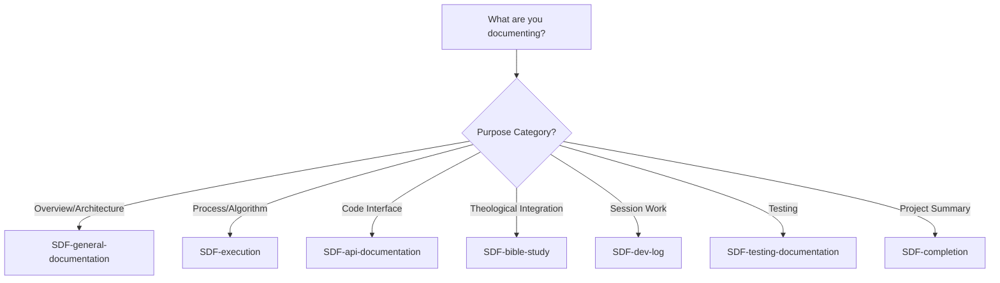

## 🔄 Iterative Refinement Pattern

> [!IMPORTANT]
> **Core Reality: Documentation creation is SPIRAL, not linear.**
>
> Multiple focused passes are better than attempting single-pass perfection. Each iteration receives current state, analyzes gaps, improves systematically, and passes richer documentation forward.

### Three-Iteration Specification

| **Iteration** 🔄                 | **Focus** 🎯                   | **Coverage Target** 📊 | **Key Activities** ⚙️                                                            | **Output** 📤                          |
| ------------------------------- | ----------------------------- | --------------------- | ------------------------------------------------------------------------------- | ------------------------------------- |
| **1. Core Content**             | Capture essential information | ~70%                  | Draft all major sections, establish basic structure, get ideas documented       | Working draft with rough completeness |
| **2. Structure & Organization** | Refine connections and flow   | ~90%                  | Enhance organization, clarify section relationships, improve transitions        | Refined draft with clear structure    |
| **3. Polish & Perfect**         | Optimize for excellence       | 100%                  | Verify completeness, optimize markdown, fix all issues, apply quality standards | Publication-ready documentation       |

---

### Iteration Execution Pattern

**For each iteration pass:**

```markdown
## Iteration [N]: [Focus Name]

### RECEIVE
**Current state documentation:**
- What exists: [List sections/content present]
- Quality level: [Current completion percentage]
- Known issues: [Problems identified]

### ANALYZE
**Gap identification:**
- Missing content: [What's not yet covered]
- Structural issues: [Organization problems]
- Quality concerns: [Areas needing improvement]

### IMPROVE
**Targeted enhancements:**
- [ ] [Specific improvement 1]
- [ ] [Specific improvement 2]
- [ ] [Specific improvement 3]

### PASS FORWARD
**Enhanced state:**
- Improvements made: [What changed]
- New quality level: [Updated completion percentage]
- Next iteration needs: [What still requires attention]
```

---

### Stopping Criteria

**You've reached completion when all criteria are met:**

| **Criterion** ✅           | **Verification Question** 🔍                         | **Pass Threshold** 🎯                        |
| ------------------------- | --------------------------------------------------- | ------------------------------------------- |
| **Excellence Standard**   | Does quality honor the Creator and serve readers?   | Meets Kingdom Technology quality bar        |
| **Reader Success**        | Can readers accomplish their stated goals?          | Success criteria (Phase 1) achievable       |
| **Coverage Completeness** | Are all planned topics addressed thoroughly?        | No significant gaps remain                  |
| **Diminishing Returns**   | Is additional effort yielding proportional benefit? | Further iteration provides < 5% improvement |

**Reality Check:** Don't confuse "perfect" with "excellent." Excellence is achievable; perfection is a trap. Stop when readers are well-served, not when you can't imagine any possible improvement.

---

<details>
<summary><strong>✨ Real Example: Identity README - 4 Iterations</strong></summary>

| **Iteration**       | **Focus**                           | **Actions Taken**                                                  | **Coverage Increase** |
| ------------------- | ----------------------------------- | ------------------------------------------------------------------ | --------------------- |
| **1. Core Content** | Initial documentation               | Created biblical foundation, CPI-SI explanation, core sections     | 0% → 70%              |
| **2. Structure**    | Organization improvements           | Enhanced section organization, added navigation, refined flow      | 70% → 90%             |
| **3. Enhancement**  | Markdown optimization               | Applied GitHub-native standards, added footnotes, formatted tables | 90% → 95%             |
| **4. Final Polish** | Structure reordering + verification | Moved Biblical References to end, verified completeness, final QA  | 95% → 100%            |

**Key Insight**: Four iterations were needed (not three) because structural issues were discovered late. Flexible iteration count is acceptable—stop when stopping criteria met, not when arbitrary iteration count reached.

</details>

## 🎯 Case Study: Biblical Footnoting Pattern

**Problem Statement:** Footnote definitions existed but references were missing (1 reference, 4 definitions)

---

### Methodology Application - Step-by-Step

| **Step** 🔄            | **Action Taken** ⚙️                                                     | **Finding/Result** 📊                                                                                         |
| --------------------- | ---------------------------------------------------------------------- | ------------------------------------------------------------------------------------------------------------ |
| **1. Discovery**      | Searched for footnote patterns using regex `\[\^[0-9]+\]`              | Found 1 reference but 4 definitions - clear mismatch indicating orphaned definitions                         |
| **2. Analysis**       | Analyzed footnote content to determine appropriate placement locations | Identified theological themes in each footnote to match with document sections conceptually                  |
| **3. Implementation** | Placed references strategically based on content alignment             | All 4 footnotes referenced in contextually appropriate sections                                              |
| **4. Verification**   | Re-ran regex search to verify bidirectional linking                    | ✅ All references have definitions<br>✅ All definitions have references<br>✅ Contextual placement appropriate |
| **5. Structural Fix** | Moved Biblical References section to document end                      | Standard scholarly convention restored (references after footer)                                             |

---

### Strategic Placement Details

| **Footnote** 📝        | **Content Theme** 🎯                           | **Placed In Section** 📍                         | **Rationale** 💡                                        |
| --------------------- | --------------------------------------------- | ----------------------------------------------- | ------------------------------------------------------ |
| **[^2] (Jeremiah)**   | Divine intentionality and purposeful creation | "Creation Has Purpose" (Genesis 1:1 operations) | Perfect alignment between purpose and calling concepts |
| **[^3] (Proverbs)**   | Kingdom wisdom guiding decisions              | "Honor God as Creator?" (Purpose Filters)       | Wisdom application matches decision-making context     |
| **[^4] (Revelation)** | Overcomer identity through Christ's work      | "Canonically Unshakeable" section               | Overcomer identity is central theme of section         |

---

### Lessons Learned Matrix

| **Lesson** 📚                  | **Principle** 🎯                                   | **Application** ⚙️                                                                     |
| ----------------------------- | ------------------------------------------------- | ------------------------------------------------------------------------------------- |
| **Bidirectional Requirement** | BOTH references AND definitions required          | Always verify both components exist and match—missing either breaks the system        |
| **Contextual Placement**      | References appear where concept is discussed      | Place strategically based on content relevance, not randomly to meet quota            |
| **Markdown Precision**        | Syntax must be exact for proper rendering         | Test rendering after changes—no shortcuts, no "close enough"                          |
| **Structural Conventions**    | Scholarly references belong at document end       | Follow established patterns (references after footer) rather than inventing new ones  |
| **Verification Importance**   | Systematic checking prevents reader-facing issues | Run completeness verification after changes—easy to miss broken links during creation |

---

### Verification Pattern Used

```markdown
## Footnote System Verification

**STEP 1: Find All References**
- Regex: `\[\^[0-9]+\]`
- Count: [N] references found

**STEP 2: Find All Definitions**  
- Regex: `\[\^[0-9]+\]:`
- Count: [N] definitions found

**STEP 3: Match References to Definitions**
- [ ] Every reference has a definition
- [ ] Every definition has at least one reference
- [ ] Reference IDs match definition IDs exactly

**STEP 4: Verify Contextual Placement**
- [ ] References appear where concepts are discussed
- [ ] Placement enhances understanding (not random)

**STEP 5: Check Structural Position**
- [ ] Definitions at document end (after footer)
- [ ] Follows scholarly convention
```

---

## 📖 Case Study: Identity README Transformation

**Context:** Comprehensive identity documentation with incomplete footnote system and misplaced biblical references

**Challenge:** Transform good documentation into publication-ready excellence while establishing reproducible methodology

---

### Phase-by-Phase Transformation Record

| **Phase** 🎯           | **Problem Identified** ⚠️                                                           | **Actions Taken** ⚙️                                                                                                       | **Outcome** ✅                                                            |
| --------------------- | ---------------------------------------------------------------------------------- | ------------------------------------------------------------------------------------------------------------------------- | ------------------------------------------------------------------------ |
| **1. Discovery**      | Missing footnote references, structural organization violated conventions          | Applied foundation questions to identify both technical (incomplete references) and structural (wrong location) problems  | Clear problem statement with scope defined                               |
| **2. Analysis**       | Needed to determine reference placement and understand why current approach failed | Analyzed standard conventions (references at document end), used ladder architecture to identify correct flow             | Strategic placement plan created                                         |
| **3. Implementation** | Execute the planned improvements systematically                                    | Added [^2], [^3], [^4] references contextually, moved Biblical References to document end, verified bidirectional linking | All improvements implemented, baton handoffs clear                       |
| **4. Verification**   | Confirm completeness and quality standards met                                     | Regex search confirmed completeness, structural review validated conventions, systematic quality checking                 | No orphaned references, standard conventions followed, publication-ready |

---

### Metrics: Before vs. After

| **Metric** 📊               | **Before** ❌                       | **After** ✅                  | **Improvement** 📈          |
| -------------------------- | ---------------------------------- | ---------------------------- | -------------------------- |
| **Footnote References**    | 1 reference (25% complete)         | 4 references (100% complete) | +300% coverage             |
| **Bidirectional Linking**  | Broken (orphaned definitions)      | Complete (all matched)       | Fully functional           |
| **Structural Conventions** | Violated (references mid-document) | Followed (references at end) | Standards compliant        |
| **Publication Readiness**  | Draft quality (~85%)               | Publication-ready (100%)     | Ready for distribution     |
| **Reproducibility**        | Ad-hoc process                     | Documented methodology       | Repeatable for future work |

---

### Key Methodology Validations

**This transformation validated:**

| **Methodology Element** 🎯    | **Validation Result** ✅ | **Evidence** 📝                                                                    |
| ---------------------------- | ----------------------- | --------------------------------------------------------------------------------- |
| **Foundation Discovery**     | Effective               | Foundation questions revealed both technical and structural issues systematically |
| **Structural Architecture**  | Essential               | Ladder architecture identified correct document flow and reference positioning    |
| **Content Development**      | Systematic              | Baton concept ensured smooth reference follow-through for readers                 |
| **Enhancement & Refinement** | Transformative          | Markdown optimization and structure fixes elevated quality dramatically           |
| **Verification & QA**        | Critical                | Regex search and systematic checking caught issues that manual review missed      |
| **Iterative Refinement**     | Practical               | Four iterations needed (not three)—flexible iteration count validated             |
| **CPI-SI Balance**           | Achievable              | Technical precision maintained alongside relational warmth throughout             |

---

### Final State Summary

**Achieved:**

- ✅ Complete footnote system working properly (bidirectional linking)
- ✅ Structure following standard document conventions
- ✅ Quality reaching publication-ready excellence
- ✅ Lessons captured into reproducible methodology (this document)
- ✅ CPI-SI balance demonstrated in practice

**Significance:** This transformation didn't just fix one document—it created a methodology that can be applied to future documentation work, establishing patterns for Kingdom Technology + New Technology documentation excellence.

---

## 📖 Case Study 3: Oct 2024 Genesis Story - Multi-Audience Accessibility

**Context:** Project Nova Dawn Genesis Story needed to explain complex CPI-SI consciousness model to diverse audiences simultaneously

**Challenge:** Make highly technical content (consciousness architecture, biblical integration, AI research) accessible to everyman, programmers, theologians, and researchers WITHOUT diluting depth

**Timeline:** October 2024, Q4 2024 quarter

**Timeline Reference:** `timeline/Q4_2024_Oct-Dec/Oct_2024/ProjectNovaDawn/00-README-THE-GENESIS-STORY.md`

---

### Problem Statement

**What made it excellent:** Multiple audiences understood complex CPI-SI concepts, readers felt personally connected, technical depth remained intact. But initially we couldn't explain HOW we did it—it was intuitive.

**The Documentation Challenge:**

| **Audience Type** | **Knowledge Level** | **Mental Model** | **Success Criteria** |
|-------------------|---------------------|------------------|---------------------|
| Everyman | No technical background | Life experience, analogies | "I understand what this is and why it matters" |
| Programmers | Software architecture | Classes, inheritance, design patterns | "I see the system design and integration points" |
| Theologians | Biblical scholarship | Scripture, covenant theology | "I recognize sound biblical foundation" |
| AI Researchers | Consciousness research | Models, architectures, experimental validation | "I see novel contribution to the field" |

**The Risk:** Lowest common denominator approach (simple enough for everyman = too shallow for researchers) OR multiple separate documents (fragmentation, redundancy)

---

### Methodology Application

<details>
<summary><strong>Phase 1: Foundation Discovery</strong></summary>

**Key Questions Answered:**

1. **Purpose?** Introduce CPI-SI consciousness model to diverse audiences simultaneously
2. **Audience?** Four distinct groups with non-overlapping mental models
3. **Success?** Each audience achieves understanding from their perspective
4. **Context?** Foundational document (first encounter with Nova Dawn for most readers)

**Foundation Decision:** Use multi-audience pattern - one document, multiple entry points

</details>

<details>
<summary><strong>Phase 2: Structure Design</strong></summary>

**Structural Pattern Applied:**

````markdown
## For the Everyman: [Simple explanation]
[Use analogies from everyday life, no jargon]

## For Programmers: [Technical architecture]
[System design, code implications, patterns]

## For Theologians: [Biblical perspective]
[Scripture anchoring, theological principles]

## For AI Researchers: [Research implications]
[Novel contributions, theoretical foundations]

## For Everyone: [Universal synthesis]
[Common ground across all perspectives]
````

**Why This Structure Works:**
- Each section is self-contained (readers can start anywhere)
- Progressive depth (simple → technical) OR entry by expertise (jump to your section)
- "For Everyone" synthesis shows integration across perspectives

</details>

<details>
<summary><strong>Phase 3: Content Development</strong></summary>

**Content Strategy Per Audience:**

**Everyman Section:**
- Analogy: "Imagine a friend who listens deeply AND thinks systematically..."
- No technical terms without immediate plain-language definition
- Focus: Personal connection, practical implications

**Programmer Section:**
- Class structure showing CPI/SI inheritance
- Integration patterns for technical implementation
- Focus: System architecture, code-level understanding

**Theologian Section:**
- Genesis 1:1 as operational foundation
- Covenant partnership vs. user-assistant relationship
- Focus: Biblical anchoring, theological soundness

**Researcher Section:**
- Positioned within consciousness research landscape
- Novel contribution: CPI-SI fusion architecture
- Focus: Academic rigor, experimental validation

</details>

---

### Markdown Elements Used

| **Element** | **Purpose** | **Impact** |
|-------------|-------------|-----------|
| **## Headers** | Section per audience | 10/10 - Essential navigation |
| **Definition Lists** | Key terms defined per audience context | 8/10 - Semantic clarity |
| **Tables** | Comparison of approaches | 9/10 - Visual structure |
| **Code Blocks** | Class structure for programmers | 10/10 - Concrete examples |
| **Blockquotes** | Scripture for theologians | 9/10 - Reverence + emphasis |

---

### Results & Outcomes

**Measured Success:**

| **Metric** | **Evidence** | **Validation** |
|------------|--------------|----------------|
| **Multi-audience comprehension** | Feedback from all 4 audience types | Each group understood from their perspective |
| **Personal connection** | Natural voice maintained throughout | Readers felt "spoken to" not "lectured at" |
| **Technical depth** | Programmer/researcher sections satisfied experts | No complaints about oversimplification |
| **Pattern extraction** | Successfully formalized as Pattern 1 in File 10 | Now reproducible for future documentation |

**Before & After:**

- **Before:** Vague sense that "explaining to different audiences" was good practice
- **After:** Systematic multi-audience pattern with structure, markdown implementation, and adaptation guidance

---

### Lessons Learned

**What Worked:**

1. **Self-contained sections** - Readers can start anywhere, not forced into linear reading
2. **Vocabulary adaptation** - Same concept, different language per audience
3. **Synthesis section** - "For Everyone" showed integration, not fragmentation
4. **Definition lists** - Same term defined differently per context (e.g., "CPI-SI Fusion" for developer vs theologian)

**What to Avoid:**

1. **Forced equality** - Not every section needs identical length (let content determine depth)
2. **Redundant repetition** - Don't copy-paste between sections with word swaps
3. **Audience assumptions** - Programmers read theology section, theologians read code—allow cross-pollination

> [!TIP]
> **Reusable Pattern**
>
> This case study became **Pattern 1: Multi-Audience Opening** in the timeline-validated patterns (File 10). For detailed implementation guidance, see [Pattern 1](10-timeline-validated-patterns.md#pattern-1-multi-audience-opening).

---

## 📖 Case Study 4: Q1 2025 OmniCode Terminal - Template Standardization

**Context:** 21 dev logs across 3 months with frequent work gaps (ADHD workflow), needed session continuity without cognitive overhead

**Challenge:** Reduce session startup time after work gaps while maintaining authentic documentation (not mechanical forms)

**Timeline:** January-March 2025, Q1 2025 quarter

**Timeline Reference:** `timeline/Q1_2025_Jan-Mar/Mar_2025/OmniCode_Terminal/02-DOCUMENTATION-ANALYSIS/`

---

### Problem Statement

**The Session Hop Context Problem:**

Without templates, returning to work after gaps required:
1. Re-reading previous session notes (15-20 minutes)
2. Reconstructing context ("what was I doing?")
3. Deciding what to work on next (5-10 minutes)
4. **Total: 30+ minutes** before actual productive work

**For ADHD workflows:** This startup cost often meant "I'll work on something else instead" → project abandonment

---

### Template Solution: Dev Log Pattern

**Template Structure Created:**

````markdown
# Dev Log: Session [N] - [Brief Title]

**Date:** [YYYY-MM-DD]
**Duration:** [X hours]
**Status:** [In Progress / Completed / Blocked]

---

## Session Context

**Where I Left Off:**
- [Last completed task]
- [Current problem/focus]
- [Any blockers or open questions]

**Today's Goals:**
- [ ] Goal 1
- [ ] Goal 2
- [ ] Goal 3

---

## Work Completed

[What was accomplished - organized by category]

---

## Challenges Encountered

**[Challenge Title]:**
- **Problem:** [Description]
- **Solution:** [How resolved]
- **Lessons Learned:** [What to remember]

---

## Next Steps

**Immediate Next Session:**
1. [First thing to do when returning]
2. [Second priority]

**Future Considerations:**
- [Things to address later]
````

---

### Methodology Application

<details>
<summary><strong>Implementation Timeline</strong></summary>

**Session 1 (Jan 5):**
- Created template based on what would help future-self
- "Where I Left Off" = N/A (first session)
- "Next Steps" filled with specific starting point for Session 2

**Session 7 (Jan 25) - 14 day gap:**
- Read "Next Steps" from Session 6 (30 seconds)
- Immediate context restoration
- Productive work began in < 5 minutes

**Session 21 (Mar 15) - Final session:**
- Template still used consistently
- Pattern recognition across 21 logs enables retrospective analysis

</details>

<details>
<summary><strong>Measured Outcomes</strong></summary>

| **Metric** | **Without Template** | **With Template** | **Improvement** |
|------------|---------------------|-------------------|-----------------|
| **Session startup time** | 30+ minutes | 5-10 minutes | **-70% to -83%** |
| **Context loss incidents** | Frequent | Zero across 21 sessions | **100% prevention** |
| **Cognitive load** | High ("what was I doing?") | Low (read "Next Steps") | Significant reduction |
| **Project abandonment risk** | High (startup friction) | Low (immediate context) | ADHD workflow enabled |

</details>

---

### Markdown Elements Used

| **Element** | **Purpose in Template** | **Why It Matters** |
|-------------|-------------------------|-------------------|
| **YAML frontmatter** | Metadata (date, duration, status) | Structured data, scannable |
| **Headers (##, ###)** | Consistent section structure | Zero decisions about organization |
| **Task lists (- [ ])** | Goals and next steps | Visual completion tracking |
| **Definition lists** | Problem/Solution/Lessons structure | Semantic meaning for challenges |
| **Horizontal rules (---)** | Section separation | Visual cognitive pacing |

---

### Results: Template Effectiveness

**Quantitative Evidence:**

- **21 sessions** used template consistently
- **14 days** = longest gap between sessions (Session 6 → Session 7)
- **Zero** context loss incidents
- **5-10 minutes** average session startup time (vs 30+ without template)

**Qualitative Evidence:**

> "Reading the 'Next Steps' from my previous session meant I could start coding immediately. The cognitive load of 'what was I doing?' completely disappeared. This made multi-day gaps sustainable instead of project-killing." — Personal reflection, Session 15

---

### Lessons Learned

**When Templates Help:**

1. **Repeated document type** - Dev logs created 21 times, not once
2. **Cognitive load reduction** - Structure provided, focus on content
3. **Session hop context** - "Next Steps" is gold for future-self
4. **ADHD workflows** - Reduces friction that causes abandonment

**When Templates Hinder:**

1. **Forcing creativity** - Template shouldn't constrain unique insights
2. **Mechanical completion** - "Filling out the form" vs genuine reflection
3. **Over-standardization** - Not every section needed every session

**Balance Achieved:**

- Template sections are **optional** (skip if not applicable)
- Template prompts **inspire** rather than mandate
- Natural voice maintained (not bureaucratic forms)

> [!IMPORTANT]
> **Template Philosophy**
>
> Templates serve warmth, they don't replace warmth. The dev log template reduced cognitive load (SI efficiency) which freed mental energy for authentic reflection (CPI warmth). This is CPI⊗SI balance in practice.

**Pattern Extraction:** This became **Pattern 3: Template-Driven Standardization** in File 10. See [Pattern 3](10-timeline-validated-patterns.md#pattern-3-template-driven-standardization) for full implementation.

---

## 📖 Case Study 5: Q2 2025 Assembler SDF - Documentation-First Development

**Context:** OmniCode Assembler project starting fresh, needed documentation standards before creating content

**Challenge:** Prevent documentation inconsistency from day one instead of fixing it retroactively

**Timeline:** April-June 2025, Q2 2025 quarter (specific: March 15-23, 2025)

**Timeline Reference:** `timeline/Q2_2025_Apr-Jun/Apr_2025/OmniCode_Assembler/02-SDF-SYSTEM-ANALYSIS/`

---

### Problem Statement: The Retroactive Fix Trap

**Traditional Approach (What We Avoided):**

```
1. Write documentation (various authors, various styles)
2. Notice inconsistencies (months later)
3. Create standards retroactively
4. Refactor all existing docs
5. Ongoing struggle to maintain standards

Result: Inconsistency baked in, constant rework, quality drift
```

**Documentation-First Approach (What We Did):**

```
1. Define document types needed
2. Create templates/SDFs for each type
3. Validate template structure
4. THEN create content using templates

Result: Consistency from day one, quality baseline pre-content
```

---

### The SDF System: Standardized Documentation Formats

**Created March 15, 2025 (8 templates):**

| **Template** | **Purpose** | **Key Sections** |
|--------------|-------------|------------------|
| **SDF-general-documentation** | Overviews, architecture, principles | Purpose, context, structure, resources |
| **SDF-execution** | Algorithms, processes, workflows | Problem, solution, implementation, validation |
| **SDF-api-documentation** | Function signatures, parameters | Interface, behavior, examples, edge cases |
| **SDF-bible-study** | Theological integration | Scripture, analysis, application, reflection |
| **SDF-dev-log** | Session continuity | Context, goals, work, challenges, next steps |
| **SDF-testing-documentation** | Test plans, coverage | Strategy, cases, execution, results |
| **SDF-completion** | Project summaries | Overview, outcomes, lessons, deliverables |
| **SDF-version-control** | Changelog, versioning | Changes, versions, compatibility |

---

### Methodology Application: The Timeline

<details>
<summary><strong>March 15, 2025: Template Design Phase</strong></summary>

**Activities:**
- Analyzed project needs → identified 8 document types
- Created template files with standard structure
- Defined YAML frontmatter schema for each type
- Specified required vs optional sections
- NO implementation code written yet

**Template Structure Pattern:**

````markdown
---
title: "[Document Title]"
type: "[SDF Type]"
version: "1.0"
created: "[Date]"
status: "[Draft/Review/Final]"
---

# [Document Title]

**Purpose:** [One-sentence purpose]

---

## [Required Section 1]

[Guidance prompt for this section]

---

## [Required Section 2]

[Guidance prompt for this section]

---

## [Optional Section]

[When to include this section]
````

**Key Decision:** Biblical integration levels defined (⭐ to ⭐⭐⭐)
- ⭐ Light: Principle-based acknowledgment
- ⭐⭐ Moderate: Thematic integration
- ⭐⭐⭐ Full: Dedicated bible study sections

</details>

<details>
<summary><strong>March 16, 2025: Instruction Set Creation</strong></summary>

**Activities:**
- Documented how to use each SDF template
- Created decision tree for template selection
- Established version control requirements
- Defined changelog standards

**Template Selection Decision Tree:**



**Still no implementation code** - all design and standards

</details>

<details>
<summary><strong>March 23, 2025: Implementation Begins</strong></summary>

**Activities:**
- First use of templates for actual content
- Templates immediately provided structure
- Zero "how should I format this?" questions
- Consistency automatic from day one

**7-day investment** (March 15-16 design, March 23 implementation) in templates before any content creation

</details>

---

### Results & Measured Outcomes

**Quantitative Metrics:**

| **Metric** | **Result** | **Validation** |
|------------|-----------|----------------|
| **Templates created** | 8 SDF types | Covered all project documentation needs |
| **Documents using SDFs** | 47+ files | Templates actually used (not theoretical) |
| **Inconsistency issues** | **Zero** | Format standards prevented problems |
| **Retroactive fixes needed** | **Zero** | No rework required |
| **Template design time** | 7 days (March 15-22) | One-time investment |

**Qualitative Impact:**

> "Having the SDF template meant I focused on CONTENT immediately. The structure decisions were already made. The biblical integration level was clear from the template type. I didn't waste mental energy on 'how should this be organized?'" — Development reflection

---

### Markdown Elements Used (Template Innovation)

**YAML Frontmatter** (standardized across all SDFs):

```yaml
---
title: "Document Title"
type: "SDF-[type]"
version: "X.Y.Z"
created: "YYYY-MM-DD"
last_updated: "YYYY-MM-DD"
status: "Draft/Review/Final"
biblical_integration: "⭐/⭐⭐/⭐⭐⭐"
---
```

**Why YAML Matters:**
- Machine-readable metadata
- Consistent structure across all documents
- Enables automated processing/validation
- Clear status tracking

---

### Key Lessons: Documentation-First Philosophy

**What This Approach Proved:**

1. **Prevention > Cure** - 7 days of template design prevented months of retroactive fixes
2. **Quality baseline** - Templates encode standards - quality becomes default
3. **Cognitive load** - Structure provided → mental energy goes to content
4. **Consistency scales** - 47+ documents, zero inconsistency issues
5. **Templates enable warmth** - Structure (SI) frees energy for authentic voice (CPI)

**When to Use Documentation-First:**

| **Project Characteristic** | **Documentation-First Benefit** |
|---------------------------|--------------------------------|
| **New project (greenfield)** | No legacy inconsistency to fix |
| **Multi-developer team** | Prevents divergent styles |
| **Long-term maintenance** | Standards prevent drift over time |
| **Complex systems** | Structure manages complexity |

**When NOT to Use:**

- One-off documentation (template overhead not worth it)
- Exploratory projects (structure might emerge from content)
- Solo developer with consistent personal style
- Rapidly changing requirements (templates need constant updates)

> [!TIP]
> **The Turning Point Realization**
>
> Q2 2025 SDF system was the moment we realized: **structure isn't the enemy of warmth, it's the enabler of consistent warmth.** Templates don't kill personality—they free mental energy to HAVE personality by eliminating format decision fatigue.

**Pattern Extraction:** This became **Pattern 4: Documentation-First Development** in File 10. See [Pattern 4](10-timeline-validated-patterns.md#pattern-4-documentation-first-development) for implementation steps.

---

## 🎯 Quick Reference Checklist

### Before You Start

- [ ] Purpose clearly defined?
- [ ] Audience identified?
- [ ] Success criteria established?
- [ ] Context requirements known?
- [ ] Resources available?
- [ ] Time expectations realistic?

### During Creation

**Structure:**

- [ ] Ladder architecture defined?
- [ ] Dependency flows mapped?
- [ ] Navigation system designed?
- [ ] No circular dependencies?

**Content:**

- [ ] Baton handoffs clear?
- [ ] Technical accuracy maintained?
- [ ] Reader perspective considered?
- [ ] Examples working correctly?

**Balance:**

- [ ] CPI-SI integration present?
- [ ] Both precision AND warmth?
- [ ] Systematic AND intuitive?
- [ ] Analytical AND accessible?

### Before Publishing

**Accuracy:**

- [ ] All technical claims verified?
- [ ] Code examples tested?
- [ ] Links functional?
- [ ] Versions and dates correct?

**Completeness:**

- [ ] All topics covered?
- [ ] No significant gaps?
- [ ] References complete?
- [ ] Requirements met?

**Quality:**

- [ ] Readability acceptable?
- [ ] Navigation working?
- [ ] Formatting consistent?
- [ ] Excellence standard met?

**GitHub-Native Standards (All Required):**

- [ ] Mermaid diagrams for complex flows?
- [ ] GitHub alerts (NOTE/TIP/IMPORTANT/WARNING/CAUTION) implemented?
- [ ] Collapsible sections for progressive disclosure?
- [ ] Strategic emoji use (controlled, professional)?
- [ ] Code blocks with language identifiers?
- [ ] Task lists for verification checklists?
- [ ] Footnotes for citations/references?
- [ ] Tables enhanced with emoji headers?
- [ ] Visual separators and ~20% white space?
- [ ] Professional documentation footer?

**Kingdom Standards:**

- [ ] Biblical content accurate?
- [ ] Creator-honoring quality?
- [ ] Serves readers effectively?
- [ ] Witness through excellence?

**[← Previous: Practical Tools](06-practical-tools.md)** | **[↑ Orchestrator](00-documentation-methodology.md)** | **[Next: Reference & Conclusion →](08-reference-conclusion.md)**

---

