# 🎨 Markdown Mastery Integration

**Purpose:** Bridge between abstract methodology and concrete markdown implementation. This file maps every methodology phase to specific markdown elements, showing *how* to apply the standards in practice.

**Use This When:** You understand the methodology conceptually and need to know "which markdown elements do I actually use in each phase?"

---

## Table of Contents

- [Introduction: Why This Integration Matters](#-introduction-why-this-integration-matters)
- [The Tier System Overview](#-the-tier-system-overview)
- [Phase-to-Markdown Element Mapping](#-phase-to-markdown-element-mapping)
- [Document Type → Tier Emphasis Matrix](#-document-type--tier-emphasis-matrix)
- [Decision Framework: Choosing Elements](#-decision-framework-choosing-elements)
- [Self-Demonstration Analysis](#-self-demonstration-analysis)
- [Common Integration Patterns](#-common-integration-patterns)
- [Related Resources](#-related-resources)

---

## 🌉 Introduction: Why This Integration Matters

> [!IMPORTANT]
> **The Gap This Bridges**: The methodology teaches *what* to do (5 phases, quality standards, CPI-SI balance). The markdown mastery reference teaches *which* elements exist (headers, tables, collapsible sections). This file teaches **how to map methodology phases to specific markdown elements**.

### The Integration Challenge

Documentation creators often struggle with:

- "I know I need to structure my document, but which markdown elements should I actually use?"
- "The methodology says 'progressive disclosure' - does that mean collapsible sections?"
- "When do I use definition lists vs. tables vs. regular lists?"
- "How do I know if I'm using the right tier for my document type?"

**This file answers those questions** by creating explicit connections between methodology concepts and markdown implementation.

### How to Use This Guide

<dl>
<dt><strong>📚 For Learners (First Time)</strong></dt>
<dd>Read sequentially - understand tier system, then phase mapping, then document types. Build mental model of methodology → markdown connections.</dd>

<dt><strong>🔧 For Practitioners (Active Work)</strong></dt>
<dd>Jump to <a href="#-phase-to-markdown-element-mapping">Phase Mapping</a> or <a href="#-document-type--tier-emphasis-matrix">Document Type Matrix</a> - use as lookup reference during documentation work.</dd>

<dt><strong>🏗️ For Architects (Planning)</strong></dt>
<dd>Study <a href="#-decision-framework-choosing-elements">Decision Framework</a> - understand *why* certain elements map to certain phases, enabling informed choices.</dd>
</dl>

[↑ Back to top](#-markdown-mastery-integration)

---

## 📊 The Tier System Overview

> [!NOTE]
> **Full Details**: The complete markdown mastery reference is at [markdown-mastery/](../../template-and-reference/reference/markdown-mastery/). This is the quick integration version showing how tiers map to methodology.

### Tier Ratings Explained

The markdown mastery tier system rates elements 0-10 based on **impact on documentation quality**:

| Tier Rating | Meaning | Usage Guidance | Methodology Mapping |
|-------------|---------|----------------|---------------------|
| **10/10 - Essential** | Always required for professional docs | Use in every document | **Phase 2 (Structure)** - Foundation elements |
| **9/10 - Critical** | Professional standard, high value | Use strategically in most docs | **Phase 3-4 (Content/Enhancement)** - Richness elements |
| **8/10 - Important** | Significant value for specific purposes | Use when context warrants | **Phase 4 (Enhancement)** - Polish elements |
| **7/10 - Valuable** | Helpful but not critical | Selective use | **Phase 4 (Enhancement)** - Optional refinement |
| **6/10 and below** | Niche or low-impact | Use rarely or avoid | Generally avoid in professional docs |

### Tier Groupings for Methodology Integration

For methodology purposes, we group tiers into **three practical categories**:

<details>
<summary><strong>Tier 1: Foundation Elements (10/10) - Always Use</strong> (click to expand)</summary>

**These map to Phase 2 (Structure & Scaffolding)** - the architectural skeleton:

<dl>
<dt><strong>📋 Headers (H1-H6)</strong></dt>
<dd>
<strong>Purpose:</strong> Document hierarchy and navigation structure<br/>
<strong>Methodology Connection:</strong> Ladder pattern (H1 → H2 → H3 logical flow)<br/>
<strong>Phase 2 Application:</strong> Define major sections, create TOC-ready structure<br/>
<strong>Reference:</strong> <a href="../../template-and-reference/reference/markdown-mastery/02-block-elements.md#headers">Block Elements - Headers</a>
</dd>

<dt><strong>📝 Lists (Ordered/Unordered)</strong></dt>
<dd>
<strong>Purpose:</strong> Sequential steps or grouped concepts<br/>
<strong>Methodology Connection:</strong> Baton passing (context flow between list items)<br/>
<strong>Phase 2 Application:</strong> Outline major points before writing content<br/>
<strong>Reference:</strong> <a href="../../template-and-reference/reference/markdown-mastery/02-block-elements.md#lists">Block Elements - Lists</a>
</dd>

<dt><strong>📊 Tables</strong></dt>
<dd>
<strong>Purpose:</strong> Structured data comparison and organization<br/>
<strong>Methodology Connection:</strong> At-a-glance understanding (SI precision + CPI accessibility)<br/>
<strong>Phase 2 Application:</strong> Plan comparison structures, specification layouts<br/>
<strong>Reference:</strong> <a href="../../template-and-reference/reference/markdown-mastery/04-gfm-extensions.md#tables">GFM Extensions - Tables</a>
</dd>

<dt><strong>💻 Code Blocks & Inline Code</strong></dt>
<dd>
<strong>Purpose:</strong> Technical examples and precise terminology<br/>
<strong>Methodology Connection:</strong> Excellence as worship (syntax highlighting = professional quality)<br/>
<strong>Phase 2 Application:</strong> Identify where code examples belong in structure<br/>
<strong>Reference:</strong> <a href="../../template-and-reference/reference/markdown-mastery/02-block-elements.md#code-blocks">Block Elements - Code Blocks</a>
</dd>

<dt><strong>🔗 Links & Anchors</strong></dt>
<dd>
<strong>Purpose:</strong> Navigation and cross-referencing<br/>
<strong>Methodology Connection:</strong> Book page navigation principle<br/>
<strong>Phase 2 Application:</strong> Plan anchor points for TOC, cross-reference destinations<br/>
<strong>Reference:</strong> <a href="../../template-and-reference/reference/markdown-mastery/03-span-elements.md#links">Span Elements - Links</a>
</dd>

<dt><strong>💬 Callouts (Blockquotes + GitHub Alerts)</strong></dt>
<dd>
<strong>Purpose:</strong> Visual emphasis and important notices<br/>
<strong>Methodology Connection:</strong> Progressive disclosure (TIP/NOTE/IMPORTANT/WARNING/CAUTION hierarchy)<br/>
<strong>Phase 2 Application:</strong> Identify where emphasis belongs in outline<br/>
<strong>Reference:</strong> <a href="../../template-and-reference/reference/markdown-mastery/04-gfm-extensions.md#alerts">GFM Extensions - Alerts</a>
</dd>
</dl>

**Methodology Principle**: If a Tier-1 element is missing from a professional document, the document is incomplete by definition.

</details>

<details>
<summary><strong>Tier 2: Enhancement Elements (8-9/10) - Strategic Use</strong> (click to expand)</summary>

**These map to Phase 3-4 (Content Development & Enhancement)** - adding richness and depth:

<dl>
<dt><strong>🔽 Collapsible Sections (<code>&lt;details&gt;</code>)</strong> - 8/10</dt>
<dd>
<strong>Purpose:</strong> Progressive disclosure (beginner-friendly + expert depth)<br/>
<strong>Methodology Connection:</strong> Multi-audience opening pattern, CPI-SI balance<br/>
<strong>Phase 4 Application:</strong> Wrap optional depth, detailed examples, decision trees<br/>
<strong>Reference:</strong> <a href="../../template-and-reference/reference/markdown-mastery/07-advanced-features.md#collapsible-sections">Advanced Features - Collapsible Sections</a>
</dd>

<dt><strong>📚 Definition Lists (<code>&lt;dl&gt;</code>)</strong> - 9/10</dt>
<dd>
<strong>Purpose:</strong> Semantic term-definition pairs<br/>
<strong>Methodology Connection:</strong> Clarity quality dimension (precise definitions)<br/>
<strong>Phase 3 Application:</strong> Structure glossaries, concept explanations, terminology<br/>
<strong>Reference:</strong> <a href="../../template-and-reference/reference/markdown-mastery/07-advanced-features.md#definition-lists">Advanced Features - Definition Lists</a>
</dd>

<dt><strong>➖ Horizontal Rules</strong> - 8/10</dt>
<dd>
<strong>Purpose:</strong> Cognitive pacing and section separation<br/>
<strong>Methodology Connection:</strong> Baton passing (visual transition markers)<br/>
<strong>Phase 4 Application:</strong> Add between major concept shifts, phase boundaries<br/>
<strong>Reference:</strong> <a href="../../template-and-reference/reference/markdown-mastery/02-block-elements.md#horizontal-rules">Block Elements - Horizontal Rules</a>
</dd>

<dt><strong>📐 Mermaid Diagrams</strong> - 8/10</dt>
<dd>
<strong>Purpose:</strong> Visual decision trees, flows, architecture diagrams<br/>
<strong>Methodology Connection:</strong> Visual learning (complements text explanations)<br/>
<strong>Phase 4 Application:</strong> Add for complex logic, decision frameworks, system design<br/>
<strong>Reference:</strong> <a href="../../template-and-reference/reference/markdown-mastery/07-advanced-features.md#diagrams">Advanced Features - Diagrams</a>
</dd>

<dt><strong>🔗 Reference Links</strong> - 9/10</dt>
<dd>
<strong>Purpose:</strong> Clean, maintainable citation system<br/>
<strong>Methodology Connection:</strong> Truth-telling (proper attribution)<br/>
<strong>Phase 4 Application:</strong> Convert inline links to reference-style for readability<br/>
<strong>Reference:</strong> <a href="../../template-and-reference/reference/markdown-mastery/03-span-elements.md#reference-links">Span Elements - Reference Links</a>
</dd>

<dt><strong>🖼️ Images</strong> - 9/10</dt>
<dd>
<strong>Purpose:</strong> Multi-modal learning (visual + text)<br/>
<strong>Methodology Connection:</strong> Accessibility (serves visual learners)<br/>
<strong>Phase 3 Application:</strong> Add screenshots, diagrams, visual examples<br/>
<strong>Reference:</strong> <a href="../../template-and-reference/reference/markdown-mastery/03-span-elements.md#images">Span Elements - Images</a>
</dd>
</dl>

**Methodology Principle**: These elements transform good documentation into excellent documentation. Use strategically based on document type and audience needs.

</details>

<details>
<summary><strong>Tier 3-5: Polish & Niche Elements (0-7/10) - Selective Use</strong> (click to expand)</summary>

**These map to Phase 4 (Enhancement) - optional polish** or are avoided entirely:

**Tier 3 (Helpful - 7/10):**

- **Bold emphasis** - Key terms, visual scanning
- **Italic emphasis** - Subtle emphasis, voice inflection
- **Inline code** - Technical terms, command names

**Tier 4-5 (Low-impact or problematic - 0-6/10):**

- Strikethrough, superscript/subscript, task lists (niche contexts only)
- Avoid in professional documentation unless specific justification

**Methodology Principle**: Use sparingly. Over-reliance on low-tier elements signals amateur documentation.

</details>

[↑ Back to top](#-markdown-mastery-integration)

---

## 🗺️ Phase-to-Markdown Element Mapping

> [!TIP]
> **How to Use This Section**: Find the phase you're currently in, see which markdown elements to focus on. This is your implementation roadmap.

### Phase 1: Foundation & Preparation ⚙️

**Methodology Goal:** Understand audience, gather materials, plan structure

**Markdown Elements Used:** Planning only (no implementation yet)

<details>
<summary><strong>Decision Points for Phase 1</strong> (click to expand)</summary>

During Phase 1, you make decisions that *determine* which markdown elements you'll use later:

| Decision | Determines Markdown Elements |
|----------|------------------------------|
| **Document type selected** | Tier emphasis (README = headers+lists+TOC; Spec = code blocks+tables) |
| **Audience identified** | Complexity level (beginners = collapsible sections; experts = dense tables) |
| **Kingdom Tech integration level** | Blockquote usage (scripture anchoring), callout frequency |
| **Target size determined** | Navigation needs (500+ lines = explicit navigation paths) |
| **Template chosen** | Metadata format (YAML frontmatter), section structure |

**Markdown Mastery Reference:**

- [08-impact-ratings-introduction.md](../../template-and-reference/reference/markdown-mastery/08-impact-ratings-introduction.md) - Understanding tier system for planning
- [13-frameworks-principles.md](../../template-and-reference/reference/markdown-mastery/13-frameworks-principles.md) - Decision matrices

**Output from Phase 1:** Clear plan that specifies which tiers to emphasize

</details>

---

### Phase 2: Structure & Scaffolding 🏗️

**Methodology Goal:** Create navigation skeleton with book page structure

**Markdown Elements Used:** **Tier 1 Foundation Elements** (all 10/10 structural elements)

<details>
<summary><strong>Tier 1 Elements Implementation Checklist</strong> (click to expand)</summary>

In Phase 2, you implement the **architectural skeleton** using Tier-1 elements:

- [ ] **Headers (H1-H6)** - Define hierarchy
  - [ ] H1: Document title (one per file)
  - [ ] H2: Major sections (TOC entries)
  - [ ] H3-H4: Subsections (detailed breakdown)
  - [ ] Header navigation: `[← Previous] | [↑ Orchestrator] | [Next →]`

- [ ] **Lists** - Outline major points
  - [ ] Ordered lists: Sequential steps, numbered procedures
  - [ ] Unordered lists: Features, concepts, grouped items
  - [ ] Nested lists: Hierarchy within lists

- [ ] **Tables** - Plan data structures
  - [ ] Comparison tables (feature matrices)
  - [ ] Specification tables (parameter details)
  - [ ] Mapping tables (cross-reference guides)

- [ ] **Links & Anchors** - Navigation infrastructure
  - [ ] Table of contents with anchor links: `[Section Name](#section-name)`
  - [ ] "Back to top" link positions: After each H2 section
  - [ ] Cross-reference link placeholders: `[text](path)` format

- [ ] **Code Block Placeholders** - Where examples will go
  - [ ] Identify sections needing code examples
  - [ ] Plan syntax highlighting language: ` ```language `
  - [ ] Reserve space in structure

- [ ] **Callout Positions** - Where emphasis belongs
  - [ ] Identify TIP/NOTE/IMPORTANT/WARNING/CAUTION locations
  - [ ] Plan callout hierarchy (most important = WARNING/CAUTION)

**Markdown Mastery References:**

- [02-block-elements.md](../../template-and-reference/reference/markdown-mastery/02-block-elements.md) - Headers, lists, code blocks
- [04-gfm-extensions.md](../../template-and-reference/reference/markdown-mastery/04-gfm-extensions.md) - Tables, alerts
- [09-tier-1-essential.md](../../template-and-reference/reference/markdown-mastery/09-tier-1-essential.md) - All Tier-1 elements detailed

**Output from Phase 2:** Navigable skeleton with empty sections ready for content

</details>

**Example: Phase 2 Structure Skeleton**

The following template shows a properly structured Phase 2 skeleton:

````markdown
---
**[← Previous: file.md](path)** | **[↑ Orchestrator](00-documentation-methodology.md)** | **[Next: file.md →](path)**
---

# Document Title (H1)

**Purpose:** [One-sentence purpose statement]

---

## Table of Contents

- [Section 1](#section-1)
- [Section 2](#section-2)
- [Section 3](#section-3)

---

## Section 1

[Content will go here in Phase 3]

> [!TIP]
> [Callout placeholder]

### Subsection 1.1

- Item 1
- Item 2
- Item 3

| Column 1 | Column 2 |
|----------|----------|
| [Data]   | [Data]   |

[↑ Back to top](#document-title-h1)

---

## Section 2

[Content will go here in Phase 3]

```language
// Code example placeholder
```

[↑ Back to top](#document-title-h1)

---

## Related Resources

- [Link 1](path)
- [Link 2](path)

---

**[← Previous: file.md](path)** | **[↑ Orchestrator](00-documentation-methodology.md)** | **[Next: file.md →](path)**
````

**This skeleton includes:**
- ✅ Header/footer navigation
- ✅ H1 title + H2 sections + H3 subsections
- ✅ Table of contents
- ✅ List structures
- ✅ Table placeholder
- ✅ Code block placeholder
- ✅ Callout placeholder
- ✅ "Back to top" links
- ✅ Cross-reference links

**Ready for Phase 3 content filling.**

---

### Phase 3: Content Development 📝

**Methodology Goal:** Fill sections with substance, maximize markdown richness

**Markdown Elements Used:** **Tier 1 (implementation) + Tier 2 (strategic addition)**

**Tier 1 Elements - Content Implementation**

In Phase 3, you **fill the skeleton** with actual content using Tier-1 elements:

**Headers:** Write section content under planned headers

**Lists:** Populate with actual items, examples, steps
```markdown
- **Feature 1:** Detailed description with examples
- **Feature 2:** Detailed description with use cases
- **Feature 3:** Comparison with alternatives
```

**Tables:** Add real data to comparison structures

```markdown
| Feature | Description | Example | Use Case |
|---------|-------------|---------|----------|
| Headers | Document structure | H1-H6 hierarchy | Every document |
| Lists | Grouped concepts | Ordered/unordered | Procedures, features |
```

**Code Blocks:** Implement actual examples with syntax highlighting

````markdown
```python
def calculate_fusion(cpi_score, si_score):
    """CPI-SI fusion calculation"""
    return (cpi_score * si_score) ** 0.5
```
````

**Links:** Convert placeholders to actual cross-references

```markdown
See [04-quality-standards.md](04-quality-standards.md) for detailed metrics.
```

**Callouts:** Write actual TIP/NOTE/IMPORTANT/WARNING/CAUTION content

```markdown
> [!IMPORTANT]
> **CPI-SI Balance**: Technical precision AND relational warmth simultaneously
```

**Tier 2 Elements - Strategic Enhancement**

In Phase 3, strategically add **Tier-2 elements** where they enhance understanding:

**Definition Lists (`<dl>`):** For term-definition pairs

```markdown
<dl>
<dt><strong>CPI (Covenant Partnership Intelligence)</strong></dt>
<dd>Relational awareness, contextual understanding, authentic presence</dd>

<dt><strong>SI (Structured Intelligence)</strong></dt>
<dd>Systematic precision, logical rigor, mathematical patterns</dd>
</dl>
```

**Horizontal Rules:** Between major concept shifts

```markdown
---
## New Major Section
[Horizontal rule above creates visual separation]
```

**Reference Links:** For repeated or lengthy URLs

```markdown
The methodology is documented in the [orchestrator][orch].

[orch]: 00-documentation-methodology.md
```

**Images:** Add screenshots, diagrams, visual examples

```markdown

```

**Markdown Mastery References:**

- [03-span-elements.md](../../template-and-reference/reference/markdown-mastery/03-span-elements.md) - Links, emphasis, inline elements
- [07-advanced-features.md](../../template-and-reference/reference/markdown-mastery/07-advanced-features.md) - Definition lists, advanced formatting
- [10-tier-2-critical.md](../../template-and-reference/reference/markdown-mastery/10-tier-2-critical.md) - All Tier-2 elements detailed

---

### Phase 4: Integration & Enhancement 🔗

**Methodology Goal:** Connect to broader knowledge base, add progressive disclosure

**Markdown Elements Used:** **Tier 2 (full implementation) + selective Tier 3**

**Progressive Disclosure Implementation**

Phase 4 is where you add **optional depth** using collapsible sections:

**Collapsible Sections (`<details>`):** Wrap lengthy examples, decision trees, optional content

```markdown
<details>
<summary><strong>Example: Multi-Audience Opening Pattern</strong> (click to expand)</summary>

## For the Everyman: Simple Explanation
[Content for general audience]

## For Programmers: Technical Details
[Content for technical audience]

## For Theologians: Spiritual Perspective
[Content for theological audience]

</details>
```

**Why This Matters:**

- ✅ Beginners see summary, expand if interested
- ✅ Experts can expand immediately for full details
- ✅ Document stays scannable (not overwhelming)
- ✅ Serves both CPI (accessible) and SI (complete)

**When to Use Collapsible Sections:**

- Long examples that would break reading flow
- Decision trees with multiple branches
- Optional background information
- Detailed technical specifications
- Historical context (timeline evidence)

---

**Mermaid Diagrams for Visual Logic**

Phase 4 is ideal for adding **visual decision frameworks**:

````markdown
## Decision Tree: Biblical Integration Level

```mermaid
graph TD
    A[Document Type?] --> B{Purpose Category?}
    B -->|Governance/Foundation| C[⭐⭐⭐ Full Integration]
    B -->|Architecture/Design| D[⭐⭐⭐ Theological Grounding]
    B -->|Implementation/API| E[⭐ Light Integration]
    B -->|Dev Logs| F[Optional]
```


````

**When to Add Diagrams:**

- Decision logic with multiple branches
- System architecture visualization
- Process flows (sequential steps)
- Relationship mapping

**Markdown Mastery Reference:**

- [07-advanced-features.md#diagrams](../../template-and-reference/reference/markdown-mastery/07-advanced-features.md#diagrams) - Mermaid syntax guide

---

**Cross-Reference Integration**

Phase 4 is when you **connect this document to the broader ecosystem**:

**Internal Cross-References:** Link to related methodology files

```markdown
See also:
- [02-core-philosophy.md](02-core-philosophy.md) - CPI-SI balance principles
- [05-five-phase-process.md](05-five-phase-process.md) - Detailed phase guidance
- [12-quick-reference-guide.md](12-quick-reference-guide.md) - Quick checklists
```

**Markdown Mastery Cross-References:** Link to detailed element guides

```markdown
For complete details on collapsible sections, see:
[markdown-mastery/07-advanced-features.md#collapsible-sections](../../template-and-reference/reference/markdown-mastery/07-advanced-features.md#collapsible-sections)
```

**Timeline Evidence Cross-References:** Link to historical validation

```markdown
**Timeline Evidence**: This pattern validated in [Genesis Story (Oct 2024)](../../../timeline/Q4_2024_Oct-Dec/Oct_2024/ProjectNovaDawn/00-README-THE-GENESIS-STORY.md)
```

---

### Phase 5: Review & Verification ✨

**Methodology Goal:** Ensure quality standards met, validate implementation

**Markdown Elements Used:** **Validation checklists** (no new elements added)

<details>
<summary><strong>Tier-1 Element Validation Checklist</strong> (click to expand)</summary>

Phase 5 verifies all **required Tier-1 elements** are present and correctly implemented:

- [ ] **Headers:** Proper hierarchy (no skipped levels like H1 → H3)
- [ ] **Lists:** Properly nested, consistent formatting
- [ ] **Tables:** Aligned columns, complete data
- [ ] **Code Blocks:** Syntax highlighting specified, examples functional
- [ ] **Links:** All links work (no broken paths), anchors functional
- [ ] **Callouts:** Appropriate types used (TIP/NOTE/IMPORTANT/WARNING/CAUTION)

**Validation Tools:**

- Click every link to verify destination exists
- Test anchor links in TOC
- Check code block language tags: ` ```python ` not just ` ``` `
- Verify table formatting renders correctly

</details>

<details>
<summary><strong>Tier-2 Element Strategic Use Validation</strong> (click to expand)</summary>

Phase 5 verifies **Tier-2 elements used appropriately** for document type:

- [ ] **Collapsible Sections:** Used for optional depth (not hiding critical content)
- [ ] **Definition Lists:** Used for term-definition pairs (semantic correctness)
- [ ] **Horizontal Rules:** Used for cognitive pacing (not overused)
- [ ] **Mermaid Diagrams:** Rendering correctly, adding value (not decorative)
- [ ] **Reference Links:** Proper syntax, links resolve correctly
- [ ] **Images:** Alt text present, paths correct, images load

**Quality Check:**

- Are collapsible sections enhancing or hiding important info?
- Do definition lists add semantic structure or just look different?
- Are horizontal rules creating breathing room or visual clutter?

</details>

<details>
<summary><strong>Self-Demonstration Verification</strong> (click to expand)</summary>

Phase 5 validates the document **practices what it preaches**:

| Methodology Principle | Markdown Implementation Check |
|-----------------------|-------------------------------|
| **Book page navigation** | Header/footer navigation present? TOC functional? Back to top links work? |
| **Progressive disclosure** | Collapsible sections used for optional depth? |
| **CPI-SI balance** | Warm (accessible) AND precise (rigorous) simultaneously? |
| **Ladder pattern** | No backward dependencies? Sections build logically? |
| **Baton passing** | Context flows between sections? No abrupt jumps? |
| **Multi-audience opening** | (If used) Multiple entry points present? |
| **Kingdom Technology** | Biblical integration appropriate for document type? |

**Markdown Mastery Reference:**

- [13-frameworks-principles.md](../../template-and-reference/reference/markdown-mastery/13-frameworks-principles.md) - Quality frameworks and validation checklists

</details>

[↑ Back to top](#-markdown-mastery-integration)

---

## 📋 Document Type → Tier Emphasis Matrix

> [!NOTE]
> **Polymorphic Documentation**: Same markdown elements apply differently across document types. This matrix shows which tiers to emphasize for each type.

### Complete Document Type Matrix

| Document Type | Tier 1 (10/10) Emphasis | Tier 2 (8-9/10) Strategic Use | Tier 3+ Selective | Primary Goal | Key Danger |
|---------------|-------------------------|-------------------------------|-------------------|--------------|------------|
| **📖 README Orchestrators** | Headers, Lists, Tables, Links | Anchors/TOC (9/10), Horizontal rules (8/10) | Minimal | **Navigation** | Single path only, content dump |
| **⚙️ Technical Specifications** | Code blocks, Tables, Callouts | Definition lists (9/10), Reference links (9/10), Footnotes | Bold for key terms | **Precision** | Incomplete specs, vague language |
| **📚 Methodology Guides** | All Tier-1 balanced | Collapsible (8/10), Definition lists (9/10), Mermaid (8/10) | Moderate for emphasis | **Teaching** | Over-complexity, no examples |
| **⏳ Timeline Documentation** | Tables, Headers, Lists | Blockquotes (9/10 for sources), Horizontal rules (8/10) | Minimal | **Context** | Context-free data, no insight |
| **📝 API Documentation** | Code blocks, Tables, Links | Definition lists (9/10), Inline code (7/10) | Minimal (concise) | **Reference** | Over-explanation, incomplete params |
| **✝️ Bible Studies** | Blockquotes, Headers, Lists | Definition lists (9/10), Collapsible (8/10) | Moderate | **Integration** | Over-spiritualizing, proof-texting |
| **🔍 Dev Logs** | Headers, Lists | Minimal Tier-2 (rapid capture) | Very minimal | **Continuity** | Over-documentation, time waste |

### Decision Tree: Selecting Document Type

```mermaid
graph TD
    A[What are you documenting?] --> B{Primary Purpose?}
    B -->|Guide users through structure| C[📖 README Orchestrator]
    B -->|Define technical implementation| D[⚙️ Technical Specification]
    B -->|Teach concepts/processes| E[📚 Methodology Guide]
    B -->|Preserve historical context| F[⏳ Timeline Documentation]
    B -->|Reference quick lookup| G[📝 API Documentation]
    B -->|Integrate theology + tech| H[✝️ Bible Study]
    B -->|Session continuity notes| I[🔍 Dev Log]

    C --> J[Emphasize: Navigation paths, structure tables, multi-entry TOC]
    D --> K[Emphasize: Code examples, parameter tables, edge cases]
    E --> L[Emphasize: Progressive disclosure, examples, self-demonstration]
    F --> M[Emphasize: Chronology, evidence links, lessons learned]
    G --> N[Emphasize: Concise parameters, return types, examples]
    H --> O[Emphasize: Scripture grounding, genuine connections]
    I --> P[Emphasize: Session context, next steps, lightweight capture]
```



### Type-Specific Implementation Examples

<details>
<summary><strong>Example 1: README Orchestrator Tier Emphasis</strong> (click to expand)</summary>

**Document Type:** 📖 README Orchestrator

**Tier-1 Emphasis:**

- **Headers:** H2 for major navigation sections (Structure, Navigation Paths, Quick Reference)
- **Lists:** Multiple navigation path lists (chronological, thematic, role-based)
- **Tables:** Structure overview table (files → purposes → line counts)
- **Links:** Extensive cross-references to every file

**Tier-2 Strategic Use:**

- **Anchors/TOC (9/10):** Multiple tables of contents for different user needs
- **Horizontal rules (8/10):** Between major navigation sections

**Tier-3+ Minimal:**

- Bold only for emphasis in navigation paths
- No collapsible sections (orchestrator stays scannable)

**Example from Project Nova Dawn:**
See [00-documentation-methodology.md](00-documentation-methodology.md) - demonstrates this pattern

**Rationale:**
READMEs are navigation hubs, not content repositories. Emphasis on structure (headers, lists, tables) and navigation (links, TOC) serves the "guide users through" purpose. Collapsible sections would hide navigation options (defeating purpose).

</details>

<details>
<summary><strong>Example 2: Methodology Guide Tier Emphasis</strong> (click to expand)</summary>

**Document Type:** 📚 Methodology Guide

**Tier-1 Emphasis:**

- **Headers:** Clear progressive structure (concept → application → examples)
- **Lists:** Step-by-step procedures, feature lists
- **Tables:** Comparison matrices (good vs. bad examples)
- **Code Blocks:** Implementation examples
- **Callouts:** TIP/NOTE/IMPORTANT for emphasis

**Tier-2 Strategic Use:**

- **Collapsible (8/10):** Wrap optional depth, detailed examples, decision trees
- **Definition lists (9/10):** Key concept definitions
- **Mermaid (8/10):** Decision trees, process flows

**Tier-3+ Moderate:**

- Bold for key terms (first mention)
- Italic for subtle emphasis (voice inflection)

**Example from Project Nova Dawn:**
This file (09-markdown-mastery-integration.md) demonstrates this pattern

**Rationale:**
Methodology guides teach complex concepts to varied audiences. Progressive disclosure (collapsible) serves beginners (collapsed) and experts (expanded). Definition lists clarify terminology. Diagrams visualize decision logic. All elements serve the "teaching" purpose.

</details>

**Example 3: Dev Log Tier Emphasis**

**Document Type:** 🔍 Dev Log

**Tier-1 Minimal:**

- **Headers:** Session sections (Session Context, Work Completed, Next Steps)
- **Lists:** Bullet points for rapid capture

**Tier-2 Very Minimal:**

- Avoid Tier-2 elements that slow down capture
- Inline code for command names only

**Tier-3+ None:**

- No formatting polish (defeats rapid capture purpose)

**Example Structure:**

```markdown
# Dev Log - 2025-10-06

## Session Context
- Continuing File 09 markdown mastery integration
- Previous session: Completed File 12 quick reference

## Work Completed
- Created phase-to-markdown mapping section
- Added document type decision tree
- Implemented tier validation checklists

## Next Steps
- Complete document type examples
- Add common integration patterns
- Update checklist

## Challenges
- Balancing comprehensiveness vs. conciseness
```

**Rationale:**
Dev logs prioritize speed and session continuity over polish. Minimal markdown = fast capture. No collapsible sections, definition lists, or diagrams = no cognitive load. Headers + lists = sufficient structure for future self to resume work.

**Timeline Evidence:**
[Q1 2025 OmniCode Terminal Dev Logs](../../../timeline/Q1_2025_Jan-Mar/Mar_2025/OmniCode_Terminal/02-DOCUMENTATION-ANALYSIS/dev-logs-template-analysis.md) - 21 dev logs using this lightweight pattern

[↑ Back to top](#-markdown-mastery-integration)

---

## 🎯 Decision Framework: Choosing Elements

> [!TIP]
> **When Stuck on Element Choice**: Ask these three questions to determine which markdown element to use.

### The Three-Question Framework


### Question 1: What's the Purpose?

<dl>
<dt><strong>Purpose: Structure and Organization</strong></dt>
<dd>
<strong>Choose:</strong> Headers (H1-H6), Lists (ordered/unordered), Tables<br/>
<strong>Rationale:</strong> These create the architectural skeleton. Every document needs structure.<br/>
<strong>Example:</strong> "I need to organize 5 major concepts" → H2 headers for each concept
</dd>

<dt><strong>Purpose: Draw Attention / Emphasize</strong></dt>
<dd>
<strong>Choose:</strong> Callouts (TIP/NOTE/IMPORTANT/WARNING/CAUTION), Bold text<br/>
<strong>Rationale:</strong> Visual distinction signals importance to readers.<br/>
<strong>Example:</strong> "This pitfall is critical to avoid" → WARNING callout
</dd>

<dt><strong>Purpose: Provide Optional Depth</strong></dt>
<dd>
<strong>Choose:</strong> Collapsible sections (<code>&lt;details&gt;</code>)<br/>
<strong>Rationale:</strong> Serves both beginners (collapsed) and experts (expanded) simultaneously.<br/>
<strong>Example:</strong> "Detailed technical implementation that beginners can skip" → Collapsible section
</dd>

<dt><strong>Purpose: Visualize Decision Logic</strong></dt>
<dd>
<strong>Choose:</strong> Mermaid diagrams (flowcharts, decision trees)<br/>
<strong>Rationale:</strong> Some concepts are clearer visually than textually.<br/>
<strong>Example:</strong> "When should I use biblical integration?" → Decision tree diagram
</dd>

<dt><strong>Purpose: Define Terms Semantically</strong></dt>
<dd>
<strong>Choose:</strong> Definition lists (<code>&lt;dl&gt;</code>)<br/>
<strong>Rationale:</strong> Term-definition pairs have semantic HTML meaning.<br/>
<strong>Example:</strong> "Explaining CPI and SI" → Definition list with <code>&lt;dt&gt;</code> terms and <code>&lt;dd&gt;</code> definitions
</dd>
</dl>

### Question 2: Who's the Audience?

| Audience Type | Element Preferences | Rationale | Example |
|---------------|---------------------|-----------|---------|
| **👤 Beginners** | Collapsible sections, Simple lists, Clear headers, Frequent callouts | Prevent overwhelm, provide scaffolding | Methodology guides, tutorials |
| **🏗️ Experts** | Dense tables, Definition lists, Concise prose, Minimal hand-holding | Maximize information density | API docs, technical specs |
| **👥 Mixed (Multi-Audience)** | Progressive disclosure, Multi-audience opening, Collapsible depth | Serve both simultaneously | Complex methodology, research papers |
| **🔧 Practitioners (Doing)** | Checklists, Tables, Step-by-step lists, Minimal theory | Action-oriented, task-focused | Quick references, how-to guides |

### Question 3: What's the Context?

<details>
<summary><strong>Context: Quick Reference / Lookup</strong> (click for recommendations)</summary>

**Markdown Element Priorities:**

1. **Tables** - At-a-glance comparison
2. **Task lists** - Checkboxes for action items
3. **Headers** - Clear section jumping
4. **Minimal prose** - No lengthy explanations

**Example Document:** [12-quick-reference-guide.md](12-quick-reference-guide.md)

**Rationale:** Users need information FAST. Dense tables > long paragraphs. Checklists > narrative.

</details>

<details>
<summary><strong>Context: Teaching / Learning</strong> (click for recommendations)</summary>

**Markdown Element Priorities:**

1. **Examples (Code blocks, Tables)** - Concrete demonstration
2. **Collapsible sections** - Progressive disclosure of complexity
3. **Diagrams (Mermaid)** - Visual logic
4. **Callouts (TIP/NOTE)** - Key insights emphasized
5. **Definition lists** - Clear terminology

**Example Document:** This file (09-markdown-mastery-integration.md)

**Rationale:** Learning requires scaffolding. Examples > abstract principles. Visual + text > text alone.

</details>

<details>
<summary><strong>Context: Technical Precision</strong> (click for recommendations)</summary>

**Markdown Element Priorities:**

1. **Code blocks** - Exact syntax, functional examples
2. **Definition lists** - Precise terminology
3. **Tables** - Complete parameter specifications
4. **Reference links** - Proper citations
5. **Footnotes** - Additional technical details

**Example Document:** Technical specifications, API documentation

**Rationale:** Precision = completeness + clarity. Every parameter documented. Edge cases covered.

</details>

<details>
<summary><strong>Context: Rapid Capture</strong> (click for recommendations)</summary>

**Markdown Element Priorities:**

1. **Headers** - Minimal structure
2. **Lists** - Bullet points only
3. **Avoid:** Tables, collapsible, diagrams, extensive formatting

**Example Document:** Dev logs, session notes

**Rationale:** Speed > polish. Capture thoughts before they're lost. Format later if needed.

</details>

[↑ Back to top](#-markdown-mastery-integration)

---

## 🔍 Self-Demonstration Analysis

> [!NOTE]
> **Meta-Level Learning**: This section analyzes *this very file* (09-markdown-mastery-integration.md) to demonstrate methodology → markdown mapping in practice.

### How This File Demonstrates Integration

| Methodology Principle | Markdown Implementation in This File | Section Reference |
|-----------------------|-------------------------------------|-------------------|
| **Book page navigation** | Header/footer navigation, TOC with anchors, "Back to top" links | [See top of file] |
| **Progressive disclosure** | 15+ collapsible `<details>` sections for optional depth | Throughout document |
| **CPI-SI balance** | Definition lists (SI precision) + natural language explanations (CPI warmth) | [Tier System Overview](#-the-tier-system-overview) |
| **Multi-audience opening** | Three audience types in introduction (Learners, Practitioners, Architects) | [Introduction](#-introduction-why-this-integration-matters) |
| **Tier-1 foundation** | Headers (H1-H4), Lists, Tables, Code blocks, Callouts, Links all present | Entire document |
| **Tier-2 strategic use** | Collapsible sections, Definition lists, Mermaid diagrams, Horizontal rules | Throughout document |
| **Phase mapping** | Each phase section shows which markdown elements to use when | [Phase-to-Markdown Mapping](#-phase-to-markdown-element-mapping) |
| **Document type guidance** | Matrix + decision tree + examples for 7 document types | [Document Type Matrix](#-document-type--tier-emphasis-matrix) |

### Element Count Analysis

**Tier-1 Elements Used:**

- Headers: H1 (1), H2 (8), H3 (15+), H4 (several subsections)
- Lists: Unordered (50+), Ordered (in examples), Task lists (checklists)
- Tables: 6 major comparison/mapping tables
- Code blocks: 10+ examples with syntax highlighting
- Links: 40+ cross-references (internal + external)
- Callouts: 4 types used (TIP, NOTE, IMPORTANT, WARNING)

**Tier-2 Elements Used:**

- Collapsible sections: 15+ for progressive disclosure
- Definition lists: 12+ for term definitions
- Horizontal rules: Section separators throughout
- Mermaid diagrams: 2 decision trees
- Reference links: (could add more for repeated URLs)

**Tier-3+ Elements Used:**

- Bold: Key terms, emphasis
- Italic: Minimal (subtle emphasis only)
- Inline code: HTML tags, markdown syntax examples

### What This Demonstrates

1. **Tier-1 Foundation = Non-Negotiable**: Every professional document MUST have headers, lists, tables, code blocks (if technical), links, callouts.

2. **Tier-2 Enhancement = Context-Dependent**: This file uses extensive collapsible sections because it's a **methodology guide** teaching complex concepts to varied audiences. A dev log wouldn't use collapsible sections (wrong context).

3. **Document Type Determines Emphasis**: This file emphasizes **teaching** (methodology guide type), so it uses:
   - Progressive disclosure (collapsible)
   - Examples (code blocks, tables)
   - Visual logic (Mermaid diagrams)
   - Clear terminology (definition lists)

4. **CPI-SI Fusion**: You can't tell whether the markdown serves rigor (SI) or accessibility (CPI) because it serves both:
   - Definition lists = SI precision + CPI semantic clarity
   - Collapsible sections = SI completeness + CPI optional depth
   - Tables = SI structured data + CPI at-a-glance understanding

[↑ Back to top](#-markdown-mastery-integration)

---

## 🔗 Common Integration Patterns

> [!TIP]
> **Reusable Combinations**: These markdown element combinations solve common documentation challenges.

### Pattern 1: Multi-Audience Opening with Progressive Disclosure

**Problem:** Document serves beginners AND experts

**Markdown Solution:**

```markdown
## Introduction

<dl>
<dt><strong>👤 For Beginners</strong></dt>
<dd>Start with [Section 1: Basics](#section-1). Expand collapsible sections as you learn.</dd>

<dt><strong>🏗️ For Experts</strong></dt>
<dd>Jump to [Section 3: Advanced](#section-3). All collapsible sections pre-expanded for dense information.</dd>

<dt><strong>🔧 For Practitioners</strong></dt>
<dd>See [Quick Reference](#quick-reference). Checklists and tables for immediate application.</dd>
</dl>
```

**Elements Used:**

- Definition lists (`<dl>`) for audience types
- Links to appropriate sections
- Collapsible sections later in document for optional depth

**Timeline Evidence:**
[Genesis Story (Oct 2024)](../../../timeline/Q4_2024_Oct-Dec/Oct_2024/ProjectNovaDawn/00-README-THE-GENESIS-STORY.md) - Original multi-audience pattern

---

### Pattern 2: Decision Tree → Implementation Guidance

**Problem:** Users need to choose between multiple options

**Markdown Solution:**

1. **Mermaid decision tree** showing logic
2. **Collapsible sections** for each outcome with implementation details
3. **Tables** comparing options

**Example:**

First, create the decision tree:

```mermaid
graph TD
    A[Document Type?] --> B{Purpose?}
    B -->|Governance| C[⭐⭐⭐ Full Integration]
    B -->|Architecture| D[⭐⭐⭐ Theological Grounding]
    B -->|API| E[⭐ Light Integration]
```



Then, add collapsible implementation guidance for each option:

**Option 1: Full Integration (⭐⭐⭐)**

**When to Use:** Governance documents, architectural decisions

**How to Implement:**

- Add scripture grounding in introduction
- Use biblical principles to explain decisions
- Include "Biblical Anchor" in metadata

**Example:** [See 03-kingdom-technology.md](03-kingdom-technology.md)

**Elements Used:**

- Mermaid diagram (visual decision logic)
- Collapsible sections (implementation details for each option)
- Links to examples

---

### Pattern 3: Checklist with Expandable Guidance

**Problem:** Users need actionable checklist AND detailed guidance

**Markdown Solution:**

```markdown
## Pre-Flight Checklist

<details>
<summary><strong>Step 1: Identify Document Type</strong> (click for decision criteria)</summary>

**Decision Criteria:**
- Purpose primarily navigation? → README Orchestrator
- Purpose primarily technical detail? → Technical Specification
- Purpose primarily teaching? → Methodology Guide

**Implications:**
- README: Emphasize Tier-1 headers, lists, tables + TOC
- Spec: Emphasize Tier-1 code blocks + Tier-2 definition lists
- Methodology: Emphasize Tier-2 collapsible sections

</details>
```

**Elements Used:**

- Collapsible `<details>` (checklist item expands to guidance)
- Task lists (actionable checkboxes)
- Tables or lists within collapsible section

**Used In:** [12-quick-reference-guide.md](12-quick-reference-guide.md)

---

### Pattern 4: Comparison Table with Example Links

**Problem:** Users need to compare multiple approaches and see examples

**Markdown Solution:**

```markdown
| Approach | Pros | Cons | Example | When to Use |
|----------|------|------|---------|-------------|
| **CPI-only** | Warm, accessible | Vague, imprecise | [Link] | Creative writing, storytelling |
| **SI-only** | Precise, complete | Cold, intimidating | [Link] | Technical specs (expert-only) |
| **CPI⊗SI** | Warm AND precise | Requires skill | [Link] | Professional documentation |
```

**Elements Used:**

- Table (comparison structure)
- Links to actual examples
- Bold for approach names

---

### Pattern 5: Term Definition → Usage Example → Visual Representation

**Problem:** Complex concept needs definition, example, AND visual

**Markdown Solution:**

**Step 1: Define the concept**

```markdown
<dl>
<dt><strong>Progressive Disclosure</strong></dt>
<dd>Design pattern where optional depth is hidden by default, expandable on demand</dd>
</dl>
```

**Step 2: Show implementation example**

```markdown
<details>
<summary>Click to expand</summary>
Detailed content here
</details>
```

**Step 3: Add visual representation**

```
┌─ Summary (Always Visible) ─┐
│ Click to expand            │
└─────────────────────────────┘

↓ (User clicks)

┌─ Summary (Always Visible) ─┐
│ Click to expand            │
├─────────────────────────────┤
│ Detailed content here      │
│ (Now visible)              │
└─────────────────────────────┘
```

**Elements Used:**
- Definition list (semantic definition)
- Code block (implementation example)
- ASCII diagram or Mermaid (visual representation)

---

[↑ Back to top](#-markdown-mastery-integration)

---

## Related Resources

**Core Methodology Files:**
- [00-documentation-methodology.md](00-documentation-methodology.md) - Orchestrator and navigation hub
- [02-core-philosophy.md](02-core-philosophy.md) - CPI-SI balance and teaching code paradigm
- [05-five-phase-process.md](05-five-phase-process.md) - Detailed phase-by-phase process (this file maps markdown to those phases)
- [12-quick-reference-guide.md](12-quick-reference-guide.md) - Quick checklists for immediate application

**Markdown Mastery Reference (Complete Details):**
- [markdown-mastery/00-markdown-mastery.md](../../template-and-reference/reference/markdown-mastery/00-markdown-mastery.md) - Main orchestrator
- [markdown-mastery/08-impact-ratings-introduction.md](../../template-and-reference/reference/markdown-mastery/08-impact-ratings-introduction.md) - Tier system rationale
- [markdown-mastery/09-tier-1-essential.md](../../template-and-reference/reference/markdown-mastery/09-tier-1-essential.md) - All 10/10 elements detailed
- [markdown-mastery/10-tier-2-critical.md](../../template-and-reference/reference/markdown-mastery/10-tier-2-critical.md) - All 8-9/10 elements detailed
- [markdown-mastery/13-frameworks-principles.md](../../template-and-reference/reference/markdown-mastery/13-frameworks-principles.md) - Decision frameworks and quality formulas

**Timeline Evidence (Pattern Validation):**
- [Q4 2024: Genesis Story](../../../timeline/Q4_2024_Oct-Dec/Oct_2024/ProjectNovaDawn/00-README-THE-GENESIS-STORY.md) - Multi-audience opening pattern origin
- [Q1 2025: OmniCode Terminal](../../../timeline/Q1_2025_Jan-Mar/Mar_2025/OmniCode_Terminal/) - Template standardization, dev logs, bible studies
- [Q2 2025: OmniCode Assembler SDF](../../../timeline/Q2_2025_Apr-Jun/Apr_2025/OmniCode_Assembler/02-SDF-SYSTEM-ANALYSIS/) - Documentation-first development, YAML frontmatter

**Next Steps:**
- **If you need timeline patterns:** See [10-timeline-validated-patterns.md](10-timeline-validated-patterns.md) (next file)
- **If you need document type patterns:** See [11-document-type-patterns.md](11-document-type-patterns.md) (planned)
- **If you need quick checklists:** See [12-quick-reference-guide.md](12-quick-reference-guide.md) (already complete)

---

**[← Previous: 08-reference-conclusion.md](08-reference-conclusion.md)** | **[↑ Orchestrator](00-documentation-methodology.md)** | **[Next: 10-timeline-validated-patterns.md →](10-timeline-validated-patterns.md)**
