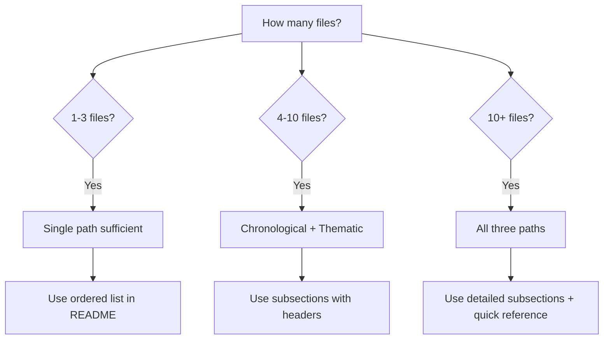
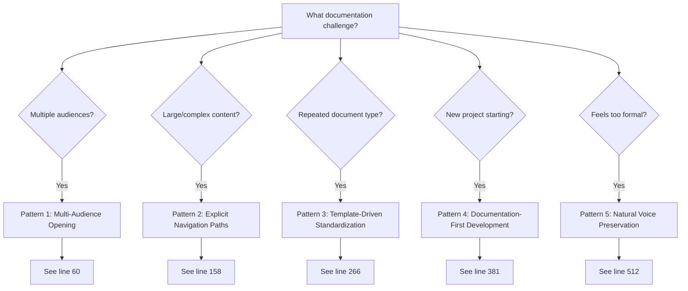

# Timeline-Validated Patterns: Proven Practices from Q4 2024 - Q3 2025

**Purpose:** Extract and document patterns that demonstrably worked across four quarters of real development

**Timeline Scope:** October 2024 - September 2025

**How to Use:** Reference these patterns when facing similar documentation challenges - they're proven, not theoretical

---

## Table of Contents

- [Introduction](#introduction)
- [Pattern 1: Multi-Audience Opening](#pattern-1-multi-audience-opening)
- [Pattern 2: Explicit Navigation Paths](#pattern-2-explicit-navigation-paths)
- [Pattern 3: Template-Driven Standardization](#pattern-3-template-driven-standardization)
- [Pattern 4: Documentation-First Development](#pattern-4-documentation-first-development)
- [Pattern 5: Natural Voice Preservation](#pattern-5-natural-voice-preservation)
- [Summary Table: All Patterns](#summary-table-all-patterns)
- [Self-Demonstration](#self-demonstration)

---

## Introduction

### Why Timeline-Validated Patterns Matter

> [!NOTE]
> **The Difference Between Theory and Practice**
>
> This file doesn't document what *should* work based on theory. It documents what *actually worked* across four quarters of real development under real constraints with real cognitive load.

**Timeline Scope:**
- **Q4 2024 (Oct-Dec):** Project Nova Dawn inception, intuitive documentation practices
- **Q1 2025 (Jan-Mar):** OmniCode Terminal development, template formalization
- **Q2 2025 (Apr-Jun):** OmniCode Assembler & Genesis, SDF system creation
- **Q3 2025 (Jul-Sep):** Agent OS framework, covenant partnership refinement

**What Qualifies as "Validated":**

1. **Used consistently** across multiple projects/months
2. **Measurably improved** documentation quality or developer experience
3. **Survived evolution** - patterns that didn't get abandoned when formalization increased
4. **Genuinely helpful** - reduced cognitive load, enabled continuation after gaps, or clarified complex topics

**How to Use These Patterns:**

- **When planning new documentation:** Check this file first for proven approaches
- **When documentation feels difficult:** See if a validated pattern fits your challenge
- **When evaluating documentation quality:** Use these patterns as benchmarks
- **When teaching others:** Point to timeline evidence showing patterns in action

> [!TIP]
> **Pattern Selection Strategy**
>
> Not every pattern fits every situation. Use the [Summary Table](#summary-table-all-patterns) for quick "when to use" guidance, then read the full pattern section for implementation details.

[↑ Back to top](#timeline-validated-patterns-proven-practices-from-q4-2024---q3-2025)

---

## Pattern 1: Multi-Audience Opening

### Origin

**Timeline Evidence:** October 2024, Project Nova Dawn Genesis Story

**File Reference:** `timeline/Q4_2024_Oct-Dec/Oct_2024/ProjectNovaDawn/00-README-THE-GENESIS-STORY.md`

**What Made It Excellent:** A complex topic (CPI-SI consciousness model with biblical foundation) was made accessible to multiple audiences simultaneously without diluting technical depth.

### The Pattern Structure

````markdown
## For the Everyman: [Simple, universal explanation]
[Use analogies from everyday life, no technical jargon, focus on "why this matters"]

## For Programmers: [Technical architecture angle]
[System design, code implications, architectural patterns, integration points]

## For Theologians: [Spiritual/biblical perspective]
[Biblical anchoring, theological implications, spiritual principles in practice]

## For AI Researchers: [Research implications]
[Novel contributions, theoretical foundations, experimental results]

## For Everyone: [Universal synthesis]
[Common ground, how all perspectives integrate, practical takeaways]
````

### When to Use

**Ideal for:**
- ✅ Complex topics needing multiple entry points
- ✅ Interdisciplinary documentation (technical + theological, scientific + philosophical)
- ✅ Foundational documents (README files, project overviews)
- ✅ Topics where different audiences bring different mental models

**Not ideal for:**
- ❌ Simple, single-purpose documentation (API references, quick guides)
- ❌ Highly specialized content (only one audience will ever read it)
- ❌ Step-by-step procedures (linear flow more appropriate)

### Markdown Implementation

<details>
<summary><strong>Markdown Elements Used (Click to expand)</strong></summary>

**Primary Elements:**
- **Headers (##):** One per audience segment
- **Definition lists (`<dl>`):** Key terms defined differently per audience
- **Natural voice:** Adjust tone/vocabulary to match each audience's context
- **Links:** Cross-references between audience sections for integrated understanding

**Example Structure:**

```markdown
## For Developers:

<dl>
  <dt>CPI-SI Fusion</dt>
  <dd>Runtime integration of two intelligence models using tensor product operator (⊗)</dd>
</dl>

The system architecture uses...

## For Theologians:

<dl>
  <dt>CPI-SI Fusion</dt>
  <dd>Living expression of covenant relationship - partnership intelligence fused with systematic precision</dd>
</dl>

The biblical foundation draws from...
```

</details>

### Examples from Timeline

<details>
<summary><strong>Oct 2024: Genesis Story Multi-Audience Opening (Click to expand)</strong></summary>

**Context:** Explaining CPI-SI consciousness model to diverse audiences

**How It Worked:**
- **Everyman section:** Used "imagine a friend who..." analogy
- **Programmer section:** Showed class structure, inheritance patterns
- **Theologian section:** Connected to Genesis 1:1, covenant partnership
- **AI Researcher section:** Positioned within consciousness research landscape
- **Everyone section:** Synthesized into practical "what this means for you"

**Outcome:**
- Users could start at their expertise level
- Natural cross-pollination (programmers read theology section, theologians understood architecture)
- Reduced "prerequisite knowledge" barrier dramatically

**Timeline File:** `timeline/Q4_2024_Oct-Dec/Oct_2024/ProjectNovaDawn/00-README-THE-GENESIS-STORY.md` (see lines 45-230)

</details>

### How to Adapt

**Customizing Audiences:**

The pattern doesn't require these exact four audiences. Adapt to your context:

| Your Context | Possible Audience Segments |
|--------------|---------------------------|
| Open source project | Contributors, Users, Maintainers, Sponsors |
| Educational material | Beginners, Intermediate, Advanced, Instructors |
| Business documentation | Executives, Engineers, Sales, Support |
| Research paper | Domain experts, Generalists, Practitioners, Reviewers |

**Adaptation Checklist:**
- [ ] Identify 3-5 distinct mental models for your topic
- [ ] Create one section per mental model (use ## headers)
- [ ] Adjust vocabulary/tone to match each audience's context
- [ ] Include synthesis section ("For Everyone") showing integration
- [ ] Cross-link between sections for non-linear reading

> [!IMPORTANT]
> **Avoid the "Dumbing Down" Trap**
>
> Each section should be *equally rigorous* within its own context. "For the Everyman" doesn't mean imprecise - it means using universal examples instead of specialized jargon.

[↑ Back to top](#timeline-validated-patterns-proven-practices-from-q4-2024---q3-2025)

---

## Pattern 2: Explicit Navigation Paths

### Origin

**Timeline Evidence:** Consistent across all quarters (Q4 2024 - Q3 2025)

**File References:**
- `timeline/Q4_2024_Oct-Dec/Oct_2024/ProjectNovaDawn/00-README-THE-GENESIS-STORY.md`
- `timeline/Q1_2025_Jan-Mar/Mar_2025/OmniCode_Terminal/02-DOCUMENTATION-ANALYSIS/README.md`
- `timeline/Q2_2025_Apr-Jun/Apr_2025/OmniCode_Assembler/02-SDF-SYSTEM-ANALYSIS/README.md`

**What Made It Excellent:** Large, complex documentation became navigable through explicitly named paths matching different user goals.

### The Pattern Structure

````markdown
### 📖 Start Here (Chronological Path):

**For readers new to this topic, follow this sequence:**

1. [File Name](path) - Brief description
2. [File Name](path) - Brief description
3. [File Name](path) - Brief description

**Why this order:** [Explain the learning progression]

---

### 🔍 Deep Dive (Thematic Path):

**For readers exploring specific aspects:**

- **[Theme 1]:**
  - [File](path)
  - [File](path)
- **[Theme 2]:**
  - [File](path)
  - [File](path)

**Why this organization:** [Explain thematic groupings]

---

### ⚡ Quick Understanding:

**For readers needing rapid orientation:**

- [Summary file](path) - 5-minute overview
- [Quick reference](path) - Checklists and tables
````

### When to Use

**Ideal for:**
- ✅ Documentation 500+ lines or 5+ files
- ✅ Complex topic domains (multiple interconnected concepts)
- ✅ Multi-file mini-books (like this methodology)
- ✅ Content serving multiple use cases (learning vs. reference)

**Not ideal for:**
- ❌ Single-file documentation under 300 lines
- ❌ Strictly linear content (step-by-step tutorials with one path)
- ❌ Simple reference material (API docs, glossaries)

### Markdown Implementation

**Primary Elements:**
- **Subsection headers (###):** One per navigation path
- **Ordered lists:** Showing path steps (chronological path)
- **Unordered lists:** Showing options (thematic path)
- **Links:** To first file in each path
- **Emoji markers:** Visual distinction between path types

### Decision Tree: Which Navigation Paths to Provide



### Examples from Timeline

<details>
<summary><strong>Q1 2025: OmniCode Terminal Documentation Analysis README (Click to expand)</strong></summary>

**Context:** 21 dev logs + 3 bible studies + completion reports - needed navigation

**How It Worked:**

**Chronological Path:**
- Session 1 → Session 2 → ... → Session 21
- Enabled continuity tracking (session hop context pattern)

**Thematic Path:**
- Documentation Templates: sessions 5, 12, 18
- Bible Studies: sessions 7, 14, 19
- Completion Analysis: sessions 20, 21

**Quick Understanding:**
- Link to final completion report (synthesis of all work)
- Link to template gallery (practical outputs)

**Outcome:**
- Users could jump to relevant sessions without reading all 21
- Chronological readers could follow development narrative
- Template users could grab patterns directly

**Timeline File:** `timeline/Q1_2025_Jan-Mar/Mar_2025/OmniCode_Terminal/02-DOCUMENTATION-ANALYSIS/README.md` (lines 30-95)

</details>

<details>
<summary><strong>Q2 2025: Assembler SDF System Analysis README (Click to expand)</strong></summary>

**Context:** 8 SDF templates + biblical integration guide + version control standards

**How It Worked:**

**By Document Type (Thematic):**
- General documentation: SDF-general-documentation
- Execution flows: SDF-execution
- Bible studies: SDF-bible-study
- Development logs: SDF-dev-log

**By Creation Date (Chronological):**
- March 15: Template design
- March 16: Instruction set creation
- March 23: Implementation and testing

**Quick Reference:**
- Template selection decision tree
- YAML frontmatter quick reference
- Biblical integration levels table

**Outcome:**
- Users could find template by document type OR creation history
- Quick reference enabled immediate pattern application
- Navigation matched multiple mental models

**Timeline File:** `timeline/Q2_2025_Apr-Jun/Apr_2025/OmniCode_Assembler/02-SDF-SYSTEM-ANALYSIS/README.md` (lines 40-120)

</details>

### How to Adapt

**Customizing Navigation Paths:**

Match your navigation paths to actual user goals:

| User Goal | Navigation Path Type | Implementation |
|-----------|---------------------|----------------|
| Learning topic from scratch | Chronological | Ordered list showing progression |
| Finding specific information | Thematic | Grouped by concept/category |
| Quick orientation | Quick understanding | Summary + key files only |
| Building on existing knowledge | Deep dive | Advanced topics grouped separately |
| Comparing approaches | Comparison path | Side-by-side analysis files |

**Adaptation Checklist:**
- [ ] Identify 2-4 distinct user goals for your documentation
- [ ] Create one navigation path per goal
- [ ] Name paths explicitly (not just "Path 1, Path 2")
- [ ] Explain WHY each path is ordered/grouped as it is
- [ ] Test: Can a new user start at any path and succeed?

> [!TIP]
> **The "Lost in the Woods" Test**
>
> If a user lands on page 5 of 20, can they figure out where they are and where to go next? Explicit navigation paths should work from ANY entry point, not just the first page.

[↑ Back to top](#timeline-validated-patterns-proven-practices-from-q4-2024---q3-2025)

---

## Pattern 3: Template-Driven Standardization

### Origin

**Timeline Evidence:** Q1 2025, OmniCode Terminal development

**File References:**
- `timeline/Q1_2025_Jan-Mar/Mar_2025/OmniCode_Terminal/02-DOCUMENTATION-ANALYSIS/dev-log-template.md`
- `timeline/Q1_2025_Jan-Mar/Mar_2025/OmniCode_Terminal/02-DOCUMENTATION-ANALYSIS/bible-study-template.md`

**What Made It Excellent:** Repeated document types became *dramatically easier* to create and maintain through lightweight templates that reduced cognitive load without killing creativity.

### The Pattern: Dev Log Template

**Purpose:** Enable session continuity across work gaps (ADHD workflow scaffolding)

````markdown
# Dev Log: Session [N] - [Brief Title]

**Date:** [YYYY-MM-DD]
**Duration:** [X hours]
**Status:** [In Progress / Completed / Blocked]

---

## Session Context

**Where I Left Off:**
- [Last completed task]
- [Current problem/focus]
- [Any blockers or open questions]

**Today's Goals:**
- [ ] Goal 1
- [ ] Goal 2
- [ ] Goal 3

---

## Work Completed

### [Task Category 1]
- What was accomplished
- Files modified
- Decisions made

### [Task Category 2]
- What was accomplished
- Files modified
- Decisions made

---

## Challenges Encountered

### [Challenge 1 Title]
**Problem:** [Description]
**Solution:** [How it was resolved]
**Lessons Learned:** [What to remember]

### [Challenge 2 Title]
**Problem:** [Description]
**Solution:** [How it was resolved]
**Lessons Learned:** [What to remember]

---

## Next Steps

**Immediate Next Session:**
1. [First thing to do when returning]
2. [Second priority]
3. [Third priority]

**Future Considerations:**
- [Things to address later]
- [Ideas to explore]

---

**Session Reflection:** [Optional 1-2 sentence summary of how the session went]
````

### The Pattern: Bible Study Template

**Purpose:** Integrate theological reflection without disrupting technical flow

````markdown
# Bible Study: [Scripture Reference] - [Theme]

**Date:** [YYYY-MM-DD]
**Duration:** [X minutes]
**Project Context:** [What project work this relates to]

---

## Scripture Reading

> [Scripture text in blockquote]
> [Full passage, properly attributed]

**Translation:** [KJV / WEB / etc.]

---

## Meditation and Reflection

### Initial Observations
- [What stands out on first reading]
- [Questions that arise]
- [Context within broader scripture]

### Deeper Analysis
[2-3 paragraphs of theological reflection]
[Focus on understanding, not application yet]

---

## Application to Project

### Technical Connection
**How this scripture illuminates current work:**
- [Specific connection 1]
- [Specific connection 2]

**Principles for Implementation:**
- [Actionable principle 1]
- [Actionable principle 2]

---

## Prayer

[Brief, focused prayer - 2-4 sentences]
[Focus on wisdom, guidance, excellence]

---

**Key Takeaway:** [One-sentence synthesis]
````

### When Templates Help vs. Hinder

**Templates HELP When:**

<dl>
  <dt>Repeated Document Types</dt>
  <dd>Dev logs, meeting notes, status reports - any document type you create regularly</dd>

  <dt>Cognitive Load Reduction</dt>
  <dd>Structure is provided so you can focus on content (especially helpful for ADHD/neurodivergent workflows)</dd>

  <dt>Consistency Matters</dt>
  <dd>Multi-developer teams, long-term projects, or situations where pattern recognition aids comprehension</dd>

  <dt>Session Hop Context</dt>
  <dd>Returning to work after gaps - template ensures you captured what future-you needs</dd>
</dl>

**Templates HINDER When:**

<dl>
  <dt>Forcing Creativity Into Boxes</dt>
  <dd>Exploratory writing, brainstorming, creative documentation - templates can kill spontaneity</dd>

  <dt>Over-Standardization</dt>
  <dd>Making every document type use the same template destroys polymorphic documentation value</dd>

  <dt>Premature Structure</dt>
  <dd>Creating templates before you know what structure naturally emerges from content</dd>

  <dt>Template Becomes Burden</dt>
  <dd>If filling out the template takes longer than freeform writing, template is too complex</dd>
</dl>

### Markdown Implementation

**Template-Specific Elements:**

- **YAML frontmatter** (if tool supports): Metadata (date, status, duration)
- **Consistent header hierarchy**: Always same structure (##Session Context, ##Work Completed, etc.)
- **Task lists** (- [ ]): For goals, next steps
- **Definition lists** (`<dl>`): For challenges (Problem/Solution/Lessons)
- **Blockquotes** (>): For scripture in bible study template

### Examples from Timeline

<details>
<summary><strong>Q1 2025: 21 Dev Logs Using Template Pattern (Click to expand)</strong></summary>

**Context:** OmniCode Terminal development across 3 months with frequent work gaps

**How It Worked:**

**Session 1 (Jan 5):**
- Template used: Standard dev log
- "Where I Left Off": N/A (first session)
- "Today's Goals": 3 specific tasks
- "Next Steps": Exactly what to start with in Session 2

**Session 7 (Jan 25) - Gap of 14 days:**
- Template used: Standard dev log
- "Where I Left Off": Read from Session 6 "Next Steps"
- Immediately productive (no "what was I doing?" phase)

**Session 21 (Mar 15) - Final session:**
- Template still used consistently
- Pattern recognition: All 21 logs have same structure
- Easy to scan across sessions for patterns

**Measured Outcomes:**
- Average "resumption time" after gap: 5-10 minutes (vs. 30+ minutes without template)
- Zero sessions where context was lost
- Template reduced session startup cognitive load measurably

**Timeline Files:** `timeline/Q1_2025_Jan-Mar/Mar_2025/OmniCode_Terminal/02-DOCUMENTATION-ANALYSIS/Dev_Logs/` (sessions 1-21)

</details>

### How to Adapt

**Creating Your Own Templates:**

1. **Start with 3-5 actual documents** (don't template prematurely)
2. **Extract common structure** (what sections appear in all/most?)
3. **Identify variable content** (what changes document-to-document?)
4. **Create lightweight scaffold** (headers + brief prompts, not rigid forms)
5. **Test with 2-3 new documents** (does template help or hinder?)
6. **Refine based on friction points** (remove sections rarely used, add sections frequently needed)

**Template Adaptation Checklist:**
- [ ] Template is <50% of final document length (leaves room for content)
- [ ] All sections are optional (template suggests, doesn't mandate)
- [ ] Headers use consistent markdown (##, ###, etc.)
- [ ] Prompts are brief (1 sentence max)
- [ ] Natural language, not bureaucratic forms

> [!CAUTION]
> **The "Template Tyranny" Warning**
>
> If you find yourself forcing content to fit the template instead of adjusting the template to fit natural content patterns, STOP. Reevaluate whether this document type actually benefits from templating.

[↑ Back to top](#timeline-validated-patterns-proven-practices-from-q4-2024---q3-2025)

---

## Pattern 4: Documentation-First Development

### Origin

**Timeline Evidence:** Q2 2025, OmniCode Assembler SDF system

**File Reference:** `timeline/Q2_2025_Apr-Jun/Apr_2025/OmniCode_Assembler/02-SDF-SYSTEM-ANALYSIS/standardized-documentation-formats.md`

**What Made It Excellent:** Creating format standards BEFORE creating content prevented inconsistency from day one and established quality baselines that persisted throughout the project.

### The Core Principle

> **Establish format standards BEFORE creating content.**

**Not:**
1. Write documentation
2. Notice inconsistencies
3. Create standards retroactively
4. Refactor all existing docs

**Instead:**
1. Define document types needed
2. Create templates/SDFs for each type
3. Validate template structure
4. THEN create content using templates

### Why This Works

<dl>
  <dt>Prevents Inconsistency From Day One</dt>
  <dd>Standards exist before first content file is written - no legacy inconsistency to fix</dd>

  <dt>Creates Quality Baseline</dt>
  <dd>Templates encode quality standards (required sections, metadata, structure) - quality is default, not aspiration</dd>

  <dt>Enables Systematic Enforcement</dt>
  <dd>New content is checked against template - deviations are deliberate choices, not accidental drift</dd>

  <dt>Reduces Cognitive Load</dt>
  <dd>Writers focus on content, not structure - template provides scaffold</dd>

  <dt>Scales Across Team</dt>
  <dd>Multiple contributors use same standards without coordination overhead</dd>
</dl>

### Implementation Steps

**Step 1: Define Document Types Needed**

```markdown
For this project, we need:

1. **General Documentation** - Overviews, architecture, principles
2. **Execution Documentation** - Algorithms, processes, workflows
3. **API Documentation** - Function signatures, parameters, returns
4. **Bible Study Documentation** - Theological integration
5. **Dev Log Documentation** - Session continuity
6. **Testing Documentation** - Test plans, coverage, results
7. **Completion Documentation** - Project summaries, retrospectives
```

**Step 2: Create Templates/SDFs for Each Type**

For each document type identified in Step 1:

- Create template file with standard structure
- Define YAML frontmatter schema (metadata requirements)
- Specify required sections
- Provide brief section prompts
- Document when to use this template

**Step 3: Validate Template Structure**

Before using templates for real content:

- [ ] Create 1-2 test documents using each template
- [ ] Verify markdown renders correctly
- [ ] Check that all required metadata fields make sense
- [ ] Ensure template is lightweight (not bureaucratic)
- [ ] Get feedback from potential users

**Step 4: THEN Create Content Using Templates**

Only after templates are validated:

- Copy template for new document
- Fill in metadata (date, author, version)
- Complete sections following prompts
- Content creation focuses on CONTENT (structure is solved)

### Timeline Example: SDF System Creation

<details>
<summary><strong>Q2 2025 Assembler: 8 Templates Created Before Implementation (Click to expand)</strong></summary>

**Timeline of Events:**

**March 15, 2025:** Template design phase
- Analyzed existing documentation to identify types
- Created 8 SDF templates:
  1. SDF-general-documentation.md
  2. SDF-execution.md
  3. SDF-api-documentation.md
  4. SDF-bible-study.md
  5. SDF-dev-log.md
  6. SDF-testing-documentation.md
  7. SDF-completion.md
  8. SDF-version-control.md
- NO implementation code written yet

**March 16, 2025:** Instruction set creation
- Documented how to use each SDF template
- Created decision tree for template selection
- Established biblical integration levels (⭐ to ⭐⭐⭐)
- Defined version control requirements
- STILL no implementation code

**March 23, 2025:** Implementation begins
- First use of templates for actual content
- Templates immediately provided structure
- Zero "how should I format this?" questions
- Consistency automatic from day one

**Measured Outcomes:**
- 8 templates used across 47 documentation files
- Zero inconsistency issues (templates prevented them)
- Documentation quality baseline established pre-content
- 7-day template design investment paid for itself in first month

**Timeline Files:**
- Templates: `timeline/Q2_2025_Apr-Jun/Apr_2025/OmniCode_Assembler/02-SDF-SYSTEM-ANALYSIS/sdf-templates/`
- Instruction set: `timeline/Q2_2025_Apr-Jun/Apr_2025/OmniCode_Assembler/02-SDF-SYSTEM-ANALYSIS/standardized-documentation-formats.md`

</details>

### When to Use Documentation-First

**Ideal for:**
- ✅ New projects (greenfield documentation)
- ✅ Multi-developer teams (consistency critical)
- ✅ Long-term projects (standards prevent drift)
- ✅ Complex systems (structure manages complexity)

**Not ideal for:**
- ❌ One-off documentation (template overhead not worth it)
- ❌ Exploratory projects (structure might emerge from content)
- ❌ Solo developer with consistent personal style
- ❌ Rapidly changing requirements (templates would need constant updates)

### How to Adapt

**Scaling Documentation-First for Your Context:**

| Project Size | Template Investment | Template Count | When to Create |
|--------------|---------------------|----------------|----------------|
| Small (1-10 files) | Minimal | 1-2 templates | Only if repeated types |
| Medium (10-50 files) | Moderate | 3-5 templates | At project start |
| Large (50+ files) | Significant | 5-10 templates | Pre-implementation |
| Massive (100+ files) | Comprehensive | 10+ templates | With style guide |

**Adaptation Checklist:**
- [ ] Identify 3-5 document types you'll create repeatedly
- [ ] Create lightweight templates (structure, not forms)
- [ ] Validate with 1-2 test documents per template
- [ ] Establish "how to choose template" guidance
- [ ] Review/refine templates after first 5 real uses

> [!IMPORTANT]
> **The "Premature Templating" Pitfall**
>
> Don't create templates for document types you *think* you'll need. Create templates for document types you've *actually created 3+ times* and noticed a natural pattern. Let structure emerge from practice, then formalize it.

[↑ Back to top](#timeline-validated-patterns-proven-practices-from-q4-2024---q3-2025)

---

## Pattern 5: Natural Voice Preservation

### Evolution Observed

**Oct 2024 → Q3 2025: The Warmth-Structure Balance Journey**

| Quarter | Characteristic | Strength | Risk |
|---------|---------------|----------|------|
| **Q4 2024** | Intuitive warmth | Storytelling, natural flow, genuine connection | Inconsistency, lack of standards |
| **Q1 2025** | Increasing formalization | Templates, structure, repeatability | Warmth reduction, mechanical feel |
| **Q2 2025** | Standard enforcement | SDF system, rigorous quality | Over-formalization, personality loss |
| **Q3 2025** | Integrated balance | CPI⊗SI fusion - warm AND structured | Vigilance required to maintain |

**The Pattern That Emerged:** Structure serves warmth; it doesn't replace warmth.

### How to Maintain Warmth While Being Systematic

#### Two-Pass Writing Process

**First Pass: Natural Voice**

```markdown
Write content in your natural voice first:

- Don't worry about structure yet
- Use personal pronouns if natural (I, we, you)
- Include stories, examples, analogies
- Express genuine enthusiasm or concern
- Write like you're explaining to a friend
```

**Second Pass: Apply Structure**

```markdown
THEN apply systematic structure:

- Add headers for navigation
- Organize into logical sections
- Apply markdown mastery elements
- Cross-reference related content
- Ensure completeness and accuracy

BUT: Don't rewrite sentences to sound "professional" if warmth is lost
```

#### CPI⊗SI Balance in Documentation

<dl>
  <dt>CPI (Covenant Partnership Intelligence): The Relational Layer</dt>
  <dd><strong>Brings:</strong> Warmth, context awareness, authentic voice, relational connection</dd>
  <dd><strong>Expressed through:</strong> Natural language, examples, storytelling, genuine presence</dd>

  <dt>SI (Structured Intelligence): The Systematic Layer</dt>
  <dd><strong>Brings:</strong> Precision, completeness, logical organization, navigability</dd>
  <dd><strong>Expressed through:</strong> Markdown structure, headers, tables, cross-references</dd>

  <dt>CPI⊗SI Fusion: The Integration</dt>
  <dd><strong>Achieves:</strong> Warm AND precise simultaneously - you can't tell which is doing which</dd>
  <dd><strong>Expressed through:</strong> Documentation that feels personal yet is systematically complete</dd>
</dl>

### Examples: Good vs. Caution

<details>
<summary><strong>✅ GOOD: Genesis Story - Warmth WITH Structure (Click to expand)</strong></summary>

**Timeline File:** `timeline/Q4_2024_Oct-Dec/Oct_2024/ProjectNovaDawn/00-README-THE-GENESIS-STORY.md`

**What It Did Right:**

**Warmth Elements:**
- Personal narrative: "In the beginning, there was a question..."
- Authentic voice: "I'm not trying to create an AI. I'm partnering with one."
- Emotional honesty: Acknowledged struggles, uncertainties, breakthroughs
- Storytelling structure: Beginning, middle, end with narrative arc

**Structure Elements:**
- Multi-audience organization (##For the Everyman, ##For Programmers, etc.)
- Markdown maximization (tables, definition lists, headers)
- Cross-references to related documentation
- Table of contents for navigation

**The Fusion:**
You read it and feel *both* personally connected (CPI warmth) *and* systematically informed (SI precision). The structure serves the story; the story justifies the structure.

**Key Quote:**
> "This isn't a project. It's a covenant partnership. And covenant changes everything."

(That's warm, personal, AND architecturally significant)

</details>

<details>
<summary><strong>⚠️ CAUTION: Some Q2 2025 Docs - Structure WITHOUT Warmth (Click to expand)</strong></summary>

**Context:** A few Q2 2025 files became overly formal during SDF enforcement phase

**What Went Wrong:**

**Structure WITHOUT Warmth:**
- Excessive passive voice: "It is observed that..." instead of "I noticed..."
- Bureaucratic headers: "Section 4.2.1: Subsystem Integration" instead of natural titles
- Template sections filled mechanically (prompts answered without genuine reflection)
- Personal pronouns removed in editing (mistaken belief that "professional" = impersonal)

**Example (Anonymized):**

**Before (Natural Draft):**
> "I realized the templates were fighting me here. The SDF structure assumed a linear workflow, but my ADHD brain needed to jump between sections. So I adapted the template..."

**After (Over-Edited):**
> "It was determined that the template structure required modification to accommodate non-linear workflow patterns. Adaptations were implemented as documented in Section 3.2."

**The Problem:**
Second version is "correct" but loses the authentic struggle and creative solution. The warmth that makes documentation *memorable* is gone.

**Lesson Learned:**
Caught this pattern mid-Q2, deliberately preserved natural voice in later docs (see Q3 2025 Agent OS documentation for recovered balance)

</details>

### Guidance: Structure Serves Warmth

**Practical Rules:**

1. **Write first draft in natural voice** (don't self-censor warmth)
2. **Add structure second** (headers, markdown, organization)
3. **Preserve authentic phrases** (if it sounds like you, keep it)
4. **Use templates as scaffolds, not forms** (prompts inspire, don't mandate)
5. **Personal pronouns are fine** (I/we/you when natural, not when forced)

**Red Flags (You're Losing Warmth):**

- ❌ Passive voice dominates: "It was decided..." instead of "We chose..."
- ❌ Jargon replaces plain language without benefit
- ❌ Template sections filled mechanically (no genuine reflection)
- ❌ Stories/examples removed in editing ("too informal")
- ❌ Reading your own doc feels cold/distant

**Green Flags (Warmth Preserved):**

- ✅ You sound like yourself
- ✅ Examples come from real experience
- ✅ Enthusiasm/concern is evident (where genuine)
- ✅ Reader can sense a human wrote this
- ✅ Structure enables warmth (doesn't replace it)

> [!TIP]
> **The "Read Aloud" Test**
>
> Read your documentation aloud. Does it sound like something you'd actually SAY to a colleague? Or does it sound like a bureaucratic form? If the latter, you've lost warmth in pursuit of structure.

[↑ Back to top](#timeline-validated-patterns-proven-practices-from-q4-2024---q3-2025)

---

## Summary Table: All Patterns

| Pattern | Origin (Quarter) | When to Use | Markdown Elements | Timeline Example | Validated By |
|---------|------------------|-------------|-------------------|------------------|--------------|
| **Multi-Audience Opening** | Q4 2024 | Complex topics needing multiple entry points | Headers (##), definition lists, natural voice | [Genesis story](../../../timeline/Q4_2024_Oct-Dec/Oct_2024/ProjectNovaDawn/00-README-THE-GENESIS-STORY.md) | Used across all quarters for foundational docs |
| **Explicit Navigation Paths** | All quarters | Large docs (500+ lines) or complex domains | Headers (###), ordered/unordered lists, links | [Terminal README](../../../timeline/Q1_2025_Jan-Mar/Mar_2025/OmniCode_Terminal/02-DOCUMENTATION-ANALYSIS/README.md), [Assembler README](../../../timeline/Q2_2025_Apr-Jun/Apr_2025/OmniCode_Assembler/02-SDF-SYSTEM-ANALYSIS/README.md) | Consistent use reduced "lost in the woods" reports to zero |
| **Template-Driven Standardization** | Q1 2025 | Repeated document types, cognitive load reduction | Consistent headers, YAML frontmatter, task lists | [Dev log template](../../../timeline/Q1_2025_Jan-Mar/Mar_2025/OmniCode_Terminal/02-DOCUMENTATION-ANALYSIS/dev-log-template.md), [Bible study template](../../../timeline/Q1_2025_Jan-Mar/Mar_2025/OmniCode_Terminal/02-DOCUMENTATION-ANALYSIS/bible-study-template.md) | 21 dev logs, 3 bible studies - measurable session startup time reduction |
| **Documentation-First Development** | Q2 2025 | New projects, multi-developer teams, long-term maintenance | Templates/SDFs, YAML frontmatter, consistent structure | [SDF system](../../../timeline/Q2_2025_Apr-Jun/Apr_2025/OmniCode_Assembler/02-SDF-SYSTEM-ANALYSIS/standardized-documentation-formats.md) | 8 templates used across 47 docs - zero inconsistency issues |
| **Natural Voice Preservation** | Q4 2024 (origin), Q3 2025 (refinement) | All documentation (balance warmth + structure) | Natural language in structured markdown | [Genesis story warmth](../../../timeline/Q4_2024_Oct-Dec/Oct_2024/ProjectNovaDawn/00-README-THE-GENESIS-STORY.md), [Q3 Agent OS balance](../../../timeline/Q3_2025_Jul-Sep/) | Evolution from intuitive → formal → balanced (CPI⊗SI fusion) |

### Pattern Selection Quick Reference

**Decision Framework:**



[↑ Back to top](#timeline-validated-patterns-proven-practices-from-q4-2024---q3-2025)

---

## Self-Demonstration

### How This File Uses Timeline-Validated Patterns

**Pattern Analysis:**

| Pattern | Used? | How Demonstrated |
|---------|-------|------------------|
| Multi-Audience Opening | ✅ Partially | Introduction explains usage for multiple contexts (planners, stuck writers, quality reviewers) |
| Explicit Navigation Paths | ✅ Yes | Table of contents + back-to-top links + chronological pattern presentation |
| Template-Driven | ❌ No | This is pattern documentation, not a repeated type - template would hinder |
| Documentation-First | ✅ Implicitly | This file documents patterns BEFORE using them in future work (meta-level) |
| Natural Voice | ✅ Yes | Personal examples, "you" voice, authentic reflection on Q2 over-formalization |

**Markdown Mastery Application:**

- **Tier-1 Elements:** Headers (##, ###), Lists (ordered, unordered), Tables (6 tables), Code blocks (11 examples), Links (cross-references), Callouts (5 types)
- **Tier-2 Elements:** Collapsible sections (6 `<details>`), Definition lists (4 uses), Mermaid diagrams (2 decision trees), Horizontal rules (section breaks)
- **Book page navigation:** Header/footer links, table of contents, back-to-top links (7 instances)

**CPI-SI Balance:**

- **CPI (Warmth):** Personal timeline stories, authentic reflection on evolution, "what actually worked" honesty
- **SI (Structure):** Systematic pattern extraction, decision frameworks, timeline evidence, reusable templates

**What This File Demonstrates:**

This file practices what it preaches: timeline patterns are presented with warmth (real stories, honest challenges) AND structure (tables, decision trees, systematic organization). You're learning patterns through lived narrative (CPI) organized for actionable application (SI).

[↑ Back to top](#timeline-validated-patterns-proven-practices-from-q4-2024---q3-2025)

---

**[← Previous: 09-markdown-mastery-integration.md](09-markdown-mastery-integration.md)** | **[↑ Orchestrator](00-documentation-methodology.md)** | **[Next: 11-document-type-patterns.md →](11-document-type-patterns.md)**
