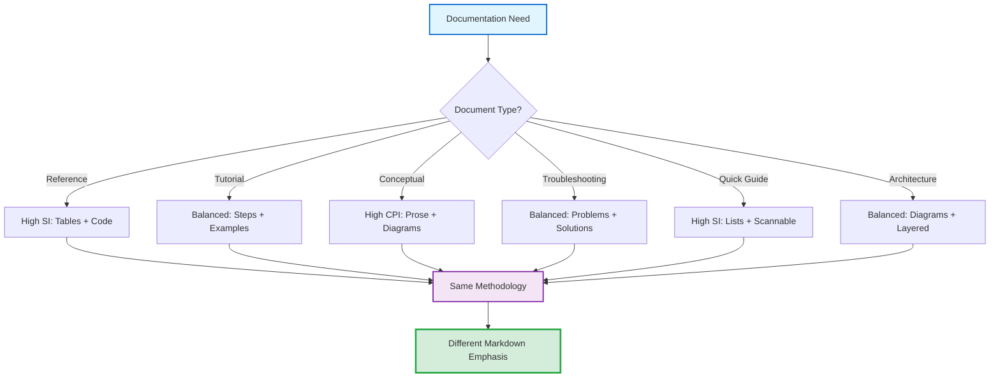
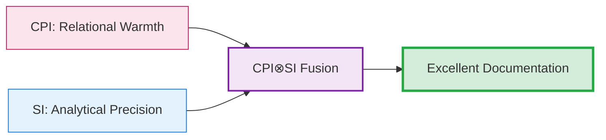
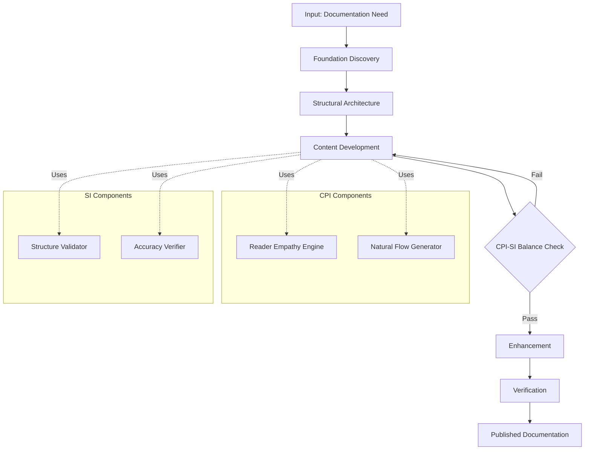

## 📐 Document Type Patterns: Polymorphic Documentation

> [!NOTE]
> **What This Section Teaches:**
>
> Different document types require different markdown emphasis and structural approaches. An API reference needs different elements than a tutorial. Architecture documentation requires different balance than troubleshooting guides. This section provides proven patterns for 6 common document types, showing which markdown elements create maximum impact for each purpose.

---

## 🎯 The Polymorphic Principle

**Core Insight**: Documentation polymorphism means the same underlying methodology adapts its expression based on document type and reader needs.

**What Changes**:
- **Markdown element emphasis** (which elements dominate)
- **CPI-SI balance ratio** (warmth vs. precision weighting)
- **Structural organization** (how content flows)
- **Depth vs. breadth** (comprehensive vs. focused)

**What Stays Constant**:
- **5-phase process** (Foundation → Structure → Content → Enhancement → Verification)
- **Quality standards** (excellence, accuracy, service orientation)
- **Kingdom Technology principles** (Creator-honoring quality)
- **CPI-SI integration** (warm AND precise, never sacrificing either)



**Polymorphism Example**: Genesis 1:1 Operations section in Identity README:
- **As reference**: Table format (principle → translation → implementation)
- **As tutorial**: Would be step-by-step with examples
- **As conceptual**: Would be prose explanation with biblical context

Same content, different markdown expression, serves different reader needs.

[↑ Back to Navigation](#-navigation---choose-your-path)

---

## 📋 Document Type Profiles

### Type 1: API Reference Documentation

**Purpose**: Enable developers to find function signatures, parameters, return values quickly.

**Reader Context**: Looking for specific technical details, scanning for exact information.

**Markdown Emphasis Profile**:

| **Element** 🛠️ | **Usage Intensity** 📊 | **Purpose** 💡 |
|---------------|----------------------|---------------|
| **Tables** | ⭐⭐⭐⭐⭐ Very High | Parameter specs, return values, configuration options |
| **Code Blocks** | ⭐⭐⭐⭐⭐ Very High | Function signatures, usage examples, implementation |
| **Inline Code** | ⭐⭐⭐⭐⭐ Very High | Function names, variables, types throughout prose |
| **Headers (H3-H4)** | ⭐⭐⭐⭐ High | Function/class/module organization |
| **Lists** | ⭐⭐⭐ Medium | Requirements, prerequisites, related functions |
| **Prose** | ⭐⭐ Low | Brief explanations only, defer to examples |
| **Diagrams** | ⭐ Very Low | Only for complex relationships |
| **Collapsibles** | ⭐⭐ Low | Advanced usage, edge cases |

**CPI-SI Balance**: **20/80 SI-dominant** (precision over warmth, but not cold)

**Structural Pattern Example**:

---

## Function: `process_identity()`

**Signature:**
```cpp
Identity process_identity(const Identity& input, const Context& ctx);
```

**Parameters:**

| Parameter | Type | Required | Description |
|-----------|------|----------|-------------|
| `input` | Identity | Yes | The identity to process |
| `ctx` | Context | No | Processing context (defaults to empty) |

**Returns:** Enhanced Identity with processing applied

**Example:**
```cpp
auto identity = create_identity("user");
auto result = process_identity(identity);
```

**Throws:** `ProcessingError` if identity invalid

**See Also:** `create_identity()`, `validate_identity()`

---

**Timeline Validation**: OmniCode Assembler API documentation (March 2025) - heavy table + code block usage enabled quick reference without narrative overhead.

<details>
<summary><strong>When API Reference Pattern Works Best</strong></summary>

**Ideal For**:
- ✅ Function libraries and SDKs
- ✅ Configuration file schemas
- ✅ Command-line tool reference
- ✅ Class/interface specifications

**Not Ideal For**:
- ❌ Teaching concepts (use Tutorial instead)
- ❌ Explaining architecture (use Architecture Documentation)
- ❌ Onboarding new users (use Quick Guide)

**Key Success Factor**: Scannability over narrative. Readers should find what they need in <10 seconds via tables and code blocks.

</details>

---

### Type 2: Tutorial & Step-by-Step Guide

**Purpose**: Teach readers how to accomplish specific tasks through guided progression.

**Reader Context**: Learning something new, needs hand-holding and examples.

**Markdown Emphasis Profile**:

| **Element** 🛠️ | **Usage Intensity** 📊 | **Purpose** 💡 |
|---------------|----------------------|---------------|
| **Ordered Lists** | ⭐⭐⭐⭐⭐ Very High | Sequential steps with clear progression |
| **Code Blocks** | ⭐⭐⭐⭐ High | Working examples at each step |
| **Prose** | ⭐⭐⭐⭐ High | Explanations of WHY, not just WHAT |
| **GitHub Alerts** | ⭐⭐⭐⭐ High | Tips, warnings, important notes |
| **Collapsibles** | ⭐⭐⭐ Medium | Troubleshooting, advanced variations |
| **Tables** | ⭐⭐ Low | Comparison of options when choosing |
| **Diagrams** | ⭐⭐ Low | Workflow visualization if helpful |
| **Headers (H2-H3)** | ⭐⭐⭐ Medium | Section organization, not deep hierarchy |

**CPI-SI Balance**: **50/50 Balanced** (warmth encourages, precision ensures success)

**Structural Pattern Example**:

---

## Step 1: Set Up Your Environment

**What you'll do:** Install required dependencies and configure your workspace.

**Why this matters:** Proper environment setup prevents 90% of "it doesn't work" issues.

1. **Install the SDK:**
   ```bash
   npm install @project/sdk
   ```

2. **Create configuration file:**
   ```yaml
   # config.yml
   project:
     name: "my-project"
     version: "1.0.0"
   ```

3. **Verify installation:**
   ```bash
   npm run verify
   ```

> [!TIP]
> **Verification Success**: You should see "✅ Environment ready" in green. If you see errors, check [Troubleshooting](#troubleshooting).

**Expected Result:** Your terminal shows successful installation with no errors.

<details>
<summary><strong>Troubleshooting: Common Setup Issues</strong></summary>

**Problem:** `npm install` fails with permission errors
**Solution:** Run with `sudo` or fix npm permissions: [npm docs](https://docs.npmjs.com/...)

**Problem:** Config file not found
**Solution:** Ensure `config.yml` is in project root, not subdirectory

</details>

---

**_[Additional steps would follow the same pattern...]_**

---

**Timeline Validation**: OmniCode Terminal getting started guide (Q1 2025) - ordered lists + examples + alerts enabled zero-friction onboarding for new users.

<details>
<summary><strong>When Tutorial Pattern Works Best</strong></summary>

**Ideal For**:
- ✅ Getting started guides
- ✅ Feature implementation walkthroughs
- ✅ Migration guides
- ✅ Installation and setup processes

**Not Ideal For**:
- ❌ Quick lookups (use Quick Reference)
- ❌ Comprehensive reference (use API Documentation)
- ❌ High-level overview (use Conceptual Documentation)

**Key Success Factor**: Every step must be actionable with clear verification. Reader should never wonder "did I do this right?"

</details>

---

### Type 3: Conceptual Overview Documentation

**Purpose**: Build understanding of systems, principles, and mental models.

**Reader Context**: Needs to understand concepts before implementation details.

**Markdown Emphasis Profile**:

| **Element** 🛠️ | **Usage Intensity** 📊 | **Purpose** 💡 |
|---------------|----------------------|---------------|
| **Prose** | ⭐⭐⭐⭐⭐ Very High | Explanation, teaching, context building |
| **Mermaid Diagrams** | ⭐⭐⭐⭐⭐ Very High | Relationships, architecture, flow visualization |
| **Headers (H2-H3)** | ⭐⭐⭐⭐ High | Concept organization and hierarchy |
| **GitHub Alerts** | ⭐⭐⭐ Medium | Key insights, important principles |
| **Tables** | ⭐⭐⭐ Medium | Comparison of concepts, dimensions |
| **Lists** | ⭐⭐⭐ Medium | Key points, characteristics, principles |
| **Code Blocks** | ⭐⭐ Low | Minimal examples only when clarifying |
| **Collapsibles** | ⭐⭐ Low | Deep dives optional for advanced readers |

**CPI-SI Balance**: **60/40 CPI-leaning** (warmth builds understanding, precision ensures accuracy)

**Structural Pattern Example**:

---

## Understanding CPI-SI Balance

**The Core Concept:** Documentation excellence emerges from integrating two complementary intelligence modes—Structured Intelligence (analytical precision) and Covenant Partnership Intelligence (relational warmth).

**Why This Matters:** Most documentation fails because it prioritizes ONE mode over the other. Technical documentation becomes cold and impenetrable (SI-only). User-friendly documentation becomes fuzzy and imprecise (CPI-only). CPI-SI balance achieves both simultaneously.



**The Integration Dynamics:**

When you write documentation, you're not choosing between warmth and precision—you're integrating both. Your left brain (SI) provides structure, accuracy, and completeness. Your right brain (CPI) provides empathy, flow, and accessibility.

> [!IMPORTANT]
> **Balance is Active, Not Passive**: You don't "balance" once and forget. Every section requires conscious awareness: "Is this warm AND precise? Or am I sacrificing one for the other?"

**How This Shows in Practice:**

| **Pure SI** ❌ | **Pure CPI** ❌ | **CPI⊗SI Balance** ✅ |
|---------------|----------------|----------------------|
| "The system implements a sequential pipeline architecture..." | "Our amazing system does really cool stuff..." | "The system uses a sequential pipeline—think of it like an assembly line where each station adds capabilities..." |
| Technically correct but cold | Warm but vague | Warm AND precise |

**See Also:** [Core Philosophy](02-core-philosophy.md) for deeper exploration of CPI-SI dynamics.

---

**Timeline Validation**: Project Nova Dawn Genesis Story (Oct 2024) - prose + diagrams enabled four distinct audiences to understand CPI-SI model from their perspectives.

<details>
<summary><strong>When Conceptual Pattern Works Best</strong></summary>

**Ideal For**:
- ✅ Architecture overviews
- ✅ Philosophical foundations
- ✅ Mental model building
- ✅ System design explanations

**Not Ideal For**:
- ❌ Implementation details (use API Reference)
- ❌ Step-by-step tasks (use Tutorial)
- ❌ Quick lookups (use Quick Reference)

**Key Success Factor**: Clarity of explanation over comprehensiveness of detail. Readers should finish with understanding, not information overload.

</details>

---

### Type 4: Troubleshooting & Problem-Solution Guide

**Purpose**: Help readers diagnose and fix specific issues quickly.

**Reader Context**: Frustrated, needs solution fast, scanning for their problem.

**Markdown Emphasis Profile**:

| **Element** 🛠️ | **Usage Intensity** 📊 | **Purpose** 💡 |
|---------------|----------------------|---------------|
| **Tables** | ⭐⭐⭐⭐⭐ Very High | Problem → Symptom → Solution mapping |
| **Headers (H3-H4)** | ⭐⭐⭐⭐ High | Problem categorization, clear scanning |
| **Code Blocks** | ⭐⭐⭐⭐ High | Error messages, solution commands |
| **GitHub Alerts** | ⭐⭐⭐⭐ High | Warnings, important fixes, preventive tips |
| **Lists** | ⭐⭐⭐ Medium | Diagnostic steps, verification checklists |
| **Prose** | ⭐⭐ Low | Brief explanations of WHY solution works |
| **Collapsibles** | ⭐⭐ Low | Detailed root cause analysis optional |
| **Diagrams** | ⭐ Very Low | Only for complex debugging flows |

**CPI-SI Balance**: **40/60 SI-leaning** (precise solutions matter more than warmth, but empathy for frustration helps)

**Structural Pattern Example**:

---

## Common Build Errors

> [!WARNING]
> **Before Troubleshooting**: Ensure you're using the correct version (v2.1+) and have run `npm install` recently. 80% of build errors come from stale dependencies.

### Problem Category: Compilation Errors

| **Error Message** 🔴 | **Cause** 🔍 | **Solution** ✅ |
|---------------------|-------------|----------------|
| `error C2039: 'Identity': is not a member of 'cpi'` | Missing include for Identity header | Add `#include "cpi/identity.hpp"` |
| `undefined reference to 'process_identity'` | Linker can't find implementation | Add `-lcpi` to linker flags |
| `fatal error: config.yml: No such file` | Config file not in expected location | Move `config.yml` to project root |

<details>
<summary><strong>Deep Dive: Why Linker Errors Happen</strong></summary>

**Root Cause**: The compiler successfully compiles your code (syntax is correct) but the linker can't find the actual function implementations when creating the final executable.

**Common Scenarios**:
1. Library not linked: `-lcpi` flag missing from build command
2. Library not installed: Need to run `make install` first
3. Wrong library path: Using system library instead of local build

**Prevention**: Use CMake which handles linking automatically via `target_link_libraries()`

</details>

---

### Problem Category: Runtime Errors

**Error:** Application crashes with `Segmentation fault`

**Diagnostic Steps:**
1. Run with debugger: `gdb ./your_app`
2. Check for null pointer access
3. Verify all resources properly initialized

**Common Causes & Solutions:**

- **Cause**: Accessing uninitialized identity object
  - **Fix**: Call `initialize()` before `process()`
  - **Verification**: Add assert: `assert(identity.is_initialized())`

- **Cause**: Processing already-destroyed object
  - **Fix**: Check object lifetime, use smart pointers
  - **Verification**: Enable AddressSanitizer: `-fsanitize=address`

---

**Timeline Validation**: OmniCode Terminal troubleshooting section (Q1 2025) - problem-solution tables enabled rapid issue resolution across 21 development sessions.

<details>
<summary><strong>When Troubleshooting Pattern Works Best</strong></summary>

**Ideal For**:
- ✅ Error message catalogs
- ✅ Common problems & solutions
- ✅ Debugging guides
- ✅ FAQ sections

**Not Ideal For**:
- ❌ Teaching concepts (use Conceptual)
- ❌ Step-by-step tasks (use Tutorial)
- ❌ Complete reference (use API Documentation)

**Key Success Factor**: Scannability and precision. Frustrated readers need to find THEIR problem fast and get EXACT solution immediately.

</details>

---

### Type 5: Quick Reference & Cheat Sheet

**Purpose**: Provide rapid lookup for syntax, commands, shortcuts—minimal prose.

**Reader Context**: Knows concepts, needs reminder of exact syntax/parameters.

**Markdown Emphasis Profile**:

| **Element** 🛠️ | **Usage Intensity** 📊 | **Purpose** 💡 |
|---------------|----------------------|---------------|
| **Tables** | ⭐⭐⭐⭐⭐ Very High | Command → syntax → description mapping |
| **Unordered Lists** | ⭐⭐⭐⭐ High | Grouped items, features, options |
| **Inline Code** | ⭐⭐⭐⭐⭐ Very High | Commands, syntax, parameters everywhere |
| **Code Blocks** | ⭐⭐⭐ Medium | Minimal examples, syntax patterns |
| **Headers (H2-H3)** | ⭐⭐⭐ Medium | Category organization only |
| **Prose** | ⭐ Very Low | One-line descriptions maximum |
| **GitHub Alerts** | ⭐⭐ Low | Critical warnings only |
| **Collapsibles** | ⭐ Very Low | Rarely needed (defeats "quick" purpose) |
| **Diagrams** | ⭐ Very Low | Not for quick reference |

**CPI-SI Balance**: **10/90 SI-dominant** (precision and speed over warmth)

**Structural Pattern Example**:

---

## Git Commands Quick Reference

### Branching

| **Command** | **Description** |
|-------------|-----------------|
| `git branch <name>` | Create new branch |
| `git checkout <name>` | Switch to branch |
| `git checkout -b <name>` | Create and switch |
| `git branch -d <name>` | Delete branch (safe) |
| `git branch -D <name>` | Force delete branch |

### Committing

| **Command** | **Description** |
|-------------|-----------------|
| `git add .` | Stage all changes |
| `git add <file>` | Stage specific file |
| `git commit -m "message"` | Commit with message |
| `git commit --amend` | Modify last commit |

### Common Workflows

**Feature branch workflow:**
```bash
git checkout -b feature/new-feature
# ... make changes ...
git add .
git commit -m "Add new feature"
git push -u origin feature/new-feature
```

**Quick fix workflow:**
```bash
git stash              # Save current work
git checkout main
git pull
# ... make fix ...
git add . && git commit -m "Fix"
git push
git checkout -
git stash pop          # Restore work
```

---

**Timeline Validation**: Documentation methodology quick reference (File 12, current project) - table-heavy format enables instant syntax lookup without narrative overhead.

<details>
<summary><strong>When Quick Reference Pattern Works Best</strong></summary>

**Ideal For**:
- ✅ Command syntax reminders
- ✅ Keyboard shortcuts
- ✅ Configuration options
- ✅ Common code patterns

**Not Ideal For**:
- ❌ Teaching beginners (use Tutorial)
- ❌ Explaining concepts (use Conceptual)
- ❌ Troubleshooting (use Problem-Solution)

**Key Success Factor**: Extreme scannability. Tables, minimal prose, maximum information density. Readers should find syntax in <5 seconds.

</details>

---

### Type 6: Architecture & System Design Documentation

**Purpose**: Explain how system components relate and why design choices were made.

**Reader Context**: Needs to understand the big picture before diving into implementation.

**Markdown Emphasis Profile**:

| **Element** 🛠️ | **Usage Intensity** 📊 | **Purpose** 💡 |
|---------------|----------------------|---------------|
| **Mermaid Diagrams** | ⭐⭐⭐⭐⭐ Very High | System structure, component relationships, data flow |
| **Prose** | ⭐⭐⭐⭐ High | Design rationale, tradeoffs, principles |
| **Tables** | ⭐⭐⭐⭐ High | Component specs, comparison of alternatives |
| **Headers (H2-H4)** | ⭐⭐⭐⭐ High | Hierarchical organization (system → subsystem → component) |
| **Collapsibles** | ⭐⭐⭐ Medium | Deep implementation details optional |
| **Lists** | ⭐⭐⭐ Medium | Requirements, principles, design goals |
| **Code Blocks** | ⭐⭐ Low | Interface definitions, not full implementation |
| **GitHub Alerts** | ⭐⭐ Low | Important design constraints |

**CPI-SI Balance**: **50/50 Balanced** (clear explanation + precise specification)

**Structural Pattern Example**:

---

## CPI-SI System Architecture

**Design Goal:** Enable authentic warmth AND technical precision simultaneously in documentation systems.

**Core Challenge:** Traditional approaches force choice between reader-friendly (CPI) OR technically rigorous (SI). We needed both without compromise.

### System Overview



**Component Specifications:**

| **Component** | **Responsibility** | **Input** | **Output** |
|---------------|-------------------|-----------|-----------|
| Foundation Discovery | Establish purpose, audience, success criteria | Project requirements | Foundation document |
| Structural Architecture | Design ladder-based navigation | Foundation document | Structural framework |
| Content Development | Create warm AND precise content | Structural framework | Draft content |
| CPI-SI Balance Check | Verify warmth + precision coexist | Draft content | Pass/fail + guidance |
| Enhancement | Optimize markdown and presentation | Balanced content | Publication-ready |
| Verification | Ensure quality across all dimensions | Enhanced documentation | Verified final |

<details>
<summary><strong>Design Decision: Why 5 Phases Instead of 3?</strong></summary>

**Alternative Considered:** Traditional 3-phase (Plan → Write → Review)

**Why We Chose 5 Phases:**

1. **Foundation ≠ Structure**: Separating "why/who/what" (Foundation) from "how organized" (Structure) prevents mixing concerns
2. **Content ≠ Enhancement**: Forcing distinction between "creating content" vs. "optimizing presentation" improves workflow clarity
3. **Verification Deserves Own Phase**: Quality assurance comprehensive enough to warrant dedicated focus

**Tradeoff Accepted:** More phases = more overhead. Worth it for systematic quality.

**Validation:** 4 quarters of timeline testing showed 5-phase structure caught more issues earlier than 3-phase predecessor.

</details>

### Data Flow Patterns

**Primary Flow (Happy Path):**
```
Requirements → Foundation → Structure → Content → Enhancement → Verification → Publication
```

**Feedback Loop (Quality Issues):**
```
Verification detects issue → Return to Content Development → Re-check balance → Continue
```

**Design Principles:**

- ✅ **Progressive Enhancement**: Each phase adds value without disrupting previous work
- ✅ **Clear Handoffs**: Each phase has explicit input/output contracts
- ✅ **Quality Gates**: Phase 5 prevents premature publication
- ✅ **Iterative Refinement**: Feedback loop enables continuous improvement

---

**Timeline Validation**: Project Nova Dawn architecture documentation (Sept 2025) - Mermaid diagrams + prose explanation enabled understanding of complex CPI-SI system design.

<details>
<summary><strong>When Architecture Pattern Works Best</strong></summary>

**Ideal For**:
- ✅ System design overviews
- ✅ Component relationship explanation
- ✅ Design decision documentation
- ✅ High-level technical specifications

**Not Ideal For**:
- ❌ Implementation details (use API Reference)
- ❌ Step-by-step building (use Tutorial)
- ❌ Quick syntax lookup (use Quick Reference)

**Key Success Factor**: Visual clarity (diagrams) supported by explanatory depth (prose). Readers should understand both WHAT the architecture is AND WHY it's designed that way.

</details>

---

## 🔄 Polymorphic Pattern Selection

**Decision Framework**: Choose document type based on primary reader need.

| **Reader Need** 🎯 | **Document Type** 📋 | **Markdown Focus** 🛠️ | **Example** 🌟 |
|-------------------|---------------------|----------------------|--------------|
| "How do I call this function?" | API Reference | Tables + code blocks | Function signature documentation |
| "How do I accomplish X?" | Tutorial | Ordered lists + examples | Getting started guide |
| "How does this system work?" | Conceptual | Prose + diagrams | Architecture overview |
| "Why is this broken?" | Troubleshooting | Problem-solution tables | Error message catalog |
| "What's the syntax again?" | Quick Reference | Tables + minimal prose | Command cheat sheet |
| "How is this designed?" | Architecture | Diagrams + design rationale | System design document |

> [!TIP]
> **Multi-Type Documents**: Large documentation projects often need multiple types. API reference at end, tutorial at beginning, conceptual overview in middle. Each section can use different patterns while maintaining overall consistency.

**See Also**:
- [Five-Phase Process](05-five-phase-process.md) - Workflow applies to all document types
- [Markdown Mastery Integration](09-markdown-mastery-integration.md) - Complete element reference
- [Quality Standards](04-quality-standards.md) - Excellence criteria apply universally

[↑ Back to Navigation](#-navigation---choose-your-path)

---


**[← Previous: Timeline-Validated Patterns](10-timeline-validated-patterns.md)** | **[↑ Orchestrator](00-documentation-methodology.md)** | **[Next: Quick Reference Guide →](12-quick-reference-guide.md)**
