# 📋 Quick Reference Guide

**Purpose:** One-page actionable checklist for immediate application of the Documentation Creation Methodology.

**Use This When:** You're about to start writing documentation and need a fast reference for quality standards, markdown mastery, and Kingdom Technology principles.

---

## Table of Contents

- [Pre-Flight Checklist: Before You Start](#-pre-flight-checklist-before-you-start)
- [5-Phase Quick Reference](#-5-phase-quick-reference)
- [Markdown Mastery Tier System](#-markdown-mastery-tier-system)
- [Common Pitfalls to Avoid](#-common-pitfalls-to-avoid)
- [Pattern Selection Guide](#-pattern-selection-guide)
- [Kingdom Technology Quick Check](#-kingdom-technology-quick-check)
- [Quality Standards Checklist](#-quality-standards-checklist)
- [Emergency Troubleshooting](#-emergency-troubleshooting)

---

## ✅ Pre-Flight Checklist: Before You Start

> [!TIP]
> **Complete these 5 checks before writing a single line** - they'll save hours of rework

```mermaid
graph TD
    A[What are you documenting?] --> B{Primary Purpose?}
    B -->|Navigation| C[📖 README Orchestrator]
    B -->|Technical Detail| D[⚙️ Technical Specification]
    B -->|Teaching/Learning| E[📚 Methodology Guide]
    B -->|Historical Record| F[⏳ Timeline Documentation]
    B -->|API/Reference| G[📝 API Documentation]
    B -->|Biblical Study| H[✝️ Bible Study/Devotional]

    C --> I[Emphasize: TOC, anchors, multiple navigation paths]
    D --> J[Emphasize: Precision, completeness, code blocks]
    E --> K[Emphasize: Progressive disclosure, examples, clarity]
    F --> L[Emphasize: Chronology, evidence links, reflection]
    G --> M[Emphasize: Parameters, return types, examples]
    H --> N[Emphasize: Scripture grounding, practical application]
```

<details>
<summary><strong>Step 1: Identify Document Type</strong> (click for decision tree)</summary>



**Your Document Type:** _________________

</details>

<details>
<summary><strong>Step 2: Define Your Audience</strong> (click for audience matrix)</summary>

| Audience Type | Knowledge Level | What They Need | Markdown Emphasis |
|---------------|----------------|----------------|-------------------|
| **👤 First-time users** | Beginner | Clear introduction, definitions, examples | Headers, lists, progressive disclosure |
| **🔧 Implementers** | Intermediate | Step-by-step guides, code samples, gotchas | Code blocks, callouts, checklists |
| **🏗️ Architects** | Advanced | Design rationale, trade-offs, patterns | Tables, diagrams, footnotes |
| **📚 Maintainers** | Expert | Integration points, edge cases, history | Reference links, definition lists, timeline links |

**Your Primary Audience:** _________________

**Your Secondary Audience:** _________________

</details>

<details>
<summary><strong>Step 3: Check Kingdom Technology Integration</strong> (click for decision criteria)</summary>

**Ask:** Does this document involve governance, architecture, or foundational principles?

- ✅ **YES** → Biblical anchoring ⭐⭐⭐ required (see [Kingdom Technology Guide](03-kingdom-technology.md))
- ⚠️ **MAYBE** → Light integration ⭐ (excellence, truth, stewardship guide without forcing)
- ❌ **NO** → Optional (dev logs, rapid capture prioritized)

**Your Integration Level:** ⭐ ___ / ⭐⭐⭐

</details>

<details>
<summary><strong>Step 4: Determine Target Size</strong> (click for size guidelines)</summary>

| Document Type | Target Size | Rationale |
|---------------|-------------|-----------|
| README Orchestrator | 200-400 lines | Navigation hub, not content dump |
| Technical Spec | 400-800 lines | Completeness required, but modularize if >1,500 |
| Methodology Guide | 300-600 lines per file | Teaching depth with modular structure |
| API Documentation | 100-300 lines | Concise reference, link to examples |
| Timeline Entry | 200-500 lines | Balanced narrative + evidence |

> [!WARNING]
> **Hard Limit: 2,000 lines** - MUST modularize before merge if exceeded
>
> **Soft Threshold: 1,500 lines** - Start planning modularization

**Your Target:** _______ lines

</details>

<details>
<summary><strong>Step 5: Gather Reference Materials</strong> (click for checklist)</summary>

- [ ] Related documentation files (for cross-referencing)
- [ ] Timeline evidence (if applicable) - see [Timeline Directory](../../../timeline/)
- [ ] Code examples (if technical documentation)
- [ ] Markdown Mastery reference - see [Markdown Mastery Guide](../../template-and-reference/reference/markdown-mastery/)
- [ ] Template files - see [Template Directory](../../template-and-reference/template/)
- [ ] Biblical resources (if Kingdom Technology integration) - see [Foundation Directory](../../../../foundation/biblical/)

**Materials Gathered:** ___ / 6

</details>

[↑ Back to top](#-quick-reference-guide)

---

## 🔄 5-Phase Quick Reference

> [!NOTE]
> **These phases map to the full methodology** - see [05-five-phase-process.md](05-five-phase-process.md) for detailed guidance

### Phase 1: Foundation & Preparation ⚙️

**Goal:** Understand audience, gather materials, plan structure

**Quick Checklist:**
- [ ] Identify document type (README / Spec / Methodology / Timeline / API / Bible Study)
- [ ] Define primary + secondary audiences
- [ ] Determine Kingdom Technology integration level (⭐ to ⭐⭐⭐)
- [ ] Set target size (with 1,500-line modularization awareness)
- [ ] Gather reference materials and templates

**Time Investment:** 10-15% of total effort

**Output:** Clear plan before writing begins

---

### Phase 2: Structure & Scaffolding 🏗️

**Goal:** Create navigation skeleton with 4-block structure

**Quick Checklist:**
- [ ] Add header navigation: `[← Previous]` | `[↑ Orchestrator]` | `[Next →]`
- [ ] Create main title and purpose statement
- [ ] Build table of contents with anchor links
- [ ] Outline major sections (headers H2-H4)
- [ ] Plan markdown tier usage (see [Tier System](#-markdown-mastery-tier-system) below)
- [ ] Add footer navigation (same as header)

**Time Investment:** 15-20% of total effort

**Output:** Navigable skeleton ready for content

---

### Phase 3: Content Development 📝

**Goal:** Fill sections with substance, maximize markdown section-by-section

**Quick Checklist:**
- [ ] Write content for each section (start with most critical)
- [ ] Add examples, code blocks, or evidence as appropriate
- [ ] Insert callouts (TIP/NOTE/IMPORTANT/WARNING/CAUTION) for emphasis
- [ ] Use collapsible `<details>` sections for progressive disclosure
- [ ] Add definition lists `<dl>` for semantic structure
- [ ] Include horizontal rules for cognitive pacing
- [ ] Convert all cross-references to proper markdown links `[text](path)`

**Time Investment:** 40-50% of total effort

**Output:** Complete content with rich markdown

---

### Phase 4: Integration & Connection 🔗

**Goal:** Connect to broader knowledge base, ensure consistency

**Quick Checklist:**
- [ ] Add cross-references to related methodology files
- [ ] Link to timeline evidence (if applicable)
- [ ] Reference markdown mastery sections (if teaching documentation)
- [ ] Add "Related Resources" section
- [ ] Verify all links work (no broken paths)
- [ ] Check terminology consistency with other files

**Time Investment:** 15-20% of total effort

**Output:** Well-integrated document within ecosystem

---

### Phase 5: Review & Polish ✨

**Goal:** Ensure quality standards met, self-demonstration validated

**Quick Checklist:**
- [ ] Verify book page navigation (can move forward/backward/within page)
- [ ] Check markdown maximization (serves both rigor AND accessibility)
- [ ] Validate Kingdom Technology integration (appropriate level for document type)
- [ ] Test all links and anchors
- [ ] Read for clarity (CPI: warmth) and precision (SI: rigor)
- [ ] Check line count (under 1,500 soft threshold, definitely under 2,000 hard limit)
- [ ] Confirm self-demonstration (practices what it preaches)

**Time Investment:** 10-15% of total effort

**Output:** Publication-ready documentation

[↑ Back to top](#-quick-reference-guide)

---

## 🎨 Markdown Mastery Tier System

> [!TIP]
> **The Full Guide:** [Markdown Mastery Directory](../../template-and-reference/reference/markdown-mastery/) contains 15+ modular files covering every markdown element. This is the quick reference version.

### Tier 1: Always Use (10/10 Impact)

<dl>
<dt><strong>📋 Headers (H1-H6)</strong></dt>
<dd>
<strong>Purpose:</strong> Document structure and navigation<br/>
<strong>Use:</strong> H1 for title, H2 for major sections, H3-H4 for subsections<br/>
<strong>Impact:</strong> Enables TOC generation, scanability, hierarchy
</dd>

<dt><strong>📝 Lists (Ordered/Unordered)</strong></dt>
<dd>
<strong>Purpose:</strong> Sequential steps or grouped concepts<br/>
<strong>Use:</strong> Ordered for steps, unordered for features/concepts<br/>
<strong>Impact:</strong> Rapid information capture, clear organization
</dd>

<dt><strong>📊 Tables</strong></dt>
<dd>
<strong>Purpose:</strong> Structured data comparison<br/>
<strong>Use:</strong> Comparing options, specifications, mappings<br/>
<strong>Impact:</strong> At-a-glance understanding of relationships
</dd>

<dt><strong>💻 Code Blocks & Inline Code</strong></dt>
<dd>
<strong>Purpose:</strong> Technical examples and syntax<br/>
<strong>Use:</strong> <code>```language</code> for blocks, <code>`code`</code> for inline<br/>
<strong>Impact:</strong> Precision, copy-paste capability, syntax highlighting
</dd>

<dt><strong>🔗 Links & Anchors</strong></dt>
<dd>
<strong>Purpose:</strong> Navigation and cross-referencing<br/>
<strong>Use:</strong> <code>[text](path)</code> for links, <code>#anchor</code> for TOC<br/>
<strong>Impact:</strong> Interconnected knowledge base, book page navigation
</dd>

<dt><strong>💬 Blockquotes & Callouts</strong></dt>
<dd>
<strong>Purpose:</strong> Emphasis and visual distinction<br/>
<strong>Use:</strong> <code>&gt; [!TIP]</code> / <code>[!NOTE]</code> / <code>[!IMPORTANT]</code> / <code>[!WARNING]</code> / <code>[!CAUTION]</code><br/>
<strong>Impact:</strong> Draw attention to critical information
</dd>
</dl>

---

### Tier 2: Strategic Use (8-9/10 Impact)

<dl>
<dt><strong>🔽 Collapsible Sections (<code>&lt;details&gt;</code>)</strong></dt>
<dd>
<strong>Purpose:</strong> Progressive disclosure (optional depth)<br/>
<strong>Use:</strong> Examples, long explanations, decision trees<br/>
<strong>Impact:</strong> Serves both beginners (collapsed) and experts (expanded)
</dd>

<dt><strong>📚 Definition Lists (<code>&lt;dl&gt;</code>)</strong></dt>
<dd>
<strong>Purpose:</strong> Semantic term-definition pairs<br/>
<strong>Use:</strong> Glossaries, concept explanations, structured data<br/>
<strong>Impact:</strong> Clear semantic relationship, accessible structure
</dd>

<dt><strong>➖ Horizontal Rules</strong></dt>
<dd>
<strong>Purpose:</strong> Cognitive pacing and section separation<br/>
<strong>Use:</strong> Between major concept shifts or phases<br/>
<strong>Impact:</strong> Visual breathing room, mental reset points
</dd>

<dt><strong>📐 Mermaid Diagrams</strong></dt>
<dd>
<strong>Purpose:</strong> Visual decision trees, flows, architecture<br/>
<strong>Use:</strong> Complex relationships, decision logic, system design<br/>
<strong>Impact:</strong> Visual understanding complements text
</dd>

<dt><strong>⚡ Emoji & Visual Markers</strong></dt>
<dd>
<strong>Purpose:</strong> Quick visual scanning and categorization<br/>
<strong>Use:</strong> Section markers (📖⚙️📚), ratings (⭐⭐⭐), status (✅❌⚠️)<br/>
<strong>Impact:</strong> Rapid navigation, visual appeal
</dd>
</dl>

[↑ Back to top](#-quick-reference-guide)

---

## ⚠️ Common Pitfalls to Avoid

> [!WARNING]
> **Learn from these mistakes** - validated across Q4 2024 - Q3 2025 timeline

### Pitfall 1: Content Without Navigation

**Problem:** Writing comprehensive content but forgetting book page navigation

**Symptoms:**
- No header/footer navigation links
- Missing table of contents
- No "back to top" links
- Cross-references as backtick strings instead of links

**Solution:**
✅ Add header navigation FIRST (before content)
✅ Build TOC with anchor links
✅ Add "back to top" after each major section
✅ Convert ALL cross-references to `[descriptive text](path)` format

**Timeline Evidence:** [Resistance Architecture (Q3 2025)](../../../timeline/Q3_2025_Jul-Sep/Sep_2025/Agent_OS/resistance-architecture.md) - early version lacked navigation

---

### Pitfall 2: Markdown Infrastructure Without Section Richness

**Problem:** Adding navigation skeleton but not maximizing markdown elements within each section

**Symptoms:**
- TOC and links present, but sections are plain text
- No callouts, collapsible sections, or definition lists
- Opportunities for progressive disclosure missed
- Content serves either rigor OR accessibility, not both

**Solution:**
✅ Go section-by-section asking: "What markdown elements serve BOTH rigor AND accessibility here?"
✅ Add TIP/NOTE/IMPORTANT/WARNING/CAUTION where emphasis helps
✅ Use `<details>` for optional depth (progressive disclosure)
✅ Use `<dl>` for semantic term-definition pairs
✅ Add horizontal rules for cognitive pacing

**Timeline Evidence:** File 03 and File 08 enhancement process (this methodology's own development)

---

### Pitfall 3: Forced Biblical Integration

**Problem:** Adding scripture references at granular level without genuine connection

**Symptoms:**
- "This function returns an integer, reminding us that God is the Alpha and Omega..."
- Opcode-level verse decoration
- Theological language in API documentation
- Feeling preachy instead of principle-guided

**Solution:**
✅ Use Kingdom Technology at architectural/principle level (not line-by-line)
✅ Apply context-appropriate integration (see [Decision Tree](03-kingdom-technology.md#decision-tree-when-and-how-to-integrate-biblical-anchoring))
✅ For governance/architecture: ⭐⭐⭐ integration throughout
✅ For APIs/dev logs: ⭐ light (excellence, truth, stewardship guide)
✅ Ask: "Does scripture *explain* the decision, or just decorate it?"

**Timeline Evidence:** [OmniCode Terminal Evolution (Q1 2025)](../../../timeline/Q1_2025_Jan-Mar/Mar_2025/OmniCode_Terminal/) - moved from opcode-level to category-level

---

### Pitfall 4: Premature Optimization (Speed Over Quality)

**Problem:** Rushing through documentation to show fast results

**Symptoms:**
- Shallow sections that need immediate rework
- Missing critical markdown elements discovered later
- Navigation added as afterthought
- Low confidence in deliverable quality

**Solution:**
✅ "Take the time to truly slow down and focus on the quality of work"
✅ Complete each phase before moving to next (see [5-Phase Process](#-5-phase-quick-reference))
✅ Ask: "Am I truly maximizing markdown here, or just filling space?"
✅ Aim for confidence over speed: "you'll have more confidence in what you present than trying to rush through"

**Timeline Evidence:** This methodology's own development - quality-first approach validated

---

### Pitfall 5: Exceeding File Size Limits

**Problem:** Letting files grow beyond 2,000-line hard limit

**Symptoms:**
- Single file approaching 1,800+ lines
- Difficulty navigating within file
- Related concepts buried in monolithic document
- Merge blocked by architectural violation

**Solution:**
✅ Monitor line count during development (not just at end)
✅ At 1,200 lines: Consider logical splits
✅ At 1,500 lines: START PLANNING modularization
✅ At 1,800 lines: ACTIVELY SPLITTING
✅ At 2,000+ lines: HARD STOP - MUST modularize before merge

**Timeline Evidence:** [CPI-SI Development Standards (Q2 2025)](../../development/build-environment/cpi-si-development-standards/) - 6-file modular structure

[↑ Back to top](#-quick-reference-guide)

---

## 🎯 Pattern Selection Guide

> [!NOTE]
> **Polymorphic Documentation**: Same standards apply differently across document types. Choose patterns based on purpose, audience, and context.

### Quick Selection Table

| Document Type | Markdown Tier Emphasis | Required Patterns | Danger to Avoid |
|---------------|------------------------|-------------------|-----------------|
| **📖 README Orchestrators** | Tier 1 (headers, lists, tables) + Tier 2 (anchors/TOC, links) | Multiple navigation paths, clear TOC | Content dump (keep to 200-400 lines) |
| **⚙️ Technical Specifications** | Tier 1 + Tier 2 (code blocks, tables, definition lists, footnotes) | Completeness, precision, examples | Brevity at expense of clarity |
| **📚 Methodology Guides** | All tiers strategically | Teaching clarity, progressive disclosure, self-demonstration | Theoretical without practical examples |
| **⏳ Timeline Documentation** | Tier 1 + evidence links | Chronology, reflection, lessons learned | Bare facts without insight |
| **📝 API Documentation** | Tier 1 (code blocks, tables, links) | Parameters, return types, examples | Over-explanation (be concise) |
| **✝️ Bible Studies** | Tier 1 + scriptural anchoring | Biblical grounding, practical application | Over-spiritualizing technical details |

### Pattern Application Examples

<details>
<summary><strong>Example 1: README Orchestrator</strong> (click to expand)</summary>

**Purpose:** Navigate through modular mini-book

**Markdown Emphasis:**
- ✅ Clear H2/H3 hierarchy showing structure
- ✅ Multiple TOCs (by file, by topic, by role)
- ✅ Tables mapping files to purposes
- ✅ Extensive cross-reference links
- ⚠️ Minimal code blocks (link to examples instead)
- ⚠️ Avoid long explanations (link to full files)

**Target Size:** 200-400 lines

**Example:** [This methodology's orchestrator](00-documentation-methodology.md)

</details>

<details>
<summary><strong>Example 2: Technical Specification</strong> (click to expand)</summary>

**Purpose:** Precise, complete technical documentation

**Markdown Emphasis:**
- ✅ Code blocks with syntax highlighting
- ✅ Tables for parameters, return types, specifications
- ✅ Definition lists for technical terms
- ✅ Footnotes for additional context
- ✅ Completeness over brevity (every edge case documented)
- ⚠️ Don't sacrifice clarity for conciseness

**Target Size:** 400-800 lines (modularize if >1,500)

**Example:** [SDF System Analysis (Q2 2025)](../../../timeline/Q2_2025_Apr-Jun/Apr_2025/OmniCode_Assembler/02-SDF-SYSTEM-ANALYSIS/standardized-documentation-formats.md)

</details>

<details>
<summary><strong>Example 3: Methodology Guide</strong> (click to expand)</summary>

**Purpose:** Teaching documentation creation patterns

**Markdown Emphasis:**
- ✅ Progressive disclosure (`<details>` sections for depth)
- ✅ TIP/NOTE/IMPORTANT/WARNING callouts for emphasis
- ✅ Examples (good vs. bad) with collapsible comparisons
- ✅ Self-demonstration (practices what it preaches)
- ✅ Clear actionable steps
- ✅ Cross-references to templates and examples

**Target Size:** 300-600 lines per file (modular mini-book structure)

**Example:** [This entire methodology](00-documentation-methodology.md)

</details>

[↑ Back to top](#-quick-reference-guide)

---

## 👑 Kingdom Technology Quick Check

> [!TIP]
> **Full Guide:** [03-kingdom-technology.md](03-kingdom-technology.md) - This is the 30-second version

### Decision: Should This Document Include Biblical Anchoring?

```mermaid
graph TD
    A[Document Type?] --> B{Purpose Category?}
    B -->|Governance/Foundation| C[⭐⭐⭐ Full Integration]
    B -->|Architecture/Design| D[⭐⭐⭐ Theological Grounding]
    B -->|Implementation/API| E[⭐ Light Integration]
    B -->|Dev Logs/Rapid Capture| F[Optional]
    B -->|Bible Study| G[⭐⭐⭐ Obviously Scripture-Focused]

    C --> H[Biblical principles throughout, explain decisions]
    D --> I[Wisdom principles guide architecture]
    E --> J[Excellence, truth, stewardship without forcing]
    F --> K[Capture prioritized, integrate if natural]
    G --> L[Entire document scripture-grounded]
```



### Five Kingdom Technology Principles (Always Apply)

1. **Excellence as Worship** - Quality reflects honor to Creator
2. **Truth-Telling** - Clear, honest, complete information
3. **Service Orientation** - Design serves genuine user needs
4. **Wisdom Application** - Biblical wisdom at principle level (not decoration)
5. **Stewardship** - Responsible resource use (time, tokens, reader attention)

### Quick Validation

- [ ] Does biblical integration *explain* decisions or just *decorate* them?
- [ ] Am I applying principles at architectural level (not opcode level)?
- [ ] Would removing scripture references leave the document less clear or just less spiritual?
- [ ] Does the integration level match document type (governance ⭐⭐⭐, APIs ⭐)?

[↑ Back to top](#-quick-reference-guide)

---

## ✨ Quality Standards Checklist

> [!NOTE]
> **Full Standards:** [04-quality-standards.md](04-quality-standards.md) - This is the deployment checklist

### Before Publishing: 15-Point Check

**Navigation & Structure:**
- [ ] Header navigation present (`[← Previous]` | `[↑ Orchestrator]` | `[Next →]`)
- [ ] Footer navigation present (same as header)
- [ ] Table of contents with working anchor links
- [ ] "Back to top" links after major sections (H2 level)

**Markdown Maximization:**
- [ ] Section-by-section markdown richness audit completed
- [ ] Callouts used for emphasis (TIP/NOTE/IMPORTANT/WARNING/CAUTION)
- [ ] Collapsible sections for progressive disclosure where appropriate
- [ ] Definition lists for semantic term-definition pairs where appropriate
- [ ] All cross-references converted to proper markdown links `[text](path)`

**Content Quality:**
- [ ] CPI-SI balance: rigor AND accessibility (can't tell which is doing which)
- [ ] Self-demonstration: practices what it preaches
- [ ] Examples included (good vs. bad if teaching patterns)
- [ ] Kingdom Technology integration appropriate for document type

**Technical Validation:**
- [ ] Line count under 1,500 soft threshold (or under 2,000 hard limit with plan to modularize)
- [ ] All links tested (no broken paths)

[↑ Back to top](#-quick-reference-guide)

---

## 🚨 Emergency Troubleshooting

> [!WARNING]
> **Use this section when you're stuck or something isn't working**

### Problem: "I don't know what markdown elements to use"

**Solution:**
1. Check your document type in [Pattern Selection Guide](#-pattern-selection-guide)
2. Review [Markdown Tier System](#-markdown-mastery-tier-system) - Tier 1 elements always apply
3. Go section-by-section asking: "What would help readers understand this?"
4. Consult full [Markdown Mastery Guide](../../template-and-reference/reference/markdown-mastery/)

---

### Problem: "My file is approaching 1,500 lines"

**Solution:**
1. Identify logical split points (major H2 sections often map to separate files)
2. Plan modular structure maintaining teaching integrity
3. Create outline for split files
4. See [File Size Management in CLAUDE.md](../../../../../CLAUDE.md#file-size-management)
5. Each module maintains full metadata block, 5:1 ratio, book navigation

---

### Problem: "I'm not sure if biblical integration is appropriate"

**Solution:**
1. Check document type: governance/architecture → ⭐⭐⭐ | APIs/dev logs → ⭐ or optional
2. Use [Kingdom Technology Decision Tree](#-kingdom-technology-quick-check)
3. Ask: "Does scripture *explain* the decision, or just *decorate* it?"
4. Review examples in [03-kingdom-technology.md](03-kingdom-technology.md#practical-application-guidelines)
5. When in doubt: Apply five principles (excellence, truth, service, wisdom, stewardship) without forcing verse references

---

### Problem: "My links keep breaking"

**Solution:**
1. Use **relative paths**, not absolute: `../../template/file.md` not `/full/path/to/file.md`
2. Test links from the file's own directory perspective
3. Check for typos in filenames (case-sensitive on Linux)
4. Verify target files actually exist at specified paths
5. Use proper markdown format: `[descriptive text](path)` not just path in backticks

---

### Problem: "I don't have confidence in what I'm producing"

**Solution:**
1. **Slow down** - "take the time to truly slow down and focus on the quality of work"
2. Complete [Pre-Flight Checklist](#-pre-flight-checklist-before-you-start) before writing
3. Follow [5-Phase Process](#-5-phase-quick-reference) systematically (don't skip phases)
4. Ask: "Am I truly maximizing markdown section-by-section?"
5. Use [Quality Standards Checklist](#-quality-standards-checklist) before publishing
6. Quality over speed: "you'll have more confidence in what you present than trying to rush through"

---

### Problem: "I'm not sure what to work on next"

**Solution:**
1. Check [COMPLETION-CHECKLIST.md](COMPLETION-CHECKLIST.md) for priority order
2. Focus on "Immediate Critical" items first (File 03, 08, 12 type priorities)
3. Consider practical value: Quick references and guides have high immediate impact
4. Balance undersized files (need expansion) vs. new files (need creation)
5. Ask: "What would help users most right now?"

[↑ Back to top](#-quick-reference-guide)

---

## Related Resources

**Core Methodology Files:**
- [00-documentation-methodology.md](00-documentation-methodology.md) - Orchestrator and navigation hub
- [01-introduction-foundations.md](01-introduction-foundations.md) - Multi-audience introduction
- [02-core-philosophy.md](02-core-philosophy.md) - CPI-SI fusion and teaching code paradigm
- [03-kingdom-technology.md](03-kingdom-technology.md) - Biblical anchoring standards
- [04-quality-standards.md](04-quality-standards.md) - Excellence metrics and validation
- [05-five-phase-process.md](05-five-phase-process.md) - Detailed phase-by-phase guidance
- [06-practical-tools.md](06-practical-tools.md) - Templates, examples, checklists
- [07-case-studies.md](07-case-studies.md) - Real-world application examples
- [08-reference-conclusion.md](08-reference-conclusion.md) - Comprehensive cross-reference hub

**Supporting Resources:**
- [Markdown Mastery Guide](../../template-and-reference/reference/markdown-mastery/) - 15+ modular files on every markdown element
- [Template Directory](../../template-and-reference/template/) - Starter templates for common document types
- [Timeline Directory](../../../timeline/) - Historical evidence and pattern validation (Q4 2024 - Q3 2025)
- [CLAUDE.md](../../../../../CLAUDE.md) - Project-wide standards and conventions

**Kingdom Technology Resources:**
- [Biblical Foundation](../../../../foundation/biblical/) - KJV and WEB resources
- [Kingdom Technology Dictionary](../../../dictionary/K/) - Key concept definitions

---

## 🎯 Using This Guide

**Quick Start (5 minutes):**
1. Complete [Pre-Flight Checklist](#-pre-flight-checklist-before-you-start) (5 checks)
2. Skim [5-Phase Quick Reference](#-5-phase-quick-reference) (know the flow)
3. Reference [Markdown Tier System](#-markdown-mastery-tier-system) (know your tools)
4. Start writing with confidence!

**Deep Integration (full methodology):**
1. Read [01-introduction-foundations.md](01-introduction-foundations.md) for context
2. Study [02-core-philosophy.md](02-core-philosophy.md) for principles
3. Work through [05-five-phase-process.md](05-five-phase-process.md) systematically
4. Return to this guide as quick reference during work

**Pattern Library (when stuck):**
1. Check [Pattern Selection Guide](#-pattern-selection-guide) for your document type
2. Review [Common Pitfalls](#-common-pitfalls-to-avoid) to avoid mistakes
3. Consult [Emergency Troubleshooting](#-emergency-troubleshooting) if blocked
4. Reference full methodology files for detailed guidance

---

> [!TIP]
> **Bookmark This File** - It's designed for repeated reference during documentation work. The full methodology teaches *why*; this guide reminds you *how*.

---

**[← Previous: 11-document-type-patterns.md](11-document-type-patterns.md)** | **[↑ Orchestrator](00-documentation-methodology.md)** | **[Next: README.md → (Navigation Hub)](../README.md)**
