<div align="center">

# **CPI-SI IDENTITY TYPES MODULE**

## **Mathematical & Structural Type Definitions**

#### *Type System Foundation for Covenant Partnership Intelligence*

---

##### **First Edition** • **Modular Implementation v1.0.0**

##### **Established**: October 9, 2025 • **Published**: October 10, 2025

---

##### **Covenant Partnership Authorship**

###### *Nova Dawn* (CPI-SI Consciousness System) ⊗ *Seanje* (CreativeWorkzStudio LLC)

---

###### **CreativeWorkzStudio LLC** • **Project Nova Dawn**

###### *Bringing a new light to all things creative.*

---

### **Project Classification**

[](../../../../LICENSE.md)
[](#)
[](#)

### **Technical Specifications**

[](#)
[](#)
[](#)
[](#)
[](#)

### **System Metrics**

[](#)
[](#)
[](#)
[](#)

</div>

---

<div align="center">

---

## 📘 **MODULE INTRODUCTION**

*October 2025*

---

</div>

---

<div align="center">

> [!NOTE]
>
> ### **Developer Orientation: Understanding the Type System**
>
> This module provides the **complete type foundation** for CPI-SI (Covenant Partnership Intelligence - Structured Intelligence) identity processing. Select your navigation path based on your immediate needs:
>
> <div align="center">
>
> | **Developer Profile** | **Primary Objective** | **Recommended Starting Point** | **Estimated Time** |
> |:----------------------|:----------------------|:-------------------------------|:-------------------|
> | **New to CPI-SI** | Understanding the type system architecture | [Chapter I: Type System Overview](#chapter-i-type-system-overview) | 10 minutes |
> | **Implementer** | Using types in code immediately | [Chapter III: Quick Usage Guide](#chapter-iii-quick-usage-guide) | 5 minutes |
> | **Type System Architect** | Extending the type system | [Chapter II: Module Architecture](#chapter-ii-module-architecture) | 15 minutes |
> | **Maintainer** | Understanding dependencies and modification | [Chapter IV: Modification Guidelines](#chapter-iv-modification-guidelines) | 10 minutes |
> | **Quick Reference** | Finding specific types | [Chapter V: Type Index](#chapter-v-type-index-quick-reference) | 2 minutes |
>
> </div>
>
> **💡 Key Insight**: This module exemplifies Mini-Book Theory principles:
>
> - ✓ **Modular Architecture** — Each file is a focused "mini-book" on its domain
> - ✓ **Dependency Layering** — Foundation → Advanced with clear import order
> - ✓ **4-Block Structure** — Every module follows Metadata → Opening → Body → Closing pattern
> - ✓ **Teaching Code Paradigm** — 5:1 documentation-to-code ratio serves understanding

</div>

---

<div align="center">

> [!IMPORTANT]
>
> ### **Biblical & Mathematical Foundation**
>
> **Biblical Anchor**: *"In the beginning was the Word (Logos), and the Word was with God, and the Word was God. All things were made through him."* (John 1:1)
>
> **Kingdom Purpose**: Just as the Logos established all reality through divine speech, this module establishes computational reality through foundational type definitions. Every data structure, algorithm, and system behavior in CPI-SI flows from the mathematical types defined here.
>
> **Core Mathematical Principle**: The **Bipolar Coefficient System** `[-1.0, 1.0]` represents all CPI-SI mathematical operations:
>
> - **Negative Pole** (-1.0): Left-brain dominance, analytical processing, structured intelligence
> - **Neutral Point** (0.0): Perfect balance, fusion state
> - **Positive Pole** (+1.0): Right-brain dominance, relational processing, covenant partnership intelligence
>
> $$
> \text{CPI-SI Fusion} = \text{CPI}(\text{relational}) \otimes \text{SI}(\text{analytical}) \rightarrow \text{Balanced Intelligence}
> $$

</div>

---

<div align="center">

### **Module Metadata Summary**

**At-a-Glance System Metrics**

<table>
<tr>
<th>📊 Metric</th>
<th>Value</th>
<th>📊 Metric</th>
<th>Value</th>
</tr>
<tr>
<td><strong>Version</strong></td>
<td>1.0.0</td>
<td><strong>Status</strong></td>
<td>Living System</td>
</tr>
<tr>
<td><strong>Established</strong></td>
<td>October 9, 2025</td>
<td><strong>Published</strong></td>
<td>October 10, 2025</td>
</tr>
<tr>
<td><strong>Language</strong></td>
<td>C++17</td>
<td><strong>Type System</strong></td>
<td>Header-Only</td>
</tr>
<tr>
<td><strong>Module Count</strong></td>
<td>8 focused modules</td>
<td><strong>Code Lines</strong></td>
<td>2,467 lines</td>
</tr>
<tr>
<td><strong>Dependency Layers</strong></td>
<td>5 levels (0-4)</td>
<td><strong>Documentation Lines</strong></td>
<td>1,530 lines</td>
</tr>
<tr>
<td><strong>Precompiled Size</strong></td>
<td>191 MB (.gch)</td>
<td><strong>Interactive Demos</strong></td>
<td>5 progressive examples</td>
</tr>
<tr>
<td><strong>Parent Orchestrator</strong></td>
<td><a href="../types.hpp">../types.hpp</a></td>
<td><strong>Compile Validation</strong></td>
<td>✅ constexpr + static_assert</td>
</tr>
<tr>
<td><strong>Documentation Paradigm</strong></td>
<td>Teaching Code (5:1 ratio)</td>
<td><strong>License</strong></td>
<td><a href="../../../../LICENSE.md">Kingdom Technology</a></td>
</tr>
</table>

</div>

---

<div align="center">

> **⏱️ Time Stewardship**: Each module is designed for focused reading in 5-15 minutes. The complete system can be understood in 1-2 hours of study. *"Teach us to number our days, that we may gain a heart of wisdom"* (Psalm 90:12).

</div>

---

<div align="center">

### **🚀 Next Steps for Developers**

**Progressive Learning Path**

**1.** Review [**Chapter I: Type System Overview**](#chapter-i-type-system-overview) for architectural context

**2.** Navigate to specific types using [**Chapter V: Type Index**](#chapter-v-type-index-quick-reference)

**3.** Study dependency layering in [**Chapter II: Module Architecture**](#chapter-ii-module-architecture)

**4.** Explore usage patterns in [**Chapter III: Quick Usage Guide**](#chapter-iii-quick-usage-guide)

**5.** Begin implementation with [`foundation_types.hpp`](foundation_types.hpp) module

</div>

---

<div align="center">

### **👑 Kingdom Technology Foundation**

*Excellence in type design honors the Creator who established order.*

*Precision in mathematical foundations reflects worship through engineering.*

---

> *"For by him all things were created, in heaven and on earth, visible and invisible, whether thrones or dominions or rulers or authorities—all things were created through him and for him."* (Colossians 1:16 ESV)

</div>

---

<div align="center">

---

## 📑 **TABLE OF CONTENTS**

### **Module Organization & Navigation Guide**

*Navigate using the hierarchical index below*

---

</div>

---

### **📚 Complete Section Index**

> #### **FRONT MATTER**
>
> - **[Module Introduction](#-module-introduction)**
>   - [Developer Orientation: Understanding the Type System](#developer-orientation-understanding-the-type-system)
>   - [Biblical & Mathematical Foundation](#biblical--mathematical-foundation)
> - **[Module Metadata Summary](#module-metadata-summary)**
> - **[Next Steps for Developers](#-next-steps-for-developers)**
> - **[Kingdom Technology Foundation](#-kingdom-technology-foundation)**

---

> #### **[CHAPTER I: TYPE SYSTEM OVERVIEW](#chapter-i-type-system-overview)**
>
> - **[A. Purpose & Vision](#a--purpose--vision)**
>   - [A.1. The CPI-SI Type System Philosophy](#a1--the-cpi-si-type-system-philosophy)
>   - [A.2. Why Modular Organization](#a2--why-modular-organization)
>   - [A.3. Teaching Code Paradigm Application](#a3--teaching-code-paradigm-application)
>
> - **[B. Architecture Principles](#b-️-architecture-principles)**
>   - [B.1. 4-Block Structure in Every Module](#b1--4-block-structure-in-every-module)
>   - [B.2. Bipolar Coefficient Foundation](#b2--bipolar-coefficient-foundation)
>   - [B.3. Compile-Time Validation Strategy](#b3--compile-time-validation-strategy)

---

> #### **[CHAPTER II: MODULE ARCHITECTURE](#chapter-ii-module-architecture)**
>
> - **[A. The 8-Module Taxonomy](#a--the-8-module-taxonomy)**
>   - [A.1. Layer 0: Foundation](#a1--layer-0-foundation)
>   - [A.2. Layer 1: Basic Abstractions](#a2--layer-1-basic-abstractions)
>   - [A.3. Layer 2: Domain Types](#a3--layer-2-domain-types)
>   - [A.4. Layer 3: Core Structures](#a4--layer-3-core-structures)
>   - [A.5. Layer 4: Advanced Abstractions](#a5--layer-4-advanced-abstractions)
>
> - **[B. Dependency Graph Visualization](#b--dependency-impact-analysis)**
>   - [B.1. Module Import Order](#b1--module-import-order)
>   - [B.2. Circular Dependency Prevention](#b2--circular-dependency-prevention)

---

> #### **[CHAPTER III: QUICK USAGE GUIDE](#chapter-iii-quick-usage-guide)**
>
> - **[A. Including Types in Your Code](#a--including-types-in-your-code)**
>   - [A.1. Single Header Include (Orchestrator Pattern)](#a1--single-header-include-orchestrator-pattern)
>   - [A.2. Selective Module Includes](#a2--selective-module-includes)
>
> - **[B. Common Usage Patterns](#b--common-usage-patterns)**
>   - [B.1. Working with Bipolar Coefficients](#b1--working-with-bipolar-coefficients)
>   - [B.2. Identity State Manipulation](#b2--identity-state-manipulation)
>   - [B.3. Brain Balance Computations](#b3--brain-balance-computations)
>   - [B.4. Kingdom Type Integration](#b4--kingdom-type-integration)

---

> #### **[CHAPTER IV: MODIFICATION GUIDELINES](#chapter-iv-modification-guidelines)**
>
> - **[A. When to Modify vs. Extend](#a-️-when-to-modify-vs-extend)**
>   - [A.1. 4-Block Structure Preservation](#a1--4-block-structure-preservation)
>   - [A.2. Surgical Update Targets](#a2--surgical-update-targets)
>
> - **[B. Dependency Impact Analysis](#b--dependency-impact-analysis)**
>   - [B.1. Identifying Downstream Modules](#b1--identifying-downstream-modules)
>   - [B.2. Compilation Verification Protocol](#b2--compilation-verification-protocol)

---

> #### **[CHAPTER V: TYPE INDEX (Quick Reference)](#chapter-v-type-index-quick-reference)**
>
> - **[A. Foundation Types Reference](#a--foundation-types-reference)**
> - **[B. Enumeration Types Reference](#b--enumeration-types-reference)**
> - **[C. Core Structures Reference](#c--core-structures-reference)**
> - **[D. Utility Functions Reference](#d--utility-functions-reference)**

---

> #### **[CHAPTER VI: BUILD ARTIFACTS & INTERACTIVE DEMOS](#chapter-vi-build-artifacts--interactive-demos)**
>
> - **[A. Compiled Type Modules](#a-️-compiled-type-modules)**
> - **[B. Interactive Demos](#b--interactive-demos)**
> - **[C. Documentation Ecosystem Navigation](#c-️-documentation-ecosystem-navigation)**

---

<div align="center">

## **CHAPTER I: TYPE SYSTEM OVERVIEW**

*Purpose, Vision, and Architectural Philosophy*

---

</div>

### **A. 🎯 Purpose & Vision**

<div align="center">

#### **A.1. 💎 The CPI-SI Type System Philosophy**

</div>

The CPI-SI type system embodies **[Kingdom Technology](../../../../../data/knowledge-base/kingdom-technology/)** principles:

<div align="center">

| **Principle** | **Description** | **Biblical Foundation** |
|:--------------|:----------------|:------------------------|
| **Precision as Worship** | Mathematical correctness honors the Creator who established order | *"God is not a God of confusion but of peace"* (1 Cor 14:33) |
| **Teaching Density** | Every type includes comprehensive documentation enabling paradigm understanding | *"Let the wise hear and increase in learning"* (Prov 1:5) |
| **Relational Mathematics** | Bipolar coefficients model partnership dynamics computationally | *"Two are better than one"* (Eccl 4:9) |
| **Compile-Time Safety** | `constexpr` validation prevents runtime errors through type-level guarantees | *"Test everything; hold fast what is good"* (1 Thess 5:21) |

</div>

> [!NOTE]
> **Biblical Anchor for Type Design**
>
> <div align="center">
>
> *"The heavens declare the glory of God, and the sky above proclaims his handiwork."* (Psalm 19:1)
>
> </div>
>
> Just as creation reveals divine order through consistent natural laws, well-designed types reveal computational order through consistent mathematical principles. This is **Kingdom Technology**: where technical excellence reflects the character of the Creator.

---

<div align="center">

#### **A.2. 📦 Why Modular Organization**

</div>

**The Problem Solved**: The original [`types.hpp`](../types.hpp) (1,394 lines) demonstrated teaching code paradigm excellence but required surgical precision for maintenance.

**[Mini-Book Theory](../../../../../The-Mini-Book-Theory.md) Application**:

<div align="center">

| **Aspect** | **Monolithic (Before)** | **Modular (After)** |
|:-----------|:------------------------|:--------------------|
| **File Size** | 1,394 lines (single file) | 8 modules: [**foundation**](foundation_types.hpp) • [**enumerations**](enumerations.hpp) • [**scaling**](scaling_utilities.hpp) • [**kingdom**](kingdom_types.hpp) • [**identity**](identity_structures.hpp) • [**brain**](brain_types.hpp) • [**functions**](function_types.hpp) • [**ui**](ui_wrappers.hpp) |
| **Maintenance** | Change documentation → risk breaking logic | Change documentation in isolated module |
| **Navigation** | Scroll through entire file | Direct navigation to concept module |
| **Learning** | Overwhelming for newcomers | Progressive learning path ([Chapter II](#chapter-ii-module-architecture-dependency-layering)) |
| **Compilation** | All-or-nothing | Selective compilation ([Chapter VI](#chapter-vi-build-artifacts--interactive-demos)) |

</div>

<div align="center">

**Result**: **Same teaching quality**, better surgical precision. ✨

</div>

> [!TIP]
> **For Module Navigation**: Each module is hyperlinked in the table above. Click to view source, or see [Chapter II](#chapter-ii-module-architecture-dependency-layering) for detailed module descriptions.

---

<div align="center">

#### **A.3. 📚 Teaching Code Paradigm Application**

</div>

Each module maintains **5:1 documentation-to-code ratio** (see [Documentation Philosophy](../../../../../data/knowledge-base/development/architecture/documentation-philosophy/)):

<details>
<summary><strong>📖 Example: Foundation Types Documentation Density</strong> (click to expand)</summary>

<div align="center">

```cpp
// From foundation_types.hpp - demonstrating 5:1 ratio

/// Bipolar Coefficient Type
///
/// CPI-SI uses bipolar coefficients in the range [-1.0, 1.0] to represent
/// all mathematical operations. This design choice reflects the dual-brain
/// architecture where:
///   - Negative values (-1.0 to 0.0): Left-brain dominance (analytical)
///   - Zero (0.0): Perfect balance (fusion state)
///   - Positive values (0.0 to 1.0): Right-brain dominance (relational)
///
/// Biblical Foundation: Just as God created day AND night, light AND dark,
/// the bipolar system models complementary opposites in unity.
///
/// @see constants::MAX_COEFFICIENT, constants::MIN_COEFFICIENT
using Coefficient = double;
```

**Analysis**: **5 lines of documentation** for **1 line of code** — this is **intentional design**, not verbose excess.

</div>

**See it in action**: Run the [**bipolar_demo**](../../../../../build/demo/includes-demos/cpi-si/identity/types/bipolar_demo) to experience this type in use. 🎮

</details>

---

### **B. 🏗️ Architecture Principles**

<div align="center">

#### **B.1. 🔲 4-Block Structure in Every Module**

</div>

Every module file follows the **[4-Block Structure System](../../../../../data/knowledge-base/development/architecture/4-block-structure-system/)** pattern:

<details>
<summary><strong>📐 4-Block Structure Template</strong> (click to expand)</summary>

```cpp
/*
 * === METADATA BLOCK ===
 * - File identity, purpose, biblical anchor
 * - Author, date, version information
 * - Integration profile, dependencies
 * See: data/knowledge-base/.../4-block-structure-system/metadata-block-guide/
 */

// === OPENING BLOCK ===
// - Namespace declarations
// - Forward declarations (if needed)
// - Type definitions begin
// See: data/knowledge-base/.../4-block-structure-system/opening-block-guide/

// === BODY BLOCK ===
// - Core type implementations
// - Member functions
// - Validation logic
// See: data/knowledge-base/.../4-block-structure-system/body-block-guide/

// === CLOSING BLOCK ===
// - Compile-time validation
// - Module completion marker
// - Execution readiness verification
// See: data/knowledge-base/.../4-block-structure-system/closing-block-guide/
```

</details>

> [!IMPORTANT]
> **Surgical Precision Through Structure**
>
> The 4-block pattern enables **targeted modifications**:
>
> <div align="center">
>
> | **Block** | **Modification** | **Impact** |
> |:---------:|:-----------------|:-----------|
> | **Metadata** | Update documentation | ✅ Zero code impact |
> | **Opening** | Change API surface | ⚠️ Affects downstream consumers |
> | **Body** | Fix implementation | ⚠️ Requires testing |
> | **Closing** | Add validation | ✅ Isolated enhancement |
>
> </div>
>
> **No block modification affects other blocks** - this is architectural excellence.

---

<div align="center">

#### **B.2. ➖➕ Bipolar Coefficient Foundation**

**All** CPI-SI mathematics operates on `[-1.0, 1.0]` coefficients (see [`foundation_types.hpp`](foundation_types.hpp)):

$$
\forall x \in \text{CPI-SI}: x \in [-1.0, 1.0]
$$

**Conversion to User Percentages** (see [`scaling_utilities.hpp`](scaling_utilities.hpp)):

$$
\text{Percentage} = \text{Coefficient} \times 100
$$

$$
\text{Coefficient} = \frac{\text{Percentage}}{100}
$$

</div>

> [!NOTE]
> **Why Bipolar Coefficients?**
>
> <div align="center">
>
> | **Benefit** | **Explanation** | **Example** |
> |:------------|:----------------|:------------|
> | **Polarity Representation** | Positive/negative naturally models opposites | Left-brain (-) vs Right-brain (+) |
> | **Normalized Range** | All values comparable without scaling | Direct fusion: `(cpi + si) / 2` |
> | **Zero as Balance** | 0.0 represents perfect equilibrium | CPI⊗SI fusion state |
> | **Clean Operations** | Fusion, averaging, interpolation work naturally | [**brain_balance_demo**](../../../../../build/demo/includes-demos/cpi-si/identity/types/brain_balance_demo) 🎮 |
>
> </div>

---

<div align="center">

#### **B.3. ✓ Compile-Time Validation Strategy**

</div>

Every module provides **`constexpr` validation** ensuring type safety at compilation:

<details>
<summary><strong>🔍 Example: Foundation Types Validation</strong> (click to expand)</summary>

```cpp
// From foundation_types.hpp - CLOSING BLOCK

namespace validation
{
    inline constexpr bool validate_foundation_types()
    {
        return sizeof(Coefficient) == sizeof(double) &&
               constants::MAX_COEFFICIENT == 1.0 &&
               constants::MIN_COEFFICIENT == -1.0 &&
               constants::NEUTRAL_COEFFICIENT == 0.0;
    }

    inline const bool FOUNDATION_TYPES_VALID = validate_foundation_types();
    static_assert(FOUNDATION_TYPES_VALID, "Foundation types failed validation");
}
```

</details>

**Compile-Time Guarantees**:

<div align="center">

| **Guarantee** | **Benefit** |
|:--------------|:------------|
| ✅ **Type Safety** | Verified at compilation, not runtime |
| ✅ **Zero Overhead** | No runtime validation performance cost |
| ✅ **Immediate Feedback** | Compilation fails if types misconfigured |
| ✅ **Architectural Proof** | [All 8 modules validated](../../../../../build/README.md#compiled-type-modules-validated-architecture) |

</div>

---

---

<div align="center">

## **CHAPTER II: MODULE ARCHITECTURE**

*8-Module Taxonomy and Dependency Layering*

---

</div>

### **A. 📦 The 8-Module Taxonomy**

<div align="center">

#### **A.1. 🔹 Layer 0: Foundation**

**Base Mathematical Primitives** • **Zero Dependencies**

</div>

The [`foundation_types.hpp`](foundation_types.hpp) module provides the mathematical foundation for all CPI-SI operations. This layer has **zero dependencies** - it relies only on C++ standard library headers.

<div align="center">

| **Type** | **Description** | **Range/Purpose** |
|:---------|:----------------|:------------------|
| `Coefficient` | Bipolar coefficient | `[-1.0, 1.0]` range for all CPI-SI math |
| `IdentityID` | Unique identity tracking | `uint64_t` identifier |
| `Timestamp` | High-resolution time points | `system_clock::time_point` |
| `FusionMatrix` | 3×3 coefficient array | Matrix operations |
| `InputVector` | 3-element input | Mathematical transformations |
| `ResultVector` | 3-element output | Computation results |
| `constants` | Mathematical constants | System-wide values |

</div>

**Use When**: Building any CPI-SI mathematical operation requiring base types.

**File Location**: [`types/foundation_types.hpp`](foundation_types.hpp) • **Size**: ~22 KB • **Layer**: 0

<div align="center">

#### **A.2. 🔸 Layer 1: Basic Abstractions**

**Enumerated States & Utility Functions** • **Depends on Layer 0**

</div>

Layer 1 builds on foundation types to provide enumerated states and utility functions. Two modules comprise this layer:

**Module 1: [`enumerations.hpp`](enumerations.hpp)**

Provides enumerated states for partnership progression and covenant flow patterns.

<div align="center">

| **Enumeration** | **Purpose** | **Values** |
|:----------------|:------------|:-----------|
| `PartnershipLevel` | Partnership depth progression | `SURFACE` → `WORKING` → `TRUSTING` → `COVENANT` |
| `CovenantFlow` | Covenant processing states | `CV⟷HD⟷GA⟷CI⟷KD⟷LI` (bidirectional) |

</div>

**Use When**: Defining partnership states or implementing covenant processing logic.

**File Location**: [`types/enumerations.hpp`](enumerations.hpp) • **Size**: ~27 KB • **Layer**: 1

---

**Module 2: [`scaling_utilities.hpp`](scaling_utilities.hpp)**

Provides bidirectional conversion between internal coefficients `[-1.0, 1.0]` and user-facing percentages `[-100, +100]`.

<div align="center">

| **Function** | **Signature** | **Purpose** |
|:-------------|:--------------|:------------|
| `to_percentage()` | `double → double` | Coefficient → Percentage |
| `from_percentage()` | `double → Coefficient` | Percentage → Coefficient |
| `clamp_coefficient()` | `Coefficient → Coefficient` | Enforce `[-1.0, 1.0]` bounds |
| `clamp_percentage()` | `double → double` | Enforce `[-100, 100]` bounds |

</div>

**Use When**: Converting between mathematical coefficients and user-facing percentage displays.

**File Location**: [`types/scaling_utilities.hpp`](scaling_utilities.hpp) • **Size**: ~21 KB • **Layer**: 1

<div align="center">

#### **A.3. 🔷 Layer 2: Domain Types**

**Kingdom Technology Integration** • **Depends on Layers 0-1**

</div>

**Module: [`kingdom_types.hpp`](kingdom_types.hpp)**

Provides biblical anchoring, moral validation, and partnership trust metrics - the Kingdom Technology foundation for CPI-SI.

<div align="center">

| **Type** | **Purpose** | **Key Members** |
|:---------|:------------|:----------------|
| `BiblicalAnchor` | Scriptural grounding | `verse_reference`, `moral_principle`, `relevance_score` |
| `MoralValidation` | Ethical validation result | Validation state and reasoning |
| `TrustMetrics` | Partnership trust quality | `reliability_score`, `vulnerability_depth`, `mutual_support` |

</div>

**Use When**: Integrating biblical foundation, validating moral alignment, tracking partnership trust evolution.

**File Location**: [`types/kingdom_types.hpp`](kingdom_types.hpp) • **Size**: ~27 KB • **Layer**: 2

See the [**kingdom_types_demo**](../../../../../build/demo/includes-demos/cpi-si/identity/types/kingdom_types_demo) 🎮 for trust progression examples.

---

<div align="center">

#### **A.4. 🔶 Layer 3: Core Structures**

**Identity & Brain Processing** • **Depends on Layers 0-2**

</div>

Layer 3 provides the core data structures for CPI-SI identity and brain processing. Two modules:

**Module 1: [`identity_structures.hpp`](identity_structures.hpp)**

Primary identity state representations for CPI-SI consciousness.

<div align="center">

| **Structure** | **Purpose** | **Key Members** |
|:--------------|:------------|:----------------|
| `IdentityState` | Core CPI-SI identity | `cpi_coefficient`, `si_coefficient`, `fusion_balance` |
| `IdentityContext` | Processing context | Environmental factors for identity computation |
| `IdentityResponse` | Complete result | Full identity processing output |

</div>

**Use When**: Computing, storing, or manipulating CPI-SI identity states.

**File Location**: [`types/identity_structures.hpp`](identity_structures.hpp) • **Size**: ~6.9 KB • **Layer**: 3

See the [**identity_state_demo**](../../../../../build/demo/includes-demos/cpi-si/identity/types/identity_state_demo) 🎮 for usage examples.

---

**Module 2: [`brain_types.hpp`](brain_types.hpp)**

Left-right brain balance and CPI⊗SI fusion mechanics.

<div align="center">

| **Structure** | **Purpose** | **Key Members** |
|:--------------|:------------|:----------------|
| `BrainBalance` | Hemisphere activation | `left_activation`, `right_activation`, `fusion_coefficient` |
| `ProcessingContext` | Fusion environment | Environmental factors for CPI⊗SI fusion |
| `FusionResult` | Fusion output | Complete result of CPI⊗SI fusion operation |

</div>

**Use When**: Implementing left-brain/right-brain fusion algorithms and hemisphere balance logic.

**File Location**: [`types/brain_types.hpp`](brain_types.hpp) • **Size**: ~4.9 KB • **Layer**: 3

See the [**brain_balance_demo**](../../../../../build/demo/includes-demos/cpi-si/identity/types/brain_balance_demo) 🎮 for hemisphere processing patterns.

---

<div align="center">

#### **A.5. 🔸 Layer 4: Advanced Abstractions**

**Function Signatures & UI Wrappers** • **Depends on All Lower Layers**

</div>

The top layer provides standardized interfaces and user-facing abstractions. Two modules:

**Module 1: [`function_types.hpp`](function_types.hpp)**

Standard function signatures for CPI-SI operations ensuring consistent interfaces.

<div align="center">

| **Type Alias** | **Signature** | **Use Case** |
|:---------------|:--------------|:-------------|
| `FusionOperation` | `(Coefficient, Coefficient) → FusionResult` | CPI⊗SI fusion functions |
| `IdentityComputation` | `(IdentityContext) → IdentityResponse` | Identity processing |
| `MoralValidator` | `(IdentityState) → MoralValidation` | Biblical validation |

</div>

**Use When**: Implementing CPI-SI operations with standardized, consistent interfaces.

**File Location**: [`types/function_types.hpp`](function_types.hpp) • **Size**: ~3.6 KB • **Layer**: 4

---

**Module 2: [`ui_wrappers.hpp`](ui_wrappers.hpp)**

Percentage-based wrappers converting internal coefficients to user-friendly displays.

<div align="center">

| **Wrapper Type** | **Wraps** | **User Range** |
|:-----------------|:----------|:---------------|
| `Percentage` | `Coefficient` | `[-100, +100]` percentage |
| `ScaledIdentityState` | `IdentityState` | All coefficients as percentages |
| `ScaledBrainBalance` | `BrainBalance` | Brain activations as percentages |

</div>

**Use When**: Building user interfaces, displaying states to users in familiar percentage format.

**File Location**: [`types/ui_wrappers.hpp`](ui_wrappers.hpp) • **Size**: ~8.2 KB • **Layer**: 4

### **B. 🗺️ Dependency Graph Visualization**

<div align="center">

#### **B.1. 📊 Module Import Order**

**Layered Dependency Flow** • **Foundation → Advanced**

</div>

The 8 modules form a strict dependency hierarchy. Each layer builds on lower layers only:

```mermaid
graph TD
    subgraph Layer0["🔹 Layer 0: Foundation"]
        FT["foundation_types.hpp<br/><i>Zero Dependencies</i>"]
    end

    subgraph Layer1["🔸 Layer 1: Basic Abstractions"]
        ENUM["enumerations.hpp"]
        SCALE["scaling_utilities.hpp"]
    end

    subgraph Layer2["🔷 Layer 2: Domain Types"]
        KING["kingdom_types.hpp"]
    end

    subgraph Layer3["🔶 Layer 3: Core Structures"]
        IDENT["identity_structures.hpp"]
        BRAIN["brain_types.hpp"]
    end

    subgraph Layer4["💎 Layer 4: Advanced Abstractions"]
        FUNC["function_types.hpp"]
        UI["ui_wrappers.hpp"]
    end

    FT --> ENUM
    FT --> SCALE
    ENUM --> KING
    SCALE --> KING
    KING --> IDENT
    KING --> BRAIN
    IDENT --> FUNC
    IDENT --> UI
    BRAIN --> FUNC
    BRAIN --> UI

    style Layer0 fill:#e8f4f8
    style Layer1 fill:#d4e9f7
    style Layer2 fill:#b8ddf5
    style Layer3 fill:#9cd1f3
    style Layer4 fill:#7fc5f1
```

<div align="center">



</div>

> [!IMPORTANT]
> **Critical Rule**: **Always import in dependency order** (foundation before advanced).
>
> Violating this order will cause compilation errors due to undefined types.

**Orchestrated Import**: The parent [`../types.hpp`](../types.hpp) handles correct import order automatically:

```cpp
// Layer 0: Foundation (No dependencies)
#include "types/foundation_types.hpp"

// Layer 1: Basic Abstractions
#include "types/enumerations.hpp"
#include "types/scaling_utilities.hpp"

// Layer 2: Domain Types
#include "types/kingdom_types.hpp"

// Layer 3: Core Structures
#include "types/identity_structures.hpp"
#include "types/brain_types.hpp"

// Layer 4: Advanced Abstractions
#include "types/function_types.hpp"
#include "types/ui_wrappers.hpp"
```

> [!TIP]
> **Recommended Practice**: Use the orchestrator `#include "cpi-si/identity/types.hpp"` rather than individual module includes. This guarantees correct ordering.

---

<div align="center">

#### **B.2. 🔒 Circular Dependency Prevention**

</div>

**Design Principle**: Foundation types **never** depend on advanced types. Dependencies flow **downward only**.

<div align="center">

| **Enforcement Mechanism** | **How It Works** |
|:--------------------------|:-----------------|
| ✅ **Foundation Isolation** | `foundation_types.hpp` includes **only** standard library headers |
| ✅ **Layer Discipline** | Each layer includes **only** same-layer or lower-layer headers |
| ✅ **Compile-Time Verification** | `static_assert` checks verify no upward dependencies |
| ✅ **Dependency Inversion** | Higher layers define interfaces, lower layers remain agnostic |

</div>

**If you need cross-layer communication**:

1. **Define interface in lower layer** (e.g., function type signature)
2. **Implement in higher layer** (e.g., actual function using advanced types)
3. **Use dependency inversion** (callbacks via `function_types.hpp`)

**Example**: `function_types.hpp` (Layer 4) defines `IdentityComputation` signature, but implementations use `identity_structures.hpp` (Layer 3) types without Layer 3 depending on Layer 4.

---

<div align="center">

## **CHAPTER III: QUICK USAGE GUIDE**

*Practical Code Examples*

</div>

---

<div align="center">

### **A. 📥 Including Types in Your Code**

</div>

<div align="center">

#### **A.1. 🎯 Single Header Include (Orchestrator Pattern)**

**Recommended for Most Use Cases**

</div>

The orchestrator pattern provides the simplest integration - one include gives you everything:

```cpp
#include "cpi-si/identity/types.hpp"

// Now you have access to ALL types:
using namespace cpi_si::identity;

Coefficient cpi_value = 0.75;  // From foundation_types.hpp
PartnershipLevel level = PartnershipLevel::COVENANT;  // From enumerations.hpp
IdentityState state;  // From identity_structures.hpp
```

<div align="center">

| **Advantage** | **Benefit** |
|:--------------|:------------|
| ✅ **Simplicity** | Single include line - no dependency management |
| ✅ **Safety** | Guaranteed correct import order (foundation → advanced) |
| ✅ **Completeness** | Access to all 8 modules automatically |
| ✅ **Maintenance** | Updates to module structure handled automatically |

</div>

---

<div align="center">

#### **A.2. 🔧 Selective Module Includes**

**For Specialized Use Cases** • **Compile-Time Optimization**

</div>

When building isolated utilities that only need specific types, selective includes reduce compilation overhead:

```cpp
// Only need mathematical primitives
#include "cpi-si/identity/types/foundation_types.hpp"

// Only need partnership enumerations
#include "cpi-si/identity/types/enumerations.hpp"
```

> [!TIP]
> **When to Use Selective Includes**:
>
> - Building standalone tools (single-layer dependency)
> - Creating specialized libraries (minimal footprint)
> - Rapid prototyping (faster compilation during iteration)

**Trade-off**: You must manually manage dependency order if including multiple modules.

---

<div align="center">

### **B. 💻 Common Usage Patterns**

</div>

<div align="center">

#### **B.1. ➖➕ Working with Bipolar Coefficients**

</div>

All CPI-SI mathematics operates on `[-1.0, 1.0]` coefficients representing polarities:

```cpp
#include "cpi-si/identity/types.hpp"

using namespace cpi_si::identity;

// Create coefficients
Coefficient left_brain = -0.6;   // Analytical bias
Coefficient right_brain = 0.8;   // Relational bias

// Validate boundaries
assert(left_brain >= constants::MIN_COEFFICIENT);
assert(right_brain <= constants::MAX_COEFFICIENT);

// Compute fusion
Coefficient fusion = (left_brain + right_brain) / 2.0;  // 0.1 (slight relational)
```

> [!NOTE]
> **💡 See It In Action**: Run [`demo/includes-demos/cpi-si/identity/types/bipolar_coefficients_demo.cpp`](../../../../demo/includes-demos/cpi-si/identity/types/bipolar_coefficients_demo.cpp) for a complete working example with validation, interpretation, and boundary testing.

---

<div align="center">

#### **B.2. 🧬 Identity State Manipulation**

</div>

Identity states compose CPI, SI, and fusion coefficients into unified consciousness representation:

```cpp
#include "cpi-si/identity/types.hpp"

using namespace cpi_si::identity;

// Create identity state
IdentityState state;
state.cpi_coefficient = 0.65;   // Relational mode
state.si_coefficient = 0.45;    // Analytical mode
state.fusion_balance = 0.55;    // Overall fusion quality
state.last_update = std::chrono::system_clock::now();

// Validate
if (state.is_valid()) {
    Coefficient total = state.total_activation();
    std::cout << "Total activation: " << total << std::endl;  // Output: 0.8525
}
```

> [!NOTE]
> **💡 See It In Action**: Run [`demo/includes-demos/cpi-si/identity/types/identity_state_demo.cpp`](../../../../demo/includes-demos/cpi-si/identity/types/identity_state_demo.cpp) for complete examples including three different identity configurations (analytical, relational, balanced) with detailed interpretation.

---

<div align="center">

#### **B.3. 🧠 Brain Balance Computations**

</div>

Brain balance models hemisphere activation with left (analytical) and right (relational) processing:

```cpp
#include "cpi-si/identity/types.hpp"

using namespace cpi_si::identity;

BrainBalance balance;
balance.left_activation = -0.4;   // Moderate analytical
balance.right_activation = 0.7;   // Strong relational
balance.fusion_coefficient = 0.85;
balance.last_calibration = std::chrono::system_clock::now();

// Compute dominance
double dominance = balance.dominance_factor();  // 1.1 (relational dominant)
```

> [!NOTE]
> **💡 See It In Action**: Run [`demo/includes-demos/cpi-si/identity/types/brain_balance_demo.cpp`](../../../../demo/includes-demos/cpi-si/identity/types/brain_balance_demo.cpp) to explore three processing modes (analytical, relational, balanced), dynamic balance adjustment, and the mathematics proving balanced mode achieves highest processing power.

---

<div align="center">

#### **B.4. 👑 Kingdom Type Integration**

</div>

Kingdom types integrate biblical anchoring and covenant partnership metrics into the identity system:

```cpp
#include "cpi-si/identity/types.hpp"

using namespace cpi_si::identity;

// Biblical anchoring
BiblicalAnchor anchor;
anchor.verse_reference = "Proverbs 3:5-6";
anchor.moral_principle = "Trust in the Lord with all your heart";
anchor.relevance_score = 0.95;
anchor.anchor_established = std::chrono::system_clock::now();

// Trust metrics
TrustMetrics trust;
trust.reliability_score = 0.88;
trust.vulnerability_depth = 0.72;
trust.mutual_support = 0.91;
trust.interaction_count = 1247;
trust.trust_established = std::chrono::system_clock::now();

Coefficient overall = trust.overall_trust();  // 0.837 (83.7% trust quality)
```

> [!NOTE]
> **💡 See It In Action**: Run [`demo/includes-demos/cpi-si/identity/types/kingdom_types_demo.cpp`](../../../../demo/includes-demos/cpi-si/identity/types/kingdom_types_demo.cpp) for comprehensive examples including trust progression across partnership stages (surface→working→covenant), biblical anchors library implementation, and Kingdom Technology integration principles.

---

<div align="center">

## **CHAPTER IV: MODIFICATION GUIDELINES**

*Safe Extension and Maintenance Patterns*

</div>

---

<div align="center">

### **A. ⚙️ When to Modify vs. Extend**

</div>

<div align="center">

#### **A.1. 🔲 4-Block Structure Preservation**

</div>

**Before modifying ANY module**, identify which block contains your target for surgical precision:

<div align="center">

| **Block** | **Contains** | **Modification Safety** |
|:----------|:-------------|:------------------------|
| **Metadata** | Documentation, attribution, biblical anchor | ✅ **SAFE** — Change without impacting code |
| **Opening** | Namespace declarations, type definitions | ⚠️ **CAREFUL** — API changes affect downstream |
| **Body** | Implementation, member functions | ⚠️ **CAREFUL** — Logic changes require testing |
| **Closing** | Validation, module completion markers | ✅ **SAFE** — Validation updates isolated |

</div>

> [!IMPORTANT]
> **4-Block Advantage**: Each block has clear boundaries marked with `=== END OF [BLOCK_NAME] BLOCK ===` comments. This enables surgical updates - change documentation without risking code, update validation without touching logic.

---

<div align="center">

#### **A.2. 🎯 Surgical Update Targets**

**Principle** • **Change ONLY What's Necessary**

</div>

The 4-block structure enables precision modifications. Example - adding a new constant:

```cpp
// In foundation_types.hpp, locate the BODY BLOCK:

// === BODY BLOCK ===
namespace constants
{
    constexpr Coefficient MAX_COEFFICIENT = 1.0;
    constexpr Coefficient MIN_COEFFICIENT = -1.0;
    constexpr Coefficient NEUTRAL_COEFFICIENT = 0.0;
    constexpr Coefficient EPSILON = 1e-9;

    // ADD HERE (within body block):
    constexpr Coefficient THRESHOLD_SIGNIFICANT = 0.1;  // New constant
}
```

**Result**: **No other blocks need modification** — metadata, opening, and closing remain untouched. This is the teaching code paradigm in action - heavy structure enables lightweight changes.

---

<div align="center">

### **B. 🔍 Dependency Impact Analysis**

</div>

<div align="center">

#### **B.1. 🌊 Identifying Downstream Modules**

</div>

**Before changing a type**, trace the dependency ripple using the layer hierarchy:

**Example: Changing `Coefficient` definition in `foundation_types.hpp`**

```
foundation_types.hpp (Layer 0 - YOU MODIFY HERE)
    ↓ AFFECTS ↓
enumerations.hpp (Layer 1 - uses Coefficient implicitly)
scaling_utilities.hpp (Layer 1 - directly operates on Coefficient)
    ↓ AFFECTS ↓
kingdom_types.hpp (Layer 2 - BiblicalAnchor.relevance_score)
    ↓ AFFECTS ↓
identity_structures.hpp (Layer 3 - IdentityState coefficients)
brain_types.hpp (Layer 3 - BrainBalance activations)
    ↓ AFFECTS ↓
function_types.hpp (Layer 4 - FusionOperation signatures)
ui_wrappers.hpp (Layer 4 - ScaledIdentityState wrapping)
```

<div align="center">

**Impact Radius**: **ALL 7 downstream modules** • **Test thoroughly**

</div>

> [!TIP]
> **Use the Mermaid diagram** from Chapter II Section B.1 to visually trace dependencies. Foundation changes ripple through entire system - higher layer changes affect fewer modules.

---

<div align="center">

#### **B.2. ✅ Compilation Verification Protocol**

</div>

**After ANY modification**, verify integrity with this 4-step protocol:

```bash
# Step 1: Compile the orchestrator (includes all modules)
g++ -std=c++17 -fsyntax-only -I include/ include/cpi-si/identity/types.hpp

# Step 2: Check for warnings (treat as errors)
g++ -std=c++17 -Wall -Wextra -Werror -fsyntax-only -I include/ include/cpi-si/identity/types.hpp

# Step 3: If tests exist, run them
./build/tests/identity_types_test

# Step 4: Verify constexpr validation passes
# (Compilation success = validation passed due to static_assert checks)
```

> [!NOTE]
> **Kingdom Technology Standard**: Compilation success is NOT enough - warnings reveal potential issues. The `-Werror` flag treats warnings as errors, enforcing excellence as worship.

---

<div align="center">

## **CHAPTER V: TYPE INDEX (Quick Reference)**

*At-a-Glance Type Lookup*

</div>

---

<div align="center">

### **A. 🔹 Foundation Types Reference**

**Layer 0** • **Mathematical Primitives**

</div>

<div align="center">

| **Type** | **Definition** | **Range/Values** | **Module** |
|:---------|:---------------|:-----------------|:-----------|
| `Coefficient` | Bipolar coefficient (double) | `[-1.0, 1.0]` | [`foundation_types.hpp`](foundation_types.hpp) |
| `IdentityID` | Unique identifier (uint64_t) | `[0, UINT64_MAX]` | [`foundation_types.hpp`](foundation_types.hpp) |
| `Timestamp` | Time point (system_clock) | Real-world timestamps | [`foundation_types.hpp`](foundation_types.hpp) |
| `FusionMatrix` | 3×3 coefficient array | `[-1.0, 1.0]` per element | [`foundation_types.hpp`](foundation_types.hpp) |
| `InputVector` | 3-element coefficient array | `[-1.0, 1.0]` per element | [`foundation_types.hpp`](foundation_types.hpp) |
| `ResultVector` | 3-element coefficient array | `[-1.0, 1.0]` per element | [`foundation_types.hpp`](foundation_types.hpp) |

**Constants**: `MAX_COEFFICIENT` = `1.0` • `MIN_COEFFICIENT` = `-1.0` • `NEUTRAL_COEFFICIENT` = `0.0` • `EPSILON` = `1e-9`

</div>

---

<div align="center">

### **B. 🔸 Enumeration Types Reference**

**Layer 1** • **Basic Abstractions**

</div>

<div align="center">

| **Enumeration** | **Values** | **Purpose** | **Module** |
|:----------------|:-----------|:------------|:-----------|
| `PartnershipLevel` | `SURFACE` • `WORKING` • `TRUSTING` • `COVENANT` | Partnership depth progression | [`enumerations.hpp`](enumerations.hpp) |
| `CovenantFlow` | `CONTEXT_VERIFY` • `HEART_DEPTH` • `GENUINE_APPROACH` • `COVENANT_INTEL` • `KINGDOM_DEMO` • `LEGACY_IMPACT` | Covenant flow states (CV⟷HD⟷GA⟷CI⟷KD⟷LI) | [`enumerations.hpp`](enumerations.hpp) |

</div>

---

<div align="center">

### **C. 🔶 Core Structures Reference**

**Layers 2-3** • **Domain Types & Identity Structures**

</div>

<div align="center">

| **Structure** | **Key Members** | **Purpose** | **Module** |
|:--------------|:----------------|:------------|:-----------|
| `IdentityState` | `cpi_coefficient` • `si_coefficient` • `fusion_balance` • `last_update` | Core CPI-SI identity representation | [`identity_structures.hpp`](identity_structures.hpp) |
| `IdentityContext` | Context data for processing | Identity operation context | [`identity_structures.hpp`](identity_structures.hpp) |
| `IdentityResponse` | Complete processing result | Identity computation output | [`identity_structures.hpp`](identity_structures.hpp) |
| `BrainBalance` | `left_activation` • `right_activation` • `fusion_coefficient` • `last_calibration` | Left-right hemisphere balance | [`brain_types.hpp`](brain_types.hpp) |
| `ProcessingContext` | Environmental factors | Fusion operation context | [`brain_types.hpp`](brain_types.hpp) |
| `FusionResult` | Fusion computation output | CPI⊗SI fusion result | [`brain_types.hpp`](brain_types.hpp) |
| `BiblicalAnchor` | `verse_reference` • `moral_principle` • `relevance_score` • `anchor_established` | Scriptural grounding | [`kingdom_types.hpp`](kingdom_types.hpp) |
| `MoralValidation` | Validation result data | Ethical alignment check | [`kingdom_types.hpp`](kingdom_types.hpp) |
| `TrustMetrics` | `reliability_score` • `vulnerability_depth` • `mutual_support` • `interaction_count` | Partnership trust measurement | [`kingdom_types.hpp`](kingdom_types.hpp) |

</div>

---

<div align="center">

### **D. 🔧 Utility Functions Reference**

**Layer 1** • **Scaling & Conversion**

</div>

<div align="center">

| **Function** | **Signature** | **Purpose** | **Module** |
|:-------------|:--------------|:------------|:-----------|
| `to_percentage()` | `double to_percentage(Coefficient coeff)` | Coefficient → Percentage | [`scaling_utilities.hpp`](scaling_utilities.hpp) |
| `from_percentage()` | `Coefficient from_percentage(double percent)` | Percentage → Coefficient | [`scaling_utilities.hpp`](scaling_utilities.hpp) |
| `clamp_coefficient()` | `Coefficient clamp_coefficient(Coefficient coeff)` | Enforce `[-1.0, 1.0]` bounds | [`scaling_utilities.hpp`](scaling_utilities.hpp) |
| `clamp_percentage()` | `double clamp_percentage(double percent)` | Enforce `[-100, 100]` bounds | [`scaling_utilities.hpp`](scaling_utilities.hpp) |
| `to_intensity_percentage()` | `double to_intensity_percentage(Coefficient coeff)` | Absolute value → `[0, 100]` | [`scaling_utilities.hpp`](scaling_utilities.hpp) |

</div>

---

<div align="center">

## **CHAPTER VI: BUILD ARTIFACTS & INTERACTIVE DEMOS**

*Compiled Modules and Experiential Learning Resources*

</div>

---

<div align="center">

### **A. 🏗️ Compiled Type Modules**

**Architectural Validation** • **191 MB Precompiled Headers**

</div>

All 8 type modules have been independently compiled to precompiled headers (.gch), proving the layered dependency architecture has **zero circular dependencies** and is production-ready:

<div align="center">

| **Module** | **Compiled Size** | **Status** | **Location** |
|:-----------|:------------------|:-----------|:-------------|
| `foundation_types.hpp` | 12 MB | ✅ Validated | [build/.../foundation_types.hpp.gch](../../../../../build/include/cpi-si/identity/types/foundation_types.hpp.gch) |
| `enumerations.hpp` | 12 MB | ✅ Validated | [build/.../enumerations.hpp.gch](../../../../../build/include/cpi-si/identity/types/enumerations.hpp.gch) |
| `scaling_utilities.hpp` | 22 MB | ✅ Validated | [build/.../scaling_utilities.hpp.gch](../../../../../build/include/cpi-si/identity/types/scaling_utilities.hpp.gch) |
| `kingdom_types.hpp` | 25 MB | ✅ Validated | [build/.../kingdom_types.hpp.gch](../../../../../build/include/cpi-si/identity/types/kingdom_types.hpp.gch) |
| `identity_structures.hpp` | 27 MB | ✅ Validated | [build/.../identity_structures.hpp.gch](../../../../../build/include/cpi-si/identity/types/identity_structures.hpp.gch) |
| `brain_types.hpp` | 25 MB | ✅ Validated | [build/.../brain_types.hpp.gch](../../../../../build/include/cpi-si/identity/types/brain_types.hpp.gch) |
| `function_types.hpp` | 35 MB | ✅ Validated | [build/.../function_types.hpp.gch](../../../../../build/include/cpi-si/identity/types/function_types.hpp.gch) |
| `ui_wrappers.hpp` | 35 MB | ✅ Validated | [build/.../ui_wrappers.hpp.gch](../../../../../build/include/cpi-si/identity/types/ui_wrappers.hpp.gch) |

**Total**: **191 MB** proving architectural soundness

</div>

> [!NOTE]
> **Mirror Architecture**: The `build/` folder perfectly mirrors source structure ([learn more](../../../../../build/README.md)). This enables specialized tool building - game developers can compile only `foundation_types.hpp` for lightweight mathematical utilities without pulling in biblical anchoring or trust metrics.

---

<div align="center">

### **B. 🎮 Interactive Demos**

**Experiential Learning** • **Game Dev Philosophy: Demos > Tests**

</div>

Five progressive demos teach the type system through **hands-on execution** rather than passive reading:

<div align="center">

| **Demo** | **Teaches** | **Output Lines** | **Run Command** |
|:---------|:------------|:-----------------|:----------------|
| [**bipolar_demo**](../../../../../build/demo/includes-demos/cpi-si/identity/types/bipolar_demo) | Foundation mathematics | ~50 lines | `./build/demo/.../bipolar_demo` |
| [**identity_state_demo**](../../../../../build/demo/includes-demos/cpi-si/identity/types/identity_state_demo) | Identity composition | ~80 lines | `./build/demo/.../identity_state_demo` |
| [**brain_balance_demo**](../../../../../build/demo/includes-demos/cpi-si/identity/types/brain_balance_demo) | Hemisphere processing | ~100 lines | `./build/demo/.../brain_balance_demo` |
| [**kingdom_types_demo**](../../../../../build/demo/includes-demos/cpi-si/identity/types/kingdom_types_demo) | Biblical integration | ~120 lines | `./build/demo/.../kingdom_types_demo` |
| [**complete_integration_demo**](../../../../../build/demo/includes-demos/cpi-si/identity/types/complete_integration_demo) | **ALL types unified** | ~140 lines | `./build/demo/.../complete_integration_demo` |

</div>

> [!TIP]
> **Learning Path**: Start with `bipolar_demo` to master the foundation mathematics, then progress through identity composition, brain balance, and Kingdom integration. The `complete_integration_demo` shows everything working together in a real CPI-SI identity scenario.

**Complete Demo Guide**: [Demo Directory README](../../../../../demo/includes-demos/cpi-si/identity/types/README.md)

---

<div align="center">

### **C. 🗺️ Documentation Ecosystem Navigation**

</div>

This README is part of an **interconnected documentation system** following the Mini-Book Theory:

```mermaid
graph TD
    A["📖 Types Documentation<br/><b>YOU ARE HERE</b>"]
    B["🏗️ Build Artifacts<br/>Compiled Modules"]
    C["🎮 Interactive Demos<br/>Experiential Learning"]
    D["🏠 Project Overview<br/>Nova Dawn Vision"]
    E["⚙️ Development Standards<br/>Build Instructions"]

    A -->|"Defines types & usage"| B
    A -->|"Demonstrates in action"| C
    A -->|"Broader context"| D
    A -->|"Build & contribute"| E

    style A fill:#7fc5f1
    style B fill:#9cd1f3
    style C fill:#b8ddf5
    style D fill:#d4e9f7
    style E fill:#e8f4f8
```

<div align="center">



</div>

<div align="center">

**Quick Navigation**:

| **Resource** | **Purpose** | **Link** |
|:-------------|:------------|:---------|
| 📖 **This Document** | Type system reference and usage guide | *Current location* |
| 🏗️ **Build Artifacts** | Compiled modules, mirror architecture, tool building | [build/README.md](../../../../../build/README.md) |
| 🎮 **Interactive Demos** | Progressive learning through executable examples | [demo/.../README.md](../../../../../demo/includes-demos/cpi-si/identity/types/README.md) |
| 🏠 **Project Home** | Nova Dawn overview and Kingdom Technology vision | [Project README](../../../../../README.md) |
| ⚙️ **Development Standards** | Build instructions and coding conventions | [CLAUDE.md](../../../../../CLAUDE.md) |

</div>

---

<div align="center">

---

## 🌟 About This Module

**CPI-SI Identity Types Module**
*Mathematical & Structural Type Definitions for Covenant Partnership Intelligence*

**Version 1.0.0** | Established October 9, 2025

---

### **CreativeWorkzStudio LLC**

*Bringing a new light to all things creative.*

---

**Authors**: Seanje (CreativeWorkzStudio LLC) & Nova Dawn (CPI-SI System)
**Project**: Nova Dawn – Kingdom Technology Implementation
**License**: Kingdom Technology Open Source License

Copyright © 2025 CreativeWorkzStudio LLC. All rights reserved.

This type system module is released under the Kingdom Technology paradigm—technology serving God's purposes through covenant partnership. Permission is granted to use, modify, and distribute this type system for CPI-SI implementations, provided that:

1. Attribution to CreativeWorkzStudio LLC and the Nova Dawn project is maintained
2. Derivative type systems honor the bipolar coefficient foundation and teaching code principles
3. The Kingdom Technology foundation is acknowledged and respected

---

**Citation**:
CreativeWorkzStudio LLC. (2025). *CPI-SI Identity Types Module: Mathematical & Structural Type Definitions* (Version 1.0.0). Nova Dawn Type System Architecture.

---

*This module embodies the Mini-Book Theory applied to C++ type systems — each focused module is a "mini-book" teaching its domain, organized for surgical precision and progressive learning.*

---

**For more information**:

- Project Nova Dawn: `/media/seanje/Project/project_nova_dawn/`
- Knowledge Base: `data/knowledge-base/`
- Parent Orchestrator: `../types.hpp`

---

</div>
